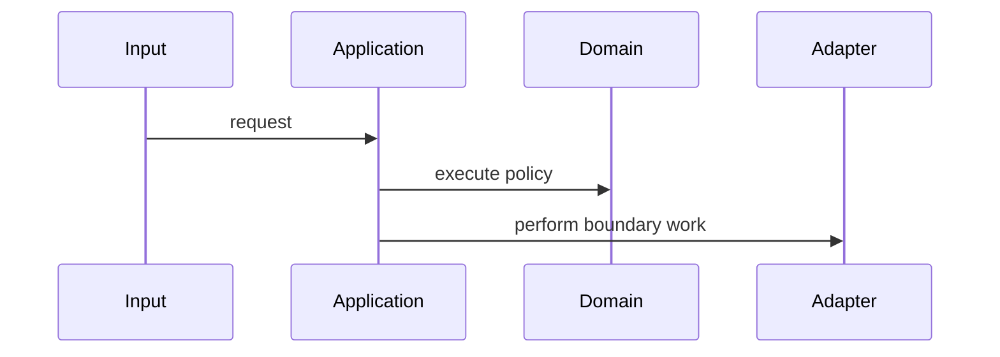

<!--
Create only when the project starts:
projects/{{PROJECT_ID}}-{{PROJECT_SLUG}}/README.md

Projects integrate units; they are not curriculum units.
-->

# {{PROJECT_ID}} — {{PROJECT_TITLE}}

| Field | Value |
|---|---|
| Canonical project | [PROJECTS.md](../../PROJECTS.md#{{PROJECT_ANCHOR}}) |
| Progress | [PROGRESS.md](../../PROGRESS.md) |
| Required unit prerequisites | {{FULL_CANONICAL_IDS}} |
| Recommended prerequisites | {{FULL_CANONICAL_IDS_OR_NONE}} |
| Patterns integrated | {{PATTERNS_AND_PRINCIPLES}} |
| Python baseline | Python 3.14; document Python 3.11 alternatives when relevant |
| Project state | Planned / Active / Complete |
| Branch | `project/{{PROJECT_ID}}` |

## 1. Purpose and problem

{{REALISTIC_PROBLEM}}

## 2. Deliberately poor starting design

{{STARTING_PAIN_AND_EXISTING_BEHAVIOUR}}

## 3. Scope

### Included

- {{ITEM}}

### Excluded

- framework curriculum;
- real cloud infrastructure;
- production database administration;
- distributed-systems depth beyond local simulation;
- unrelated UI work;
- {{PROJECT_SPECIFIC_EXCLUSION}}.

## 4. Staged change pressure

| Stage | New requirement | Force exposed | Expected evidence |
|---:|---|---|---|
| 1 | {{REQUIREMENT}} | {{FORCE}} | {{TEST_OR_DECISION}} |

## 5. Initial architecture visual

```text
{{COMPONENT_OR_DEPENDENCY_DIAGRAM}}
```

### How to read this visual

{{GUIDE}}

### Key insight

{{INSIGHT}}

### Simplification or limitation

{{LIMITATION}}

## 6. Main sequence visual



### How to read this visual

{{GUIDE}}

### Key insight

{{INSIGHT}}

### Simplification or limitation

{{LIMITATION}}

## 7. Functional requirements

1. {{REQUIREMENT}}

## 8. Quality requirements

- idiomatic Python;
- explicit dependencies and lifetimes;
- typed public boundaries where useful;
- deterministic tests;
- explicit failure handling;
- useful observability without sensitive data;
- reproducible commands;
- no speculative framework or pattern layers.

## 9. Tests

| Test layer | Required coverage |
|---|---|
| Characterization | Existing observable behaviour when starting from legacy code |
| Unit | Pure policies, values, and edge cases |
| Contract | Replaceable strategies, adapters, repositories, or plugins |
| Integration | Main use case across the intended boundary |
| Regression | Every seeded defect |

## 10. Seeded defects

- {{DEFECT_WITHOUT_SOLUTION}}

## 11. Refactoring checkpoints

At every checkpoint document:

- current design pressure;
- smallest proposed change;
- preserved behaviour;
- chosen design;
- rejected alternatives;
- tests and observations;
- abstraction removed or retained.

## 12. Decision records

| Decision | Options | Choice | Trade-offs | Evidence |
|---|---|---|---|---|
| {{DECISION}} | {{OPTIONS}} | {{CHOICE}} | {{TRADE_OFFS}} | {{LINK}} |

## 13. Definition of done

- [ ] All staged requirements are implemented.
- [ ] Required tests pass.
- [ ] Seeded defects have regression tests.
- [ ] At least one meaningful refactoring is defended.
- [ ] At least one pattern or abstraction is explicitly rejected.
- [ ] Architecture and sequence visuals are accurate.
- [ ] Failure and observability behaviour is documented.
- [ ] Repository validation passes.
- [ ] A senior interview walkthrough is completed.
- [ ] Project evidence is linked without automatic unit-state inflation.

## 14. Senior interview walkthrough

1. What changed first and why?
2. Which force justified each pattern?
3. What simpler Python design was considered?
4. Which dependency direction matters?
5. Which failure was hardest to diagnose?
6. What would be removed if requirements simplified?
7. Which behaviour is Python-specific and which is design-level?

## 15. Sources

List only sources actually used for subtle mechanics, history, framework behaviour, security, or version claims.
