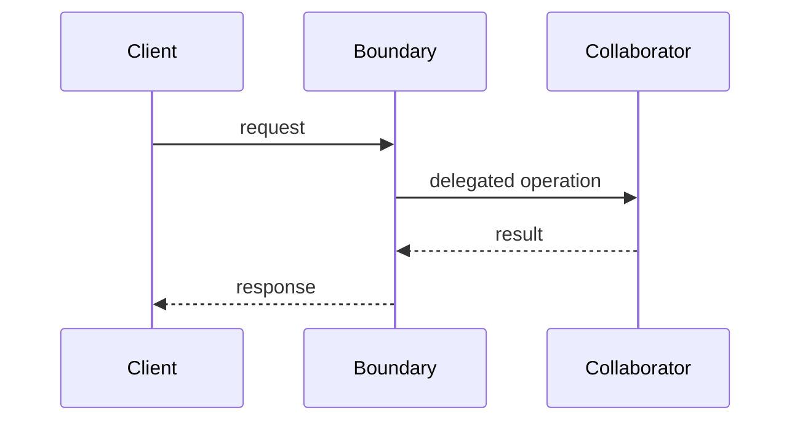

<!--
Copy to units/{{DOMAIN_SLUG}}/{{TOPIC_ID}}-{{TOPIC_SLUG}}/README.md.
Use complete canonical IDs. Remove non-applicable sections instead of writing filler.
Keep exercises unsolved. Cite only sources actually read.
-->

# {{TOPIC_ID}} — {{TOPIC_TITLE}}

## Physical Notebook Core

Keep this section short enough to reconstruct by hand. It is not a duplicate of the full note.

### Problem or change pressure

{{THE_CONCRETE_FORCE_THAT_MAKES_THIS_TOPIC_USEFUL}}

### One-sentence mental model

> {{ONE_SENTENCE_MODEL}}

### One essential visual

```text
{{COMPACT_DEPENDENCY_OBJECT_OR_CALL_VISUAL}}
```

### How to read this visual

{{READING_ORDER_AND_ARROW_MEANING}}

### Key insight

{{ONE_CONCLUSION_TO_REMEMBER}}

### Simplification or limitation

{{WHAT_THE_VISUAL_OMITS_AND_WHETHER_IT_IS_CONCEPTUAL_OR_LITERAL}}

### Governing rules or invariants

1. {{RULE_1}}
2. {{RULE_2}}
3. {{RULE_3}}

### Minimal Python example

```python
{{MINIMAL_IDIOMATIC_EXAMPLE}}
```

### One common misconception

**Mistake:** {{MISCONCEPTION}}

**Correction:** {{CORRECT_MODEL}}

### Important trade-offs

- {{TRADE_OFF_1}}
- {{TRADE_OFF_2}}

### Interview-revision cues

- {{RECOGNITION_CUE}}
- {{COMPARISON_CUE}}
- {{WHEN_NOT_TO_USE_CUE}}

## Unit metadata

| Field | Value |
|---|---|
| Domain | {{DOMAIN_TITLE}} |
| Curriculum | [{{TOPIC_ID}}](../../../CURRICULUM.md#{{TOPIC_ANCHOR}}) |
| Progress | [PROGRESS.md](../../../PROGRESS.md) |
| Python references | [PYTHON_REFERENCES.md](../../../PYTHON_REFERENCES.md) |
| Learning outcome | {{ONE_OBSERVABLE_OUTCOME}} |
| Hard prerequisites | {{FULL_CANONICAL_IDS_OR_NONE}} |
| Soft prerequisites | {{FULL_CANONICAL_IDS_OR_NONE}} |
| Priority | Core / Professional / Advanced / Reference |
| Interview frequency | High / Medium / Low |
| Production frequency | High / Medium / Low |
| Python/backend relevance | High / Medium / Low |
| Depth | D1 / D2 / D3 / D4 |
| Scope | {{SCOPE}} |
| Size | S / M / L / XL |
| Evidence profile | E / I / D / X / (X) / T |
| Canonical Python | Python 3.14 |
| Interview compatibility | Python 3.11 |
| Artifact state | Draft / Approved |

## 1. Simple explanation

{{PLAIN_LANGUAGE_BEFORE_FORMAL_TERMS}}

## 2. Real problem and forces

Describe the stable concern, changing concern, constraints, and why the simplest current design becomes painful.

## 3. History and original context

{{VERIFIED_HISTORY_WITH_NEARBY_CITATIONS}}

Distinguish original context from modern Python interpretation. Remove this section if no useful verified history exists.

## 4. Formal definition

{{PRECISE_ORIGINAL_AND_MODERN_DEFINITION}}

## 5. Participants and responsibilities

| Participant | Responsibility | What it must not own |
|---|---|---|
| {{PARTICIPANT}} | {{RESPONSIBILITY}} | {{BOUNDARY}} |

## 6. Collaboration and execution flow



### How to read this visual

{{READING_GUIDE}}

### Key insight

{{COLLABORATION_INSIGHT}}

### Simplification or limitation

{{CONCEPTUAL_BOUNDARY}}

## 7. Before-pattern code and concrete pain

```python
{{SMALLEST_NAIVE_DESIGN}}
```

Add one realistic requirement and show the exact duplication, coupling, conditional growth, substitution failure, state risk, or testing pain it creates.

## 8. Minimal Pythonic implementation

```python
{{SMALLEST_PATTERN_OR_PRINCIPLE_IMPLEMENTATION}}
```

Explain why each abstraction exists. Do not add Java-style interfaces without a Python need.

## 9. Typed production-oriented implementation

```python
{{TYPED_IMPLEMENTATION_WITH_PROTOCOLS_DATACLASSES_OR_ABCS_ONLY_WHEN_JUSTIFIED}}
```

Include error boundaries, lifecycle, observability, or concurrency only when meaningful.

## 10. Simpler Python alternative

Compare ordinary functions, a callable dictionary, a small module, a dataclass, an enum, a generator, a context manager, direct composition, or explicit dependency passing.

## 11. Refactoring path

1. Preserve behaviour with tests.
2. Identify the concrete force.
3. Introduce the smallest seam.
4. Move one responsibility or dependency.
5. Re-run tests.
6. Add the new requirement.
7. Remove speculative abstraction.

Adapt these steps to the unit.

## 12. Realistic backend use case

{{FRAMEWORK_INDEPENDENT_BACKEND_SCENARIO}}

Use FastAPI or Django only when the framework behaviour materially improves understanding.

## 13. Failure scenario

{{PRODUCTION_OR_DESIGN_FAILURE}}

Explain detection, containment, and recovery when relevant.

## 14. Testing strategy

| Test type | What it proves | What not to overspecify |
|---|---|---|
| Unit | {{BEHAVIOUR}} | {{IMPLEMENTATION_DETAIL}} |
| Contract | {{SUBSTITUTION_OR_ADAPTER_CONTRACT}} | {{CONCRETE_CLASS}} |
| Integration | {{BOUNDARY}} | {{UNRELATED_INFRASTRUCTURE}} |

## 15. Observability and debugging

{{CALL_FLOW_STATE_TRANSITIONS_ERROR_CONTEXT_AND_DIAGNOSTICS}}

## 16. Concurrency and state safety

{{ONLY_WHEN_RELEVANT}}

## 17. Performance and memory

{{ONLY_WHEN_MEANINGFUL_AND_WITHOUT_INVENTED_BENCHMARKS}}

## 18. Variants

- {{VARIANT}}

## 19. Related patterns and combinations

| Related unit | Relationship | Key difference |
|---|---|---|
| `{{RELATED_ID}}` | Alternative / complement / frequent combination | {{DIFFERENCE}} |

## 20. When to use it

- {{FORCE_OR_CONSTRAINT}}

## 21. When not to use it

- {{SIMPLER_OR_SAFER_ALTERNATIVE}}

## 22. Common misuse and overengineering

| Misuse | Why it happens | Better move |
|---|---|---|
| {{MISUSE}} | {{REASON}} | {{ALTERNATIVE}} |

## 23. Interview preparation

### Common formulations

1. {{QUESTION}}

### Weak-answer traps

- {{TRAP}}

### Likely follow-ups

1. {{FOLLOW_UP}}

### Reasoning checkpoints

A strong answer should identify the force, collaboration, trade-offs, simpler Python option, failure handling, and when not to use the design.

## 24. Closed-book revision cues

1. Reconstruct the essential visual.
2. State the governing invariants.
3. Recognize the pattern from a new scenario.
4. Reject one similar pattern.
5. Refactor one smell.
6. Explain one production failure.

## 25. Vocabulary and professional English

Select normally two to five genuinely useful words.

### {{WORD}}

| Item | Content |
|---|---|
| Pronunciation | {{IPA_OR_CLEAR_GUIDE}} |
| Simple English meaning | {{MEANING}} |
| Hindi cue | {{OPTIONAL_SHORT_CUE_OR_EM_DASH}} |
| Meaning in this design context | {{CONTEXT}} |

Natural examples:

1. {{GENERAL_EXAMPLE_1}}
2. {{GENERAL_EXAMPLE_2}}
3. {{GENERAL_EXAMPLE_3}}
4. **Interview:** {{INTERVIEW_EXAMPLE}}
5. **Engineering discussion:** {{ENGINEERING_EXAMPLE}}

## 26. Python Mastery references

Link exact units from `PYTHON_REFERENCES.md`. Give only the minimum bridge when Rahul has not studied them.

## 27. Authoritative sources

List only sources actually read. Keep important citations near the claims they support.

1. {{SOURCE_AND_EXACT_SECTION}}

## 28. Open uncertainties

- {{GENUINE_UNCERTAINTY_OR_SOURCE_CONFLICT}}

Remove this section when none remain.

## 29. Durable clarification log

| Date | Clarification | Why it belongs in canonical notes | Source or evidence |
|---|---|---|---|
| {{YYYY_MM_DD}} | {{CLARIFICATION}} | {{GENERAL_VALUE}} | {{SOURCE_OR_TEST}} |
