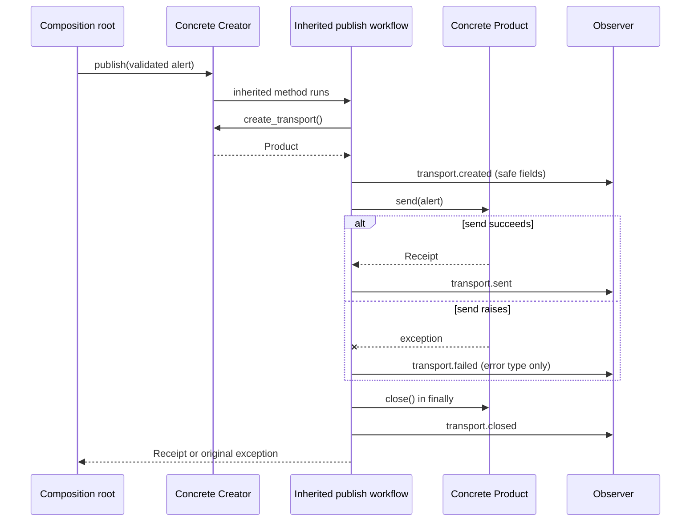

# SDP-CRE-010 — Factory Method

## Physical Notebook Core

### Problem or change pressure

A stable workflow must create one of several compatible collaborators. Each new concrete choice
currently forces the workflow to learn another constructor, configuration shape, and dependency.

### One-sentence mental model

> Keep the workflow stable; move the variable construction decision behind one explicit seam.

### One essential visual

```text
Client ──chooses Creator──► Concrete Creator
                                  │
                            factory method
                                  │ creates
                                  ▼
stable Creator workflow ───uses──► Product contract ◄── Concrete Product
```

### How to read this visual

Read the upper path first: a client chooses a Creator whose overridden factory method constructs
one Product. Then read the lower path: the inherited workflow uses only the Product contract.
`creates` is a construction call; `uses` is ordinary collaboration.

### Key insight

The GoF pattern is not “any function that returns an object.” Its distinguishing mechanism is a
Creator workflow that defers Product construction to an overridable method, usually a subclass.

### Simplification or limitation

This is a conceptual participant diagram, not Python object layout or mandatory architecture. It
omits arguments, errors, lifetime, and the often-better Python option of injecting a factory
callable into a function.

### Governing rules or invariants

1. Construction may vary; the business workflow and Product behavior contract remain stable.
2. Selection, construction, use, and lifetime ownership are explicit separate decisions.
3. Start with direct construction; earn subclass polymorphism from real Creator variation.

### Minimal Python example

```python
from abc import ABC, abstractmethod
from typing import Protocol


class Encoder(Protocol):
    def encode(self, text: str) -> bytes: ...


class Job(ABC):
    def run(self, text: str) -> bytes:
        return self.create_encoder().encode(text)

    @abstractmethod
    def create_encoder(self) -> Encoder: ...
```

### One common misconception

**Mistake:** A module-level `make_encoder(name)` function is automatically the GoF Factory Method.

**Correction:** It is a useful *simple factory function*. The GoF pattern specifically uses a
Creator operation whose subclasses can decide the Concrete Product.

### Important trade-offs

- An override protects a stable Creator workflow but adds inheritance coupling and more types.
- A factory function or injected callable is usually clearer when only construction varies.

### Interview-revision cues

- Name Product, Concrete Product, Creator, Concrete Creator, and the factory method.
- Contrast subclass override with a factory function, callable map, and dependency injection.
- Reject the pattern when direct construction or a small conditional remains easiest to change.

## Unit metadata

| Field | Value |
|---|---|
| Domain | GoF creational patterns |
| Curriculum | [SDP-CRE-010](../../../CURRICULUM.md#sdp-cre-010) |
| Progress | [PROGRESS.md](../../../PROGRESS.md) |
| Python references | [PYTHON_REFERENCES.md](../../../PYTHON_REFERENCES.md) |
| Learning outcome | Move variable construction behind a stable creation decision, then compare class-based Factory Method with a simple Python factory function. |
| Hard prerequisites | [SDP-SOL-020](../../../CURRICULUM.md#sdp-sol-020), [SDP-PYT-010](../../../CURRICULUM.md#sdp-pyt-010), [SDP-PYT-070](../../../CURRICULUM.md#sdp-pyt-070) |
| Soft Python bridge | [PY-BLT-050](https://github.com/rahulyadev/python-mastery/blob/main/CURRICULUM.md#py-blt-050), [PY-BLT-080](https://github.com/rahulyadev/python-mastery/blob/main/CURRICULUM.md#py-blt-080) |
| Priority | Core |
| Interview frequency | High |
| Production frequency | High |
| Python/backend relevance | High |
| Depth | D2 |
| Scope | GoF, Creational, Python |
| Size | L |
| First understanding | 4–6 h |
| Hands-on practice | 5–9 h |
| Evidence profile | E+I+D+T |
| Canonical Python | Python 3.14 |
| Interview compatibility | Python 3.11 |
| Artifact state | Approved |

Frequency labels are curriculum judgments, not measured statistics. A generated, tested, or
published artifact does not establish learner evidence; Rahul's learning state remains separate.

Study the simple ladder first, run the [worked demo](examples/run_factory_demo.py), use the
[construction explorer](visuals/README.md), inspect the [lifetime experiment](experiments/EXP-01-owned-product-lifetime/README.md),
then preserve and attempt the [unsolved lab](practice/README.md).

## 1. Simple explanation

Imagine an alert-publishing workflow:

1. accept a validated alert;
2. obtain a transport;
3. send once;
4. record a safe outcome; and
5. close a transport that the workflow created.

The workflow is stable. The concrete transport changes: a local buffer in tests, a framed emitter
in one deployment, perhaps another adapter later. If `publish` directly names every concrete
constructor, it changes for two unrelated reasons: workflow policy and construction policy.

Factory Method creates a narrow hinge. The workflow calls `create_transport()`. A Concrete Creator
overrides that method and returns the Product it owns. The workflow speaks only to the Product
contract.

Python gives us a second question: **do we need Creator subclasses at all?** If a function can
accept `Callable[[], Transport]`, then a lambda, function, class object, bound method, callable
instance, or `functools.partial` can supply construction without an inheritance tree. That smaller
design is often the production answer.

### Prerequisite bridge

- [SDP-SOL-020](../../../CURRICULUM.md#sdp-sol-020): the supported variation is Product
  construction; the stable workflow is the protected boundary.
- [SDP-PYT-010](../../../CURRICULUM.md#sdp-pyt-010): functions and class objects are first-class
  callables, so behavior and construction can be passed explicitly.
- [SDP-PYT-070](../../../CURRICULUM.md#sdp-pyt-070): a `Protocol` describes the behavior the
  workflow needs without requiring nominal inheritance.
- `PY-BLT-050` / `PY-BLT-080`: dictionary registries require hashable, equality-consistent keys;
  Python dictionaries preserve insertion order, but selection here uses exact key lookup rather
  than order. [Python 3.14 mapping semantics](https://docs.python.org/3.14/reference/datamodel.html#mapping-types).

These bridges permit study. They do not claim the prerequisite units have learner evidence.

## 2. Start with the least factory

The word “factory” attracts architecture too early. Walk this ladder in order.

### 2.1 Direct construction

```python
transport = BufferedTransport(output)
receipt = transport.send(alert)
```

Use this when the Concrete Product is stable and local. The constructor is not a defect.

### 2.2 A small conditional

```python
if name == "buffer":
    transport = BufferedTransport(output)
elif name == "framed":
    transport = FramedTransport(emit, prefix="OPS")
else:
    raise UnknownTransportError(name)
```

For two application-owned choices at one composition root, this may be the clearest design. The
branch exposes all supported cases and is easy to search.

### 2.3 A simple factory function

```python
def make_transport(name: str) -> Transport:
    if name == "buffer":
        return BufferedTransport([])
    if name == "framed":
        return FramedTransport(print)
    raise UnknownTransportError(name)
```

This moves variable construction behind one function. It is valuable, but it is not the GoF
subclass-based Factory Method collaboration.

### 2.4 A dictionary of callables

```python
from collections.abc import Callable

Factory = Callable[[], Transport]
factories: dict[str, Factory] = {
    "buffer": lambda: BufferedTransport([]),
    "framed": lambda: FramedTransport(print),
}
```

Use an explicit map when the application owns several stable names. Validate configuration and
policy before lookup. Do not add dynamic registration merely to avoid editing this visible list.

### 2.5 Dependency injection

```python
def publish(alert: Alert, make_transport: Callable[[], Transport]) -> Receipt:
    product = make_transport()
    try:
        return product.send(alert)
    finally:
        product.close()
```

The caller selects construction. Tests inject a small fake without patching module globals. If the
caller already owns a long-lived transport, inject the ready Product instead and do not close it
inside `publish`.

### 2.6 GoF Factory Method

Use an overridable method when a meaningful Creator family already exists and each subtype owns a
stable construction policy. The inheritance relationship must carry more design meaning than
“this subclass returns a different class.”

The [interactive explorer](visuals/construction-decision-explorer.html) applies this ladder to
eight change pressures.

## 3. Real problem and forces

The worked alert backend has these forces:

| Concern | Stable or variable? | Owner |
|---|---|---|
| Validate alert identity and nonblank message | Stable domain rule | `Alert` |
| Create, send, observe, and close once | Stable workflow | `Publisher.publish` / `_publish_once` |
| Which Product class is constructed | Variable | factory method or injected factory |
| Constructor dependencies and prefix | Deployment wiring | Concrete Creator / composition root |
| Product behavior used by workflow | Stable contract | `Transport` `Protocol` |
| Configured name and allow-list | Variable startup policy | `select_factory` |
| Product lifetime | Explicit per-call policy | workflow that calls the factory |

Direct construction becomes painful only when constructor knowledge repeatedly leaks into a
workflow that should remain stable. A new transport may require another import, branch, dependency,
configuration field, test fixture, and cleanup path. Merely having more than one class is not
enough; the repeated change must strike the same construction boundary.

## 4. History and original context

Gamma, Helm, Johnson, and Vlissides catalogued Factory Method among five creational patterns in
*Design Patterns: Elements of Reusable Object-Oriented Software*. The publisher records the four
authors and its October 1994 publication.
[Addison-Wesley/InformIT bibliographic record](https://www.informit.com/store/design-patterns-elements-of-reusable-object-oriented-software-9780201633610).

The catalog's Factory Method entry centers on an interface for creation whose subclasses decide
the instantiated class. The original context used class-based object-oriented languages; this unit
preserves that participant model while asking whether Python callables remove the need for the
hierarchy.
[Authorized catalog preview](https://www.oreilly.com/library/view/design-patterns-elements/0201633612/front.html).

This note uses original alert examples and diagrams. It does not reproduce the book's prose,
diagram, or example code.

## 5. Formal definition and vocabulary

**Factory Method** is a creational design pattern in which a Creator exposes a method for making a
Product, uses that Product through a stable interface, and permits Concrete Creators to choose the
Concrete Product by overriding the creation method.

This definition has three necessary ideas:

1. there is a Product abstraction used by client/workflow code;
2. creation is a method on a Creator collaboration; and
3. subclass polymorphism can change the Concrete Product without rewriting that collaboration.

Terms that are commonly blurred:

| Term | Meaning in this unit | Is it GoF Factory Method? |
|---|---|---|
| Constructor call | Directly instantiate one class | No |
| Simple factory function | A function selects or constructs Products | Useful related idiom, not the class-based pattern |
| Static factory method | Broad ecosystem term for a named creation method | Not necessarily |
| Alternate constructor | Usually a `classmethod` that creates the same conceptual class from another representation | Not by itself |
| Factory callable | Any callable with a construction contract | Mechanism that may replace the hierarchy |
| GoF Factory Method | Creator method overridden by Concrete Creators | Yes |

“Factory” is an informal family word. Precision matters in interviews and reviews: state the
collaboration you mean, then discuss the simpler Python form.

## 6. Participants and responsibilities

| Participant | Worked-example role | Responsibility | Must not own |
|---|---|---|---|
| Product | `Transport` | Behavior the stable workflow needs: `name`, `send`, `close` | Concrete selection or workflow policy |
| Concrete Product | `BufferedTransport`, `FramedTransport` | Implement transport behavior and local lifecycle state | Choosing itself or orchestrating publication |
| Creator | `Publisher` | Define stable `publish`; declare `create_transport` | Concrete constructor details |
| Concrete Creator | `BufferedPublisher`, `FramedPublisher` | Supply dependencies and override `create_transport` | Duplicating the stable workflow |
| Factory method | `Publisher.create_transport` | Return a Product compatible with `Transport` | Sending the alert or deciding business success |
| Client/composition root | Application wiring | Select a Creator or factory and provide dependencies | Hiding dependencies behind ambient global lookup |

The Product contract describes behavior, not class ancestry. `BufferedTransport` and
`FramedTransport` do not inherit from `Transport`; a static checker accepts them structurally.
Python's typing specification defines protocol compatibility by available members and supports
`__call__` callback protocols for signatures that `Callable[...]` cannot express precisely.
[Typing protocol specification](https://typing.python.org/en/latest/spec/protocol.html) and
[callable specification](https://typing.python.org/en/latest/spec/callables.html#callback-protocols).

## 7. Collaboration and execution flow



### How to read this visual

Time moves downward. The call back from the inherited workflow to the Concrete Creator is the
Factory Method dispatch. Everything after the Product return is ordinary Product collaboration.
The `finally` path runs after success or failure.

### Key insight

The factory method should construct. It should not absorb the business workflow. Otherwise every
Concrete Creator must duplicate sending, error policy, observation, and cleanup.

### Simplification or limitation

This is literal synchronous flow for the worked example, not a distributed transaction. An
external emitter may perform an irreversible effect before raising. Observer failure, cleanup
failure, retries, cancellation, and async contexts need explicit policies beyond this diagram.

## 8. Before-pattern code and concrete pain

```python
def publish_by_name(alert: Alert, name: str, output: list[str]) -> Receipt:
    if name == "buffer":
        transport = BufferedTransport(output)
    elif name == "framed":
        transport = FramedTransport(output.append, prefix="OPS")
    else:
        raise UnknownTransportError(name)

    try:
        receipt = transport.send(alert)
        record_success(alert, transport)
        return receipt
    finally:
        transport.close()
```

This is not bad code. It becomes a boundary problem when:

- multiple workflows copy the same construction branch;
- different deployments need different constructors;
- constructors need dependencies that the workflow should not know;
- tests patch concrete names because there is no injection seam; or
- cleanup and failure policy diverge between copied branches.

Adding `SmsTransport` then changes a function that owns sending and cleanup. The specific pain is
construction policy changing together with stable business collaboration.

Do not “fix” this by moving the entire body into `make_transport`. That would rename the mixed
responsibility rather than separate it.

## 9. Minimal class-based Factory Method

```python
from abc import ABC, abstractmethod


class Publisher(ABC):
    def publish(self, alert: Alert) -> Receipt:
        transport = self.create_transport()
        try:
            return transport.send(alert)
        finally:
            transport.close()

    @abstractmethod
    def create_transport(self) -> Transport:
        """Return a Product; do not run the publication workflow here."""


class BufferedPublisher(Publisher):
    def __init__(self, output: list[str]) -> None:
        self._output = output

    def create_transport(self) -> Transport:
        return BufferedTransport(self._output)
```

Why each abstraction exists:

- `Transport` lets the workflow use different Products safely.
- `Publisher.publish` is the stable Creator operation.
- `create_transport` is the single variable construction decision.
- `BufferedPublisher` is meaningful only if a Publisher subtype is an honest application concept.

An ABC makes an abstract method fail at instantiation and helps navigation. It is not required for
runtime duck typing. A concrete Creator may also provide a default Product and let only exceptional
subclasses override it.

## 10. Production-oriented worked implementation

Read [factory_method.py](examples/factory_method.py). Its stable workflow delegates to a small
private function so the class-based and injected-callable forms share identical lifecycle policy:

```python
def _publish_once(
    alert: Alert,
    make_transport: TransportFactory,
    observe: Observer,
) -> Receipt:
    transport = make_transport()
    try:
        observe(Observation("transport.created", alert.alert_id, transport.name))
        try:
            receipt = transport.send(alert)
        except Exception as error:
            observe(
                Observation(
                    "transport.failed",
                    alert.alert_id,
                    transport.name,
                    type(error).__name__,
                )
            )
            raise
        else:
            observe(Observation("transport.sent", alert.alert_id, transport.name))
            return receipt
    finally:
        transport.close()
        observe(Observation("transport.closed", alert.alert_id, transport.name))
```

The implementation makes several production decisions explicit:

- input validation precedes construction;
- one factory call produces one workflow-owned Product;
- the original send exception propagates;
- cleanup runs in `finally`;
- observations use alert ID, Product name, phase, and exception class;
- message contents and credentials are absent; and
- the factory method owns construction only.

The outer `finally` begins immediately after construction, so even a callback that violates the
observer's documented non-raising contract cannot skip Product cleanup. An observer error may still
become the visible workflow error; production telemetry isolation must choose and test whether to
propagate, suppress, or route that secondary failure.

These are example contracts, not universal Factory Method rules. A connection pool may return a
borrowed resource; a framework may own cleanup; an observer may need isolation. Document the chosen
ownership rather than assuming “factory means new and caller closes.”

Python's language documentation says classes are callable and normally create instances; it also
warns that external resources should be closed explicitly rather than left to garbage collection.
[Python 3.14 data model](https://docs.python.org/3.14/reference/datamodel.html#callable-types).

## 11. The Pythonic factory-callable alternative

```python
def publish_alert(
    alert: Alert,
    make_transport: Callable[[], Transport],
    observe: Observer,
) -> Receipt:
    return _publish_once(alert, make_transport, observe)
```

Callers can supply many things:

```python
from functools import partial

make_one = lambda: BufferedTransport(output)
make_two = partial(FramedTransport, emit, prefix="OPS")
make_three = BufferedTransport  # only if its remaining signature matches
```

Python class objects are callable and normally return new instances. `functools.partial` freezes
some arguments into a new callable. Python 3.14 added positional `Placeholder` support, but this
unit deliberately does not use it so every runnable example remains Python 3.11 compatible.
[Class call semantics](https://docs.python.org/3.14/reference/datamodel.html#classes) and
[`functools.partial`](https://docs.python.org/3.14/library/functools.html#functools.partial).

Use a callback `Protocol` instead of `Callable` when keyword names, overloads, or richer callable
members matter:

```python
class ConfiguredTransportFactory(Protocol):
    def __call__(self, config: TransportConfig) -> Transport: ...
```

The typing specification notes that plain `Callable` cannot express keyword-only parameter names
or defaults, while callback protocols can.
[Typing callable specification](https://typing.python.org/en/latest/spec/callables.html#callback-protocols).

### Pythonic conclusion

If the Creator hierarchy exists only to override one constructor, inject a callable. If Creator
subtypes already represent durable workflow policies and construction naturally belongs to each,
the class-based pattern can be clear.

## 12. Selection is not construction

`build_transport` in [selection.py](examples/selection.py) separates four phases:

```text
raw mapping
   │ validate shape and values
   ▼
TransportConfig
   │ exact registry lookup
   ├── unknown ──► UnknownTransportError
   │ allow-list check
   ├── disabled ─► DisallowedTransportError
   ▼
factory(config)
   │ constructor validation may fail
   ▼
Transport
```

### How to read this visual

Read top to bottom. Each arrow advances to a later phase. Each side exit has a different public
meaning and happens before Product use.

### Key insight

“Could not create transport” is too vague. Malformed configuration, unknown names, policy denial,
constructor failure, and Product execution failure require different diagnosis and often different
HTTP or job outcomes.

### Simplification or limitation

This is a synchronous startup/request boundary. It omits remote configuration consistency,
authorization-service failure, retries, and hot reload.

The explicit registry is built at the composition root:

```python
def application_factories(output, emit):
    return {
        "buffer": partial(buffered_factory, output=output),
        "framed": partial(framed_factory, emit=emit),
    }
```

That dictionary is application policy. Adding a supported local Product is expected to edit it.
The registry should not silently default on miss: a typo such as `BUFFER` must not choose another
transport. Sort names only for stable diagnostics; do not use insertion order as a hidden priority.

## 13. Configuration validation and public errors

Validate in layers:

| Layer | Example rejection | Public meaning | Must happen before |
|---|---|---|---|
| Syntax/shape | non-string name, unknown field | `ConfigurationError` | registry lookup |
| Availability | well-formed `missing` name | `UnknownTransportError` | construction |
| Deployment policy | known but disabled `buffer` | `DisallowedTransportError` | construction |
| Constructor invariant | lowercase frame prefix | `ValueError` or mapped construction error | Product use |
| Product behavior | emitter raises | original domain/infrastructure error | success event |

Do not pass an unchecked configuration dictionary into arbitrary constructors. Accept only known
fields, normalize only by documented policy, and never include tokens, message bodies, or entire
config objects in errors and logs.

Unknown and disallowed must remain distinct. Revealing the full list of available providers to an
untrusted remote client may be inappropriate; the worked example's detailed message is intended
for trusted application startup and tests. That disclosure choice is a security boundary, not a
pattern mechanic.

## 14. Alternate constructors are a different idea

```python
@dataclass(frozen=True)
class TransportConfig:
    name: str
    prefix: str = "ALERT"

    @classmethod
    def from_mapping(cls, raw: Mapping[str, object]) -> "TransportConfig":
        # validate representation, then return this conceptual type
        return cls(name=str(raw["name"]), prefix=str(raw.get("prefix", "ALERT")))
```

`from_mapping` is an alternate constructor. It gives `TransportConfig` another input
representation. It does not choose among Product roles for a Creator workflow.

A classmethod receives the class, including a derived class when called on one. It can therefore
support polymorphic construction, but mechanism alone does not establish the Factory Method
pattern. Ask what varies and what collaboration is protected.
[Python 3.14 `classmethod` documentation](https://docs.python.org/3.14/library/functions.html#classmethod).

Prefer alternate constructors when:

- one conceptual type has several validated representations;
- construction belongs naturally to that type; and
- callers do not need a separately replaceable factory dependency.

## 15. Inheritance override versus composition

| Question | Creator subclass override | Injected factory callable |
|---|---|---|
| Selection point | subtype choice | function argument / field |
| Coupling | nominal Creator hierarchy | callable signature and Product contract |
| Test seam | instantiate test subclass | pass lambda/fake factory |
| Constructor dependencies | fields on Concrete Creator | closure, partial, callable object, container |
| Discoverability | override navigation in class tree | explicit wiring references |
| Multiple independent policies | subclass combinations can multiply | compose values independently |
| Best fit | meaningful existing workflow family | construction is the only variation |
| Main risk | fragile or combinatorial inheritance | unstructured wiring or imprecise callable type |

Composition is not automatically better. An injected callable can be wired inconsistently, close
over mutable global state, or hide too much in a lambda. Give complex construction a named
function or callable object and test its contract.

## 16. Dependency and lifetime ownership

A factory answer is incomplete until it states:

1. Does each call return a new Product, a cached Product, a borrowed Product, or a proxy?
2. Who owns dependencies captured by the factory?
3. Who closes the Product, and on which failure paths?
4. Can construction partially acquire resources before failing?
5. What happens if cleanup also fails?

The worked Creator calls its factory once per `publish`, so it owns and closes that returned
Product. [EXP-01](experiments/EXP-01-owned-product-lifetime/README.md) observes both success and
failure traces.

If a composition root injects an already-open Product:

```python
def publish_with_borrowed(alert: Alert, transport: Transport) -> Receipt:
    return transport.send(alert)  # caller still owns close()
```

Do not close a borrowed dependency. Conversely, returning a new file/socket/client without a clear
close path leaks a resource regardless of how elegant the pattern diagram looks.

For context-managed Products, prefer a factory returning a context manager and use `with`; for
asynchronous resources, use an async context manager. Do not rely on `__del__` or prompt garbage
collection for correctness. The Python data model explicitly recommends deterministic resource
release with `try`/`finally` or `with`.
[Python 3.14 object lifetime guidance](https://docs.python.org/3.14/reference/datamodel.html#objects-values-and-types).

## 17. Business workflow must remain separate

Bad “factory”:

```python
def make_transport_and_publish(config: Config, alert: Alert) -> Receipt:
    transport = select_and_construct(config)
    validate_business_policy(alert)
    receipt = transport.send(alert)
    record_success(receipt)
    return receipt
```

This hides selection, construction, domain validation, side effects, and observation behind a
creation name. It is harder to reuse a Product, test the workflow, or assign ownership.

Better boundaries:

```text
composition root: validate config → choose/bind factory
factory:          dependencies + config → Product
workflow:         domain input + Product → domain result/effects
Product:          perform one compatible collaboration
```

A factory may perform construction-specific validation and assembly. It should not decide whether
an alert is allowed to send, retry business operations, write audit records, or convert domain
failure into an HTTP response unless that behavior is explicitly part of the factory's documented
contract—which would usually indicate a different abstraction name.

## 18. Composition roots and import boundaries

Place concrete imports where the application assembles its object graph:

```text
domain/workflow module ──imports──► Product Protocol and domain values
concrete module          ──imports──► Product Protocol
composition root         ──imports──► workflow + concrete modules
```

### How to read this visual

Arrows mean source imports, not runtime calls. Both workflow and implementations point toward the
small contract; the outer composition root knows concrete choices.

### Key insight

Moving constructor calls without moving concrete imports may leave the original coupling intact.
The composition root is allowed to know details because assembly is its job.

### Simplification or limitation

Python modules can contain several roles, and annotations may be guarded to avoid runtime cycles.
This is an architectural direction guide, not a required package-per-class layout.

Avoid decorator-based auto-registration in a core domain module merely to make the registry look
empty. Imports execute module code, and failed imports are removed from `sys.modules` while
side-effect-loaded modules may remain; hidden import-time mutation introduces ordering and test
isolation concerns.
[Python 3.14 import system](https://docs.python.org/3.14/reference/import.html#loading).

Use dynamic discovery only when independently deployed providers are a real requirement. That is a
registration and trust boundary, not something Factory Method supplies automatically.

## 19. Observability and debugging

Observe phases, decisions, and safe identities:

| Event | Useful safe fields | Never include by default |
|---|---|---|
| `factory.selected` | configured alias, deployment, allow-list result | tokens, entire config mapping |
| `transport.created` | Product alias/class, alert ID, lifetime scope | alert message/body |
| `transport.failed` | phase, exception class, correlation ID | credentials, arbitrary exception payload |
| `transport.closed` | Product alias, cleanup result | object `repr` if it contains config |

When debugging, ask in order:

1. Was configuration parsed?
2. Which exact name was selected?
3. Was the name available and allowed?
4. Which factory object was called?
5. Did construction fail before returning a Product?
6. Did Product use fail?
7. Was cleanup attempted, and did it fail?

Do not catch a broad exception around selection *and* Product execution, then report everything as
“unknown factory.” Keep error scopes narrow so tracebacks retain the real phase.

Observer failure needs a policy. The worked example assumes a synchronous, non-raising observer.
A production system might isolate telemetry failure, but silently swallowing every observer error
can hide monitoring loss. Test the chosen behavior.

## 20. Concurrency and state safety

Factory Method itself makes no thread-safety or async guarantee. Analyze the state each callable
captures:

- a class object with immutable constructor arguments is usually straightforward;
- a closure over a mutable list shares that list across Products;
- a stateful callable factory may need synchronization;
- a process-global registry can be mutated while another task reads it;
- a cached Product can accidentally cross request, tenant, or event-loop boundaries; and
- per-call creation avoids shared Product state but may increase setup cost.

Prefer immutable or startup-frozen mappings for application-owned registries. If runtime mutation
is required, define atomic update/read semantics and test them under the actual concurrency model.
The GIL is not a design-level ownership contract and alternate Python runtimes or multi-process
deployments have different state boundaries.

For async Products, do not type an async factory as a synchronous `Callable[[], Product]`. Use an
awaitable-returning protocol, and state whether cancellation during construction or cleanup leaves
partial resources.

## 21. Performance and memory

Do not introduce caching or pooling because “factories are expensive.” Measure the actual
constructor and request workload.

Relevant questions:

- Is construction CPU work, local allocation, or external connection setup?
- How many Products are created per request/job?
- Does caching retain tenant data or credentials?
- Can one Product safely serve concurrent callers?
- Does a pool already exist in the library?
- Is cleanup cost observable and bounded?

A dictionary lookup, virtual method call, or Python function call is rarely the dominant backend
cost beside network I/O, but this is a professional inference, not a benchmark claim for every
workload. Keep the simpler design until profiling identifies construction as material.

## 22. Refactoring path

1. Freeze current behavior, errors, and side-effect order with tests.
2. Name the variable construction decision and the stable workflow.
3. Keep direct construction if the decision does not actually vary.
4. Move one repeated branch into a factory function or composition root.
5. Make Product behavior explicit with a small `Protocol` only if typing or multiple
   implementations benefit.
6. Inject the Product or factory into the stable workflow.
7. Add configuration and allow-list errors at the selection boundary.
8. State lifetime ownership and test cleanup on failure.
9. Add a Creator method only if an existing hierarchy should own the variation.
10. Add the new Product without duplicating the workflow.
11. Remove speculative registry, subclass, or locator machinery.

At every step, ask: **what new requirement is easier now, and what indirection did we pay for?**

## 23. Realistic backend use case

At application startup:

1. parse a trusted deployment mapping into `TransportConfig`;
2. import the known concrete adapters in the composition root;
3. build a local registry of factory callables with dependencies bound by `partial`;
4. reject unknown or disallowed names;
5. inject the chosen factory into the alert workflow; and
6. create/close one short-lived transport per job only if that is the stated adapter contract.

At request or job time:

1. validate the `Alert` domain value;
2. call the injected factory exactly once;
3. use the returned `Transport` through its protocol;
4. emit safe phase observations; and
5. close the owned Product on success and failure.

Framework dependency containers can perform step 5's injection, but that is framework-managed
composition, not proof of Factory Method. Keep the domain workflow testable without booting the
framework.

## 24. Failure scenarios and containment

### 24.1 Constructor partially acquires a resource

The factory must clean up anything it acquired before it can return a complete Product. The caller
cannot close an object it never received.

### 24.2 Product use fails after an external effect

Propagate a meaningful error and record the phase. A retry may duplicate the effect; Factory Method
does not supply idempotency. The workflow needs an explicit retry/idempotency policy.

### 24.3 Cleanup fails while another exception is active

Decide which error is primary and how the cleanup error is preserved. A context manager or explicit
exception chaining can make that policy visible. Do not casually mask the send failure.

### 24.4 Configuration rolls out inconsistently

Different workers may select different factories. Include deployment/config version in safe
startup observations and validate before accepting work. Deterministic local lookup does not make
distributed rollout atomic.

### 24.5 Dynamic registration imports an untrusted provider

Discovery can execute provider code. Treat allowed package sources, signatures, isolation, and
capability limits as a supply-chain/security problem. A registry is not a sandbox.

### 24.6 Creator subclass violates the Product contract

Static typing catches structural mismatches but not semantic violations. Run the same Product
contract tests against every implementation and keep behavioral expectations explicit.

## 25. Testing strategy

| Test type | What it proves | Do not overspecify |
|---|---|---|
| Domain unit | invalid alerts fail before construction | dataclass implementation details |
| Creator unit | override returns a compatible Product and stable workflow uses it | exact private helper layout |
| Factory contract | each configured factory accepts supported config and returns compatible Product | nominal class ancestry |
| Selection unit | malformed, unknown, and disallowed cases differ deterministically | dictionary insertion mechanics |
| Product contract | all Products honor send/receipt/close behavior | identical internal algorithms |
| Lifetime unit | new/borrowed ownership and cleanup order | garbage-collection timing |
| Observability unit | safe phase fields and error type are emitted | incidental log formatting |
| Integration | composition root binds real constructor dependencies correctly | unrelated framework startup |
| Concurrency | promised registry/factory state semantics under chosen runtime model | an imagined universal GIL guarantee |

Prefer a recording Product/factory over mocks of every constructor call:

```python
created = 0


def factory() -> Transport:
    global created
    created += 1
    return BufferedTransport([])


publish_alert(Alert("A-1", "ok"), factory, lambda event: None)
assert created == 1
```

Use constructor-call assertions only when “exactly once” is part of the lifetime contract. Most
tests should assert observable behavior and public errors.

The worked suite also tests independent per-call Products, cleanup after failure, exact selection,
registry isolation, secret-free observations, positive static typing, and visual-data parity.

## 26. Direct comparisons with related designs

These are bounded recognition comparisons. Their future units remain un-authored here.

| Related design | Choose it when | Difference from Factory Method |
|---|---|---|
| [SDP-CRE-020 — Abstract Factory](../../../CURRICULUM.md#sdp-cre-020) | One choice must create a coherent family of related Products | Family of creation operations, not one overridable Product method |
| [SDP-CRE-030 — Builder](../../../CURRICULUM.md#sdp-cre-030) | Construction is staged, optional, validated, or assembled step by step | Separates construction process/stages from final representation |
| [SDP-CRE-040 — Prototype](../../../CURRICULUM.md#sdp-cre-040) | A configured exemplar should be copied | Creates from an existing object rather than selecting a constructor |
| [SDP-BEH-010 — Strategy](../../../CURRICULUM.md#sdp-beh-010) | Runtime behavior/algorithm varies | Strategy is the collaborator used; a factory may construct/select it |
| Dependency injection | A caller/composition root should supply dependencies explicitly | Assembly principle/technique; may inject a Product or factory |
| [SDP-PYT-090 — Dynamic registration](../../../CURRICULUM.md#sdp-pyt-090) | Independently shipped providers extend the available set | Discovery/registration lifecycle, not Product creation policy itself |
| Service locator | Code pulls a dependency from a registry at use time | Hides dependency and lookup behind ambient access; usually reject |

### Factory Method versus Abstract Factory

Ask **one Product or coherent family?** A Creator's `create_transport()` returns one Product role.
An Abstract Factory might provide `create_transport()`, `create_encoder()`, and `create_retry_policy()`
whose implementations must remain mutually compatible. Do not rename a dictionary containing one
constructor “Abstract Factory.”

### Factory Method versus Builder

Ask **selection or stages?** Factory Method chooses how one Product comes into being. Builder
coordinates a multi-step assembly. A factory method can return a Builder, but that combines two
distinct forces.

### Factory Method versus Prototype

Ask **constructor or exemplar?** If the desired Product already exists in a deeply configured form
and copying semantics are the real difficulty, Prototype owns the question. Do not copy mutable
state casually just to avoid a constructor.

### Factory Method versus Strategy

Ask **creation or behavior?** `Transport` may act as a Strategy-like replaceable behavior for the
workflow. Factory Method describes how the workflow gets it. A factory returning a Strategy does
not make the two pattern names interchangeable.

### Factory Method versus dependency injection

Injection answers **who supplies the dependency?** Factory Method answers **where construction is
deferred and how a Concrete Creator chooses it?** Injecting a factory callable often removes the
need for Creator subclasses.

### Factory Method versus service locator

```python
def publish(alert: Alert) -> Receipt:
    transport = global_services.get("transport")
    return transport.send(alert)
```

The signature hides the dependency; tests and readers must know global state. Prefer a parameter
or constructor field. A registry is acceptable at a composition root where lookup is explicit;
passing the locator deep into domain code is the smell.

## 27. Variants

- **Abstract Creator:** `create_transport` is abstract; every Concrete Creator must decide.
- **Default Creator:** base Creator constructs a common Product; special subclasses override.
- **Parameterized factory method:** the method accepts a validated enum/value and may choose one of
  several Products. If the subclass relationship adds no value, a function is often clearer.
- **Injected method implementation:** a Creator stores a factory callable rather than requiring an
  override; this is composition and dependency injection.
- **Class object as factory:** pass `ConcreteProduct` directly when its constructor signature
  already matches the factory contract.
- **Partial factory:** bind infrastructure dependencies at assembly time with `functools.partial`.
- **Callable object factory:** keep explicit state or metrics in an object implementing `__call__`.
- **Registry-backed factory:** resolve a validated application-owned name to a callable.
- **Async/context-managed factory:** represent asynchronous construction and lifetime explicitly.

## 28. When to use it

Use class-based Factory Method when most of these are true:

- a stable Creator operation already exists;
- Product construction varies across meaningful Creator subtypes;
- the workflow must remain independent of concrete constructors;
- Product implementations satisfy one behavioral contract;
- subclass selection is stable, visible application policy;
- lifecycle ownership can be documented and tested; and
- adding a Concrete Creator is cheaper than growing repeated construction branches.

Use the broader factory idea—but probably a function—when variable construction is real but no
Creator hierarchy is earned.

## 29. When not to use it

- There is one stable constructor.
- A two-case conditional at a composition root remains clearest.
- Callers can inject the ready Product directly.
- Only one function needs a replaceable constructor callable.
- The variation is algorithm behavior: consider Strategy or a function.
- The variation is a related Product family: compare Abstract Factory.
- Construction is multi-stage: compare Builder.
- Existing configured state should be copied: compare Prototype.
- The design requires global lookup from business code: use explicit injection.
- The proposed hierarchy predicts future Products without observed change pressure.

## 30. Common misuse and overengineering

| Misuse | Why it fails | Better move |
|---|---|---|
| One Creator subclass per trivial constructor | Type count rises without meaningful polymorphism | Inject a function/class/partial |
| Calling every `make_*` function Factory Method | Loses the GoF participant distinction | Say “simple factory function” |
| Factory runs the whole workflow | Construction and business policy remain coupled | Return a Product; let workflow use it |
| Product chooses its own concrete type | Selection becomes circular and hidden | Put policy in composition root/Creator |
| Registry defaults on typo | Misconfiguration silently selects behavior | Exact lookup and explicit error |
| Global mutable registry in tests | Import/order leakage and races | Build an isolated mapping per app/test |
| Dynamic registration for fixed choices | Hidden import-time mutation | Explicit dictionary of callables |
| Logging full config/object repr | Secrets and user data leak | Emit allow-listed safe fields |
| Factory caches by default | Lifetime and tenant state become implicit | State new/cached/borrowed semantics |
| Caller closes borrowed Product | Breaks outside owner | Make ownership part of contract |
| ABC plus Protocol plus wrapper for one function | Redundant abstraction layers | Keep one useful contract |
| Service locator called “DI” | Dependencies disappear from signatures | Inject at a visible boundary |

An architecture with `ITransportFactory`, `BaseTransportFactory`, `DefaultTransportFactory`,
`TransportFactoryRegistry`, and one `BufferedTransport` is not “more SOLID.” It has more places to
navigate and more contracts that can disagree.

## 31. Interview preparation

### A concise strong answer

> Factory Method keeps a Creator workflow dependent on a Product abstraction while an overridable
> creation method lets Concrete Creators choose the Concrete Product. In Python I first test whether
> direct construction, a small conditional, or an injected factory callable is enough; I keep the
> class hierarchy only when Creator subtypes are meaningful. I also state selection errors,
> dependency/lifetime ownership, and cleanup.

### Common formulations

1. Define Factory Method and name its participants.
2. Implement it in Python.
3. Is a factory function the same pattern?
4. Why not call the constructor directly?
5. Compare Factory Method with Abstract Factory and Strategy.
6. How would you test a Creator?
7. Where should configuration selection live?
8. Who closes a Product created by a factory?
9. When would you reject inheritance?
10. What production failures does the pattern not solve?

### Weak-answer traps and exact missing reasoning

| Weak answer | Missing reasoning step |
|---|---|
| “It creates objects without `new`.” | Python uses callable classes; name the stable workflow and deferred decision |
| “A factory is any function returning an object.” | Distinguish simple factory vocabulary from GoF subclass override |
| “It follows OCP.” | State the specific supported variation and remaining wiring edit |
| “Use an abstract base factory.” | Justify the Creator hierarchy against an injected callable |
| “The registry handles everything.” | Separate config validation, availability, policy, construction, and execution |
| “Mocks make it testable.” | Identify the explicit Product/factory seam and observable contract |
| “The factory owns the object.” | State new/cached/borrowed semantics and actual close owner |
| “Use it when there are many classes.” | Count is not pressure; show repeated constructor coupling |
| “Abstract Factory creates more objects.” | Explain coherent Product families, not quantity alone |
| “DI and Factory Method are the same.” | Injection supplies; Factory Method defers via Creator override |

### Likely follow-ups

1. What if Product creation needs a request-scoped database session?
2. What if Products are expensive and thread-safe?
3. What if providers come from separately installed packages?
4. What if a configured name is known but disabled for one tenant?
5. What if cleanup raises after Product use already failed?
6. How do class objects and `partial` satisfy a factory contract?
7. Why might a callback `Protocol` be better than `Callable`?
8. Could a classmethod be a Factory Method?

## 32. Interview transfer prompts

Answer one at a time. Each prompt includes the reasoning gap a reviewer should identify.

### Prompt 1 — fixed local choices

One CLI selects JSON or text output once at startup. A candidate proposes five Creator classes.
What do you choose?

**Exact gap if weak:** failing to compare the maintenance cost of a visible two-case conditional
with inheritance.

### Prompt 2 — existing workflow family

Every import job subtype shares retry, metrics, and checkpoint flow but constructs a different
parser compatible with one protocol. What earns Factory Method?

**Exact gap if weak:** failing to identify the already-meaningful Creator hierarchy and the one
construction decision inside its stable workflow.

### Prompt 3 — request-scoped dependency

A Product needs a transaction owned by the request. Should the Product factory open its own global
transaction?

**Exact gap if weak:** failing to align construction with the request's lifetime/composition root.

### Prompt 4 — plugin providers

Third-party packages can add transports. Is a hard-coded dictionary still sufficient?

**Exact gap if weak:** failing to separate factory construction from discovery, trust, duplicates,
import failures, and activation.

### Prompt 5 — service locator review

Business code calls `services.get("mailer")` inside its method. Why is this not healthy injection?

**Exact gap if weak:** failing to notice the hidden dependency, ambient state, and late lookup
failure.

### Prompt 6 — alternate constructor

`Invoice.from_csv(row)` returns an `Invoice`. Is that GoF Factory Method?

**Exact gap if weak:** classmethod syntax is not the pattern; identify same-type representation
conversion versus Creator/Product variation.

## 33. Code-review exercise

```python
FACTORIES: dict[str, object] = {}


class Publisher:
    def publish(self, name: str, alert: Alert) -> Receipt:
        factory = FACTORIES.get(name, BufferedTransport)
        product = factory()  # type: ignore[operator]
        try:
            return product.send(alert)
        except Exception:
            print(f"failed: {alert!r} with {product!r}")
            raise UnknownTransportError(name)
```

Find at least eight issues:

1. ambient mutable registry;
2. imprecise `object` typing;
3. silent default on typo;
4. no known-versus-disallowed distinction;
5. constructor signature is assumed;
6. broad exception mislabels Product failure as selection failure;
7. full alert and Product representations may leak secrets;
8. no cleanup;
9. unclear new/cached/borrowed lifetime;
10. business method performs late global selection; and
11. the class has no meaningful Factory Method override despite its name.

The first correction is not necessarily more classes. Start with typed explicit wiring and narrow
error scopes.

## 34. Closed-book revision cues

1. Draw the two-path participant visual from memory.
2. State the three governing invariants.
3. Define Product, Concrete Product, Creator, Concrete Creator, and factory method.
4. Distinguish a simple factory function and alternate constructor.
5. Walk direct call → conditional → function → callable map → injection → override.
6. Explain selection versus construction versus use.
7. State who owns a new and a borrowed Product.
8. Name safe observation fields and secret fields to omit.
9. Compare Abstract Factory, Builder, Prototype, Strategy, DI, and service locator.
10. Give one scenario that earns a Creator hierarchy and one that rejects it.

## 35. Practice, examples, experiment, and visual

| Artifact | Purpose | Evidence boundary |
|---|---|---|
| [Worked implementation](examples/factory_method.py) | GoF hierarchy, injected callable, Product contract, safe observation, cleanup | Maintainer example, not learner implementation |
| [Selection implementation](examples/selection.py) | config validation, callable registry, partial binding, explicit errors | Application-owned synthetic wiring |
| [Runnable demo](examples/run_factory_demo.py) | compare class, function, and configured construction | Deterministic local output only |
| [Typing witnesses](examples/typing_contracts.py) | Product and factory structural compatibility | Positive static checks only |
| [EXP-01](experiments/EXP-01-owned-product-lifetime/README.md) | observe cleanup on success and failure | Synchronous controlled probe |
| [Construction explorer](visuals/README.md) | choose least-powerful boundary from change pressure | Conceptual; embedded data contract-tested |
| [Unsolved practice](practice/README.md) | predict → run → observe → explain → refactor → vary | Preserves starter and no learner evidence |

## 36. Sources actually read

1. Gamma, Erich; Helm, Richard; Johnson, Ralph; Vlissides, John. *Design Patterns: Elements of
   Reusable Object-Oriented Software*. Addison-Wesley, 1994. The
   [publisher record](https://www.informit.com/store/design-patterns-elements-of-reusable-object-oriented-software-9780201633610)
   verifies authorship/publication; the
   [authorized catalog preview](https://www.oreilly.com/library/view/design-patterns-elements/0201633612/front.html)
   was read for the Factory Method entry and neighboring creational distinctions.
2. [Python 3.14 data model](https://docs.python.org/3.14/reference/datamodel.html) — callable classes,
   callable instances, method binding, mapping behavior, object lifetime, and explicit resource
   cleanup guidance.
3. [Python 3.11 data model](https://docs.python.org/3.11/reference/datamodel.html) — compatibility
   check for the same callable-class and resource-lifetime mechanics.
4. [Python 3.14 built-in `classmethod`](https://docs.python.org/3.14/library/functions.html#classmethod)
   — derived-class binding and current version history.
5. [Python 3.14 `functools.partial`](https://docs.python.org/3.14/library/functools.html#functools.partial)
   — argument binding and the 3.14 `Placeholder` addition.
6. [Python typing protocol specification](https://typing.python.org/en/latest/spec/protocol.html) and
   [callable specification](https://typing.python.org/en/latest/spec/callables.html) — structural
   assignability and callback protocols.
7. [Python 3.14 import system](https://docs.python.org/3.14/reference/import.html) — module loading,
   execution, failure, and caching boundaries relevant to registration.

## 37. Python 3.11 and 3.14 compatibility

All runnable unit code uses Python 3.11-compatible syntax and standard-library APIs. The core
Factory Method mechanics used here—classes as callables, `classmethod`, abstract methods,
`Protocol`, dictionaries, closures, and `functools.partial`—are available at the interview floor.

No material 3.14 behavior change alters the pattern's collaboration. Python 3.14 added positional
`functools.Placeholder` support; examples avoid it and bind only leading or keyword arguments so
they run unchanged on 3.11. The classmethod documentation also records that wrapping other
descriptors was deprecated in 3.11 and removed in 3.13; this unit does not stack `classmethod` over
another descriptor.

## 38. Review checklist

- [ ] The construction change pressure is real and named.
- [ ] The stable workflow does not import or branch on Concrete Products.
- [ ] Product behavior is smaller than a speculative framework interface.
- [ ] The GoF class collaboration and Python factory-function idiom are distinguished.
- [ ] Direct construction, conditional, callable map, and injection were considered first.
- [ ] Configuration rejects unknown fields and ambiguous names.
- [ ] Unknown and disallowed Products have distinct errors.
- [ ] Constructor dependencies are bound at a visible composition root.
- [ ] New, cached, borrowed, or pooled lifetime semantics are documented.
- [ ] Owned Products close on success and failure.
- [ ] Observations omit messages, tokens, and full configuration.
- [ ] Factory and registry state match the concurrency model.
- [ ] Import-time registration is used only for a genuine provider boundary.
- [ ] Product contract tests cover every implementation.
- [ ] A callable is chosen when subclassing adds no durable meaning.
