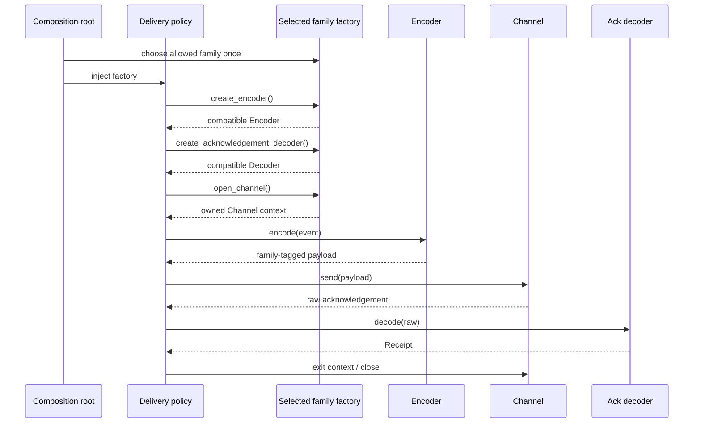

# SDP-CRE-020 — Abstract Factory

## Physical Notebook Core

### Problem or change pressure

One policy workflow needs several related objects. Choosing a deployment family changes all of
them, and mixing products from different families breaks a compatibility rule.

### One-sentence mental model

> Make one family choice, then create every related product through that coherent family boundary.

### One essential visual

```text
                                      ┌─► Encoder ───────┐
composition root ─► Family Factory ───┼─► Channel ───────┼─► stable policy
        chooses one family            └─► Ack Decoder ───┘
                                           same family invariant
```

### How to read this visual

Read left to right. The composition root chooses one Concrete Factory. The factory's three
creation operations produce different Product roles. The bracket means the products must agree on
one compatibility family; arrows mean construction or injection, not inheritance.

### Key insight

Abstract Factory is about **coherent product families**, not about collecting several unrelated
constructors behind one object.

### Simplification or limitation

This conceptual view omits configuration errors, partial construction, resource cleanup, and
whether products are new, cached, pooled, or borrowed. It also omits the smaller answer: inject a
ready validated bundle when repeatable creation is unnecessary.

### Governing rules or invariants

1. One selected factory represents one named product family.
2. Every returned Product satisfies both its role contract and the cross-product compatibility
   invariant.
3. Selection, construction, business use, and lifetime ownership remain explicit boundaries.

### Minimal Python example

```python
from typing import Protocol


class Encoder(Protocol):
    def encode(self, message: str) -> bytes: ...


class Sender(Protocol):
    def send(self, payload: bytes) -> str: ...


class DeliveryFamily(Protocol):
    def create_encoder(self) -> Encoder: ...
    def create_sender(self) -> Sender: ...


def deliver(message: str, family: DeliveryFamily) -> str:
    return family.create_sender().send(family.create_encoder().encode(message))
```

The short form shows the shape, not the full safety story. Real code must state why the returned
encoder and sender are compatible and who closes the sender.

### One common misconception

**Mistake:** Any object with two or more `create_*` methods is an Abstract Factory.

**Correction:** The methods must create **related or dependent Product roles** selected as one
family. A clock factory, logger factory, and UUID factory placed together are merely a constructor
bag unless one meaningful compatibility invariant relates them.

### Important trade-offs

- Adding a new family is localized; adding a new Product role changes the Abstract Factory
  contract and every Concrete Factory.
- The family boundary prevents concrete coupling, but it adds concepts and can hide a simple
  startup composition that ordinary dependency injection would express more directly.

### Interview-revision cues

- Say “one family choice, multiple related Product roles, compatibility invariant.”
- Contrast Abstract Factory with one-product Factory Method and a ready bundle injected by the
  composition root.
- Reject it when there is one stable family, no cross-product rule, or no need to create products
  after assembly.

## Unit metadata

| Field | Value |
|---|---|
| Domain | GoF creational patterns |
| Curriculum | [SDP-CRE-020](../../../CURRICULUM.md#sdp-cre-020) |
| Progress | [PROGRESS.md](../../../PROGRESS.md) |
| Python references | [PYTHON_REFERENCES.md](../../../PYTHON_REFERENCES.md) |
| Learning outcome | Create coherent families of related objects without binding policy code to concrete implementations, and identify when ordinary dependency injection is simpler. |
| Hard prerequisites | [SDP-CRE-010](../SDP-CRE-010-factory-method/README.md), [SDP-FND-050](../../foundations/SDP-FND-050-composition-delegation-inheritance/README.md) |
| Soft Python bridge | [PY-OBJ-010](https://github.com/rahulyadev/python-mastery/blob/main/CURRICULUM.md#py-obj-010), [PY-OBJ-020](https://github.com/rahulyadev/python-mastery/blob/main/CURRICULUM.md#py-obj-020), [PY-OBJ-030](https://github.com/rahulyadev/python-mastery/blob/main/CURRICULUM.md#py-obj-030), [PY-BLT-050](https://github.com/rahulyadev/python-mastery/blob/main/CURRICULUM.md#py-blt-050), [PY-BLT-080](https://github.com/rahulyadev/python-mastery/blob/main/CURRICULUM.md#py-blt-080) |
| Priority | Professional |
| Interview frequency | Medium |
| Production frequency | Medium |
| Python/backend relevance | Medium |
| Depth | D2 |
| Scope | GoF, Creational |
| Size | L |
| First understanding | 4–6 h |
| Hands-on practice | 5–9 h |
| Evidence profile | E+I+D+T |
| Canonical Python | Python 3.14 |
| Interview compatibility | Python 3.11 |
| Artifact state | Approved |

Frequency labels are curriculum judgments, not measured statistics. Maintainer-authored notes,
tests, and publication do not establish learner evidence; Rahul's learning state stays separate.

Study the decision ladder first, run the [worked demo](examples/run_abstract_factory_demo.py), use
the [product-family explorer](visuals/README.md), observe the
[partial-acquisition experiment](experiments/EXP-01-atomic-family-acquisition/README.md), and then
preserve and attempt the [unsolved lab](practice/README.md).

## 1. Simple explanation

Imagine a backend that delivers a small event. One deployment uses JSON; another uses a compact
pipe protocol. Each protocol needs three collaborators:

1. an Encoder that creates the wire payload;
2. a Channel that sends that payload and returns an acknowledgement; and
3. an Acknowledgement Decoder that interprets the response.

Choosing only the encoder is unsafe. A JSON encoder paired with a pipe Channel produces bytes that
the Channel cannot understand. A pipe acknowledgement paired with a JSON decoder also fails. The
products form a **family** because their wire contract makes them meaningful together.

The policy workflow should say “encode, send, decode.” It should not say `JsonEncoder()`,
`JsonChannel()`, or `PipeAcknowledgementDecoder()`. A family factory gives the workflow all three
roles while keeping the concrete family choice at the composition root.

But first ask a smaller question: does the workflow need to create these objects repeatedly? If
the composition root builds one coherent set at startup and the workflow uses it once or shares it
under a clear lifetime, inject a `DeliveryBundle` directly. That is ordinary dependency injection,
and it may solve the whole problem with less indirection.

### Prerequisite bridge

- [SDP-CRE-010](../SDP-CRE-010-factory-method/README.md) separates one variable Product creation
  decision from a stable workflow. Abstract Factory widens the creation boundary to several
  related Product roles.
- [SDP-FND-050](../../foundations/SDP-FND-050-composition-delegation-inheritance/README.md) supplies
  the core move: clients collaborate with contained objects through composition instead of
  inheriting their behavior.
- `PY-OBJ-010`, `PY-OBJ-020`, and `PY-OBJ-030` bridge construction, composition, delegation, and
  overriding. The design does not require every Product to inherit a common runtime base class.
- `PY-BLT-050` and `PY-BLT-080` matter only when configuration selects a family through a mapping:
  names need exact lookup, stable equality, and hashing behavior.

These bridges allow study. They do not claim that prerequisite learner evidence exists.

## 2. Start with the smallest design

Do not begin by drawing four interfaces and six classes. Climb only as far as the observed change
pressure demands.

### 2.1 Direct construction

```python
encoder = JsonEncoder()
with JsonChannel(output) as channel:
    receipt = JsonAcknowledgementDecoder().decode(channel.send(encoder.encode(event)))
```

Use this when JSON is the only real family and the code is local. Concrete names are honest and
searchable. “Depends on a concrete class” is not automatically a defect.

### 2.2 A ready coherent bundle through dependency injection

```python
with JsonChannel(output) as borrowed_json_channel:  # composition root owns this context
    bundle = DeliveryBundle(
        family=WireFamily.JSON_V1,
        encoder=JsonEncoder(),
        channel=borrowed_json_channel,
        acknowledgement_decoder=JsonAcknowledgementDecoder(),
    )
    receipt = deliver_with_bundle(event, bundle)
```

The composition root chooses and validates the family once. The policy receives exactly what it
needs. Prefer this when products already exist for the entire workflow lifetime and no client-side
creation policy remains.

### 2.3 A function that returns a bundle

```python
def make_json_bundle(output: list[bytes]) -> DeliveryBundle:
    return DeliveryBundle(
        WireFamily.JSON_V1,
        JsonEncoder(),
        JsonChannel(output),
        JsonAcknowledgementDecoder(),
    )
```

This simple family factory function is often enough in Python. Here the Channel is a borrowed
ready Product whose outer owner must close it after the bundle's scope. The function can bind
dependencies, validate configuration, and return one coherent bundle without a class hierarchy.
Call it what it is; it has the Abstract Factory *responsibility*, but not necessarily the classic
object collaboration.

### 2.4 A structural Abstract Factory

```python
class DeliveryFamilyFactory(Protocol):
    @property
    def family(self) -> WireFamily: ...

    def create_encoder(self) -> Encoder: ...
    def open_channel(self) -> AbstractContextManager[Channel]: ...
    def create_acknowledgement_decoder(self) -> AcknowledgementDecoder: ...
```

This boundary earns its cost when policy code must ask the selected family to create related
products repeatedly, creation lifetimes differ by role, or several clients share the family
policy.

### 2.5 Registry or plugin discovery

A mapping of validated names to factory builders can select a Concrete Factory at a composition
root. Dynamic package discovery may add independently shipped families. Neither mechanism is part
of Abstract Factory itself. Add them only for real configuration or deployment variation.

## 3. Change pressure and family invariant

Separate four concerns:

| Concern | Stable or variable? | Owner |
|---|---|---|
| Deliver an event by encode → send → decode | Stable policy | Workflow/client |
| Choose `json-v1` versus `pipe-v1` | Deployment variation | Composition root |
| Construct products for the chosen family | Family variation | Concrete Factory |
| Enforce wire compatibility | Cross-product invariant | Factory plus defensive boundary checks |

Without a family boundary, every call site can independently choose three concrete objects. Two
families and three roles already permit eight theoretical combinations, while only two are valid.
The goal is not to eliminate combinations mathematically; it is to make the valid combination the
natural construction path and detect an invalid combination before an external effect.

The worked example gives each factory and Product a `WireFamily` identity. Structural typing proves
that an object has the required operations. It does **not** prove that a JSON encoder's semantic
wire contract matches a Channel. Runtime family validation and contract tests cover that semantic
gap.

## 4. History and original context

The 1994 Addison-Wesley catalog lists Abstract Factory among the five creational patterns in
*Design Patterns: Elements of Reusable Object-Oriented Software* by Erich Gamma, Richard Helm,
Ralph Johnson, and John Vlissides. The catalog intent is to create families of related or dependent
objects without naming concrete classes.
[Publisher catalog preview](https://www.oreilly.com/library/view/design-patterns-elements/0201633612/front.html).

An authorized InformIT excerpt uses portable user-interface look-and-feel families and names the
classic participants: AbstractFactory, ConcreteFactory, AbstractProduct, and ConcreteProduct. It
also stresses that related products are designed to be used together.
[InformIT Abstract Factory excerpt](https://www.informit.com/articles/article.aspx?p=1398599).

Modern Python changes the implementation options, not the underlying force. A `Protocol`, a
function returning a bundle, a module, or an immutable object can carry the family responsibility.
The classic UML-style interface hierarchy is one implementation, not the definition.

## 5. Formal definition in operational language

An Abstract Factory is a replaceable creation boundary that:

1. declares one operation for each abstract Product role needed by a client;
2. lets each Concrete Factory create the corresponding Concrete Products;
3. makes one Concrete Factory selection switch the complete Product family; and
4. keeps client policy dependent on Product and factory contracts rather than concrete classes.

The extra word **coherent** is essential in production: products are related by a version,
platform, tenant capability, transaction protocol, serialization format, or another compatibility
constraint. If removing one product has no effect on whether the others work together, the object
may be a general dependency provider rather than an Abstract Factory.

## 6. Participants and responsibilities

| Participant | Responsibility | Must not own |
|---|---|---|
| Client/policy workflow | Ask for Product roles and coordinate domain work | Concrete family selection or secrets |
| Abstract Factory | State the available Product creation operations | Business workflow or global lookup |
| Concrete Factory | Construct one coherent family and bind family dependencies | HTTP error translation or unrelated services |
| Abstract Product | Describe one behavior role the Client needs | Knowledge of every family |
| Concrete Product | Implement one role for one family | Selecting sibling products from ambient state |
| Composition root | Parse configuration, allow-list, import concretes, choose/inject factory | Per-request domain policy |
| Compatibility gate | Reject mismatched family identity/capability before effects | Pretending static typing proves semantics |
| Lifetime owner | Close products it created or acquired | Closing borrowed dependencies |

One Python class may perform two roles in a small application, but the responsibilities should
remain explainable separately.

## 7. Collaboration and execution flow



### How to read this visual

The root makes the configuration choice once. The Client asks the same selected factory for each
role, validates family coherence, and uses Products through their contracts. The Channel context
ends even if encode, send, or decode fails.

### Key insight

The factory is used for **creation**; it does not run the delivery policy. The Client remains the
orchestrator and makes side-effect order visible.

### Simplification or limitation

The sequence is synchronous and shows one Channel. It does not promise atomic external delivery,
idempotency, retry, thread safety, or successful cleanup. The experiment covers partial
multi-resource acquisition separately.

## 8. Before-pattern code and concrete pain

```python
def deliver(event: Event, family_name: str, output: list[bytes]) -> Receipt:
    if family_name == "json-v1":
        encoder = JsonEncoder()
        channel = JsonChannel(output)
        decoder = JsonAcknowledgementDecoder()
    elif family_name == "pipe-v1":
        encoder = PipeEncoder()
        channel = PipeChannel(output)
        decoder = PipeAcknowledgementDecoder()
    else:
        raise UnknownFamilyError(family_name)

    with channel:
        return decoder.decode(channel.send(encoder.encode(event)))
```

This is not bad merely because it contains an `if`. At one composition root it may remain the
clearest code. Pain appears when the same family branch is repeated across policies, callers can
mix individual roles, resource ownership differs, or a third family forces policy modules to
import another concrete set.

A particularly dangerous “refactor” moves only the three constructors to helper functions while
leaving `family_name` branching and concrete imports in every policy. Construction moved; the
family decision did not.

## 9. Minimal Pythonic pattern implementation

```python
from dataclasses import dataclass
from typing import Protocol


class Codec(Protocol):
    family: str

    def encode(self, text: str) -> bytes: ...


class Sink(Protocol):
    family: str

    def write(self, data: bytes) -> None: ...


class Family(Protocol):
    family: str

    def create_codec(self) -> Codec: ...
    def create_sink(self) -> Sink: ...


@dataclass(frozen=True)
class JsonFamily:
    family: str = "json-v1"

    def create_codec(self) -> Codec:
        return JsonCodec()

    def create_sink(self) -> Sink:
        return JsonSink()
```

No ABC or shared Concrete Factory base class is required. Mypy can accept `JsonFamily`
structurally. Python's typing specification defines Protocol compatibility from available members,
while runtime duck typing remains a separate mechanism.
[Typing protocol specification](https://typing.python.org/en/latest/spec/protocol.html).

The sketch still needs a semantic family check or stronger construction design: matching method
signatures do not prove that two byte formats agree.

## 10. Worked production-oriented implementation

The runnable [`examples/abstract_factory.py`](examples/abstract_factory.py) adds:

- frozen `Event`, `Payload`, `Receipt`, and `Observation` values;
- `Encoder`, `Channel`, `AcknowledgementDecoder`, and `DeliveryFamilyFactory` Protocols;
- JSON-v1 and pipe-v1 Concrete Product families;
- exact malformed/unknown/disallowed configuration errors;
- a registry-alias versus factory-family check;
- family checks before writes and after decode;
- a fresh owned Channel context per `deliver` call;
- allow-listed observations containing no message body or credentials; and
- `DeliveryBundle` plus `deliver_with_bundle` as the smaller DI alternative.

The policy operation is deliberately short:

```python
def deliver(event: Event, factory: DeliveryFamilyFactory, observe: Observer) -> Receipt:
    encoder = factory.create_encoder()
    decoder = factory.create_acknowledgement_decoder()
    require_coherent_products(factory, encoder, decoder)
    with factory.open_channel() as channel:
        require_same_family(factory, channel)
        payload = encoder.encode(event)
        receipt = decoder.decode(channel.send(payload))
    return receipt
```

The maintained source has phase observations and failure reporting around this core. Read the real
file before reasoning about exact error behavior.

## 11. Why the family invariant matters

Per-role interfaces answer separate questions:

- Can this object encode an `Event`?
- Can this object send a `Payload`?
- Can this object decode acknowledgement bytes?

They do not answer: **do these three interpretations of bytes agree?** That is a relational
property. Common ways to represent it include:

1. **Family identity tag:** simple and observable; runtime checked.
2. **Opaque family-specific value types:** stronger static separation, but generic typing can
   become heavy and third-party boundaries still need runtime validation.
3. **Capability/version negotiation:** useful across real remote protocols; more failure states.
4. **Construction encapsulation:** never expose mixable parts; offer one higher-level facade. This
   may be even safer when clients do not need individual Products.

The example uses identity tags because the teaching goal is visible. Do not scatter `family`
string checks throughout business code. Validate at assembly and effect boundaries, then keep
policy expressed in domain terms.

## 12. Abstract Factory versus ordinary dependency injection

Dependency injection answers **who supplies collaborators?** Abstract Factory answers **how one
selected creation object supplies multiple compatible Product roles?** They can combine, but they
are not synonyms.

Prefer ready-object or ready-bundle injection when:

- the graph is built once at startup or request entry;
- the Client does not need to create fresh Products;
- lifetimes are already owned by the composition root/framework;
- one constructor function can assemble the complete bundle; and
- the bundle has a clear domain name and validation point.

Prefer an Abstract Factory when:

- the Client legitimately creates Products after initial assembly;
- several related roles must change together;
- creation is repeated per job/request/tenant under an explicit scope;
- Concrete Families bind different dependencies or acquisition rules; and
- passing every Product separately would make invalid family combinations easy.

Framework DI containers do not make a design an Abstract Factory. A container may construct and
inject the selected Concrete Factory, or it may construct and inject a ready bundle so that no
factory reaches policy code.

## 13. Abstract Factory versus Factory Method

Use the predecessor question first:

| Question | Factory Method | Abstract Factory |
|---|---|---|
| Primary pressure | Vary creation of one Product role inside a stable Creator workflow | Switch several related Product roles as one family |
| Typical operation shape | One overridable factory method | One creation operation per Product role |
| Classic variation mechanism | Subclass decides the Concrete Product | Concrete Factory object represents the family |
| Client concern | Stable Creator workflow uses one Product contract | Client coordinates several Product contracts |
| Python simplification | Inject one factory callable | Inject a ready bundle or function returning a bundle |

A Concrete Abstract Factory may implement each `create_*` operation using Factory Method. That is
a composition of mechanisms, not proof the names are interchangeable.

Diagnostic prompt: “If `create_encoder` were the only creation operation, would a meaningful
family relation remain?” If no, the design is one-product factory logic, not Abstract Factory.

## 14. Abstract Factory versus a bag of constructors

```python
@dataclass
class Factories:
    make_clock: Callable[[], Clock]
    make_logger: Callable[[], Logger]
    make_uuid: Callable[[], UUID]
```

This can be good dependency injection. It becomes an Abstract Factory only if one selected variant
defines a meaningful compatible family across those roles. Merely living in one dataclass is not
a relationship.

Ask three tests:

1. What one decision changes all returned roles together?
2. What invalid mixed combination can occur?
3. What client capability requires repeatable creation rather than ready collaborators?

If the answers are “none,” “none,” and “none,” prefer direct parameters, a named bundle, or a small
composition function.

## 15. Configuration and selection boundary

Configuration input is data, not a constructor name to import or execute.

```python
factory = select_factory(
    configured_name,
    allowed_names=frozenset({"json-v1"}),
    registry={
        "json-v1": lambda: JsonDeliveryFactory(json_wire),
        "pipe-v1": lambda: PipeDeliveryFactory(pipe_wire),
    },
)
```

The worked selection policy intentionally:

- rejects blank or whitespace-dependent names as malformed;
- uses exact, case-sensitive lookup instead of silent normalization;
- distinguishes an unknown name from a known but disallowed family;
- checks that the registry alias agrees with the returned factory identity; and
- returns the selected factory without logging full configuration.

Different products may need different rules. State them. Normalizing case may be correct for a
human-facing CLI and dangerous for a signed protocol identifier. Defaulting on an unknown name
may be safe for display themes and unsafe for persistence or encryption formats.

## 16. Error boundaries

| Phase | Example failure | Detection/containment | Public meaning |
|---|---|---|---|
| Parse | blank or noncanonical family name | Before registry lookup | Malformed configuration |
| Selection | no exact alias | Before construction/effect | Unknown family |
| Policy | installed alias not allow-listed | Before construction/effect | Disallowed family |
| Construction | dependency or context acquisition fails | Concrete Factory or acquisition owner cleans partial state | Family unavailable |
| Coherence | Product family tag disagrees | Before encode/send where possible | Invalid assembly/provider |
| Encode | domain value cannot become payload | No Channel effect yet | Invalid/unsupported event |
| Send | external effect fails or is uncertain | Preserve cause; apply explicit retry/idempotency policy | Delivery failed/unknown |
| Decode | response violates selected wire contract | Preserve safe response metadata, not raw secret data | Invalid acknowledgement |
| Cleanup | Channel close fails | Do not silently mask primary failure | Resource cleanup failure |

Do not wrap every phase in `except Exception: raise UnknownFamilyError`. That destroys the exact
fault boundary. The example observes the phase and error type, then re-raises the original error.
A production adapter may translate exceptions, but should preserve causality with chaining and
avoid exposing secret payloads.

Abstract Factory gives no rollback or exactly-once guarantee. If `send` reached an external system
before the connection failed, a retry can duplicate the effect. Idempotency belongs to the
workflow/protocol, not to the factory name.

## 17. Lifetimes, ownership, and cleanup

For every Product operation, document:

1. new, cached, pooled, or borrowed;
2. owner of captured dependencies;
3. close/exit responsibility;
4. partial-acquisition cleanup; and
5. sync versus async context.

In the worked design, encoders and decoders are cheap values; `open_channel()` returns a new
context manager per delivery. The Client that opens it owns its exit. A ready borrowed Channel
would instead stay owned by the composition root and must not be closed per call.

When a family opens multiple resources, `ExitStack` can register each successful acquisition and
unwind in reverse order if a later one fails. Its callbacks do not run merely because the stack is
garbage-collected; deterministic exit is required.
[Python 3.14 `contextlib` documentation](https://docs.python.org/3.14/library/contextlib.html#contextlib.ExitStack).
The [lifetime experiment](experiments/EXP-01-atomic-family-acquisition/README.md) makes both success
and partial-failure traces observable.

Python 3.11 changed `ExitStack.enter_context()` to raise `TypeError` rather than `AttributeError`
for a non-context-manager. The examples rely on valid contexts and behave the same on 3.11 and
3.14; tests should not assert the older pre-3.11 exception.
[Python 3.11 `contextlib` change note](https://docs.python.org/3.11/library/contextlib.html#contextlib.ExitStack.enter_context).

For asynchronous Products, use `AsyncExitStack`/`async with`, type awaitable construction
explicitly, and define cancellation cleanup. Never call blocking acquisition from the event loop
merely because it sits behind a factory.

## 18. Observability without secrets

Useful observations identify decisions and phases, not entire objects:

| Event | Allow-listed fields | Exclude by default |
|---|---|---|
| `family.selected` | canonical family alias, deployment/config version | token, complete config mapping |
| `family.products_created` | family, Product role names, lifetime scope | object `repr`, connection strings |
| `family.incompatible` | expected/actual family IDs, role | payload or acknowledgement body |
| `delivery.failed` | phase, safe event ID, exception type, correlation ID | event message, credentials, raw response |
| `delivery.succeeded` | safe event ID, family, latency bucket if measured | user content |
| `family.closed` | role, cleanup outcome | secret-bearing constructor arguments |

The example's `Observation` has only `phase`, `event_id`, `family`, and `error_type`. An observer is
assumed not to raise. Production code must choose whether telemetry failure propagates, is isolated
and counted, or is routed to a fallback. Silently swallowing every observer exception can conceal
loss of monitoring.

Debug in phase order: parse → select → allow → construct → validate family → encode → enter/open →
send → decode → exit/close. One broad “factory failed” log makes diagnosis slower and can wrongly
trigger configuration remediation for an external I/O incident.

## 19. Testing strategy

| Test type | What it proves | Do not overspecify |
|---|---|---|
| Domain unit | Invalid Events fail before family work | Dataclass-generated method details |
| Product contract | Every encoder/channel/decoder satisfies role behavior | Identical algorithms across families |
| Family contract | Every Concrete Factory returns Products with one coherent identity | Concrete class ancestry |
| Selection unit | Malformed, unknown, disallowed, and alias-mismatch cases differ | Mapping implementation internals |
| Policy unit | Workflow uses a fake family and preserves effect order | Private helper calls unrelated to behavior |
| Negative composition | Mixed products fail before output mutation | Every impossible Python object mutation |
| Lifetime unit | New/borrowed ownership and cleanup on success/failure | Garbage-collection timing |
| Observability unit | Safe fields and failure phases are emitted | Exact log-rendering whitespace |
| Integration | Concrete dependencies speak the real wire/storage API | Unrelated framework startup |
| Concurrency | Promised factory/registry semantics under the real model | A universal claim based on the GIL |

Run the same family conformance tests for every Concrete Factory. Static Protocol checking catches
missing or incompatible members, not wire semantics, cleanup order, secret leakage, or external
behavior.

Prefer small recording fakes:

```python
class RecordingFactory:
    family = WireFamily.JSON_V1
    # creation methods append role names, then return compatible in-memory Products
```

Patch a concrete constructor only when the constructor call itself is the public lifetime
contract. Most policy tests should assert Receipt, output effects, error phase, and cleanup.

## 20. Concurrency and mutable state

Abstract Factory provides no thread-safety, task-safety, or process-sharing guarantee. Inspect
state at four levels:

- **Factory object:** immutable selection metadata may be shared; mutable counters need a policy.
- **Captured dependency:** the example's output list is intentionally in-memory and not safe as a
  general concurrent transport.
- **Returned Product:** a new Channel per call isolates lifecycle, but its underlying pool/client
  might still be shared.
- **Registry:** startup-frozen mappings are easier to reason about than runtime global mutation.

A frozen dataclass prevents attribute reassignment; it does not make a captured list, client, or
closure transitively immutable. Do not claim safety from `frozen=True` alone.

If runtime registration is required, define lock/atomic-snapshot behavior, duplicate-name policy,
visibility across worker processes, deregistration behavior, and what happens to in-flight calls.
Often it is simpler to build a new immutable registry and swap it at a controlled boundary.

## 21. Import and composition boundaries

```text
policy module ─────imports────► Product/factory Protocols + domain values
json adapter ──────imports────► contracts
pipe adapter ──────imports────► contracts
composition root ─imports────► policy + selected concrete adapters
```

Concrete imports belong where the application assembles the graph. Passing a factory while the
policy module still imports every Concrete Product does not fully remove source coupling.

Avoid an import-time decorator registry for two fixed application-owned families. Module imports
execute code and cache modules; hidden mutation introduces ordering and test-isolation problems.
When independently distributed providers are real, `importlib.metadata.entry_points(group=...)`
can discover them at the outer boundary, after which the application must validate trust,
duplicates, version compatibility, and factory contracts.

The keyword-filtered `entry_points(group=...)` form exists in Python 3.11. Python 3.12 standardized
an `EntryPoints` return object and Python 3.13 removed tuple-like access from individual
`EntryPoint` objects, so compatibility code should iterate named attributes rather than index an
entry point as a tuple.
[Python 3.14 `importlib.metadata` entry points](https://docs.python.org/3.14/library/importlib.metadata.html#entry-points).

Loading an entry point imports provider code. Discovery is therefore a deployment and supply-chain
boundary, not a sandbox. Abstract Factory constrains the returned shape; it does not establish
provider trust.

## 22. Dynamic registration

Use dynamic registration only when providers ship independently from the application. A robust
composition boundary should decide:

1. trusted distribution/source policy;
2. entry-point group and unique canonical name;
3. duplicate and version-conflict behavior;
4. load failure isolation and startup availability policy;
5. Product-family conformance tests;
6. lifecycle and unload limitations; and
7. observability that omits provider secrets.

Do not pass a mutable global plugin registry into domain policy as a service locator. Discover at
startup, validate, freeze an application-owned mapping, select the factory, and inject it.

## 23. Performance and memory

The pattern itself does not imply expensive construction. Measure the actual boundary:

- Are encoders small stateless values that can be reused?
- Does `open_channel` allocate a local wrapper or establish a network connection?
- Does a library already own connection pooling?
- Would caching cross tenant, credential, event-loop, or request boundaries?
- How many Products are created per operation?
- Does an expanded factory retain resources that only one policy uses?

Function calls, Protocols, and small objects are rarely the dominant cost next to backend I/O, but
that is engineering judgment, not a benchmark claim. Do not add caching before profiling, and do
not let a factory silently change from “new per call” to “shared singleton” as an optimization.

## 24. Refactoring path

1. Preserve existing outputs, error types, effect order, and cleanup with tests.
2. Mark every concrete family selection and constructor call.
3. Name Product roles and the cross-product compatibility invariant.
4. Keep the conditional if it occurs once at the composition root.
5. Inject a ready Product set or named bundle first.
6. If the Client needs repeatable creation, introduce one factory operation per related role.
7. Move concrete imports and configuration allow-listing to the composition root.
8. Add runtime/provider family validation before external effects.
9. State new/cached/pooled/borrowed lifetime for each operation.
10. Add a second/third family without changing stable policy.
11. Run one conformance suite against every family.
12. Remove speculative registries, inheritance, and Product operations.

At each step ask: “Which real family change is easier, and which invalid combination became
harder?” If there is no concrete answer, the abstraction may be premature.

## 25. Realistic backend uses

Good candidates have a genuine family invariant:

- cloud-provider clients where queue, object-store, and identity adapters must share one account,
  region, credential scope, and retry semantics;
- protocol versions where encoder, transport framing, and acknowledgement parser change together;
- storage dialect families where statement compiler, parameter binder, and result decoder must
  agree; and
- test/production infrastructure families when the test family preserves the same semantic
  contracts rather than merely returning permissive mocks.

Beware the first example: SDK clients may already expose one session or client factory. Wrapping
each service only to display the pattern can add no value. A composition function returning a
typed application bundle may be clearer.

The worked example is framework-independent. FastAPI dependencies, Django settings, or another
container may live in the composition root, but the family and Product contracts should remain
testable without starting the framework.

## 26. Failure scenarios and recovery judgment

### 26.1 Mixed family assembled by a faulty provider

Detect family identity before send, emit expected/actual IDs without payload data, quarantine or
reject the provider, and fail closed. Do not silently coerce one wire format into another.

### 26.2 Second Product acquisition fails

The acquisition owner closes every earlier successfully opened Product. The factory cleans any
resource it acquired before returning a Product. The Client cannot clean an object it never
received. Use the experiment to distinguish those two ownership points.

### 26.3 Send outcome is uncertain

Preserve the causal error and correlation/idempotency identifier. Do not reconstruct the entire
family and retry blindly. External effect policy belongs to the workflow.

### 26.4 Cleanup fails during a primary exception

Choose which error remains primary and how the other is chained or recorded. Context-manager
`__exit__` methods can suppress or replace errors; that behavior must be intentional and tested.

### 26.5 Configuration rollout differs across workers

Report a safe configuration version and selected family at startup. Exact local registry lookup
does not make a multi-process deployment atomic. Coordinate rollout outside the pattern.

### 26.6 Observer fails

Apply an explicit policy. Critical audit recording might fail the operation; best-effort metrics
might be isolated with a fallback counter. A factory cannot decide this for every business use.

## 27. Variants

- **Class-based Abstract Factory:** nominal ABC/interface and Concrete Factory subclasses.
- **Structural factory:** a Protocol implemented without inheritance, as in the worked example.
- **Function returning a bundle:** compact Python form for one assembled family.
- **Module as family:** module-level constructors/constants when one import-selected family is
  sufficiently explicit and testable.
- **Parameterized family object:** immutable configuration plus creation methods.
- **Context-managed family scope:** entering the factory opens shared resources; exiting closes the
  complete family. State reentrancy and concurrency rules.
- **Async family:** creation methods return async context managers or awaitables.
- **Prototype-backed factory:** Concrete Factory copies configured exemplars internally; Prototype
  remains a separate creation mechanism.
- **Registry-selected family:** explicit application mapping chooses Concrete Factory.
- **Plugin-provided family:** trusted package discovery adds Concrete Factories at deployment time.

## 28. Adding families versus adding Product roles

Abstract Factory favors a stable set of Product roles with a growing or replaceable set of
families.

Adding `cbor-v1` usually means new encoder, Channel, decoder, and Concrete Factory while Client code
stays unchanged. Adding a new `create_signature_verifier()` role changes the factory contract and
every existing Concrete Factory, test family, fake, registry provider, and conformance suite.

This “horizontal versus vertical” trade-off is central interview judgment. If Product roles change
frequently, a large Abstract Factory becomes a release-coordination hotspot. Split factories only
along real cohesion/lifetime boundaries; do not create one tiny factory per method and lose the
family guarantee.

## 29. When to use it

Use Abstract Factory when most of these are true:

- one configuration/platform/protocol choice determines several Product roles;
- mixed Products are invalid or risky;
- Client policy should not import concrete families;
- the Product-role set is more stable than the family set;
- the Client needs repeated or scoped creation after dependency assembly;
- lifetime and error boundaries can be stated per creation operation; and
- conformance tests can verify every family.

## 30. When not to use it

- One concrete family is stable and local.
- Products are unrelated; there is no compatibility invariant.
- A composition root can inject ready collaborators or one validated bundle.
- One Product creation decision varies: use a function or compare Factory Method.
- One object has complex staged construction: compare Builder.
- A framework/container already owns the complete lifetime and the Client never creates.
- The proposed factory is a global service locator in disguise.
- Product roles change more often than families and every interface edit causes widespread churn.
- Dynamic discovery is speculative rather than a deployment requirement.

## 31. Common misuse and overengineering

| Misuse | Why it fails | Better move |
|---|---|---|
| `FactoryFactory` creates one Concrete Factory for two fixed cases | Adds naming layers around one conditional | Select in the composition root |
| Bag of unrelated `make_*` methods | No family invariant exists | Inject explicit dependencies or a named bundle |
| Every Product has ABC + Protocol + base implementation | Contracts can disagree and navigation grows | Keep the one typing/runtime mechanism actually needed |
| Factory also runs business workflow | Creation, policy, retry, and observation couple again | Return Products; let Client orchestrate |
| Each Product chooses siblings from a global registry | Dependencies and family choice become hidden | Inject one family at a visible boundary |
| Default on unknown config | Misconfiguration silently selects semantics | Exact lookup and explicit failure |
| Family tag only, no contract tests | Equal strings do not prove behavior | Run family/Product conformance suites |
| Cache every Product | Tenant and lifetime boundaries become implicit | State and measure new/shared/pool behavior |
| Import-time plugin registration | Order, mutation, and test isolation become hidden | Discover/validate/freeze at startup |
| Log factory or config `repr` | Credentials and payloads may leak | Allow-list safe identifiers |
| One giant factory for the entire application | It becomes a service locator/composition root passed everywhere | Split by cohesive family and inject narrowly |
| Abstract Factory chosen for “future flexibility” | Current code pays for imagined variants | Keep direct construction until pressure appears |

## 32. Interview preparation

Ask these one at a time. Do not move to the next until the reasoning gap is named.

### Prompt 1

“A service supports JSON and pipe protocols. Each needs an encoder, sender, and response decoder.
What pattern, if any, would you choose?”

**Strong path:** identify family compatibility; locate configuration at the composition root; ask
whether products are created once or repeatedly; choose a ready bundle first if sufficient.

**Exact missing reasoning step:** saying “Abstract Factory because there are many classes” without
naming the invalid mixed combination.

### Prompt 2

“Why is this not just Factory Method?”

**Strong path:** Factory Method varies one Product creation operation in a Creator workflow;
Abstract Factory switches several Product roles through one family object. They may collaborate.

**Exact missing reasoning step:** comparing class diagrams without first counting related Product
roles and identifying the family decision.

### Prompt 3

“Why not inject all three ready objects?”

**Strong path:** accept that DI is simpler when assembly/lifetime happens once; justify a factory
only for repeated, deferred, or scoped Product creation.

**Exact missing reasoning step:** treating a design-pattern name as automatically preferable to
visible construction.

### Prompt 4

“How do you ensure products from one family are compatible in Python?”

**Strong path:** separate structural role typing from semantic compatibility; discuss family tags,
opaque types/capabilities, assembly validation, effect-boundary defenses, and conformance tests.

**Exact missing reasoning step:** claiming a `Protocol` or common ABC proves wire-level semantics.

### Prompt 5

“What happens when opening the second family resource fails?”

**Strong path:** name the acquisition owner, clean already-open Products in reverse order, require
the factory to clean partial construction before return, and preserve the causal error.

**Exact missing reasoning step:** assigning cleanup to a Client that never received the failed
Product.

### Prompt 6

“How would independently installed families register?”

**Strong path:** keep discovery at startup, use trusted entry-point policy, handle duplicates and
versioning, validate/freeze registry, then inject one selected factory.

**Exact missing reasoning step:** placing mutable import-time registration or global lookup inside
business policy.

### Concise strong answer

> Abstract Factory represents one choice among coherent families and exposes one creation
> operation per related Product role. Client policy depends on the factory and Product contracts,
> while a Concrete Factory creates a mutually compatible set. In Python I first try a composition
> function or ready bundle injected at the root. I keep the factory only when repeated or scoped
> family-wide creation is real, then make configuration, compatibility checks, errors, lifetimes,
> cleanup, and conformance tests explicit.

## 33. Closed-book revision cues

1. Reconstruct the root → family factory → three Products → policy visual.
2. Define “family” with one concrete compatibility invariant.
3. Walk direct construction → ready bundle → function → Abstract Factory.
4. Contrast one-product Factory Method in two sentences.
5. Explain why structural typing does not prove semantic coherence.
6. State the add-family/add-Product-role trade-off.
7. Trace partial acquisition and reverse cleanup.
8. Place configuration, concrete imports, and dynamic discovery.
9. Reject a constructor bag and a service locator.
10. Give one case where ordinary DI is the better final design.

## 34. Practice and evidence

The [unsolved notification-family lab](practice/README.md) follows:

```text
predict → run → observe → explain → refactor → vary
```

Preserve the original baseline. Maintainer tests prove that the exercise starts in a deterministic,
runnable state; they do not prove prediction, design judgment, implementation, explanation,
recall, or transfer. Update learning state only from evidence governed by `PROGRESS.md`.

## 35. Vocabulary and professional English

### Coherent

| Item | Content |
|---|---|
| Pronunciation | koh-HEER-uhnt |
| Simple meaning | Parts fit together consistently |
| Hindi cue | आपस में संगत |
| Here | Products share one version/protocol/platform invariant |

Examples: “The proposal is coherent.” “Use one coherent terminology set.” “The factory returns a
coherent Product family.”

### Invariant

| Item | Content |
|---|---|
| Pronunciation | in-VAIR-ee-uhnt |
| Simple meaning | A rule that must remain true |
| Hindi cue | स्थिर नियम |
| Here | Encoder, Channel, and decoder must belong to the same wire family |

Examples: “Nonnegative balance is an invariant.” “State the invariant before refactoring.” “Reject
the mixed family before the external write.”

### Composition root

| Item | Content |
|---|---|
| Pronunciation | kom-puh-ZISH-un root |
| Simple meaning | The outer place where an application assembles dependencies |
| Hindi cue | संयोजन सीमा |
| Here | It parses configuration, imports concretes, chooses a family, and injects it |

Examples: “Read settings at the composition root.” “Concrete imports belong at the edge.” “The
policy receives an already selected family.”

### Ambient

| Item | Content |
|---|---|
| Pronunciation | AM-bee-uhnt |
| Simple meaning | Present around code without being passed explicitly |
| Hindi cue | आसपास छिपा हुआ |
| Here | A global registry is ambient state when policy looks into it directly |

Examples: “Timezone can be ambient context.” “The test depended on ambient process state.” “Pass
the selected factory instead of reading an ambient locator.”

## 36. Sources actually used

- [InformIT: authorized Abstract Factory excerpt](https://www.informit.com/articles/article.aspx?p=1398599)
- [O'Reilly/Addison-Wesley catalog preview for *Design Patterns*](https://www.oreilly.com/library/view/design-patterns-elements/0201633612/front.html)
- [Python typing specification: Protocols](https://typing.python.org/en/latest/spec/protocol.html)
- [Python typing reference: callback Protocols](https://typing.python.org/en/latest/reference/protocols.html#callback-protocols)
- [Python 3.14 `contextlib`](https://docs.python.org/3.14/library/contextlib.html)
- [Python 3.11 `contextlib`](https://docs.python.org/3.11/library/contextlib.html)
- [Python 3.14 `importlib.metadata`](https://docs.python.org/3.14/library/importlib.metadata.html)

These sources support original pattern intent and Python mechanics. Recommendations about
configuration boundaries, observability, security, concurrency, performance, and pattern
selection are identified as production judgment, not language guarantees.
