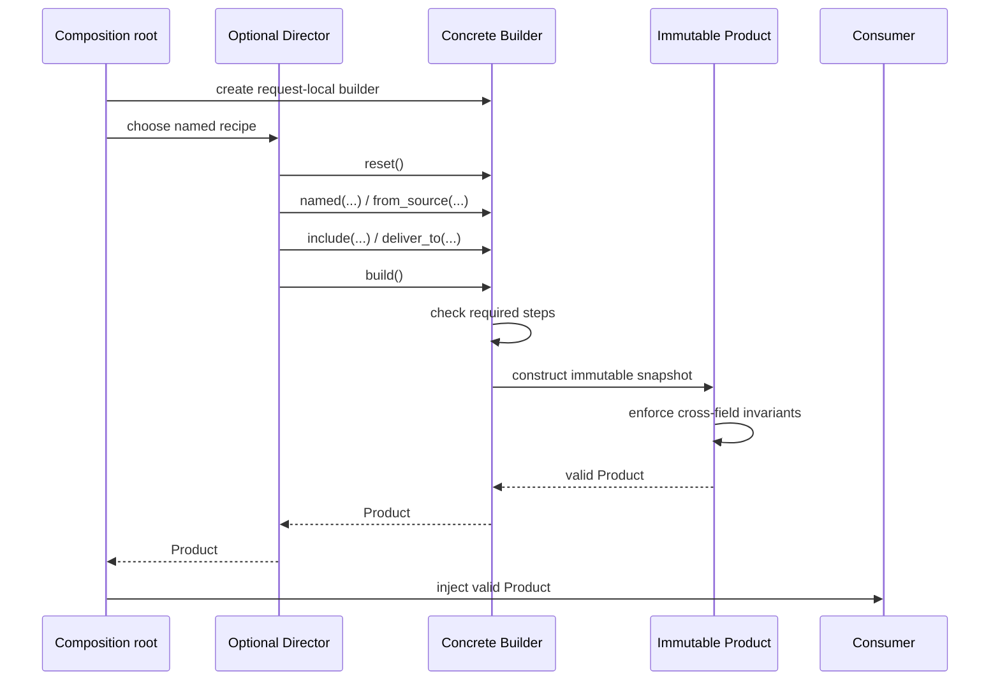

# SDP-CRE-030 — Builder

## Physical Notebook Core

### Problem or change pressure

One final object is valid only after several required, optional, and cross-field decisions arrive in
stages. Passing the partial object around leaks invalid state; repeating a large final constructor
spreads sequencing, defaults, and validation policy.

### One-sentence mental model

> Keep the unfinished construction private; publish a valid Product only at one explicit build
> boundary.

### One essential visual

```text
staged inputs ──► mutable Builder state ──► build() ──► immutable Product
  required           incomplete is          │             valid snapshot
  optional           allowed in here        ├─ missing step → reject
  cross-field                              └─ bad combination → reject

optional Director ──calls a named step sequence──► Builder
```

### How to read this visual

Read the top row left to right. Inputs may arrive over time, so the Builder temporarily owns an
incomplete candidate. Only `build()` may release the Product, after required-step and cross-field
checks. The lower arrow is separate: a Director may own a reusable construction recipe, but is not
required.

### Key insight

Builder is a **construction boundary**, not a synonym for a chain of methods returning `self`.

### Simplification or limitation

This conceptual view omits cleanup, asynchronous cancellation, observer failures, static typestate,
and reset/reuse choices. The Product is a Python object, not a transaction: successful construction
cannot undo an external effect already performed by a step.

### Governing rules or invariants

1. Incomplete state stays inside one clearly owned construction flow.
2. Every public Product satisfies its invariants regardless of which construction path created it.
3. Build, reuse/reset, resource ownership, and failure semantics are explicit and tested.

### Minimal Python example

```python
from dataclasses import dataclass
from typing import Self


@dataclass(frozen=True)
class Query:
    table: str
    columns: tuple[str, ...]

    def __post_init__(self) -> None:
        if not self.table or not self.columns:
            raise ValueError("table and at least one column are required")


class QueryBuilder:
    def __init__(self) -> None:
        self._table: str | None = None
        self._columns: list[str] = []

    def from_table(self, table: str) -> Self:
        self._table = table
        return self

    def select(self, column: str) -> Self:
        self._columns.append(column)
        return self

    def build(self) -> Query:
        if self._table is None:
            raise ValueError("missing table")
        return Query(self._table, tuple(self._columns))
```

The Product still validates itself, and `tuple(...)` prevents later Builder mutation from changing
an earlier Product.

### One common misconception

**Mistake:** A class becomes a Builder when every setter returns `self`.

**Correction:** Fluent return values change call syntax. Builder separates an unfinished
construction process from the final representation and defines a finalization boundary. A fluent
three-field value with no staged pressure may be only a verbose constructor.

### Important trade-offs

- Builder names stages and centralizes finalization, but adds mutable state, lifecycle rules, more
  error paths, and another API to learn.
- Runtime `build()` checks handle flexible ordering; typed stage objects can restrict order earlier,
  but multiply types and transitions.
- An immutable Product snapshot is safe to share; the mutable Builder that created it usually is not.

### Interview-revision cues

- Say “private incomplete state, explicit finalization, valid Product,” then identify the real stages.
- Compare first with keyword-only construction, a frozen dataclass, a focused factory, and local
  variables.
- A Director owns a recipe; a Builder owns construction state; a Product owns its lasting invariants.
- Reject Builder when all values arrive together and one readable call is enough.

## Unit metadata

| Field | Value |
|---|---|
| Domain | GoF creational patterns |
| Curriculum | [SDP-CRE-030](../../../CURRICULUM.md#sdp-cre-030) |
| Progress | [PROGRESS.md](../../../PROGRESS.md) |
| Python references | [PYTHON_REFERENCES.md](../../../PYTHON_REFERENCES.md) |
| Learning outcome | Separate complex, validated, or staged construction from the final object while comparing fluent builders with keyword arguments, dataclasses, and factory functions. |
| Hard prerequisites | [SDP-FND-040](../../foundations/SDP-FND-040-abstraction-encapsulation-information-hiding-contracts/README.md), [SDP-FND-050](../../foundations/SDP-FND-050-composition-delegation-inheritance/README.md), [SDP-PYT-060](../../pythonic/SDP-PYT-060-dataclasses-immutable-value-objects-enums/README.md) |
| Soft Python bridge | [PY-OBJ-010](https://github.com/rahulyadev/python-mastery/blob/main/CURRICULUM.md#py-obj-010), [PY-OBJ-020](https://github.com/rahulyadev/python-mastery/blob/main/CURRICULUM.md#py-obj-020), [PY-OBJ-030](https://github.com/rahulyadev/python-mastery/blob/main/CURRICULUM.md#py-obj-030), [PY-LIB-060](https://github.com/rahulyadev/python-mastery/blob/main/CURRICULUM.md#py-lib-060) |
| Priority | Core |
| Interview frequency | High |
| Production frequency | Medium |
| Python/backend relevance | High |
| Depth | D2 |
| Scope | GoF, Creational, Python |
| Size | L |
| First understanding | 4–6 h |
| Hands-on practice | 5–9 h |
| Evidence profile | E+I+D+T |
| Canonical Python | Python 3.14 |
| Interview compatibility | Python 3.11 |
| Artifact state | Approved |

Frequency labels are curriculum judgments, not measured statistics. Maintainer-authored notes,
tests, and publication do not establish learner evidence; Rahul's learning state stays separate.

Study the decision ladder first, run the [worked demo](examples/run_builder_demo.py), use the
[construction-pressure explorer](visuals/README.md), observe the
[staged-cleanup experiment](experiments/EXP-01-staged-resource-cleanup/README.md), and then preserve
and attempt the [unsolved lab](practice/README.md).

## 1. Simple explanation

Imagine preparing a report plan. The final plan needs a name, a source, at least one column, an
output destination, and several optional settings. Some combinations matter:

- CSV cannot represent the nested selectors supported by the example;
- an external transfer needs an encryption-key reference;
- row limits must stay within an operational bound; and
- a completed plan must not change when later requests are configured.

If one function receives every value at once, a keyword-only frozen dataclass is clear. If one
common internal preset exists, a focused factory function is clear. If a single orchestration
collects three inputs, ordinary local variables followed by one final call are still clear.

Builder becomes useful when several flows collect required and optional pieces over time, partial
state must not escape, and one named `build()` operation must either return a valid snapshot or an
actionable construction error.

The Builder may be fluent, but fluency is presentation. The pattern's substance is the separation
between the **construction process** and the **finished representation**.

### Prerequisite bridge

- [SDP-FND-040](../../foundations/SDP-FND-040-abstraction-encapsulation-information-hiding-contracts/README.md)
  supplies the boundary idea: hide partial representation and publish a behavioral contract.
- [SDP-FND-050](../../foundations/SDP-FND-050-composition-delegation-inheritance/README.md)
  supplies composition and delegation. A Director collaborates with a Builder; neither needs to
  inherit from the other.
- [SDP-PYT-060](../../pythonic/SDP-PYT-060-dataclasses-immutable-value-objects-enums/README.md)
  supplies frozen dataclasses, tuples, enums, value invariants, and the warning that `frozen=True`
  is not automatically deep immutability.
- `PY-OBJ-010`, `PY-OBJ-020`, and `PY-OBJ-030` bridge Python construction and composition.
- `PY-LIB-060` bridges generated dataclass methods and enum members.

These bridges allow study. They do not claim prerequisite learner evidence.

## 2. Start with the smallest design

The number of parameters is only a clue. Ask **when values arrive**, **who owns partial state**, and
**what final validation must happen**.

### 2.1 A normal constructor

```python
class ReportPlan:
    def __init__(self, name: str, source: str, columns: tuple[str, ...], destination: str) -> None:
        self.name = name
        self.source = source
        self.columns = columns
        self.destination = destination


plan = ReportPlan("daily", "events-v1", ("event_id",), "internal-archive")
```

This is compact, but several adjacent values have the same broad type and readers must remember
position. It is acceptable for a tiny stable object; it becomes fragile as optional parameters grow.

### 2.2 Keyword-only arguments

```python
plan = ReportPlan(
    name="daily",
    source="events-v1",
    columns=(Column("event_id"),),
    destination=Destination.INTERNAL_ARCHIVE,
)
```

Keywords expose meaning at the call site and allow defaults to evolve. If all values are already
known, this often solves the problem without a Builder.

### 2.3 A frozen dataclass/value object

```python
from dataclasses import dataclass


@dataclass(frozen=True, slots=True, kw_only=True)
class ReportPlan:
    name: str
    source: str
    columns: tuple[str, ...]
```

The dataclass reduces mechanical code; it does not decide domain invariants. Put lasting invariants
in `__post_init__` or a private validated constructor path so direct construction cannot create a
bad Product.

### 2.4 A focused factory function

```python
def make_internal_report(*, name: str, source: str, columns: tuple[str, ...]) -> ReportPlan:
    return ReportPlan(name=name, source=source, columns=columns)
```

A named function captures one construction policy with almost no ceremony. Prefer it when the
inputs arrive together and callers need one preset rather than a long-lived partial candidate.

### 2.5 Ordinary incremental local variables

```python
columns = ["event_id"]
if include_actor:
    columns.append("actor_id")
destination = choose_destination(policy)
plan = make_plan(columns=tuple(columns), destination=destination)
```

One local scope already hides incomplete state. Do not extract a Builder merely because statements
occur one after another.

### 2.6 A Builder

```python
plan = (
    ReportPlanBuilder()
    .named("daily")
    .from_source("events-v1")
    .include("event_id")
    .deliver_to(Destination.INTERNAL_ARCHIVE)
    .build()
)
```

This form earns its extra object when multiple construction flows share staged behavior, required
steps need deterministic diagnostics, final snapshots must detach from mutable assembly, or the
same recipe can produce another representation.

## 3. Change pressure and ownership of incomplete state

Separate the concerns before choosing a pattern:

| Concern | Stable or variable? | Owner |
|---|---|---|
| Consume a valid report plan | Stable policy | Execution service |
| Gather required and optional inputs | Staged variation | Builder or one local orchestration |
| Choose a named standard recipe | Recipe variation | Optional Director |
| Enforce lasting plan invariants | Stable Product contract | `ReportPlan` |
| Explain missing construction steps | Construction-specific failure | Concrete Builder |
| Acquire and release external resources | Lifetime variation | Separate materializer/context owner |

The key encapsulation move is narrow: an incomplete candidate may exist, but only inside its owner.
Nothing typed as `ReportPlan` is partial. Consumers receive either a valid Product or an exception;
they never probe `is_ready` and hope every caller remembered the same checks.

## 4. History and original context

The Addison-Wesley/O'Reilly catalog lists *Design Patterns: Elements of Reusable Object-Oriented
Software* by Erich Gamma, Richard Helm, Ralph Johnson, and John Vlissides, published in October
1994, with Builder in the creational-pattern catalog.
[Publisher catalog](https://www.oreilly.com/library/view/design-patterns-elements/0201633612/).

The classic intent separates construction of a complex object from its representation so one
construction process can create different representations. A publisher-hosted pattern overview
also names the classic Builder, Concrete Builder, Director, and Product collaboration.
[O'Reilly Builder overview](https://www.oreilly.com/library/view/architectural-patterns/9781787287495/c9a13022-b882-4615-8d97-df269537306d.xhtml).

That wording is narrower than many modern “builder” APIs. A fluent request object may improve
readability but does not necessarily support a replaceable representation or a Director. In modern
Python, the useful staged-construction responsibility can still be present without reproducing a
C++ or Java class hierarchy.

## 5. Formal definition in operational language

Builder is a creational collaboration in which:

1. a Product represents the completed result;
2. a Builder defines construction operations and a final result boundary;
3. a Concrete Builder stores partial state and assembles one representation;
4. a Client either calls the Builder directly or asks a Director to run a construction sequence;
5. another Concrete Builder may interpret the same sequence into another representation; and
6. consumers remain independent of incomplete construction state.

For a pragmatic Python Builder without multiple representations, the force may instead be staged,
validated assembly of one complex Product. Name that adaptation honestly: it keeps the construction
boundary but may omit the classic replaceable-Builder collaboration.

## 6. Participants and responsibilities

| Participant | Responsibility | Must not own |
|---|---|---|
| Client/composition root | Create a fresh Builder or select a recipe | Hidden global Builder lookup |
| Product | Represent a complete result and defend lasting invariants | Mutable partial construction state |
| Builder role | Describe steps a Director or Client may request | Concrete Product representation details |
| Concrete Builder | Accumulate private state, diagnose missing steps, finalize one representation | Unrelated business execution |
| Director (optional) | Name and execute a reusable sequence | Concrete Builder state or Product lifetime |
| Validator | Enforce field-local and cross-field rules at the right boundary | External side effects disguised as validation |
| Materializer/lifetime owner | Acquire resources needed to execute a plan and clean partial acquisition | Pretending object creation rolls back remote effects |
| Observer | Receive allow-listed construction facts under a stated failure policy | Raw configuration, credentials, or complete object representations |

One Python object or function may perform two roles in a small application. The responsibilities
should still be explainable separately.

## 7. Collaboration and execution flow



### How to read this visual

The root owns the Builder instance. The optional Director sends construction requests but never
reads the Builder's fields. `build()` first checks construction completeness, then the Product
defends its own invariants. Only the valid Product crosses into consumer code.

### Key insight

The Builder controls **when a Product may emerge**; the Product controls **what must always be true
after it emerges**.

### Simplification or limitation

This synchronous success path omits validation failure, cleanup, cancellation, reset races,
observer failure, and retries. Arrows are calls and returns, not inheritance or CPython memory
references. A Director is optional; direct fluent use skips it.

## 8. Before-pattern code and concrete pain

```python
def prepare_report(request: Request, policy: Policy) -> ReportPlan:
    columns: list[Column] = []
    columns.append(Column("event_id"))
    if request.include_actor:
        columns.append(Column("actor_id", sensitive=True))

    encryption = None
    if policy.destination is Destination.EXTERNAL_TRANSFER:
        encryption = load_encryption_reference(policy.key_name)

    return ReportPlan(
        name=request.name,
        source=policy.source,
        columns=tuple(columns),
        destination=policy.destination,
        encryption=encryption,
    )
```

This code is not bad. One function owns partial locals and performs one final construction. Builder
pressure appears only when several flows repeat the same stages, partial state must cross callbacks
or layers, missing-step errors become inconsistent, or another representation needs the sequence.

A worse intermediate design passes a mutable `dict[str, object]` through the layers. Each layer
knows keys, consumers can run it before validation, typos appear late, and no boundary owns reset or
cleanup. Builder replaces that **leaked partial protocol**, not merely a long constructor call.

## 9. Minimal Pythonic implementation

```python
from dataclasses import dataclass
from typing import Self


@dataclass(frozen=True, kw_only=True)
class Product:
    identity: str
    parts: tuple[str, ...]

    def __post_init__(self) -> None:
        if not self.identity or not self.parts:
            raise ValueError("complete Product required")


class ProductBuilder:
    def __init__(self) -> None:
        self._identity: str | None = None
        self._parts: list[str] = []

    def identified_as(self, identity: str) -> Self:
        self._identity = identity
        return self

    def add(self, part: str) -> Self:
        self._parts.append(part)
        return self

    def build(self) -> Product:
        if self._identity is None:
            raise ValueError("missing identity")
        return Product(identity=self._identity, parts=tuple(self._parts))
```

Every abstraction has a reason:

- the mutable list exists only during construction;
- `Self` preserves the fluent receiver type for subclasses or structurally compatible APIs;
- `build()` makes finalization visible; and
- `Product.__post_init__` protects direct construction too.

The typing specification treats a method-level `Self` as a type variable bound to the enclosing
class. `Self` entered the standard library in Python 3.11, so this unit needs no compatibility
fallback. [Typing specification](https://typing.python.org/en/latest/spec/generics.html#self) and
[Python 3.11 `typing.Self`](https://docs.python.org/3.11/library/typing.html#typing.Self).

## 10. Worked production-oriented implementation

The runnable [`examples/builder.py`](examples/builder.py) contains:

- a frozen, slotted, keyword-only `ReportPlan` Product;
- frozen nested `Column` and `EncryptionRef` values;
- enums for format, destination, and compression;
- a mutable, request-local `ReportPlanBuilder` with fluent `Self` returns;
- deterministic `MissingStepError` and coded `InvalidPlanError` failures;
- final copies from lists/dictionaries to tuples;
- explicit reusable-snapshot semantics and explicit `reset()`;
- allow-listed, best-effort observations with no staged values;
- a `StandardReportBuilder` Protocol for the optional Director;
- a second `ManifestBuilder` representation; and
- `make_internal_report()` as the smaller focused-factory alternative.

Run it from the repository root:

~~~bash
PYTHONPYCACHEPREFIX=/tmp/sdp-cre-030-pycache \
  uv run --locked python units/creational/SDP-CRE-030-builder/examples/run_builder_demo.py
~~~

The primary construction boundary remains short:

```python
def build(self) -> ReportPlan:
    missing = self._missing_steps()
    if missing:
        raise MissingStepError(missing)
    name = self._name
    source = self._source
    destination = self._destination
    if name is None or source is None or destination is None:
        raise AssertionError("missing-step check and Builder state disagree")
    return ReportPlan(
        name=name,
        source=source,
        columns=tuple(self._columns),
        destination=destination,
    )
```

The runnable version narrows optional values and emits safe failure codes. It deliberately performs
no network, filesystem, database, or queue side effect.

## 11. Validation belongs at two different boundaries

Builder validation and Product validation answer different questions.

| Boundary | Question | Example failure |
|---|---|---|
| Step method | Is this one input structurally acceptable now? | Blank encryption reference |
| `build()` completeness | Were all universally required decisions supplied? | Missing name, source, columns, destination |
| Product invariant | Is the complete combination valid forever? | External destination without encryption |
| Execution boundary | Can today's environment execute this valid plan? | Destination temporarily unavailable |

The Builder should give construction-specific diagnostics such as a deterministic list of missing
steps. The Product must still reject invalid combinations because callers can construct it directly,
deserialize it, or reach it through another factory.

Do not contact a remote service from `__post_init__`. A Product invariant should be deterministic
from owned values. Environment readiness belongs to a separate execution or materialization boundary.

## 12. Required, optional, and conditionally required steps

The worked example classifies:

- required for every Product: name, source, at least one column, and destination;
- optional with defaults: JSONL format, no compression, no row limit, and no labels;
- conditionally required: an encryption reference for external transfer; and
- cross-field forbidden: a nested column selector under the example's CSV contract.

This classification matters more than whether an API is fluent. A good `build()` reports missing
universal steps together, then delegates combination rules to Product construction. Reporting only
the first missing step can force callers through a frustrating fix-run-fix loop.

Intermediate state may be invalid **inside** the Builder. That is its job. The design fails when
that state leaks through getters, is typed as the Product, or is consumed before finalization.

## 13. Construction sequence and optional Director

The worked `construct_daily_activity()` function is the Director role:

```python
def construct_daily_activity(builder: StandardReportBuilder[ProductT]) -> ProductT:
    return (
        builder.reset()
        .named("daily-activity")
        .from_source("activity-v1")
        .include("event_id")
        .include("actor_id", sensitive=True)
        .deliver_to(Destination.INTERNAL_ARCHIVE)
        .build()
    )
```

Passing `ReportPlanBuilder` yields an executable `ReportPlan`. Passing `ManifestBuilder` yields a
safe `BuildManifest`. The sequence is shared; representation-specific accumulation remains in each
Concrete Builder.

Do not add a `DailyReportDirector` class when one function communicates the recipe. Add a Director
only when the sequence has an independent name, changes separately from representation, or several
clients must reuse it.

## 14. Fluent interface versus GoF Builder

These properties are independent:

| Property | Meaning |
|---|---|
| Fluent API | Calls read as a chain because methods return a receiver or next stage |
| Named arguments | One call exposes parameter meaning |
| Builder boundary | Partial construction is hidden and explicitly finalized |
| Classic replaceable Builder | One construction process targets different representations |
| Director | A separate collaborator owns a reusable construction recipe |

`response.header(...).status(...).send()` may be fluent but not a Builder if it mutates the final
response directly. Conversely, a non-fluent object with `add_part()` returning `None` and a final
`build()` may be a perfectly clear Builder.

Fluent chains can hide the exact step that failed in a traceback and tempt developers to call
side-effecting work during configuration. Prefer commands that stage pure values; keep external work
at a visible materialization boundary.

## 15. Reset, reuse, and snapshot semantics

Choose one contract and test it:

| Contract | Behavior after `build()` | Benefit | Risk |
|---|---|---|---|
| One-shot | Further calls fail | No stale reuse | More allocation; explicit consumed state |
| Auto-reset | Builder silently clears | Concise repeated use | Surprising loss; failure timing ambiguity |
| Explicit reset | State remains until `reset()` | Visible lifecycle | Caller can forget reset |
| Immutable functional Builder | Every step returns a new Builder | Safe sharing and history | More allocations and copies |

The worked example uses **reusable snapshots with explicit reset**:

1. `build()` copies staged collections and leaves the Builder configured;
2. calling `build()` again produces an equal but distinct Product;
3. later steps affect later Products only; and
4. `reset()` is the only clearing operation.

There is no universal Builder reset rule. Hidden auto-reset is especially dangerous when a failed
build clears evidence a caller needs to diagnose or correct.

## 16. Ordering and typestate limits

A plain fluent Builder normally cannot make call order statically safe:

```python
builder.deliver_to(destination).include("id").named("daily")
```

If those operations commute, flexible order is useful. If credentials may be bound only after an
endpoint is verified, runtime final validation may be too late.

Stronger choices include:

- separate stage types whose methods expose only legal next transitions;
- a small explicit state machine;
- distinct functions for each stage with typed results; or
- one atomic operation that performs the safety-critical sequence.

Python type checkers can describe staged return types, but runtime callers and `Any` can bypass
them. The Product or execution boundary must still defend safety. Do not build a dozen typestate
classes to encode an ordering that has no domain meaning.

## 17. Error boundaries

Keep failures distinguishable:

| Failure | Owner | Recommended signal |
|---|---|---|
| Missing universal step | Builder finalization | `MissingStepError` with safe ordered field names |
| Bad individual input | Step/value boundary | Coded `InvalidPlanError` without raw sensitive value |
| Cross-field contradiction | Product invariant | Coded `InvalidPlanError` |
| Configuration name unknown | Composition root | Configuration-specific error |
| Dependency acquisition fails | Materializer | Preserve cause; clean earlier acquisitions |
| External effect uncertain | Execution service | Outcome-specific error plus idempotency/reconciliation policy |
| Cleanup fails during another error | Lifetime boundary | Preserve both contexts; do not claim rollback |
| Observer fails | Explicit policy | Best effort, propagate, buffer, or fail closed—choose deliberately |

Avoid a single `ValueError("bad builder")`. Callers need to know whether to supply a missing field,
correct an invalid combination, retry environmental acquisition, or reconcile an uncertain effect.

Exceptions must not include credentials, customer values, full configuration mappings, or arbitrary
object `repr`s. The example reports field names and stable codes.

## 18. Lifetimes, partial cleanup, and external effects

The simplest Builder should accumulate **values**, not open sockets or files. Build a pure plan,
then let a context-managed materializer acquire resources for execution. This separates object
validity from environment lifetime.

If construction truly must acquire a variable set of resources, register cleanup immediately after
each successful acquisition. The runnable
[`EXP-01`](experiments/EXP-01-staged-resource-cleanup/README.md) uses `ExitStack`:

1. acquire resources in order;
2. register each successful context with the construction stack;
3. if a later acquisition fails, unwind earlier resources;
4. only after all acquisitions succeed, transfer callbacks with `pop_all()`; and
5. make the returned owner close exactly once in reverse order.

Python documents reverse callback order and callback transfer as `ExitStack` contracts.
[Python 3.14 `contextlib.ExitStack`](https://docs.python.org/3.14/library/contextlib.html#contextlib.ExitStack).

Cleanup is compensation for local resource ownership, not transaction rollback. If a build step has
already sent a message or created a remote object, closing a client does not undo that effect. Use
idempotency keys, explicit compensating commands, or reconciliation according to the real boundary.

## 19. Observability without secrets

Useful construction observations answer:

- which stable phase or step ran;
- how many non-sensitive parts have been staged;
- whether finalization succeeded or failed;
- which allow-listed error code occurred; and
- caller-supplied correlation outside the Product when needed.

Do not record:

- report names, source names, selectors, tenant identifiers, or complete labels by default;
- encryption references, credentials, tokens, or payload contents;
- the Builder `__dict__` or final Product `repr`; or
- a dynamic exception string from an untrusted provider.

The worked `BuildObservation` contains only phase, step, column count, and error code. Its observer is
best effort: ordinary observer exceptions do not change this pure construction result. That is a
professional choice, not a Python guarantee; security audit paths may instead require fail-closed or
durable buffering behavior.

## 20. Testing strategy and seams

| Test type | What it proves | What not to overspecify |
|---|---|---|
| Product unit | Direct construction enforces every lasting invariant | Builder private field layout |
| Builder unit | Required-step diagnostics, defaults, copies, reuse, reset, and coded failures | Exact helper methods |
| Property-based | Every allowed numeric bound round-trips; invalid ranges reject | Hypothesis example order |
| Director contract | Same sequence works with each intended Concrete Builder | Concrete class inheritance |
| Lifetime experiment | Partial acquisition closes earlier resources in observed reverse order | Remote transaction rollback |
| Static typing | Builders satisfy the structural Director Protocol | Runtime semantic validity |
| Visual contract | Embedded scenarios equal maintained Python data | Browser engine layout pixels |
| Integration | Valid Product can be materialized at the real dependency boundary | Unrelated infrastructure internals |

Prefer a fake Concrete Builder that records step names when testing a Director. Prefer behavioral
assertions on Products rather than checking `_columns` or a method-call chain copied from the
implementation.

An unsolved practice test should protect baseline behavior without revealing the desired class
names, internal fields, or exact refactoring solution.

## 21. Concurrency and Builder ownership

The pattern supplies no thread- or task-safety guarantee. A mutable Builder contains a check-then-use
state machine across several calls. Even if individual list operations are safe from memory
corruption on one interpreter, another request can interleave semantically and create a mixed Product.

Use one of these boundaries:

- create one mutable Builder per request, job, or task;
- keep it confined to one synchronous call chain;
- use an immutable functional Builder when sharing staged state is genuinely useful; or
- put one atomic lock around the complete construction flow only when shared ownership is required
  and measured contention is acceptable.

Do not store a mutable Builder in a module global, singleton, reusable web dependency, or shared
worker object. `reset()` makes the race larger; it does not make sharing safe.

An immutable Product made only from frozen nested values and tuples can be shared under its own
contract. That safety comes from the Product representation, not from Builder.

## 22. Immutability and snapshot isolation

`frozen=True` prevents normal field rebinding; it does not recursively freeze a reachable list,
dictionary, or collaborator. Python's dataclass documentation describes frozen instances as an
emulation rather than absolute immutability.
[Python 3.11 dataclasses](https://docs.python.org/3.11/library/dataclasses.html#frozen-instances).

The worked Product therefore uses:

- tuples of frozen `Column` values;
- a tuple of label pairs instead of the Builder's dictionary;
- enums instead of mutable choice objects; and
- a frozen `EncryptionRef` whose value is excluded from representations.

The copy at `build()` is essential. Returning `tuple(self._columns)` detaches the Product container;
using `columns=self._columns` would let later Builder mutation rewrite history.

Deep immutability is still a domain claim. If a nested object owns a mutable client, cache, or byte
buffer, a frozen outer dataclass does not make that collaborator immutable or thread-safe.

## 23. Asynchronous construction and cancellation

Do not make every fluent step `async` just because one dependency is asynchronous. Prefer:

1. pure synchronous Builder steps that create a validated plan;
2. one explicit async materialization boundary; and
3. `AsyncExitStack` when a variable number of async contexts must be acquired and unwound.

```python
from contextlib import AsyncExitStack


async def materialize(plan: Plan) -> RunningProduct:
    async with AsyncExitStack() as stack:
        source = await stack.enter_async_context(open_source(plan))
        sink = await stack.enter_async_context(open_sink(plan))
        owner = stack.pop_all()
    return RunningProduct(source, sink, owner.aclose)
```

Cancellation may arrive between awaits. Register ownership immediately after each successful await,
do not catch cancellation as an ordinary retry, and define what happens if async cleanup itself
fails. `AsyncExitStack` supports sync and async context managers and requires `aclose()` for async
callbacks. In both Python 3.11 and 3.14, passing a non-async context to `enter_async_context()` raises
`TypeError`; that exception change began in 3.11.
[Python 3.11 `AsyncExitStack`](https://docs.python.org/3.11/library/contextlib.html#contextlib.AsyncExitStack)
and [Python 3.14 `AsyncExitStack`](https://docs.python.org/3.14/library/contextlib.html#contextlib.AsyncExitStack).

The snippet is a lifecycle sketch, not a claim that resource acquisition plus remote effects becomes
atomic.

## 24. Import and composition boundaries

Keep concrete choice at a composition root:

```text
application entry point
    ├── imports ReportPlanBuilder or focused factory
    ├── parses allowed configuration
    ├── creates one request-local construction flow
    └── injects valid ReportPlan into policy code

domain/product module
    └── imports no web framework, database driver, queue client, or concrete adapter
```

A Builder module may import its Product. The Product should not import the application composition
root or a registry of Concrete Builders. A Director depends on the small Builder role, not on every
Concrete Builder module.

Dynamic discovery is rarely justified for Builders. If independently shipped packages truly add
representations, discovery, allow-listing, version negotiation, and provider trust are separate
deployment concerns. Do not hide them inside `build()`.

## 25. Performance and memory

Builder adds:

- one construction object;
- mutable containers for partial state;
- copies into the final snapshot;
- method-call and validation overhead; and
- possibly two representations when a Director is exercised with multiple builders.

For normal backend configuration objects, clarity and correctness dominate this small overhead. Do
not claim a speedup. Measure only when construction lies on a proven hot path or Products hold very
large collections.

If copying a million parts is material, consider streaming construction, persistent data structures,
chunked immutable segments, or transferring exclusive ownership of a private buffer under a precise
contract. Do not return the Builder's live list just to avoid a copy; that trades measured or
unmeasured cost for aliasing risk.

`slots=True` may reduce per-instance overhead in some workloads, but it is not the reason to choose
Builder and requires measurement on the target runtime. The unit makes no benchmark claim.

## 26. Realistic backend uses

Builder is plausible when:

- a query/report plan gathers projections, filters, policy limits, and output rules across stages;
- a deployment manifest has required resources plus conditional security settings;
- a test fixture has many optional parts and invalid combinations, with one final immutable fixture;
- a protocol message is assembled in a fixed order and different encoders produce different
  representations; or
- a batch job is built from scheduler, tenant, routing, and compliance policy inputs.

It is less persuasive for a FastAPI request model, Django form, or validated settings object whose
framework already gathers all fields and reports validation errors atomically. Use the existing
boundary unless a separate staged construction lifecycle remains.

Framework dependency injection can create a Builder per request, but that lifecycle is framework
behavior, not part of the pattern. Keep the unit's core example framework-independent.

## 27. Refactoring path

1. Preserve current Product behavior and failure contracts with tests.
2. Name the stages and prove more than one flow repeats them or leaks partial state.
3. Try keyword-only construction, a focused factory, and local variables first.
4. Make the final Product immutable enough for its sharing contract.
5. Put lasting invariants on the Product boundary.
6. Introduce one Concrete Builder that privately owns incomplete state.
7. Give `build()` deterministic missing-step and invalid-combination errors.
8. Copy mutable staged collections into Product snapshots.
9. Choose and document one reset/reuse contract.
10. Move resource acquisition to a separate lifetime boundary when possible.
11. Add allow-listed observations and behavior-focused tests.
12. Add a Builder Protocol only when another builder or Director needs substitution.
13. Add a Director only when the sequence itself is reusable.
14. Remove the old mutable dictionary or duplicated construction path.

Stop if the pattern version is not clearer under the named pressure. A successful refactor may end
with the focused factory because the hypothesized stages were not real.

## 28. Related creation designs and adjacent alternatives

| Design | Primary question | Relationship to Builder | Choose it when |
|---|---|---|---|
| Keyword-only constructor | Are all values known now? | Smaller alternative | One readable atomic call is enough |
| Frozen dataclass/value object | What valid data should exist afterward? | Common Product representation | Data and invariants dominate; no staged owner needed |
| Focused factory function | Which named preset or policy constructs this object? | Smaller creation boundary | One function can gather and validate inputs |
| Configuration object | How should input choices travel? | May feed a Builder or replace it | Partial values are data, not a behavior-rich sequence |
| Incremental local variables | Can one local scope own incomplete state? | Smallest staged alternative | One orchestration is readable and not repeated |
| [Factory Method](../SDP-CRE-010-factory-method/README.md) | Which one Product implementation should a Creator make? | Different creation variation | One overridable creation decision supports a stable workflow |
| [Abstract Factory](../SDP-CRE-020-abstract-factory/README.md) | Which coherent family of Product roles should be created? | May supply a Builder as one Product | Family compatibility, not stepwise assembly, is the force |
| Prototype/copying | Can an existing configured object be copied and adjusted? | Alternative to rebuilding | Starting state already exists and copy semantics are understood |

### Builder versus Abstract Factory

Abstract Factory changes a **family choice**: one selection creates several compatible Product
roles. Builder changes or exposes a **construction sequence** for one complex Product or
representation. An Abstract Factory may return a Builder, but combining the names does not remove
either responsibility.

### Builder versus Factory Method

Factory Method usually selects or overrides one Product creation operation inside a Creator's
workflow. Builder exposes multiple assembly operations and a final result. A Concrete Builder may
internally call factory functions; that does not turn every step into Factory Method.

### Builder versus configuration object

A configuration dataclass represents choices. A Builder owns behavior across stages and controls
publication of the result. If callers merely populate a config and one function validates it, call
those things a config and a factory. Do not rename them Builder to increase pattern count.

### Builder versus Prototype

Builder assembles a new result from steps. Prototype starts from an existing object and relies on
explicit shallow/deep copy and identity semantics. This is recognition context only; copying details
belong to their own later unit.

## 29. Failure scenarios and recovery judgment

### 29.1 `build()` is called early

Return every missing universal step in deterministic order. Keep the Builder state available under
the documented reuse policy; do not silently auto-reset.

### 29.2 A cross-field invariant fails

Return a safe stable code and field category. Let callers correct staged values, reset, or abandon
the request. The Product constructor must reject the same bad combination directly.

### 29.3 A built Product changes later

This reveals aliasing: the Product retained the Builder's mutable collection or a mutable nested
value. Copy/freeze at finalization and add a regression test that mutates the Builder afterward.

### 29.4 Two requests share one Builder

Treat mixed state as an ownership defect. Do not “fix” it with scattered locks around individual
setters. Create separate Builders or lock the complete flow under an explicit shared contract.

### 29.5 The second resource acquisition fails

Close the first resource and return no partial Product. Register cleanup immediately; preserve the
acquisition cause. The experiment makes this order observable.

### 29.6 Cancellation arrives during async construction

Unwind registered async contexts, preserve cancellation, and report cleanup failure without claiming
remote rollback. Retry only under the dependency's idempotency contract.

### 29.7 Observer fails

Apply the stated policy. The worked pure Builder treats telemetry as best effort. A mandatory audit
trail needs a different boundary rather than silently reusing that choice.

### 29.8 A Director recipe becomes incompatible with one representation

The Builder Protocol may be too broad or the “same sequence” assumption may be false. Split the
recipe, narrow capabilities, or reject that representation instead of adding no-op methods.

## 30. Variants

- **Direct/fluent Concrete Builder:** Client calls one concrete object; common pragmatic Python form.
- **Classic Builder plus Director:** replaceable Concrete Builders interpret one sequence.
- **Functional Builder:** each step returns a new immutable staged value.
- **Typed-stage Builder:** each stage exposes only legal next calls.
- **Collecting Builder:** accumulates parts and returns one composite Product.
- **Streaming Builder:** sends parts to a serializer or sink without retaining the whole Product;
  lifetime and partial-output rules become central.
- **Test-data Builder:** supplies readable defaults for fixtures; must not hide production invariants
  or make unrealistic invalid states the default.

Named constructors and `dataclasses.replace()` may cover many fixture variations with less state.

## 31. When to use it

- Inputs arrive in meaningful stages across more than one flow.
- A complex Product has required, optional, and cross-field rules.
- Incomplete state needs one private owner and must not reach consumers.
- Finalization must create an immutable or detached snapshot.
- The construction sequence changes separately from representation.
- The same sequence genuinely creates multiple representations.
- Clear missing-step, reset/reuse, and cleanup semantics justify the extra boundary.

## 32. When not to use it

- All values arrive together in one readable keyword-only call.
- A frozen dataclass with `__post_init__` expresses the whole problem.
- One focused factory function captures the only preset.
- One local function can accumulate values and construct at the end.
- The Product has three independent optional fields and no invalid combinations.
- The proposed Builder is a shared mutable service or service locator.
- A framework model already owns parsing and atomic validation.
- A security-critical order requires stronger typed or state-machine stages than the proposed fluent
  API supplies.

## 33. Common misuse and overengineering

| Misuse | Why it happens | Better move |
|---|---|---|
| One setter per Product field | Builder is generated mechanically | Keep keyword-only construction |
| “Builder” means only `return self` | Fluent syntax is mistaken for design separation | Name the partial-state and build boundary |
| Product skips validation | Builder is assumed to be the only constructor | Defend lasting invariants on Product |
| Builder exposes getters for partial state | Callers want progress access | Expose safe status or keep orchestration local |
| Auto-reset after every build | Reuse seems convenient | Use explicit reset or one-shot semantics |
| Shared global mutable Builder | Allocation avoidance or DI mistake | Request-local instance or immutable construction |
| Director with one trivial recipe | Textbook participant list is copied | Use a function or direct Client calls |
| Abstract base hierarchy for one builder | GoF diagram is translated literally | Start concrete; add Protocol at a substitution seam |
| Async setter for every field | One dependency is async | Pure plan Builder plus one async materializer |
| External writes inside steps | “Construction” is treated as transaction | Separate effects and define compensation |
| Logs include the whole Builder | Debug convenience | Stable allow-listed observations |
| Typestate for optional cosmetic order | Static cleverness | Runtime validation and simpler API |

## 34. Interview preparation

Answer one prompt at a time. After each answer, identify the exact reasoning gap before continuing.

### Prompt 1

**Question:** A class constructor has twelve optional parameters. Do you introduce Builder?

**Missing reasoning step:** Parameter count alone is insufficient. Ask whether values arrive in
stages, whether combinations are invalid, whether construction repeats, and whether keyword-only
defaults or a config object already solve readability.

### Prompt 2

**Question:** What distinguishes Builder from a fluent interface?

**Missing reasoning step:** Fluency describes return/call syntax; Builder owns incomplete
construction and an explicit transition to a finished representation.

### Prompt 3

**Question:** Where should validation live?

**Missing reasoning step:** Separate step-local checks, Builder completeness diagnostics, Product
invariants, and environment readiness. The Product must not trust a single construction path.

### Prompt 4

**Question:** Is a Director mandatory?

**Missing reasoning step:** No. It is justified only when the construction recipe has independent
meaning or must drive interchangeable representations.

### Prompt 5

**Question:** How do you prevent a built Product from changing when the Builder is reused?

**Missing reasoning step:** Copy mutable containers and use immutable nested values; `frozen=True`
on only the outer object is insufficient.

### Prompt 6

**Question:** Is a mutable Builder thread-safe if every method is short?

**Missing reasoning step:** Semantic construction spans multiple calls. Interleaving can mix two
requests even without low-level corruption; ownership per flow is the primary control.

### Prompt 7

**Question:** How do Builder and Abstract Factory differ?

**Missing reasoning step:** Builder varies or exposes staged assembly/representation; Abstract
Factory selects a coherent family of related Product roles.

### Prompt 8

**Question:** A step opens a resource and the next step fails. What is the recovery plan?

**Missing reasoning step:** Register cleanup after each acquisition, return no partial Product, and
distinguish resource cleanup from rollback of already completed external effects.

### Prompt 9

**Question:** How would you model an order that must not be violated?

**Missing reasoning step:** `Self` preserves fluent type but does not encode state transitions. Use
typed stages, an explicit state machine, or one atomic operation when order is a safety property.

### Prompt 10

**Question:** Review a test-data Builder with dozens of silent defaults.

**Missing reasoning step:** Defaults can make fixtures readable but may hide required production
decisions and create unrealistic Products. Keep invariants real and make behavior-changing defaults
visible.

### Concise strong answer

> Builder keeps incomplete construction inside a dedicated owner and exposes one finalization
> boundary that returns a valid, detached Product. In Python I first try keyword-only arguments, a
> frozen dataclass, a focused factory, or local variables. I add a mutable or functional Builder only
> for real staged pressure, define required/optional validation and reuse semantics, and add a
> Director only for a reusable sequence or multiple representations.

## 35. Closed-book revision cues

1. Draw staged inputs → private Builder → `build()` → valid Product.
2. State the three governing invariants from the notebook core.
3. Give one scenario where keywords win and one where Builder wins.
4. Explain Product validation versus Builder completeness validation.
5. State one-shot, auto-reset, explicit-reset, and functional reuse options.
6. Prove why `tuple(builder_list)` matters after build.
7. Explain why `Self` does not provide typestate.
8. Distinguish Builder from Factory Method and Abstract Factory.
9. Describe partial resource cleanup without promising rollback.
10. Reject one overengineered Director or hierarchy.

## 36. Practice and evidence

Use the [unsolved archive-job lab](practice/README.md) in this order:

```text
predict → run → observe → explain → refactor → vary
```

Preserve the original attempt. The maintainer examples deliberately use a different report-plan
domain and do not reveal the lab's desired names or solution structure. Ask for one progressive hint
only after recording a prediction and attempt.

Evidence profile mapping:

| Symbol | Evidence for this unit |
|---|---|
| E | Explain pressure, participants, finalization, validation, reuse, and alternatives |
| I | Implement or reject a Builder after trying the simpler design |
| D | Diagnose leaked partial state, aliasing, stale reuse, order, cleanup, and concurrency defects |
| T | Defend the choice under a changed scenario and interview follow-up |

Maintainer-authored notes, examples, tests, and publication may approve the artifact. They do not
advance Rahul beyond `Not started` without his own evidence.

## 37. Vocabulary and professional English

### Staged

**Meaning:** completed through distinct steps rather than one atomic input.

**Natural phrase:** “The Builder owns staged construction until final validation.”

### Finalize

**Meaning:** perform the explicit transition from partial candidate to completed Product.

**Natural phrase:** “`build()` finalizes an immutable snapshot or raises a coded error.”

### Representation

**Meaning:** the concrete form in which a construction result is expressed.

**Natural phrase:** “The same Director sequence can produce a plan or a safe manifest
representation.”

### Typestate

**Meaning:** an API technique where the static type represents the legal operations at a state.

**Natural phrase:** “Use typestate only when call order is a meaningful safety property.”

### Snapshot

**Meaning:** a detached view of state at one moment that later Builder changes do not alter.

**Natural phrase:** “The Product is a tuple-backed snapshot of the Builder's mutable collections.”

## 38. Python 3.11 and 3.14 version note

The unit uses only features available in Python 3.11: `StrEnum`, `typing.Self`, `kw_only=True`,
`slots=True`, and `AsyncExitStack`. The official 3.11 contracts already support each feature used
here. [Python 3.11 dataclasses](https://docs.python.org/3.11/library/dataclasses.html) and
[Python 3.11 enums](https://docs.python.org/3.11/library/enum.html#enum.StrEnum).

Python 3.14 adds `doc=` to `dataclasses.field()` and a `decorator=` hook to `make_dataclass()`. Neither
improves this construction problem, so the examples intentionally avoid both and require no 3.11
fallback. This is the only materially adjacent 3.14 dataclass delta found during authoring.
[Python 3.14 dataclasses](https://docs.python.org/3.14/library/dataclasses.html).

These are standard-library and typing contracts, not claims about private CPython internals.

## 39. Sources actually used in this draft

- [Publisher catalog for *Design Patterns: Elements of Reusable Object-Oriented Software*](https://www.oreilly.com/library/view/design-patterns-elements/0201633612/)
  for authors, publication date, catalog context, and the original source identity.
- [O'Reilly Builder overview](https://www.oreilly.com/library/view/architectural-patterns/9781787287495/c9a13022-b882-4615-8d97-df269537306d.xhtml)
  for a publisher-hosted summary of classic intent and participant terminology.
- [Python 3.11 dataclasses](https://docs.python.org/3.11/library/dataclasses.html) and
  [Python 3.14 dataclasses](https://docs.python.org/3.14/library/dataclasses.html) for generated
  methods, keyword-only fields, slots, frozen semantics, and version differences.
- [Python 3.11 `StrEnum`](https://docs.python.org/3.11/library/enum.html#enum.StrEnum) for the enum
  compatibility baseline.
- [Python typing specification for `Self`](https://typing.python.org/en/latest/spec/generics.html#self)
  and [Python 3.11 `typing.Self`](https://docs.python.org/3.11/library/typing.html#typing.Self) for
  fluent receiver typing.
- [Python 3.11 `contextlib`](https://docs.python.org/3.11/library/contextlib.html) and
  [Python 3.14 `contextlib`](https://docs.python.org/3.14/library/contextlib.html) for `ExitStack`,
  `AsyncExitStack`, callback transfer, reverse cleanup, and the 3.11 error-type change.

Design selection, error taxonomies, observability, security, concurrency, performance, and module
boundaries are labeled and taught as professional judgment rather than Python guarantees. All prose,
diagrams, examples, scenarios, data, and exercises are original and synthetic.
