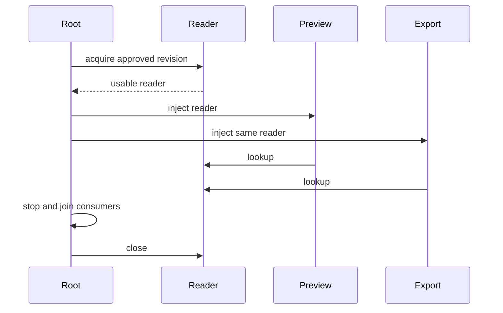

# SDP-CRE-050 — Singleton

## Physical Notebook Core

### Problem or change pressure

Two parts of a program need the same expensive collaborator. Creating it twice is wasteful, but
making it globally reachable hides who configures it, who may use it, and who closes it.

### One-sentence mental model

> Decide the boundary and owner of sharing first; Singleton adds controlled identity and global
> access, while explicit wiring can share one object without restricting its class.

### One essential visual

```text
composition root A ──creates/owns──► reader A ◄──uses── preview A
                                       ▲
                                       └──────uses── export A
composition root B ──creates/owns──► reader B ◄──uses── preview B

class Singleton ──cached instance──► marker ◄──global access── any caller
```

### How to read this visual

Arrows point toward a dependency. The owner creates and closes; consumers only use. Both A
consumers share one reader, yet B can use a different reader in the same interpreter.

### Key insight

“One per application” does not require “only one instance of this class can be constructed.”

### Simplification or limitation

This is a conceptual ownership map, not memory layout. The marker is stateless; readers may hold
resources. The drawing omits threads, failure, cancellation, worker processes, and external systems.

### Governing rules or invariants

1. Name the scope: class object, module name, application, request, interpreter, or deployment.
2. Publish only a usable object; specify retry, configuration conflicts, and shutdown ownership.
3. A creation lock protects creation. It does not make later mutable operations safe.
4. Tests need independent state and dependencies, not just equal `id()` values.

### Minimal Python example

```python
class Catalog:
    def title(self) -> str:
        return "Field guide"


def show(catalog: Catalog) -> str:
    return catalog.title()


shared = Catalog()  # In a real program, put this in its startup/composition root.
assert show(shared) == "Field guide"
assert show(shared) == "Field guide"
assert Catalog() is not shared  # The class remains ordinarily constructible.
```

### One common misconception

**Mistake:** A Singleton makes the database connection, configuration, and transactions safe.

**Correction:** It controls an access path and identity within a boundary. Resource ownership,
mutation, authorization, transaction scope, and distributed coordination remain separate decisions.

### Important trade-offs

- Global access removes wiring but conceals dependencies and couples tests to shared history.
- One owned application object makes sharing explicit and allows two configurations in one process.
- Lazy creation moves failure to first use; eager startup can fail before accepting traffic.

### Interview-revision cues

- Recognition: an identity invariant must survive repeated access through the supported API.
- Comparison: shared ownership convention, cache, and Singleton enforce different contracts.
- Rejection: a small immutable value or ordinary injected service needs no class machinery.

## Unit metadata

| Field | Value |
|---|---|
| Domain | GoF creational patterns |
| Curriculum | [SDP-CRE-050](../../../CURRICULUM.md#sdp-cre-050) |
| Progress | [PROGRESS.md](../../../PROGRESS.md) |
| Python references | [PYTHON_REFERENCES.md](../../../PYTHON_REFERENCES.md) |
| Learning outcome | Explain controlled single-instance access, lifecycle and testing costs, and why modules, explicit dependency lifetimes, or composition roots are usually better in Python. |
| Hard prerequisites | [SDP-FND-090](../../../CURRICULUM.md#sdp-fnd-090), [SDP-FND-100](../../../CURRICULUM.md#sdp-fnd-100), [SDP-PYT-050](../../../CURRICULUM.md#sdp-pyt-050) |
| Soft prerequisites | None |
| Priority | Core |
| Interview frequency | High |
| Production frequency | Medium |
| Python/backend relevance | High |
| Depth | D3 |
| Scope | GoF, Creational, Python |
| Size | L |
| First understanding | 4–6 h |
| Hands-on practice | 5–9 h |
| Evidence profile | E+I+D+X+T |
| Canonical Python | Python 3.14 |
| Interview compatibility | Python 3.11 |
| Artifact state | Draft |

The frequency labels are curriculum judgments, not measured usage statistics. Generated artifacts
and maintainer tests do not establish Rahul's learning. The tracker remains **Not started**.

Study this note, run the [worked demo](examples/run_singleton_demo.py), explore the
[identity comparison](visuals/README.md), run the [controlled experiment](experiments/EXP-01-identity-and-lifetime/README.md),
and attempt the [separate unsolved sensor lab](practice/README.md). Maintainer results belong in
[VALIDATION.md](VALIDATION.md).

## 1. Simple explanation and prerequisite bridge

A reporting program has preview and export features. Each independently opens a catalog reader.
That was fine when construction was cheap. Now startup validates a configuration revision and
acquires a scarce external client. Two readers may duplicate acquisition and disagree about which
revision is active. We need deliberate sharing and a place responsible for release.

The smallest repair is usually to construct a reader once at startup and pass it to both features.
A second application in the same interpreter can own another reader. The **composition root** is
that small startup boundary where concrete collaborators are chosen and connected.

A class Singleton goes further: its supported creation/access API returns a designated instance,
and clients can reach it globally. That extra restriction should solve a real requirement.

The hard prerequisite materials exist, but their tracker rows do not show learner evidence. The
minimum bridge is: two names can reference one object; rebinding a name does not update existing
aliases; modules have namespaces cached by import name; ownership decides the useful lifetime of an
object and who closes it. A request may borrow an application object without owning it. If those
arrows are unclear, reconstruct the core of the three prerequisite units before the race experiment.

## 2. A decision ladder before class machinery

| Choice | What it provides | Concrete pressure that may outgrow it |
|---|---|---|
| Ordinary construction | Independent instances and simple local reasoning | Repeated costly acquisition or accidentally inconsistent setup |
| Explicit dependency passing | Visible required collaborator; easy substitution | Someone still needs to create and own it |
| One object at a composition root | One chosen instance per root lifetime | Multiple roots require an intentional policy; construction elsewhere is still possible |
| Module constants and functions | Small namespaced API with no instance ceremony | Mutable or live module state adds hidden dependencies and import-time effects |
| Factory | A creation seam and configurable creation policy | Repeated calls need not share anything |
| Cache | Reuse by key; often useful for pure derived values | Eviction, concurrent misses, stale data, and held references complicate resource ownership |
| Framework-managed lifetime | A framework-defined cache and cleanup scope | Scope depends on registration, container/app identity, requests, and framework rules |
| Class Singleton | Designated instance through a globally reachable class API | Hidden state, initialization order, tests, inheritance, and lifecycle costs |

Framework “singleton” commonly means one instance per configured provider/container scope, not a
language restriction on the underlying class. This is a terminology warning, not a claim about a
particular framework version; check the actual framework contract before configuring it.

### Ordinary construction and concrete pain

```python
class Reader:
    def __init__(self, revision: str) -> None:
        self.revision = revision


preview = Reader("r1")
export = Reader("r2")
assert preview is not export
assert preview.revision != export.revision
```

Different instances are not inherently wrong. The new requirement is that one running application
uses one approved revision and owns exactly one reader acquisition. The wrong revision is the
failure, not the mere existence of two Python objects.

### Explicitly share at startup

```python
from dataclasses import dataclass


@dataclass(frozen=True)
class Reader:
    revision: str


@dataclass(frozen=True)
class Feature:
    reader: Reader


def compose(revision: str) -> tuple[Feature, Feature]:
    reader = Reader(revision)
    return Feature(reader), Feature(reader)


a, b = compose("r1")
c, d = compose("r2")
assert a.reader is b.reader
assert c.reader is d.reader
assert a.reader is not c.reader
```

No Singleton is necessary. The root controls sharing; the ordinary class keeps tests and independent
apps possible. For real resources, add an explicit exit boundary as the worked example does.

### A module can be enough

```python
# Imagine this is palette_rules.py. No import-time resource acquisition is needed.
DEFAULT_PALETTE = ("ink", "sand")


def palette_name() -> str:
    return "/".join(DEFAULT_PALETTE)


assert palette_name() == "ink/sand"
```

A module is often the right home for stable values and stateless functions. A module-level live
client still needs an owner. Import caching does not assign an application lifetime.

## 3. Original context and formal intent

The Gang of Four catalog treats object creation as a design concern. Its publisher identifies
Gamma, Helm, Johnson, and Vlissides, the 1994 publication, and C++/Smalltalk examples. This note uses
original Python examples and does not reproduce the book's code or diagrams.
[Publisher record and preface](https://www.informit.com/store/design-patterns-elements-of-reusable-object-oriented-software-9780201633610).

In GoF terminology, Singleton combines a restriction to a designated class instance with a global
access path. State the supported API and runtime boundary when applying that intent in Python.
In the authors' retrospective, Erich Gamma favored dropping Singleton as a design smell; that criticism is
about design judgment, not an instruction to replace every shared value with a framework.
[Authors' retrospective](https://www.informit.com/articles/article.aspx?p=1404056).

| Term | Precise distinction |
|---|---|
| Singleton design | Centralizes designated-instance access and construction policy |
| Global variable | A module-level binding; by itself it imposes no construction restriction |
| Single-instance convention | The program elects to construct one ordinary object in a chosen scope |
| Application-scoped dependency | Root/container owns one value during one application's lifetime |
| Identity | `a is b`: the same object, not merely equivalent values |
| Cache | Maps requests/keys to reusable results; not necessarily one entry or one creation |

The scope can be narrower than a process: different module loads can define different class
objects, and multiple interpreters can exist within one process. “One everywhere” is not a useful
contract unless “everywhere” is bounded.

## 4. Participants, responsibilities, and execution

| Participant | Owns | Must not silently own |
|---|---|---|
| Singleton class/accessor | Designated instance and supported acquisition path | Tenant authorization, distributed leadership, arbitrary caller configuration |
| Client | Business use of the returned capability | Global reset or shutdown on behalf of other clients |
| Composition root alternative | Construction, configuration choice, wiring, shutdown | Request-local mutable state or business policy |
| Injected consumer | A narrow capability such as lookup | Access to a universal service registry |
| Factory/provider | Defined creation/reuse policy | Cleanup of resources it never successfully acquired |



### How to read this visual

Read top to bottom. Solid arrows are calls or wiring; the return arrow marks a completed
acquisition. The root outlives the consumers' work and closes after they finish.

### Key insight

One shared collaborator and visible dependencies can coexist. The root, not the last caller,
decides when shared use ends.

### Simplification or limitation

This is a conceptual sequence for the explicit alternative. It omits acquisition internals and
cleanup failures. The provided context manager cannot join unknown background work for its caller.

The class Singleton's flow is smaller: caller invokes `ProcessMarker()` → acquire the class lock →
return the cached marker, or allocate and publish it → release lock → caller uses the marker.
The marker has no configurable initialization or live resources. Adding those changes the problem.

## 5. Allocation is not initialization

**Language mechanics:** `__new__` produces the object returned by construction. If that object is an
instance of the requested class, normal construction invokes its `__init__`; returning an unrelated
object skips that initialization. Returning an existing instance is not an “initialize only once”
rule. [Python data model: construction](https://docs.python.org/3.14/reference/datamodel.html#object.__new__).

```python
class Badge:
    _instance = None

    def __new__(cls, label: str):
        if cls._instance is None:
            cls._instance = super().__new__(cls)
        return cls._instance

    def __init__(self, label: str) -> None:
        self.label = label


first = Badge("blue")
second = Badge("amber")
assert first is second
assert first.label == "amber"  # Existing users silently see reconfiguration.
```

This is intentionally flawed, single-threaded teaching code. An `_initialized` flag alone does not
settle whether new constructor arguments should be rejected, ignored, or applied, nor does it make
concurrent check/build/publication atomic. It can also preserve a partially initialized object if
set too early. Prefer explicit configuration at an owner, with conflicting configuration rejected
before publication. Do not accept “first caller wins” without documenting who that caller may be.

## 6. A small class Singleton with explicit limits

The complete [ProcessMarker](examples/singleton.py) deliberately controls only a stateless identity.
It has one cached reference and an `RLock`, no instance dictionary, no configuration arguments,
no overridden `__init__`, no reset API, and no resource acquisition. It prohibits subclasses at
runtime and marks the class `final` for static checkers. This keeps the lesson about the extra
identity machinery, not an imaginary universally safe connection manager.

```python
from singleton import ProcessMarker

marker = ProcessMarker()
assert ProcessMarker() is marker
```

Run import-based snippets with the examples directory on `PYTHONPATH`; commands are below. Each
snippet is independent. The custom copy and pickle policy is discussed in section 10.

Even this cooperative API is not a security boundary: `object.__new__(ProcessMarker)` can directly
allocate another object, and sufficiently invasive code can replace class bindings. The example's
promise applies to ordinary construction and its documented hooks. Hiding names or adding a
metaclass does not make untrusted code safe inside your interpreter.

For this exact stateless marker, one module-level `object()` would usually be simpler if serialization
and repeated class construction are not required. A named Enum member may also fit a symbolic value.
Do not introduce a marker class solely to demonstrate the pattern in production.

## 7. Typed application lifetime: the preferred backend alternative

[The worked implementation](examples/lifetimes.py) gives `ReportService` only a `Reader` Protocol.
The root accepts an `OwnedReader` factory because the root needs `close`; the consumer does not.
`Application` packages two services connected to the same reader. `MemoryReader` takes a defensive
snapshot of synthetic entries and carries a revision label. It raises after closure.

```python
from lifetimes import MemoryReader, application

reader = MemoryReader({"cover": "indigo"}, revision="r1")
with application(lambda: reader) as app:
    assert app.preview.reader is app.export.reader
    assert app.preview.render("cover") == "report:indigo"
assert reader.closed
```

The factory is called once per context entry. Its return transfers cleanup responsibility to the
root. If acquisition fails before returning, the acquiring adapter must clean its own partial
resources. `finally` closes after successful acquisition even if the body fails. This synthetic
reader does no network or file I/O; it is not evidence about any database driver's concurrency.

The root must prevent requests from using the reader after exit and drain in-flight work before
closing. Python references do not revoke themselves: a retained service still points to a closed
reader. Frozen service dataclasses prevent ordinary field assignment, not mutation of the reader.

**Typing rule:** structural compatibility checks required operations without inheritance. It cannot
prove one instance, correct tenant data, safe lifecycle, or thread safety. The negative typing check
rejects an incompatible lookup signature; runtime tests verify separate behavior.
[Typing specification: Protocols](https://typing.python.org/en/latest/spec/protocol.html).

If `close()` fails while a request also fails, this minimal `finally` lets the close error propagate
with the original error in `__context__`. That policy is tested. A real root may preserve both via
an explicit aggregation/reporting policy, depending on what recovery needs. Do not swallow the
close failure or claim the example guarantees release despite an adapter failure.

## 8. Lazy publication, retry, and lock scope

[LazyValue](examples/lifetimes.py) is an **instance-scoped provider**, not a class Singleton. Each
provider owns its own cache and lock. It deliberately supports bounded, resource-free factories.
It is useful here because creation policy and global reachability can be varied separately.

```python
from lifetimes import LazyValue

calls = []


def build() -> tuple[str, ...]:
    calls.append("build")
    return ("ink", "sand")


provider = LazyValue(build)
assert provider.get() is provider.get()
assert calls == ["build"]
assert LazyValue(build).get() == ("ink", "sand")  # A different provider is independent.
```

The provider's states are: empty → building → ready; a raised exception returns it to empty.
The cache holds a one-element tuple so a successful `None` value is distinguishable from empty.
Every `get()` enters the same lock, including warm reads. Only a completed factory result is
published. The `finally` clears the building flag even for a `BaseException`. A later caller may
retry; this is **one successful publication**, not exactly one attempt or exactly-once external I/O.

An `RLock` permits same-thread re-entry, so a recursive factory can reach the building guard and
receive a useful error. A non-reentrant lock would block there. An `RLock` without a state guard
could recurse instead. The standard-library contract defines re-entry by owning thread, not by
application or task. [Threading: RLock](https://docs.python.org/3.14/library/threading.html#rlock-objects).

Holding the lock across the factory serializes publication but also blocks all contenders for its
entire duration. Factories must not wait for another thread that needs the same provider. Two
providers with opposite acquisition orders can deadlock. This small provider has no wait timeout,
backoff, fairness, or shutdown API. Avoid using it around slow external acquisition; eager owned
startup is often clearer. A richer state machine needs requirements and separate review.

Retries can amplify an outage or repeat an external side effect. A production factory must decide
whether a failure is permanent, retryable, or partially committed. Limit retries at an appropriate
owner, make externally repeated operations safe where possible, and record attempts separately
from successful publication. A lock cannot undo external work completed before an exception.

## 9. A thread-safe cache is not single-flight construction

```python
from functools import cache


@cache
def compiled_palette() -> tuple[str, ...]:
    return ("ink", "sand")


assert compiled_palette() is compiled_palette()  # Sequential calls after success.
compiled_palette.cache_clear()  # Cache policy, not resource shutdown.
```

**Standard-library contract:** `cache` and `lru_cache` keep their internal cache coherent under
threads, but overlapping misses may execute the wrapped function more than once. Different keys
can create different objects; invalidation permits new results while old references survive.
`cached_property` is per instance, not per class. Its former undocumented lock was removed in
Python 3.12. [functools documentation](https://docs.python.org/3.14/library/functools.html#functools.cache).

The [barrier experiment](experiments/EXP-01-identity-and-lifetime/identity_probe.py) makes both calls
enter the factory before either can return. It obtains two distinct objects even on the tested
GIL-enabled runtimes. This is a selected legal schedule, not a benchmark or a probability estimate.
The barrier represents work that can wait; no arbitrary sleep or lucky race is required.

A creation lock does not protect subsequent `shared.balance += amount`, an entire transaction, or
an external client protocol. Keep mutable request state separate, use the collaborator's documented
synchronization, or guard the whole invariant. Do not infer compound-operation atomicity from
individual dict operations or from the GIL. Official free-threading guidance recommends explicit
synchronization instead of dependence on built-in internal locks.
[Free-threaded Python guidance](https://docs.python.org/3.14/howto/free-threading-python.html#thread-safety).

## 10. Subclasses, copying, and serialization

### Subclass policy must be deliberate

A naive base class caches an instance in `Base._instance`. A subclass can inherit that already-set
attribute, so `Child()` may return the cached **Base** object. Because it is not a Child, the Child
initializer is skipped. If the child runs first and assigns `cls._instance`, it may instead create a
child-specific cache. The result depends on construction order. This follows attribute lookup and
the construction rule, and the local experiment checks the base-first case on both runtimes.
[Python 3.11 data model](https://docs.python.org/3.11/reference/datamodel.html#object.__new__).

Choose one policy: prohibit subclassing; designate one instance across a family with a carefully
specified return contract; or define one per concrete class. The last choice is multiple instances
across the hierarchy, not a universal singleton. Do not blindly annotate `Self` if a cached base can
be returned. The example prohibits subclasses so the promise and return type agree. Static `final`
is complemented by a runtime hook; static annotations alone do not block execution.

### Copy and pickle are separate protocols

The marker's explicit `__copy__` and `__deepcopy__` return itself because it has no mutable instance
state. The deep-copy hook registers the preserved identity in the supplied memo. This is a chosen
policy; applying it to a mutable connection or request object would silently preserve aliases.
Copy operations can be customized and can use registered pickle machinery.
[Copy contracts](https://docs.python.org/3.14/library/copy.html).

```python
from copy import copy, deepcopy
from pickle import dumps, loads
from singleton import ProcessMarker

marker = ProcessMarker()
assert copy(marker) is marker
assert deepcopy(marker) is marker
assert loads(dumps(marker)) is marker
```

The marker's reducer returns a top-level reconstruction function and no state. Unpickling resolves
the receiver's marker; it does not transport an in-memory identity across processes. By default,
unpickling usually bypasses `__init__` and restores saved instance attributes. A cached `__new__`
can therefore let an old pickle overwrite the state of a currently live shared instance. The
[mechanics probe](experiments/EXP-01-identity-and-lifetime/mechanics_probe.py) demonstrates that exact
synthetic case. Never unpickle untrusted input.
[Pickle: security and class instances](https://docs.python.org/3.14/library/pickle.html#pickling-class-instances).

For mutable resources, reject copying/serialization or serialize an approved specification and
reacquire under a new owner. A reducer is not a credential, tenant, or lifecycle policy. Equality
and even preserved identity do not prove that state was preserved correctly.

## 11. Modules, interpreters, and processes

**Import contract:** the module cache is keyed by fully qualified name. Repeated normal imports of
a cached name usually reach the same module object. Loading the same source under another name can
create another module and class. Deleting a cache entry does not erase references already held by
clients; a subsequent import can produce another live module object.
[Import system: module cache](https://docs.python.org/3.14/reference/import.html#the-module-cache).

**Reload contract:** re-executing module code rebinds names in its retained namespace. External
references to old classes/objects are not automatically rebound. Existing instances can keep old
class definitions alive. Reload is not a safe general reset or resource rotation protocol.
[importlib.reload caveats](https://docs.python.org/3.14/library/importlib.html#importlib.reload).

The example tests deliberately load one file under two names in a fresh child interpreter. They
observe distinct classes and markers. Ordinary aliasing such as `import singleton as other` uses
the same import name and does not itself reload the file. Avoid running an importable stateful file
as `__main__` and then importing it by another name; use a separate entry point.

| Boundary | What a Python Singleton cannot establish |
|---|---|
| Two applications in one interpreter | Separate application configuration unless the design supplies separate owners |
| Two module/class definitions | One cache across those distinct definitions |
| Two interpreters in one process | One ordinary Python namespace shared between them |
| Two worker processes | One in-memory object shared merely because both import its class |
| Two machines or deployments | Leadership, exactly-once work, external exclusivity, or consensus |

Python 3.14 exposes multiple interpreters through `concurrent.interpreters`; their ordinary Python
state is isolated even in the same process. Extension-module state requires its own compatibility
audit. We do not run subinterpreter or extension-module experiments here.
[Interpreter isolation](https://docs.python.org/3.14/library/concurrent.interpreters.html#multiple-interpreters-and-isolation).

**Process contract and version change:** `spawn` starts a fresh interpreter. `fork` inherits parent
state, which can include unsuitable locks and live handles; inherited state does not create one
shared Python object governing future independent worker mutations. In Python 3.14, `fork` is no
longer the default anywhere; supported POSIX platforms use `forkserver` by default. macOS and
Windows use `spawn`. Select the start method explicitly for portable tests.
[Multiprocessing contexts](https://docs.python.org/3.14/library/multiprocessing.html#contexts-and-start-methods).

Our child test uses a fresh subprocess, checks its PID and absence of a parent-only binding, and
checks identity **inside** that child. It never compares numeric `id()` values across processes.
It does not exercise fork, forkserver, worker recycling, database sockets, or distributed failure.
For a real worker service, acquire process-bound resources at the correct worker startup boundary
and follow the driver's documented fork rules. Singleton does not elect a deployment-wide leader.

## 12. Async lifetime, cancellation, and shutdown

The [async example](examples/async_lifetime.py) acquires a synthetic session in an async context
manager and closes in `finally`. Its test waits for entry, cancels the owning task, observes closure,
and requires cancellation to propagate. Normal exit is also tested. Close has no suspension in this
example, so these tests prove no real driver teardown guarantee.

**Library contract:** cancellation raises `CancelledError` at a cancellation opportunity. It is a
`BaseException`, and coroutines should use `try/finally` and generally propagate cancellation after
cleanup. [asyncio task cancellation](https://docs.python.org/3.14/library/asyncio-task.html#task-cancellation).

A real async acquisition can fail or be cancelled halfway through; the acquisition function must
release what it already acquired before a context manager receives the completed resource. An
awaited close can itself be cancelled or time out, especially under repeated cancellation. The
owner needs a bounded cleanup policy, retained task references where needed, and observation of
cleanup completion/failure. `shield()` by itself does not make a resource lifetime immortal or
make the caller wait until cleanup has completed. Avoid caching a coroutine object as the “one
client”; coroutines are not reusable initialized resources.

An `asyncio.Lock` coordinates tasks and is not thread-safe. A `threading.RLock` tracks thread
ownership, so different tasks on one thread can re-enter it; it is not an async exclusion primitive.
Never hold a blocking threading lock around an awaited factory. Bind event-loop resources to a
known async owner and do not share them across unrelated loops just because a global accessor can
return them. [asyncio synchronization](https://docs.python.org/3.14/library/asyncio-sync.html#lock).

This unit intentionally stops short of implementing a universal async cached provider. The new
requirements would include cancelled waiters, a cancelled builder, shared tasks, loop affinity,
failed publication, and shutdown races. Prefer eager startup plus explicit borrowed use first.

Shutdown should stop admissions, drain/join consumers, close once at the owner, and report failure.
`__del__` is not a dependable ordered resource lifecycle. Even `atexit` callbacks are not called for
every termination mode, such as fatal interpreter errors or `os._exit()`.
[atexit contract](https://docs.python.org/3.14/library/atexit.html).

## 13. Failure scenario: stale configuration and hidden privilege

Suppose a global reader is first created with revision r1. Deployment configuration changes to r2,
but existing accessors continue returning r1. A warm-process test passes because another test already
set up a compatible global. A cold worker fails. A second tenant might receive data from the first
caller's configuration if tenant identity was stored globally. These are synthetic design scenarios,
not claims about a named incident or framework.

Detect them by recording a non-secret application/worker identifier, expected versus active revision,
initialization attempts and outcomes, elapsed acquisition time, and cleanup outcome. Attach request
or tenant context to individual operations after authorization; do not store a mutable “current
user” on a process-wide collaborator. Do not log credentials, full configuration payloads, or raw
customer records. Identity in memory is not permission to access data.

For containment, reject an incompatible revision before enabling traffic, or use an explicit
versioned handover: acquire/validate the new resource, route new work to it, drain old users, close
the old resource. Reassigning one global name alone cannot update references already injected into
consumers. The worked MemoryReader is a snapshot labeled by revision; it does not implement hot
rotation, secrets management, authorization, or tenant partitioning.

Failure/retry metrics should distinguish attempts from successful acquisitions. Global caches may
retain stale secrets or objects for longer than intended; specify expiration and shutdown. Test
fakes should receive synthetic values through explicit dependencies. A global mutable fake shared
between concurrent tests is still shared state.

## 14. Testing and controlled evidence

| Check | Useful evidence | What it does not prove |
|---|---|---|
| Identity tests | Documented access paths return the designated marker | Security against direct allocation or multiple interpreters |
| Two-root tests | Configuration and cleanup can be independent in one interpreter | Framework or real driver behavior |
| Failure injection | No published result on acquisition failure; cleanup on body failure | Adapter cleanup before acquisition returns |
| Copy/pickle tests | Chosen hooks and tested default-state hazard | Every possible custom reducer or serialization protocol |
| Barrier test | One deliberately overlapping miss schedule creates duplicate cached results | Race frequency, speed, or stress coverage |
| Lazy provider tests | Publication, retry, recursion guard, None value, concurrent identity | Thread safety of returned mutable values |
| Async tests | Single cancellation propagates after synthetic cleanup | Slow driver teardown, repeated cancellation, multiple loops |
| Strict typing | Narrow lookup/close capability contracts | Ownership, permission, identity, thread safety |

Prefer a new root per test. Tests should exercise public behavior, not assert the class's `_instance`
field layout. Isolate experiments that mutate import state in subprocesses. If legacy code forces
a global reset, preserve old values, restore in `finally`, prevent concurrent tests from sharing that
scope, and first ensure live users/resources are drained. A reset API used by production callers
can create two live “singletons” while old aliases remain.

### Controlled experiment question

Do “one allocation,” “one successful cache result,” “one initialized object,” and “one owned
application resource” mean the same thing? Predict each of the five observations before running.
The [experiment record](experiments/EXP-01-identity-and-lifetime/README.md) gives exact commands,
measured outputs, interpretation, and limits. The [explorer](visuals/README.md) mirrors those
observations; contract tests compare all embedded data fields with actual Python results.

### Evidence profile E+I+D+X+T

- **E:** Explain the change pressure and draw the ownership boundary without notes.
- **I:** Implement a reasoned solution to the separate sensor lab, preserving the original attempt.
- **D:** Diagnose repeated initialization, a cache miss race, or failed-initialization publication.
- **X:** Record predictions and real observations from the controlled experiment with environment.
- **T:** Transfer the choice to two applications, worker processes, or cancellation and reject one
  plausible alternative with an invariant-based explanation.

The maintainer has not supplied Rahul's predictions, answers, attempts, dates, or mastery evidence.
Passing the baseline lab tests does not fulfill the target requirements.

## 15. Refactoring path

1. Characterize current outputs, acquisition/close counts, and error behavior.
2. Identify callers' actual capability; introduce a parameter at one useful boundary.
3. Select one owner for configuration and lifetime; wire concrete dependencies there.
4. Migrate one caller, keeping behavior observable and the original attempt intact.
5. Test two independent owners in the same process and failure during use/cleanup.
6. Remove the old accessor only after its callers are migrated and old users drained.
7. Add the actual new requirement. Delete speculative class machinery if no identity invariant
   remains. Do not replace a singleton with a universal container passed to every function.

The broader service-location refactoring topic is intentionally outside this unit. Here the focus
is the identity and lifetime contract that makes a small migration correct.

## 16. Production trade-offs, variants, and boundaries

A marker is cheap; no timing claim justifies its cache here. For a real expensive resource, reuse
can avoid repeated acquisition, but it extends retained state and can add contention. A global
reference may keep an object reachable until its owner/binding releases it; memory pressure and
stale configuration need measurement. A pool may own many connections while being one application
object. One pool object does not mean one connection or one transaction.

| Variant | Honest scope | Main cost |
|---|---|---|
| Eager module value | Cached module namespace | Import-time work and implicit lifetime |
| Lazy global accessor | Accessor/module definition | First-use errors and shared hidden configuration |
| Per-root provider | One explicit provider instance | Visible wiring and owner lifecycle |
| Per-key cache | One retained result per key, subject to policy | Key correctness, eviction, overlapping misses |
| Per-thread/task value | Thread/task context | Many instances; not process-wide uniqueness |
| Per-concrete-class cache | Each selected class object | Inheritance policy and class lifetime |

Use a class Singleton when a small, stable designated identity with a global access path is truly
part of the supported API and the alternatives are worse for that particular requirement. Document
all supported construction/copy paths. Prefer immutable or stateless values and explicit limitations.

Do not use it for request data, per-tenant credentials, interchangeable test clients, deployment
leadership, or as a shortcut around dependency passing. Do not make every service a Singleton.
Metaclass registries, decorators that replace classes with functions, global reset endpoints, and
unlocked fast paths add surprising semantics before they supply needed behavior. A metaclass can
intercept construction, but it does not decide cleanup, authorization, stale revision policy, or
cross-process coordination for you.

| Related unit | Relationship | Boundary |
|---|---|---|
| [SDP-PYT-050](../../../CURRICULUM.md#sdp-pyt-050) | Prerequisite on modules and lifetimes | This unit evaluates the class Singleton restriction |
| [SDP-CRE-010](../../../CURRICULUM.md#sdp-cre-010) | Creation policy | Factory Method varies creation by an override; uniqueness is separate |
| [SDP-CRE-040](../../../CURRICULUM.md#sdp-cre-040) | Copy semantics | Prototype creates from an exemplar; Singleton copy policy may preserve identity |
| [SDP-RAR-020](../../../CURRICULUM.md#sdp-rar-020) | Shared-state comparison | Shared state across distinct instances differs from one identity |
| [SDP-RAR-030](../../../CURRICULUM.md#sdp-rar-030) | Deferred construction | Laziness is independent of global access and uniqueness |
| [SDP-REF-060](../../../CURRICULUM.md#sdp-ref-060) | Misuse and migration | Full legacy refactoring belongs there, not in this lab's solution |

## 17. Interview preparation

Use this as a question bank. During a live interview, ask **one question**, wait for the answer,
then identify the first missing reasoning step. Do not recite the checkpoint column as a script.

| Prompt | Weak-answer trap | Exact reasoning gap to check |
|---|---|---|
| Define Singleton in plain language. | “A global variable.” | Separate designated identity, controlled access, and scope |
| Two handlers need one client. What is your first design? | Immediately write a metaclass | Identify the composition root and an ordinary shared instance |
| Two constructor calls return the same object; what can still change? | “Nothing; initialization ran once.” | Trace `__new__` return into repeated `__init__` |
| Why can `@cache` return two created objects under threads? | “Its dictionary is thread-safe.” | Separate coherent cache updates from overlapping factory execution |
| Does locking construction make a shared client safe? | “The GIL handles it.” | Identify the later mutable invariant and its own synchronization |
| A factory fails after external work. Can you retry? | “The cache is empty, so yes.” | Analyze partial side effects and idempotency before retry |
| What if a factory calls its own provider? | Replace Lock with RLock and stop | Distinguish re-entry permission from recursive building state |
| Why might Child() return a Base? | Discuss MRO without tracing state | Find inherited cached instance and conditional initializer dispatch |
| Unpickling an old singleton restored the same identity. Is that safe? | “Same object means success.” | Check restored state, stale revision, and live aliases |
| What does one singleton mean with four workers? | “One object for the deployment.” | Name process/interpreter boundaries and external coordination |
| Who closes a client when an async task is cancelled? | “The garbage collector.” | Name the owner, partial acquisition cleanup, and cancellation propagation |
| How do tests run two independent apps? | Patch a global container everywhere | Expose a narrow dependency and construct two explicit lifetimes |

Code review exercise: inspect the Badge snippet and predict the second call. Then change the
requirement to two valid configurations simultaneously. Explain which invariant a class Singleton
would violate before suggesting code. For senior follow-up, make cleanup fail while business work
also fails, and explain which error should be observable and why.

## 18. Closed-book revision and vocabulary

Reconstruct the core ownership drawing; explain an allocation/initialization mismatch; reject a
cache as an exactly-once mechanism; place shutdown in the call flow; explain why identity does not
cross workers; then justify the smallest design for a new scenario. Delayed recall and transfer
must be recorded separately from this generated note.

### Scope — /skohp/

| Item | Content |
|---|---|
| Simple meaning | The boundary within which a rule applies |
| Hindi cue | दायरा |
| Design meaning | Application, module, thread, or interpreter boundary of sharing |

“The change is within our scope.” “Define the scope before estimating.” “The scope has grown.”
**Interview:** “I first need the scope of uniqueness.” **Engineering:** “This provider's scope is
one application, so two applications need separate providers.”

### Idempotent — /eye-dem-POH-tent/

| Item | Content |
|---|---|
| Simple meaning | Repeating an operation has the same relevant effect as doing it once |
| Hindi cue | दोहराने पर वही प्रभाव |
| Design meaning | A retry must not silently duplicate a relevant external effect |

“Setting this flag to false is idempotent.” “Appending a row is not automatically idempotent.”
“The operation needs an idempotency policy.” **Interview:** “A retryable factory may still have
non-idempotent side effects.” **Engineering:** “Use a stable operation identifier before retrying
this acquisition protocol.”

### Reentrant — /ree-EN-trunt/

| Item | Content |
|---|---|
| Simple meaning | Able to enter an operation again before its earlier call finishes |
| Hindi cue | पूरा होने से पहले फिर प्रवेश |
| Design meaning | RLock permits the owning thread to acquire again; initialization still needs a guard |

“The callback re-entered the owner.” “This path is not reentrant.” “Reentrancy changed the call
order.” **Interview:** “A reentrant lock does not make recursive construction meaningful.”
**Engineering:** “Reject recursive building before it reads partial state.”

## 19. Python Mastery references and version overlay

There is no direct SDP-CRE-050 row in [PYTHON_REFERENCES.md](../../../PYTHON_REFERENCES.md). The exact
hard Python mappings for its SDP-FND-100 / SDP-PYT-050 prerequisites are:
[PY-MOD-010](https://github.com/rahulyadev/python-mastery/blob/main/CURRICULUM.md#py-mod-010),
[PY-MOD-020](https://github.com/rahulyadev/python-mastery/blob/main/CURRICULUM.md#py-mod-020),
[PY-MOD-030](https://github.com/rahulyadev/python-mastery/blob/main/CURRICULUM.md#py-mod-030), and
[PY-MOD-070](https://github.com/rahulyadev/python-mastery/blob/main/CURRICULUM.md#py-mod-070).
They are navigation references, not claimed source readings for this note. The minimum bridge is
module execution, cache-by-name, import direction, and an explicit executable entry point.

All runnable code uses Python 3.11-compatible syntax. `Generic[T]` is retained for that reason.
The checks use CPython 3.11.16 and 3.14.7; results are not claims about all implementations.

| Difference | Consequence here |
|---|---|
| Python 3.12 removed cached_property's undocumented lock | Do not use it as one-time construction synchronization |
| Python 3.14 changed multiprocessing defaults | The note specifies boundaries; no default-dependent fork test is used |
| Python 3.14 supports free-threaded operation and multiple-interpreter APIs | Explicit locks and scopes remain necessary; these builds/APIs are not stress-tested here |
| RLock.locked() was added in 3.14 | The compatible example does not call it or depend on inspecting lock state |

Sources are the adjacent official functools, multiprocessing, free-threading, interpreter, and
threading pages. No CPython implementation change is inferred from unrelated predecessor experiments.

## 20. Run and study

From the repository root, select an installed locked development interpreter as `python`. Keep all
new environment/cache/generated output in `/tmp`, including subprocesses invoked by existing tests:

```bash
export PYTHONDONTWRITEBYTECODE=1
export PYTHONPYCACHEPREFIX=/tmp/sdp-cre-050-study/bytecode
export MYPY_CACHE_DIR=/tmp/sdp-cre-050-study/mypy
export RUFF_CACHE_DIR=/tmp/sdp-cre-050-study/ruff
export HYPOTHESIS_STORAGE_DIRECTORY=/tmp/sdp-cre-050-study/hypothesis
export UV_CACHE_DIR=/tmp/sdp-cre-050-study/uv
export UV_PROJECT_ENVIRONMENT=/tmp/sdp-cre-050-study/venv
export COVERAGE_FILE=/tmp/sdp-cre-050-study/coverage
export PYTHONPATH="$PWD/units/creational/SDP-CRE-050-singleton/examples"
python units/creational/SDP-CRE-050-singleton/examples/run_singleton_demo.py
python units/creational/SDP-CRE-050-singleton/experiments/EXP-01-identity-and-lifetime/identity_probe.py
python units/creational/SDP-CRE-050-singleton/experiments/EXP-01-identity-and-lifetime/mechanics_probe.py
python -m pytest -p no:cacheprovider units/creational/SDP-CRE-050-singleton
python scripts/validate_repo.py
```

Create the parent of a custom pytest `--basetemp` before using it. Do not run whole-repository pytest
collection as one process where independent units reuse module names; use isolated test directories
as recorded in validation. The demo uses only synthetic in-memory objects.

## 21. Authoritative sources actually read

The linked sections above are the source of truth for subtle claims. Read on 2026-09-09:

1. Addison-Wesley/InformIT, [catalog and original preface](https://www.informit.com/store/design-patterns-elements-of-reusable-object-oriented-software-9780201633610),
   and the [authors' retrospective](https://www.informit.com/articles/article.aspx?p=1404056).
   The full Singleton chapter was not accessed; no chapter prose or implementation is reproduced.
2. Python data model, [3.14 construction](https://docs.python.org/3.14/reference/datamodel.html#object.__new__)
   and [3.11 construction](https://docs.python.org/3.11/reference/datamodel.html#object.__new__).
3. Python [import cache](https://docs.python.org/3.14/reference/import.html#the-module-cache),
   [reload](https://docs.python.org/3.14/library/importlib.html#importlib.reload), and
   [interpreter isolation](https://docs.python.org/3.14/library/concurrent.interpreters.html#multiple-interpreters-and-isolation).
4. Python [functools caching](https://docs.python.org/3.14/library/functools.html#functools.cache),
   [RLock](https://docs.python.org/3.14/library/threading.html#rlock-objects), and
   [free-threading guidance](https://docs.python.org/3.14/howto/free-threading-python.html#thread-safety).
5. Python [copy](https://docs.python.org/3.14/library/copy.html) and
   [pickle](https://docs.python.org/3.14/library/pickle.html#pickling-class-instances).
6. Python [task cancellation](https://docs.python.org/3.14/library/asyncio-task.html#task-cancellation),
   [async locks](https://docs.python.org/3.14/library/asyncio-sync.html#lock),
   [multiprocessing start methods](https://docs.python.org/3.14/library/multiprocessing.html#contexts-and-start-methods),
   and [atexit limitations](https://docs.python.org/3.14/library/atexit.html).
7. [Typing specification: Protocols](https://typing.python.org/en/latest/spec/protocol.html).

Design choices and hypothetical backend scenarios are professional reasoning. Runtime observations
are labeled and tested. No benchmark, production incident, real provider, free-threaded stress run,
or learner evidence is invented. Browser verification status is in [VALIDATION.md](VALIDATION.md).

## 22. NotebookLM and durable clarification boundary

After approval, the integrated README may be used as the creational-group source. Do not upload
Drafts, PROGRESS.md, raw attempts, tests/solutions, caches, or generated output. Follow the
[NotebookLM policy](../../../docs/NOTEBOOKLM.md). Ask one scenario question at a time and wait for
Rahul's reasoning. Bring a specific correction back to this unit; no learner clarification log or
REVIEW.md is created without actual learner engagement.
