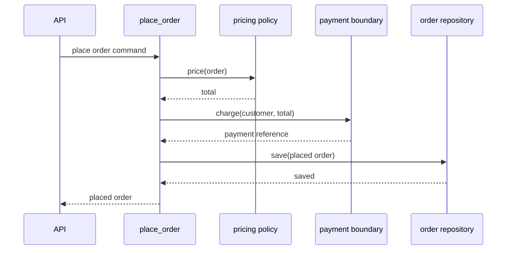

# SDP-FND-020 — Change pressure, responsibilities, and boundaries

## Physical Notebook Core

Keep this section short enough to reconstruct by hand. It is not a duplicate of the full note.

### Problem or change pressure

A checkout function prices an order, selects a payment provider, writes a database record, and
sends a receipt. Tax rules, provider APIs, storage, and messaging change for different reasons, but
every change edits the same function. The code has execution steps, yet no deliberate ownership.

### One-sentence mental model

> Follow a real change, name the responsibility it creates, give that responsibility to the
> smallest suitable owner, and place a boundary around the decision that varies.

### One essential visual

```text
Change pressure         Responsibility          Deliberate owner / boundary
────────────────────────────────────────────────────────────────────────────
line or quantity        compute subtotal   ───> Order (has the facts)
discount policy         price an order      ───> pricing callable
HTTP/API request        coordinate checkout ───> checkout controller
provider API format     charge payment      ───> payment adapter boundary
database technology     save order          ───> repository boundary

change ──reveals──> responsibility ──is assigned to──> owner
                                            └── hides volatile decision
```

### How to read this visual

Read each row from left to right. The first column says why code may change. The second names one
thing the software must know or do. The third assigns it to an owner and, where useful, a boundary.
The arrows mean design reasoning, not Python imports or literal runtime calls.

### Key insight

Execution order tells us when work happens; change pressure helps us decide where knowledge and
decisions belong.

### Simplification or limitation

Real responsibilities overlap and some changes cross boundaries, especially transactions and
security rules. The visual is a design map, not proof that every row needs a class or interface.

### Governing rules or invariants

1. Start from a concrete change, rule, or failure—not from a desired pattern name.
2. Keep information with the behaviour that legitimately needs it, unless that behaviour is a
   separate policy with a different reason to change.
3. Add indirection only when it protects a valuable decision or collaboration boundary.

### Minimal Python example

```python
from dataclasses import dataclass


@dataclass(frozen=True)
class Line:
    unit_price: int
    quantity: int

    def subtotal(self) -> int:
        return self.unit_price * self.quantity


@dataclass(frozen=True)
class Order:
    lines: tuple[Line, ...]

    def subtotal(self) -> int:
        return sum(line.subtotal() for line in self.lines)
```

`Line` and `Order` are Information Experts for these calculations because they already hold the
required facts. A country-specific tax rule would usually be a separate policy because its reason
to change is legislation, not the representation of an order.

### One common misconception

**Mistake:** “Single responsibility means every class or function may do only one tiny action.”

**Correction:** A useful responsibility is a cohesive obligation owned for a reason. One owner may
perform several related steps; splitting every line merely moves complexity into collaboration.

### Important trade-offs

- Fewer boundaries are easier to read today; well-placed boundaries localize proven variation.
- Extra owners can improve change isolation, but each dependency, name, and failure handoff adds
  coordination cost.

### Interview-revision cues

- Ask “what change or decision is this code responsible for?” before naming a pattern.
- Use GRASP as a set of competing responsibility-assignment lenses, not a nine-step checklist.
- Reject a new service, interface, or class when the direct design has no costly variation yet.

## Unit metadata

| Field | Value |
|---|---|
| Domain | Design foundations |
| Curriculum | [SDP-FND-020](../../../CURRICULUM.md#sdp-fnd-020) |
| Progress | [PROGRESS.md](../../../PROGRESS.md) |
| Python references | [PYTHON_REFERENCES.md](../../../PYTHON_REFERENCES.md) — no direct prerequisite mapping |
| Learning outcome | Identify change pressure, assign responsibilities with all nine GRASP lenses, and draw boundaries around stable decisions. |
| Hard prerequisites | `SDP-FND-010` |
| Soft prerequisites | None |
| Priority | Core |
| Interview frequency | High |
| Production frequency | High |
| Python/backend relevance | High |
| Depth | D2 |
| Scope | Design |
| Size | M |
| Evidence profile | E+D+T |
| Canonical Python | Python 3.14 |
| Interview compatibility | Python 3.11 |
| Artifact state | Approved |

The frequency fields above are curriculum judgments, not measurements from a population survey.

## 1. Simple explanation

Software design is largely a series of ownership decisions:

- Who knows the facts needed for this rule?
- Who performs this operation?
- Who receives and coordinates this use case?
- Which detail is allowed to change without spreading through the system?

Suppose a small shop initially needs one checkout path. One function may be the clearest design. It
can calculate a total, call one payment function, and return a confirmation. Then real pressures
arrive:

- Finance changes discount and tax policy.
- A second payment provider uses a different request format.
- Operations needs retry-safe order persistence.
- Customer support needs receipts to be resent without charging again.

Those pressures do not automatically demand four classes. They reveal four responsibilities that
should no longer be owned accidentally by one changing block of code. GRASP provides questions for
choosing owners. A boundary keeps a stable business decision from knowing an unstable mechanism.

## 2. The three-part reasoning chain

### Change pressure

A **change pressure** is a concrete force that may require the design to move: a new business rule,
provider, input source, failure policy, performance constraint, regulation, or testability need.
“This might change someday” is too vague. Name the likely change and its source.

Useful examples:

- “Tax calculation varies by destination and legislation.”
- “The payment provider may change, but checkout still needs a charge result.”
- “A duplicate request must not charge twice.”

### Responsibility

A **responsibility** is an obligation to know, decide, create, coordinate, or perform something. It
describes behaviour and ownership before it describes a method name.

“Handle orders” is usually too broad. “Compute an order subtotal,” “select a price policy,” and
“coordinate the place-order use case” can be discussed and tested separately.

### Boundary

A **boundary** limits how knowledge crosses between responsibilities. In Python it may be a
function signature, callable, object, module, or package. A good boundary exposes the stable fact a
client needs and hides a decision the client should not own.

`charge(customer_id, amount)` is a useful boundary only if clients can depend on that meaning while
provider authentication, payloads, and error translation remain behind it. An interface whose
parameters mirror every field of one provider has moved the vendor API rather than hidden it.

## 3. Source-checked context

Craig Larman's *Applying UML and Patterns* presents GRASP in chapters devoted to designing objects
with responsibilities and separates that material from later Gang of Four patterns. The publisher's
description also characterizes the book as teaching responsibility-driven, iterative object design
([Pearson/InformIT book page](https://www.informit.com/store/applying-uml-and-patterns-an-introduction-to-object-9780131489066)).
This unit uses Larman's nine GRASP names as design lenses, then translates their intent into
ordinary Python functions, callables, modules, and objects rather than mechanically copying Java
class structures.

David Parnas's module-decomposition study compared two systems that could produce equivalent
runtime behaviour but assigned work and exposed design decisions differently. His proposed
criterion was to identify difficult or likely-to-change decisions and let modules hide those
decisions, instead of dividing modules merely by processing steps
([Parnas, “On the Criteria To Be Used in Decomposing Systems into Modules”](https://www.cs.lafayette.edu/~gexia/cs301/resources/parnas.html)).
That is the bridge from responsibility assignment to stable boundaries.

Boundaries should not be built for imagined features without cost analysis. Martin Fowler's YAGNI
discussion distinguishes speculative capability from refactoring that keeps existing code
malleable; delaying an unneeded feature does not mean neglecting code health
([Fowler, “Yagni”](https://martinfowler.com/bliki/Yagni.html)).

## 4. Formal working model

Use this model for a design decision:

```text
1. Observe:  What concrete requirement, failure, or rate of change creates pressure?
2. Name:     What must the software know, decide, create, coordinate, or do?
3. Assign:   Which existing or new owner is best placed to carry that responsibility?
4. Bound:    Which knowledge may cross the owner's boundary, and which decision stays hidden?
5. Verify:   Does the next realistic change become local without making today's design obscure?
```

The “owner” is not necessarily a class. It can be:

- a value object that already holds the required information;
- a pure function that expresses a policy;
- a use-case function that coordinates collaborators;
- an adapter object that translates a provider;
- a module that owns a representation or process-wide resource.

Responsibility assignment is successful when behaviour, knowledge, and reasons to change line up
well enough that the next modification has an understandable home.

## 5. The nine GRASP lenses

The lenses can support or oppose one another. For example, Information Expert may suggest putting a
calculation on `Order`, while High Cohesion may suggest extracting a fast-changing regulatory
policy. State the tension and choose for the concrete change pressure.

| Lens | Assignment question | Useful Python move | Guardrail |
|---|---|---|---|
| Information Expert | Who has the facts needed to fulfil this responsibility? | Put a derived value near the dataclass or object that owns its inputs. | Do not turn a data-rich object into the owner of unrelated policy, I/O, or orchestration. |
| Creator | Who contains, records, closely uses, or has the initialization data for the new value? | Let an aggregate, factory function, or composition root construct it. | Object construction does not automatically imply lifetime ownership or business authority. |
| Controller | Who should receive a system event and coordinate the use case? | Use a thin application function or controller object outside UI/framework details. | Do not let the controller calculate every rule or become a global “manager.” |
| Low Coupling | Which assignment minimizes unnecessary knowledge between owners? | Pass the narrow callable or value a client needs. | Zero coupling is impossible; optimize meaningful change isolation, not a count. |
| High Cohesion | Which owner can keep this responsibility with closely related work? | Group behaviour around one focused purpose and reason to change. | Cohesion does not mean one-line functions or one-method classes. |
| Indirection | Would an intermediary prevent two volatile participants from knowing each other? | Add a translator, adapter, dispatcher, or application service at the pressure point. | Every hop adds naming, navigation, latency, and failure-handling cost. |
| Polymorphism | Does behaviour vary by kind while the client operation stays stable? | Supply compatible callables or objects and let dispatch choose the behaviour. | A small stable conditional is often clearer than a speculative hierarchy or registry. |
| Protected Variations | Which point is demonstrably unstable, and what stable meaning can surround it? | Put provider, policy, or format variation behind a client-shaped operation. | Do not abstract every imaginable future variation. |
| Pure Fabrication | Would a non-domain owner preserve cohesion and reduce coupling? | Introduce a repository, mapper, gateway, or application service with a focused technical job. | Do not move all domain behaviour into vague `Service` classes. |

### Lenses are not scores

Do not award one point per lens and choose the highest total. Use them to expose consequences:

```text
Candidate: Order computes country tax

Information Expert: Order has lines and destination.                 supports
High Cohesion:       Tax law changes independently of order state.   opposes
Protected Variations:Jurisdiction rules are a known variation.       opposes

Decision: Order exposes taxable facts; a pricing policy owns tax law.
```

The conclusion is contextual. A tiny shop with one fixed inclusive price may reasonably keep the
calculation on `Order` until a separate policy actually exists.

## 6. Responsibility map for checkout

| Change or event | Responsibility | Owner | Why this owner | What stays outside |
|---|---|---|---|---|
| Quantity changes | Compute line subtotal | `OrderLine` | It owns unit price and quantity | Payment and persistence |
| Promotion rules change | Compute adjusted total | pricing function | Policy changes independently | Provider payload format |
| Place-order command arrives | Coordinate checkout | application controller | It owns the use-case sequence | Pricing formula and SQL |
| Provider API changes | Translate and charge | payment adapter | It knows the provider contract | Order internals |
| Storage engine changes | Save and load order | repository | Pure Fabrication protects persistence detail | Pricing and provider choice |
| Receipt channel changes | Deliver confirmation | notifier | Messaging is a separate effect | Charging authority |

This map is more informative than “split the big class.” It gives each movement a reason and a
reviewable boundary.

## 7. Before-design code and concrete pain

```python
def checkout(payload: dict[str, object], provider: str) -> dict[str, object]:
    total = sum(
        item["unit_price"] * item["quantity"]
        for item in payload["items"]
    )
    if payload["customer_tier"] == "gold":
        total -= total // 10

    if provider == "alpha":
        payment_ref = alpha_client.charge(payload["customer_id"], total)
    elif provider == "beta":
        payment_ref = beta_client.create_payment({"amount_cents": total})
    else:
        raise ValueError("unsupported provider")

    database.insert("orders", payload, total, payment_ref)
    mailer.send(payload["email"], f"Paid {total}")
    return {"total": total, "payment_ref": payment_ref}
```

This can be a sensible first implementation. Pain appears when independent changes collide:

- A tax change edits the same function as a provider integration.
- Tests need patched globals for payment, database, and email.
- Resending a receipt risks rerunning checkout and charging again.
- A framework payload shape leaks into pricing and persistence.
- A database failure after payment leaves an externally visible partial result.

The problem is not that the function is long. It is that it owns decisions whose change and failure
boundaries differ.

## 8. Minimal Pythonic design

Start with functions and explicit dependencies:

```python
from collections.abc import Callable
from dataclasses import dataclass


Money = int
PriceOrder = Callable[["Order"], Money]
Charge = Callable[[str, Money], str]
SaveOrder = Callable[["PlacedOrder"], None]


@dataclass(frozen=True)
class Order:
    order_id: str
    customer_id: str
    line_subtotals: tuple[Money, ...]

    def subtotal(self) -> Money:
        return sum(self.line_subtotals)


@dataclass(frozen=True)
class PlacedOrder:
    order_id: str
    total: Money
    payment_reference: str


def place_order(
    order: Order,
    *,
    price: PriceOrder,
    charge: Charge,
    save: SaveOrder,
) -> PlacedOrder:
    total = price(order)
    payment_reference = charge(order.customer_id, total)
    placed = PlacedOrder(order.order_id, total, payment_reference)
    save(placed)
    return placed
```

The types document three client-shaped boundaries, but no nominal interface hierarchy is required.
`Order` is the expert for its subtotal. `price` owns pricing policy. `charge` protects provider
variation. `save` is a Pure Fabrication for storage. `place_order` is the Controller and owns only
the use-case sequence.

This design does **not** solve payment idempotency, database transactions, or recovery. Better
responsibility assignment makes those missing production decisions visible; it does not solve them
automatically.

## 9. Collaboration and execution flow



### How to read this visual

Read top to bottom as one synchronous conceptual path. Each horizontal message crosses a
responsibility boundary. The controller knows the sequence and the stable meaning of each result,
not the pricing formula, provider payload, or storage representation.

### Key insight

Coordination is itself a responsibility, but coordinating work does not make the controller the
owner of every rule used in the workflow.

### Simplification or limitation

The diagram omits authentication, validation, transaction boundaries, duplicate-request handling,
timeouts, retries, and receipt delivery. A production implementation must decide which of those are
inside the use case and which belong to infrastructure or a later asynchronous workflow.

## 10. Simplest non-pattern alternative

Keep one direct function when all of these are true:

- there is one stable business rule;
- there is one local mechanism;
- failures have one simple boundary;
- tests can exercise behaviour without fragile global patching;
- the next change is cheaper than maintaining extra indirection now.

Even then, use meaningful names and keep irreversible effects visible. Deliberate simplicity is a
design choice; accidental ownership is not.

## 11. Refactoring path

1. Characterize current observable behaviour, including failures and effect order.
2. List concrete change pressures; do not begin with class names.
3. Name the responsibilities mixed in the current code.
4. Move calculations to existing Information Experts when their data and change reason align.
5. Extract one independently changing policy into a function or callable.
6. Pass one external effect through a narrow client-shaped boundary.
7. Leave a thin Controller that coordinates the use case.
8. Add the new requirement and inspect which owners changed.
9. Remove any abstraction that did not localize a real change or clarify a failure boundary.

Commit in small behaviour-preserving steps. A large “clean architecture” rewrite hides whether the
assignment improved anything.

## 12. Realistic backend use case

For `POST /orders`, the web handler should translate transport input into a use-case command and
invoke the checkout Controller. It should not become the owner of pricing or provider rules merely
because the request arrived through HTTP.

A practical boundary map might be:

```text
HTTP validation       transport layer
checkout sequence     application controller
subtotal invariant    order model
discount/tax policy   pricing policy
provider translation  payment adapter
durable order record  repository
receipt delivery      post-checkout effect or async handler
```

Framework decorators, dependency containers, and ORM models are mechanisms. Responsibility comes
from the change and rule being owned, not from the framework folder name.

## 13. Failure scenario: payment succeeds, save fails

Moving payment and persistence behind separate boundaries does not make them atomic. If the
provider accepts a charge and the repository then fails, retrying the entire request may charge the
customer twice.

The design must assign additional responsibilities explicitly:

- the Controller supplies or derives an idempotency key;
- the payment boundary preserves the provider's outcome and translates duplicate semantics;
- durable workflow state records enough information for reconciliation;
- retry policy distinguishes safe retries from uncertain external outcomes;
- observability correlates the order, attempt, and provider reference.

Detection requires more than a generic exception. Containment may return an “outcome uncertain”
state and prevent blind retry. Recovery may reconcile with the provider or compensate according to
business policy. These choices belong to a production workflow design, not to GRASP terminology by
itself.

## 14. Testing strategy

| Test type | What it proves | What not to overspecify |
|---|---|---|
| Unit | Order facts and pricing policies produce correct money values | Private helper or class count |
| Collaboration | Controller passes the priced amount and stores the returned payment reference | Exact internal call stack beyond the meaningful boundary |
| Contract | Each payment adapter maps stable charge semantics and errors consistently | Provider SDK implementation details |
| Integration | Persistence and provider sandbox behaviour at their actual boundaries | Unrelated web rendering or email templates |
| Failure-path | Duplicate, timeout, accepted-then-save-failed, and retry outcomes are explicit | Log wording unless it is a monitored contract |

Test observable responsibilities. A mock assertion for every internal call can freeze one
assignment and make later improvement unnecessarily expensive.

## 15. Observability and debugging

Record identifiers and outcomes at responsibility boundaries:

- `order_id`, request/idempotency key, and payment attempt ID;
- selected policy and provider without secrets or full payment payloads;
- priced amount and currency with an explicit representation;
- stage transitions such as `priced`, `charge_requested`, `charged`, and `save_failed`;
- translated error category and retryability.

When a failure occurs, ask which owner made the last durable decision and which external effect may
already have happened. Boundary-aware logs are more useful than one large “checkout failed” entry.

## 16. Variants and granularity

Responsibility assignment works at several levels:

- **Function:** a pure pricing function owns one policy.
- **Object:** an `Order` owns invariants over its lines.
- **Module:** `payments.py` owns provider translation for a small application.
- **Package or service:** a payment component owns a larger operational boundary when scale,
  security, or team ownership justifies it.

Do not jump from a mixed function directly to a network service. Distribution adds latency,
partial failure, deployment, compatibility, security, and observability responsibilities.

## 17. Related units

| Related unit | Relationship | Key difference |
|---|---|---|
| `SDP-FND-010` | Prerequisite vocabulary | Distinguishes kinds of design knowledge before applying GRASP lenses. |
| `SDP-FND-030` | Next analytical depth | Examines cohesion, coupling, and dependency direction in detail. |
| `SDP-FND-040` | Boundary mechanics | Separates abstraction, encapsulation, information hiding, and contracts. |
| `SDP-FND-050` | Assignment mechanism | Compares composition, delegation, and inheritance under real change forces. |
| `SDP-FND-060` | Variation mechanism | Develops polymorphism, dynamic dispatch, and substitutability. |
| `SDP-SOL-010` | Later principle | Sharpens “reason to change” for classes, functions, and modules. |

## 18. When to use these lenses

- A use case mixes business rules, coordination, provider details, and persistence.
- A new requirement touches several unrelated places.
- A large class delegates nothing, or many tiny classes only forward calls.
- A team disagrees about where a rule belongs.
- A boundary mirrors a volatile supplier instead of expressing stable client needs.
- A refactoring proposal starts with a pattern name but has no stated change pressure.

## 19. When not to add a boundary

- The behaviour is small, local, stable, and easier to read directly.
- The proposed owner has no clearer responsibility than the existing one.
- The only justification is a hypothetical provider or feature.
- The new abstraction leaks the same volatile details with more files.
- The change must remain atomic and splitting ownership would obscure that invariant.

You can still name responsibilities in a simple function. Clear reasoning does not require a large
structure.

## 20. Common misuse and overengineering

| Misuse | Why it happens | Better move |
|---|---|---|
| One class per verb | Responsibility is confused with a single instruction | Group related behaviour around one coherent obligation |
| “Manager” or “Service” owns everything | Controller is mistaken for the whole use case's business expert | Keep coordination thin and delegate rules to suitable owners |
| Domain model owns SQL, HTTP, email, and pricing | Information Expert is interpreted as “the object knows everything” | Keep only responsibilities supported by its information and reason to change |
| Interface for every function | Protected Variations is applied without proven variation | Start with a function or direct call; extract at an actual pressure point |
| Wrapper that only renames a provider method | Indirection is treated as automatically valuable | Translate to stable client meaning or remove the wrapper |
| All behaviour moved into services | Pure Fabrication is overused | Let domain values keep legitimate calculations and invariants |
| Conditional replaced by a class hierarchy | Polymorphism is preferred by slogan | Keep a readable conditional until variations need independent ownership |
| Microservice per responsibility | Logical ownership is confused with deployment | Refactor in-process boundaries before paying distributed-system costs |

## 21. Interview preparation

### Common formulations

1. How do you decide where behaviour belongs?
2. Explain the nine GRASP responsibility-assignment lenses with one example.
3. What is the difference between a Controller and a God object?
4. When is Pure Fabrication better than Information Expert?
5. How do Protected Variations and Indirection differ?
6. How would you refactor a checkout function that owns pricing, payment, storage, and email?

### Strong answer shape

1. Name a concrete change pressure.
2. Separate knowing, deciding, coordinating, and performing responsibilities.
3. Compare at least two candidate owners with relevant GRASP lenses.
4. State the stable boundary and the volatile decision it hides.
5. Show the smallest Python mechanism that is sufficient.
6. Name coordination, testing, and failure trade-offs.
7. Say when the direct design should remain.

### Weak-answer traps

- Listing nine definitions without applying them to competing owners.
- Saying “low coupling and high cohesion” without naming a dependency or reason to change.
- Treating Controller as a web-framework class rather than a use-case responsibility.
- Claiming a repository, protocol, or service is always required.
- Ignoring partial failures after introducing external boundaries.

### Likely follow-ups

1. Tax calculation needs order facts but changes with legislation. Where does it belong and why?
2. A second provider never arrives. Which abstraction would you remove?
3. Payment succeeds and persistence fails. Which responsibilities are still missing?
4. How would the design differ if all operations were local and deterministic?

## 22. Closed-book revision cues

1. Reconstruct the change → responsibility → owner → boundary visual.
2. Define change pressure, responsibility, owner, and boundary in plain language.
3. Name all nine GRASP lenses and give one sentence for each.
4. Resolve one tension between Information Expert and High Cohesion.
5. Distinguish Controller, Indirection, and Pure Fabrication.
6. Refactor one mixed workflow using only functions and explicit dependencies.
7. Reject one speculative abstraction.
8. Explain one partial-failure case that separation alone does not solve.

## 23. Vocabulary and professional English

### Responsibility

| Item | Content |
|---|---|
| Pronunciation | ri-spon-suh-BIL-uh-tee |
| Simple English meaning | A duty or obligation that someone or something owns |
| Hindi cue | zimmedari |
| Meaning in this design context | Knowledge, a decision, coordination, creation, or action assigned to a software owner |

Natural examples:

1. The courier has responsibility for the parcel after pickup.
2. Finance owns responsibility for approving the policy.
3. The scheduler has responsibility for starting the job.
4. **Interview:** “I would assign pricing responsibility to a policy with one reason to change.”
5. **Engineering discussion:** “Retry responsibility is still unclear after this extraction.”

### Boundary

| Item | Content |
|---|---|
| Pronunciation | BOWN-duh-ree |
| Simple English meaning | A line that limits an area or responsibility |
| Hindi cue | seema |
| Meaning in this design context | The stable point through which owners collaborate while selected details remain hidden |

Natural examples:

1. The fence marks the garden boundary.
2. The contract sets a boundary between the teams' obligations.
3. A function signature can be a small software boundary.
4. **Interview:** “The charge operation is client-shaped; provider payloads stay behind the boundary.”
5. **Engineering discussion:** “This DTO leaks storage decisions across the domain boundary.”

### Volatile

| Item | Content |
|---|---|
| Pronunciation | VOL-uh-tile |
| Simple English meaning | Likely to change quickly or unpredictably |
| Hindi cue | jaldi badalne wala |
| Meaning in this design context | A decision, rule, format, or dependency whose change should be contained |

Natural examples:

1. Fuel prices can be volatile.
2. The launch date became volatile after the supplier delay.
3. Provider error formats are a volatile integration detail.
4. **Interview:** “I would not expose that volatile SDK type to the use case.”
5. **Engineering discussion:** “We isolated the volatile tax table, not the stable order facts.”

### Cohesive

| Item | Content |
|---|---|
| Pronunciation | koh-HEE-siv |
| Simple English meaning | Forming a clear, unified whole |
| Hindi cue | ekjut |
| Meaning in this design context | Holding responsibilities that support one focused purpose or reason to change |

Natural examples:

1. The editor made the report more cohesive.
2. A cohesive team understands its shared goal.
3. The module is cohesive because every function supports price calculation.
4. **Interview:** “The controller is cohesive when it coordinates one use case.”
5. **Engineering discussion:** “Email rendering weakens the pricing module's cohesive purpose.”

## 24. Python Mastery references

`PYTHON_REFERENCES.md` has no direct cross-repository prerequisite mapping for `SDP-FND-020`.
The examples require only basic functions, dataclasses, iteration, type annotations, and explicit
argument passing. The design lesson is ownership; `Callable` is merely one lightweight Python way
to express a replaceable collaborator.

## 25. Authoritative sources

1. Craig Larman, *Applying UML and Patterns*, 3rd edition, publisher description and table of
   contents for responsibility-driven design and GRASP chapters:
   [Pearson/InformIT](https://www.informit.com/store/applying-uml-and-patterns-an-introduction-to-object-9780131489066).
2. David L. Parnas, “On the Criteria To Be Used in Decomposing Systems into Modules,” especially
   “Comparison of the Two Modularizations,” “The Criteria,” and “Conclusion”:
   [HTML transcription](https://www.cs.lafayette.edu/~gexia/cs301/resources/parnas.html).
3. Martin Fowler, “Yagni,” especially the distinction between presumptive capability and
   refactoring for malleability: [martinfowler.com](https://martinfowler.com/bliki/Yagni.html).
