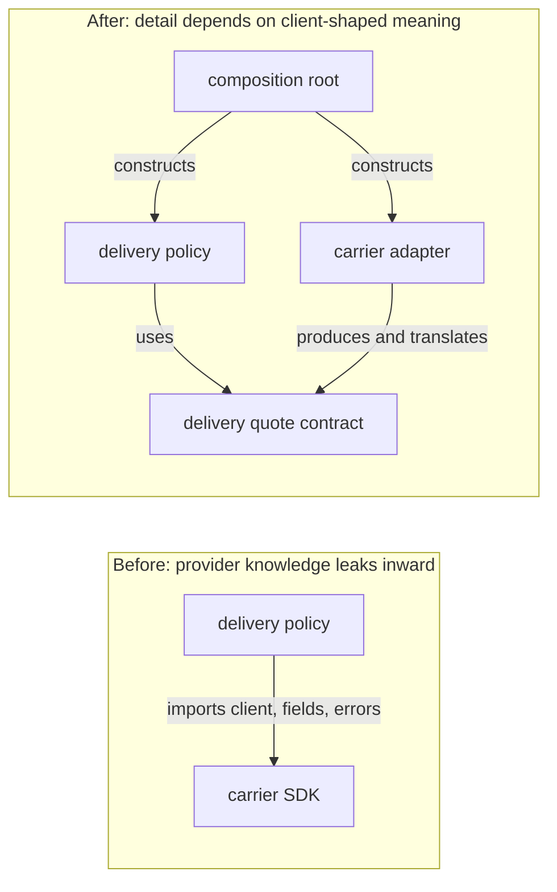
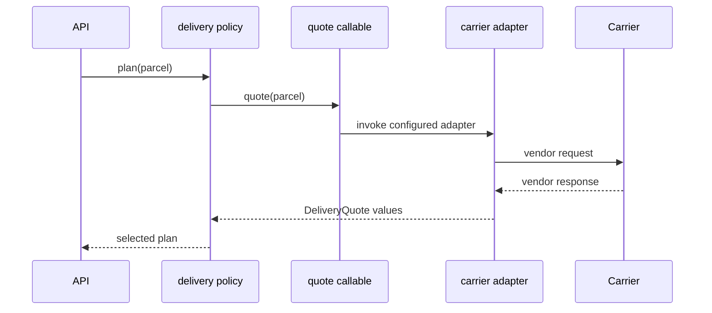

# SDP-FND-030 — Cohesion, coupling, and dependency direction

## Physical Notebook Core

Keep this section short enough to reconstruct by hand. It is not a duplicate of the full note.

### Problem or change pressure

A delivery-planning function applies business rules but also imports one carrier SDK, builds that
vendor's request, reads its response fields, and catches its exceptions. A carrier API change now
forces edits in business policy. Adding a second carrier duplicates both translation and policy.

### One-sentence mental model

> Put code that changes for one reason together, minimize knowledge that crosses boundaries, and
> make volatile details depend on the stable decision that uses them.

### One essential visual

```text
Inside one boundary                              Across boundaries
───────────────────                             ─────────────────
facts + rules + invariants                       A ──depends on──> B
for one focused purpose                          means a relevant change in B
          │                                      may force A to change
          └── cohesion

Volatile carrier detail ──depends on──> stable delivery contract <── delivery policy
                                             ↑
                                      composition root wires them
```

### How to read this visual

Read the left side as an inside question: do these elements serve one focused purpose and change
together? Read `A ──depends on──> B` as “A knows enough about B that a relevant change in B may
affect A.” On the bottom row, both policy and the carrier adapter know the stable delivery meaning;
the policy does not know the carrier schema. The arrows describe source knowledge, not runtime
call direction.

### Key insight

Good design does not remove dependencies. It chooses cohesive boundaries and makes unavoidable
dependencies point toward meanings that are more stable for the use case.

### Simplification or limitation

Real systems also have data, temporal, deployment, team, and operational dependencies. A source
diagram exposes only one view, and “stable” is a contextual forecast backed by observed change—not
a permanent property.

### Governing rules or invariants

1. Judge cohesion against a named purpose and change pressure, not function or class size.
2. Judge coupling by knowledge, direction, and volatility, not by counting imports alone.
3. Keep business policy independent of vendor formats; translate at the boundary and wire concrete
   collaborators at the edge.

### Minimal Python example

```python
from collections.abc import Callable, Sequence
from dataclasses import dataclass


@dataclass(frozen=True)
class Parcel:
    zone: str
    weight_grams: int


@dataclass(frozen=True)
class DeliveryQuote:
    service: str
    price_cents: int
    days: int


QuoteDelivery = Callable[[Parcel], Sequence[DeliveryQuote]]


def choose_cheapest(parcel: Parcel, quote: QuoteDelivery) -> DeliveryQuote:
    return min(quote(parcel), key=lambda candidate: candidate.price_cents)
```

`choose_cheapest` is cohesive around one policy. It depends on the client-shaped meaning
“quote this parcel,” not on a carrier class, payload, or exception type. A plain callable is enough;
no interface hierarchy is required.

### One common misconception

**Mistake:** “Low coupling means as few dependencies as possible, so one large module is safest.”

**Correction:** Merging unrelated work hides the arrows but lowers cohesion and concentrates change.
The goal is small, explicit, well-directed knowledge across useful boundaries—not zero arrows.

### Important trade-offs

- A boundary can localize change and testing, but it adds a name, contract, translation, and
  navigation step.
- Direct concrete use is often clearest for one stable local detail; indirection earns its keep when
  volatility or independent testing makes the change cost real.

### Interview-revision cues

- Always label the arrow: source import, runtime call, data, time, deployment, or ownership.
- Ask what changes together for cohesion and what one side must know about the other for coupling.
- A composition root may have high fan-out by design; business policy importing infrastructure is
  the more important direction smell.

## Unit metadata

| Field | Value |
|---|---|
| Domain | Design foundations |
| Curriculum | [SDP-FND-030](../../../CURRICULUM.md#sdp-fnd-030) |
| Progress | [PROGRESS.md](../../../PROGRESS.md) |
| Python references | [PYTHON_REFERENCES.md](../../../PYTHON_REFERENCES.md) — no direct prerequisite mapping |
| Learning outcome | Evaluate cohesion, coupling, dependency shape, and the cost of changing one part of a Python system. |
| Hard prerequisites | `SDP-FND-020` |
| Soft prerequisites | None |
| Priority | Core |
| Interview frequency | High |
| Production frequency | High |
| Python/backend relevance | High |
| Depth | D2 |
| Scope | Design |
| Size | M |
| Evidence profile | E+D+T |
| Canonical Python | Python 3.14 |
| Interview compatibility | Python 3.11 |
| Artifact state | Approved |

The frequency fields above are curriculum judgments, not measurements from a population survey.

## 1. Simple explanation

Software is made of parts: expressions, functions, classes, modules, packages, processes, and
services. Two questions help decide whether those parts are shaped well.

1. **Cohesion:** Do the things inside this part belong together?
2. **Coupling:** What must this part know about other parts?

Suppose `delivery.py` contains address normalization, carrier payload construction, cheapest-rate
selection, database writes, HTML email rendering, and retry timing. The filename gives those lines
one physical home, but it does not give them one reason to change. That is weak cohesion.

Now suppose the cheapest-rate rule imports `AcmeCarrierClient`, reads `productCode`, converts
kilograms, and catches `AcmeTimeout`. The rule knows carrier-specific details. That is strong,
poorly directed coupling: a provider change can force a business-policy change.

A better design usually puts related policy together and translates external details at a boundary.
The policy still depends on something—it needs delivery quotes—but it depends on the small meaning
it actually uses. The adapter depends on that meaning and converts the vendor's representation.

## 2. Start with the change, not the graph

Use a concrete change scenario:

> Add a second carrier whose weight unit, response fields, and failure types differ, while keeping
> the delivery-selection rules unchanged.

Then ask:

- Which code owns selection policy?
- Which code owns carrier translation?
- Which facts must cross the boundary?
- Which source modules import which names?
- Which tests and deployments should the carrier change affect?

Without a change scenario, “high cohesion” and “low coupling” become aesthetic labels. A useful
boundary predicts and then limits the blast radius of a real change.

## 3. Working definitions

### Boundary

A **boundary** is the edge of the part being evaluated. State its granularity before judging it:

- statements inside a function;
- methods and data inside a class;
- functions and classes inside a module;
- modules inside a package;
- components inside a deployable service.

The same code can be cohesive at one level and not another. Two methods may form a cohesive class,
while that class sits in a package containing unrelated concerns.

### Cohesion

**Cohesion** is how strongly the elements inside a boundary contribute to a focused purpose. Useful
evidence includes shared invariants, information, vocabulary, and reasons to change.

High cohesion is not “one method per class.” A parser may have several stages that together enforce
one grammar. A one-method `UtilityManager` can still be incohesive if the method switches among
unrelated operations.

### Coupling

**Coupling** is the knowledge or constraint one part has about another. If a relevant change in B
can require A to change, retest, coordinate, or redeploy, A is coupled to B along that dimension.

Coupling is unavoidable. A useful program must collaborate. The questions are:

- What knowledge crosses?
- Is it necessary?
- Is it explicit?
- Which way does it point?
- How volatile is the thing being depended on?
- What is the failure and change cost?

### Dependency

A **dependency** is a particular relation that creates coupling. Examples include importing a
symbol, calling an operation, consuming a schema, sharing mutable state, requiring initialization
order, or deploying against a particular service version.

### Dependency direction

For this unit, the arrow convention is:

```text
A ──depends on──> B
```

A is the consumer; B supplies knowledge, behaviour, data, or timing that A requires. Always write
the verb above the arrow when ambiguity matters.

### Cost of change

The **cost of change** is not just edited lines. It can include:

- modules and tests that need modification;
- knowledge a developer must load to make the change safely;
- teams or repositories that must coordinate;
- compatibility and migration work;
- artifacts that must be rebuilt or deployed together;
- new partial-failure, security, or operational risk.

## 4. Source-checked context

Stevens, Myers, and Constantine's 1974 *Structured Design* paper is an early published treatment of
designing systems from functional modules and analyzing inter-module connections and intra-module
relatedness. The terms arose in a structured-programming setting, before today's Python modules,
objects, APIs, and services, so this unit preserves the reasoning rather than treating the original
category ladders as modern quality scores
([IBM Systems Journal bibliography](https://www.sigmod.org/publications/dblp/db/journals/ibmsj/ibmsj13.html)).

Parnas compared process-step decomposition with modules organized around hidden design decisions.
He evaluated modularization by independent work, flexibility, and comprehensibility, and later
separated clean decomposition from a hierarchical `uses` relation: both are valuable, but they are
not the same property. His conclusion recommends starting from difficult or likely-to-change
decisions rather than a flowchart
([Parnas, 1971 technical report](https://prl.khoury.northeastern.edu/img/p-tr-1971.pdf)).

In Python, `import` is a concrete language mechanism that searches for a module and binds the result
to a name. An import graph is therefore useful evidence about source/runtime module dependencies,
but it is not the entire design graph: JSON fields, callback meaning, environment variables, and
deployment order can couple modules without a direct import
([Python 3.14 import-system reference](https://docs.python.org/3.14/reference/import.html)).

## 5. How to evaluate cohesion

Ask a boundary to complete one sentence:

> This part exists to ____________________.

Then inspect each element. Does it directly serve that purpose, preserve one of its invariants, or
support the same change pressure? If the sentence needs “and also,” the boundary may contain more
than one responsibility.

### Practical cohesion signals

| Signal | More cohesive interpretation | Warning sign |
|---|---|---|
| Purpose | One specific outcome or capability | A vague label such as `helpers`, `manager`, or `common` |
| Information | Operations use the same meaningful data and invariants | Methods touch disjoint fields or pass unrelated structures |
| Change | Elements normally change for the same business or technical reason | Unrelated stakeholders repeatedly edit the same file |
| Vocabulary | Names belong to one domain concept | Transport, persistence, policy, and vendor terms are mixed |
| Reuse | The unit is useful as a whole | Clients import unrelated fragments and ignore the rest |
| Tests | Behaviour can be described through a focused fixture | Every test sets up unrelated globals and mechanisms |

No row is proof by itself. A module can serve one purpose while using several data structures; a
data model can legitimately support several closely related operations.

### A diagnostic continuum, not a score

Early structured-design literature used categories such as coincidental, logical, temporal,
procedural, communicational, sequential, and functional cohesion. For modern Python, these are best
used as questions rather than a rigid ranking:

| Grouping reason | Example | Diagnostic question |
|---|---|---|
| Coincidental | `misc.py` contains slugging, retries, money math, and email | What real purpose holds these together? |
| Logical category | One function chooses unrelated operations from a mode flag | Do clients need one capability or a menu of unrelated ones? |
| Time | Startup code loads config, opens pools, and warms caches | Is lifecycle coordination itself the honest purpose? |
| Procedure | Steps appear together only because they run in sequence | Do they hide different decisions that change independently? |
| Shared information | Several operations protect one order representation | Are the information and invariants the real cohesive center? |
| Pipeline | One stage's output becomes the next stage's input | Can each stage change and be understood independently? |
| Focused function | All elements deliver one named business outcome | Is the purpose stable and useful to its clients? |

Temporal or pipeline cohesion is not automatically bad. A startup composition root is cohesive
around application assembly even though it touches many components. Context decides whether the
grouping matches an honest responsibility.

## 6. Coupling is multidimensional

Two modules can be loosely coupled by import and tightly coupled by data meaning. Review more than
the visible call.

| Dimension | Python/backend symptom | Change cost | Better question |
|---|---|---|---|
| Source/name | Direct import of a concrete provider or private helper | Renames and package changes ripple | Can the client depend on its own small need? |
| Signature | Many parameters or a vendor-shaped method | Call sites move whenever the supplier moves | What is the smallest stable operation? |
| Data shape | Passing a large `dict` or ORM model across layers | Consumers learn fields they do not need | Can the boundary use an owned value type? |
| Semantic | Both sides assume units, rounding, status meaning, or sentinel values | Code still runs but produces the wrong result | Is meaning explicit and contract-tested? |
| Control | Boolean or string flags tell another module what branch to run | The caller knows the callee's internal decisions | Should the caller request an outcome instead? |
| Exception | Business code catches SDK-specific errors | Provider upgrades edit policy and handlers | Where should errors be translated? |
| Shared state | Modules mutate one cache, list, singleton, or environment view | Order and concurrency become implicit | Who owns mutation and lifetime? |
| Temporal | `configure()` must run before `send()` | Valid calls depend on hidden history | Can construction or state make order explicit? |
| Deployment | Two services must release in lockstep | A local code change becomes coordination work | Can compatibility be additive and versioned? |

“Data coupling” through a small value is often desirable; it is how useful collaboration happens.
Semantic coupling is also unavoidable—the parties must agree what `price_cents` means. The aim is
to make that meaning narrow, stable, and owned.

## 7. Three graphs that are often confused

```text
SOURCE / IMPORT GRAPH             RUNTIME CALL GRAPH              DATA FLOW

app_policy.py                     app_policy                      request
    │ imports                         │ calls                          │
    ▼                                 ▼                                ▼
contract.py                       injected quoter                  carrier adapter
    ▲                                 │                                │
    │ imports                         ▼                                ▼
carrier_adapter.py                carrier adapter                  normalized quotes
                                                                       │
composition.py imports both                                            ▼
                                                                  app policy
```

### How to read this visual

Each column answers a different question. The source graph records which code names other code. The
runtime graph records control transfer for one request. The data-flow graph follows values. In the
example, policy calls outward at runtime while source dependencies remain pointed toward the stable
contract.

### Key insight

Runtime control can flow from policy to an injected adapter without policy importing the adapter.
“Who calls whom?” is therefore not enough to describe dependency direction.

### Simplification or limitation

Dynamic imports, plugin lookup, structural typing, serialization, and framework wiring can hide
edges from a simple static import graph. The diagrams also omit error and cancellation flow.

## 8. Direct dependency versus a protected boundary



### How to read this visual

Read every arrow as a source-level dependency. Before refactoring, the stable selection rule knows
the volatile carrier. After refactoring, the policy knows only delivery concepts. The adapter knows
both the carrier and the client-owned contract, while the composition root deliberately knows the
concrete assembly.

### Key insight

The adapter absorbs volatility; the composition root absorbs concreteness. The business policy is
not made dependency-free—it is protected from the wrong dependency.

### Simplification or limitation

This is one-process composition. Network boundaries require explicit compatibility, timeouts,
retries, authentication, observability, and deployment reasoning. An abstraction can also be wrong
or unstable; arrow direction cannot rescue a poor contract.

## 9. Before design and concrete pain

```python
from acme_carrier import AcmeCarrierClient, AcmeZoneError


def choose_delivery(parcel: Parcel) -> DeliveryPlan:
    client = AcmeCarrierClient.from_environment()
    try:
        rates = client.fetch_rates(
            {"postalZone": parcel.zone, "weightKg": parcel.weight_grams / 1_000}
        )
    except AcmeZoneError as exc:
        raise DeliveryUnavailable(parcel.zone) from exc

    eligible = rates if not parcel.urgent else [rate for rate in rates if rate["etaDays"] <= 2]
    chosen = min(eligible, key=lambda rate: rate["totalCents"])
    return DeliveryPlan(
        service=chosen["productCode"],
        price_cents=chosen["totalCents"],
        days=chosen["etaDays"],
    )
```

This works for the first provider. The pain is its dependency shape:

- construction and environment lookup hide the collaborator;
- policy knows kilograms and three vendor field names;
- policy catches a vendor exception;
- tests must patch where the concrete client is looked up;
- a second carrier adds provider branches around the same selection rule;
- a schema-only change retests and potentially redeploys business policy.

The problem is not merely the direct import. Deleting that line while retaining vendor-shaped
`dict` values would leave semantic and data-shape coupling intact.

## 10. Minimal Pythonic design

Use owned values and an explicit callable:

```python
from collections.abc import Callable, Sequence
from dataclasses import dataclass


@dataclass(frozen=True)
class Parcel:
    zone: str
    weight_grams: int
    urgent: bool = False


@dataclass(frozen=True)
class DeliveryQuote:
    service: str
    price_cents: int
    days: int


QuoteDelivery = Callable[[Parcel], Sequence[DeliveryQuote]]


def choose_delivery(parcel: Parcel, quote_delivery: QuoteDelivery) -> DeliveryQuote:
    eligible = [
        quote
        for quote in quote_delivery(parcel)
        if not parcel.urgent or quote.days <= 2
    ]
    if not eligible:
        raise DeliveryUnavailable(parcel.zone)
    return min(eligible, key=lambda quote: (quote.price_cents, quote.days, quote.service))
```

The cohesive policy owns eligibility and selection. It knows only `Parcel`, `DeliveryQuote`, and the
meaning of a quoting callable. The tuple key makes tie-breaking part of the explicit policy.

The callable is an abstraction in the design sense even though it is not an abstract base class.
Python's ordinary ability to pass functions or callable objects often supplies enough indirection.

## 11. Adapter and composition at the edge

The provider translation can remain a function:

```python
def acme_quoter(client: AcmeCarrierClient) -> QuoteDelivery:
    def quote(parcel: Parcel) -> tuple[DeliveryQuote, ...]:
        try:
            raw_rates = client.fetch_rates(
                {"postalZone": parcel.zone, "weightKg": parcel.weight_grams / 1_000}
            )
        except AcmeZoneError as exc:
            raise DeliveryUnavailable(parcel.zone) from exc

        return tuple(
            DeliveryQuote(
                service=rate["productCode"],
                price_cents=rate["totalCents"],
                days=rate["etaDays"],
            )
            for rate in raw_rates
        )

    return quote
```

The application edge wires the concrete graph:

```python
client = AcmeCarrierClient.from_environment()
quote_delivery = acme_quoter(client)
plan = choose_delivery(parcel, quote_delivery)
```

The closure owns the client's lifetime without requiring a `QuoterFactory` or class hierarchy. A
stateful adapter class is justified when it must manage connection state, caching, metrics, or more
than one related operation.

### Where should the contract live?

Put the contract near the policy that needs it, or in a small neutral module owned by that policy.
Do not put a client-shaped interface inside the vendor package merely because the vendor supplies
the behaviour. Ownership affects which direction source imports must point.

Detailed choices among duck typing, `Protocol`, and ABCs belong to `SDP-FND-070`; the dependency
reasoning here is the same whichever Python typing mechanism is chosen.

## 12. Change-impact map

```text
Change: Acme renames totalCents and begins returning decimal major units

Before
carrier SDK ──> delivery policy ──> policy tests ──> API assembly
                 ^ vendor meaning spreads through this path

After
carrier SDK ──> Acme adapter ──> adapter contract tests
                       │
                       └── emits unchanged DeliveryQuote

delivery policy and its selection tests remain unchanged
```

### How to read this visual

Follow the named change from left to right. Every box that understands the changed field or unit is
in the likely blast radius. The refactored adapter converts the new representation back to the
unchanged client-owned meaning.

### Key insight

A boundary earns its cost when a realistic change stops at it while observable business behaviour
continues through the same contract.

### Simplification or limitation

Contract tests and production rollout may still need updates. If the provider's semantic meaning
changes—not just its representation—the delivery contract and policy may legitimately need review.

### Change-cost ledger

Use a small ledger instead of “more decoupled”:

| Change | Before: likely affected | After: likely affected | Residual risk |
|---|---|---|---|
| Carrier field/unit change | Policy, provider code, mixed tests | Adapter and adapter contract tests | Conversion and rounding error |
| New carrier | Policy branch, mixed tests, wiring | New adapter, its tests, wiring | Contract may fit one vendor only |
| Urgent threshold changes | Mixed policy/provider function | Policy and policy tests | Callers may rely on old choice |
| Add tracing | Policy or SDK patches | Boundary decorator or adapter | Context propagation remains coupled |
| Quote meaning changes | Many consumers | Contract, adapters, policy, consumers | Broad change is legitimate |

The last row matters: no boundary can localize a genuine change to shared meaning. Good design
reduces accidental propagation; it does not pretend all changes are local.

## 13. Dependency-shape heuristics

### Fan-out

High fan-out means one part depends on many others. It can signal an orchestrator that knows too
much, but a composition root naturally imports many concrete pieces. Ask whether the part owns
assembly or business decisions before judging the count.

### Fan-in

High fan-in means many parts depend on one part. That can mark a useful stable policy or value type.
It also raises compatibility risk: changing a widely used contract can have a large blast radius.
Protect its semantics and evolve it deliberately.

### Cycles

In a dependency cycle, understanding, testing, or changing one participant may require the whole
cycle. Cycles are especially costly across packages, teams, deployments, or initialization phases.
Break the misplaced ownership or extract a stable shared meaning; moving imports inside functions
can hide a Python import error without fixing the design cycle.

### Distance from volatility

A dependency on a small stable value type is usually cheaper than a dependency on an SDK client,
ORM session, framework request, or raw external schema. Count what the client must know, not merely
how many arrows appear.

## 14. Refactoring path

1. Characterize observable policy, provider requests, errors, and effect order.
2. Name one concrete change and mark every location that understands it.
3. Separate the business meaning from the provider representation on paper.
4. Introduce owned input and result values at the smallest useful boundary.
5. Pass the current collaborator explicitly; keep behaviour unchanged.
6. Move provider request, response, unit, and error translation into one adapter.
7. Move concrete construction to the composition edge.
8. Add the new provider or policy change.
9. Compare the actual touched modules and tests with the prediction.
10. Remove interfaces, wrappers, or modules that did not localize a change or clarify ownership.

Do not begin by creating `interfaces/`, `services/`, and `factories/` packages. First make one
specific dependency visible and point it toward one useful contract.

## 15. Realistic backend use case

An API receives a delivery request. Application policy validates the parcel, asks for normalized
quotes, applies urgency and price rules, and returns a plan. An adapter translates one carrier's
HTTP schema and failures. The application composition root supplies credentials, HTTP client
lifetime, timeouts, and the chosen adapter.



### How to read this visual

Read top to bottom as one request. The runtime call travels outward to the carrier and normalized
data travels inward. The policy owns selection; the adapter owns translation; the composition edge
owns concrete configuration.

### Key insight

The boundary is not merely for easier mocking. It keeps business vocabulary and provider
vocabulary cohesive in different owners.

### Simplification or limitation

The sequence omits authentication, retries, rate limits, caching, cancellation, tracing, and
multiple-provider fan-out. Those mechanisms must not silently redefine policy or error meaning.

## 16. Failure scenario: provider details leak through the boundary

Suppose the adapter returns `None` on timeout, an empty tuple for an unsupported zone, and raises a
vendor exception for invalid credentials. Policy now needs three provider-specific branches even
though the import arrow looks clean.

Detection:

- policy tests mention vendor exception classes or sentinel rules;
- API handlers map provider status codes directly;
- logs lack a stable error category;
- adding a provider grows conditionals outside its adapter.

Containment:

- define meaningful application outcomes such as `DeliveryUnavailable`, `InvalidParcel`, and
  `QuoteServiceUnavailable`;
- translate provider representation and errors exactly once;
- preserve the original exception as a cause for diagnostics without exposing it as policy;
- do not collapse invalid input, no eligible offer, timeout, and authentication failure into one
  generic `None`.

Recovery depends on meaning: invalid input is not retried; a timeout may be retried within a budget;
no eligible offer may trigger another carrier; authentication failure needs operational action.

## 17. Testing strategy

| Test type | What it proves | What not to overspecify |
|---|---|---|
| Policy unit | Normalized quotes produce the correct eligible and deterministic choice | Provider classes, HTTP payloads, or adapter call stack |
| Adapter unit | Vendor units, fields, and errors map to the owned contract | Business selection rules |
| Contract | Every adapter preserves quote and error semantics expected by policy | One carrier's internal helper names |
| Composition smoke | Production wiring supplies the intended concrete adapter and configuration | Every framework container call |
| Failure path | Timeout, malformed response, empty offers, and invalid parcel stay distinct | Incidental exception wording unless externally contracted |

A mock count does not prove low coupling. Prefer small values and fakes at meaningful boundaries.
If policy tests must manufacture a large vendor response, the boundary is still leaking.

## 18. Observability and debugging

Record boundary-level facts without exposing secrets or raw customer data:

- request or trace ID and synthetic parcel/order ID;
- provider name in the adapter, not in policy decisions that should be provider-neutral;
- normalized quote count and selected service;
- duration, timeout budget, retry attempt, and stable error category;
- conversion context such as source currency/unit when diagnosing translation.

To debug a change regression, start from the failed meaning and walk the correct graph:

1. Was the provider response translated correctly?
2. Did normalized values preserve units and semantics?
3. Did the policy apply the intended rule?
4. Did the composition root supply the intended adapter?

## 19. Concurrency, state, and lifecycle coupling

Passing an adapter explicitly does not eliminate shared-state coupling. If every adapter instance
mutates a process-wide token, cache, or retry counter, calls may still depend on timing and order.

Make ownership clear:

- construct one client per intended lifetime;
- protect or avoid mutable shared state;
- keep cache and token-refresh semantics inside the infrastructure boundary;
- propagate cancellation and deadlines explicitly;
- do not make business policy depend on which request refreshed a token first.

This unit does not prescribe a concurrency model. It identifies hidden time and state as coupling
dimensions that need an owner.

## 20. Performance and operational trade-offs

A local function boundary is normally negligible compared with network I/O, but do not invent
performance claims. Measure the relevant workload when a boundary adds serialization, copying,
network hops, or repeated conversion.

Do not split a cohesive in-process module into services merely to draw fewer source arrows.
Distribution replaces source coupling with contract, temporal, deployment, and operational
coupling—and adds partial failure.

## 21. Simplest alternatives

Use the smallest boundary matching the pressure:

| Situation | Smallest reasonable design |
|---|---|
| One stable local calculation | Direct function call |
| One variable operation | Passed callable |
| Several related operations or stateful lifetime | Small collaborator object |
| Vendor representation mismatch | Adapter function or object |
| Concrete assembly | Composition function/module |
| Cross-process ownership justified by operations | Versioned service contract |

Do not add a class when a function signature expresses the whole collaboration. Do not add a
network boundary when a module boundary contains the change.

## 22. Related units and boundaries

| Related unit | Relationship | Key difference |
|---|---|---|
| `SDP-FND-020` | Prerequisite | Finds change pressure and assigns responsibility; this unit evaluates the resulting shape. |
| `SDP-FND-040` | Next conceptual step | Defines abstraction, information hiding, encapsulation, and behavioural contracts precisely. |
| `SDP-FND-080` | Application | Turns explicit dependencies into controllable test seams and chooses test doubles. |
| `SDP-FND-100` | Application | Applies direction and cycle reasoning to Python modules, packages, and imports. |
| `SDP-SOL-010` | Specialization | Connects cohesive ownership to reasons to change without equating SRP with small size. |
| `SDP-SOL-050` | Specialization | Formalizes Dependency Inversion and policy-owned abstractions. |
| `SDP-STR-010` | Pattern | Adapter translates an incompatible interface; this unit explains the coupling pressure behind it. |
| `SDP-ARC-020` | Architecture | Ports and Adapters applies inward dependency rules across application boundaries. |

## 23. When to improve the boundary

- One external schema change repeatedly edits business policy.
- Tests need framework or vendor objects to exercise a pure rule.
- A new provider duplicates translation and selection logic.
- Unrelated stakeholders or release schedules collide in the same module.
- A shared data structure exposes fields that most consumers should not know.
- Cycles make a package impossible to understand, test, or reuse independently.
- A failure type crosses layers without a stable application meaning.

## 24. When not to add indirection

- The dependency is local, stable, cheap, and already expressed clearly.
- A wrapper repeats a concrete API without translating meaning or containing change.
- There is one tiny call site and no demonstrated change or test pressure.
- Splitting would separate invariants that must change atomically.
- The proposed “decoupling” merely changes a direct call into string lookup or global registration.
- A service boundary would add operational coupling without independent ownership or scaling value.

## 25. Common misuse and overengineering

| Misuse | Why it happens | Better move |
|---|---|---|
| One interface per class | “Depend on abstractions” is applied mechanically | Introduce a client-shaped seam only at a real pressure point |
| `utils.py` as a dumping ground | Shared placement is mistaken for cohesion | Move behaviour to the concept or boundary whose meaning it serves |
| One microservice per responsibility | Process isolation is mistaken for low coupling | Start with functions, modules, or packages; distribute for operational reasons |
| Generic `dict[str, object]` contracts | Flexible syntax is mistaken for low coupling | Use small owned values with explicit semantics |
| Moving an import inside a function | A circular-import symptom disappears | Repair ownership and source direction; treat local import as a mechanism only |
| Event bus for direct collaboration | Publishers appear unaware of consumers | Account for topic, schema, ordering, delivery, and debugging coupling |
| Excessive parameter plumbing | Globals are removed without finding a cohesive owner | Pass a focused collaborator or context with honest lifetime semantics |
| Metrics as verdicts | Counts feel objective | Explain the change scenario, edge meaning, direction, and actual blast radius |

## 26. Interview preparation

### A strong answer structure

1. Name the boundary and change scenario.
2. Define cohesion as internal relatedness to a focused purpose.
3. Define coupling as cross-boundary knowledge or constraint.
4. Label the dependency arrow and distinguish it from runtime flow.
5. Identify volatile details and stable client meaning.
6. Propose the smallest Python seam: direct call, callable, object, module, or adapter.
7. Explain the changed blast radius and testing strategy.
8. State the added complexity and when you would keep the direct design.

### Common formulations

1. What is the difference between cohesion and coupling?
2. Can two modules have no direct import and still be tightly coupled?
3. What does dependency direction mean when policy calls infrastructure at runtime?
4. Is a module with many imports necessarily badly designed?
5. How would you prove that a refactoring reduced change cost?
6. Where should an abstraction between policy and a vendor adapter live?

### Weak-answer traps

- “High cohesion means a class does one thing.” This needs a named purpose and reason to change.
- “Low coupling means no dependencies.” Useful collaboration always has dependencies.
- “Dependency injection fixes coupling.” Passing the same vendor-shaped object only makes the edge
  explicit; it does not improve its meaning or direction.
- “The arrow follows method calls.” Specify source, runtime, and data graphs separately.
- “More interfaces are safer.” Every abstraction adds a contract that can itself become costly.
- “Microservices are loosely coupled.” They may be tightly coupled by schemas, time, and releases.

### Code-review exercise

Given this signature:

```python
def approve_refund(request: FrameworkRequest, session: ORMSession, gateway: StripeClient) -> dict:
    ...
```

Do not begin by proposing three interfaces. First identify:

- the cohesive business decision;
- transport, persistence, and payment knowledge crossing into it;
- the stable values and outcomes the decision actually needs;
- which mechanisms belong at adapters or the composition edge;
- which direct dependencies may remain because they are stable and local.

### Changed-requirement follow-ups

- Add a second payment provider with different idempotency semantics.
- Run refunds asynchronously without changing approval policy.
- Make one ORM migration while an old worker version still runs.
- Explain which coupling is unavoidable and which blast radius should shrink.

### Senior critique

A senior answer avoids slogans and asks for evidence. It distinguishes structural cleanliness from
runtime reliability, acknowledges that contracts carry semantic coupling, and does not claim that
an interface, event, or service makes participants independent.

## 27. Practice and change-impact experiment

Use the [unsolved delivery-planning lab](practice/README.md). It follows:

```text
predict → run → observe → explain → refactor → vary
```

The lab includes a controlled before/after change-impact experiment. The observation is useful
because the learner predicts and records which provider names, modules, tests, and meanings move
when a vendor schema changes. It is part of the `D+T` practice artifact, not a standalone runtime
experiment: this unit's curriculum evidence profile does not require `X`.

Generated starter files and passing characterization tests do not advance the learning state. An
attempt, explanation, edge cases, and new-scenario transfer are required evidence.

## 28. Closed-book revision cues

1. Draw `A ──depends on──> B` and explain exactly what the arrow means.
2. Reconstruct the inside/outside cohesion-and-coupling visual.
3. Draw separate source, runtime, and data-flow graphs for one scenario.
4. Name four coupling dimensions beyond imports.
5. Explain why zero coupling and maximum splitting are not goals.
6. Refactor one vendor leak with the smallest Python seam.
7. Give one case where high fan-out is legitimate.
8. Describe evidence that the change blast radius actually shrank.

## 29. Sources

1. Wayne P. Stevens, Glenford J. Myers, and Larry L. Constantine,
   [“Structured Design,” *IBM Systems Journal* 13(2), 1974](https://www.sigmod.org/publications/dblp/db/journals/ibmsj/ibmsj13.html).
2. David L. Parnas,
   [“On the Criteria to Be Used in Decomposing Systems into Modules,” 1971 technical report](https://prl.khoury.northeastern.edu/img/p-tr-1971.pdf).
3. Python Software Foundation,
   [“The import system,” Python 3.14 language reference](https://docs.python.org/3.14/reference/import.html).
