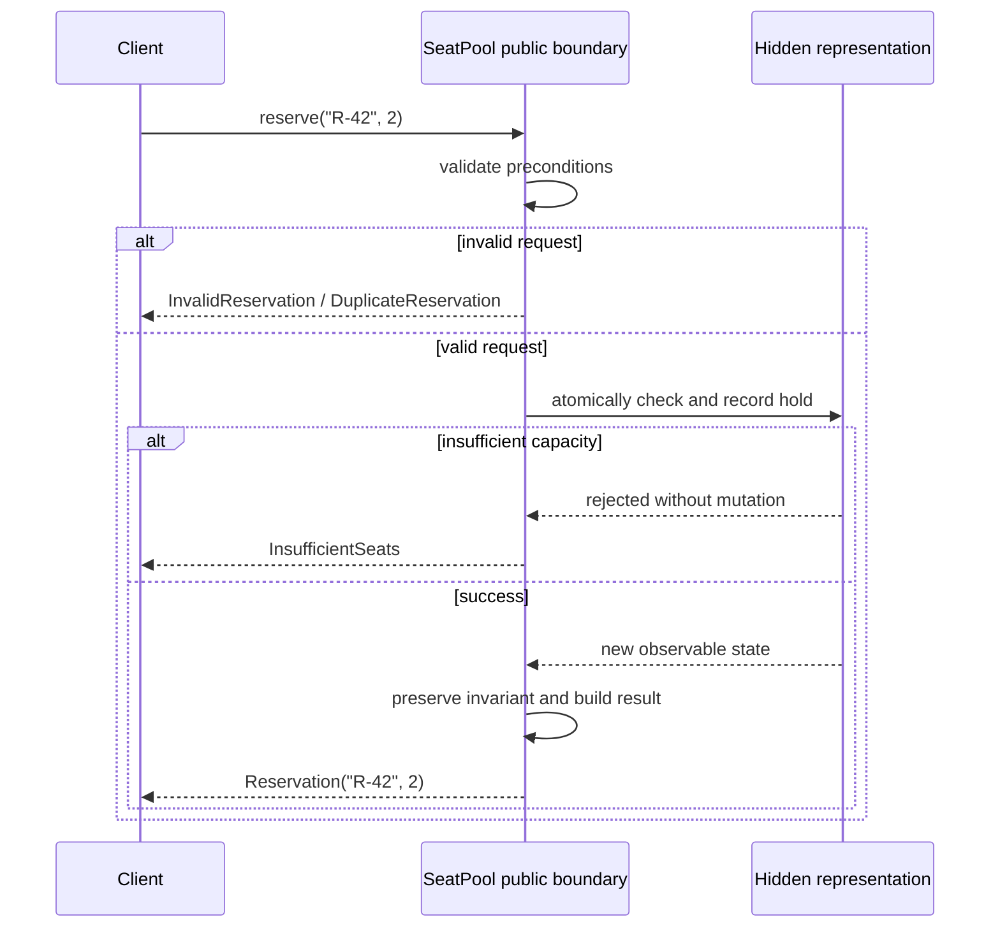
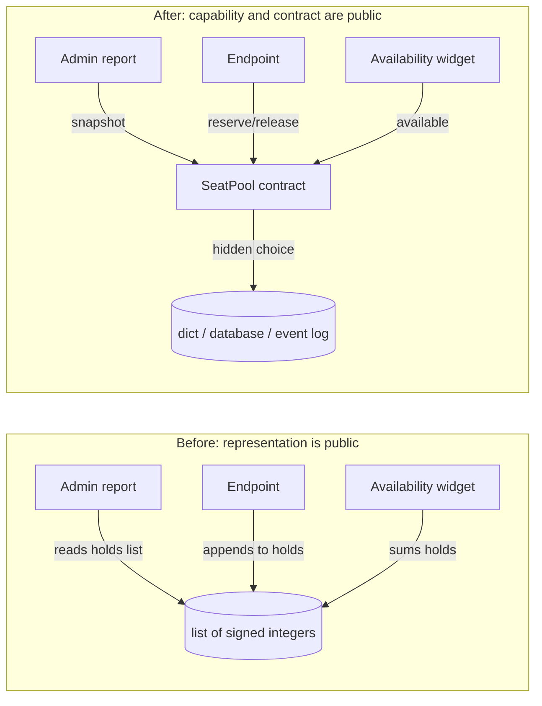

# SDP-FND-040 — Abstraction, encapsulation, information hiding, and contracts

## Physical Notebook Core

Keep this section short enough to reconstruct by hand. It is not a duplicate of the full note.

### Problem or change pressure

A seat-reservation component exposes its mutable list of holds. Callers calculate availability,
append entries, and depend on the list shape. Replacing that list with expiring holds or database
storage now breaks many callers, and invalid mutations can bypass the rule that held seats never
exceed capacity.

### One-sentence mental model

> Show clients the stable capability and its promises; keep the changeable representation and
> decisions behind the boundary that preserves those promises.

### One essential visual

```text
Client need: “hold 2 seats”
              │
              ▼
     PUBLIC ABSTRACTION + CONTRACT
     reserve(id, seats) -> Reservation
     obligations • guarantees • failures
              │
   ┌──────────┴── encapsulated boundary ──────────┐
   │ validate → change state → restore invariant │
   │                                              │
   │ HIDDEN DECISIONS                             │
   │ dict today • database tomorrow • lock policy │
   └──────────────────────────────────────────────┘
```

### How to read this visual

Read from the client request downward. The public operation and its behavioural contract form the
abstraction the client uses. The box is the encapsulated ownership boundary. The lower details are
information-hidden because clients neither read nor write them. The vertical arrow is conceptual
flow, not a literal Python memory layout.

### Key insight

The class is not the main achievement. The achievement is that clients can rely on reservation
meaning while the owner can change representation without breaking that meaning.

### Simplification or limitation

The visual omits persistence, transactions, authorization, cancellation, and cross-process
concurrency. A public contract must state those behaviours when callers depend on them; a local
class alone cannot provide database-level atomicity.

### Governing rules or invariants

1. Abstraction says what useful capability clients see; it is not merely an abstract base class.
2. Encapsulation controls access; information hiding protects specific volatile decisions.
3. A useful contract states valid requests, guarantees, failures, effects, and stable invariants in
   observable terms rather than internal fields.

### Minimal Python example

```python
from dataclasses import dataclass


class NotEnoughSeats(Exception):
    pass


@dataclass(frozen=True)
class Reservation:
    reservation_id: str
    seats: int


class SeatPool:
    def __init__(self, capacity: int) -> None:
        if capacity < 0:
            raise ValueError("capacity must be non-negative")
        self._capacity = capacity
        self._held_by_id: dict[str, int] = {}

    @property
    def available(self) -> int:
        return self._capacity - sum(self._held_by_id.values())

    def reserve(self, reservation_id: str, seats: int) -> Reservation:
        if seats <= 0:
            raise ValueError("seats must be positive")
        if seats > self.available:
            raise NotEnoughSeats
        self._held_by_id[reservation_id] = seats
        return Reservation(reservation_id, seats)
```

The client sees `reserve`, `available`, `Reservation`, and stable failures. The dictionary and the
calculation strategy are replaceable decisions, not client knowledge.

### One common misconception

**Mistake:** “Encapsulation means prefixing every attribute with `__`, so nobody can access it.”

**Correction:** Python does not enforce ordinary class data hiding. Underscores communicate a
non-public API, and double-leading names mainly avoid accidental subclass collisions. Durable
information hiding comes from a narrow public contract and clients that do not depend on the
representation.

### Important trade-offs

- Hiding representation buys change freedom and invariant control, but a boundary adds names,
  translation, documentation, and contract-evolution work.
- A narrow contract reduces accidental coupling, but a contract that hides necessary failure,
  consistency, or performance semantics surprises callers instead of protecting them.

### Interview-revision cues

- Ask four separate questions: what do clients need, who owns state, what may change, and what is
  promised?
- A class can encapsulate fields while leaking every representation decision through getters.
- Use explicit exceptions for required runtime validation; Python may omit `assert` statements
  when optimization is requested.

## Unit metadata

| Field | Value |
|---|---|
| Domain | Design foundations |
| Curriculum | [SDP-FND-040](../../../CURRICULUM.md#sdp-fnd-040) |
| Progress | [PROGRESS.md](../../../PROGRESS.md) |
| Python references | [PYTHON_REFERENCES.md](../../../PYTHON_REFERENCES.md) — no direct prerequisite mapping |
| Learning outcome | Separate abstraction from encapsulation, hide volatile decisions, and express useful behavioural contracts. |
| Hard prerequisites | `SDP-FND-020` |
| Soft prerequisites | `SDP-FND-030` |
| Priority | Core |
| Interview frequency | High |
| Production frequency | High |
| Python/backend relevance | High |
| Depth | D2 |
| Scope | Design, Python |
| Size | M |
| Evidence profile | E+I+D+T |
| Canonical Python | Python 3.14 |
| Interview compatibility | Python 3.11 |
| Artifact state | Draft |

The frequency fields above are curriculum judgments, not measurements from a population survey.

## 1. Simple explanation

Imagine a coffee machine. You press “espresso.” You do not position valves, calculate heater duty,
or control pump pressure.

- **Abstraction** is the useful model you operate: choose a drink and receive it.
- **Encapsulation** is the machine boundary that controls access to its working parts.
- **Information hiding** is the decision to keep the pump, heater, calibration, and recipe details
  from becoming user dependencies.
- **Contract** is the deal: what selections are valid, what result to expect, what failures are
  possible, and what state remains safe.

The ideas support one another, but they are not synonyms. A transparent box may bundle parts
without hiding them. A wall can hide parts while offering a terrible abstraction. A beautiful
button label can promise behaviour that the implementation does not deliver.

In Python, the important boundary is usually social and architectural rather than access-enforced.
Clients agree to use documented public names. Owners retain freedom to change non-public details.
Tests verify behaviour at that agreement.

## 2. Start with the change pressure

Use one concrete requirement:

> Replace an in-memory list of seat holds with expiring database records while preserving the way
> application code reserves seats and handles failures.

Now ask four different questions:

| Lens | Question | Seat example |
|---|---|---|
| Abstraction | What useful capability should clients think in? | Reserve, release, and inspect availability |
| Encapsulation | Which boundary owns and controls related state changes? | The seat-pool component |
| Information hiding | Which design decisions should not spread? | Hold storage, expiry indexing, locking, and calculation strategy |
| Contract | What may callers assume and what must they provide? | Positive request, stable result/error, no overbooking, stated atomicity |

Without the named change, “hide details” can become ceremony. Hide a decision because exposing it
creates a likely change cost, an invariant risk, a security boundary, or needless client knowledge.

## 3. Precise working definitions

### Abstraction

An **abstraction** is a deliberately simplified model that exposes the capabilities and concepts
relevant to a client while omitting details irrelevant at that level.

`reserve(reservation_id, seats)` is an abstraction because it speaks in reservation meaning. A
method named `append_hold_row(tuple_value)` exposes a mechanism rather than the client's goal.

Abstraction does not require inheritance, `abc.ABC`, or `typing.Protocol`. A function, module,
class, command-line program, HTTP endpoint, or data type can provide an abstraction.

### Encapsulation

**Encapsulation** places related data and behaviour inside a boundary and mediates how code outside
that boundary interacts with them. The boundary may be a closure, object, module, package,
transaction, process, or service.

Encapsulation answers **where control lives**. It does not automatically guarantee that the
boundary exposes little. A class with getters and setters for every field is still a class, but its
clients may remain tightly coupled to the representation.

### Information hiding

**Information hiding** keeps a design decision from clients that do not need to know it, especially
when that decision is difficult or likely to change. It answers **which knowledge must not spread**.

Examples include:

- whether availability is stored or derived;
- which database tables or vendor payloads represent a reservation;
- which cache, index, or rounding algorithm is used;
- which lock or transaction prevents conflicting updates.

Hiding is not secrecy against hostile code. Authorization, process isolation, encryption, and
operating-system controls solve different security problems.

### Behavioural contract

A **behavioural contract** is the observable agreement between a supplier and its clients. It says
what a valid call requires, what a successful call guarantees, what failures mean, which effects
occur, and which invariants remain true.

A signature is part of a contract, not the whole contract. These two functions have the same type
shape but different meanings:

```python
def reserve(seats: int) -> bool: ...  # False could mean contention, capacity, or validation
def reserve(seats: int) -> bool: ...  # True could mean queued, tentative, or durable
```

Useful contracts remove that ambiguity in names, values, exceptions, documentation, and tests.

## 4. Source-checked context

David Parnas's modularization report compared process-step decomposition with modules organized
around hidden decisions. In the latter design, each module owns knowledge of a decision and its
interface reveals as little as practical about its inner working. His conclusion begins from
difficult or likely-to-change decisions and designs modules that hide them from one another. This
is a design criterion, not a Python access modifier
([Parnas, 1971 technical report, pp. 20 and 27](https://prl.khoury.northeastern.edu/img/p-tr-1971.pdf)).

Eiffel's Design by Contract material frames collaboration as obligations and benefits: a
precondition constrains a valid request, a postcondition states the supplier's guarantee for such
a request, and a class invariant describes consistency that exported operations must maintain.
Python does not copy Eiffel's contract syntax, but the vocabulary remains useful for documentation,
explicit checks, tests, and API design
([Eiffel Design by Contract documentation](https://www.eiffel.org/doc/eiffel/ET-_Design_by_Contract_%28tm%29%2C_Assertions_and_Exceptions)).

Python classes bundle data and functionality, but the official tutorial says inaccessible private
instance variables do not exist in ordinary Python classes. A single leading underscore marks a
non-public implementation detail by convention. Double-leading names are textually mangled mainly
to prevent accidental subclass name collisions, and the mangled name remains reachable
([Python 3.14 classes tutorial](https://docs.python.org/3.14/tutorial/classes.html#private-variables)).

These sources describe different layers: Parnas discusses modular design decisions, Eiffel makes
contracts explicit in a language method, and Python documents concrete name and class mechanics.

## 5. How the four ideas relate

| Design | Abstraction | Encapsulation | Information hiding | Contract quality |
|---|---|---|---|---|
| Public mutable `list` inside a class | Weak: clients think in list operations | Some: data has an object home | Weak: representation is client knowledge | Weak: invariants can be bypassed |
| Read-only value dataclass | Strong when the value is the intended model | Yes | Deliberately little; fields are the value | Strong if validation and meaning are clear |
| Closure returning `reserve` and `available` functions | Strong capability model | Yes: captured state has an owner | Strong: captured names are not client API | Depends on errors and documented effects |
| ABC with `reserve()` but undefined failure meaning | Interface shape only | No implementation state to contain | Representation can remain hidden | Weak behavioural agreement |
| Small module with functions and module-private state | Can be strong | Yes at module boundary | By convention | Can be strong without a class |

This table is diagnostic, not a scorecard. “More hiding” is not always better. A coordinate value
object should often expose `x` and `y`; hiding them behind `get_x()` and `get_y()` adds ceremony
without protecting a meaningful decision.

## 6. Anatomy of a useful contract

| Contract part | Reservation example | Review question |
|---|---|---|
| Vocabulary and types | Reservation ID, positive seat count, immutable result | Does the API speak in client meaning? |
| Preconditions | Non-empty unused ID; seats greater than zero | What makes a request valid? |
| Postconditions | Requested hold exists; availability decreases by exactly the held seats | What must success establish? |
| Invariants | `0 <= available <= capacity`; held plus available equals capacity | What must every public operation preserve? |
| Failures | Invalid request, duplicate ID, unknown ID, insufficient seats | Can a caller recover without parsing text? |
| Side effects | One hold created; no mutation on rejected request | Is partial mutation possible? |
| Time and ordering | Release is valid only after a successful reserve | Is hidden call order part of correctness? |
| Consistency and concurrency | Reserve is atomic within the stated storage boundary | Can two callers both observe stale capacity? |
| Idempotency | Retrying the same request ID returns the same outcome or a documented conflict | What happens after timeout and retry? |

Not every function needs a formal paragraph for every row. The rows expose missing promises. A
small pure function may need only types, input domain, returned meaning, and raised errors. A
payment or reservation boundary usually needs effect, retry, and atomicity semantics too.

### Preconditions are not an excuse to trust untrusted input

“Caller obligation” describes responsibility inside a designed collaboration. An HTTP endpoint
still validates untrusted input. Public Python code should raise stable, intentional exceptions for
runtime conditions clients must handle.

Use `assert` for developer assertions whose removal does not change required behaviour. The Python
language reference specifies that optimized compilation can emit no code for `assert`; therefore
an assertion must not be the only guard protecting a public invariant
([Python 3.14 `assert` statement](https://docs.python.org/3.14/reference/simple_stmts.html#the-assert-statement)).

## 7. Collaboration and execution flow



### How to read this visual

Follow one call from top to bottom. The client talks only to the public boundary. Validation happens
before state mutation. Every failure has stable meaning, and rejected calls leave no partial hold.
The state participant represents any implementation—dictionary, database, or service.

### Key insight

The contract controls both success and failure paths. Information hiding is successful when the
client can respond correctly without knowing how the state participant stores or coordinates data.

### Simplification or limitation

The diagram depicts desired behavioural order, not automatic Python semantics. Atomic database
work requires a transaction or conditional write; drawing one message does not create atomicity.

## 8. Before design and concrete pain

```python
from dataclasses import dataclass, field


@dataclass
class SeatPool:
    capacity: int
    holds: list[int] = field(default_factory=list)

    @property
    def available(self) -> int:
        return self.capacity - sum(self.holds)

    def reserve(self, seats: int) -> None:
        assert seats > 0
        assert seats <= self.available
        self.holds.append(seats)


def render_admin_total(pool: SeatPool) -> str:
    held = sum(pool.holds)  # client depends on representation
    return f"held={held}; available={pool.capacity - held}"
```

The class bundles state and methods, so it provides some encapsulation. It still leaks the list,
its signed-number meaning, and the calculation rule. Any caller can do this:

```python
pool.holds.append(-100)
```

Now add reservation IDs, expiry, or persistent storage. Every client that sums or appends `holds`
must change. The abstraction is too close to representation, information hiding failed, and the
invariant is not controlled. Under optimized Python, the `assert` guards may disappear as well.

## 9. Minimal typed Pythonic design

```python
from dataclasses import dataclass


class SeatPoolError(Exception):
    """Stable base for expected reservation failures."""


class InvalidReservation(SeatPoolError):
    pass


class DuplicateReservation(SeatPoolError):
    pass


class UnknownReservation(SeatPoolError):
    pass


class InsufficientSeats(SeatPoolError):
    def __init__(self, requested: int, available: int) -> None:
        super().__init__(f"requested {requested}; available {available}")
        self.requested = requested
        self.available = available


@dataclass(frozen=True, slots=True)
class Reservation:
    reservation_id: str
    seats: int


@dataclass(frozen=True, slots=True)
class SeatSnapshot:
    capacity: int
    held: int
    available: int


class SeatPool:
    """Reserve seats while keeping hold representation private to this boundary."""

    def __init__(self, capacity: int) -> None:
        if capacity < 0:
            raise ValueError("capacity must be non-negative")
        self._capacity = capacity
        self._held_by_id: dict[str, int] = {}

    @property
    def available(self) -> int:
        """Return seats not currently held."""
        return self._capacity - sum(self._held_by_id.values())

    def reserve(self, reservation_id: str, seats: int) -> Reservation:
        """Create one hold or raise without changing state."""
        if not reservation_id.strip():
            raise InvalidReservation("reservation_id must not be blank")
        if seats <= 0:
            raise InvalidReservation("seats must be positive")
        if reservation_id in self._held_by_id:
            raise DuplicateReservation(reservation_id)

        available_before = self.available
        if seats > available_before:
            raise InsufficientSeats(seats, available_before)

        self._held_by_id[reservation_id] = seats
        return Reservation(reservation_id, seats)

    def release(self, reservation_id: str) -> Reservation:
        """Remove and return an existing hold."""
        try:
            seats = self._held_by_id.pop(reservation_id)
        except KeyError as exc:
            raise UnknownReservation(reservation_id) from exc
        return Reservation(reservation_id, seats)

    def snapshot(self) -> SeatSnapshot:
        """Return an immutable public view, not the mutable representation."""
        available = self.available
        return SeatSnapshot(
            capacity=self._capacity,
            held=self._capacity - available,
            available=available,
        )
```

Every public element earns its place:

- `SeatPool` owns mutation and the invariant.
- `reserve`, `release`, `available`, and `snapshot` express client capabilities.
- immutable result values carry facts without exposing the dictionary.
- named exceptions let callers recover without inspecting message text.
- `_held_by_id` advertises a non-public decision; the design does not depend on access being
  impossible.

The implementation is intentionally in-memory and not thread-safe. Its contract must not claim
cross-thread or cross-process atomicity. A production adapter may preserve the same application
meaning with a database transaction.

## 10. Python properties and naming are mechanisms, not the design

The built-in `property` creates a managed attribute: reading, assigning, or deleting an attribute
can invoke getter, setter, or deleter functions
([Python 3.14 `property`](https://docs.python.org/3.14/library/functions.html#property)). This can
preserve a public attribute-style API while calculation or validation changes.

Use a property when attribute syntax communicates a value-like query such as `available`. Prefer a
method when the operation is expensive, has important effects, requires parameters, may block, or
needs a verb to communicate intent.

| Mechanism | What it does | What it does not prove |
|---|---|---|
| `_name` | Marks a non-public name by convention | Hostile or accidental access is impossible |
| `__name` | Applies class-name mangling | Security, secrecy, or absolute privacy |
| `@property` | Manages attribute access through functions | The API is a good abstraction |
| `@dataclass(frozen=True)` | Blocks ordinary field assignment after creation | Deep immutability of referenced objects |
| `__slots__` | Declares instance layout and can prevent arbitrary new attributes | Information hiding or a stable contract |
| Type annotations | Describe shapes for tools and readers | Runtime validation or behavioural meaning |

Choose mechanisms after naming the change pressure and contract.

## 11. A simpler functional alternative

Not every invariant needs hidden mutable state. An immutable transition can make state explicit:

```python
from dataclasses import dataclass, replace


@dataclass(frozen=True)
class SeatState:
    capacity: int
    held: int = 0


def reserve(state: SeatState, seats: int) -> SeatState:
    if seats <= 0:
        raise ValueError("seats must be positive")
    if state.held + seats > state.capacity:
        raise InsufficientSeats(seats, state.capacity - state.held)
    return replace(state, held=state.held + seats)
```

This design has a useful abstraction and contract but intentionally exposes its value
representation. It may be simpler for pure policy, deterministic tests, event reducers, or code
where persistence owns concurrency. Choose a stateful object when one boundary genuinely owns
identity, mutation, and lifetime—not because encapsulation always means a class.

## 12. Refactoring path

1. Characterize current observable behaviour before moving state.
2. List every client that reads or writes representation details.
3. Write a contract table for the capability: valid calls, outcomes, failures, effects, invariants.
4. Introduce the smallest client-facing operation or query that expresses that contract.
5. Route one mutation through the owner and stop one client from touching representation.
6. Replace `assert`-only public validation with explicit exceptions where runtime behaviour matters.
7. Return immutable values or copies rather than mutable internal containers.
8. Change one hidden decision—such as list to dictionary—to test whether clients remain unchanged.
9. Add the new expiry or persistence requirement.
10. Remove compatibility accessors that merely preserve the old leak, once callers are migrated.

Do not begin with a large interface hierarchy. The first seam may be one method, one query, and one
stable exception family.

## 13. Realistic backend use case

Suppose an HTTP endpoint reserves seats. Separate boundaries have different contracts:

```text
HTTP request
    │ validates syntax/authentication
    ▼
application operation: reserve seats
    │ speaks reservation meaning
    ▼
transactional storage boundary
    │ conditional update / unique request key
    ▼
database representation
```

### How to read this visual

Read downward from transport to storage. Each boundary translates into the next vocabulary. HTTP
status codes do not enter reservation policy, and table rows do not escape into the endpoint. The
application operation owns the stable use-case contract; storage owns atomic representation work.

### Key insight

Encapsulation is nested. An endpoint, application service, and repository may each control a
different concern. Information hiding fails when one layer's representation becomes another
layer's public vocabulary.

### Simplification or limitation

This is a responsibility diagram, not a required three-layer architecture. A small application may
combine boundaries until independent change, testing, security, or transaction pressure appears.

A useful endpoint mapping might be:

| Application outcome | Transport mapping | Stable meaning |
|---|---|---|
| `Reservation` | `201 Created` with response body | Hold created durably within stated transaction scope |
| `InvalidReservation` | `422 Unprocessable Content` | Request violates domain input rules |
| `DuplicateReservation` | `409 Conflict` or idempotent replay result | Request key already has defined meaning |
| `InsufficientSeats` | `409 Conflict` | Valid request conflicts with current capacity |
| unexpected storage failure | `503 Service Unavailable` with internal cause logged | No success promised; retry policy is explicit |

The exact status choice is an API decision. What matters here is that transport and domain failure
meanings are translated deliberately rather than leaked accidentally.

## 14. Before-and-after change impact



### How to read this visual

In the left subgraph, arrows name representation knowledge held by each client. In the right
subgraph, clients depend on purpose-specific operations; only the owning boundary knows the
storage choice. Arrows are design dependencies, not measured runtime latency.

### Key insight

Changing storage should edit the owner and its focused tests, while client code changes only when
reservation meaning changes. That reduced blast radius is evidence of information hiding.

### Simplification or limitation

Schema migrations, deployment compatibility, query performance, and contract tests can still
require coordinated review. Hiding representation reduces accidental change, not all change.

## 15. Failure scenarios

### Representation escape

Returning `self._held_by_id` lets a caller mutate the internal dictionary. Returning
`dict(self._held_by_id)` prevents aliasing but may still expose key/value representation. Prefer a
purpose-specific immutable snapshot when clients need facts rather than the container itself.

### Contract too vague

If `reserve()` returns `False`, callers may retry an invalid request forever because they cannot
distinguish capacity conflict from validation or infrastructure failure. Stable exception or result
types make recovery policy explicit.

### Check-then-act outside the boundary

This client is unsafe under concurrency:

```python
if pool.available >= seats:
    pool.reserve(reservation_id, seats)
```

Availability can change between the query and mutation. The atomic operation is `reserve`; the
query is informational. A contract should not invite callers to assemble an invariant-sensitive
operation from separate getters and setters.

### Assertion-only validation

An optimized process can remove assertions and accept state changes that normal execution rejects.
The [practice experiment](practice/README.md#controlled-runtime-experiment) reproduces this exact
failure with the current interpreter.

## 16. Testing strategy

| Test type | What it proves | What not to overspecify |
|---|---|---|
| Unit contract | Valid calls, stable results/errors, no mutation on failure | Private attribute names or container choice |
| State sequence | Every successful reserve/release sequence preserves capacity invariants | Exact helper call order |
| Boundary contract | Each storage adapter preserves application meanings and atomic outcome | One vendor or SQL schema in policy tests |
| Integration | Transaction, unique key, rollback, and retry behaviour against real storage | Unrelated HTTP rendering or metrics library |
| Concurrency | Contending reservations cannot exceed capacity in the promised scope | A lock implementation unless the lock is itself required |

High-value tests include:

- zero and negative capacity at construction;
- blank and duplicate reservation IDs;
- zero, negative, exact-capacity, and over-capacity requests;
- failure leaves snapshot unchanged;
- release restores exactly the reserved seats;
- unknown release has a stable failure;
- replacing dictionary storage does not change public contract tests;
- two competing requests respect the documented atomicity boundary.

Tests against `_held_by_id` make refactoring expensive and prove the implementation, not the
contract. Test observable snapshots, returned values, failures, and durable effects.

## 17. Observability and debugging

Log and measure at the contract boundary:

- operation name and synthetic request/reservation ID;
- requested seats and safe before/after availability when useful;
- stable outcome code such as `reserved`, `invalid`, `duplicate`, or `insufficient`;
- latency and transaction retry count at the storage boundary;
- exception chain internally, while returning stable client meaning.

Do not log mutable internal dictionaries, raw database rows, secrets, or private customer data.
Observability is itself a client of the abstraction: it should survive a representation change.

When debugging, first ask which contract clause failed:

1. Was the request outside the valid domain?
2. Did a successful operation fail its guarantee?
3. Did an invariant become false?
4. Did the storage or concurrency boundary promise less than the caller assumed?
5. Did a caller bypass the owner and mutate representation?

This localizes investigation better than beginning with a private field dump.

## 18. Concurrency and state safety

```text
Caller A: read available=1 ───────────── write hold=1
Caller B:      read available=1 ───────────── write hold=1
                         ▲ race window ▲
```

### How to read this visual

Time moves left to right. Both callers observe the same old value before either write becomes
visible. If check and write are separate, both may succeed against one seat.

### Key insight

Encapsulating methods in one Python object does not make a multi-step state transition atomic.
Atomicity must be implemented at the state owner: a lock for the intended in-process scope, or a
transaction/conditional write for shared storage.

### Simplification or limitation

The timeline omits interpreter scheduling, isolation levels, retries, distributed processes, and
failover. It illustrates a design race, not a claim about one particular execution.

State the concurrency contract precisely:

- “safe only when used by one task” is honest for a simple local object;
- “thread-safe within one process” needs synchronized check-and-mutate;
- “atomic across application instances” needs storage-level coordination;
- “exactly once” is usually too strong without a carefully defined idempotency and delivery model.

## 19. Performance and memory

Information hiding creates room to optimize without changing clients:

- derive `available` by summing holds for simple correctness;
- maintain a cached count when measurement justifies it, while preserving its invariant;
- index expirations when scans become costly;
- move state to a database when ownership and durability require it;
- return a compact snapshot instead of copying a large internal container.

Each optimization adds decisions and failure modes. A cached count can drift, an index consumes
memory, and remote storage adds latency and partial failure. Measure the actual workload; this unit
makes no speedup or memory claim.

Performance can also be part of a contract when clients depend on complexity, blocking behaviour,
streaming, or bounded memory. Do not hide a network call behind a property that appears to be a
cheap value access.

## 20. Contract evolution and compatibility

Changing hidden representation should preserve the contract. Changing the contract needs an
explicit compatibility decision.

| Proposed change | Usually representation-only? | Contract review needed? |
|---|---|---|
| Dictionary to database table | Yes, if outcomes/effects stay the same | Atomicity, latency, and new infrastructure failures |
| Cached availability instead of summing | Yes | Invariant and stale-read semantics |
| Rename `_held_by_id` | Yes | No client should depend on it |
| Rename `reservation_id` response field | No | Yes; clients compile/parse against it |
| Replace `InsufficientSeats` with `False` | No | Yes; recovery meaning changes |
| Make reservation tentative instead of durable | No | Yes; postcondition changes |
| Add an optional response field | Often additive | Serialization and old/new client compatibility |

Prefer additive migrations, explicit deprecation, contract tests, and versioned wire contracts when
independent deployments exist. “It was an internal refactor” is not true when observably different
errors, timing, effects, or ordering reach clients.

## 21. Variants

- **Object boundary:** one identity owns mutable state and operations.
- **Module boundary:** functions own module-level mechanisms; useful for stateless or singleton
  process facilities when lifetime is honest.
- **Closure boundary:** captured state is hidden behind returned callables.
- **Immutable value transition:** state is public data and functions return new valid values.
- **Adapter boundary:** provider representation is translated into application meaning.
- **Process/API boundary:** representation and execution are isolated, but network, compatibility,
  and partial-failure contracts become mandatory.

Select the smallest boundary that controls the real decision. Do not turn every field into an
object or every module into a service.

## 22. Related units

| Related unit | Relationship | Key difference |
|---|---|---|
| `SDP-FND-020` | Prerequisite | Finds change pressure and responsibility; this unit defines what a boundary exposes and hides. |
| `SDP-FND-030` | Soft prerequisite | Evaluates coupling and direction; information hiding reduces representation knowledge crossing a boundary. |
| `SDP-FND-050` | Next step | Chooses composition, delegation, or inheritance while preserving contracts. |
| `SDP-FND-060` | Extension | Dynamic dispatch is useful only when substitutes preserve behavioural contracts. |
| `SDP-FND-070` | Python mechanism | Compares duck typing, Protocols, and ABCs for expressing interface shape. |
| `SDP-FND-080` | Testing application | Uses explicit contracts and hidden dependencies to create honest test seams. |
| `SDP-FND-090` | State depth | Adds aliasing, ownership, lifetime, and concurrency reasoning. |
| `SDP-SOL-030` | Contract specialization | Liskov substitution requires behavioural compatibility, not matching method names. |
| `SDP-SOL-040` | Client shaping | Interface segregation limits clients to capabilities they actually need. |

## 23. When to strengthen the boundary

- Several clients read or write the same representation details.
- A likely storage, algorithm, provider, or policy change would ripple through callers.
- Invalid state can be created without passing through the invariant owner.
- Callers parse error strings or guess whether an operation succeeded durably.
- Retrying, ordering, concurrency, or side-effect semantics matter but are undocumented.
- Tests break on private renames while public behaviour remains the same.
- A getter/setter sequence asks clients to perform the owner's business operation.

## 24. When not to hide or abstract further

- The data is intentionally a transparent value, such as coordinates or a configuration record.
- A local pure function already expresses the complete stable behaviour.
- No independent change or invariant pressure justifies another boundary.
- A wrapper repeats every method and type of one concrete dependency without translating meaning.
- Hiding cost, blocking, or failure semantics would make the API misleading.
- Security requires actual authorization or isolation rather than underscore naming.
- A generic “repository” or “manager” would erase useful domain vocabulary.

## 25. Common misuse and overengineering

| Misuse | Why it happens | Better move |
|---|---|---|
| Getter/setter for every field | Classes are mistaken for encapsulation | Expose meaningful operations; keep values public only when they are the intended model |
| `__private` everywhere | Mangling is mistaken for access control | Use `_name` for non-public API; use real security boundaries for hostile access |
| ABC for every abstraction | “Abstraction” is confused with abstract class | Start with a function, concrete API, or small callable need |
| Generic `execute(data)` | Details appear hidden because names disappeared | Use precise domain vocabulary and typed outcomes |
| Catching every exception and returning `False` | Simplicity is valued over failure meaning | Preserve stable, recoverable distinctions and unexpected causes |
| `assert` for external validation | Assertions look concise | Raise explicit exceptions for required runtime behaviour |
| Returning defensive copies of everything | Copying is mistaken for information hiding | Return a purpose-specific immutable view and account for cost |
| Hiding all operational facts | “Implementation detail” becomes a blanket excuse | Document latency, effects, consistency, limits, and retry semantics clients need |
| Contract tests that inspect private fields | Internal certainty feels precise | Assert public results, errors, effects, and invariants |
| Pattern-heavy domain model | More types look more rigorous | Introduce only boundaries supported by change or invariant evidence |

## 26. Interview preparation

### A strong answer structure

1. Name the concrete client and change pressure.
2. Define abstraction as the client-facing model of useful behaviour.
3. Define encapsulation as controlled ownership inside a boundary.
4. Define information hiding as keeping selected volatile decisions from clients.
5. Define the behavioural contract: preconditions, postconditions, invariants, failures, effects,
   and relevant time/concurrency promises.
6. Explain Python's convention-based non-public names without claiming enforced privacy.
7. Show a minimal function, class, closure, or module boundary.
8. State trade-offs and when transparent data is simpler.

### Common formulations

1. What is the difference between abstraction and encapsulation?
2. Is information hiding the same as making fields private?
3. Can a Python module encapsulate state without a class?
4. What belongs in a behavioural contract beyond a method signature?
5. Why is `assert amount > 0` unsafe as public validation?
6. How can getters and setters still leak implementation details?
7. How would you change list storage to database storage without breaking clients?
8. Is a `Protocol` required to create an abstraction in Python?

### Weak-answer traps

- “Abstraction hides complexity.” Say which client-facing concept remains and which details are
  omitted.
- “Encapsulation makes fields private.” Name the owner and controlled operations; Python privacy is
  convention-based.
- “Information hiding is security.” Design-change containment and hostile-access controls are
  different concerns.
- “The signature is the contract.” Add semantics, failures, side effects, invariants, and relevant
  consistency.
- “Properties improve encapsulation.” A property is a mechanism; one property per internal field
  can expose the entire representation.
- “Passing tests proves the abstraction.” Representation-coupled tests may preserve the wrong
  boundary.

### Code-review exercise

```python
class Wallet:
    def __init__(self) -> None:
        self.__transactions: list[int] = []

    def get_transactions(self) -> list[int]:
        return self.__transactions

    def set_transactions(self, transactions: list[int]) -> None:
        self.__transactions = transactions
```

Before writing replacement code, identify:

- the client capability that is missing;
- the invariant clients can violate;
- why name mangling does not repair the returned mutable alias;
- which representation decision leaks;
- what success, rejection, and failure should mean;
- whether an immutable value plus pure functions would be simpler.

### Changed-requirement follow-ups

- Transactions gain expiry and cannot be represented by signed integers alone.
- The state moves to a database shared by three application instances.
- A timed-out request may have committed, so clients retry with the same idempotency key.
- Auditors need a summary but must not receive the mutable ledger.
- A new client needs only balance, not mutation capabilities.

### Senior critique

A senior answer does not maximize privacy syntax. It identifies a stable client model, names the
volatile decision, makes success and failure observable, states consistency limits, and chooses the
smallest boundary. It also recognizes that some data should remain transparent and that hidden
operational behaviour is a contract bug, not good encapsulation.

## 27. Practice, debugging, and experiment

Use the [unsolved API-quota lab](practice/README.md). It follows:

```text
predict → run → observe → explain → refactor → vary
```

The starter deliberately combines a useful quota capability with a public mutable ledger,
representation-coupled reporting, and `assert`-only validation. Characterization tests pass before
the refactor. The learner must define the intended contract, preserve the original attempt, move
invariant-sensitive mutation behind one boundary, and vary the storage representation.

The practice directory also contains a controlled runtime experiment that runs the same invalid
operation normally and with `python -O`. It records environment, command, output, interpretation,
and limitations. The observation deepens the Python mechanism; it does not by itself prove design
skill or advance the learning state.

## 28. Closed-book revision cues

1. Draw the abstraction/contract/boundary/hidden-decision visual.
2. Define all four terms without using one as the definition of another.
3. Give one class that encapsulates but fails to hide information.
4. Give one non-class boundary that encapsulates state.
5. Reconstruct the contract anatomy table from memory.
6. Explain why a signature and a `Protocol` cannot fully specify behaviour.
7. Explain Python underscore naming and double-leading name mangling accurately.
8. Refactor a getter/setter sequence into one meaningful operation.
9. State one concurrency promise a local object cannot provide automatically.
10. Give one situation where transparent data is the better design.

## 29. Vocabulary and professional English

### Volatile

| Item | Content |
|---|---|
| Pronunciation | `VOL-uh-tile` |
| Simple English meaning | Likely to change quickly or unexpectedly |
| Hindi cue | बदलने वाला |
| Meaning here | A representation, policy, provider, or mechanism that should not become broad client knowledge |

Natural examples: “The vendor schema is volatile”; “Keep volatile expiry indexing behind the
reservation boundary”; “Which volatile decision does this abstraction protect?”

### Invariant

| Item | Content |
|---|---|
| Pronunciation | `in-VAIR-ee-unt` |
| Simple English meaning | A condition that must remain true |
| Hindi cue | स्थिर नियम |
| Meaning here | A consistency rule every public state transition must preserve |

Natural examples: “Available seats never become negative”; “This setter bypasses the invariant”;
“Which boundary owns restoration of the invariant?”

### Observable

| Item | Content |
|---|---|
| Pronunciation | `ub-ZUR-vuh-bul` |
| Simple English meaning | Something a client can notice or rely on |
| Hindi cue | दिखाई देने वाला |
| Meaning here | Results, failures, effects, ordering, or timing that belong to the contract |

Natural examples: “Exception type is observable”; “The table name is not observable through this
API”; “Did the refactor change any observable behaviour?”

### Leak

| Item | Content |
|---|---|
| Pronunciation | `leek` |
| Simple English meaning | To let something escape unintentionally |
| Hindi cue | बाहर निकलना |
| Meaning here | Exposing representation or mechanism so clients become coupled to it |

Natural examples: “The DTO leaks the database schema”; “Do not leak provider exceptions into
policy”; “Which implementation decision has leaked through this getter?”

## 30. Python Mastery references

`PYTHON_REFERENCES.md` has no direct mapping for `SDP-FND-040`, so this unit does not invent one.
The minimum Python bridge is included here: classes and modules can own state; `_name` is a
non-public convention; `__name` is name-mangled rather than inaccessible; `property` manages
attribute access; annotations do not enforce runtime contracts; explicit exceptions enforce
required runtime rejection.

The mapped `PY-OBJ-020` material appears elsewhere in the cross-reference table for units that
require deeper properties, encapsulation, and composition mechanics. It is useful background but
is not declared as a direct prerequisite for this unit.

## 31. Authoritative sources

1. David L. Parnas,
   [“On the Criteria to Be Used in Decomposing Systems into Modules,” 1971 technical report](https://prl.khoury.northeastern.edu/img/p-tr-1971.pdf), especially pp. 17–20 and 27.
2. Eiffel Software,
   [“Design by Contract, Assertions and Exceptions”](https://www.eiffel.org/doc/eiffel/ET-_Design_by_Contract_%28tm%29%2C_Assertions_and_Exceptions), sections on preconditions, postconditions, and class invariants.
3. Python Software Foundation,
   [“Private Variables,” Python 3.14 tutorial](https://docs.python.org/3.14/tutorial/classes.html#private-variables).
4. Python Software Foundation,
   [`property`, Python 3.14 built-in functions](https://docs.python.org/3.14/library/functions.html#property).
5. Python Software Foundation,
   [“The `assert` statement,” Python 3.14 language reference](https://docs.python.org/3.14/reference/simple_stmts.html#the-assert-statement).
