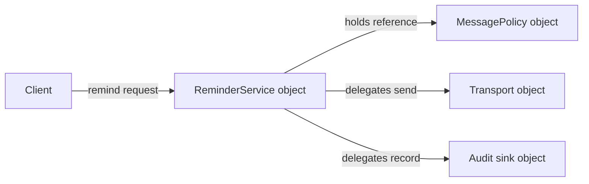
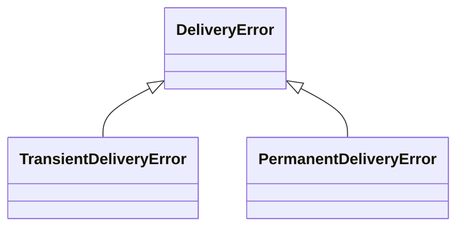
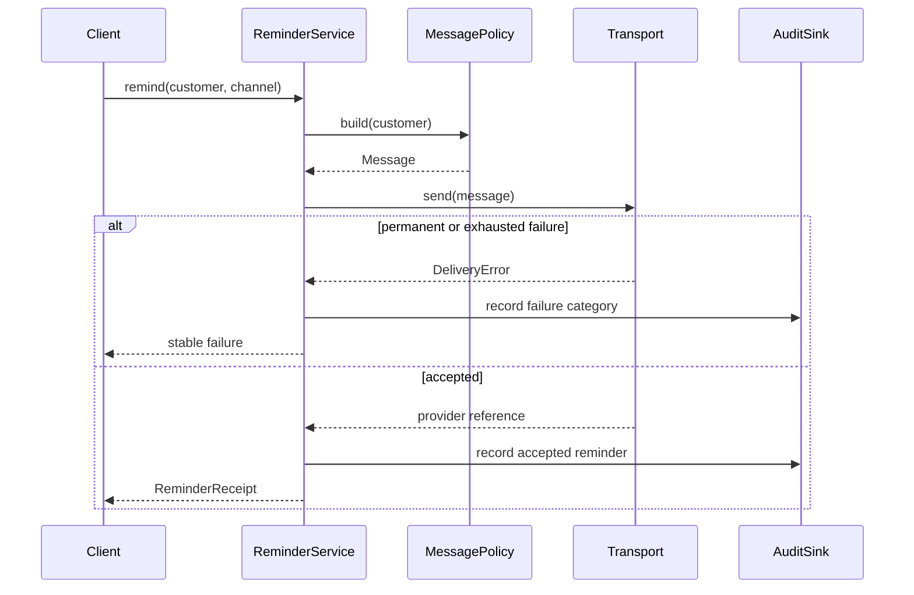
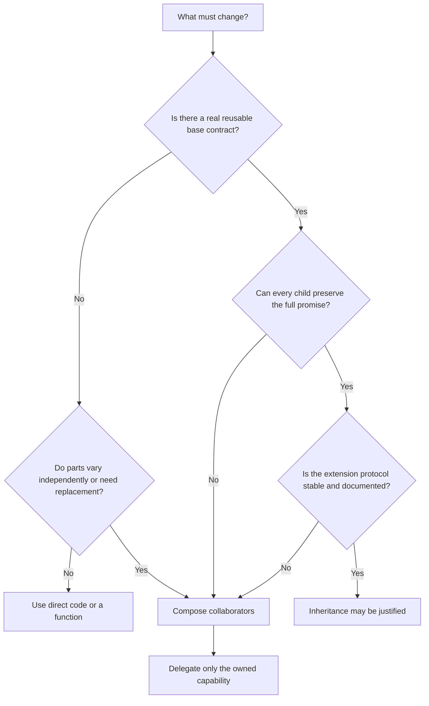

# SDP-FND-050 — Composition, delegation, and inheritance

## Physical Notebook Core

Keep this section short enough to reconstruct by hand. It is not a duplicate of the full note.

### Problem or change pressure

A renewal-reminder service inherits from an SMS client only to reuse `send_message()`. Now email,
retry, audit, and channel-selection requirements change independently. Subclasses begin describing
combinations instead of honest kinds, while the business service exposes transport operations that
callers can misuse.

### One-sentence mental model

> Compose objects to assemble independently changing parts, delegate a request to the part that
> owns the work, and inherit only when every child can honestly keep the parent's full promise.

### One essential visual

```text
COMPOSITION — object structure       DELEGATION — runtime message

ReminderService ──has/ref──> Sender  service.remind() ──calls──> sender.send()
      object A          object B          receiver                  delegate

INHERITANCE — class/type + lookup

SmsReminder ──subclass-of──> Reminder
     instance lookup: SmsReminder → Reminder → object  (MRO)
```

### How to read this visual

Read each row as a different question. Composition says which objects are connected. Delegation
says where one request moves at runtime. Inheritance says which class relation affects attribute
lookup and nominal subtype checks. Composition and delegation often appear together, but neither
implies inheritance. The arrows are conceptual, not a CPython memory diagram.

### Key insight

“Uses another object” and “is a specialized version of another type” are different promises.
Implementation reuse alone is too small a reason to create the larger inheritance promise.

### Simplification or limitation

The visual omits ownership, collaborator lifetime, protocol typing, multiple inheritance,
descriptors, failures, and concurrency. A reference may be owned or borrowed; a subclass still
needs behavioural compatibility, which `SDP-FND-060` and `SDP-SOL-030` develop more deeply.

### Governing rules or invariants

1. Start from the changes that must vary independently; do not choose from an “is-a/has-a” slogan
   alone.
2. Composition is structure and delegation is behaviour: an object may contain a collaborator
   without forwarding calls, or delegate to an object it does not own.
3. Inheritance is justified only when the subtype promise, lookup coupling, extension rules, and
   lifecycle are all acceptable—not merely because a method can be reused.

### Minimal Python example

```python
from dataclasses import dataclass


@dataclass(frozen=True)
class Message:
    recipient: str
    body: str


class SmsSender:
    def send(self, message: Message) -> str:
        return "sms-001"  # synthetic boundary


class ReminderService:
    def __init__(self, sender: SmsSender) -> None:
        self._sender = sender  # composition: store a collaborator reference

    def remind(self, phone: str) -> str:
        message = Message(phone, "Your subscription renews soon")
        return self._sender.send(message)  # delegation: move this work to its owner
```

`ReminderService` keeps reminder policy. `SmsSender` keeps transport behaviour. Their objects are
connected, and `remind()` explicitly delegates one operation. Neither class claims to be the other.

### One common misconception

**Mistake:** “Always prefer composition over inheritance.”

**Correction:** Prefer the relationship that matches the contract and change forces. Composition
usually handles independently variable policies and infrastructure well. Inheritance remains
useful for an honest subtype, a stable framework extension contract, cooperative mixins with clear
rules, or an exception taxonomy. The slogan is a review prompt, not a ban.

### Important trade-offs

- Composition makes dependencies, wiring, and runtime replacement explicit, but creates object
  construction, forwarding, ownership, and failure-translation work.
- Inheritance can provide concise specialization and shared extension rules, but couples subclasses
  to base contracts, state, call order, MRO, and future base-class evolution.
- Explicit delegation keeps the public surface narrow; broad automatic forwarding reduces boilerplate
  but can leak collaborator APIs and miss Python protocols.

### Interview-revision cues

- Composition answers “what parts are connected?”; delegation answers “who handles this call?”;
  inheritance answers “what type/lookup relation exists?”
- Ask whether variation axes combine independently, whether collaborators need runtime selection,
  and whether every child preserves the base promise.
- `super()` means “continue after this class in the relevant MRO,” not “call my one fixed parent.”
- A wrapper using `__getattr__` does not automatically participate in implicit special-method
  protocols such as `len()` or subscripting.

## Unit metadata

| Field | Value |
|---|---|
| Domain | Design foundations |
| Curriculum | [SDP-FND-050](../../../CURRICULUM.md#sdp-fnd-050) |
| Progress | [PROGRESS.md](../../../PROGRESS.md) |
| Python references | [PYTHON_REFERENCES.md](../../../PYTHON_REFERENCES.md) — hard object-model bridge |
| Learning outcome | Choose among composition, delegation, and inheritance from actual change forces rather than slogans. |
| Hard prerequisites | `SDP-FND-030`, `SDP-FND-040` |
| Soft prerequisites | `SDP-FND-020` |
| Priority | Core |
| Interview frequency | High |
| Production frequency | High |
| Python/backend relevance | High |
| Depth | D2 |
| Scope | Design, Python |
| Size | L |
| Evidence profile | E+I+D+T |
| Canonical Python | Python 3.14 |
| Interview compatibility | Python 3.11 |
| Artifact state | Approved |

The frequency fields above are curriculum judgments, not measurements from a population survey.

## 1. Simple explanation

Imagine a restaurant.

- The restaurant **has** a kitchen, payment terminal, and delivery partner. Connecting those parts
  resembles composition.
- When the restaurant asks the kitchen to prepare an order, it **delegates** that work. The
  restaurant may validate the order before the call and combine the result afterward.
- A `DriveThroughRestaurant` might inherit from `Restaurant` only if clients can treat it as a
  restaurant under the same important promises. Reusing one receipt-formatting method is not
  enough to establish that relationship.

The three ideas live at different levels:

| Idea | Primary question | Typical Python sign |
|---|---|---|
| Composition | Which objects or values make this object/system work? | Constructor parameter stored on `self` |
| Delegation | Which collaborator should perform this request? | `self._collaborator.operation(...)` |
| Inheritance | Is this class a compatible specialization, and how is lookup extended? | `class Child(Base): ...` |

Often one design uses composition and delegation together. A service stores a repository reference,
then delegates `get()` to it. But structure and behaviour remain separate: it may store a clock only
to compare timestamps itself, or delegate to a request-scoped collaborator it does not own.

## 2. Start with the change pressure

Suppose a renewal service initially sends one SMS:

```python
class RenewalReminderService(SmsGateway):
    def remind(self, customer: Customer) -> str:
        body = build_reminder(customer)
        return self.send_message(customer.phone, body)
```

This is short. Short is not the problem. Add realistic changes:

- SMS and email vary by customer preference.
- retry varies by provider failure category;
- audit policy varies by business and regulatory context;
- message wording varies by locale;
- a shared provider client has process lifetime;
- tests need deterministic transports.

If each choice becomes a subclass dimension, names begin encoding combinations:

```text
SmsReminder
RetryingSmsReminder
AuditedRetryingSmsReminder
EmailReminder
AuditedEmailReminder
AuditedRetryingEmailReminder
... one class for each useful combination
```

The exact count is not the point. The pressure is a potential cross-product: channel, retry, audit,
and wording change for different reasons and may need independent combinations.

### How to read this visual

Read down the names and notice that each new axis appears inside class identity. Supporting a new
combination requires another class even when the underlying behaviours already exist.

### Key insight

When requirements combine independently, representing every combination as an inheritance leaf
couples axes that should be wired separately.

### Simplification or limitation

Not every product requires every combination, and a shallow hierarchy may remain simpler. This is
a change-pressure diagnostic, not a mathematical claim that all inheritance grows exponentially.

## 3. Precise working definitions

### Composition

**Composition** builds an object or behaviour from collaborating parts. At runtime, one object
holds references to other objects or values and uses them to fulfil its responsibility.

The word is used at different strengths:

- **general object composition:** one object is assembled with collaborators;
- **strong lifetime ownership:** the whole creates and destroys a part with its own lifetime;
- **aggregation or borrowed reference:** the collaborator exists independently and may be shared.

Python assignment does not label those ownership meanings. Both look like `self._sender = sender`.
The contract, construction root, cleanup policy, and tests must say who owns the collaborator.

Composition can be fixed at construction or selected later. Constructor injection is often easier
to reason about because a valid object begins with explicit dependencies and does not change its
collaboration graph midway through a request.

### Delegation

**Delegation** occurs when an object receiving a request asks another object to perform some or all
of that work. The delegator may validate, translate inputs, select a collaborator, handle failures,
add behaviour before or after, or return the result unchanged.

The official Python FAQ demonstrates delegation with a wrapper that changes `write()` and forwards
other missing attributes through `__getattr__`
([Python 3.14 Programming FAQ, “What is delegation?”](https://docs.python.org/3.14/faq/programming.html#what-is-delegation)).
That is one mechanism, not the only definition. Most business boundaries benefit from explicit
methods because the promised surface remains visible.

### Inheritance

**Inheritance** creates a class from one or more base classes. Python remembers the bases and uses
the derived class's method resolution order when resolving inherited attributes. Derived classes
may override base methods, and a base method that calls another method on `self` can dispatch to an
override
([Python 3.14 classes tutorial, “Inheritance”](https://docs.python.org/3.14/tutorial/classes.html#inheritance)).

Inheritance creates at least three forms of coupling:

1. **type coupling:** `isinstance(child, Base)` is normally true;
2. **lookup coupling:** inherited and overridden attributes participate in the MRO;
3. **contract coupling:** clients reasonably expect the child to preserve the useful base behaviour.

Only the first two are enforced by the basic class mechanism. Behavioural substitutability is a
design obligation developed in `SDP-FND-060` and `SDP-SOL-030`.

### Overriding and extension

An **override** supplies a derived-class attribute with the same name as an inherited operation.
The override may replace behaviour or cooperate with another implementation through `super()`.
It can also accidentally change accepted inputs, returned meaning, exceptions, effects, or
invariants while keeping the same method name.

### Implementation inheritance versus interface inheritance

These labels are useful but imperfect in Python:

- **implementation inheritance** reuses concrete code or state from a base;
- **interface or contract inheritance** declares that a subtype supports a parent capability.

One class declaration can do both. ABC registration, protocols, and duck typing complicate the
picture and belong mainly to `SDP-FND-070`. For this unit, ask what reusable implementation arrives
and what substitutability promise clients infer.

## 4. Why “is-a” and “has-a” are not enough

“A car has an engine” and “a square is a shape” are memorable, but weak design tests.

### “Has-a” misses ownership and behaviour

A service may have a logger reference but not own its lifetime. It may contain a cache but never
delegate client requests to it. It may create a temporary value inside a method without storing it.
The phrase does not tell us:

- who constructs or closes the object;
- whether it is shared or mutable;
- which operations cross the boundary;
- whether runtime replacement is valid;
- which failures are translated.

### “Is-a” can be linguistically true and behaviourally false

A square may be a mathematical rectangle under one definition, yet a mutable API that independently
sets width and height can make substitution incoherent. A read-only collection can be a sequence in
one client context but not satisfy a mutable list contract. Domain nouns do not settle method
preconditions, postconditions, state, exceptions, or performance promises.

### Better questions

1. Which client relies on which observable contract?
2. Do child objects accept every valid base use and preserve its guarantees?
3. Which decisions need to vary independently or at runtime?
4. Does the base expose a documented extension protocol or accidental internals?
5. Who owns mutable state and lifetime?
6. Would a direct function or small concrete object be simpler?

## 5. Source-checked Python mechanics

### Methods bind the instance

When `obj.method` resolves to a function in the class tree, Python creates a bound method carrying
the instance. Calling `obj.method(arg)` supplies that instance as the first argument. This is why
an inherited base method that calls `self.hook()` may reach a subclass override
([Python 3.14 classes tutorial, “Method Objects”](https://docs.python.org/3.14/tutorial/classes.html#method-objects)).

This is Python language behaviour. It is not proof that calling an overridable hook is a good
extension design.

### Attribute lookup follows the MRO

For a derived class, Python searches the class and then bases according to the class's MRO. In
multiple inheritance, Python uses a linearization that preserves local precedence and monotonicity;
some inconsistent base orders cannot produce a class at all
([Python 3.14 classes tutorial, “Multiple Inheritance”](https://docs.python.org/3.14/tutorial/classes.html#multiple-inheritance),
[Python MRO HOWTO](https://docs.python.org/3.14/howto/mro.html)).

Inspect rather than guess:

```python
print(CombinedHandler.__mro__)
```

### `super()` continues a search; it does not name a parent

`super()` returns a proxy that searches after a specified class in the applicable MRO. In
cooperative multiple inheritance, the next implementation may be a sibling class that the method's
author did not name directly
([Python 3.14 built-in `super`](https://docs.python.org/3.14/library/functions.html#super)).

Consequences for cooperative methods:

- compatible signatures are required across participants;
- each participant normally calls `super()` exactly once;
- all participants must agree on effects and return handling;
- adding or reordering a base can change the next implementation.

### `__getattr__` is not transparent protocol delegation

`__getattr__` can forward ordinary missing attribute access. However, implicit special-method
lookup generally searches on the type and bypasses instance lookup machinery. A wrapper that
forwards `append` may still fail for `len(wrapper)` unless its type implements `__len__`
([Python 3.14 data model, “Special method lookup”](https://docs.python.org/3.14/reference/datamodel.html#special-method-lookup)).

The runnable observation is in
[the practice experiment](practice/README.md#controlled-experiment-1-automatic-delegation-and-special-methods).

## 6. Participants and responsibilities

| Participant | Responsibility | What it must not own by accident |
|---|---|---|
| Client | Request a stable business capability | Collaborator construction or provider API knowledge |
| Composite or coordinating object | Keep the use-case policy and collaborator references | Every collaborator's internal algorithm |
| Delegate or collaborator | Perform one capability under its own contract | The caller's whole workflow |
| Composition root | Choose concrete collaborators and lifetimes | Business decisions that vary per request unless explicitly intended |
| Base class | Define a stable subtype/extension contract and any shared invariant | Undocumented requirements that subclasses must reverse-engineer |
| Derived class or mixin | Preserve the base promise and implement the documented variation | Incompatible signatures, hidden state assumptions, or bypassed base effects |
| Test double | Provide deterministic evidence at the same boundary | Assertions about unrelated private wiring |

One object may play more than one role in a small design. Split roles only when change, contract,
ownership, testability, or operational boundaries justify the split.

## 7. Separate the object graph from the class graph

### Object graph: composition and delegation



### How to read this visual

Read left to right as one runtime object graph. Solid arrows show references used for calls; their
labels state the collaboration. The service coordinates three parts whose implementations can vary
independently.

### Key insight

The graph records runtime collaborators, not subclass relations. Replacing one transport object
does not change the service object's class.

### Simplification or limitation

The visual does not state ownership or lifetime. The transport and audit sink may be shared and
borrowed, while the policy may be an immutable value owned by the service. Those choices belong in
construction and cleanup contracts.

### Class graph: inheritance and lookup



### How to read this visual

Read each hollow-triangle arrow toward the base exception. A caller may catch `DeliveryError` to
handle the family or catch a child for a narrower recovery rule.

### Key insight

This hierarchy encodes a stable categorization promise rather than reusing a provider client's
implementation.

### Simplification or limitation

The diagram does not prove correct failure semantics. A transient failure must really be safe to
retry under the operation's effect and idempotency contract; class names alone cannot establish it.

## 8. Collaboration and execution flow



### How to read this visual

Follow one request from top to bottom. The service retains workflow policy and delegates message
construction, delivery, and audit recording to focused collaborators. The service translates the
result into its own receipt or stable failure.

### Key insight

Delegation does not mean returning blindly. The coordinating object still owns ordering, failure
translation, and the rule that audit meaning matches the outcome.

### Simplification or limitation

The diagram is desired application flow, not guaranteed transactionality. A remote send and local
audit write cannot be made atomic by one Python call; ambiguous timeouts and duplicate effects need
an explicit production design.

## 9. Before design and concrete pain

```python
class SmsGateway:
    def __init__(self, sender_id: str) -> None:
        self.sender_id = sender_id

    def send_message(self, recipient: str, body: str) -> str: ...

    def list_provider_messages(self) -> list[dict[str, object]]: ...


class RenewalReminderService(SmsGateway):
    def remind(self, customer: Customer, days_remaining: int) -> ReminderReceipt:
        body = build_reminder(customer, days_remaining)
        message_id = self.send_message(customer.phone, body)
        return ReminderReceipt(customer.customer_id, message_id, "sms", body)
```

The subclass reuses `send_message`, but also inherits constructor coupling, provider state, and
`list_provider_messages`. It claims that a reminder service is usable wherever an `SmsGateway` is
expected. A caller can bypass business policy:

```python
service.send_message(phone, "untracked transport-only message")
```

Now add email. More inheritance cannot make one instance switch honestly between unrelated provider
clients without adapters, multiple inheritance, conditionals, or a parallel hierarchy. Add retry
and audit, and independent behaviours become encoded in class combinations.

Concrete pain:

- transport API leaks through the business boundary;
- business tests inherit provider construction;
- base-class changes can break the subclass;
- override names may collide with future SDK methods;
- policy combinations push subclass growth;
- ownership of provider resources is ambiguous.

The design is not wrong because it uses inheritance. It is wrong for this pressure because the
relationship overpromises and couples decisions that need independent variation.

## 10. Minimal Pythonic composition with explicit delegation

```python
from dataclasses import dataclass
from typing import Protocol


@dataclass(frozen=True, slots=True)
class Message:
    recipient: str
    body: str


@dataclass(frozen=True, slots=True)
class Delivery:
    reference: str
    channel: str


class Transport(Protocol):
    def send(self, message: Message) -> Delivery: ...


class ReminderService:
    def __init__(self, transport: Transport) -> None:
        self._transport = transport

    def remind(self, customer: Customer, days_remaining: int) -> Delivery:
        if days_remaining <= 0:
            raise ValueError("days_remaining must be positive")
        message = Message(
            recipient=customer.destination,
            body=f"Your subscription renews in {days_remaining} day(s).",
        )
        return self._transport.send(message)
```

Why each element exists:

- `Message` is immutable boundary data, not a behaviour hierarchy.
- `ReminderService` owns the business input rule and wording in this minimal version.
- the stored `transport` reference creates the object composition;
- the `send()` call is explicit delegation;
- `Transport` documents the statically checked capability without requiring concrete inheritance.

`typing.Protocol` is used only as a compact type boundary here. Duck typing, protocols, ABCs, and
runtime implications are taught in `SDP-FND-070`. The design relationship exists even without the
annotation.

This version intentionally does not include retry, audit, factories, registries, async support, or
provider configuration. Add only the requirements that are real.

## 11. Typed production-oriented boundary

```python
from dataclasses import dataclass
from enum import Enum, auto
from typing import Protocol


class FailureKind(Enum):
    TRANSIENT = auto()
    PERMANENT = auto()
    UNKNOWN = auto()


class DeliveryError(Exception):
    def __init__(self, kind: FailureKind, operation: str) -> None:
        super().__init__(f"delivery failed: {kind.name.lower()}")
        self.kind = kind
        self.operation = operation


@dataclass(frozen=True, slots=True)
class OutboundMessage:
    idempotency_key: str
    recipient: str
    body: str


@dataclass(frozen=True, slots=True)
class DeliveryReceipt:
    provider_reference: str
    channel: str


class Transport(Protocol):
    def send(self, message: OutboundMessage) -> DeliveryReceipt: ...


class AuditSink(Protocol):
    def accepted(self, reminder_id: str, receipt: DeliveryReceipt) -> None: ...

    def failed(self, reminder_id: str, kind: FailureKind) -> None: ...


class ReminderService:
    def __init__(self, transport: Transport, audit: AuditSink) -> None:
        self._transport = transport
        self._audit = audit

    def send(self, reminder_id: str, recipient: str, body: str) -> DeliveryReceipt:
        message = OutboundMessage(reminder_id, recipient, body)
        try:
            receipt = self._transport.send(message)
        except DeliveryError as exc:
            self._audit.failed(reminder_id, exc.kind)
            raise
        self._audit.accepted(reminder_id, receipt)
        return receipt
```

The code makes two application-level promises explicit:

- provider-specific failures must be translated into stable `FailureKind` values at the adapter;
- audit records whether the provider accepted the request, not whether a human read a message.

The design still does **not** solve ambiguous timeout, idempotency storage, audit durability, or an
atomic relationship between remote send and local audit. Production wiring must decide those
semantics rather than hiding them behind the word “delegation.”

## 12. When inheritance is an honest choice

Inheritance earns its cost when several conditions align.

### Stable semantic subtype

An exception hierarchy can let callers handle a family and specialize recovery:

```python
class DeliveryError(Exception):
    pass


class TransientDeliveryError(DeliveryError):
    pass


class PermanentDeliveryError(DeliveryError):
    pass
```

Every child must still preserve the base meaning “delivery operation failed.” The children add
stable categories; they do not inherit to reach a helper method.

### Deliberate extension framework

A base can own a fixed algorithm and document narrow hooks. This is Template Method territory,
developed later in `SDP-BEH-060`. It is justified when:

- the algorithm order is stable;
- hooks have explicit inputs, results, failures, and call counts;
- subclasses do not depend on undocumented base state;
- clients genuinely use the common base contract.

### Cooperative mixin

A mixin may add a focused capability to multiple classes. It should normally have little or no
instance state, a clear MRO contract, compatible method signatures, and a name describing the
capability rather than a domain identity. Multiple inheritance is not automatically bad, but every
cooperative participant shares the MRO protocol.

### Framework-required subtype

Some frameworks discover or call subclasses through an explicit base API. That external contract
can justify inheritance. First verify the framework documentation: subclassing only because an
example did so may create unnecessary coupling when registration or composition is supported.

## 13. `super()` and cooperative multiple inheritance

```python
class TerminalHandler:
    def handle(self, trace: list[str]) -> None:
        trace.append("terminal")


class RetryLayer(TerminalHandler):
    def handle(self, trace: list[str]) -> None:
        trace.append("retry-before")
        super().handle(trace)
        trace.append("retry-after")


class AuditLayer(TerminalHandler):
    def handle(self, trace: list[str]) -> None:
        trace.append("audit-before")
        super().handle(trace)
        trace.append("audit-after")


class CombinedHandler(AuditLayer, RetryLayer):
    pass
```

The MRO is:

```text
CombinedHandler → AuditLayer → RetryLayer → TerminalHandler → object
```

Therefore `super()` inside `AuditLayer.handle` continues to `RetryLayer.handle`, not directly to
the class textually named in `AuditLayer(TerminalHandler)`.

### How to read this visual

Read left to right as the linearized attribute-search order for `CombinedHandler`. A cooperative
method calls the next implementation after its own class in that order.

### Key insight

The meaning of a `super()` call depends on the final class's MRO, so base order and every
participant's cooperation are part of the design contract.

### Simplification or limitation

The example uses one compatible method and no state. Real failures include double initialization,
incompatible keyword handling, skipped `super()` calls, return-value disagreement, and side-effect
order. The [controlled MRO experiment](practice/README.md#controlled-experiment-2-super-follows-the-mro)
records actual output.

## 14. Explicit versus automatic delegation

### Explicit delegation

```python
class ReadOnlyOrders:
    def __init__(self, source: OrderSource) -> None:
        self._source = source

    def get(self, order_id: str) -> Order:
        return self._source.get(order_id)
```

Benefits:

- the public surface is visible to readers, type checkers, documentation, and autocomplete;
- arguments, results, errors, and observability can be adapted deliberately;
- collaborator changes need not leak into clients.

Cost: forwarding methods can be repetitive when the intended surface is genuinely broad.

### Automatic fallback delegation

```python
from typing import Any


class Wrapper:
    def __init__(self, wrapped: object) -> None:
        self._wrapped = wrapped

    def __getattr__(self, name: str) -> Any:
        return getattr(self._wrapped, name)
```

Benefits:

- concise forwarding for a proxy-like surface;
- new ordinary collaborator methods may appear without wrapper edits.

Risks:

- that “benefit” also leaks accidental or dangerous new methods;
- signatures and discoverability become weaker;
- error ownership and audit context become unclear;
- implicit special methods do not automatically forward;
- serialization, copying, equality, hashing, and introspection may surprise clients;
- a typo may reach a similarly named collaborator operation.

Use broad forwarding only when broad compatibility is itself the requirement and test the entire
promised protocol. A narrow application service usually benefits from explicit methods.

## 15. Ownership, lifetime, and cleanup

Composition does not answer whether the outer object owns the inner one.

```text
Process composition root
  │ creates and OWNS
  ▼
SharedTransportClient ──────────────┐
  ▲ borrowed reference             │ closed once at process shutdown
  │                                │
ReminderService A                  │
ReminderService B ─────────────────┘
```

### How to read this visual

The composition root creates one transport and lends references to two services. Arrows toward the
transport show use, while the ownership label and shutdown line show who controls lifetime.

### Key insight

An object that stores a collaborator reference must not assume it may close, replace, or mutate
that collaborator. Ownership is a separate contract.

### Simplification or limitation

The visual shows process lifetime only. Request scopes, async context managers, pools, forked
processes, and worker shutdown require their own lifecycle rules. A garbage collector is not an
application resource manager.

Useful construction questions:

| Question | Why it matters |
|---|---|
| Who creates the collaborator? | Makes configuration and failure-at-startup visible |
| Who closes it? | Prevents double close and leaked resources |
| May it be shared? | Exposes state and concurrency assumptions |
| May it be replaced at runtime? | Defines synchronization and in-flight request behaviour |
| Is it valid for the whole outer-object lifetime? | Prevents dangling or stale references |
| Does it call back into the owner? | Reveals cycles, reentrancy, and hidden coupling |

## 16. Decision guide from actual forces



### How to read this visual

Start with the change, not a preferred mechanism. The left branch keeps simple cases simple. The
right branch subjects inheritance to contract and extension tests. Composition is a likely answer
for independent variation, not an automatic default for every object.

### Key insight

The decisive evidence is the stability of contracts and variation axes—not a noun test or amount
of duplicated syntax.

### Simplification or limitation

This is a review heuristic, not an algorithm. Framework constraints, performance, serialization,
ORMs, C-extension layout, security, and team conventions can change the decision and must be made
explicit.

### Comparison table

| Force | Direct function/code | Composition + delegation | Inheritance |
|---|---|---|---|
| One stable behaviour | Usually simplest | Often needless | Usually needless |
| Independent runtime choices | Conditionals may grow | Strong fit | Leaf combinations grow |
| Honest subtype consumed by clients | No type family | Can emulate capability | Strong fit if contract holds |
| Reuse one helper | Extract function first | Focused collaborator possible | Weak justification alone |
| Hide vendor API | Adapter collaborator | Strong fit | Subclass often leaks vendor surface |
| Framework calls documented hooks | Maybe unavailable | Use if supported | Strong fit when required |
| Shared resource lifetime | Pass explicit reference | Ownership can be explicit | Base construction may obscure it |
| Broad transparent proxy | Tedious | Possible, test protocol | Sometimes, but couples to implementation |
| Multiple independently optional behaviours | Conditional pipeline | Strong fit | Cooperative mixins only with strict rules |

## 17. Simpler Python alternatives

### A direct function

If there is one transport and no lifecycle or replacement pressure:

```python
def send_reminder(customer: Customer, send_sms: SmsFunction) -> str:
    body = f"Hello {customer.name}, your subscription renews soon."
    return send_sms(customer.phone, body)
```

One explicit callable may be clearer than a service, interface, adapter, and factory. A function can
still delegate; objects are not required for every collaboration.

### Data-driven selection

For a small closed set:

```python
senders = {"sms": send_sms, "email": send_email}
reference = senders[channel](recipient, body)
```

This avoids a class hierarchy. It becomes insufficient when each sender has configuration,
lifecycle, state, rich failures, observability, or a wider contract.

### A small concrete collaborator

Do not introduce a protocol just because an object is composed. Start with the concrete class when
there is one implementation and no test or boundary pressure. Extract a capability when the second
real implementation or a clear volatility boundary appears.

## 18. Refactoring path from reuse inheritance

1. Characterize observable successes, failures, and side effects.
2. Identify which inherited operations clients actually need.
3. Mark inherited operations that leak accidentally.
4. Identify state and lifecycle ownership in the base and subclass.
5. Extract the smallest collaborator boundary around the volatile capability.
6. Pass one concrete collaborator explicitly; do not add a registry yet.
7. Replace inherited calls with explicit delegation one operation at a time.
8. Move construction to one composition root.
9. Add the new implementation or independent policy that motivated the change.
10. Replace tests of inherited representation with tests of stable behaviour.
11. Remove the inheritance edge only after no required behaviour depends on it.
12. Delete speculative abstractions left unsupported by the final design.

Keep each step small enough to rerun tests. If the base performs hidden work, characterize that work
before moving it; otherwise the refactor may silently lose validation, logging, or cleanup.

## 19. Realistic backend use case — report publication

A backend generates compliance reports and publishes them to customer-selected destinations.

Stable application policy:

- validate the report period;
- render a canonical payload;
- publish under an idempotency key;
- record whether a destination accepted the payload;
- return an application receipt.

Variable infrastructure and policy:

- object storage, secure file transfer, or local development storage;
- compression and encryption;
- retry and timeout handling;
- destination-specific configuration and lifecycle;
- audit sink and observability.

An inheritance-first design may create `EncryptedRetryingSftpReportPublisher` and parallel object
storage subclasses. A composed design can keep a report-use-case object and wire only supported
collaborators:

```text
ReportPublicationService
  ├── renderer: CanonicalRenderer
  ├── transforms: [Compress, Encrypt]
  ├── destination: SftpDestination
  └── audit: DatabaseAuditSink
```

### How to read this visual

Read the tree as one configured object graph. The service owns publication order; the list contains
ordered payload transformations; the destination and audit sink are boundary collaborators.

### Key insight

Each part is named by responsibility and can vary on its own axis. The service class does not need a
new identity for every supported combination.

### Simplification or limitation

The graph omits key management, streaming, payload size, transactionality, connection pooling,
partial uploads, and cleanup. Composition makes these boundaries visible but does not solve them.

### Execution and failure order

```text
validate → render → transform in declared order → publish → audit accepted → return receipt
                                      │
                                      └─ failure: abort later steps, translate, record outcome
```

Order is part of the contract. Encrypting then compressing usually produces different operational
properties from compressing then encrypting. The composed list provides flexibility, but the
coordinator must still define and test valid order.

## 20. Failure scenarios and containment

### Fragile base-class evolution

A vendor base adds a new method named `send`, changes constructor arguments, or starts calling an
overridable method during initialization. A subclass that accidentally used the same name or assumed
fully initialized state can break after an otherwise compatible dependency upgrade.

Containment:

- keep vendor types behind an adapter owned at the boundary;
- pin and test dependency upgrades;
- avoid subclassing a concrete external client without a documented extension contract;
- do not call overridable business hooks from constructors.

### Partial delegation

The delegator validates, the collaborator creates a remote effect, and audit recording fails. The
client sees an exception but the reminder may already exist.

Containment:

- distinguish provider acceptance from end-user delivery;
- propagate an idempotency key;
- record an outbox or durable intent where required;
- make retry semantics reflect ambiguous effects;
- expose enough context to reconcile rather than reporting a generic `False`.

### Broad proxy leakage

`__getattr__` forwards a newly added collaborator method that bypasses authorization, invariants, or
logging. The wrapper API changes without a wrapper diff.

Containment:

- use explicit forwarding for protected boundaries;
- maintain an allow-list only when a genuinely broad proxy is required;
- test public API shape and required special methods;
- review collaborator upgrades for surface changes.

### Subclass weakens the base promise

A base accepts any non-empty recipient. A subclass silently rejects international numbers, returns
`None` instead of a receipt, or catches permanent errors and reports success.

Containment:

- use shared behavioural tests for every subtype;
- document accepted inputs, results, failures, and effects;
- prefer a separately composed policy when behaviour is not a compatible specialization;
- move deeper substitutability analysis to `SDP-FND-060` and `SDP-SOL-030`.

### Ownership confusion

A service closes a shared HTTP client during request cleanup because it stores the client and assumes
composition means ownership. Other services then fail.

Containment:

- construct and close shared resources in the same composition root;
- label references as owned or borrowed in design notes;
- use context managers at the actual lifetime boundary;
- test shutdown and double-close behaviour when meaningful.

### Cooperative MRO failure

One mixin omits `super()`, consumes a keyword without forwarding the rest, or performs a non-idempotent
effect twice. Classes later in the MRO are skipped or receive incompatible arguments.

Containment:

- keep cooperative signatures compatible;
- use keyword-only cooperative initialization when appropriate;
- keep mixins focused and mostly stateless;
- inspect `__mro__` and test effect order;
- replace the hierarchy with explicit wrappers when order must be configured visibly.

## 21. Testing strategy

| Test type | What it proves | What not to overspecify |
|---|---|---|
| Pure policy unit | Message or decision meaning for inputs | Concrete transport class |
| Coordinator unit | Observable order, result, and failure translation | Private attribute names |
| Collaborator contract suite | Every implementation preserves the same accepted inputs, results, and failures | Provider's internal SDK calls |
| Adapter unit | Provider payload/error translation at the boundary | Whole application workflow |
| Integration | Real construction, configuration, lifecycle, and boundary compatibility | Unrelated providers |
| MRO experiment | Actual search and cooperative call order | Universal design preference |
| Public-surface test | Business object does not expose raw provider operations | Every result of `dir()` unless explicitly contractual |

### Behaviour before interaction

Prefer evidence such as:

```python
receipt = service.remind(customer, days_remaining=3)

assert receipt.channel == "sms"
assert audit.events == [AcceptedReminder("customer-42", receipt.reference)]
```

An interaction assertion can be useful at a side-effect boundary:

```python
assert transport.messages == [expected_message]
```

Avoid coupling a test to a private chain such as “service called helper A, which called wrapper B,
which called client C exactly once” when the public result and boundary effect already prove the
contract. That chain would make a safe composition refactor look like a behavioural regression.

### Shared tests for subtype or collaborator compatibility

A shared suite can describe stable capability behaviour and run against an inherited subtype, a
composed adapter, and an in-memory implementation. If one implementation needs exceptions to the
suite, ask whether the contract is too broad or the implementation is not a substitute.

### What passing tests cannot prove alone

- that the chosen relationship communicates the right design promise;
- that an untested base change is safe;
- that remote send and audit are atomic;
- that a retry cannot duplicate effects;
- that a collaborator's lifetime is correct under process shutdown;
- that a type-compatible child is behaviourally compatible for every client.

## 22. Observability and debugging

Composition adds call boundaries. Make them visible without leaking infrastructure into domain
contracts.

Useful structured fields:

- application operation: `renewal_reminder.send`;
- request or correlation ID;
- idempotency key;
- logical channel;
- adapter name at the boundary;
- attempt number and classified failure kind;
- stable outcome: rejected, accepted, ambiguous, or exhausted;
- duration measured around the actual remote boundary;
- ownership/lifecycle event when diagnosing startup or shutdown.

Avoid logging message bodies, phone numbers, email addresses, credentials, access tokens, or raw
provider payloads. Use synthetic or redacted values.

### Debugging sequence

1. Confirm the composition root selected the expected concrete collaborator.
2. Inspect the public request and stable application contract.
3. Trace delegation across one boundary at a time.
4. Confirm failure translation and whether a remote effect may have occurred.
5. Inspect `type(obj).__mro__` when inherited dispatch is involved.
6. Check whether `super()` cooperation and compatible signatures hold.
7. Check ownership and whether a shared collaborator was closed or mutated.
8. Reproduce with a deterministic collaborator before blaming the network.

Do not make clients branch on concrete collaborator class merely for debugging. Concrete type can be
an internal log field while the public contract remains stable.

## 23. Concurrency and state safety

Neither composition nor inheritance makes code thread-safe, task-safe, or process-safe.

### Shared composed collaborator

Two services may borrow one connection client, cache, or rate limiter. Ask:

- does it support concurrent calls;
- which state is mutable;
- who serializes access;
- whether callbacks re-enter the service;
- whether closing waits for in-flight calls;
- whether retry state is per call or accidentally shared.

### Runtime collaborator replacement

Assigning `service.transport = new_transport` while requests run can make one operation observe two
configurations. Prefer immutable construction for stable dependencies. If hot swapping is a real
requirement, define an atomic selection boundary, version configurations, and specify what happens to
in-flight work.

### Inherited class state

Mutable class attributes are shared across instances and subclasses unless shadowed. A base class
using a class-level list, lock, or counter may couple every child. Store per-instance state in
`__init__` and make deliberate shared state explicit at the actual owner.

### Lock placement

Place synchronization at the owner of the invariant, not automatically in the delegator or every
wrapper. A local lock cannot make a cross-process provider operation atomic. A retry wrapper holding
a lock during network I/O may serialize unrelated requests and create a bottleneck.

## 24. Performance and memory

Composition adds references and often another Python-level call. Inheritance adds MRO-based lookup
and may share implementation. Those facts do not justify a performance conclusion without a
measured workload.

Usually more important costs are:

- network and database I/O;
- serialization and payload copying;
- connection setup and pooling;
- retry amplification;
- wrapper layers that buffer whole streams;
- per-request construction of expensive collaborators;
- large object graphs retained by cycles or long-lived roots.

Review questions:

1. Is the collaborator expensive to construct, and can its lifetime be shared safely?
2. Does delegation copy data or stream it?
3. Do wrappers multiply retries, logging, or serialization?
4. Does subclass state retain large base objects unintentionally?
5. Is performance part of the base contract a child must preserve?

Do not replace clear composition with inheritance to remove one call unless profiling shows that call
materially affects the real workload. No benchmark was required or claimed for this unit.

## 25. Variants and nearby mechanisms

### Constructor composition

Collaborators are supplied when the object is created. This makes validity, required dependencies,
and lifetime reasoning explicit.

### Method-parameter delegation

The collaborator is supplied per operation. Use when selection genuinely varies per call and is part
of the caller's responsibility.

### Wrapper or decorator chain

Objects share one capability and wrap another implementation to add behaviour before or after.
This supports independently ordered policies but can obscure effects if chains are deep. Object
Decorator is taught in `SDP-STR-030`.

### Strategy collaborator

A coordinating object delegates one variable algorithm to a selected collaborator. Strategy is
taught in `SDP-BEH-010`; this unit owns the more basic relationship choice.

### Template Method inheritance

A base fixes algorithm order and subclasses override documented steps. This is useful when the
algorithm skeleton is the stable contract, and is taught in `SDP-BEH-060`.

### Mixin

A small base contributes a focused capability to multiple classes, often through cooperative
multiple inheritance. Mixins need strict naming, state, signature, and MRO rules. They are not a way
to hide arbitrary helper code.

### Adapter

An object translates one interface or contract into the one a client needs. Composition and
delegation are common implementation mechanisms. Adapter is taught in `SDP-STR-010`.

### Proxy

A stand-in controls access while presenting a compatible surface. Broad delegation and special
methods become important. Proxy is taught in `SDP-STR-040`.

### Module or callable

Python modules and functions often provide the smallest reusable boundary. Choosing a class hierarchy
is not required to compose behaviour.

## 26. Related units and boundaries

| Related unit | Relationship | Boundary for this unit |
|---|---|---|
| `SDP-FND-020` | Change pressure and responsibility assignment select the relationship | This unit compares three concrete relationship mechanisms |
| `SDP-FND-030` | Coupling and dependency direction reveal change cost | This unit shows how composition and inheritance create different coupling |
| `SDP-FND-040` | Contracts and hidden decisions determine safe boundaries | This unit decides whether to wrap, forward, or subtype that boundary |
| `SDP-FND-060` | Polymorphism, dispatch, and subtyping deepen inherited collaboration | This unit introduces lookup and subtype obligations only as needed for choice |
| `SDP-FND-070` | Protocols, ABCs, duck, structural, and nominal typing express capabilities | This unit does not choose among all typing mechanisms |
| `SDP-FND-080` | Explicit dependencies create testing seams | This unit introduces the composed collaborator relationship |
| `SDP-FND-090` | Ownership, aliasing, mutability, and lifetime deepen object graphs | This unit records ownership questions without becoming a lifetime unit |
| `SDP-FND-110` | “Favour composition” and Law of Demeter need non-dogmatic use | This unit provides the mechanics and force analysis |
| `SDP-SOL-030` | LSP evaluates full behavioural subtype compatibility | This unit states the obligation but does not replace that analysis |
| `SDP-INT-080` | Senior comparison includes typing plus relationship choices | This unit is the foundational relationship layer |

## 27. When to prefer composition and delegation

- two behaviours change for different reasons;
- collaborators must be selected by configuration or per use case;
- a vendor or framework type should not leak into the application contract;
- an object needs only a small capability from a much larger collaborator;
- tests need a deterministic implementation at a meaningful boundary;
- ownership and lifecycle need to be controlled outside the business object;
- optional behaviours must combine in different orders;
- state must be isolated rather than inherited implicitly;
- the relationship is “uses” rather than an honest subtype;
- the child would otherwise weaken or change the base promise.

Prefer **explicit** delegation when the boundary protects invariants, authorization, failure meaning,
or a narrow public API. Consider broader forwarding only when broad compatibility is the requirement.

## 28. When inheritance may be preferable

- clients genuinely consume a stable base contract;
- every child preserves valid inputs, guarantees, failures, and important non-functional promises;
- the base provides a documented extension protocol rather than accidental internals;
- the hierarchy is shallow, coherent, and stable;
- a framework explicitly requires subclassing;
- an exception family needs nominal categorization;
- a focused mixin follows a well-understood cooperative MRO contract;
- the base algorithm owns invariant-preserving hooks that subclasses specialize;
- composition would merely recreate the same subtype protocol with brittle forwarding.

Even then, compose other independently changing collaborators inside the subclass rather than making
one hierarchy represent every concern.

## 29. When to use neither

- one small stable operation is clearer as a function;
- the second implementation is hypothetical;
- data has no meaningful behaviour beyond validation;
- a short conditional over a closed set is easier to read and test;
- a module already provides the correct boundary;
- the extra relationship would only rename one expression;
- runtime replacement, extension, and substitution are not requirements;
- the design team cannot state the collaborator contract or ownership yet.

Duplication can be cheaper than the wrong abstraction. Wait for evidence of shared meaning and change,
not merely similar syntax.

## 30. Common misuse and overengineering

| Misuse | Why it happens | Better move |
|---|---|---|
| Inherit only to call one helper | Reuse looks free | Extract a function or compose a focused collaborator |
| Repeat “composition over inheritance” as a rule | Slogan replaces analysis | Name variation axes, contracts, ownership, and costs |
| One wrapper class per method | Composition is applied mechanically | Keep direct code or group a real capability |
| Forward every unknown attribute | Boilerplate feels wasteful | Expose only the promised surface; test required protocols |
| Deep business inheritance tree | Taxonomy is confused with behaviour | Use data/category values plus composed policies where appropriate |
| Subclass a concrete vendor SDK | Quick access to methods and state | Wrap it behind an application-owned adapter unless extension is documented |
| Mixin with hidden mutable state | Reuse across classes seems convenient | Use a focused collaborator or document strict state/MRO rules |
| `super()` described as parent call | Single inheritance intuition is overgeneralized | Inspect and explain the actual MRO |
| Constructor calls overridable hook | Base wants a convenient template | Finish invariant construction first; use a factory or explicit post-init step |
| Composition root scattered everywhere | Dependency passing is mistaken for construction anywhere | Centralize wiring at an application boundary |
| Fake implementation violates real contract | Tests need convenience | Share behavioural tests and failure semantics |
| One universal `Service` protocol | Generality feels flexible | Model the smallest client-shaped capability |
| Swap collaborators mid-request | Runtime flexibility is overvalued | Prefer immutable wiring or define synchronized versioned selection |
| Retry wrapper around every error | Cross-cutting composition looks elegant | Classify failures and idempotency before retrying |

## 31. Interview preparation

### A strong answer structure

1. Start with the change pressure and client contract.
2. Define composition as runtime structure, delegation as message forwarding, and inheritance as a
   class/type and lookup relationship.
3. Explain why composition and delegation often work together but are not synonyms.
4. Compare independent variation, runtime selection, ownership, public surface, and test seams.
5. Explain the inheritance obligation: every child must preserve the useful base promise.
6. Describe Python lookup, overriding, MRO, and the real meaning of `super()`.
7. Show a minimal explicit-delegation implementation.
8. Mention a justified inheritance case.
9. State failure, lifecycle, concurrency, and observability concerns.
10. Reject both hierarchy dogma and wrapper overengineering.

### Common formulations

1. What is the difference between composition and delegation?
2. Composition versus inheritance: how do you choose?
3. Why is “is-a versus has-a” insufficient?
4. What does `super()` actually do in Python?
5. How does multiple inheritance determine which method runs?
6. Is `__getattr__` a complete way to delegate an API?
7. When would you still choose inheritance?
8. How would you refactor a service that subclasses a third-party SDK client?
9. Does constructor injection mean the service owns the dependency?
10. How do composition and delegation affect testing?
11. How do you prevent a wrapper from leaking the wrapped API?
12. What production failure appears when remote effect succeeds but post-processing fails?

### Weak-answer traps

- “Composition is has-a; inheritance is is-a.”
- “Composition is always better.”
- “Inheritance is only for code reuse.”
- “Delegation and composition are the same.”
- “`super()` calls the parent class.”
- “`__getattr__` makes a transparent wrapper.”
- “Dependency injection means ownership transfers.”
- “Protocols solve the design automatically.”
- “Extra method calls make composition slow.”
- “Passing tests prove substitutability.”

Each statement omits a critical reasoning step: contracts, runtime structure, message flow, MRO,
special methods, ownership, measurement, or change forces.

### Likely follow-ups

1. Show a case where inheritance is cleaner than composition.
2. What changes when a collaborator has connection lifetime?
3. How would you represent retries without subclass combinations?
4. What happens if two mixins both define `__init__`?
5. Why can adding a base class change a `super()` target?
6. How would you test three transport implementations with one contract suite?
7. What if the framework requires a concrete base class?
8. When is automatic delegation acceptable?
9. How do special methods change proxy design?
10. How would you handle an ambiguous timeout after a remote send?

### One-sentence senior answer

> I choose inheritance for a stable, behaviourally honest subtype and documented extension protocol;
> I choose composition when collaborators or policies vary independently, and I use delegation to
> move a specific request while keeping ownership, failures, and the public boundary explicit.

## 32. Code-review exercise

Review without editing first:

```python
class RetryingAuditedEmailClient(EmailSdk):
    attempts = 0

    def send(self, recipient: str, body: str) -> bool:
        for _ in range(3):
            try:
                super().send(recipient, body)
                self.audit_log.append((recipient, body, "sent"))
                return True
            except Exception:
                self.attempts += 1
        return False
```

Identify at least these review dimensions:

1. Does the class represent an honest subtype or a policy combination?
2. Which provider operations and constructor requirements leak?
3. Is `attempts` accidentally shared class state?
4. Which exceptions are safe to retry?
5. Could `super().send` create an effect and still raise?
6. What does `True` mean—accepted, delivered, or merely no exception?
7. Does audit contain private message data?
8. What happens if audit append fails after send?
9. Does `super()` have the assumed target under every MRO?
10. Which behaviours vary independently?
11. Which smaller direct or composed design would address the actual pressure?

Do not answer only “use composition.” A senior review identifies contract, state, failure, privacy,
and operational risks before proposing a relationship change.

## 33. Changed-requirement drills

For each requirement, select a relationship and defend one rejected alternative:

1. Add email while keeping one reminder policy.
2. Add an exception family that callers catch at different levels.
3. Add optional retry and metrics in configurable order.
4. A web framework requires subclasses of its command base.
5. A wrapped mapping must support `len`, iteration, equality, and pickling.
6. A shared transport client is closed at process shutdown.
7. One customer selects transport per reminder call.
8. A base class calls an overridable method in `__init__`.
9. A mixin needs mutable per-instance retry state.
10. A vendor adds a method whose name collides with the subclass.
11. A remote call times out after possibly succeeding.
12. There is still only one stable implementation after a year.

For every answer include:

- client and stable contract;
- change axis;
- object graph or class graph;
- call flow;
- ownership and lifetime;
- failure semantics;
- testing evidence;
- simpler alternative;
- misuse risk.

## 34. Practice, debugging, and experiments

The [practice directory](practice/README.md) provides:

- an unsolved inheritance-to-composition refactoring starter;
- characterization tests with a deliberate raw-provider API leak;
- a decision and ownership worksheet;
- edge cases and production-design transfer;
- a controlled `__getattr__`/special-method lookup experiment;
- a controlled cooperative-`super()` MRO experiment;
- deterministic tests for both observations.

Run the baseline, make a prediction, preserve the first attempt, and request only one progressive hint
at a time. Do not read or generate a comparison solution before closing the exercise.

## 35. Closed-book revision cues

1. Reconstruct the three-row essential visual: structure, message, class/lookup.
2. Define composition without assuming lifetime ownership.
3. Define delegation without making it synonymous with composition.
4. State the three inheritance couplings: type, lookup, and contract.
5. Explain why implementation reuse alone is weak evidence for inheritance.
6. Trace one explicit delegation call before, during, and after the collaborator.
7. Explain `super()` using the relevant MRO.
8. Explain why `__getattr__` does not automatically support `len()`.
9. Draw before and after graphs for a vendor-client subclass.
10. Choose inheritance for one honest scenario and reject it for one independent-variation scenario.
11. State ownership and cleanup for a shared collaborator.
12. Explain one partial-effect failure and containment strategy.
13. Name the simplest no-pattern alternative.
14. Diagnose one overengineered wrapper design.

## 36. Vocabulary and professional English

### Delegate

| Item | Content |
|---|---|
| Pronunciation | DEL-uh-gayt |
| Simple English meaning | Give a task or responsibility to another capable party |
| Hindi cue | सौंपना |
| Meaning in this design context | Forward a request to a collaborator that owns the operation |

Natural examples:

1. The coordinator delegates delivery but retains failure translation.
2. We delegate only the narrow storage capability.
3. The manager delegated the investigation to the on-call engineer.

### Specialize

| Item | Content |
|---|---|
| Pronunciation | SPESH-uh-lyze |
| Simple English meaning | Make something suitable for a narrower purpose |
| Hindi cue | विशेष बनाना |
| Meaning in this design context | Refine a stable base contract without breaking its promises |

Natural examples:

1. The subclass specializes formatting while preserving the renderer contract.
2. Do not specialize a transport class merely to reuse one helper.
3. This team specializes in payment reliability.

### Cooperative

| Item | Content |
|---|---|
| Pronunciation | koh-OP-er-uh-tiv |
| Simple English meaning | Working together under shared rules |
| Hindi cue | सहयोगी |
| Meaning in this design context | Multiple-inheritance methods use compatible signatures and continue through `super()` |

Natural examples:

1. Every cooperative mixin forwards the remaining keyword arguments.
2. One missing `super()` call broke the cooperative chain.
3. The incident review was direct and cooperative.

### Ownership

| Item | Content |
|---|---|
| Pronunciation | OH-ner-ship |
| Simple English meaning | Responsibility and authority over something |
| Hindi cue | स्वामित्व / जिम्मेदारी |
| Meaning in this design context | The right and duty to create, mutate, replace, and close a collaborator |

Natural examples:

1. Storing a reference does not automatically transfer ownership.
2. The composition root retains ownership of the shared client.
3. Clear ownership shortened the outage investigation.

### Brittle

| Item | Content |
|---|---|
| Pronunciation | BRIT-l |
| Simple English meaning | Easy to break after a small change |
| Hindi cue | आसानी से टूटने वाला |
| Meaning in this design context | A subclass depends on base details that were not promised as an extension contract |

Natural examples:

1. The override became brittle after the SDK changed initialization order.
2. Tests that assert private forwarding chains are brittle.
3. A brittle process relies on one person's memory.

## 37. Python Mastery references

`PYTHON_REFERENCES.md` marks the following as a **hard** bridge for this unit:

- [PY-OBJ-010 — Classes, instances, methods, and construction](https://github.com/rahulyadev/python-mastery/blob/main/CURRICULUM.md#py-obj-010)
- [PY-OBJ-020 — Properties, encapsulation, and composition](https://github.com/rahulyadev/python-mastery/blob/main/CURRICULUM.md#py-obj-020)
- [PY-OBJ-030 — Inheritance, MRO, and super](https://github.com/rahulyadev/python-mastery/blob/main/CURRICULUM.md#py-obj-030)

Minimum bridge before practice:

- an instance stores references in attributes;
- `obj.method()` binds `obj` as the method's first argument;
- derived classes inherit and may override attributes;
- `type(obj).__mro__` shows lookup order;
- `super()` continues lookup after the current class in that order;
- composition connects object instances, while inheritance connects classes.

If any item is unfamiliar, run the two practice experiments and reconstruct the essential visual
before attempting the larger refactor.

## 38. Authoritative sources

Only sources opened and read for this unit are listed.

1. Python Software Foundation,
   [“Classes,” Python 3.14 tutorial](https://docs.python.org/3.14/tutorial/classes.html),
   especially Method Objects, Inheritance, and Multiple Inheritance.
2. Python Software Foundation,
   [“What is delegation?”, Python 3.14 Programming FAQ](https://docs.python.org/3.14/faq/programming.html#what-is-delegation).
3. Python Software Foundation,
   [`super`, Python 3.14 built-in functions](https://docs.python.org/3.14/library/functions.html#super).
4. Python Software Foundation,
   [“Special method lookup,” Python 3.14 data model](https://docs.python.org/3.14/reference/datamodel.html#special-method-lookup).
5. Michele Simionato,
   [“The Python 2.3 Method Resolution Order,” current Python HOWTO](https://docs.python.org/3.14/howto/mro.html).

The design definitions, synthetic reminder/report examples, diagrams, exercises, and decision tables
are original teaching material. The Python sources establish language mechanics; they do not dictate
one universal design preference.
