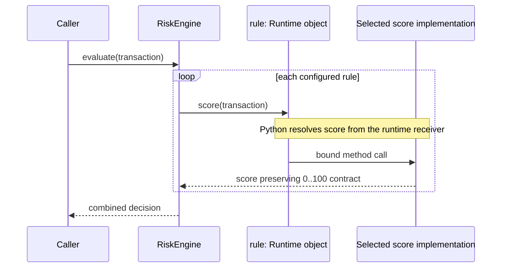
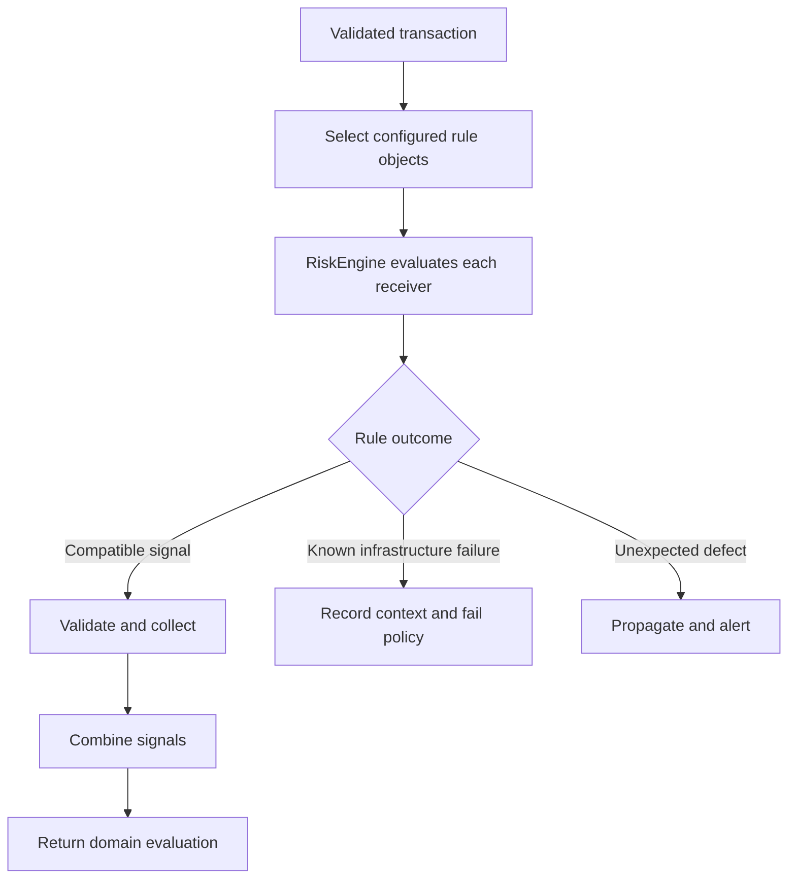

# SDP-FND-060 — Polymorphism, dynamic dispatch, and subtyping

## Physical Notebook Core

Keep this section short enough to reconstruct by hand. It is not a duplicate of the full note.

### Problem or change pressure

A fraud-screening client supports several rules. Every new rule adds another concrete-type branch,
and some classes inherit the expected method name while quietly rejecting inputs or changing result
meaning. The code has many forms, but no trustworthy common promise.

### One-sentence mental model

> Polymorphism lets one client send the same meaningful message to different objects; dynamic
> dispatch chooses the runtime implementation; behavioural subtyping makes that replacement safe.

### One essential visual

```text
                         one client expectation
                    evaluate(valid_transaction)
                                │
                                ▼
 Client ──stable message──> receiver object at runtime
                                │
                   dynamic dispatch chooses
                      ┌─────────┴─────────┐
                      ▼                   ▼
             VelocityRule.evaluate  AmountRule.evaluate
                      └─────────┬─────────┘
                                ▼
                     same behavioural envelope
          accepted inputs • result meaning • failures • effects • invariants

Polymorphism = one client interaction, several forms
Dispatch     = which implementation executes now
Subtyping    = which replacements may preserve the promised meaning
```

### How to read this visual

Read top to bottom. The client knows one meaningful operation. At runtime the receiver controls
which implementation is selected. Then read the bottom “envelope” as the gate: a selected method is
not a safe substitute unless it preserves the client-visible contract. These arrows are conceptual
language-and-design relationships, not a CPython memory layout.

### Key insight

Dynamic dispatch answers **where execution goes**. Subtyping answers **whether going there is safe**.
Python can perform the first even when the second is false.

### Simplification or limitation

The visual shows ordinary receiver-method dispatch. It omits descriptor precedence, MRO details,
special-method lookup, structural typing, generic types, multiple dispatch, concurrency, and how a
static type checker models assignability.

### Governing rules or invariants

1. Define the client-visible behaviour before choosing a base class, `Protocol`, ABC, or duck-typed
   boundary.
2. Let the runtime receiver select an implementation; do not keep a parallel concrete-type switch
   in the client unless the case set is intentionally closed.
3. A subtype may vary implementation but must preserve the useful supertype promises about valid
   inputs, outputs, failures, side effects, state, and history.

### Minimal Python example

```python
from dataclasses import dataclass


@dataclass(frozen=True)
class Transaction:
    amount_paise: int
    attempts_last_hour: int


class RiskRule:
    def score(self, transaction: Transaction) -> int:
        raise NotImplementedError


class AmountRule(RiskRule):
    def score(self, transaction: Transaction) -> int:
        return 80 if transaction.amount_paise >= 100_000 else 0


class VelocityRule(RiskRule):
    def score(self, transaction: Transaction) -> int:
        return min(transaction.attempts_last_hour * 15, 100)


def highest_score(transaction: Transaction, rules: list[RiskRule]) -> int:
    return max((rule.score(transaction) for rule in rules), default=0)
```

`highest_score()` sends one message. `rule` is the runtime receiver, so each iteration may execute a
different implementation. The annotation communicates an intended boundary; it does not itself
perform dispatch or prove that every score stays in `0..100`.

### One common misconception

**Mistake:** “If `issubclass(S, T)` is true and the override has the same signature, `S` is a safe
substitute for `T`.”

**Correction:** That proves a nominal runtime relationship and perhaps a compatible call shape.
Behaviour can still break: the child may reject a valid input, return a value with different
meaning, raise a new routine exception, mutate shared state, or violate a history rule.

### Important trade-offs

- Polymorphic clients can gain local extension and focused tests, but the common contract becomes a
  serious design obligation rather than a shared method name.
- Runtime dispatch removes central type branching, but makes execution depend on receiver type,
  MRO, and binding rules; observability should record stable semantic identity.
- A closed `if`/`match` over two stable cases can be clearer than a hierarchy or interface. Use
  polymorphism when variation, ownership, or independent extension creates real pressure.

### Interview-revision cues

- Separate the three questions: one interface for clients, runtime implementation selection, and
  safe substitutability.
- Static annotations guide analysis; ordinary Python method calls still resolve at runtime.
- Overriding is a mechanism. Behavioural subtyping is a promise. Inheritance may declare the first
  without proving the second.
- Do not say “same method signature” when the interviewer is asking about preserved behaviour.

## Unit metadata

| Field | Value |
|---|---|
| Domain | Design foundations |
| Curriculum | [SDP-FND-060](../../../CURRICULUM.md#sdp-fnd-060) |
| Progress | [PROGRESS.md](../../../PROGRESS.md) |
| Python references | [PYTHON_REFERENCES.md](../../../PYTHON_REFERENCES.md) — hard object-model bridge; soft data-model bridge |
| Learning outcome | Explain behavioural polymorphism and dynamic dispatch, then design substitutions that preserve useful contracts. |
| Hard prerequisites | `SDP-FND-040`, `SDP-FND-050` |
| Soft prerequisites | `PY-OBJ-040` through the mapped Python Mastery bridge |
| Priority | Core |
| Interview frequency | High |
| Production frequency | High |
| Python/backend relevance | High |
| Depth | D2 |
| Scope | Design, Python |
| Size | L |
| Evidence profile | E+I+D+T |
| Canonical Python | Python 3.14 |
| Interview compatibility | Python 3.11 |
| Artifact state | Approved |

The frequency fields above are curriculum judgments, not measurements from a population survey.

## 1. Simple explanation

Imagine a help desk with one instruction: “handle this ticket.”

- A billing specialist handles it one way.
- A security specialist handles it another way.
- An account specialist handles it another way.

The coordinator should not ask, “Are you billing? Are you security? Are you accounts?” before
every assignment. It can send the same meaningful request to the specialist currently holding the
ticket.

That is the useful intuition behind **polymorphism**: one client interaction works with values that
may take different concrete forms.

When the coordinator calls `handler.handle(ticket)`, Python must select actual code. If the receiver
is a `BillingHandler`, its implementation is selected; if the receiver is a `SecurityHandler`, that
implementation is selected. This runtime choice is **dynamic dispatch**.

But imagine the account specialist deletes the ticket, the billing specialist returns a receipt,
and the security specialist raises `NotImplementedError`. They share the method name, yet the
coordinator cannot rely on one meaning. A trustworthy **behavioural subtype** must keep the useful
promises that callers make through the common type.

The concepts answer different questions:

| Concept | Question | Evidence |
|---|---|---|
| Polymorphism | Can one client interaction work across multiple forms? | Client code sends one stable operation |
| Dynamic dispatch | Which implementation is selected for this call? | Runtime receiver, lookup rules, and trace |
| Subtyping | May a value of one type be used where another is expected? | Type relationship plus compatibility rules |
| Behavioural subtyping | Will that replacement preserve useful observable properties? | Contract reasoning and shared behavioural tests |
| Overriding | Has a subclass supplied a same-named implementation? | Class definitions and MRO |

## 2. Start with the change pressure

Suppose a risk service begins with two rules and a concrete switch:

```python
def score(transaction: Transaction, rule_kind: str) -> int:
    if rule_kind == "amount":
        return 80 if transaction.amount_paise >= 100_000 else 0
    if rule_kind == "velocity":
        return min(transaction.attempts_last_hour * 15, 100)
    raise ValueError(f"unknown rule: {rule_kind}")
```

For two stable cases, this is direct and understandable. Do not refactor merely because an `if`
exists.

Now add real pressure:

- different teams deliver new risk rules independently;
- a request selects a configured set of rules;
- some rules own provider clients or cached policy data;
- the service needs per-rule metrics and failure isolation;
- tests must run one common contract against every rule;
- a new rule should not require editing the central scorer;
- business “no risk” must remain distinct from evaluation failure.

The central branch now knows every variation. Adding a rule requires coordinated edits at the point
that should have been stable.

```text
new rule request
      │
      ├─ create implementation
      ├─ edit central conditional
      ├─ edit supported-name validation
      ├─ edit metrics labels
      ├─ edit tests for central branch
      └─ risk changing existing rule flow
```

### How to read this visual

Begin at the change request and follow every edit it forces. The important signal is not the number
of boxes; it is that one independent variation repeatedly modifies a central decision owner.

### Key insight

Polymorphism is useful when the caller's stable job is “ask a rule to evaluate,” while rule-specific
behaviour changes independently.

### Simplification or limitation

This is a change-impact sketch, not a claim that every conditional causes all six edits. A closed,
data-driven case set may keep the direct conditional as the cheaper design.

## 3. Precise working definitions

### Polymorphism

For this unit, **behavioural polymorphism** means that one client operation collaborates with values
of different concrete forms through a common meaningful capability.

It has three parts:

1. a client expresses work without selecting each concrete implementation;
2. multiple values can participate in that interaction;
3. the observable meaning is stable enough for the client to reason about.

“Many shapes” is the word origin, but it is too vague as an engineering definition. A list
containing an integer and a socket is heterogeneous, yet that fact alone gives no useful client
operation.

### Dynamic dispatch

**Dispatch** is implementation selection for an operation. **Dynamic dispatch** performs that
selection using runtime information.

For an ordinary Python expression such as `rule.score(transaction)`, the runtime receiver `rule`
participates in attribute lookup. When lookup yields a function descriptor from the class, Python
binds the instance into a method object and the later call invokes the chosen function. The Python
tutorial describes both method binding and how derived-class overrides can be reached by calls on
`self` ([Python 3.14 tutorial, §§9.3.4 and 9.5](https://docs.python.org/3.14/tutorial/classes.html#method-objects)).

Dynamic dispatch does not necessarily mean inheritance. Python can successfully call a compatible
method on an unrelated object. `SDP-FND-070` compares duck typing, structural static typing,
nominal typing, `Protocol`, and ABCs; this unit first establishes the behavioural promise all of
those mechanisms are trying to express.

### Subtyping

Type `S` is a subtype of type `T` in a given type system when values of `S` may be used in contexts
expecting `T` according to that system's rules.

The phrase needs a qualifier:

- **nominal subtype:** the declared class/type relationship is decisive;
- **structural subtype:** compatible available operations are decisive;
- **static subtype or assignability:** a type checker reasons before execution;
- **runtime subclass relationship:** operations such as `issubclass()` apply Python runtime rules;
- **behavioural subtype:** client-visible semantic properties are preserved.

These sets can overlap without being identical.

### Behavioural subtyping

A practical behavioural subtype can replace the supertype under the documented client contract
without invalidating client reasoning.

Check at least:

- accepted inputs and preconditions;
- returned values and postconditions;
- object and result invariants;
- exception categories and failure meaning;
- side effects and their order;
- mutation, ownership, and aliasing;
- history or temporal properties across multiple calls;
- idempotency, ordering, and concurrency guarantees when promised.

### Overriding

**Overriding** means a derived class provides an attribute or method that is found before the base
implementation for the relevant lookup. It enables a form of dynamic dispatch. It does not by
itself establish a behavioural subtype.

### Substitution

**Substitution** is the client action and test: replace a value expected under one contract with
another and ask whether the client-observable properties still hold. It is more demanding than
“the call did not raise a `TypeError`.”

## 4. Historical and formal foundation

Barbara Liskov and Jeannette Wing's 1994 paper, *A Behavioral Notion of Subtyping*, treats subtyping
as a semantic relationship. Its central requirement is that properties established from the
supertype specification continue to hold for subtype objects. The paper distinguishes signature
compatibility from the stronger behavioural requirement and reasons about invariants and history
properties as well as individual method calls
([Liskov and Wing, 1994, DOI 10.1145/197320.197383](https://www.cs.cmu.edu/~wing/publications/LiskovWing94.pdf)).

The formal paper uses specification and proof machinery beyond this D2 unit. The useful production
translation is:

```text
Client proves or assumes property P from contract T
                         │
                         ▼
                replace T object with S object
                         │
                         ▼
             P must remain true for the client
```

### How to read this visual

Read the property as any documented safety-relevant expectation: accepted input, non-negative
result, no mutation, ordering, idempotency, or another invariant. Replacement is safe only if the
expectation survives.

### Key insight

Substitutability is relative to a useful specification, not to a class name or shared syntax.

### Simplification or limitation

This is an informal design checklist, not a reproduction of the paper's formal definitions. It
does not prove liveness, total correctness, or every property a real concurrent system may require.

`SDP-SOL-030` later develops the Liskov Substitution Principle as a SOLID design and refactoring
tool. Here the purpose is to build the vocabulary and runtime model that principle depends on.

## 5. Three layers that must not be collapsed

```text
LAYER 1 — client design
RiskEngine ──expects──> score(Transaction) -> integer in 0..100

LAYER 2 — Python execution
rule.score(tx) ──lookup/bind/call──> implementation selected from runtime receiver

LAYER 3 — compatibility judgment
Candidate rule ──checked against──> inputs + outputs + failures + effects + history
```

### How to read this visual

Read each row independently. The first is an architectural dependency. The second is a Python
language mechanism. The third is a semantic review and evidence problem. A design may succeed on
one layer and fail on another.

### Key insight

Do not use a runtime mechanism as proof of a design contract.

### Simplification or limitation

The layers influence each other in real code. This separation is analytical: it helps diagnose
whether a bug belongs to the client boundary, Python lookup, static typing, or subtype behaviour.

Common category mistakes:

| Claim | What it actually establishes | What remains unproved |
|---|---|---|
| “Both objects have `score`” | Similar runtime surface | Compatible meaning and failures |
| “Both inherit `RiskRule`” | Nominal relationship and MRO participation | Behavioural contract |
| “mypy accepts the assignment” | Static assignability under its model | Runtime availability and domain semantics |
| “`isinstance` is true” | Runtime recognition under Python rules | Preserved invariants and history |
| “The override ran” | Dispatch selection | Correctness of the override |
| “All example tests pass” | Covered examples satisfy assertions | Unstated or untested properties |

## 6. Source-checked Python mechanics

### Ordinary method lookup and binding

For a normal instance method call:

```python
result = rule.score(transaction)
```

a useful language-level model is:

```text
1. evaluate the receiver expression: rule
2. look up attribute name: score
3. if a function descriptor is found, bind receiver + function as a method
4. evaluate arguments
5. call the resulting callable
```

The exact general attribute algorithm includes instance attributes, descriptors, the receiver's
type, and base classes. The data model describes descriptor binding and notes that ordinary methods
are non-data descriptors
([Python 3.14 data model, §3.3.2.3](https://docs.python.org/3.14/reference/datamodel.html#invoking-descriptors)).

This model explains why a retrieved method carries a receiver:

```python
bound = rule.score
assert bound.__self__ is rule
```

It also explains why storing a bound method stores the selected function/receiver pair; a later
call to that stored method is not identical to repeating a fresh `rule.score` lookup.

### Derived-class override selection

Python remembers base classes and uses the class hierarchy to resolve attributes. A derived class
may override a base method, and a base method calling another method on `self` can reach the derived
override. The tutorial explicitly notes this receiver-sensitive behaviour
([Python 3.14 tutorial, §9.5](https://docs.python.org/3.14/tutorial/classes.html#inheritance)).

```python
class BaseRule:
    def evaluate(self, transaction: Transaction) -> int:
        return self.score(transaction)  # receiver lookup can reach an override

    def score(self, transaction: Transaction) -> int:
        return 0
```

### Static annotations do not choose the runtime method

```python
rule: RiskRule = VelocityRule()
rule.score(transaction)
```

The annotation gives a static analyzer an expected type. The runtime receiver is still a
`VelocityRule`, so ordinary Python lookup selects from that object and its class hierarchy. The
Python typing specification describes Python as dynamically typed with optional gradual static
typing and defines static assignability separately
([typing specification, “Type system concepts”](https://typing.python.org/en/latest/spec/concepts.html)).

Do not say “Python dispatches based on the variable's type annotation.” It does not.

### MRO determines inherited lookup order

For nominal inheritance, `type(receiver).__mro__` records the method resolution order used for
attribute search. Multiple inheritance makes this more important, but the design issue is already
visible in single inheritance: changing bases can change which implementation a receiver finds.

```python
print(VelocityRule.__mro__)
```

MRO answers lookup precedence. It does not decide whether the selected behaviour preserves a
contract.

### `super()` is a directed continuation, not ordinary receiver dispatch

`super()` creates a proxy whose search starts after a specified class in the receiver's MRO. It is
useful for cooperative inheritance and deliberate base extension. It does not mean “find any safe
implementation,” and it does not prove substitutability. The built-in documentation specifies the
MRO-relative search
([Python 3.14 built-ins, `super`](https://docs.python.org/3.14/library/functions.html#super)).

### Special-method lookup is a deliberate exception

Implicit operations such as `len(x)` have special lookup rules. For custom classes, the special
method must generally be defined on the type; placing `__len__` only in one instance dictionary does
not make `len(instance)` use it. The language reference documents that implicit special-method
lookup bypasses the ordinary instance path in these cases
([Python 3.14 data model, §3.3.13](https://docs.python.org/3.14/reference/datamodel.html#special-method-lookup)).

```text
obj.method()       ordinary dotted lookup and binding
len(obj)           implicit special-method lookup via the type
```

This is why “everything is just a normal dynamically dispatched method” is too broad.

## 7. Participants and responsibilities

| Participant | Responsibility | What it must not own |
|---|---|---|
| Client | Express the stable task and consume the common result | Concrete-type selection for every implementation |
| Contract | State meaningful accepted inputs, results, failures, effects, and invariants | One implementation's private algorithm |
| Runtime receiver | Supply the object whose operation is being requested | Authority to redefine client meaning silently |
| Concrete implementation | Perform its variant while preserving the contract | Unannounced stronger preconditions or weaker results |
| Python lookup/binding machinery | Select and bind the callable under language rules | Business validation or semantic proof |
| Static type checker | Check assignability and call shape under annotations | Execute code or prove all domain behaviour |
| Contract test suite | Apply shared observable checks to candidate implementations | Overspecify private helpers or algorithms |
| Composition root/configuration | Choose which implementations exist in a use case | Per-call reimplementation of their behaviour |

## 8. Collaboration and execution flow



### How to read this visual

Follow one request downward. The engine repeats the same message for each receiver. The note marks
the language mechanism; the return label marks the behavioural obligation. “Receiver” and “Impl”
are separated only to make selection visible—ordinary Python source writes one expression.

### Key insight

The client owns iteration and combination. Each receiver owns its variant. The contract connects
them without requiring the client to know the concrete class.

### Simplification or limitation

This is a conceptual synchronous sequence. It omits descriptors, MRO branches, async calls,
timeouts, metrics, and failure isolation. It is not a claim that Python creates a distinct
“dispatcher object.”

## 9. A taxonomy of “polymorphism”

The word is used for several mechanisms. Name the one you mean.

| Form | Same client expression | Variation source | Python example | Primary concern here |
|---|---|---|---|---|
| Subtype/receiver polymorphism | `rule.score(tx)` | Receiver implementation | Overridden or compatible methods | Behavioural substitution |
| Parametric polymorphism | Generic algorithm | Type parameter | `first[T]` over `Sequence[T]` returns `T` | Type-preserving reuse |
| Ad-hoc/operator polymorphism | `a + b` | Operand types and special methods | Numeric or domain `__add__` | Operation-specific meaning |
| Callable polymorphism | `policy(tx)` | Callable value | Function, closure, callable object | Small Python alternative |
| Generic-function dispatch | `render(value)` | Registered argument type | `functools.singledispatch` | Open operation selection |

This unit concentrates on behavioural/receiver polymorphism. `SDP-PYT-010` covers functions and
callable objects as design tools. `SDP-PYT-080` later treats `singledispatch` as a controlled
extension mechanism. The standard-library implementation dispatches a `singledispatch` generic
function from the first argument's runtime type and uses its MRO for fallback
([Python 3.14 `functools.singledispatch`](https://docs.python.org/3.14/library/functools.html#functools.singledispatch)).

Do not answer “Python is polymorphic” without identifying the client operation and variation
mechanism.

## 10. The simplest closed design before polymorphism

```python
from enum import Enum, auto


class RuleKind(Enum):
    AMOUNT = auto()
    VELOCITY = auto()


def score(transaction: Transaction, kind: RuleKind) -> int:
    match kind:
        case RuleKind.AMOUNT:
            return 80 if transaction.amount_paise >= 100_000 else 0
        case RuleKind.VELOCITY:
            return min(transaction.attempts_last_hour * 15, 100)
```

Keep this design when:

- the case set is small, closed, and owned together;
- variants have no independent state or lifecycle;
- one module is the honest decision owner;
- exhaustive review is more valuable than independent extension;
- adding a case is rare and coordinated.

The problem is not conditional syntax. The problem begins when independent variants repeatedly
force unrelated central changes or when conditionals based on type appear throughout the system.

## 11. Concrete pain after requirements change

Central dispatch often spreads:

```python
def score(rule: object, transaction: Transaction) -> int:
    if isinstance(rule, AmountRule):
        return rule.score(transaction)
    if isinstance(rule, VelocityRule):
        return rule.score(transaction)
    if isinstance(rule, DeviceRule):
        return rule.score(transaction)
    raise TypeError(f"unsupported rule: {type(rule).__name__}")
```

Every branch sends the same message, so the type inspection contributes no useful policy. Worse,
other clients may copy the same closed list for metrics, serialization, retries, or UI labels.

```text
                 AmountRule
                /     │     \
       scorer if   metrics if   serializer if
                \     │     /
                VelocityRule
                     + every new rule edits every switch
```

### How to read this visual

Read each center label as a separate client that knows all concrete rule types. A new rule cuts
across all three clients, even though each rule object already knows its own behaviour.

### Key insight

Repeated type inspection is evidence that responsibility for variation may be in the wrong place.

### Simplification or limitation

Sometimes serialization or external schemas genuinely require centralized type tags. Do not force
those boundary decisions into polymorphic methods merely to eliminate every type check.

## 12. Minimal receiver-polymorphic design

```python
class RiskRule:
    """Every implementation accepts a valid transaction and returns 0..100."""

    code = "unspecified"

    def score(self, transaction: Transaction) -> int:
        raise NotImplementedError


class AmountRule(RiskRule):
    code = "amount"

    def score(self, transaction: Transaction) -> int:
        return 80 if transaction.amount_paise >= 100_000 else 0


class VelocityRule(RiskRule):
    code = "velocity"

    def score(self, transaction: Transaction) -> int:
        return min(transaction.attempts_last_hour * 15, 100)


def highest_score(transaction: Transaction, rules: tuple[RiskRule, ...]) -> int:
    scores = (rule.score(transaction) for rule in rules)
    return max(scores, default=0)
```

Why each piece exists:

- `RiskRule` gives this example one nominal home for the intended contract.
- `score` is the stable client operation.
- concrete classes own only their scoring variant.
- `highest_score` owns combination policy, not implementation selection.
- the runtime `rule` object controls ordinary method resolution.

The base class is not automatically required in Python. It is present here to isolate nominal
subtyping and overriding. `SDP-FND-070` decides when duck typing, `Protocol`, or an ABC is a better
expression of the boundary.

## 13. A production-oriented result contract

Returning a bare integer leaves meaning implicit. A value object can mechanically protect part of
the postcondition:

```python
from dataclasses import dataclass


@dataclass(frozen=True, slots=True)
class RiskSignal:
    rule_code: str
    score: int
    reason: str

    def __post_init__(self) -> None:
        if not self.rule_code.strip():
            raise ValueError("rule_code must not be blank")
        if not 0 <= self.score <= 100:
            raise ValueError("score must be between 0 and 100")
        if not self.reason.strip():
            raise ValueError("reason must not be blank")


class RiskRule:
    code = "unspecified"

    def evaluate(self, transaction: Transaction) -> RiskSignal:
        raise NotImplementedError


class AmountRule(RiskRule):
    code = "amount"

    def evaluate(self, transaction: Transaction) -> RiskSignal:
        score = 80 if transaction.amount_paise >= 100_000 else 0
        reason = "high amount" if score else "amount within threshold"
        return RiskSignal(self.code, score, reason)
```

This value enforces range and nonblank fields. It still cannot prove:

- the rule accepts every valid transaction;
- the reason truthfully describes the algorithm;
- no state was mutated;
- no external call happened twice;
- repeated calls preserve a history property;
- exceptions retain their documented meaning.

Types and value invariants shrink the contract-testing problem; they do not eliminate it.

## 14. The behavioural contract envelope

Use the following review frame whenever a subtype is proposed.

| Dimension | Supertype question | Typical subtype break |
|---|---|---|
| Valid inputs | Which values may every client pass? | Child rejects a value the parent accepted |
| Output shape | What fields/types are returned? | Child returns `None` or a different unit |
| Output meaning | What does success represent? | `score=0` changes from “clear” to “unknown” |
| Postcondition | What is guaranteed after return? | Score exceeds the documented range |
| Exceptions | Which failures are routine and what do they mean? | Child exposes a vendor exception as business rejection |
| Side effects | What may be read, written, emitted, or called? | Child sends an email during a pure evaluation |
| Invariant | What must remain true in every visible state? | Child leaves cached total inconsistent |
| History | What must hold across calls? | Child allows a balance to increase after withdrawal |
| Ordering | Is call/result order meaningful? | Child reorders events silently |
| Idempotency | May a repeated request duplicate work? | Child double-charges on retry |
| Concurrency | Is the operation safe to share or re-enter? | Child adds unsynchronized mutable cache |
| Performance | Is there an explicit service-level promise? | Child makes bounded local work an unbounded network scan |

Not every contract includes every row. The point is to make relevant promises explicit, not to
invent a maximal interface.

## 15. Preconditions, postconditions, and invariants

A useful informal rule set:

```text
Subtype method:
  must not demand MORE from a valid supertype client
  must guarantee AT LEAST the useful supertype result
  must preserve supertype invariants and allowed histories
```

### Stronger precondition — unsafe

```python
class DomesticOnlyRule(RiskRule):
    def evaluate(self, transaction: Transaction) -> RiskSignal:
        if transaction.country != "IN":
            raise ValueError("foreign transaction not supported")
        ...
```

If `RiskRule.evaluate` promises to accept every validated transaction, this child rejects a call
the client is entitled to make. Better options depend on the domain:

- return a neutral or explicit “not applicable” result if that is in the contract;
- narrow the client boundary so it never promises arbitrary transactions;
- model a different capability rather than claim the broad subtype;
- validate eligibility before constructing/selecting the rule.

### Weaker postcondition — unsafe

```python
class ExperimentalRule(RiskRule):
    def evaluate(self, transaction: Transaction) -> RiskSignal:
        return RiskSignal("experiment", 120, "model output")
```

The value object rejects the out-of-range result immediately. Without that guard, the client might
make a false decision while every method call “works.”

### Broken invariant — unsafe

A subtype that updates `total_evaluations` but not the corresponding audit list may preserve one
return value while making the object's state inconsistent. Substitution reasoning extends beyond a
single call.

### History property — easy to miss

Suppose a base abstraction promises that an approved limit never decreases during one request. A
subtype that recalculates and lowers the limit after an external refresh may satisfy each method's
local type signature while breaking what clients reasoned across calls.

## 16. Subclass, subtype, and behavioural subtype

```text
nominal subclasses recognized by hierarchy
┌─────────────────────────────────────────────┐
│ AmountRule                                  │
│ BrokenRule (same method, wrong score range) │
│                                             │
│   behavioural subtypes under contract C     │
│   ┌─────────────────────────────────────┐   │
│   │ AmountRule • VelocityRule           │   │
│   └─────────────────────────────────────┘   │
└─────────────────────────────────────────────┘

Compatible unrelated objects may also satisfy C at runtime; nominal membership is not required
for ordinary Python calls.
```

### How to read this visual

The outer box is a nominal class relationship. The inner box contains only candidates shown to
preserve a particular behavioural contract. The sentence below reminds us that a different typing
or runtime mechanism may recognize compatible unrelated objects.

### Key insight

“Subclass” is a language relationship. “Behavioural subtype” is a relationship to a specification.

### Simplification or limitation

The sets are conceptual and contract-relative. Static structural assignability, ABC virtual
subclasses, and runtime duck typing each have more precise rules covered in `SDP-FND-070`.

## 17. What dynamic dispatch does—and does not—buy

Dynamic dispatch provides:

- late implementation selection from the runtime receiver;
- local ownership of variant behaviour;
- extension without a central per-type call branch;
- natural collaboration with stateful objects;
- an override point in nominal hierarchies.

It does not provide:

- a correct common abstraction;
- behavioural compatibility;
- input/result validation;
- failure translation;
- safe concurrency;
- bounded latency;
- discoverability of all implementations;
- static type safety;
- protection from a badly designed MRO;
- proof that the client should be open to new cases.

## 18. Dispatch is not the same as delegation

```python
class RiskService:
    def __init__(self, rule: RiskRule) -> None:
        self._rule = rule

    def evaluate(self, transaction: Transaction) -> RiskSignal:
        return self._rule.evaluate(transaction)
```

Two things happen:

1. `RiskService` **delegates** work to another object because the service received the client
   request and asks its collaborator to perform the evaluation.
2. Python **dynamically dispatches** `evaluate` based on the runtime collaborator stored in
   `_rule`.

Delegation is a design collaboration. Dispatch is implementation selection. They frequently occur
together but are not synonyms. An object can dynamically dispatch a method on itself without
delegating, and it can delegate to a fixed concrete collaborator with no variation requirement.

## 19. Dispatch is not the same as overloading

The terms are often mixed in interviews.

| Mechanism | Selection question | Python example |
|---|---|---|
| Overriding | Which implementation for this receiver/MRO? | `child.method()` |
| Ordinary dynamic dispatch | Which callable does runtime lookup yield? | `receiver.method()` |
| Static overload declarations | Which call signatures may a type checker accept? | `@overload` definitions |
| Generic-function dispatch | Which registered implementation matches an argument type? | `@singledispatch` |
| Manual dispatch | Which branch/key should the program choose? | `match kind`, callable dictionary |

Python `@overload` declarations describe alternatives to static type checkers; the runtime still has
one implementation body. They are not Java-style runtime method overloading by declared parameter
types.

When answering, say both **what information selects** and **when selection occurs**.

## 20. A simpler Python alternative: pass a callable

If variants are stateless operations, a class hierarchy may add no value:

```python
from collections.abc import Callable, Iterable


RiskScorer = Callable[[Transaction], RiskSignal]


def amount_signal(transaction: Transaction) -> RiskSignal:
    score = 80 if transaction.amount_paise >= 100_000 else 0
    return RiskSignal("amount", score, "amount threshold")


def evaluate_all(
    transaction: Transaction,
    scorers: Iterable[RiskScorer],
) -> tuple[RiskSignal, ...]:
    return tuple(scorer(transaction) for scorer in scorers)
```

This is still polymorphic collaboration: a client invokes callable values that may be functions,
closures, bound methods, or callable objects. The dynamic operation is the call protocol rather
than a custom class method.

Choose callables when:

- one operation is the complete capability;
- variants carry little or no lifecycle/state;
- a descriptive function name is enough;
- configuration can compose values directly;
- a class would exist only to hold one method.

Choose an object contract when:

- cohesive operations share state or lifecycle;
- semantic identity belongs to the collaborator;
- configuration, metrics, or cleanup are part of the capability;
- multiple methods form one invariant;
- framework or runtime rules require a class relationship.

Do not replace a needless class hierarchy with a needless registry of anonymous lambdas. Name the
business decisions clearly.

## 21. Another alternative: a callable dictionary

For a small open-by-configuration but centrally owned set:

```python
SCORERS: dict[str, RiskScorer] = {
    "amount": amount_signal,
    "velocity": velocity_signal,
}


def evaluate_named(name: str, transaction: Transaction) -> RiskSignal:
    try:
        scorer = SCORERS[name]
    except KeyError as error:
        raise ValueError(f"unknown scorer: {name}") from error
    return scorer(transaction)
```

The dictionary makes name-to-callable selection explicit. It may be better than receiver
polymorphism when:

- the main force is lookup by an external name;
- operations are simple callables;
- registration is centralized deliberately;
- duplicate names and default behaviour are easy to govern.

It does not remove contract obligations. Every registered callable still needs compatible input,
result, failure, and effect semantics.

## 22. Refactoring path from type switching

Use tests to preserve meaning while moving responsibility:

1. Characterize current client-visible results, failures, and side effects.
2. Identify which branches perform the same conceptual operation.
3. Write the smallest truthful contract for that operation.
4. Find branch-specific data or behaviour that belongs with each variant.
5. Introduce one receiver operation or callable seam.
6. Move one branch behind the seam.
7. Keep the old switch temporarily if it provides a safe migration boundary.
8. Move remaining variants one at a time.
9. Replace concrete-type checks with one polymorphic call.
10. Run shared contract tests against every candidate.
11. Add the new requirement without editing the stable client.
12. Remove obsolete tags, branches, or speculative abstractions.

```text
BEFORE                                AFTER

Client                                Client
  ├─ if A: algorithm A                  │ one stable call
  ├─ elif B: algorithm B                ▼
  └─ elif C: algorithm C              Contract
                                         ▲  ▲  ▲
                                         A  B  C
```

### How to read this visual

Read the left as one client owning selection and all algorithms. Read the right as a client
depending on one contract while each variant owns its implementation. The vertical arrows mean
“advertises/satisfies the client capability,” not necessarily inheritance.

### Key insight

The refactoring succeeds when the stable client no longer changes for a new compatible variant and
the contract remains explicit—not merely when the `if` disappears.

### Simplification or limitation

Construction or configuration still chooses concrete objects somewhere. That selection is not the
same as repeatedly branching inside the business operation. Serialization boundaries may also keep
explicit type tags.

## 23. Realistic backend use case — configurable risk evaluation

Assume an API request is validated into an immutable transaction. A composition root selects
enabled risk rules for one tenant. The use case evaluates them, records semantic observations, and
combines results.

```python
from dataclasses import dataclass
from time import perf_counter


@dataclass(frozen=True, slots=True)
class Evaluation:
    signals: tuple[RiskSignal, ...]
    highest_score: int


class RiskEngine:
    def __init__(self, rules: tuple[RiskRule, ...]) -> None:
        self._rules = rules

    def evaluate(self, transaction: Transaction) -> Evaluation:
        signals: list[RiskSignal] = []
        for rule in self._rules:
            started = perf_counter()
            try:
                signal = rule.evaluate(transaction)
            except RuleUnavailable:
                record_rule_failure(rule.code, "unavailable")
                raise
            else:
                record_rule_latency(rule.code, perf_counter() - started)
                signals.append(signal)

        frozen = tuple(signals)
        return Evaluation(
            signals=frozen,
            highest_score=max((signal.score for signal in frozen), default=0),
        )
```

The code is illustrative; `record_rule_failure`, `record_rule_latency`, and `RuleUnavailable` are
boundary placeholders, not a framework or library API. Important design decisions are visible:

- composition happens once through the constructor;
- the engine owns iteration and aggregation;
- the receiver owns rule evaluation;
- metrics use stable semantic `rule.code`, not only class names;
- expected infrastructure unavailability is distinguishable;
- unexpected exceptions are not converted into safe-looking scores.

### Request flow



### How to read this visual

Follow the successful path down the left and bottom. The two failure branches separate expected
operational failure from an unexpected defect. Dynamic dispatch occurs inside the “evaluates each
receiver” node; result validation happens after selection.

### Key insight

Polymorphism keeps rule selection out of the use-case loop, while the use case still owns cross-rule
policy such as ordering, metrics, failure handling, and aggregation.

### Simplification or limitation

The flow is synchronous and fail-fast. A real system must explicitly choose isolation, deadlines,
partial results, concurrency, and tenant-configuration rules. The diagram does not prescribe those
choices.

## 24. Failure semantics are part of substitutability

Consider three outcomes:

1. **Valid low-risk result:** evaluation succeeded and produced score zero.
2. **Normal non-applicability:** the rule intentionally does not apply under a documented contract.
3. **Evaluation failure:** required data or infrastructure was unavailable.

Collapsing them into `0` makes an operational failure look safe. Collapsing them into arbitrary
exceptions makes routine business variation look broken.

A result model might distinguish them:

```python
from dataclasses import dataclass
from enum import Enum, auto


class SignalStatus(Enum):
    APPLIED = auto()
    NOT_APPLICABLE = auto()


@dataclass(frozen=True, slots=True)
class RiskSignal:
    rule_code: str
    status: SignalStatus
    score: int | None
    reason: str
```

Infrastructure failure may still use a controlled exception if the use case cannot return a valid
domain evaluation. The correct choice depends on client policy, but all implementations must use
the chosen meanings consistently.

### Failure timeline

```text
validate request → select receiver → dispatch → implementation work → validate result → aggregate
       │                 │            │              │                   │
 invalid input      configuration  lookup bug   provider failure   contract violation
```

### How to read this visual

Read left to right and attach an error to the stage that owns it. A failure's class and context
should preserve that stage's meaning rather than converting everything to one broad `ValueError`.

### Key insight

Compatible subtypes need compatible failure semantics, not necessarily identical internal
exceptions.

### Simplification or limitation

This is a diagnostic timeline. Real boundaries may translate several low-level causes into one
stable domain failure, and recovery may retry or continue depending on explicit policy.

## 25. Common substitution failures

### Stronger input requirement

The base promises all validated transactions; a child accepts only one country or amount range.

**Detection:** run the base input partition against every implementation.

**Containment:** return a contract-defined non-applicable result, narrow the abstraction, or reject
the claimed subtype.

### Weaker result guarantee

The base returns a score in `0..100`; a child returns `-1` as a sentinel or `120` as raw model
output.

**Detection:** value invariants plus shared property tests.

**Containment:** translate implementation-specific output at its boundary.

### New routine exception

The base represents “not applicable” as a result; a child raises `ValueError` for the same state.

**Detection:** shared scenario tests across implementations.

**Containment:** normalize domain meaning while preserving unexpected defects.

### Added side effect

A supposedly pure rule writes an audit event, charges a provider quota, or mutates the transaction.

**Detection:** fake boundary, immutable inputs, effect assertions, and code review.

**Containment:** make the effect part of the explicit contract or move it outside the subtype.

### Changed history property

The base is idempotent for the same request ID; a child creates a new external request on every
retry.

**Detection:** repeat-call and failure-recovery tests.

**Containment:** enforce idempotency at the owning boundary and document keys/lifetime.

### Hidden latency or blocking

A local rule subtype starts an unbounded network scan. The functional result may match while the
operational contract becomes unsafe.

**Detection:** boundary inspection, timeout tests, and production latency/error metrics. Do not
invent a numeric SLA unless the system has one.

**Containment:** separate local and remote capabilities or make the operational policy explicit.

## 26. Testing strategy

| Test type | What it proves | What not to overspecify |
|---|---|---|
| Value invariant | Result cannot represent forbidden states | Concrete algorithm |
| Shared contract | Every advertised implementation keeps common observable examples | Private helper calls |
| Property/partition | Contract holds across important input classes | Randomness as a substitute for domain partitions |
| Client test | Client sends one stable operation and combines results correctly | MRO or class names |
| Implementation unit | Variant-specific algorithm and edge cases | Other implementations |
| Failure contract | Routine outcomes and failures retain meaning | Vendor exception internals after translation |
| Integration | Real boundary wiring and serialization preserve contract | Unrelated infrastructure |
| Concurrency/retry | Promised ordering, idempotency, and safety survive overlap | Scheduler details |

### Shared contract tests

A contract suite should be reusable, not copied with different expected internals:

```python
import pytest


@pytest.mark.parametrize("build_rule", [AmountRule, VelocityRule])
def test_every_rule_returns_a_valid_signal_for_a_valid_transaction(build_rule) -> None:
    transaction = valid_transaction()
    before = transaction

    signal = build_rule().evaluate(transaction)

    assert 0 <= signal.score <= 100
    assert signal.rule_code
    assert transaction == before
```

This example does not prove all semantics; it shows the shape. Strong contract evidence adds domain
partitions, failures, repeated calls, and effect checks that match actual promises.

### Test the client without concrete-type branching

Use a tiny test collaborator that records the common operation:

```python
class RecordingRule(RiskRule):
    code = "recording"

    def __init__(self, signal: RiskSignal) -> None:
        self.signal = signal
        self.seen: list[Transaction] = []

    def evaluate(self, transaction: Transaction) -> RiskSignal:
        self.seen.append(transaction)
        return self.signal
```

The client test should assert order, aggregation, and failure policy. It should not ask whether the
receiver is `AmountRule`.

### Passing tests are not a complete proof

Tests observe chosen cases. Behavioural subtyping is a reasoning obligation over the documented
contract. Use both:

- precise prose and value types to define meaning;
- shared tests to provide repeatable evidence;
- review to find unmodeled effects and history;
- production observations for operational promises.

## 27. Observability and debugging

Dynamic dispatch moves the selected implementation behind a stable call. That is good design, but
debugging still needs to reveal semantic context.

Record when appropriate:

- stable implementation code and configuration version;
- client operation name;
- request or trace correlation ID, not private payloads;
- outcome category: applied, not applicable, rejected, or failed;
- duration and retry count;
- translated failure category and boundary;
- contract-validation failure separately from provider failure.

Avoid making `type(obj).__name__` the only identifier. Class names change during refactoring and may
leak infrastructure vocabulary. A stable domain code can coexist with a debug-only runtime type.

### Debugging sequence

1. Confirm the runtime receiver type and semantic code.
2. Inspect `type(receiver).__mro__` only if nominal lookup is relevant.
3. Confirm whether the call is ordinary dotted lookup or implicit special syntax.
4. Find the function selected for the receiver.
5. Compare actual input with the common precondition.
6. Validate result and effect invariants.
7. Compare exception meaning with the client contract.
8. Reproduce through the shared contract suite.

Do not begin with CPython bytecode when the failure is “this subtype rejects a valid request.”

## 28. Concurrency and state safety

Polymorphism does not make implementations equally safe to share.

Suppose the base contract permits one `RiskRule` instance to be reused concurrently. A subtype that
adds a mutable, unsynchronized “last transaction” field breaks an operational invariant even if
individual scores are correct.

Ask:

- Is the collaborator stateless, request-scoped, or shared?
- Does evaluation mutate instance or class state?
- Is cached data immutable, synchronized, or replace-on-write?
- Can callbacks re-enter the object?
- Does cancellation leave partial effects?
- Are retries idempotent?
- Is result ordering part of the contract?

If concurrency is not promised, do not pretend it is. Instead, make ownership and lifetime clear so
the caller does not infer safe sharing accidentally.

## 29. Performance and memory

Method dispatch overhead is rarely the first design question in a backend boundary. Network I/O,
serialization, database work, allocation, and algorithm choice usually dominate, but do not claim a
ratio without measuring the actual workload.

Relevant trade-offs:

- many tiny strategy objects add allocation and indirection;
- a callable or enum branch may be simpler in a hot, closed loop;
- per-instance caches can multiply memory across subtypes;
- remote implementations can change latency by orders of magnitude in practical terms even though
  their call signature matches;
- dynamically replacing class attributes can invalidate reasoning and interpreter optimizations;
- special methods follow their documented type-level lookup path.

If performance matters, benchmark representative inputs, warm-up, trials, timing method,
uncertainty, and environment. Preserve the contract before and after optimization.

## 30. Decision guide

```text
Do multiple implementations perform one meaningful client task?
    │
    ├─ no ──> do not force a common abstraction
    │
    └─ yes
        │
        ├─ case set small, closed, and centrally owned?
        │      └─ yes ──> direct function / enum / match may be clearest
        │
        └─ implementations vary independently or carry state/lifecycle?
               │
               ├─ one stateless operation ──> consider callable values
               │
               └─ cohesive capability ──> define behavioural contract
                                             │
                                             ├─ choose typing mechanism later
                                             └─ enforce shared contract evidence
```

### How to read this visual

Start with meaning, not class syntax. A negative first answer stops the abstraction. A closed case
set favors direct code. Independent variation then separates callables from cohesive objects. Only
after the behavioural contract exists should you choose nominal or structural typing machinery.

### Key insight

The behavioural boundary comes before the interface mechanism.

### Simplification or limitation

Real systems can mix approaches: a dictionary selects callables, a service composes stateful
objects, and a serialization boundary uses explicit tags. The guide identifies a starting point,
not a universal tree.

## 31. Related units and boundaries

| Related unit | Relationship | Key difference |
|---|---|---|
| `SDP-FND-040` | Prerequisite: contracts and hidden decisions | Defines what a useful behavioural promise contains |
| `SDP-FND-050` | Prerequisite: inheritance and collaboration | Inheritance is one reuse/type mechanism; dispatch and substitution are separate judgments |
| `SDP-FND-070` | Immediate next unit | Chooses duck, structural, nominal, `Protocol`, or ABC expression for the capability |
| `SDP-FND-080` | Test seams and doubles | Applies replaceable collaborators for deterministic testing |
| `SDP-SOL-020` | Open/Closed Principle | Uses stable boundaries to extend behaviour without editing clients |
| `SDP-SOL-030` | Liskov Substitution Principle | Deepens behavioural subtyping as a SOLID principle and refactoring test |
| `SDP-PYT-010` | Functions and callables | Shows Python alternatives to class-based receiver polymorphism |
| `SDP-PYT-080` | `singledispatch` | Dispatches a generic function from argument type rather than receiver method lookup |
| `SDP-BEH-010` | Strategy | Packages replaceable policy behind a stable callable or object contract |
| `SDP-BEH-060` | Template Method | Uses overriding inside an invariant inherited algorithm |
| `SDP-BEH-100` | Visitor | Makes operation/type dispatch choices explicit, including double dispatch |

## 32. When to use polymorphic collaboration

- A client has one stable, meaningful task across independently varying implementations.
- New implementations should be added without editing the core client loop.
- Variants own cohesive state, lifecycle, or algorithms.
- Construction/configuration can select implementations at a clear boundary.
- A common behavioural contract can be stated and tested honestly.
- Type switching is duplicated across several clients.
- Substitution improves testing without weakening domain semantics.

## 33. When not to use it

- There is one implementation and no credible variation pressure.
- The case set is deliberately closed and a short exhaustive `match` is clearer.
- Variants do not share one truthful behavioural meaning.
- The only goal is to remove an `if`.
- A plain function, enum, table, or callable dictionary expresses the problem directly.
- A hierarchy would encode data values as types.
- The proposed contract becomes vague enough to hide meaningful differences.
- Operational differences are so large that one common capability would mislead clients.

## 34. Common misuse and overengineering

| Misuse | Why it happens | Better move |
|---|---|---|
| Base class with only `raise NotImplementedError` and no contract | Shared name is mistaken for shared meaning | State accepted inputs, outputs, failures, and effects first |
| `isinstance` chain immediately before same-named call | Client retains concrete selection | Send the stable message directly when the boundary is truthful |
| One subclass per enum value | Types replace simple data | Keep enum/match when cases are closed and stateless |
| Child narrows valid inputs | Special case is forced into broad type | Model non-applicability, narrow capability, or reject subtype claim |
| Catch every exception and return neutral result | Availability is prioritized over truth | Translate expected failures; surface defects distinctly |
| Assume annotation drives dispatch | Static and runtime models are collapsed | Inspect the runtime receiver and operation lookup rules |
| Call base function explicitly from clients | Override point is bypassed | Use ordinary receiver calls or redesign the extension contract |
| Deep hierarchy for code reuse | Implementation similarity is mistaken for subtype meaning | Compose helpers or extract functions |
| Contract tests assert private methods | Implementation is frozen accidentally | Assert client-visible behaviour and effects |
| Abstract every future variation | Speculation replaces evidence | Add the smallest seam after concrete pressure appears |

## 35. Interview preparation

### A strong answer structure

1. Define polymorphism in terms of one client interaction across multiple forms.
2. Define dynamic dispatch as runtime implementation selection.
3. Define subtyping as substitutability under a particular type system or contract.
4. Separate subclassing, overriding, and behavioural subtyping.
5. Give one Python receiver-call example.
6. State the behavioural envelope: inputs, outputs, failures, effects, invariants, history.
7. Compare a closed conditional and a callable alternative.
8. Mention annotations do not choose runtime methods.
9. Describe shared contract tests and their limits.
10. Reject polymorphism when the abstraction is not truthful or the case set is closed.

### Common formulations

1. What is polymorphism, and how does Python implement it?
2. What is the difference between dynamic dispatch and duck typing?
3. Is every subclass a subtype?
4. Does overriding a method prove substitutability?
5. Why can a subtype not strengthen preconditions?
6. How do static annotations affect runtime dispatch?
7. What is the difference between overloading and overriding in Python?
8. When is `isinstance` dispatch acceptable?
9. How would you test several implementations of one interface?
10. Why might a callable be better than a class hierarchy?
11. How do special methods differ from ordinary method lookup?
12. What production properties belong in a behavioural contract?

### Weak-answer traps

- “Polymorphism means many classes inherit one parent.”
- “Python sees the annotation and calls the matching override.”
- “Same signature means subtype.”
- “Duck typing guarantees behaviour if the method exists.”
- “All `isinstance` checks are bad.”
- “LSP means subclasses cannot change anything.”
- “Exceptions are implementation details.”
- “If tests pass, the subtype is proven.”
- “Use an abstract base class for every interface.”
- “Dynamic dispatch and delegation are the same.”

### Likely follow-ups

- Show a subclass that passes static typing but breaks a business invariant.
- Explain how a base method can call an override on `self`.
- Compare receiver dispatch with `singledispatch`.
- Model normal non-applicability separately from infrastructure failure.
- Remove inheritance while preserving runtime polymorphism.
- Add metrics without branching on class.
- Discuss sharing one stateful implementation across threads or tasks.
- Defend keeping a direct `match` in a closed-world design.

### One-sentence senior answer

> I use polymorphism when a stable client operation has independently varying implementations, let
> the runtime receiver select the method, and treat substitutability as a behavioural contract over
> valid inputs, results, failures, effects, invariants, and history—not as a consequence of sharing
> a base class or signature.

## 36. Code-review exercise

Review this code without rewriting it immediately:

```python
class Exporter:
    def export(self, report: Report) -> bytes:
        raise NotImplementedError


class CsvExporter(Exporter):
    def export(self, report: Report) -> bytes:
        return encode_csv(report)


class RemotePdfExporter(Exporter):
    def export(self, report: Report) -> bytes:
        if len(report.rows) > 100:
            raise ValueError("too many rows")
        upload(report)
        return b""


def export_report(exporter: Exporter, report: Report) -> bytes:
    if isinstance(exporter, CsvExporter):
        return exporter.export(report)
    if isinstance(exporter, RemotePdfExporter):
        return exporter.export(report)
    raise TypeError("unsupported exporter")
```

Answer in order:

1. What exact contract does `Exporter.export` appear to promise?
2. Which valid inputs may the PDF child reject?
3. Is an empty byte string a successful export under that contract?
4. Is `upload()` an allowed side effect?
5. What does the client branch add before sending the same message?
6. Which failures are business outcomes, invalid input, and infrastructure failures?
7. Would one common exporter contract remain honest if remote export is asynchronous?
8. What is the smallest safe refactoring?
9. Which tests must be shared across implementations?
10. When might keeping explicit separate use cases be clearer?

Do not assume the intended answers. First state the missing contract information.

## 37. Changed-requirement drills

For each scenario, decide whether to extend the polymorphic boundary, narrow it, use a callable, or
keep explicit branching.

### Drill 1 — async remote rule

One risk implementation now requires an asynchronous provider call while existing rules are local
and synchronous. Is `evaluate()` still one honest capability? Consider an async-wide contract,
prefetch boundary, or separate local/remote stages.

### Drill 2 — partial applicability

A rule is meaningful only for card transactions. Decide whether every rule returns a
`NOT_APPLICABLE` result, configuration selects rules by transaction kind, or the capability should
be narrower.

### Drill 3 — tenant plugins

Third parties may add rules. Separate discovery, validation, trust, timeouts, and isolation from the
runtime polymorphic call. Dynamic dispatch is not a plugin security model.

### Drill 4 — immutable value cases

Two discount kinds are fixed by regulation and contain no state. Defend a direct enum/match against
a class hierarchy.

### Drill 5 — audit side effects

One implementation needs a mandatory audit record. Decide whether auditing is part of every rule's
contract, a decorator/wrapper, or use-case orchestration. Do not let one child silently add it.

### Drill 6 — retry and idempotency

A remote subtype retries after timeout. Explain how idempotency keys, duplicate effects, and failure
translation affect substitutability.

## 38. Practice, debugging, and experiments

The focused lab is in [practice/](practice/README.md).

It contains:

- an unsolved delivery-quote refactoring with concrete-type client dispatch;
- a nominal subclass that narrows the valid-request contract;
- coherent available/unavailable result invariants;
- a new subtype that works directly but is rejected by the central dispatcher;
- shared-contract and changed-requirement prompts;
- a receiver-dispatch observation;
- an implicit special-method lookup observation;
- deterministic tests for starter and experiment behaviour.

Follow the documented cycle:

```text
predict → run → observe → explain → refactor → vary
```

Artifact verification is not learner evidence. Preserve the original attempt and reasoning before
adding any comparison solution.

## 39. Closed-book revision cues

1. Draw polymorphism, dispatch, and behavioural subtyping as three separate labels.
2. Explain which runtime value chooses an ordinary Python method implementation.
3. State why an annotation does not perform runtime dispatch.
4. Give one stronger-precondition failure.
5. Give one weaker-postcondition failure.
6. Name an invariant or history property that a signature cannot express.
7. Distinguish business non-applicability from infrastructure failure.
8. Explain why `issubclass()` is insufficient evidence.
9. Compare a closed `match`, callable, and receiver-polymorphic object.
10. Explain why `len(obj)` may not use an instance-level `__len__`.
11. Describe a reusable contract test without overspecifying implementation.
12. Reject one proposed hierarchy because the common abstraction is untruthful.

## 40. Vocabulary and professional English

### Polymorphic

| Item | Content |
|---|---|
| Pronunciation | pol-ee-MOR-fik |
| Simple English meaning | Able to take or work with several forms |
| Hindi cue | कई रूपों के साथ काम करने वाला |
| Meaning in this design context | One client interaction can work with multiple concrete implementations |

Natural examples:

1. The serializer accepts polymorphic values through one stable operation.
2. This collection is heterogeneous, but it is not usefully polymorphic for our client.
3. The new handler participates in the same polymorphic call.
4. **Interview:** “The loop is polymorphic because it sends one message without selecting concrete classes.”
5. **Engineering discussion:** “We need contract tests before opening this boundary to polymorphic plugins.”

### Dispatch

| Item | Content |
|---|---|
| Pronunciation | dih-SPATCH |
| Simple English meaning | Send work to the place that should handle it |
| Hindi cue | सही कार्यान्वयन की ओर भेजना |
| Meaning in this design context | Select the implementation for an operation |

Natural examples:

1. The router dispatches requests to a use case.
2. Method dispatch selected the override from the receiver's MRO.
3. Manual dispatch remains acceptable for this closed enum.
4. **Interview:** “Receiver dispatch and `singledispatch` use different selection inputs.”
5. **Engineering discussion:** “Log the semantic rule code so we can debug which dispatch target ran.”

### Substitute

| Item | Content |
|---|---|
| Pronunciation | SUB-stih-toot |
| Simple English meaning | Use one thing in place of another |
| Hindi cue | किसी के स्थान पर उपयोग करना |
| Meaning in this design context | Replace a value while preserving the client's useful expectations |

Natural examples:

1. You can substitute oat milk in this recipe.
2. The fake substitutes for the provider only under the tested contract.
3. This subclass cannot substitute for the base because it rejects valid input.
4. **Interview:** “Nominal inheritance permits the assignment; behavioural evidence justifies the substitution.”
5. **Engineering discussion:** “Can we substitute this remote implementation without changing timeout semantics?”

### Preserve

| Item | Content |
|---|---|
| Pronunciation | prih-ZURV |
| Simple English meaning | Keep something true or unchanged |
| Hindi cue | बनाए रखना |
| Meaning in this design context | Maintain observable contract properties across replacement or refactoring |

Natural examples:

1. The archive preserves the original records.
2. The refactor preserves result ordering.
3. Every subtype must preserve the documented invariant.
4. **Interview:** “A safe override preserves accepted inputs and useful postconditions.”
5. **Engineering discussion:** “The retry wrapper must preserve idempotency and error meaning.”

### Invariant

| Item | Content |
|---|---|
| Pronunciation | in-VAIR-ee-unt |
| Simple English meaning | A rule that must remain true |
| Hindi cue | हमेशा सत्य रहने वाला नियम |
| Meaning in this design context | A property required in every client-visible valid state |

Natural examples:

1. Conservation is an invariant in the model.
2. Non-negative balance is a domain invariant here.
3. The subtype broke the result-range invariant.
4. **Interview:** “A matching signature does not prove preservation of invariants.”
5. **Engineering discussion:** “Put the representable-state invariant in the value object and test the remaining behaviour.”

## 41. Python Mastery references

### Hard object-model bridge

- [PY-OBJ-010 — Classes, instances, methods, and construction](https://github.com/rahulyadev/python-mastery/blob/main/CURRICULUM.md#py-obj-010)
- [PY-OBJ-020 — Properties, encapsulation, and composition](https://github.com/rahulyadev/python-mastery/blob/main/CURRICULUM.md#py-obj-020)
- [PY-OBJ-030 — Inheritance, MRO, and super](https://github.com/rahulyadev/python-mastery/blob/main/CURRICULUM.md#py-obj-030)

Minimum bridge before practice:

1. An instance method is a function retrieved through an object and normally bound to that object.
2. A subclass can override an inherited method.
3. Attribute lookup uses the receiver's type and MRO.
4. `super()` continues an MRO-relative lookup; it is not a fixed-parent keyword.
5. Composition connects collaborator objects and is independent of subtype safety.

### Soft data-model bridge

- [PY-OBJ-040 — Python data model and special methods](https://github.com/rahulyadev/python-mastery/blob/main/CURRICULUM.md#py-obj-040)

Minimum bridge:

1. Python behaviour often participates in named protocols such as iteration, sizing, or calling.
2. Special syntax may use special-method lookup rules rather than an ordinary instance attribute
   path.
3. This mechanism explains dispatch participation; it does not prove behavioural compatibility.

## 42. Authoritative sources

1. Python Software Foundation, [Python 3.14 tutorial, “Method Objects” and “Inheritance”](https://docs.python.org/3.14/tutorial/classes.html#method-objects) — method binding, inheritance lookup, and override behaviour.
2. Python Software Foundation, [Python 3.14 data model, “Invoking Descriptors”](https://docs.python.org/3.14/reference/datamodel.html#invoking-descriptors) — ordinary method descriptor binding and lookup context.
3. Python Software Foundation, [Python 3.14 data model, “Special method lookup”](https://docs.python.org/3.14/reference/datamodel.html#special-method-lookup) — implicit special-operation lookup through the type.
4. Python Software Foundation, [Python 3.14 built-in functions, `super`](https://docs.python.org/3.14/library/functions.html#super) — MRO-relative proxy search and cooperative inheritance.
5. Python Typing Council, [Typing specification, “Type system concepts”](https://typing.python.org/en/latest/spec/concepts.html) — dynamic/gradual typing, subtyping, and assignability terminology.
6. Python Software Foundation, [Python 3.14 `functools.singledispatch`](https://docs.python.org/3.14/library/functools.html#functools.singledispatch) — generic-function dispatch from the first argument's runtime type.
7. Barbara H. Liskov and Jeannette M. Wing, [“A Behavioral Notion of Subtyping,” *ACM TOPLAS* 16(6), 1994](https://www.cs.cmu.edu/~wing/publications/LiskovWing94.pdf), DOI 10.1145/197320.197383 — semantic substitutability, invariants, and history properties.
