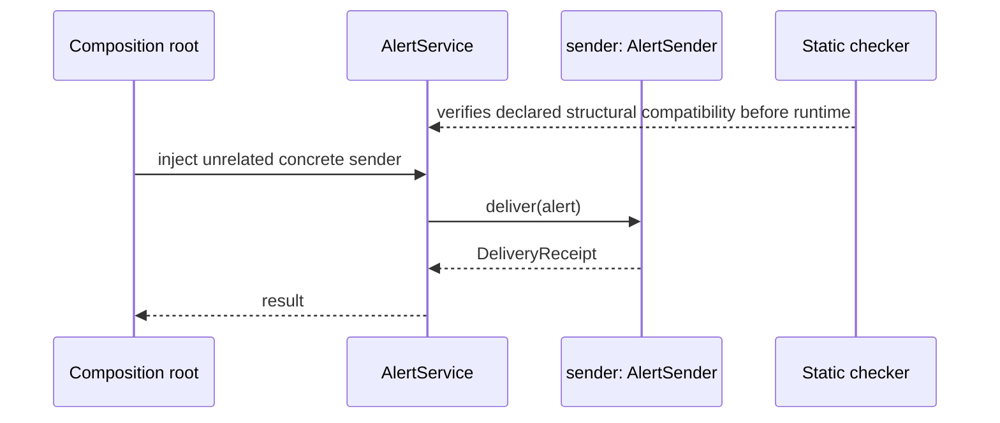
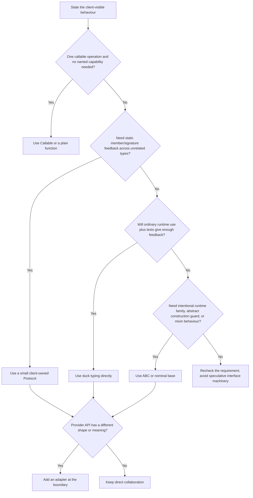

# SDP-FND-070 — Duck typing, structural typing, nominal typing, Protocols, and ABCs

## Physical Notebook Core

Keep this section short enough to reconstruct by hand. It is not a duplicate of the full note.

### Problem or change pressure

A Python client needs one small capability from several collaborators. Some implementations are
first-party, some come from unrelated libraries, and some cannot inherit our base class. We must
choose how the boundary communicates and verifies compatibility without confusing a method call,
a static type relationship, a class family, and a shallow runtime recognition test.

### One-sentence mental model

> Duck typing uses the operation now; a `Protocol` describes the required shape to a static
> checker; nominal inheritance declares family membership; an ABC can enforce abstract members on
> direct subclasses and customize runtime recognition—but none of them proves behavioural meaning.

### One essential visual

```text
                              CLIENT NEED
                   deliver(Alert) -> DeliveryReceipt
                                  │
            ┌─────────────────────┼──────────────────────┐
            │                     │                      │
            ▼                     ▼                      ▼
      RUNTIME CALL          STATIC CHECKER          DECLARED FAMILY
   channel.deliver(a)      shape/signatures fit?    base in MRO?
            │                     │                      │
       DUCK TYPING          typing.Protocol       nominal class / ABC
            │                     │                      │
            └─────────────────────┼──────────────────────┘
                                  ▼
                          OPTIONAL RUNTIME QUERY
              isinstance / ABC registry or hook / runtime Protocol
                      presence or declared recognition only

                  BEHAVIOURAL CONTRACT SURROUNDS ALL FOUR
             valid inputs • result meaning • failures • effects • history
```

### How to read this visual

Start with the client need. Read each vertical lane as a different question. The left lane asks
whether the operation actually works now. The middle lane asks what a type checker can establish
from declared member types. The right lane asks about a named relationship. The bottom lane asks
whether a runtime query recognizes the object. Finally, read the behavioural contract as the
outer boundary: no recognition mechanism alone proves those semantics.

### Key insight

Choose the mechanism for the question you actually need answered. Do not add nominal inheritance
to solve a static shape problem, and do not use `@runtime_checkable` as a substitute for calling or
validating a behavioural contract.

### Simplification or limitation

The visual separates concerns conceptually. Real code may combine them—for example, a direct ABC
subclass can also satisfy a `Protocol` structurally. It omits generic variance, overloads,
descriptors, adapters, metaclass conflicts, and checker-specific diagnostics.

### Governing rules or invariants

1. State the smallest client-visible behaviour before selecting duck typing, a `Protocol`, an ABC,
   or ordinary nominal inheritance.
2. Keep static assignability, runtime callability, runtime recognition, and behavioural
   substitutability as separate claims with separate evidence.
3. Prefer the least commitment that handles the real change pressure: a callable or ordinary duck
   typing may be enough; use a `Protocol` or ABC only when it buys a specific kind of feedback,
   ownership, enforcement, or shared implementation.

### Minimal Python example

```python
from dataclasses import dataclass
from typing import Protocol


@dataclass(frozen=True)
class Alert:
    message: str


class AlertSender(Protocol):
    def send(self, alert: Alert) -> str: ...


class EmailSender:  # no AlertSender base class
    def send(self, alert: Alert) -> str:
        return f"email:{len(alert.message)}"


def notify(sender: AlertSender, alert: Alert) -> str:
    return sender.send(alert)


reference = notify(EmailSender(), Alert("queue delayed"))
```

At runtime `notify()` simply calls `sender.send(...)`. A static checker accepts `EmailSender`
because its operation has a compatible shape. The annotation does not register the class, change
its MRO, insert a runtime check, or prove what the returned string means.

### One common misconception

**Mistake:** “`@runtime_checkable` makes a `Protocol` validate the annotated method signature at
runtime.”

**Correction:** Runtime-checkable protocols perform a deliberately shallow presence check. The
Python 3.14 documentation explicitly says that attribute types and method signatures are ignored;
an object with an incompatible same-named method can pass `isinstance()` and still fail when called
([Python 3.14 `typing.runtime_checkable`](https://docs.python.org/3.14/library/typing.html#typing.runtime_checkable)).

### Important trade-offs

- Duck typing has almost no declaration cost and supports truly dynamic objects, but static tools
  may have less information and failures can appear only on an exercised path.
- A `Protocol` gives client-shaped static structural checking without forcing inheritance, but it
  can match accidental shapes and still cannot express full business semantics.
- An ABC makes an intentional runtime family visible and can block incomplete direct subclasses,
  supply mixin behaviour, or support registration; it introduces nominal coupling and virtual
  registration is a trust statement, not implementation verification.
- One-method stateless boundaries may be clearer as `Callable[[Alert], Receipt]` or a plain
  function than as any interface class.

### Interview-revision cues

- Ask four questions: “Will the call run?”, “Will the checker accept it?”, “Is it in the declared
  family?”, and “Does it preserve the behavioural contract?”
- Say “`Protocol` is static structural subtyping,” not “runtime duck typing with enforcement.”
- Say “ABC direct inheritance can enforce abstract-member implementation at instantiation,” then
  qualify that registration and subclass hooks do not provide that same enforcement.
- Reject `@runtime_checkable` when the real requirement is signature validation or domain
  correctness.
- Prefer a callable or direct call when the boundary is tiny, local, stable, and needs no named
  capability.

## Unit metadata

| Field | Value |
|---|---|
| Domain | Design foundations |
| Curriculum | [SDP-FND-070](../../../CURRICULUM.md#sdp-fnd-070) |
| Progress | [PROGRESS.md](../../../PROGRESS.md) |
| Python references | [PYTHON_REFERENCES.md](../../../PYTHON_REFERENCES.md) — hard `PY-TYP-050` bridge |
| Learning outcome | Select duck typing, `typing.Protocol`, an abstract base class, or nominal inheritance for a concrete Python boundary. |
| Hard prerequisites | `SDP-FND-060` |
| Soft prerequisites | None |
| Priority | Core |
| Interview frequency | High |
| Production frequency | High |
| Python/backend relevance | High |
| Depth | D3 |
| Scope | Python, Typing |
| Size | L |
| Evidence profile | E+I+D+T |
| Canonical Python | Python 3.14 |
| Interview compatibility | Python 3.11 |
| Artifact state | Draft |

The frequency fields above are curriculum judgments, not measurements from a population survey.

## 1. Simple explanation

Imagine a receptionist who needs someone to deliver a message.

There are four different ways to reason about a candidate:

1. **Just ask them to deliver it.** If they can, continue. This is the runtime spirit of duck
   typing.
2. **Write down the required job shape for a checker.** Anyone whose typed operations match may be
   accepted, even without joining our class tree. This is structural typing with `Protocol`.
3. **Require an employee badge from our organization.** A candidate is accepted because it
   explicitly belongs to a named class family. This is nominal typing.
4. **Define an official role with required duties.** Direct subclasses cannot be instantiated
   until they implement the abstract duties. This is an ABC use.

These are not four levels of quality. They answer different questions.

Suppose a third-party courier already has the exact `deliver()` method your receptionist needs.
Forcing that courier to inherit your class may be impossible or unnecessary. A client-owned
`Protocol` can describe the operation without changing the courier.

Now suppose every database transaction object must participate in a framework-owned lifecycle,
inherit tested cleanup behaviour, and be recognizable by plugins at runtime. A deliberate ABC or
nominal base may communicate more than a coincidental method shape.

The senior decision is not “Protocols are Pythonic; ABCs are Java-like.” It is:

> What must be coupled, who owns the boundary, when must incompatibility be detected, and is the
> relationship about available operations or intentional identity and shared semantics?

## 2. Prerequisite bridge from SDP-FND-060

`SDP-FND-060` is the hard prerequisite. Its artifact is available, but `PROGRESS.md` does not yet
record learning evidence. Use this minimum bridge before relying on the current unit:

1. **Polymorphism:** one client interaction can work with values of different concrete forms.
2. **Dynamic dispatch:** the runtime receiver participates in choosing which implementation runs.
3. **Subtyping:** a type system permits one set of values where another is expected.
4. **Behavioural subtyping:** the replacement preserves useful client-visible promises.
5. **Mechanism is not meaning:** a successful call, inheritance relationship, or checker result
   does not prove the behavioural contract.

Quick reconstruction:

```text
client sends stable message
          │
          ▼
runtime receiver selects implementation     ← dispatch
          │
          ▼
replacement keeps client promises?          ← behavioural subtyping
```

If “same method name” still feels equivalent to “safe subtype,” revisit `SDP-FND-060` before the
contract portions of the practice lab. Continue here for the typing-mechanism comparison, but do
not count this bridge as prerequisite mastery.

## 3. Start with the change pressure

A service begins with one email sender:

```python
def notify(sender, alert):
    return sender.deliver(alert)
```

For a local script, that may be the complete correct design. The client uses one operation and
does not inspect the type.

Then the system grows:

- implementations come from independently maintained packages;
- the client is type-checked in CI;
- a test fake should work without inheriting production code;
- one provider cannot be modified;
- developers need precise signature feedback before running an incident path;
- the client needs only `deliver`, not a provider's whole public API;
- some plugin discovery code also needs an explicit runtime category;
- one family shares lifecycle code and must not instantiate incomplete direct subclasses.

Those pressures do not all imply the same mechanism.

```text
new provider request
       │
       ├─ can client simply call one stable operation? ─────── duck typing
       ├─ need pre-run member/signature feedback? ──────────── Protocol
       ├─ need declared family / shared base behaviour? ────── nominal base
       ├─ need abstract-member instantiation guard? ────────── ABC
       ├─ need runtime presence probe only? ────────────────── runtime Protocol
       └─ API shape differs? ───────────────────────────────── adapter, not wishful typing
```

### How to read this visual

Read each branch as a requirement, not as a progression. More branches can apply to one boundary,
but each added mechanism must pay for a named requirement.

### Key insight

“We have multiple implementations” is not sufficient justification for an ABC or `Protocol`.
Name the feedback, ownership, enforcement, or recognition problem first.

### Simplification or limitation

The sketch does not resolve behavioural-contract quality, generic variance, serialization, plugin
loading, or framework constraints. An adapter may be combined with any of the four mechanisms.

## 4. Historical and specification context

Python used duck typing long before optional static typing. The current Python glossary defines
duck typing as using an object's operations rather than testing its concrete type, and explicitly
notes that ABCs may complement it
([Python 3.14 glossary, “duck-typing”](https://docs.python.org/3.14/glossary.html#term-duck-typing)).

PEP 3119 introduced the ABC framework for Python 3.0. Its rationale distinguishes invocation from
inspection and presents ABC membership as a standardized runtime promise. The PEP also warns that
semantic promises remain a “friendly agreement”: language machinery cannot enforce them all
([PEP 3119, “Rationale”](https://peps.python.org/pep-3119/#rationale)).

PEP 544 introduced user-defined protocols in Python 3.8 to support structural subtyping in static
analysis. It deliberately complements rather than replaces nominal typing, and it describes
runtime protocol checks as a limited, optional feature rather than the main goal
([PEP 544, “Rationale and Goals”](https://peps.python.org/pep-0544/#rationale-and-goals),
[“Non-goals”](https://peps.python.org/pep-0544/#non-goals)).

Modern interpretation:

- **Duck typing** remains a runtime programming style.
- **Protocols** make selected duck-shaped expectations visible to static tools.
- **ABCs** remain useful for intentional runtime classification, direct-subclass enforcement, and
  reusable base behaviour.
- **Nominal classes** remain appropriate when declared identity and inherited semantics are part
  of the model.

Do not tell a history in which `Protocol` “replaced” ABCs. The accepted specification explicitly
keeps both approaches.

## 5. Precise working definitions

### Duck typing

Duck typing is a runtime style in which client code uses the required operation rather than first
requiring a particular concrete type.

```python
def close_quietly(resource) -> None:
    resource.close()
```

This code assumes `close` exists and is callable. The annotation-free function does not create a
formal static structural type. Duck typing also does not mean “catch every exception.” It means the
client is organized around usable operations rather than concrete-type identity.

### Structural typing

Structural typing decides compatibility from a type's members and their types rather than from a
declared subclass relationship. In Python's standard typing system, user-defined `Protocol`
classes are the main way to request static structural compatibility.

The typing specification says that a concrete type is assignable to a protocol when it implements
all protocol members with assignable types
([typing specification, “Assignability relationships with other types”](https://typing.python.org/en/latest/spec/protocol.html#assignability-relationships-with-other-types)).

### Nominal typing

Nominal typing decides compatibility from declared names and relationships, usually inheritance.

```python
class Sender:
    pass


class EmailSender(Sender):
    pass
```

`EmailSender` is nominally related to `Sender` because the relationship is declared. That says
nothing yet about which operation the client needs or whether the subclass keeps its meaning.

### Protocol class

A `typing.Protocol` is a special class used primarily by static type checkers to describe a set of
required members. A class can satisfy it implicitly without importing or inheriting from it.

```python
from typing import Protocol


class Flushable(Protocol):
    def flush(self) -> None: ...
```

### Abstract base class

An ABC is a class governed by `ABCMeta`, usually defined by inheriting from `abc.ABC`. Direct
subclasses that still have abstract methods cannot be instantiated. ABC machinery can also make
unrelated classes virtual subclasses through registration or `__subclasshook__`.

### Interface

In this unit, **interface** means the client-visible capabilities and behaviour, not necessarily a
class. A function signature, `Protocol`, ABC, module surface, or documented duck-typed operation
may express an interface at different levels.

### Runtime recognition

Runtime recognition asks whether a query such as `isinstance(value, SomeCategory)` returns true.
It may follow direct inheritance, an ABC registry, an ABC subclass hook, or a runtime-checkable
protocol's member-presence rules. Recognition is not equivalent to successful execution or
behavioural correctness.

## 6. Four independent lenses

Consider these classes:

```python
class Compatible:
    def send(self, message: str) -> str:
        return "ref"


class WrongSignature:
    def send(self) -> int:
        return 7
```

And this protocol:

```python
from typing import Protocol, runtime_checkable


@runtime_checkable
class SendsText(Protocol):
    def send(self, message: str) -> str: ...
```

The claims differ:

| Lens | `Compatible` | `WrongSignature` | What the result means |
|---|---|---|---|
| Actual call `obj.send("x")` | Runs | Raises `TypeError` | Exercised runtime path |
| Static assignment to `SendsText` | Accepted | Rejected | Checker-modelled member compatibility |
| `isinstance(obj, SendsText)` | `True` | `True` | Required member name is present |
| Nominal `SendsText` base in MRO | No | No | Neither explicitly inherits the protocol |
| Behavioural contract | Needs evidence | Broken for this call | Meaning is a separate judgment |

### How to read this visual

Read down one candidate column. Notice that the wrong-signature object passes the shallow runtime
protocol check while failing both the typed signature requirement and actual call.

### Key insight

A green result from one lens cannot be copied into another lens.

### Simplification or limitation

The table assumes ordinary methods and one checker configuration. Dynamic `__getattr__`, overloads,
descriptors, `Any`, untyped dependencies, or suppressed errors can change what a checker sees.

## 7. Participants and responsibilities

| Participant | Responsibility | What it must not own |
|---|---|---|
| Client | Define the smallest capability and consume its behavioural result | Every provider's unrelated API |
| Concrete collaborator | Supply the operation and preserve the contract | The client's decision about all other collaborators |
| `Protocol` | Describe client-required typed members structurally | Runtime enforcement or shared state |
| Static type checker | Compare declared/inferred member types before execution | Business truth, runtime availability, or every dynamic path |
| Nominal base | Declare family membership and optionally share behaviour | Proof that every override is behaviourally safe |
| ABC machinery | Track abstract members and customize subclass/instance recognition | Validation of virtual subclasses' implementation semantics |
| Runtime-checkable protocol | Offer an opt-in shallow member-presence query | Signature, return-type, or behavioural validation |
| Adapter | Translate an incompatible provider API into the client contract | Pretending two genuinely different semantics are identical |
| Contract tests | Exercise shared observable promises across implementations | Private algorithm or inheritance shape |
| Composition root | Select and construct collaborators | Repeating capability logic inside the client |

## 8. Collaboration and execution flow



### How to read this visual

The dashed checker arrow is analysis-time evidence. The solid arrows are runtime interactions. At
runtime the `Protocol` does not intercept the call; the client invokes the concrete object directly.

### Key insight

Static structural typing changes feedback and documentation, not ordinary Python dispatch.

### Simplification or limitation

The sequence omits failures, retries, tracing, async execution, and adapter translation. A checker
may run locally, in an IDE, or in CI rather than literally before each request.

## 9. The simplest non-interface-class design: ordinary duck typing

```python
def deliver(alert, channel):
    return channel.deliver(alert)
```

This design is often enough when:

- the function is local and obvious;
- implementations are exercised thoroughly;
- the project does not use static checking at this boundary;
- the operation is stable and tiny;
- dynamic objects or proxies are intentional;
- a named capability would add vocabulary without useful constraint.

Concrete pain appears when the incident-only provider path has a signature mismatch that unit
tests never exercise, or when callers need to understand the accepted shape without searching
every implementation.

Do not “improve” this with an `isinstance()` preflight merely to get an earlier error:

```python
def deliver(alert, channel):
    if not isinstance(channel, EmailChannel):
        raise TypeError("unsupported")
    return channel.deliver(alert)
```

That converts a capability-based client into a concrete-type gate and rejects unrelated compatible
objects.

If runtime validation is genuinely required at an untrusted boundary, validate the external data
and capability you actually need. A Python object passed by trusted application composition is a
different trust boundary from user-controlled JSON.

## 10. The Pythonic typed boundary: a client-owned Protocol

Suppose the client needs static checking and implementations live in unrelated packages:

```python
from dataclasses import dataclass
from typing import Protocol


@dataclass(frozen=True, slots=True)
class Alert:
    event_id: str
    message: str


@dataclass(frozen=True, slots=True)
class DeliveryReceipt:
    channel_code: str
    provider_reference: str


class AlertSender(Protocol):
    def deliver(self, alert: Alert) -> DeliveryReceipt: ...


def deliver_alert(alert: Alert, sender: AlertSender) -> DeliveryReceipt:
    return sender.deliver(alert)
```

Unrelated implementation:

```python
class PartnerWebhook:
    def deliver(self, alert: Alert) -> DeliveryReceipt:
        return DeliveryReceipt(
            channel_code="partner-webhook",
            provider_reference=f"webhook:{alert.event_id}",
        )
```

Why each abstraction exists:

- `AlertSender` is named because several clients and implementations share a stable typed
  capability.
- It lives near or is owned by the client because its members are the client's needs, not a dump
  of one provider's methods.
- `PartnerWebhook` does not inherit from it because inheritance is not required for structural
  assignability.
- The value objects carry result meaning; the `Protocol` signature alone cannot distinguish a
  valid receipt from a misleading string.

### Explicit conformance assertion

When an implementation is far from its use site, a static assertion can make intended conformance
visible without changing inheritance:

```python
partner: AlertSender = PartnerWebhook()
```

This assignment is for the checker and reader. It has no runtime validation effect.

## 11. When an ABC is the better tool

Use an ABC when the relationship intentionally includes nominal runtime family membership,
direct-subclass construction rules, or inherited implementation.

```python
from abc import ABC, abstractmethod


class ManagedChannel(ABC):
    def __init__(self, channel_code: str) -> None:
        if not channel_code:
            raise ValueError("channel_code is required")
        self.channel_code = channel_code

    @abstractmethod
    def deliver(self, alert: Alert) -> DeliveryReceipt:
        """Deliver one alert."""

    def metric_key(self) -> str:
        return f"alert.channel.{self.channel_code}"
```

A direct subclass that does not implement `deliver()` cannot be instantiated. A direct subclass
also inherits `metric_key()` and the constructor invariant.

Good ABC forces include:

- a framework owns a deliberate extension hierarchy;
- direct implementations should opt into one named ecosystem;
- the base supplies tested mixin algorithms based on a small primitive set;
- runtime code legitimately categorizes members of that ecosystem;
- incomplete direct subclasses should fail at construction rather than later use;
- metaclass and multiple-inheritance constraints are understood.

An ABC is not automatically justified because several classes have the same method.

## 12. Ordinary nominal inheritance without abstract methods

A normal base class can communicate shared state, identity, or default behaviour without using
`@abstractmethod`:

```python
class ProviderClient:
    def __init__(self, provider_name: str) -> None:
        self.provider_name = provider_name

    def metric_key(self) -> str:
        return f"provider.{self.provider_name}"
```

Use this when the base is a genuine reusable implementation or conceptual kind, not a workaround
for the absence of Java-style interfaces. If the client needs only one operation from unrelated
values, a `Protocol` or callable usually creates less coupling.

Nominal inheritance also affects MRO and can expose base methods through `super()`. Structural
compatibility does not change either.

## 13. Decision guide



### How to read this visual

Start at the behaviour, not at a preferred feature. Follow only requirements that exist now. The
adapter question comes after the type-mechanism choice because typing cannot translate an
incompatible API.

### Key insight

The “smallest named capability” and “intentional class family” are different design commitments.

### Simplification or limitation

This is a heuristic, not an algorithm. Public library compatibility, framework rules, security
boundaries, generated proxies, gradual migration, and checker limitations may justify a hybrid.

### Comparison matrix

| Decision dimension | Duck typing | `Protocol` | ABC | Ordinary nominal base | Callable |
|---|---|---|---|---|---|
| Main question | Can I use this operation now? | Does the typed shape fit? | Is this an intentional governed family? | Is this a declared kind/shared implementation? | Can this function-like value be invoked? |
| Implementation must inherit | No | No | Usually direct or deliberately registered | Yes | No |
| Static structural checking | Only inferred/`Any`-dependent | Yes | Generally nominal | Nominal | Yes for call signature |
| Runtime call changes | No | No | Inheritance may supply methods | Inheritance may supply methods | No |
| Blocks incomplete direct subclass instantiation | No | Only explicit abstract protocol subclass cases | Yes with abstract members | No | No |
| Can supply shared implementation | Existing object only | Only to explicit subclasses; not implicit implementers | Yes | Yes | Closure/callable object instead |
| Runtime `isinstance` | Concrete/other category only | Opt-in and shallow | Yes; direct, registry, hook | Yes | `collections.abc.Callable` is shallow |
| Works with unmodifiable unrelated type | Yes if shape fits | Yes if typed shape fits | Only via registration/hook or adapter | No without adapter | Yes if callable shape fits |
| Main risk | Late path failure, implicit contract | Accidental shape, false confidence in annotations | Nominal coupling, registry overclaim | Unnecessary hierarchy | Too little vocabulary for richer capability |

## 14. Protocol mechanics that matter

### Implicit implementation

The normal case is implicit: the concrete class does not inherit or import the protocol. Static
tools compare its members structurally.

This keeps dependency direction useful:

```text
application client ──defines──> AlertSender Protocol
provider adapter    ──happens to satisfy──> required members

No provider import of the application Protocol is required.
```

### How to read this visual

The application owns its expectation. The implementation need not point back to the client module.
The structural relationship is computed by the checker rather than declared in the provider MRO.

### Key insight

Protocols can preserve client ownership while giving static feedback.

### Simplification or limitation

An implementation package may still intentionally import a public protocol to add an explicit
conformance assertion. Circular imports and package boundaries remain separate design concerns.

### Explicit protocol subclassing

A concrete class may explicitly inherit a protocol. This documents intent and lets a checker catch
missing members nearer to the class. If protocol members are abstract, ordinary abstract-class
rules can make an explicit subclass abstract. It also introduces a nominal dependency and changes
the MRO.

The typing specification notes that implicit implementations do not receive default protocol
implementations; only explicit inheritance changes method resolution
([typing specification, “Explicitly declaring implementation”](https://typing.python.org/en/latest/spec/protocol.html#explicitly-declaring-implementation)).

### Protocols are client-shaped

Bad provider-shaped protocol:

```python
class MegaProvider(Protocol):
    def connect(self) -> None: ...
    def disconnect(self) -> None: ...
    def send_email(self, alert: Alert) -> str: ...
    def send_sms(self, alert: Alert) -> str: ...
    def list_templates(self) -> list[str]: ...
    def account_balance(self) -> int: ...
```

Better capability:

```python
class AlertSender(Protocol):
    def deliver(self, alert: Alert) -> DeliveryReceipt: ...
```

The smaller protocol reduces accidental coupling and makes test doubles simpler without creating a
new interface per concrete method.

### Protocol composition

Small capabilities may be composed:

```python
class Closable(Protocol):
    def close(self) -> None: ...


class ManagedAlertSender(AlertSender, Closable, Protocol):
    pass
```

Keep `AlertSender` small when some senders do not own resources. Require `ManagedAlertSender` only
where lifecycle is actually needed.

### Modules may satisfy protocols

The typing specification permits a module object to satisfy a protocol when its public attributes
and functions match after the method `self` adjustment
([typing specification, “Modules as implementations of protocols”](https://typing.python.org/en/latest/spec/protocol.html#modules-as-implementations-of-protocols)).

This can make a configuration module or group of module-level callbacks a typed collaborator
without wrapping it in a meaningless class.

## 15. Protocol attributes, mutability, and variance

Mutable protocol attributes can be surprisingly restrictive because the client may both read and
write them.

```python
class HasLimit(Protocol):
    limit: float


class IntegerLimit:
    limit: int = 10
```

If a function accepts `HasLimit`, it is allowed to assign `0.5`. Treating `IntegerLimit` as
compatible would then break its intended integer-only attribute. Therefore mutable protocol
attributes are not safely covariant.

When the client only reads, use a property-shaped protocol:

```python
class HasLimit(Protocol):
    @property
    def limit(self) -> float: ...
```

PEP 544 explicitly rejects covariant treatment of mutable attributes because it can allow an
unsafe write
([PEP 544, “Covariant subtyping of mutable attributes”](https://peps.python.org/pep-0544/#covariant-subtyping-of-mutable-attributes)).

Design lesson: express whether the client reads, writes, or calls. Do not copy an implementation's
public field into a protocol without deciding that ownership.

## 16. Generic Protocols and the Python 3.11 overlay

Canonical Python 3.14 syntax can infer variance for type parameters:

```python
from typing import Protocol


class Producer[T](Protocol):
    def produce(self) -> T: ...
```

For Python 3.11 interview compatibility, use `TypeVar` and the older generic protocol form:

```python
from typing import Protocol, TypeVar

T_co = TypeVar("T_co", covariant=True)


class Producer(Protocol[T_co]):
    def produce(self) -> T_co: ...
```

The Python 3.14 `typing` documentation explicitly gives the `Protocol[T]` form for Python 3.11 or
older compatibility
([Python 3.14 `typing.Protocol`](https://docs.python.org/3.14/library/typing.html#typing.Protocol)).

Variance is about safe assignability of parameterized types. It does not prove domain behaviour.
`SDP-SOL-030` and the mapped optional generic references deepen those rules later.

## 17. `@runtime_checkable`: exact promise and traps

Without `@runtime_checkable`, using a user-defined protocol as the second argument to
`isinstance()` or `issubclass()` raises `TypeError`.

With it:

```python
from typing import Protocol, runtime_checkable


@runtime_checkable
class Closable(Protocol):
    def close(self) -> None: ...
```

`isinstance(value, Closable)` checks for the required member's presence. It does not compare the
signature or annotation types. The standard-library documentation also warns that runtime
protocol checks can be slower than ordinary nominal `isinstance()` checks
([Python 3.14 `typing.runtime_checkable`](https://docs.python.org/3.14/library/typing.html#typing.runtime_checkable)).

### Runtime recognition flow

```text
isinstance(candidate, RuntimeProtocol)
                  │
                  ▼
     are frozen required names present?
           ┌──────┴──────┐
           │             │
          no            yes
           │             │
        False        True from query
                         │
                         ├─ signature checked? ── no
                         ├─ return type checked? ─ no
                         ├─ behaviour checked? ─── no
                         └─ actual call made? ──── no
```

### How to read this visual

Follow the query to its narrow result. The four “no” branches state what must not be inferred from
`True`.

### Key insight

Runtime protocols are capability-presence probes, not runtime type validators.

### Simplification or limitation

The exact lookup implementation changed in Python 3.12, and descriptors or dynamic attribute
provision can make presence surprising. The visual does not reproduce internal cache mechanics.

### Python 3.12+ change

Since Python 3.12, runtime protocol checks use `inspect.getattr_static()` rather than `hasattr()`,
and protocol members are frozen for runtime checks once the protocol class is created. Therefore a
dynamic `__getattr__` object can successfully produce an operation when called yet fail the
runtime protocol query. Python 3.11 may recognize that same dynamic member through the older
lookup. This is documented version-dependent standard-library behaviour
([Python 3.14 `typing.runtime_checkable`, changes in 3.12](https://docs.python.org/3.14/library/typing.html#typing.runtime_checkable)).

### Data protocols

PEP 544 permits `isinstance()` for runtime-checkable data and non-data protocols, but permits
`issubclass()` only for non-data protocols because instance attributes may be created in
`__init__` and be unavailable on the class object
([PEP 544, runtime-checkable protocols](https://peps.python.org/pep-0544/#runtime-checkable-decorator-and-narrowing-types-by-isinstance)).

### Appropriate use

Use a runtime protocol check only when a shallow optional-capability branch is meaningful:

```python
if isinstance(resource, Closable):
    resource.close()
```

Even here, a direct operation with a focused `try`/`except AttributeError` may be clearer depending
on the boundary. Do not broadly catch exceptions from `close()`; an exception raised inside the
method is different from absence of the method.

## 18. ABC mechanics: direct, virtual, and structural recognition

### Direct inheritance

```text
ConcreteChannel ──inherits──> ChannelABC ──inherits──> ABC
       │                           │
       ├─ ABC in MRO               ├─ abstract member set
       ├─ base methods inherited   └─ ABCMeta controls instantiation
       └─ incomplete? cannot instantiate
```

This is the strongest built-in connection shown here: the class declares the relationship, gets
base behaviour, and participates in abstract-member construction rules.

### Virtual registration

```python
ChannelABC.register(ThirdPartyChannel)
```

After registration, `issubclass(ThirdPartyChannel, ChannelABC)` and corresponding `isinstance()`
checks may return true. But `ChannelABC` is not inserted into `ThirdPartyChannel.__mro__`, and its
methods are not inherited or available through `super()`
([Python 3.14 `abc.ABCMeta.register`](https://docs.python.org/3.14/library/abc.html#abc.ABCMeta.register)).

Registration also does not verify that the class implemented every abstract method. It is an
authoritative declaration by the registering code. Registering an incomplete class can make
`isinstance()` true while the required call still raises `AttributeError`.

Use registration when an authoritative owner has verified a stable external type and runtime
category membership matters. Avoid registering arbitrary third-party classes globally merely to
silence a type or runtime check.

### `__subclasshook__`

An ABC may customize subclass recognition:

```python
class ClosableABC(ABC):
    @classmethod
    def __subclasshook__(cls, candidate: type[object]) -> bool | NotImplemented:
        if cls is ClosableABC and any("close" in base.__dict__ for base in candidate.__mro__):
            return True
        return NotImplemented
```

The hook participates in `issubclass()` and should return `True`, `False`, or `NotImplemented`.
It can be useful for a stable simple runtime protocol, but reproducing structural matching poorly
creates false positives. The `abc` documentation specifies this hook contract
([Python 3.14 `abc.ABCMeta.__subclasshook__`](https://docs.python.org/3.14/library/abc.html#abc.ABCMeta.__subclasshook__)).

The standard `collections.abc` classes use hooks for some simple “one-trick” interfaces. The
documentation warns that complex interfaces involve semantics and relationships that cannot be
inferred from method-name presence alone
([Python 3.14 `collections.abc`](https://docs.python.org/3.14/library/collections.abc.html)).

### Direct versus virtual ABC summary

| Property | Direct subclass | Registered virtual subclass | Hook-recognized subclass |
|---|---|---|---|
| ABC in MRO | Yes | No | No unless independently inherited |
| Inherits concrete ABC methods | Yes | No | No unless independently inherited |
| Abstract-member instantiation guard | Yes | No | No |
| `isinstance` / `issubclass` recognition | Yes | Yes | According to hook |
| Static nominal relationship | Usually yes | Checker-dependent; registration is runtime | Checker-dependent |
| Behaviour proven | No | No | No |

## 19. Protocol versus ABC is not “static versus runtime” only

That slogan is too shallow.

- Protocols are primarily structural tools for static analysis, but may opt into limited runtime
  queries and may be explicitly inherited.
- ABCs are nominal/runtime tools, but type checkers understand direct ABC inheritance, and some
  `collections.abc` types have structural recognition behaviour.
- Both are Python classes at runtime.
- Both can be overused.
- Neither proves behavioural semantics.

A better comparison uses design forces:

| Force | Usually prefer |
|---|---|
| Client needs a tiny typed shape from unrelated implementations | `Protocol` |
| Test fake should not inherit production machinery | `Protocol` or duck typing |
| One callable with no richer capability | `Callable` |
| Framework owns a deliberate plugin family | ABC or nominal base |
| Direct subclasses must implement primitives before construction | ABC |
| Base supplies useful mixin algorithms or lifecycle | ABC or nominal base |
| Runtime code needs a stable official category | ABC; sometimes runtime protocol for a shallow capability |
| Object is truly dynamic and checker modelling costs more than it saves | Duck typing plus tests |
| External API differs in name, arguments, results, or failure meaning | Adapter, then type the adapter boundary |

## 20. Static checking is analysis, not execution

```python
sender: AlertSender = PartnerWebhook()
receipt = sender.deliver(alert)
```

A checker reasons about the assignment and call from available type information. Python's runtime
does not invoke the checker, consult the annotation to dispatch, or validate the result.

Sources of false confidence include:

- an untyped dependency becoming `Any`;
- `# type: ignore` suppressing the exact boundary error;
- an inaccurate stub;
- a method returning a valid annotated type with wrong business meaning;
- code paths not covered by analysis configuration;
- a runtime monkey patch after checking;
- an object using dynamic attribute generation the checker cannot model precisely.

Treat a successful checker run as one evidence layer. Pair it with behavioural tests and
integration tests at real provider adapters.

## 21. Before, pain, refactoring, and the smallest stable seam

### Before: nominal gate

```python
def deliver_alert(alert: Alert, channel: AlertChannel) -> DeliveryReceipt:
    if not isinstance(channel, AlertChannel):
        raise TypeError("unsupported alert channel")
    return channel.deliver(alert)
```

Concrete pain: `PartnerWebhookChannel` has the exact correct operation but cannot or should not
inherit from the application class. Direct use works; the client gate rejects it.

### First refactoring: remove the redundant gate

If the project is intentionally untyped at this boundary:

```python
def deliver_alert(alert, channel):
    return channel.deliver(alert)
```

This may be the correct endpoint.

### Typed refactoring: introduce the client shape

```python
class AlertSender(Protocol):
    def deliver(self, alert: Alert) -> DeliveryReceipt: ...


def deliver_alert(alert: Alert, channel: AlertSender) -> DeliveryReceipt:
    return channel.deliver(alert)
```

The runtime body is unchanged. The new seam improves static feedback and communicates the client
requirement.

### Do not fake compatibility

`LegacyPager.push(text, priority)` does not satisfy `deliver(Alert) -> DeliveryReceipt` merely
because both send messages. Translate it:

```python
class PagerAdapter:
    def __init__(self, pager: LegacyPager) -> None:
        self._pager = pager

    def deliver(self, alert: Alert) -> DeliveryReceipt:
        priority = {"info": 3, "warning": 2, "critical": 1}[alert.severity]
        reference = self._pager.push(alert.message, priority)
        return DeliveryReceipt("pager", True, reference)
```

The adapter owns differences in name, arguments, and result shape. It must also translate failure
meaning deliberately; the sketch omits provider exceptions.

### Safe refactoring path

1. Characterize stable observable behaviour.
2. Write the client contract: valid inputs, results, normal non-delivery, exceptional failure,
   mutation, ordering, and side effects.
3. Add a test using one unrelated but compatible implementation.
4. Remove the nominal preflight gate without changing result semantics.
5. Decide whether runtime duck typing already meets the feedback need.
6. If static feedback is required, add the smallest client-owned `Protocol`.
7. Run the checker and behavioural contract suite.
8. Adapt genuinely incompatible providers rather than widening the protocol incorrectly.
9. Retain an ABC only where its remaining nominal or implementation benefits are concrete.
10. Remove speculative registration, runtime checks, factories, or interface layers.

## 22. Realistic backend use case

An alerting application coordinates domain policy while provider packages handle delivery.

```text
HTTP/job/event entry point
          │ validated Alert
          ▼
AlertService ──policy──> choose configured senders
          │
          ├── AlertSender Protocol ──> Email adapter ──> email SDK
          ├── AlertSender Protocol ──> SMS adapter ────> SMS SDK
          └── AlertSender Protocol ──> Pager adapter ──> legacy pager
                         │
                         ▼
                   DeliveryReceipt
```

### How to read this visual

Read top to bottom for request flow and left to right for provider variation. The application
depends on its own `AlertSender` capability. Each adapter translates a provider API at the edge.

### Key insight

The protocol shapes the application boundary; adapters contain provider-specific incompatibility.

### Simplification or limitation

The visual omits transactions, queues, retries, idempotency, timeouts, provider authentication,
and delivery-status callbacks. A production contract must define those separately.

Why not make SDK classes inherit `AlertSender`?

- the application may not own them;
- inheritance can couple the provider package back to application policy;
- SDK methods often have different error and result semantics;
- an adapter is the correct place for translation and observability context.

## 23. Failure scenarios

### Failure 1: runtime protocol says true, call fails

An object has `deliver` with the wrong signature. `isinstance(obj, RuntimeAlertSender)` returns true
because only presence is checked. The client call raises `TypeError`.

Detection: static checker and an actual contract test.

Containment: do not use runtime protocol recognition as admission to an untrusted plugin system.
Validate plugin metadata and exercise a defined adapter/contract boundary.

### Failure 2: virtual ABC registration overclaims

Code registers an external class that lacks one required operation. Runtime category checks pass,
but no abstract-member instantiation guard ran because the class was not a direct subclass.

Detection: inspect MRO/registration policy and run the operation contract.

Containment: centralize registration under an authoritative integration module, or use an adapter
that directly inherits and is testable.

### Failure 3: protocol grows into a provider mirror

Every new caller adds methods to one broad protocol. Implementations and fakes must now supply
unrelated capabilities; structural matching becomes accidental and noisy.

Detection: clients use small subsets and test doubles contain meaningless methods.

Containment: split by client capability, not by provider class.

### Failure 4: checker accepts wrong business meaning

Two senders both return `DeliveryReceipt`, but one marks timeout as normal non-delivery. The
signature is compatible; operational recovery is wrong.

Detection: contract tests for failure categories and integration tests around adapter translation.

Containment: model normal business outcomes separately from infrastructure failures and preserve
exception context.

### Failure 5: `Any` dissolves the boundary

An untyped vendor SDK or broad annotation makes member checks disappear. CI remains green.

Detection: strict checker configuration, reveal/checker diagnostics during development, typed
adapter boundary, and stub quality review.

Containment: confine `Any` at the adapter and return application-owned typed values.

## 24. Testing strategy

| Test type | What it proves | What not to overspecify |
|---|---|---|
| Unit | Client calls the capability and handles result/failure meaning | Whether implementation inherits a particular base |
| Contract | Every advertised sender accepts valid alerts and returns coherent receipts | Provider algorithm or private helper layout |
| Static analysis | Unrelated compatible types are accepted and incompatible signatures rejected | Runtime availability or business semantics |
| Runtime experiment | Exact `isinstance`, MRO, call, and exception observations | Universal performance or all Python versions |
| Integration | Adapter translates real or controlled provider results and failures correctly | Unrelated application framework behaviour |

### Shared behavioural contract

A useful contract suite checks each implementation against the same client-visible promises:

- accepts every valid `Alert` the boundary promises;
- returns exactly one coherent `DeliveryReceipt`;
- does not mutate the immutable input;
- distinguishes normal policy suppression from provider failure;
- preserves channel identity and provider reference meaning;
- documents external side effects and idempotency expectations;
- does not require the test to assert `isinstance(sender, SomeBase)` unless runtime family identity
  is itself a requirement.

### Static assertion tests

Keep representative assignments or calls in checked source:

```python
sender: AlertSender = PartnerWebhookChannel()
```

For deliberate negative checker cases, use a controlled isolated experiment rather than leaving
the repository's normal mypy run failing.

## 25. Observability and debugging

Log or trace stable semantic fields:

- `channel_code`;
- alert/event identifier;
- operation name;
- delivery outcome category;
- provider reference when safe;
- translated failure category;
- duration measured at the adapter boundary when operationally relevant.

Do not log `type(sender).__name__` as the only identity. Proxies, wrappers, and test doubles make
concrete names unstable. A stable semantic `channel_code` is more useful.

When debugging a mismatch, ask in this order:

1. Did static analysis run on this path without `Any` or suppression?
2. What is the receiver's runtime type and MRO?
3. Which attribute is actually present, and where did it come from?
4. Was runtime recognition direct, registered, hooked, or protocol-based?
5. Did the actual call shape match?
6. Did the returned behaviour preserve the documented contract?

Useful diagnostic probes in a controlled environment:

```python
print(type(sender))
print(type(sender).__mro__)
print(hasattr(sender, "deliver"))
print(isinstance(sender, RuntimeAlertSender))
```

These are observations, not a production validation strategy.

## 26. Concurrency and state safety

`Protocol` and ABC choice does not make an implementation thread-safe, async-safe, reentrant, or
stateless. If the boundary permits concurrent calls, the behavioural contract must state ownership
and ordering.

Examples of missing promises:

- may the same sender instance serve concurrent requests?
- is connection state internally serialized?
- may callbacks occur after `close()`?
- are retries idempotent?
- does an async sender require `async def deliver(...)` as a separate capability?

Do not make one protocol accept both sync and async returns through a vague union unless clients
really handle both. Separate capabilities often produce clearer execution:

```python
class AsyncAlertSender(Protocol):
    async def deliver(self, alert: Alert) -> DeliveryReceipt: ...
```

Runtime member shape cannot reveal these semantic guarantees.

## 27. Performance and memory

Ordinary protocol annotations do not wrap calls or add per-call dispatch overhead. The runtime
body still performs ordinary attribute lookup and call.

`isinstance()` against a runtime-checkable protocol does extra structural presence work; the
Python docs warn it can be surprisingly slow compared with nominal `isinstance()`. That is a
reason not to put speculative runtime protocol checks on every hot-path call. No benchmark is
claimed here.

ABCs add class-creation and recognition machinery; direct inherited calls still follow normal
Python method lookup. Mixin defaults can have algorithmic costs independent of ABC machinery—for
example, `collections.abc` documents cases where mixins repeatedly call a primitive method and may
become quadratic for a linked structure
([Python 3.14 `collections.abc`, implementation note](https://docs.python.org/3.14/library/collections.abc.html)).

Measure the actual workload before optimizing. The design choice is normally dominated by
coupling and feedback quality, not microseconds of class recognition.

## 28. Controlled experiments in this unit

The [practice guide](practice/README.md) contains three completed observation experiments and one
unsolved refactoring lab.

### Experiment A — runtime Protocol presence versus actual call

Question: can an incompatible same-named method pass a runtime protocol check, and can a dynamic
attribute work when called but fail the Python 3.12+ static-lookup-based protocol query?

Observed on CPython 3.14.7:

```text
compatible_call=ok:5
compatible_runtime_protocol=True
wrong_runtime_protocol=True
wrong_actual_call=TypeError
dynamic_hasattr=True
dynamic_call=dynamic:5
dynamic_runtime_protocol=False
```

Conclusion: actual callability and runtime protocol recognition are separate observations.

### Experiment B — direct and registered ABC relationships

Question: does virtual registration add the ABC to the MRO, provide its concrete method, or enforce
its abstract operation?

Observed:

```text
nominal_isinstance=True
nominal_in_mro=True
nominal_default=sends-text
registered_isinstance=True
registered_in_mro=False
registered_has_default=False
registered_call=registered:5
incomplete_isinstance=True
incomplete_actual_call=AttributeError
```

Conclusion: registration changes recognition, not inheritance or abstract implementation checks.

### Experiment C — static structural compatibility

Question: will mypy accept an unrelated compatible implementation and reject a wrong signature?

Observed with mypy 1.20.2:

```text
compatible: returncode=0 errors=0 codes=-
wrong_signature: returncode=1 errors=1 codes=arg-type
```

Conclusion: the static relation checks typed members without requiring inheritance.

These experiments prove only their bounded mechanics under the recorded environment. They do not
prove behavioural substitution or performance.

## 29. Simpler alternatives and overengineered misuse

### Plain function

```python
def deliver_email(alert: Alert) -> DeliveryReceipt:
    ...
```

Prefer this when there is one stable implementation and no injection/variation pressure.

### Callable

```python
from collections.abc import Callable

AlertSender = Callable[[Alert], DeliveryReceipt]
```

Prefer this when the entire collaborator is one call and a method name or other members add no
useful vocabulary. Use a callback `Protocol` only when keyword parameters, overloads, attributes,
or richer callable structure matter.

### Module

A small module with `deliver()` can be a structural collaborator and may avoid a stateless class.

### Adapter

Use when shape or semantics differ. An annotation cannot rename `push`, create a `DeliveryReceipt`,
or translate provider failure meaning.

### Overengineered misuse

```text
AlertSenderProtocol
        ▲
AbstractAlertSender
        ▲
BaseAlertSender
        ▲
DefaultAlertSender
        ▲
EmailAlertSender
```

If each layer has no distinct contract, default behaviour, or ownership boundary, the hierarchy
only multiplies navigation and MRO commitments. Keep the one seam that addresses actual change.

## 30. Related units and boundaries

| Related unit | Relationship | Key difference |
|---|---|---|
| [`SDP-FND-040`](../../../CURRICULUM.md#sdp-fnd-040) | Foundation | Defines abstraction and behavioural contracts; this unit compares Python mechanisms for expressing a boundary. |
| [`SDP-FND-050`](../../../CURRICULUM.md#sdp-fnd-050) | Foundation | Chooses composition/delegation/inheritance; this unit distinguishes nominal inheritance from structural compatibility. |
| [`SDP-FND-060`](../../../CURRICULUM.md#sdp-fnd-060) | Hard prerequisite | Establishes dispatch and behavioural subtyping; this unit separates ways a candidate is recognized. |
| [`SDP-FND-080`](../../../CURRICULUM.md#sdp-fnd-080) | Next foundation | Uses these boundaries as dependency seams and test-double targets. |
| [`SDP-PYT-070`](../../../CURRICULUM.md#sdp-pyt-070) | Applied deepening | Practices interface design choices in broader Python production scenarios. |
| [`SDP-SOL-030`](../../../CURRICULUM.md#sdp-sol-030) | Contract deepening | Evaluates behavioural substitutability beyond structural or nominal membership. |
| [`SDP-SOL-040`](../../../CURRICULUM.md#sdp-sol-040) | Client-shape principle | Keeps capabilities small without multiplying empty nominal interfaces. |
| [`SDP-SOL-050`](../../../CURRICULUM.md#sdp-sol-050) | Dependency direction | Places policy-owned abstractions so source dependencies point toward stable policy. |
| [`SDP-STR-010`](../../../CURRICULUM.md#sdp-str-010) | Adapter | Translates incompatible operations or semantics; typing alone cannot. |

Do not absorb the full content of those later units here. The current outcome is mechanism
selection for one concrete Python boundary.

## 31. When to use each mechanism

### Use ordinary duck typing when

- the operation is local and exercised;
- static precision would add little value;
- dynamic behaviour is intentional;
- the contract is obvious and a named capability would be ceremony.

### Use `Protocol` when

- clients need static feedback about a small member set;
- implementations are unrelated, external, or test-specific;
- the client should own the required shape;
- inheritance would create the wrong dependency;
- a structural public boundary is intentional and documented.

### Use an ABC when

- the framework or library owns a named extension family;
- direct subclasses must implement abstract primitives before instantiation;
- useful base/mixin behaviour exists;
- runtime family recognition is legitimate;
- virtual registration is centrally governed and contract-tested.

### Use ordinary nominal inheritance when

- “is a kind of” includes state, invariants, lifecycle, or shared implementation;
- identity and declared membership matter more than incidental member shape;
- the hierarchy remains substitutable and MRO cost is justified.

## 32. When not to use them

- Do not create a protocol for a single private helper whose concrete type is stable.
- Do not create an ABC only to hold one `raise NotImplementedError` method.
- Do not use `@runtime_checkable` to validate signatures, payloads, or provider behaviour.
- Do not register third-party types globally without owning the compatibility decision.
- Do not force an external class into nominal inheritance when a small protocol or adapter preserves
  dependency direction.
- Do not use a protocol to pretend incompatible return or failure semantics are compatible.
- Do not add both a `Protocol` and ABC unless their structural and nominal roles are separately
  required.
- Do not catch broad exceptions and call the result “duck typing.”

## 33. Common misuse and better moves

| Misuse | Why it happens | Better move |
|---|---|---|
| “If it has the method name, it is safe” | Surface shape is mistaken for behaviour | Write contract dimensions and shared behavioural tests |
| Provider-shaped mega-protocol | Interface is copied from one implementation | Define the minimum client capability |
| `@runtime_checkable` on every protocol | Runtime validation is assumed free and complete | Keep protocols static unless a shallow optional-capability query is needed |
| ABC with only `raise NotImplementedError` | Java interface habits are translated mechanically | Use `Protocol`, callable, or direct duck typing |
| Virtual-register everything compatible-looking | Need to make `isinstance` green | Use direct operation or an adapter; register only authoritative categories |
| Explicitly subclass every protocol | Desire to announce intent | Use a checked conformance assignment when nominal dependency is unwanted |
| Catch all exceptions around a duck-typed call | Attribute absence and implementation failure are conflated | Catch only the specific boundary failure you can handle |
| Use `hasattr` then immediately call | TOCTOU/dynamic behaviour and duplicate lookup are ignored | Call directly or use a precise optional-capability branch |
| Add protocol plus ABC plus base class | More layers feel safer | Keep only mechanisms tied to distinct requirements |
| Rely on mypy as behavioural proof | Signature evidence is overinterpreted | Add contract and integration tests |

## 34. Interview preparation

### Common formulations

1. What is the difference between duck typing and structural typing in Python?
2. When would you choose `Protocol` over an ABC?
3. Does a class have to inherit from a protocol to satisfy it?
4. What does `@runtime_checkable` really check?
5. What is the difference between ABC inheritance and virtual registration?
6. Can an ABC or protocol prove Liskov substitutability?
7. Why might a callable be simpler than a one-method protocol?
8. How do Python 3.11 and 3.14 generic protocol syntax differ?

### Strong 90-second answer

> Duck typing is the runtime style of using an object's supported operation instead of testing its
> concrete type. Structural typing is a static compatibility rule based on members and their
> types; Python expresses user-defined structural boundaries with `typing.Protocol`. Nominal
> typing uses declared class relationships. An ABC is useful when I need an intentional family,
> abstract-member construction checks for direct subclasses, inherited mixin behaviour, or runtime
> categorization. I prefer a small client-owned `Protocol` when unrelated implementations and test
> doubles need static checking without inheritance. `@runtime_checkable` only checks member
> presence, not signatures or behaviour. ABC registration similarly changes recognition without
> adding the ABC to the MRO or enforcing its abstract methods. In all cases I still need a
> behavioural contract and tests.

### Weak-answer traps

- “Duck typing and structural typing are exactly the same.”
- “Protocols enforce types at runtime.”
- “ABCs are obsolete.”
- “`isinstance(x, RuntimeProtocol)` proves the signature.”
- “Registering a virtual subclass gives it the ABC's methods.”
- “If mypy passes, LSP is satisfied.”
- “Protocols are always more Pythonic.”

### Likely follow-ups

1. Show an incompatible method that passes a runtime protocol check.
2. Explain what happens to MRO after `ABC.register()`.
3. Describe a boundary where ABC is better than `Protocol`.
4. Explain mutable protocol attribute invariance.
5. Refactor a concrete `isinstance` gate for an unrelated third-party implementation.
6. Decide whether a one-method capability should be a callable.
7. Explain the Python 3.12 runtime-protocol lookup change.

### Reasoning checkpoints

A strong answer identifies:

- the client and its smallest operation;
- runtime use versus static analysis;
- structural versus nominal membership;
- direct versus virtual ABC behaviour;
- the shallow scope of runtime protocol checks;
- behavioural-contract evidence;
- simpler callable/direct alternatives;
- a concrete case where the rejected option is still valid elsewhere.

## 35. Closed-book revision cues

1. Draw the four-lane essential visual from memory.
2. Define duck typing, structural typing, nominal typing, `Protocol`, and ABC in one sentence each.
3. Explain why wrong-signature objects can pass runtime protocol recognition.
4. State what ABC registration changes and what it does not change.
5. Choose a mechanism for an unrelated provider implementation and defend the choice.
6. Choose an ABC for a framework-owned family and defend the choice.
7. Replace one-method interface machinery with a callable.
8. Explain why behaviour still needs contract tests.
9. Give the Python 3.11 generic protocol syntax.
10. Name one adapter need that typing cannot solve.

## 36. Vocabulary and professional English

### Structural

| Item | Content |
|---|---|
| Pronunciation | STRUK-chuh-rul |
| Simple English meaning | Based on the parts or shape something has |
| Hindi cue | संरचना-आधारित |
| Meaning in this design context | Compatibility follows required members and their types rather than a declared class name |

Natural examples:

1. The bridge needs a structural inspection.
2. The two reports have a similar structural outline.
3. This is a structural change, not a wording change.
4. **Interview:** “The implementation is a structural subtype because its members match the protocol.”
5. **Engineering discussion:** “Let the client own a small structural boundary instead of forcing provider inheritance.”

### Nominal

| Item | Content |
|---|---|
| Pronunciation | NOM-uh-nuhl |
| Simple English meaning | Based on a name or declared category |
| Hindi cue | नाम-आधारित |
| Meaning in this design context | Compatibility follows an explicitly declared type relationship |

Natural examples:

1. The fee is nominal.
2. She is the nominal leader of the group.
3. The categories have nominal labels.
4. **Interview:** “ABC inheritance creates a nominal relationship visible in the MRO.”
5. **Engineering discussion:** “Do we need nominal plugin identity, or only this callable capability?”

### Conformance

| Item | Content |
|---|---|
| Pronunciation | kuhn-FOR-muhns |
| Simple English meaning | Matching an agreed rule or standard |
| Hindi cue | अनुरूपता |
| Meaning in this design context | An implementation satisfies the typed and behavioural expectations of a boundary |

Natural examples:

1. The audit checks conformance with the standard.
2. This component passed the conformance suite.
3. Conformance requires more than a similar name.
4. **Interview:** “A static assignment can make intended protocol conformance visible.”
5. **Engineering discussion:** “Run the same behavioural conformance tests against every adapter.”

### Incidental

| Item | Content |
|---|---|
| Pronunciation | in-suh-DEN-tuhl |
| Simple English meaning | Present by chance or not central to the purpose |
| Hindi cue | आकस्मिक / गौण |
| Meaning in this design context | A matching member shape that was not intended as the same semantic capability |

Natural examples:

1. The travel cost was incidental to the main project.
2. Their similar names are incidental.
3. Remove incidental details from the explanation.
4. **Interview:** “Structural typing can match an incidental shape, so semantics still need review.”
5. **Engineering discussion:** “This method-name overlap is incidental; add an adapter instead of widening the protocol.”

## 37. Python Mastery reference

Hard mapped reference:

- [PY-TYP-050 — Protocols, ABCs, and structural versus nominal typing](https://github.com/rahulyadev/python-mastery/blob/main/CURRICULUM.md#py-typ-050)

Minimum bridge supplied here:

1. Runtime duck typing uses operations without requiring a concrete class test.
2. `Protocol` asks a static checker to compare typed members structurally.
3. Direct ABC subclasses participate in abstract-member instantiation rules and inheritance.
4. ABC registration changes runtime recognition without changing MRO or supplying methods.
5. `@runtime_checkable` checks member presence rather than typed signatures.

This bridge is enough to work through the unit. It does not replace the Python Mastery unit's
broader typing practice.

## 38. Practice and evidence

Open [Practice — SDP-FND-070](practice/README.md).

The unit's evidence profile is `E+I+D+T`:

- **E — explanation:** distinguish all mechanisms and their evidence.
- **I — implementation:** refactor the alert boundary without forcing provider inheritance.
- **D — diagram:** reconstruct preflight, structural analysis, and runtime call flows.
- **T — tests:** run characterization, static negative/positive, behavioural contract, and edge
  cases.

The distributed starter and completed mechanics experiments are verified artifacts. They are not
Rahul's attempt and do not advance the learning state.

## 39. Authoritative sources

Sources actually read for this unit:

1. Python Software Foundation, [Python 3.14 glossary, “duck-typing” and “EAFP”](https://docs.python.org/3.14/glossary.html#term-duck-typing) — runtime operation-oriented style and relationship to ABCs.
2. Python Software Foundation, [Python 3.14 `typing.Protocol`](https://docs.python.org/3.14/library/typing.html#typing.Protocol) — user-defined protocol purpose, implicit structural example, runtime-checkability requirement, and Python 3.11 generic form.
3. Python Software Foundation, [Python 3.14 `typing.runtime_checkable`](https://docs.python.org/3.14/library/typing.html#typing.runtime_checkable) — shallow presence checks, performance warning, and Python 3.12 lookup/member-freezing changes.
4. Python Typing Council, [typing specification, “Protocols”](https://typing.python.org/en/latest/spec/protocol.html) — protocol members, explicit/implicit implementation, composition, generics, modules, assignability, and runtime narrowing rules.
5. Ivan Levkivskyi, Jukka Lehtosalo, and Łukasz Langa, [PEP 544 — Protocols: Structural subtyping](https://peps.python.org/pep-0544/) — rationale, non-goals, static structural semantics, runtime limitations, and mutable attributes.
6. Python Software Foundation, [Python 3.14 `abc` — Abstract Base Classes](https://docs.python.org/3.14/library/abc.html) — `ABC`, `ABCMeta`, direct subclassing, virtual registration, `__subclasshook__`, and `abstractmethod` behaviour.
7. Guido van Rossum and Talin, [PEP 3119 — Introducing Abstract Base Classes](https://peps.python.org/pep-3119/) — invocation/inspection rationale and semantic limits of ABC promises.
8. Python Software Foundation, [Python 3.14 `collections.abc`](https://docs.python.org/3.14/library/collections.abc.html) — direct, registered, and simple structural recognition; mixin surfaces and limitations.
9. Mypy contributors, [mypy documentation, “Protocols and structural subtyping”](https://mypy.readthedocs.io/en/stable/protocols.html) — checker-specific examples and explicit conformance guidance for the controlled mypy experiment.
