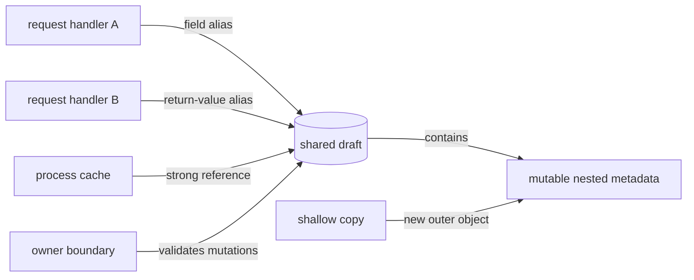

# SDP-FND-090 — Mutability, shared state, ownership, and object lifetime

## Physical Notebook Core

Keep this section short enough to reconstruct by hand. It is not a duplicate of the full note.

### Problem or change pressure

Two parts of a backend hold references to the same mutable object. One part changes it, the other
observes a surprising value, and neither clearly owns validation, synchronization, cleanup, or the
object's lifetime. Copying everything wastes work and may still share nested objects; making
everything global or immutable creates different problems. The design must make mutation
authority, observation, scope, and release explicit.

### One-sentence mental model

> Draw the object graph, name one mutation owner, define what borrowers receive, and choose a
> lifetime that matches the state—not merely the code that happens to construct it.

### One essential visual

```text
                           one mutable object
                        ┌─────────────────────┐
request A name ─alias──>│ state + invariants  │<──alias── request B name
                        └──────────┬──────────┘
                                   │
                        MUTATION OWNER / GATE
                       validates • serializes • logs
                                   │
             ┌─────────────────────┼─────────────────────┐
             ▼                     ▼                     ▼
       live read-only API    immutable snapshot    explicit command
       sees later changes    fixed observation     asks owner to change

root/reference appears ─────────── object can remain reachable
last owning reference disappears ─ object becomes eligible for collection
explicit close/with ─────────────── external resource lifetime ends
```

### How to read this visual

Start with the center object. The two top arrows are aliases: different names reach the same
mutable state. Move downward to the owner, which is a design responsibility rather than a Python
keyword. It decides how clients observe or request changes. Read the bottom three lines separately:
Python reachability affects object lifetime, while `close()` or `with` should control scarce
external resources.

### Key insight

Mutability is manageable when authority and lifetime are narrow and visible. The dangerous
combination is mutable state plus multiple aliases plus unclear rules about who may change it and
how long it survives.

### Simplification or limitation

The diagram is conceptual, not a literal memory layout or garbage-collector algorithm. A real
system may have multiple legitimate writers coordinated by a lock, transaction, queue, actor, or
database constraint. A tuple can still refer to mutable elements, and an in-process owner cannot
provide cross-process atomicity.

### Governing rules or invariants

1. For every shared mutable object, name who creates it, who may mutate it, who may observe it, and
   who ends its logical or resource lifetime.
2. Never call a value a snapshot until its required depth is detached from later owner mutation;
   copying only the outer container may preserve nested aliases.
3. Protect a whole business transition, not isolated reads or writes, and place protection at the
   scope where all competing writers meet.

### Minimal Python example

```python
from dataclasses import dataclass


@dataclass(frozen=True, slots=True)
class AuditRecord:
    event: str
    sequence: int


class AuditBuffer:
    def __init__(self) -> None:
        self._records: list[AuditRecord] = []

    def append(self, event: str) -> AuditRecord:
        if not event.strip():
            raise ValueError("event must not be blank")
        record = AuditRecord(event, len(self._records) + 1)
        self._records.append(record)
        return record

    def snapshot(self) -> tuple[AuditRecord, ...]:
        return tuple(self._records)
```

`AuditBuffer` owns the mutable list. Callers request mutation through `append()` and receive a
tuple containing immutable leaf values. They cannot mutate the buffer through the snapshot.

### One common misconception

**Mistake:** “Using a tuple, `frozen=True`, or a shallow copy makes the whole object graph
immutable and thread-safe.”

**Correction:** Those tools constrain particular layers. A tuple or frozen dataclass may still
refer to a mutable object, a shallow copy reuses nested objects, and immutability removes some
write races but does not make multi-object business operations automatically atomic.

### Important trade-offs

- One mutation owner simplifies invariants and debugging, but can become a throughput bottleneck
  or oversized responsibility if unrelated state is placed behind it.
- Immutable values and replacement make sharing safer, but can allocate more and may be awkward
  for large or frequently updated graphs.
- Defensive copying isolates boundaries, but shallow versus deep semantics must be deliberate;
  indiscriminate deep copying can duplicate too much or break meaningful shared identity.
- Longer-lived caches and registries save repeated work, but retain memory, stale data, tenant
  context, or test state unless expiry and cleanup are explicit.
- Locks can make an in-process transition atomic, but add contention and deadlock risk and do not
  coordinate other processes or external databases.

### Interview-revision cues

- Start by drawing names and arrows to objects; assignment binds a name and does not clone the
  object.
- Distinguish immutable container, deeply immutable graph, live view, shallow copy, deep copy, and
  point-in-time snapshot.
- Ask whether state belongs to a call, request, task, unit of work, application process, or durable
  store.
- Say the GIL is not an application ownership model or a substitute for protecting a compound
  invariant.
- Prefer confinement or an immutable value before adding a shared registry, lock, Singleton, or
  copying framework.

## Unit metadata

| Field | Value |
|---|---|
| Domain | Design foundations |
| Curriculum | [SDP-FND-090](../../../CURRICULUM.md#sdp-fnd-090) |
| Progress | [PROGRESS.md](../../../PROGRESS.md) |
| Python references | [PYTHON_REFERENCES.md](../../../PYTHON_REFERENCES.md) — no direct mapping; adjacent concepts are linked in section 31 |
| Learning outcome | Reason about state ownership, aliases, mutation, lifetime, and concurrency risks before choosing an object pattern. |
| Hard prerequisites | `SDP-FND-020`, `SDP-FND-040` |
| Soft prerequisites | None |
| Priority | Core |
| Interview frequency | Medium |
| Production frequency | High |
| Python/backend relevance | High |
| Depth | D3 |
| Scope | Python, Runtime |
| Size | L |
| Evidence profile | E+I+D+(X)+T |
| Canonical Python | Python 3.14 |
| Interview compatibility | Python 3.11 |
| Artifact state | Draft |

The frequency fields above are curriculum judgments, not measurements from a population survey.

## 1. Simple explanation

Imagine one whiteboard in a team room.

Five people may have permission to look at it. That is shared access, but it is not yet dangerous.
The difficult questions begin when several people can erase or rewrite it:

- Who checks that a change is valid?
- Can two people write at the same time?
- Does a photograph show the board now or keep changing with it?
- Who wipes the board between customers?
- Does the board belong to one meeting, one day, or the whole company?

Python objects work similarly. Several names can refer to one list, dictionary, set, or class
instance. A mutation through any alias changes the one shared object, so every observer may see the
change. The alias does not carry a label saying “owner,” “borrower,” or “read only.” Those are
contracts we create through API shape, scope, tests, and team discipline.

The goal is not “never mutate.” The goal is:

1. put mutable state in the smallest useful scope;
2. give it an obvious owner;
3. route changes through a boundary that preserves invariants;
4. return values, snapshots, or controlled views with honest semantics;
5. end logical and external-resource lifetimes explicitly;
6. coordinate all writers when state really must be shared.

## 2. Prerequisite bridge

### From SDP-FND-020 — change pressure, responsibilities, and boundaries

`SDP-FND-020` supplies the starting question: what changes, and which boundary should own that
decision? Here the volatile decisions are the state representation, mutation rules, sharing scope,
and cleanup policy.

Quick bridge:

- A boundary is useful when it keeps mutation knowledge and invariant enforcement from spreading.
- “Put it in a class” is not enough if the class returns its live list or uses process-global state.
- State scope is part of responsibility: a request handler should not accidentally own an
  application-scoped cache, and a global should not accidentally contain request-scoped data.

### From SDP-FND-040 — abstraction, encapsulation, information hiding, and contracts

`SDP-FND-040` supplies the public-contract lens. A state owner should expose stable capabilities
and observable guarantees while hiding representation.

Quick bridge:

- Encapsulation means controlling access through a boundary; a private-looking field alone does
  not help if its mutable object is returned directly.
- The contract must say whether returned data is live, copied, immutable, eventually consistent,
  or a point-in-time snapshot.
- Invariants must survive invalid calls and competing valid calls, not just the happy-path method
  body.

## 3. Python's object-and-name model

Python programs manipulate objects through references. Assignment normally creates another
binding; it does not copy the object. Every object has identity, type, and value. A type determines
whether its instances can change value: lists and dictionaries are mutable, while integers and
strings are immutable. The language reference also warns that an immutable container can contain
a mutable object, so “tuple” is not the same as “deeply immutable graph.” See the Python 3.14
[data-model section on objects, values, and types](https://docs.python.org/3.14/reference/datamodel.html#objects-values-and-types)
and the standard-library [`copy` overview](https://docs.python.org/3.14/library/copy.html).

```python
first = {"labels": ["new"]}
second = first

assert first is second
second["labels"].append("priority")
assert first == {"labels": ["new", "priority"]}
```

There are two names, one dictionary, and one nested list. No value was “copied into `second`.”

Contrast that with two separately constructed objects:

```python
first = []
second = []

assert first is not second
assert first == second
```

Equality asks whether values compare equal. Identity asks whether references reach the same
object. Ownership asks who is responsible for change and lifetime. These are three different
questions.

## 4. Formal working vocabulary

### Identity

An object's **identity** distinguishes that object from every other live object. Use `is` for
identity checks such as `value is None`; use `==` for value equality unless identity is genuinely
part of the domain contract. Do not build design claims on CPython's current mapping from `id()` to
an address; the language documentation labels that mapping as an implementation detail.

### Mutation

A **mutation** changes an existing object's value or observable state without replacing every
reference to that object. Examples include `items.append(x)`, `mapping[key] = value`, changing a
mutable instance attribute, or asking an object to update its internal state.

### Alias

An **alias** is another reference path to the same object. Aliases arise through assignment,
arguments, returns, closures, attributes, containers, module globals, caches, registries, and
framework scopes. Aliasing is not a bug by itself. Shared mutation through poorly governed aliases
is the risk.

### Shared state

State is **shared** when more than one independent participant can observe or affect the same
logical value across their useful lifetimes. Sharing may occur within one call, between objects,
across requests or tasks, between threads, between processes through an external store, or between
services through a database or message log.

Two workers with separate Python dictionaries are not sharing one in-memory object, but they may
still race on the same database row. Object identity and logical-state identity are different
levels.

### Ownership

**Ownership** here is a design contract: the participant responsible for admitting mutations,
preserving invariants, choosing synchronization, exposing observations, and ending the logical
lifetime. Python does not impose Rust-style exclusive ownership or borrowing on ordinary objects.

Ownership does not require one permanent reference. A factory may create an object and transfer
responsibility to a service. Several read-only observers may share it. A transaction may own the
right to change a database record temporarily. State can have one logical owner even when many
references exist.

### Borrower, observer, and mutation client

- A **borrower** temporarily uses a reference under an agreed contract.
- An **observer** reads through an API or value without receiving mutation authority.
- A **mutation client** requests a change from the owner; it need not receive the mutable
  representation.

These are design roles, not runtime-enforced Python categories.

### Live view

A **live view** reflects later changes in owner state. Dictionary view objects are a language-level
example, but application APIs can define their own. A live view must say what mutation and
iteration behavior clients may expect.

### Snapshot

A **snapshot** is a point-in-time observation detached deeply enough for its promised use. The
required depth is contractual. A new outer list containing the same mutable elements is not an
independent snapshot of those elements.

### Object lifetime

An object's runtime lifetime extends while it remains reachable according to the implementation's
memory-management behavior. The language permits garbage collection to be delayed, so correctness
must not rely on an object being finalized immediately after the last obvious local name
disappears. Python's
[data model](https://docs.python.org/3.14/reference/datamodel.html#objects-values-and-types)
explicitly recommends deterministic release for external resources.

### Logical lifetime and resource lifetime

- **Object lifetime**: when a Python object can still be reached and used.
- **Logical lifetime**: how long the application considers the state valid, such as one request or
  one checkout session.
- **Resource lifetime**: when a file, socket, lock, cursor, or transaction is acquired and released.
- **Durable-data lifetime**: how long state persists beyond the process in a database, object
  store, or log.

These lifetimes may differ. A connection wrapper can remain reachable after its transaction should
have ended; a database row can remain durable after every Python object that represented it is
gone.

## 5. Start with the change pressure

Consider a service that initially builds one report in one function:

```python
def summarize(events: list[str]) -> tuple[str, ...]:
    normalized = [event.strip().lower() for event in events]
    return tuple(sorted(normalized))
```

The list is a parameter, mutation stays local, and the result is a value. Do not add an owner
object, lock, repository, cache, or copy policy unless a real force appears.

Now add three requirements:

1. several request handlers update the same report draft;
2. readers need a stable snapshot while editing continues;
3. the draft expires and must release an attached temporary file.

The design now needs answers about:

- which component owns the draft;
- whether handlers receive mutable aliases or commands;
- what snapshot depth means;
- how updates are serialized;
- whether the draft lives for a request, user session, process, or durable record;
- how expiry and resource cleanup happen.

That change pressure—not the existence of a `list`—justifies a stronger boundary.

## 6. Object graph before class diagram



### How to read this visual

Follow every arrow as a reference or containment path. Both request handlers and the cache can
reach the same draft. The shallow copy is a different outer object but still reaches the nested
metadata. The owner arrow represents authority; the cache arrow also affects lifetime because its
strong reference keeps the draft reachable.

### Key insight

Draw reference paths and mutation paths separately. A class diagram saying “Handler uses Draft”
does not reveal whether a live alias escapes, whether nested objects remain shared, or whether a
cache extends lifetime.

### Simplification or limitation

This diagram shows one process and logical references, not memory addresses. It omits weak
references, database identity, garbage-collector roots, synchronization order, and framework
request-scope mechanics.

## 7. Participants and responsibilities

| Participant | Responsibility | What it must not own |
|---|---|---|
| State owner | Admit mutations, preserve invariants, choose representation and synchronization | Unrelated policies merely because they also need state |
| Mutation client | Express an intended change through the owner's contract | Direct writes to hidden representation |
| Observer | Consume a value, snapshot, or documented live view | Accidental mutation authority |
| Composition boundary | Construct the owner and choose its scope/lifetime | Business mutation rules |
| Resource manager | Acquire and deterministically release external resources | Dependence on prompt garbage collection |
| Persistence boundary | Coordinate durable identity, transactions, and competing processes | Pretending an in-memory lock protects external writers |
| Expiry/cleanup policy | Decide when logical state is stale and remove owner-held references | Silent reliance on traffic or process restart |

One object may perform several roles when they are cohesive. The table is a reasoning tool, not a
requirement for seven classes.

## 8. Collaboration and execution flow

```mermaid
sequenceDiagram
    participant A as Request A
    participant B as Request B
    participant Owner as Application-scoped owner
    participant Store as Durable store
    A->>Owner: apply(command, expected_version=4)
    Owner->>Owner: validate and enter transition boundary
    Owner->>Store: compare-and-write version 5
    Store-->>Owner: committed snapshot
    Owner-->>A: immutable snapshot v5
    B->>Owner: apply(command, expected_version=4)
    Owner->>Store: compare-and-write version 5
    Store-->>Owner: conflict; current version is 5
    Owner-->>B: explicit conflict result
```

### How to read this visual

Read top to bottom. Both requests start from version 4. The owner turns each desired mutation into
one guarded transition. The durable store, where cross-process writers meet, rejects the stale
second write. Returned snapshots describe committed state rather than leaking the owner's mutable
working object.

### Key insight

Synchronization belongs at the shared consistency boundary. An in-process `Lock` can protect one
owner instance; a durable compare-and-write or transaction must protect state shared across
processes.

### Simplification or limitation

The flow omits retry policy, authorization, timeout, transaction isolation, event publication, and
partial failure. Version checking is one option, not a universal replacement for database
constraints or locks.

## 9. Before-boundary code and concrete pain

```python
class DraftRegistry:
    drafts: dict[str, list[str]] = {}

    def lines(self, draft_id: str) -> list[str]:
        return self.drafts.setdefault(draft_id, [])
```

This tiny design creates several hidden contracts:

- `drafts` is attached to the class, so ordinary instances share it for the class's process
  lifetime;
- `lines()` creates state even for a read;
- it returns the live list, so callers can bypass validation and logging;
- tests influence one another unless they clear global state;
- a background task may keep a returned list after the registry entry is removed;
- a shallow copy of the dictionary would still share each list;
- two read-modify-write operations can violate a compound invariant.

The smallest repair is not automatically a repository interface plus ten methods. First state the
required scope and contract. If each call owns its own draft, a local list is enough. If one request
owns it, construct it at the request boundary. If it is durable shared state, put atomicity where
all workers meet.

## 10. The ownership worksheet

Before choosing a pattern, answer these questions for each mutable object or logical record.

### Creation and scope

1. Who constructs or loads it?
2. Is it call-, request-, task-, transaction-, session-, process-, or storage-scoped?
3. Is construction also acquisition of an external resource?
4. Is sharing intentional, or just a consequence of a default, class attribute, module global,
   cache, or fixture scope?

### Mutation authority

1. Who may request changes?
2. Which component actually performs them?
3. Which invariants span several fields or records?
4. Can failed validation or partial I/O leave the state half changed?
5. Where do all competing writers meet?

### Observation contract

1. Does a return value represent a live view or a point-in-time snapshot?
2. May clients mutate it?
3. If copied, what graph depth is detached?
4. Are ordering, identity, version, or consistency guarantees observable?
5. Can a stale observation be used to overwrite a newer value?

### Lifetime and release

1. What keeps the object reachable?
2. What event ends its logical validity?
3. Who removes cache or registry references?
4. Which resources require `close()`, `with`, cancellation, or rollback?
5. What happens on exceptions, cancellation, process shutdown, or abandoned clients?

### Concurrency

1. Can another thread, task, process, callback, signal handler, or database client interleave?
2. What is the smallest complete transition that must be atomic?
3. Is confinement, immutable replacement, a queue, lock, transaction, or version check the
   appropriate tool?
4. What is the ordering and deadlock policy if several resources must be locked?

## 11. Minimal Pythonic ownership boundary

Use one owner and immutable leaf values before introducing a pattern hierarchy:

```python
from dataclasses import dataclass


@dataclass(frozen=True, slots=True)
class Subscriber:
    email: str


class MailingList:
    def __init__(self) -> None:
        self._subscribers: dict[str, Subscriber] = {}

    def subscribe(self, email: str) -> Subscriber:
        normalized = email.strip().lower()
        if not normalized:
            raise ValueError("email must not be blank")
        subscriber = Subscriber(normalized)
        self._subscribers[normalized] = subscriber
        return subscriber

    def unsubscribe(self, email: str) -> bool:
        return self._subscribers.pop(email.strip().lower(), None) is not None

    def snapshot(self) -> tuple[Subscriber, ...]:
        return tuple(self._subscribers[key] for key in sorted(self._subscribers))
```

Each abstraction exists for a concrete reason:

- the dictionary provides mutable indexed state;
- `MailingList` exclusively owns dictionary mutation;
- `Subscriber` is an immutable value with immutable fields;
- the tuple gives a stable outer collection whose contained values are also immutable here;
- callers express changes by intent rather than editing representation.

This class is not automatically thread-safe or durable. Those are separate contracts to add only
when the deployment and sharing scope require them.

## 12. Typed in-process transition boundary

When several threads really share one process-scoped registry, protect the entire transition:

```python
from dataclasses import dataclass
from threading import Lock


@dataclass(frozen=True, slots=True)
class LeaseView:
    resource_id: str
    holder_id: str
    version: int


class LeaseConflict(Exception):
    pass


class LeaseRegistry:
    def __init__(self) -> None:
        self._by_resource: dict[str, LeaseView] = {}
        self._lock = Lock()

    def claim(self, resource_id: str, holder_id: str) -> LeaseView:
        if not resource_id.strip() or not holder_id.strip():
            raise ValueError("identifiers must not be blank")

        with self._lock:
            current = self._by_resource.get(resource_id)
            if current is not None and current.holder_id != holder_id:
                raise LeaseConflict(resource_id)
            version = 1 if current is None else current.version + 1
            updated = LeaseView(resource_id, holder_id, version)
            self._by_resource[resource_id] = updated
            return updated

    def snapshot(self) -> tuple[LeaseView, ...]:
        with self._lock:
            return tuple(self._by_resource[key] for key in sorted(self._by_resource))
```

The lock covers read, decision, and write. Locking only `get()` and only assignment would still
allow another writer between them. `LeaseView` replacement avoids handing out live mutable records.

This design remains process-local. If two application processes claim the same durable resource,
the database or shared coordinator must enforce the invariant.

## 13. Simpler alternatives before shared mutable state

| Force | Smallest suitable design | Why it is simpler |
|---|---|---|
| State exists only inside one calculation | Local variables and return values | No sharing contract or owner object needed |
| Caller already owns a mutable collection | Mutate it explicitly and document that contract | No deceptive copy or extra owner |
| Many readers, rare replacements | Immutable value and replace the reference | Readers need no mutation access |
| One task performs all changes | Task confinement | No simultaneous writers in that scope |
| Changes can be expressed as messages | Queue plus one consumer | Serializes mutation ownership visibly |
| Only a derived result is reused | Bounded cache of immutable results | Does not expose mutable domain state |
| Cross-process record must be consistent | Database transaction/constraint/version | Protection exists where all writers meet |

Do not build a Singleton merely because one owner instance is currently convenient. The
composition boundary can construct one ordinary object and pass it explicitly for the desired
lifetime.

## 14. Assignment, views, and copy depth

The `copy` documentation distinguishes three behaviors:

| Operation | New outer object? | Nested objects reused? | Typical contract |
|---|:---:|:---:|---|
| Assignment | No | Yes | Another alias to the same graph |
| Shallow copy | Yes | Yes | Independent outer membership, shared elements |
| Deep copy | Yes | Recursively copied where supported | Detached graph according to copying hooks |
| Normalize to immutable values | Yes | Deliberately transformed | Domain-shaped snapshot with explicit semantics |

Python's [`copy` module](https://docs.python.org/3.14/library/copy.html) notes that deep copying can
copy more than intended and needs special handling for recursive graphs. Therefore `deepcopy()` is
not a universal boundary design.

Prefer a domain snapshot when possible:

```python
from dataclasses import dataclass


@dataclass(frozen=True, slots=True)
class LineView:
    sku: str
    quantity: int
    labels: tuple[str, ...]


def snapshot_line(line: object) -> LineView:
    return LineView(
        sku=line.sku,
        quantity=line.quantity,
        labels=tuple(line.labels),
    )
```

The transformation states which data crosses the boundary and how nested mutable labels become a
snapshot. In production code, give `line` a real type; `object` is used here only to emphasize the
shape of the boundary.

### Copy-in and copy-out decisions

- **Copy in** when the owner must not observe later caller mutation of supplied data.
- **Copy out** when the caller must not mutate owner state through a return value.
- **Share intentionally** when identity or live observation is part of the contract.
- **Transfer ownership** when the sender promises not to use the mutable object afterward; Python
  relies on convention and tests for this promise.

Copying at every layer can hide unclear ownership rather than solve it. Choose one boundary and
state the contract.

## 15. Mutable defaults and class/module state

Default argument expressions are evaluated when the function is defined, not once per call. A
mutable default can therefore become an accidental long-lived shared object. The Python tutorial's
[default-argument warning](https://docs.python.org/3.14/tutorial/controlflow.html#default-argument-values)
demonstrates this exact mechanism.

```python
def add_label(label: str, labels: list[str] | None = None) -> list[str]:
    owned = [] if labels is None else labels
    owned.append(label)
    return owned
```

This form avoids an accidental shared default but does **not** copy a list explicitly supplied by
the caller. The function mutates caller-owned data by contract. If it should isolate instead, use
`owned = [] if labels is None else list(labels)` and say why.

Other common lifetime surprises:

- a mutable class attribute is shared by instances unless shadowed;
- a module global usually survives for the imported module object's lifetime;
- a closure can keep captured objects reachable after its creating call returns;
- a callback or registry can keep an object alive;
- a broad pytest fixture scope can share mutable state across tests;
- a framework singleton or application container can outlive requests;
- a task created from a request can retain request data beyond the response.

The syntax is only the mechanism. The design question is whether that sharing and lifetime match
the state.

## 16. Lifetime scopes in a backend

```text
shorter                                                                 longer

expression → function call → request/task → transaction/unit of work → process → durable store
     │             │              │                  │                    │          │
 temporary     local working   identity/context   consistency window    cache      business data
 value         state           and cancellation   and resource lease    registry   across restarts
```

### How to read this visual

Move left to right as potential lifetime increases. The labels describe common purposes, not
mandatory framework scopes. Place each state item at the shortest scope that still satisfies its
meaning, then make transfers between scopes explicit.

### Key insight

Many “global state” bugs are lifetime mismatches: request data enters a process cache, transaction
objects escape their unit of work, or durable identity is represented only by a short-lived
in-memory object.

### Simplification or limitation

Scopes can overlap rather than nest perfectly. Async tasks may outlive requests, pooled resources
may be leased briefly while their pool is process-scoped, and durable stores have retention,
expiry, archival, and deletion rules not shown here.

### Scope selection examples

| State | Likely scope | Owner | End condition |
|---|---|---|---|
| Parsed request body | Request/call | Handler or request model | Response/cancellation |
| Database transaction | Unit of work | Transaction/context manager | Commit or rollback |
| Idempotency record | Durable store | Application/persistence boundary | Retention policy |
| HTTP connection lease | Operation/request | Client/pool lease | `with` exit or explicit release |
| Connection pool | Application process | Composition root | Graceful application shutdown |
| Memoized pure result | Bounded cache | Cache component | Eviction/expiry |
| User session | Store-backed logical session | Session boundary | Expiry/revocation |

## 17. Resource lifetime is not garbage-collection policy

A file, socket, cursor, lock, or transaction has effects outside ordinary Python memory. The
language allows garbage collection to be postponed, so deterministic cleanup must be part of the
contract.

```python
from pathlib import Path


def read_header(path: Path) -> bytes:
    with path.open("rb") as stream:
        return stream.read(32)
```

The `with` boundary defines release even when reading raises. Do not use `__del__` timing as a
transaction, lock, or file-close mechanism.

For asynchronous resources, use their documented async context manager or explicit close method
and make cancellation behavior visible. For pooled resources, distinguish owning the pool from
temporarily leasing one member.

## 18. Reachability and weak references

A normal reference contributes to keeping an object reachable. A weak reference observes an
object without keeping it alive by itself. The standard library documents weak mappings as useful
when a cache or registry should not extend a referent's lifetime solely through membership; see
[`weakref`](https://docs.python.org/3.14/library/weakref.html).

Appropriate uses include:

- auxiliary caches whose entries may disappear when canonical owners release objects;
- observer bookkeeping where registration should not own subscriber lifetime;
- metadata associated with objects without creating an ownership edge.

Weak references are not a general cache policy:

- entries may disappear at times clients did not choose;
- not every type supports weak references;
- a retrieved referent needs a temporary strong reference while it is used;
- expiry, capacity, staleness, and recomputation still need contracts;
- external resources still need deterministic release.

Use explicit unregistering and lifecycle management when those are meaningful domain actions.

## 19. Concurrency and state safety

Concurrency risk appears when operations can interleave over shared mutable state. The critical
unit is usually a compound transition, not one bytecode or built-in method.

```text
desired invariant: two accepted increments add 2

worker A                     shared quantity                    worker B
read 0 -------------------------- 0 -------------------------- read 0
compute 1                                                     compute 1
write 1 ------------------------- 1
                                  1 <------------------------- write 1

observed total: 1  (one accepted update was lost)
```

### How to read this visual

Read downward in time. Both workers read before either writes, so each computes from stale state.
Both assignments can succeed while the multi-step business invariant fails.

### Key insight

Protect read → validate/decide → write as one transition, or avoid shared mutation through
confinement, immutable replacement, a queue, a transaction, or optimistic versioning.

### Simplification or limitation

The practice experiment uses a barrier to force this order; it does not estimate race frequency or
benchmark locks. Real systems also face cancellation, retries, deadlocks, database isolation,
multiple processes, and distributed conflicts.

`threading.Lock` provides an explicit synchronization boundary and supports use as a context
manager; see the standard-library
[`Lock` documentation](https://docs.python.org/3.14/library/threading.html#lock-objects). The
Python 3.14 [free-threading guidance](https://docs.python.org/3.14/howto/free-threading-python.html#thread-safety)
also recommends synchronization primitives instead of depending on current internal locking of
built-in containers. Even on a GIL-enabled build, an application invariant spanning several
operations needs an application-level design.

### Threads, async tasks, processes, and durable state

| Competitors | Typical coordination boundary | Frequent mistake |
|---|---|---|
| Threads in one process | `Lock`, confinement, immutable replacement, queue | Assuming the GIL makes a transition atomic |
| Async tasks in one event loop | Task confinement, `asyncio.Lock`, queue | Assuming no `await` can appear in called code or future changes |
| Multiple processes | Database/IPC coordinator, transaction, version | Using one process-local lock |
| Multiple services | Durable constraints, idempotency, protocol, consensus where justified | Treating a Python object as the global truth |

A lock should have a named owner, protected invariant, acquisition scope, and ordering policy. Do
not scatter locks around fields until tests happen to pass.

## 20. Refactoring path

1. Characterize observable behavior and the known aliasing defects separately.
2. Draw the current object graph, including defaults, class/module globals, caches, callbacks, and
   returned containers.
3. State the intended state scope and one logical mutation owner.
4. Write invariants and identify the complete transitions that preserve them.
5. Replace live representation returns with commands plus values, documented live views, or
   domain snapshots.
6. Decide copy-in, copy-out, normalization, or intentional sharing at each boundary.
7. Move construction and cleanup to the boundary that owns lifetime.
8. Add synchronization only where real competitors meet.
9. Test alias isolation, failure atomicity, cleanup, stale observations, and forced interleavings.
10. Remove obsolete patching, deep copies, locks, or abstraction layers that no longer protect a
    concrete force.

Do not preserve an accidental shared default or public mutable list merely because a
characterization test records it. Mark defect-characterization tests and replace them only after
the intended contract is explicit.

## 21. Realistic backend use cases

### Application-scoped cache

Cache immutable or privately owned entries, bound capacity and expiry, and prevent tenant/request
context from entering keys or values accidentally. Decide whether a miss may compute twice and
whether stale results are acceptable.

### Unit of work

The unit of work owns loaded mutable entities and a transaction for one consistency window. Entities
must not remain active mutation handles after commit/rollback unless the design defines how they
reattach or refresh.

### Request context

Correlation IDs, authentication claims, and deadlines may be request-scoped values. Passing an
immutable context value is usually clearer than letting background work retain an entire mutable
request object.

### Connection pool

The composition root owns the long-lived pool. A request temporarily owns a lease and releases it
deterministically. The request does not close the pool, and the pool does not treat one leased
connection as permanently request-owned.

### Identity map

An identity map deliberately aliases one in-memory object per durable identity inside a unit of
work. Its scope is essential: process-global identity maps risk stale objects, unbounded retention,
and cross-request mutation.

## 22. Failure scenarios: detection, containment, recovery

### Escaped live alias

**Failure:** a caller edits a returned list and bypasses validation.

**Detect:** invariant tests mutate all returned containers and nested values; code review traces
reference paths.

**Contain:** return immutable leaf values or domain snapshots; expose explicit mutation methods.

**Recover:** rebuild corrupted state from an authoritative log/store when available, then fix the
boundary before trusting further writes.

### Accidental process lifetime

**Failure:** request or test data survives through a mutable default, class attribute, module
global, cache, callback, or fixture.

**Detect:** isolation tests create two owners/requests in both orders; inspect registries and
retained references.

**Contain:** move construction to the correct scope, add explicit cache eviction, and remove
unneeded strong references.

**Recover:** clear or rebuild the affected owner at a safe lifecycle boundary; do not hide the bug
with ad hoc cleanup in every caller.

### Shallow-copy surprise

**Failure:** a caller mutates a nested object in a value described as a snapshot.

**Detect:** identity assertions and nested-mutation tests at the promised depth.

**Contain:** normalize to immutable domain values or deliberately copy the required graph.

**Recover:** re-read authoritative state; change the contract/version if clients relied on the old
shape.

### Lost update

**Failure:** two valid commands derive writes from the same old state and one overwrites the other.

**Detect:** deterministic interleaving tests, version conflicts, audit sequence gaps, and invariant
checks.

**Contain:** serialize the whole transition, use a transaction/constraint, or compare versions.

**Recover:** retry only when the command is safe and idempotent; otherwise surface a conflict for
reconciliation.

### Resource leak

**Failure:** a long-lived reference or missing close retains files, sockets, cursors, tasks, or
locks.

**Detect:** pool saturation, open-resource metrics, task counts, timeouts, and bounded leak tests.

**Contain:** context managers, `finally`, structured task ownership, timeouts, and shutdown hooks.

**Recover:** cancel/release known owners safely; restart may relieve symptoms but is not the design
fix.

## 23. Testing strategy

| Test type | What it proves | What not to overspecify |
|---|---|---|
| Unit | Mutation API preserves invariants; snapshots resist caller mutation | Private container type or helper-call order |
| Alias/isolation | Separate owners do not share accidentally; intentional aliases share as documented | CPython memory addresses |
| Property/invariant | Arbitrary valid command sequences preserve state rules | One hand-picked happy path |
| Interleaving | A forced competing order is contained or rejected | Race probability or timing benchmarks |
| Resource lifecycle | Success, failure, and cancellation release leases/resources | Garbage-collector timing |
| Contract | In-memory fake and durable adapter agree on version/conflict/snapshot semantics | Concrete storage schema |
| Integration | Database transaction, process scope, framework lifecycle, and shutdown wiring are real | Unrelated external services |

### Essential edge cases

- empty and singleton state;
- repeated access from two independently constructed owners;
- mutation of caller input after passing it to the owner;
- mutation of every returned outer and nested object;
- failed mutation after earlier successes, proving no partial change;
- deletion while a borrower retains an old alias;
- stale version after a competing update;
- exception/cancellation inside a resource scope;
- expiry and eviction at their exact boundary;
- two forced concurrent readers followed by competing writes.

Do not use `sleep()` and probability as the only race test. A barrier, event, fake scheduler,
versioned store, or transaction fixture can force the relevant ordering deterministically.

## 24. Observability and debugging

Useful diagnostics describe ownership and transitions without dumping sensitive state:

- logical state ID and version;
- command/request ID for idempotency and correlation;
- owner scope such as request, unit of work, or process;
- transition name and outcome;
- conflict, retry, eviction, expiry, and cleanup counts;
- pool size, leased count, wait duration, and timeout count;
- queue depth and oldest-item age;
- bounded cache size, hit/miss/eviction counts, and age distribution.

Avoid logging raw tokens, request bodies, personal data, entire mutable graphs, or `id()` as a
durable identity. A CPython address-shaped `id()` is useful only for a bounded local experiment and
may be reused after an object's lifetime.

When debugging an alias surprise:

1. state which value changed;
2. list every reference path to that object;
3. identify who performed the mutation;
4. identify who was supposed to own it;
5. check whether a copy detached the required depth;
6. check caches, callbacks, tasks, fixtures, closures, and globals that extend lifetime;
7. reconstruct the interleaving if more than one writer exists.

## 25. Performance and memory

Do not claim that immutability, copying, locking, or pooling is faster without a measured workload.
The relevant costs differ:

- copying costs time and memory proportional to what is actually traversed;
- deep copying may duplicate intentionally shared state and complex graphs;
- immutable replacement may create more short-lived objects but simplify read sharing;
- locks add contention and scheduling effects under competition;
- coarse locks simplify invariants but reduce parallel progress;
- fine locks can increase bookkeeping and deadlock risk;
- caches trade computation or I/O for memory, invalidation, and staleness;
- weak references avoid one ownership edge but add lookup and disappearance semantics;
- object pools are useful mainly for scarce/expensive resources with measured acquisition cost,
  not ordinary cheap Python objects.

Measure with representative graph sizes, mutation/read ratios, contention, retention time, and
failure paths. Record environment, warm-up, trials, distributions, and uncertainty before drawing
a performance conclusion.

## 26. Choosing a state-safety strategy

| Strategy | Prefer when | Main cost or risk |
|---|---|---|
| Local confinement | State need not cross the call/task boundary | Requires explicit result transfer |
| Immutable value | Consumers mostly read and replacement is natural | Copy/rebuild cost for large graphs |
| One mutation owner | Invariants need a clear gate | Owner can become broad or contended |
| Defensive domain snapshot | Boundary needs detached observation | Conversion and versioning cost |
| Queue/actor-style owner | Commands can be serialized asynchronously | Backpressure, failure, and result correlation |
| In-process lock | Threads share one owner and transition is bounded | Contention/deadlock; one process only |
| Async lock | Tasks share event-loop state across awaits | Cancellation and lock-scope mistakes |
| Optimistic version | Conflicts are uncommon and retry/rejection is meaningful | Conflict handling and idempotency |
| Database transaction/constraint | Durable writers meet in one store | Isolation, lock, latency, and failure semantics |
| Weak reference | Observer/cache must not own lifetime | Entry may disappear; limited type support |

Use the smallest strategy that covers the actual sharing scope and invariant.

## 27. Related units and later patterns

| Related unit | Relationship | Key difference |
|---|---|---|
| `SDP-FND-040` | Prerequisite | Defines information hiding and contracts; this unit focuses on object graphs, authority, and lifetime |
| `SDP-FND-080` | Complement | Makes dependencies and their lifetimes explicit for testability and assembly |
| `SDP-FND-100` | Next foundation | Module imports and caches create important process-scoped lifetimes |
| `SDP-PYT-050` | Python application | Compares module/app-scoped objects with Singleton-style lifetime |
| `SDP-PYT-060` | Python application | Builds immutable values with dataclasses and enums |
| `SDP-CRE-040` | Copying application | Prototype requires precise shallow/deep copy and identity reasoning |
| `SDP-CRE-050` | Lifetime application | Singleton centralizes access but often hides ownership, scope, and test state |
| `SDP-STR-070` | Sharing application | Flyweight shares stable intrinsic state under strict mutability assumptions |
| `SDP-BEH-030` | Lifetime risk | Observer registration may extend subscriber lifetime; weak references are one bounded option |
| `SDP-BEH-090` | Snapshot application | Memento needs clear snapshot depth, ownership, and restoration semantics |
| `SDP-APP-040` | Persistence application | Identity Map deliberately aliases objects inside a bounded unit of work |
| `SDP-RAR-010` | Resource-lifetime application | Object Pool manages scarce reusable resources only when measurement justifies it |
| `SDP-RAR-060` | Concurrency application | Active Object serializes queued command execution behind an owner |

This unit comes before those patterns so pattern selection begins with state forces rather than a
memorized class shape.

## 28. When not to add a state-management abstraction

- The data is local to one function and ordinary values are clear.
- The caller deliberately owns the mutable object and a function transparently transforms it.
- A frozen value or tuple of immutable leaves already expresses the needed contract.
- State is truly durable and cross-process; another in-memory repository wrapper would not supply
  the missing transaction or constraint.
- A proposed cache has no measured reuse, capacity, expiry, or invalidation requirement.
- A lock protects no named invariant or no competing writer can exist.
- A deep copy is being proposed only because nobody can explain ownership.
- A Singleton is being proposed only to avoid passing an ordinary application-scoped dependency.

## 29. Common misuse and overengineering

| Misuse | Why it happens | Better move |
|---|---|---|
| Public getter returns a private list | “It is read-only by convention” | Return a value/snapshot or expose specific queries |
| `tuple(mutable_items)` called immutable | Outer shape cannot change | Make leaf values immutable or state the live nested sharing |
| `frozen=True` treated as deep freeze | Generated attribute assignment is blocked | Audit every referenced field and external side effect |
| `deepcopy()` at every boundary | Ownership is unclear | Design one domain snapshot or transfer contract |
| Mutable default used as a hidden cache | Convenient persistence between calls | Name and own a bounded cache explicitly |
| Class attribute used for instance state | Confusion about attribute lifetime | Initialize per instance or inject shared state intentionally |
| Process global stores request context | Easy access from anywhere | Pass a request-scoped immutable context |
| Weak references used to “fix a leak” | Strong owner is unknown | Find the intended owner and cleanup policy first |
| One lock per field | Mechanical race repair | Protect the whole invariant transition with a named policy |
| GIL cited as business atomicity | Interpreter mechanism confused with design contract | Use explicit synchronization/transactions at the real scope |
| Repository/Singleton/Unit of Work added together | Pattern count mistaken for rigor | Add only the boundary demanded by lifetime and consistency |
| Object pool for ordinary instances | Allocation assumed expensive | Measure; let normal object lifetime remain simple |

## 30. Interview preparation

### Common formulation 1

**“What is the difference between mutability and aliasing?”**

A strong answer says mutability is the ability of an object's value/state to change, while aliasing
means several reference paths reach the same object. Either can exist alone; the combination needs
an ownership contract.

### Common formulation 2

**“Why are mutable default arguments dangerous?”**

Explain definition-time evaluation and reuse of the same default object. Then separate the
mechanism from design: an explicit shared cache can be valid, but it needs a name, owner, bounds,
expiry, and tests rather than hiding in a signature.

### Common formulation 3

**“Does a shallow copy solve shared-state bugs?”**

Only for the outer object. Nested references remain shared. State the promised snapshot depth and
prefer transforming to domain values over blindly deep-copying.

### Common formulation 4

**“How do you make shared state thread-safe in Python?”**

First challenge whether it must be shared. Then name the invariant and competitors, choose
confinement/immutability/queue/lock as appropriate, guard the entire transition, and say an
in-process lock does not protect other processes or database writers.

### Common formulation 5

**“What determines an object's lifetime?”**

Distinguish reachability and implementation-managed collection from logical validity and external
resource lifetime. Do not rely on immediate finalization; use explicit scope and cleanup.

### Common formulation 6

**“When would you use a weak reference?”**

When an auxiliary observer/cache relationship should not itself own the target lifetime. Mention
disappearance semantics, limited type support, temporary strong access during use, and why weak
references do not replace expiry or deterministic cleanup.

### Weak-answer traps

- “Variables contain objects.”
- “Everything in Python is passed by reference.”
- “A tuple is always immutable all the way down.”
- “`frozen=True` makes code thread-safe.”
- “Use `deepcopy()` whenever data crosses a layer.”
- “The GIL prevents race conditions.”
- “Garbage collection closes resources immediately.”
- “Singleton solves shared state because only one object exists.”
- “Locks belong around every dictionary operation.”

### Likely follow-ups

1. Is Python pass-by-value or pass-by-reference, and why are both slogans misleading?
2. How would you prove a returned object is an independent snapshot?
3. What is the difference between process scope and durable identity?
4. How does an async task outlive a request?
5. How would you prevent a stale update across two workers?
6. What can a context manager guarantee that garbage collection cannot?
7. When is transfer of mutable ownership reasonable in Python?
8. How would you bound and observe a cache?
9. Why might a shallow copy be exactly the correct contract?
10. Where should a database invariant be enforced?

### Reasoning checkpoints

A strong senior answer draws the object graph, names the owner and state scope, states snapshot or
view semantics, identifies the whole invariant transition, chooses protection at the actual
sharing boundary, explains cleanup, and rejects a heavier pattern when confinement or values are
enough.

## 31. Closed-book revision cues

1. Reconstruct the owner/alias/snapshot/lifetime visual.
2. Explain identity, equality, mutability, aliasing, shared state, and ownership separately.
3. Give one example of an immutable container containing mutable state.
4. Trace a mutable default from function definition through two calls.
5. Draw assignment versus shallow versus deep copy as an object graph.
6. Choose a lifetime for request context, a transaction, a cache, and durable idempotency state.
7. Explain why deleting a registry entry may not end the lifetime of an escaped alias.
8. Force a lost update and state the complete transition that needs protection.
9. Explain why a process lock cannot protect two service instances.
10. Reject Singleton, deep copy, weak references, and locks in one simple scenario each.

## 32. Vocabulary and professional English

### Alias

| Item | Content |
|---|---|
| Pronunciation | AY-lee-us |
| Simple English meaning | Another name or route to the same thing |
| Hindi cue | ek hi vastu ka doosra naam |
| Meaning in this design context | Another reference path to one object |

Natural examples:

1. The artist published under an alias.
2. This command creates an alias for the longer command.
3. The new email address is an alias for the same mailbox.
4. **Interview:** “Both variables are aliases to one list, so mutation is visible through either.”
5. **Engineering discussion:** “The getter leaks an alias to the repository's live collection.”

### Ownership

| Item | Content |
|---|---|
| Pronunciation | OH-ner-ship |
| Simple English meaning | Responsibility and authority for something |
| Hindi cue | zimmedari aur adhikar |
| Meaning in this design context | Responsibility for mutation, invariants, observation, and lifetime |

Natural examples:

1. The team clarified ownership of the incident response.
2. She took ownership of the migration.
3. Product ownership includes prioritizing trade-offs.
4. **Interview:** “Python does not enforce exclusive ownership, so the API must communicate it.”
5. **Engineering discussion:** “The composition root owns the pool; requests only lease connections.”

### Reachability

| Item | Content |
|---|---|
| Pronunciation | ree-chuh-BIL-uh-tee |
| Simple English meaning | Whether something can still be reached |
| Hindi cue | pahunch mein hona |
| Meaning in this design context | Whether a live reference path still leads to an object |

Natural examples:

1. The road improved the village's reachability.
2. The monitor checks service reachability.
3. Accessibility and reachability are related but different.
4. **Interview:** “A registry reference preserves reachability after the local variable is deleted.”
5. **Engineering discussion:** “The callback closure extends the object's reachability.”

### Snapshot

| Item | Content |
|---|---|
| Pronunciation | SNAP-shot |
| Simple English meaning | A fixed view at one moment |
| Hindi cue | ek samay ki sthiti |
| Meaning in this design context | A point-in-time value detached to a documented graph depth |

Natural examples:

1. The dashboard shows a morning snapshot.
2. The report is only a snapshot of current demand.
3. We saved a configuration snapshot before the change.
4. **Interview:** “A shallow outer copy is not a deep snapshot of nested mutable values.”
5. **Engineering discussion:** “Return a versioned snapshot so callers can detect stale writes.”

### Lifetime

| Item | Content |
|---|---|
| Pronunciation | LIFE-time |
| Simple English meaning | The period for which something exists or remains valid |
| Hindi cue | jeevan avadhi |
| Meaning in this design context | Runtime reachability, logical validity, or resource-use duration |

Natural examples:

1. The warranty lasts for the product's expected lifetime.
2. The project saved costs over its lifetime.
3. The token has a ten-minute lifetime.
4. **Interview:** “Object lifetime and transaction lifetime are not the same contract.”
5. **Engineering discussion:** “Move this cache to application scope and add an explicit expiry policy.”

## 33. Python Mastery references

`PYTHON_REFERENCES.md` currently contains no direct row for `SDP-FND-090`, so this unit does not
invent one. Two adjacent mappings identify useful optional depth for later units:

- [PY-FND-020 — Objects, names, references, and mutability](https://github.com/rahulyadev/python-mastery/blob/main/CURRICULUM.md#py-fnd-020)
  appears in the soft mapping used by copying/object-graph units.
- [PY-MPR-010 — Object lifetime, reference counting, finalization, and weak references](https://github.com/rahulyadev/python-mastery/blob/main/CURRICULUM.md#py-mpr-010)
  appears as an optional deep dive for Observer lifetime risks.

Minimum bridge for this unit:

1. assignment binds a name to an object rather than copying it;
2. several containers and user objects are mutable;
3. assignment, shallow copy, and deep copy create different object graphs;
4. reachability and collection timing are not deterministic resource-management contracts;
5. a weak reference does not by itself own the target's lifetime.

The controlled experiments below make that bridge runnable without copying the separate Python
curriculum.

## 34. Practice and experiments

The [practice lab](practice/README.md) contains:

- an unsolved cart-state ownership and lifetime refactoring;
- characterization tests for accidental default sharing, live aliases, shallow snapshots, input
  aliasing, deletion with escaped aliases, and validation edges;
- a mutable-default binding experiment;
- an assignment/shallow/deep copy experiment;
- a strong-registry versus weak-reference lifetime experiment;
- a barrier-controlled lost-update experiment with a lock comparison;
- exact reproduction commands, observed output, interpretation, limitations, and review criteria.

The lab remains unsolved. Running artifact checks proves only that the starter and experiments are
reproducible; it does not advance the learning state in `PROGRESS.md`.

## 35. Authoritative sources

Sources opened and used for this unit:

1. Python 3.14.7 Language Reference,
   [“Objects, values and types”](https://docs.python.org/3.14/reference/datamodel.html#objects-values-and-types)
   — identity, type, value, mutability, container references, reachability, implementation-specific
   collection, and explicit external-resource release.
2. Python 3.14.7 Tutorial,
   [“Default Argument Values”](https://docs.python.org/3.14/tutorial/controlflow.html#default-argument-values)
   — definition-time evaluation and mutable-default reuse.
3. Python 3.14.7 Standard Library,
   [`copy` — shallow and deep copy operations](https://docs.python.org/3.14/library/copy.html)
   — assignment bindings, copy depth, recursive graphs, and over-copying risk.
4. Python 3.14.7 Standard Library,
   [`weakref` — weak references](https://docs.python.org/3.14/library/weakref.html)
   — non-owning reference behavior, weak mappings, supported-object limitations, and finalizers.
5. Python 3.14.7 Standard Library,
   [`threading` lock objects](https://docs.python.org/3.14/library/threading.html#lock-objects)
   — lock state, acquire/release behavior, and context-manager support.
6. Python 3.14.7 HOWTO,
   [“Python support for free threading — Thread safety”](https://docs.python.org/3.14/howto/free-threading-python.html#thread-safety)
   — current built-in internal-lock behavior and the recommendation to use explicit synchronization
   primitives rather than rely on it.

All explanations, diagrams, examples, exercises, tests, and experiment domains in this unit are
original and synthetic. No third-party code, book diagram, proprietary system, credential, or
production data is reproduced.
