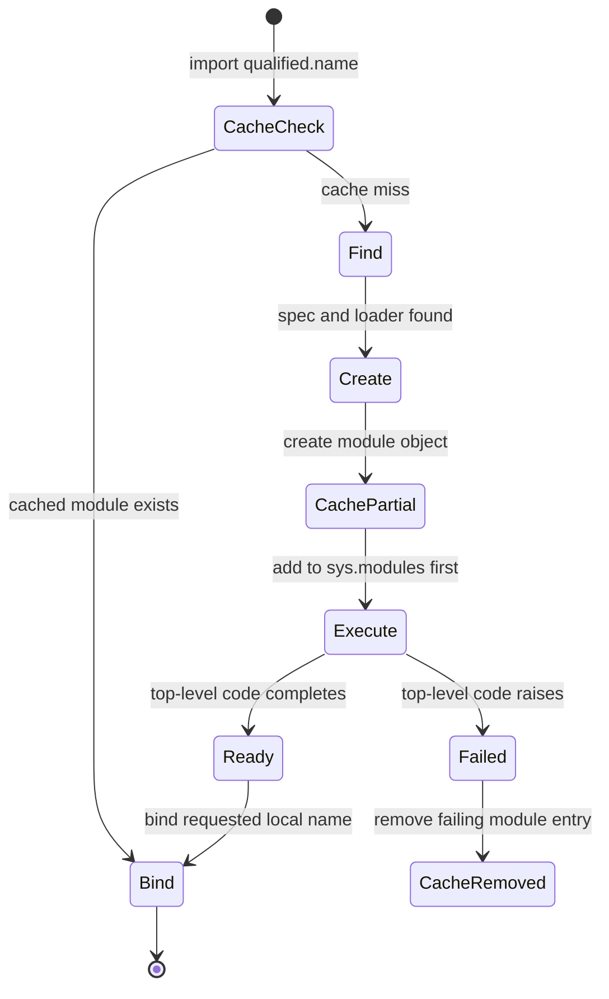
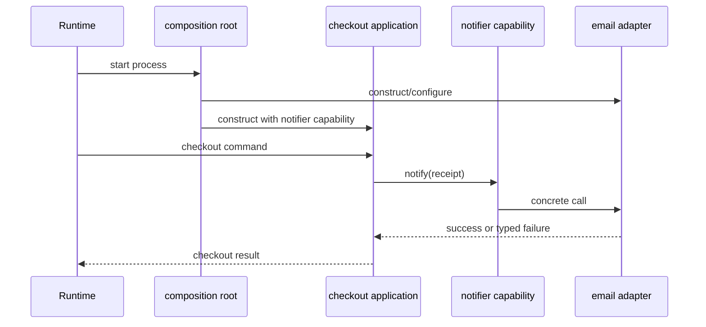
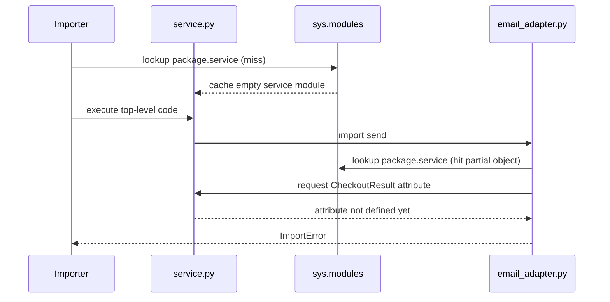
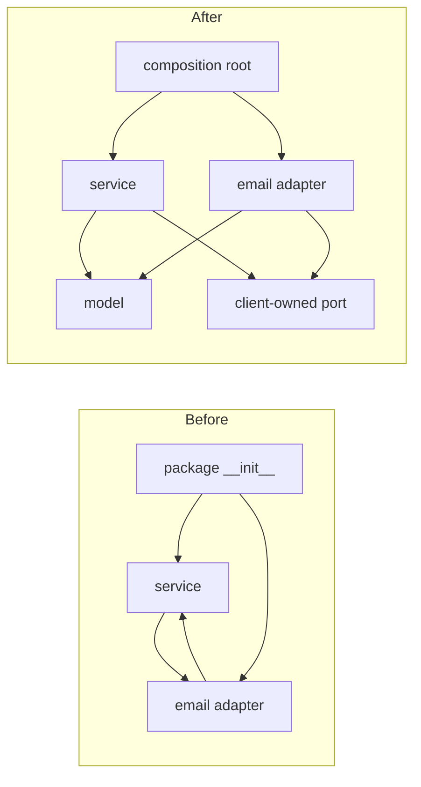

# SDP-FND-100 — Modules, package boundaries, and circular dependencies

## Physical Notebook Core

Keep this section short enough to reconstruct by hand. It is not a duplicate of the full note.

### Problem or change pressure

A small backend begins with a few convenient imports. As features grow, domain rules import
adapters, adapters import application types, package initializers re-export everything, and tests
work only from one directory. A harmless-looking new import can then fail during startup because
two modules need names that neither has finished defining. Even when the import happens to run,
the dependency graph may make every change travel through the whole package.

### One-sentence mental model

> A package is a dependency boundary: point imports toward stable meaning, let one outer
> composition root connect concrete parts, and treat every cycle as a request to redraw ownership.

### One essential visual

```text
                    allowed source dependencies

        entrypoint / composition root
          │ constructs and connects concrete objects
          ├───────────────┐
          ▼               ▼
     application ─────> domain <──── infrastructure
          │              ▲                 │
          └────────────> ports <────────────┘

        forbidden design pressure

     application ─────> infrastructure
           ▲                  │
           └──────────────────┘     cycle: no stable direction
```

### How to read this visual

An arrow means “the source file needs the target at import time or by public contract.” Start at
the entrypoint, which may know concrete implementations because it wires them. Move inward:
application orchestration and infrastructure adapters may depend on stable domain meanings or
ports. The lower pair shows a cycle: each side must already know the other, so neither is a clear
boundary.

### Key insight

The circular-import exception is often only the first visible symptom. The deeper design question
is which module owns the shared meaning and which direction should remain stable when a concrete
adapter or workflow changes.

### Simplification or limitation

This is a conceptual source-dependency diagram, not Python's complete import algorithm. A small
application may need only two modules, ports may be plain callables rather than a `Protocol`, and
infrastructure can depend on an application-owned port in architectures that place ports there.
The important invariant is an intentional acyclic direction, not these exact folder names.

### Governing rules or invariants

1. A module may depend inward on stable data and contracts; stable policy must not import a
   concrete outer adapter merely to construct or call it.
2. Import-time execution must be safe before any request is served: no reliance on another module
   having “probably finished” defining a name.
3. Break a design cycle at the ownership boundary first; use local imports, module-style imports,
   or `TYPE_CHECKING` only when they accurately model a call-time, optional, or type-only edge.

### Minimal Python example

```python
# notifications.py — stable capability owned by the caller
from collections.abc import Callable

Notifier = Callable[[str], None]


# checkout.py — policy receives behaviour; it does not import an email adapter
def checkout(order_id: str, notify: Notifier) -> str:
    receipt = f"receipt:{order_id}"
    notify(receipt)
    return receipt


# main.py — the outer composition root may know both sides
from checkout import checkout
from email_adapter import send_email

receipt = checkout("order-7", notify=send_email)
```

The example uses a callable because one operation is enough. No interface class or registry is
needed. The direction is `main → checkout` and `main → email_adapter`; `checkout` does not point
back to its concrete adapter.

### One common misconception

**Mistake:** “A circular import is solved when I move one import inside a function.”

**Correction:** A local import delays lookup until the function runs. That can be correct for a
genuinely optional or call-time dependency, but it can also hide a bidirectional design and move
the crash from startup to a request. Redraw responsibilities and public contracts before choosing
an import-timing technique.

### Important trade-offs

- Fewer, larger modules remove import edges and can be simpler; overly large modules reduce
  cohesion and create broad change surfaces.
- Extracting a small stable model or port can break a real ownership cycle; a generic `common.py`
  often becomes an unowned dumping ground.
- Package-level re-exports give users a convenient public API; eager re-exports also execute more
  modules during package import and can recreate cycles.
- Absolute imports make the full dependency visible; explicit relative imports can make an
  internal package relationship clear. Neither syntax fixes the wrong dependency direction.
- `src/` layout catches accidental imports from the repository root, but requires installation or
  an editable-development setup.

### Interview-revision cues

- Trace `A imports B imports A` as a timeline: the first `A` object is already in `sys.modules`,
  but its namespace may still be incomplete.
- Separate four questions: where Python searches, when module code executes, which name an import
  binds, and whether the design dependency should exist.
- Prefer merge modules, move shared meaning, inject a callable/port, or move orchestration outward
  before using a local-import bandage.
- Explain why `if TYPE_CHECKING:` removes only a type-checker/runtime mismatch, not a runtime
  collaboration.
- Treat `__init__.py`, entrypoints, tests, and plugin discovery as parts of the boundary design.

## Unit metadata

| Field | Value |
|---|---|
| Domain | Design foundations |
| Curriculum | [SDP-FND-100](../../../CURRICULUM.md#sdp-fnd-100) |
| Progress | [PROGRESS.md](../../../PROGRESS.md) |
| Python references | [PYTHON_REFERENCES.md](../../../PYTHON_REFERENCES.md) — exact bridge in section 36 |
| Learning outcome | Design Python module and package boundaries that keep dependencies visible and prevent circular-import design traps. |
| Hard prerequisites | `SDP-FND-030`, `SDP-FND-080` |
| Soft prerequisites | None |
| Priority | Core |
| Interview frequency | High |
| Production frequency | High |
| Python/backend relevance | High |
| Depth | D3 |
| Scope | Python, Modules |
| Size | L |
| Evidence profile | E+I+D+(X)+T |
| Canonical Python | Python 3.14 |
| Interview compatibility | Python 3.11 |
| Artifact state | Approved |

The frequency fields above are curriculum judgments, not measurements from a population survey.

## 1. Simple explanation

Think of modules as rooms in an office.

Each room should have a clear job. People can ask another room for a service through a known door.
A circular dependency appears when room A cannot begin work until room B is ready, while room B
cannot begin until room A is ready. Shouting through the wall later may stop the morning deadlock,
but it does not clarify who owns the decision.

In Python, imports make this concrete because importing is executable work. Python does not read
every file and then make all names available at once. It finds a module, creates its module object,
places that object in the module cache, and executes the module's top-level code to populate its
namespace. If that code imports a module that comes back to the first module, the second importer
can encounter the first module before all its classes and functions exist. The Python 3.14 import
reference documents both the cache-first lookup and the fact that the module is placed in
`sys.modules` before its code executes
([module cache](https://docs.python.org/3.14/reference/import.html#the-module-cache),
[loading](https://docs.python.org/3.14/reference/import.html#loading)).

The design goal is broader than “make the error disappear”:

1. group code by cohesive responsibility;
2. give each package a small, intentional public contract;
3. keep source dependencies pointing in an explainable direction;
4. construct concrete collaborators at an outer boundary;
5. make imports safe, deterministic, and testable from a real installed/package context;
6. detect forbidden edges before a production startup discovers them.

Sometimes the best fix is to merge two tiny modules because they change together. Sometimes it is
to move a shared value into the module that truly owns it. Sometimes application policy should
accept a function or port instead of importing an email, database, or HTTP adapter. Pattern count
does not determine quality; change direction does.

## 2. Prerequisite bridge

### From SDP-FND-030 — cohesion, coupling, and dependency direction

`SDP-FND-030` provides the graph language used here.

- A module is cohesive when its contents change for related reasons.
- An import is one visible source dependency, though runtime callbacks and data schemas may create
  other forms of coupling.
- Direction matters: a stable business rule should not need to change because a volatile delivery
  adapter moved.
- A cycle forms one strongly connected change region: any member can pull the others into its
  initialization and maintenance concerns.

Minimum bridge: draw modules as nodes and imports as directed edges. If following arrows can return
to the starting node, ask which responsibility or shared contract has no clear owner.

### From SDP-FND-080 — dependency management, test seams, and test doubles

`SDP-FND-080` provides explicit dependency passing.

- Construct a concrete dependency outside the policy that uses it.
- Pass the smallest capability the client needs.
- Use a fake or spy at that capability boundary, rather than patching deep import paths.
- Patch where a name is looked up only when working with an existing hard-coded dependency; do not
  make patching the architecture.

Minimum bridge: if `checkout.py` imports `smtp.py` only to send one message, accept a callable or
small port and let an entrypoint inject the SMTP adapter.

## 3. Working vocabulary

### Module

A **module** is a Python namespace loaded under a name. A source file is a common origin, but the
language's import model also supports built-in, frozen, extension, namespace-package, zip, and
custom-loaded modules. Do not equate “module” with “one `.py` file” in every claim.

### Regular package

A **regular package** is a module that can contain submodules and is typically represented by a
directory with `__init__.py`. Importing it executes that `__init__.py`. Packages are modules; a
package differs by having a submodule search path. See the Python 3.14 import reference on
[packages and regular packages](https://docs.python.org/3.14/reference/import.html#packages).

### Namespace package

A **namespace package** can combine portions from multiple search locations and has no ordinary
parent `__init__.py`. It solves a distribution/layout need; omitting `__init__.py` by accident is
not a design strategy. Namespace packages deserve explicit packaging tests because their search
path can have multiple portions.

### Import package versus distribution package

An **import package** is what code imports, such as `acme_checkout`. A **distribution package** is
an installable project/version, such as the name passed to an installer. Their names often match
but are not required to. The PyPA guide keeps these concepts separate
([distribution package versus import package](https://packaging.python.org/en/latest/discussions/distribution-package-vs-import-package/)).

### Public package surface

The **public surface** is the set of names and submodules consumers are expected to use. It is a
design contract, not every object that can technically be reached. `__init__.py` re-exports,
documentation, naming, `__all__`, type information, and compatibility tests can communicate it.

### Source dependency

Module A has a **source dependency** on B when A's source must know B's name or contract. A normal
import makes that edge easy to see. Dynamic lookup, service location, string-based registration,
or framework configuration can hide the edge without removing the dependency.

### Import-time dependency

An **import-time dependency** must be located or executed while a module's top-level code is
loading. It is narrower than a design dependency. Moving an import into a function can remove the
import-time edge while the runtime collaboration and change coupling remain.

### Circular dependency and circular import

A **circular dependency** is a directed design graph that returns to its starting node. A
**circular import** is a cycle encountered through Python import execution. A design cycle may not
crash because cached module objects or delayed attribute lookup let execution complete. A crash
may also arise from package initialization or execution context rather than a domain-level cycle.

### Partially initialized module

A module is **partially initialized** after its module object has been cached but before its
top-level execution finishes. Names defined earlier may exist; names defined later do not yet.
This state prevents unbounded recursive loading, but it cannot provide definitions that have not
run.

### Composition root

A **composition root** is the outer place that chooses concrete implementations and connects them.
It may be a short CLI/web startup function, worker bootstrap, test fixture, or framework adapter.
Business policy should not become its own composition root by importing and constructing every
concrete service it needs.

## 4. Start with the change pressure

One function is often enough:

```python
from decimal import Decimal


def total(lines: tuple[tuple[str, Decimal], ...]) -> Decimal:
    return sum((quantity * price for quantity, price in lines), start=Decimal("0"))
```

Do not split this into `models.py`, `ports.py`, `services.py`, `repositories.py`, and
`factories.py` merely because those folder names are familiar.

Now add real forces:

1. totals and discount rules must remain usable without a web framework;
2. checkout orchestration writes through a repository and sends a notification;
3. email and database adapters change for deployment reasons;
4. a CLI, HTTP endpoint, and background worker reuse the same application operation;
5. package consumers need a stable API while implementations are rearranged;
6. startup must fail clearly before traffic if wiring is invalid.

A useful boundary now separates stable domain meaning, orchestration, volatile adapters, and outer
wiring. The number of modules follows those change forces.

## 5. What Python actually does during import

At a useful design level, `import acme.checkout` has four stages:

1. determine the fully qualified module name;
2. check `sys.modules` for a cached module object;
3. if absent, find a module specification and create a module object;
4. cache that module object **before** executing its top-level code, then execute code to populate
   the namespace.

The real import system supports finders, loaders, hooks, package paths, and more. Those details
matter for tooling and plugins, but the four-stage model explains most application cycles. The
official import reference distinguishes search, creation, loading, and local name binding
([import system](https://docs.python.org/3.14/reference/import.html)).

An import statement also performs a local binding. Compare:

```python
import acme.pricing

quote = acme.pricing.quote(order)
```

with:

```python
from acme.pricing import quote

result = quote(order)
```

Both must load `acme.pricing`. The second form additionally needs the `quote` attribute when the
statement executes and binds that object directly into the importer. The language reference
specifies the search/loading step separately from the binding step
([the `import` statement](https://docs.python.org/3.14/reference/simple_stmts.html#the-import-statement)).

This distinction explains why module-style imports sometimes survive a cycle: they can bind the
partially initialized module object and defer an attribute lookup until later. That changes timing,
not ownership.

## 6. Import state visual



### How to read this visual

Follow one import request from the cache check. A cache hit returns the existing module. On a miss,
Python finds and creates the module, stores it before execution, and then runs top-level code. A
cycle re-enters at `CacheCheck` and can receive the object in `CachePartial`.

### Key insight

`sys.modules` prevents endless recreation, not access to future definitions. A second module can
hold the right module object and still ask too early for a missing name.

### Simplification or limitation

This summarizes normal import loading and omits finders, loaders, namespace-package details,
extension-module behavior, locks, subinterpreters, and custom import hooks. The language reference
notes precise failure-cache behavior; custom loaders can add complexities.

## 7. Participants and responsibilities

| Participant | Responsibility | What it must not own |
|---|---|---|
| Domain module/package | Stable business values, invariants, and pure rules | Database, HTTP, CLI, or email construction |
| Application module/package | Use-case orchestration and application-owned ports | Concrete infrastructure lifecycle |
| Port/capability | Small contract needed by a client | Convenience methods for every adapter feature |
| Infrastructure adapter | Translate a port to a database, queue, filesystem, or provider | Core policy decisions merely because data passes through it |
| Entrypoint/composition root | Select implementations, configuration, and lifetime; invoke application | Reusable business rules |
| Package initializer | Define a deliberate package surface with minimal safe work | Eager import of the entire implementation graph by default |
| Boundary test | Reject forbidden imports/cycles and verify installed-package behavior | Proving runtime business behavior alone |
| Diagnostic tool | Reveal paths, module identity, timing, and graph edges | Deciding responsibility without human judgment |

One small application may combine several roles. The purpose is ownership clarity, not one class
or folder per row.

## 8. Collaboration and execution flow



### How to read this visual

Read startup first: the outer `Main` knows concrete modules and connects them. During a request,
application code calls the capability it already received. The source dependency for the adapter
points toward the stable port contract even though the runtime call travels outward to concrete
infrastructure.

### Key insight

Runtime call direction and source-code dependency direction need not be the same. Explicit wiring
lets stable policy invoke volatile behavior without importing its concrete module.

### Simplification or limitation

The diagram is conceptual. A callable can replace `Port`; a framework may own startup; errors may
flow through results or exceptions; and a repository transaction may wrap more of the sequence.
The visual omits those choices.

## 9. Before-boundary code and concrete pain

```python
# checkout.py
from email_adapter import EmailClient
from orders import Order


def checkout(order: Order) -> str:
    receipt = order.capture()
    EmailClient.from_environment().send(receipt)
    return receipt
```

This may be the simplest working version for one deployment. The pain appears when requirements
change:

- `orders.py` imports a `CheckoutResult` from `checkout.py` for a convenience method;
- `email_adapter.py` imports the same result type for formatting;
- importing `checkout.py` now enters `orders → checkout` or `checkout → email_adapter → checkout`;
- tests patch construction and environment lookup instead of passing a controlled collaborator;
- a worker that never sends email still imports and configures the email stack;
- renaming an adapter forces policy modules and package re-exports to change.

The imports reveal that `checkout.py` owns orchestration but also chooses adapter construction,
configuration, and lifecycle. That responsibility leak is more important than the eventual
“partially initialized module” message.

## 10. Circular-import execution timeline

Assume `service.py` begins with `from .email_adapter import send`, while `email_adapter.py` begins
with `from .service import CheckoutResult` and `CheckoutResult` is defined later.



### How to read this visual

Time moves downward. The cache contains the `service` module before its body finishes. The adapter
therefore does not recursively create a second service module; it receives the first, incomplete
one. Its `from` import asks immediately for a name defined later and fails.

### Key insight

The cache hit is expected and necessary. The problem is that top-level execution order has become
part of the modules' collaboration contract.

### Simplification or limitation

The exact exception message is implementation/version dependent. Some cycles complete because a
requested name was defined earlier or because attribute access is delayed. Successful startup does
not prove an acyclic design.

## 11. Diagnose the graph before changing syntax

Use this sequence:

1. Capture the complete traceback and first application-owned import edge.
2. Write the fully qualified module names, not only filenames.
3. Draw each source import as an arrow from importer to imported module.
4. Include `__init__.py` re-exports and entrypoint imports; they often hide a path.
5. Mark whether every edge is needed at runtime, only for types, optional, or only for wiring.
6. Name the responsibility or contract each edge needs.
7. Choose the module that should own shared meaning.
8. Apply the smallest structural change and restart in a fresh process.
9. Add a boundary test so the forbidden edge cannot silently return.

A traceback is a timeline, not a complete architecture diagram. A static import graph is a source
view, not proof of runtime calls. Use both.

## 12. Common root causes

### Bidirectional feature ownership

`orders` owns some checkout rules while `checkout` owns some order rules. Merge them if they change
together, or assign the invariant to one module.

### Stable policy constructs volatile infrastructure

An application service imports a database, mail, clock, or HTTP client to build it. Move concrete
construction to a composition root and pass a small capability.

### Shared value has no owner

Several packages import each other to obtain enums, exceptions, DTOs, or type aliases. Move the
value to the package whose contract it represents—not automatically to `common.py`.

### Package initializer imports the world

`package/__init__.py` eagerly imports every submodule for convenience. Importing one leaf then
executes unrelated modules and exposes new cycle paths.

### Entrypoint mixed with reusable code

A module parses environment variables, starts a framework, and defines reusable domain functions
at top level. Importing it for one function starts or configures the application.

### Type hints create a runtime edge

A module imports a peer only to annotate a function. A forward reference or `TYPE_CHECKING` guard
may be accurate when the runtime truly does not need the peer. The typing specification defines
`TYPE_CHECKING` as true for static analysis and false at runtime
([typing directives](https://typing.python.org/en/latest/spec/directives.html#type-checking)).

### Tests rely on accidental search paths

Imports succeed only because the repository root or test directory happens to be first on
`sys.path`. Installed-package or `src/`-layout testing exposes the missing package boundary.

## 13. Smallest structural responses

Choose by force, in roughly this order:

| Response | Use when | Important limit |
|---|---|---|
| Merge modules | They are small, mutually dependent, and change together | Do not create one unrelated “god module” |
| Move a definition | One module clearly owns the shared value/rule | Avoid a generic dumping ground |
| Move orchestration outward | A lower-level module coordinates peers | Entrypoint should remain thin |
| Pass a function/callable | Client needs one operation | Do not wrap one function in a nominal hierarchy |
| Define a `Protocol`/port | Multiple operations or adapters need a stable typed contract | Own it near the client, not in the adapter package |
| Introduce a stable model package | Several modules share cohesive values and invariants | Keep it small and dependency-light |
| Use a type-only import | The edge exists only for static checking | Runtime code must not evaluate the hidden name |
| Use a local import | Dependency is genuinely optional/call-time or integration-constrained | Can delay failure and hide design coupling |
| Use dynamic plugin discovery | Independently deployed extensions must be discovered | Adds naming, compatibility, failure, and security policy |

The table is not a ladder toward “more architecture.” The first row is often the most senior fix.

## 14. Minimal Pythonic boundary

```python
# model.py
from dataclasses import dataclass
from decimal import Decimal


@dataclass(frozen=True, slots=True)
class Receipt:
    order_id: str
    total: Decimal


# service.py
from collections.abc import Callable

from .model import Receipt

Notify = Callable[[Receipt], None]


def complete(receipt: Receipt, notify: Notify) -> Receipt:
    notify(receipt)
    return receipt
```

Dependencies:

```text
service ──> model
caller  ──> service
caller  ──> concrete notifier
```

No adapter imports the service, and the service does not import a concrete adapter. A test passes a
list's `append` method or a small spy function. This is enough when notification is one operation.

## 15. Typed production-oriented boundary

Use a protocol only when the contract has enough behavior to deserve a named capability:

```python
# ports.py
from typing import Protocol

from .model import Receipt


class ReceiptPublisher(Protocol):
    def publish(self, receipt: Receipt) -> None: ...


# service.py
from dataclasses import dataclass

from .model import Receipt
from .ports import ReceiptPublisher


@dataclass(slots=True)
class CheckoutService:
    publisher: ReceiptPublisher

    def complete(self, receipt: Receipt) -> Receipt:
        self.publisher.publish(receipt)
        return receipt


# adapters/email.py
from ..model import Receipt


class EmailReceiptPublisher:
    def publish(self, receipt: Receipt) -> None:
        # Translate to the provider at this outer boundary.
        ...
```

The application owns the capability it needs. The adapter depends on that stable meaning and is
wired elsewhere. Error policy still needs a deliberate contract: a failure may abort, retry,
record an outbox item, or return a partial result. The import graph alone cannot decide it.

## 16. Package boundaries are contracts

A folder boundary is not automatically an architectural boundary. A useful package answers:

- What cohesive capability does it own?
- Which names are public?
- Which modules are internal and free to change?
- Which direction may other packages import?
- What initialization work occurs when the package is imported?
- Does the package own state, resources, or registration?
- Which compatibility promises do consumers receive?
- How is the boundary tested when installed, not only from the repository root?

Prefer imports that express the public contract:

```python
from checkout import Receipt, complete
```

only when `checkout/__init__.py` deliberately and safely re-exports those names. Otherwise, a
specific stable module is clearer:

```python
from checkout.model import Receipt
from checkout.service import complete
```

“Public” does not require flattening every name onto the package root.

## 17. `__init__.py`: small surface, real execution

Importing a regular package executes its `__init__.py`; importing a submodule first imports its
parent packages. This is language behavior, not a style convention
([regular packages](https://docs.python.org/3.14/reference/import.html#regular-packages)).

A conservative initializer is often best:

```python
"""Checkout package public contract."""

from .model import Receipt
from .service import complete

__all__ = ["Receipt", "complete"]
```

Even this executes `model` and `service` eagerly. Ask whether package-root convenience is worth the
larger initialization graph. Keep database connections, network calls, environment validation,
thread creation, and application startup out of ordinary package imports.

`__all__` defines names used by wildcard export and communicates an intended surface, but it is
not access control. Consumers can still import internal modules. The import-statement reference
specifies its role in public-name selection
([`__all__`](https://docs.python.org/3.14/reference/simple_stmts.html#the-import-statement)).

## 18. Absolute and explicit relative imports

Within a package:

```python
from checkout.model import Receipt       # absolute
from .model import Receipt               # explicit relative
```

Both can be valid.

- Absolute imports expose the full package path and are often easier to search across a codebase.
- Explicit relative imports communicate that the dependency is internal to the current package
  and survive a top-level package rename more easily.
- Too many `..` levels can signal that the package structure and collaboration are misaligned.
- Never mutate `sys.path` inside application modules to make an import “work.” Fix installation,
  execution context, or package layout.

Python defines leading-dot semantics for package-relative imports
([package relative imports](https://docs.python.org/3.14/reference/import.html#package-relative-imports)).
The syntax choice does not change the design arrow.

## 19. Entrypoints preserve package context

Prefer a small executable module:

```python
# checkout/__main__.py
from .bootstrap import main

raise SystemExit(main())
```

Run it as:

```bash
python -m checkout
```

With `-m`, Python locates the module through the import system and gives the top-level environment
module metadata appropriate to that module/package. Running an internal file path directly can
lose package context for relative imports. The Python documentation describes `-m`, `__main__.py`,
and the distinction between module execution and direct file execution
([`__main__`](https://docs.python.org/3.14/library/__main__.html),
[`-m`](https://docs.python.org/3.14/using/cmdline.html#cmdoption-m)).

Keep `__main__.py` thin so reusable functions can be imported and tested without starting the
process.

## 20. `sys.modules`: cache, identity, and state

`sys.modules` maps qualified names to loaded module objects. A second normal import usually reuses
the cached object and does not re-execute top-level code. Consequently, module globals often act as
process-local shared state.

This is useful for immutable constants and deliberately process-scoped registries, but risky for:

- mutable request or tenant data;
- environment reads that tests need to vary;
- connection creation with unclear cleanup;
- registration that depends on import order;
- tests that assume a fresh module per function.

Do not “fix” production design by deleting arbitrary `sys.modules` entries. The documentation
warns that the mapping is writable but manipulating essential entries can fail, and deletion may
create a second module object while old references survive
([`sys.modules`](https://docs.python.org/3.14/library/sys.html#sys.modules)).

`importlib.reload()` re-executes module-level code and updates bindings in the module dictionary,
but external references to old objects are not automatically rebound. Reload is a development or
specialized runtime mechanism, not an ordinary configuration refresh boundary
([`importlib.reload`](https://docs.python.org/3.14/library/importlib.html#importlib.reload)).

## 21. Type-only dependencies

Suppose two runtime modules need no collaboration, but one annotation mentions a class from the
other:

```python
from __future__ import annotations

from typing import TYPE_CHECKING

if TYPE_CHECKING:
    from .email_adapter import EmailReceiptPublisher


def register(publisher: EmailReceiptPublisher) -> None:
    ...
```

This can remove a runtime import edge while preserving a static one. Use it only when:

1. the imported name is genuinely needed only by static analysis;
2. annotations will not be evaluated at runtime in a context that needs the name;
3. reflection, dependency frameworks, serialization tools, or annotation consumers do not require
   the hidden object without an explicit resolution strategy;
4. the two modules do not call or construct each other at runtime.

It is not dependency inversion. It is an accurate split between static and runtime needs.

## 22. Local imports: valid tool and dangerous bandage

```python
def render_optional_report(data: object) -> bytes:
    from optional_pdf_adapter import render

    return render(data)
```

A local import can be appropriate when:

- the dependency is optional and only one feature needs it;
- importing it is intentionally deferred until a call;
- a framework integration requires call-time registration;
- startup cost matters and lazy loading has measured value;
- an external cycle cannot yet be removed and the limitation is documented as debt.

It is suspicious when:

- every method imports a peer package;
- requests now discover missing dependencies that startup could have reported;
- module A and B still own each other's rules;
- tests require call ordering to populate module state;
- the only explanation is “Python circular imports are normal.”

State the design dependency even when the import statement moves.

## 23. Simpler alternative: keep cohesive code together

Over-splitting creates cycles that a single cohesive module cannot have:

```python
# money.py
from dataclasses import dataclass
from decimal import Decimal


@dataclass(frozen=True, slots=True)
class Money:
    amount: Decimal
    currency: str

    def add(self, other: "Money") -> "Money":
        if other.currency != self.currency:
            raise ValueError("currencies must match")
        return Money(self.amount + other.amount, self.currency)
```

Splitting `Money` into `amount.py`, `currency.py`, `addition.py`, and `validation.py` would add edges
without independent change pressure. Module boundaries should improve local reasoning, not maximize
file count.

## 24. Refactoring path for a circular package

1. Freeze observable behavior with tests that can run without importing the broken path where
   necessary; a subprocess is useful for startup failures.
2. Capture the traceback in a fresh process and draw the full qualified import cycle.
3. Label each edge runtime, type-only, optional, or composition-only.
4. Name the rule/value/capability that crosses each edge.
5. Ask whether the modules should be merged because they change together.
6. Otherwise choose one owner for shared meaning and move only that meaning.
7. If stable policy imports concrete infrastructure, introduce the smallest client-owned
   capability and wire it outside.
8. Reduce eager package-root re-exports if they widen the graph.
9. Keep entrypoint code thin and run it with package context.
10. Restart in a fresh interpreter; cached imports can mask edits during diagnosis.
11. Run behavior tests, import smoke tests, static checks, and the dependency-boundary test.
12. Add one realistic new adapter or caller to prove the direction survives change.
13. Remove temporary local imports or compatibility shims when their constraint ends.

Do not rewrite the whole package merely to make a neat diagram. Break one ownership cycle at a
time while preserving behavior.

## 25. Before/after dependency structure



### How to read this visual

The left side has two direct cycle edges plus an initializer that eagerly loads both. On the right,
model and port are stable meanings; service and adapter point toward them, while the composition
root knows the concrete pair.

### Key insight

Breaking a cycle usually requires moving ownership or construction, not merely reversing one
arbitrary arrow.

### Simplification or limitation

The “after” graph is one valid response, not a mandatory architecture. If service and adapter are
tiny and inseparable, merging can be simpler. A callable may remove the need for a port module.

## 26. Realistic backend use case

Consider an order service with:

- pure order totals and invariants;
- checkout orchestration;
- a SQL repository;
- email and event publishers;
- HTTP and worker entrypoints.

A coherent source graph might be:

```text
order_api ─────┐
               ├──> bootstrap ──> checkout_service ──> order_model
order_worker ──┘          │              │
                          │              └──> application ports
                          ├──> sql adapter ────────────┘
                          └──> event/email adapters ───┘
```

The bootstrap may import environment/configuration and concrete adapters. The application service
imports stable order values and the capabilities it needs. Adapters import those values/contracts
to translate. HTTP route modules translate requests and call the already-wired service; they do
not become a globally importable container.

### Production trade-offs

- A monolith can still have strong internal package boundaries; separate deployment is not
  required.
- Cross-package DTO duplication may be healthier than a giant shared schema package when meanings
  differ.
- Framework models can remain at the edge and translate to domain values, avoiding framework
  imports in pure rules.
- Registration and plugin discovery should validate version/capabilities at startup and report the
  exact failing extension.
- A dependency graph test protects intended direction but does not prove transactional correctness,
  latency, authorization, or data compatibility.

## 27. Failure scenarios: detection, containment, recovery

### Partially initialized import

**Detection:** traceback repeats modules and ends on a missing name from a partially initialized
module.

**Containment:** fail startup; do not serve a partly wired application.

**Recovery:** reproduce in a fresh process, draw the cycle, move ownership/wiring, and add import
smoke plus boundary tests.

### Package initializer cascade

**Detection:** importing one leaf unexpectedly loads providers, frameworks, or sibling features.

**Containment:** import the specific stable module where possible; reduce root re-exports.

**Recovery:** keep `__init__.py` small and test `python -c "import package"` in a clean environment.

### Direct-file execution failure

**Detection:** relative import reports no known parent package, while tests/imports work elsewhere.

**Containment:** use the documented package entrypoint.

**Recovery:** invoke with `python -m qualified.module` or an installed console script; keep startup
code separate from reusable modules.

### Import shadowing

**Detection:** `module.__file__` or `module.__spec__.origin` points to the repository/current
directory instead of the installed distribution.

**Containment:** record the resolved origin and stop if an unexpected module supplied a security-
sensitive capability.

**Recovery:** fix names/layout/installation; consider `src/` layout and installed-package tests.

### Import-time side effect failure

**Detection:** network/configuration/resource errors occur merely while collecting tests or
importing a model.

**Containment:** do not retry hidden startup work from arbitrary importers.

**Recovery:** move I/O and resource construction to explicit startup/composition functions with
clear error handling.

### Dynamic plugin failure

**Detection:** discovery finds a missing, incompatible, duplicate, or exception-raising plugin.

**Containment:** isolate plugin loading, identify its distribution and entry name, and decide
whether the capability is optional or startup-critical.

**Recovery:** enforce a compatibility contract and avoid swallowing all import exceptions.

## 28. Testing strategy

| Test type | What it proves | What not to overspecify |
|---|---|---|
| Pure unit | Domain/application behavior without concrete adapters | Internal module/file placement |
| Port contract | Every selected adapter honors client-visible behavior | Private helper calls |
| Import smoke | Public package and entrypoint load in a fresh interpreter | Exact import order unless contractual |
| Boundary/architecture | Forbidden source edges and cycles are absent | All dynamic/runtime coupling |
| Installed-package | Distribution contains importable modules/resources | Repository-root path accidents |
| CLI/entrypoint | `-m` or console entrypoint preserves package context | Framework boot internals |
| Failure | Missing config/plugin/import fails with actionable context | Full traceback wording across runtimes |

### Essential checks

1. Import the public package in a subprocess with no prior cache state.
2. Import important leaf modules independently.
3. Run the executable module with `-m`.
4. Verify stable policy tests use a fake/callable without importing infrastructure.
5. Parse or lint internal imports to reject known forbidden directions.
6. Detect at least one complete directed cycle, not only two-node pairs.
7. Build/install the distribution when packaging is in scope and test the installed artifact.
8. Check `module.__file__` or `__spec__.origin` when shadowing is plausible.
9. Exercise adapter registration and duplicate/incompatible plugin errors when plugins exist.
10. Keep tests independent of collection order and earlier imports.

The practice lab uses subprocesses for broken-import characterization so one intentional startup
failure does not prevent pytest from collecting the rest of the suite.

## 29. Observability and debugging

Useful diagnostic facts include:

- the full qualified module requested;
- `__name__`, `__package__`, and `__spec__` at an entrypoint;
- `module.__file__` or `module.__spec__.origin`;
- whether the name already exists in `sys.modules`;
- the first application module in the traceback;
- which package initializer ran;
- plugin distribution, entry-point name, version, and load outcome;
- startup duration only when measured under a defined environment.

Do not log all of `sys.path`, environment variables, or configuration blindly in production;
paths and values may expose sensitive deployment details. Prefer targeted diagnostics and redact
secrets.

`python -X importtime` can help investigate import cost on CPython, but its output is a diagnostic
observation, not an architecture verdict or a cross-runtime performance guarantee. Measure before
introducing lazy imports solely for speed.

## 30. Concurrency, process scope, and module state

Module caching does not make module globals a safe application state boundary. A cached module
object is typically shared by importers in one interpreter context, so mutable globals can couple
requests and tests. Separate processes usually have separate in-memory module objects, so a module
registry is not a cross-worker source of truth.

Design questions remain:

- Who mutates the module-level state?
- Is initialization idempotent if startup calls it twice?
- Can concurrent requests observe partial application initialization?
- How does a worker reload or shutdown release resources?
- Where is shared durable state coordinated across processes?

Prefer explicit constructed state with a chosen lifetime. Do not depend on import locks as a
business synchronization mechanism; import coordination and application invariants are different
problems.

## 31. Performance and memory

Imports can contribute to startup time and memory because top-level code creates objects and eager
re-exports load transitive modules. However:

- do not claim “imports are expensive” without measuring the application;
- cached import avoids normal re-execution but not the memory retained by loaded modules;
- local/lazy imports can improve startup while increasing first-call latency and failure timing;
- broad package imports may load optional frameworks unused by a worker;
- merging tiny modules can reduce graph complexity without a meaningful runtime effect;
- dynamic discovery adds metadata scanning and error paths that static wiring does not need.

Optimize after recording interpreter, environment, command, workload, warm-up, trials, and actual
observations. Architecture clarity often matters more than microseconds of import syntax.

## 32. Layout choices

### Flat project layout

An import package lives beside `pyproject.toml` and other repository files. It is convenient, but
the current working directory can make the in-development copy importable even when the built
distribution is incomplete.

### `src/` layout

Importable code lives under `src/`, so development normally installs the project (often editable)
before import. PyPA notes that this helps prevent accidental use of the repository copy and keeps
non-package project files off the import path
([src layout versus flat layout](https://packaging.python.org/en/latest/discussions/src-layout-vs-flat-layout/)).

### Regular versus namespace package

Use a regular package by default for one cohesive codebase. Use a namespace package when multiple
distributions intentionally contribute portions under one namespace. Do not choose it only to
avoid an `__init__.py` file.

### One package versus many internal packages

Choose based on independently understandable responsibilities, allowed dependency direction,
public compatibility, and ownership—not team count or a target folder depth.

## 33. Related units and later designs

| Related unit | Relationship | Key difference |
|---|---|---|
| `SDP-FND-030` | Foundation | Evaluates cohesion/coupling generally; this unit makes imports and packages concrete |
| `SDP-FND-080` | Foundation | Supplies explicit dependency seams; this unit places them across modules/packages |
| `SDP-FND-110` | Next heuristic lens | Applies simplicity guidance to avoid speculative package layers |
| `SDP-SOL-050` | Deeper principle | Formalizes dependency inversion around policy boundaries |
| `SDP-SOL-070` | Pythonic synthesis | Applies SOLID through functions, modules, Protocols, and ABCs |
| `SDP-PYT-050` | Python mechanism | Deepens modules, imports, packages, `__main__`, and plugin mechanics |
| `SDP-PYT-090` | Extension mechanism | Focuses registries and plugin discovery rather than ordinary package boundaries |
| `SDP-REF-070` | Refactoring | Treats package/module moves and dependency repair in legacy code |
| `SDP-ARC-010` | Architecture | Applies dependency direction across larger layers |
| `SDP-ARC-020` | Architecture | Places ports/adapters at application-system boundaries |

Do not pull later units forward as mandatory machinery. A function parameter and two cohesive
modules are enough for many `SDP-FND-100` problems.

## 34. When to introduce or strengthen a package boundary

- A cohesive capability has a stable public contract and several internal implementation details.
- A volatile adapter should change without editing stable business policy.
- Multiple entrypoints reuse the same application operation.
- Consumers need compatibility while implementation modules move.
- Tests need a clear seam that does not rely on patching globals.
- An import cycle reveals ambiguous responsibility or construction.
- Optional extensions require explicit discovery and compatibility policy.
- Installed artifacts must exclude repository-only tools/tests/configuration.

## 35. When not to add another boundary

- Two tiny modules always change together and only import each other.
- A single function has no independent policy or adapter force.
- The proposed package is `utils`, `helpers`, `common`, or `shared` without a named owner.
- A new interface merely mirrors one implementation and one call.
- The boundary exists only to match a framework tutorial or another language's folder convention.
- Dynamic discovery is proposed where static imports and explicit wiring are simpler.
- Moving files would not change dependency direction, public API, testability, or ownership.

## 36. Common misuse and overengineering

| Misuse | Why it happens | Better move |
|---|---|---|
| Move imports inside every function | It quickly removes one startup error | Fix ownership; keep local import only for a real call-time/optional edge |
| Replace `from x import y` with `import x` and declare victory | Attribute lookup happens later | Record that the design cycle still exists and refactor if change coupling matters |
| Create `common.py` | Shared names need somewhere neutral | Place cohesive meaning with its owner or create a narrowly named stable model |
| Re-export every submodule in `__init__.py` | Package root feels convenient | Expose a small deliberate API and avoid eager unrelated imports |
| Use `TYPE_CHECKING` for runtime collaborators | Static checks pass and cycle disappears | Use it only for a type-only edge; inject runtime behavior explicitly |
| Mutate `sys.path` | Direct execution cannot find the package | Install correctly or execute with `-m`/console entrypoint |
| Delete `sys.modules` entries | A fresh import appears to reset state | Give state an explicit owner/lifetime; use fresh subprocesses for isolation |
| Create one package per class | “Separation” is mistaken for cohesion | Keep collaborating code together until change forces justify a seam |
| Service locator by string | Imports vanish from source | Prefer explicit wiring; use discovery only for independent extensions |
| Catch all `ImportError` as “optional dependency missing” | Optional imports need fallback | Distinguish target-not-found from exceptions raised while target initializes |

## 37. Interview preparation

### Common formulation 1

**“Why do circular imports happen in Python?”**

Explain top-level execution, early insertion into `sys.modules`, partial namespaces, and immediate
name binding. Then move from mechanism to ambiguous dependency direction.

### Common formulation 2

**“How would you fix `A imports B imports A`?”**

Do not answer “local import” first. Ask what crosses each edge, who owns it, whether modules should
merge, and whether construction belongs in an outer composition root.

### Common formulation 3

**“Does `import module` fix a cycle that `from module import name` exposes?”**

It may delay attribute access enough for initialization to complete, but it preserves the source
cycle. Call it a timing change and evaluate design coupling separately.

### Common formulation 4

**“What is `sys.modules`?”**

Describe the qualified-name-to-module cache, early cache insertion, ordinary reuse, mutable global
state implications, reload caveats, and why manual deletion is not a normal reset strategy.

### Common formulation 5

**“Where should interfaces live?”**

Near the client/policy that needs the capability, when a named port is justified. A one-method need
may be a callable. Concrete adapters implement or structurally satisfy the capability and are wired
outside.

### Common formulation 6

**“What should go in `__init__.py`?”**

Small package documentation and carefully selected public re-exports when convenience outweighs
eager loading. Avoid application startup, I/O, and import-all behavior.

### Common formulation 7

**“Absolute or relative imports?”**

Both are explicit Python mechanisms. Discuss visibility, package-internal intent, searchability,
and execution context; neither determines correct dependency direction.

### Common formulation 8

**“Why use `src/` layout?”**

To separate importable source from repository root and test the installed/package configuration,
accepting an installation/editable-development step.

### Common formulation 9

**“How do you enforce package boundaries?”**

Combine code review and documentation with import smoke tests, static dependency rules, cycle
detection, installed-package tests, and a small stable public API.

### Common formulation 10

**“When is a local import correct?”**

For an accurately optional or call-time dependency, measured lazy loading, constrained framework
integration, or documented migration debt—not as an automatic response to every cycle.

### Weak-answer traps

- “Python cannot handle any circular imports.”
- “`sys.modules` means a module is a Singleton.”
- “Just put all shared types in `common.py`.”
- “Relative imports cause cycles; absolute imports prevent them.”
- “`TYPE_CHECKING` solves dependency inversion.”
- “Put every import at the top no matter what.”
- “Always put imports inside functions for performance.”
- “Every directory with Python files is a regular package.”
- “If tests pass from the repository root, packaging is correct.”
- “A clean folder tree proves clean architecture.”

### Likely follow-ups

1. What exactly is visible in a partially initialized module?
2. Why is the module cached before execution?
3. What happens to the cache when module execution fails?
4. How do package-root re-exports create hidden paths?
5. Why can direct file execution break relative imports?
6. How would you test a currently broken import without breaking pytest collection?
7. What dynamic dependencies can a static import graph miss?
8. When should two packages duplicate similar data instead of sharing one DTO?
9. How do plugins change failure and trust boundaries?
10. How would you migrate a large cyclic package incrementally?

### Reasoning checkpoints

A strong senior answer separates import mechanics from design mechanics, reconstructs the load
timeline, draws the full source graph, names responsibility ownership, proposes the smallest
structural fix, addresses package API and entrypoint behavior, adds a regression boundary test,
and rejects a local-import or interface-heavy answer when simpler cohesion is enough.

## 38. Closed-book revision cues

1. Reconstruct the one-direction package visual and label arrow meaning.
2. Trace cache check → create → cache partial → execute → bind.
3. Explain why early cache insertion prevents repeated loading but exposes partial namespaces.
4. Compare `import module` with `from module import name` during a cycle.
5. Diagnose one `__init__.py`-created import cascade.
6. Choose among merge, move meaning, inject callable, define port, type-only import, and local
   import for six scenarios.
7. Explain direct file execution versus `python -m`.
8. State what `sys.modules` reuse, deletion, and reload do and do not guarantee.
9. Draw a before/after graph for policy and infrastructure.
10. Design an import smoke test and a forbidden-edge test.
11. Reject `common.py`, global service location, and package-per-class overengineering.
12. Explain one production failure and recovery path.

## 39. Vocabulary and professional English

### Boundary

| Item | Content |
|---|---|
| Pronunciation | BOWN-duh-ree |
| Simple English meaning | A line that separates responsibilities or areas |
| Hindi cue | seema |
| Meaning in this design context | A contract that controls what one package knows about another |

Natural examples:

1. The river forms a boundary between the two districts.
2. Clear boundaries make ownership easier.
3. The discussion crossed a personal boundary.
4. **Interview:** “The package boundary exposes domain values but hides provider construction.”
5. **Engineering discussion:** “Add a dependency rule so infrastructure cannot leak across this boundary.”

### Cohesive

| Item | Content |
|---|---|
| Pronunciation | koh-HEE-siv |
| Simple English meaning | Forming one clear, connected whole |
| Hindi cue | ekjut aur sambandhit |
| Meaning in this design context | Code grouped because its parts serve related responsibilities and changes |

Natural examples:

1. The report is concise and cohesive.
2. The team became more cohesive after clarifying its goal.
3. These scenes form a cohesive story.
4. **Interview:** “I would merge the two tiny modules because they are one cohesive policy.”
5. **Engineering discussion:** “This package is not cohesive; billing, logging, and parsing change independently.”

### Initialization

| Item | Content |
|---|---|
| Pronunciation | ih-nish-uh-luh-ZAY-shun |
| Simple English meaning | Preparing something so it is ready to use |
| Hindi cue | shuruati taiyari |
| Meaning in this design context | Executing module/package setup that populates its namespace |

Natural examples:

1. Device initialization takes a few seconds.
2. The form failed during initialization.
3. Initialization loads the saved settings.
4. **Interview:** “The second module observes the first during partial initialization.”
5. **Engineering discussion:** “Move network I/O out of import-time initialization.”

### Transitive

| Item | Content |
|---|---|
| Pronunciation | TRAN-suh-tiv |
| Simple English meaning | Reached indirectly through one or more links |
| Hindi cue | beech ki kadiyon se juda |
| Meaning in this design context | A dependency loaded or affected through another dependency |

Natural examples:

1. The delay had transitive effects on later deliveries.
2. A friend introduced me through a transitive connection.
3. The policy has transitive consequences.
4. **Interview:** “The package initializer adds a transitive import of the email provider.”
5. **Engineering discussion:** “Audit transitive dependencies before making this module public.”

### Entrypoint

| Item | Content |
|---|---|
| Pronunciation | EN-tree-point |
| Simple English meaning | The place where execution begins |
| Hindi cue | shuruaat ka bindu |
| Meaning in this design context | The outer module/function that starts and wires an application |

Natural examples:

1. The lobby is the building's main entrypoint.
2. The API provides one entrypoint for submissions.
3. The guide lists several entrypoints into the topic.
4. **Interview:** “Keep the entrypoint thin and run the package with `-m`.”
5. **Engineering discussion:** “The worker entrypoint should reuse the same application service.”

## 40. Python Mastery references

The exact hard mapping in `PYTHON_REFERENCES.md` links this unit to:

- [PY-MOD-010 — Modules, packages, and executable modules](https://github.com/rahulyadev/python-mastery/blob/main/CURRICULUM.md#py-mod-010)
- [PY-MOD-020 — Import resolution, sys.path, and module caching](https://github.com/rahulyadev/python-mastery/blob/main/CURRICULUM.md#py-mod-020)
- [PY-MOD-030 — Circular imports and package boundaries](https://github.com/rahulyadev/python-mastery/blob/main/CURRICULUM.md#py-mod-030)
- [PY-MOD-070 — Package layouts, resources, entry points, and plugin boundaries](https://github.com/rahulyadev/python-mastery/blob/main/CURRICULUM.md#py-mod-070)

Minimum bridge for this design unit:

1. a module's top-level code executes while it is imported;
2. a regular package executes `__init__.py` and provides a submodule search path;
3. `sys.modules` caches modules by qualified name and receives the module before execution ends;
4. `sys.path`, package `__path__`, finders, and loaders determine resolution;
5. direct file execution and `python -m qualified.module` create different package metadata;
6. a circular-import symptom is a runtime timeline layered on a design dependency graph;
7. distribution packages, import packages, entrypoints, and plugin boundaries are related but
   distinct packaging concepts.

The practice experiments make the required subset observable. They do not replace the deeper
Python modules curriculum.

## 41. Practice and experiments

The [practice lab](practice/README.md) contains:

- an unsolved checkout-package refactoring with a deterministic circular import;
- stable model validation plus subprocess characterization tests for the broken startup;
- an AST-based dependency graph and cycle detector;
- a module cache, reload, and cache-deletion experiment;
- a partial-initialization experiment comparing immediate `from` binding with delayed module
  attribute lookup;
- a direct-file versus `-m` package-context experiment;
- an eager `__init__.py` re-export experiment;
- prediction prompts, ownership worksheets, edge cases, progressive-hint policy, variations, and a
  review rubric.

The lab remains unsolved. Artifact verification proves that the failure and experiments are
reproducible; it does not prove Rahul's prediction, refactoring judgment, or learning, and it does
not advance the `PROGRESS.md` learning state.

## 42. Authoritative sources

Sources opened and used for this unit:

1. Python 3.14.7 Language Reference,
   [“The import system”](https://docs.python.org/3.14/reference/import.html) — modules/packages,
   search, cache behavior, loading order, partial-module insertion, submodule binding, package-
   relative imports, and `__main__` considerations.
2. Python 3.14.7 Language Reference,
   [“The import statement”](https://docs.python.org/3.14/reference/simple_stmts.html#the-import-statement)
   — search/loading versus local binding, `from` binding, relative-import syntax, and `__all__`.
3. Python 3.14.7 Standard Library,
   [`sys.modules`](https://docs.python.org/3.14/library/sys.html#sys.modules) — loaded-module mapping,
   mutation warnings, and safe iteration guidance.
4. Python 3.14.7 Standard Library,
   [`importlib.reload`](https://docs.python.org/3.14/library/importlib.html#importlib.reload) —
   module re-execution, namespace update, retained external references, and caveats.
5. Python 3.14.7 Standard Library,
   [`__main__` — top-level code environment](https://docs.python.org/3.14/library/__main__.html) and
   [command-line `-m`](https://docs.python.org/3.14/using/cmdline.html#cmdoption-m) — executable
   modules/packages and package-aware invocation.
6. Python typing specification,
   [`TYPE_CHECKING`](https://typing.python.org/en/latest/spec/directives.html#type-checking) — static-
   only execution and import-cycle use.
7. Python Packaging User Guide,
   [“Distribution package vs. import package”](https://packaging.python.org/en/latest/discussions/distribution-package-vs-import-package/)
   and [“src layout vs flat layout”](https://packaging.python.org/en/latest/discussions/src-layout-vs-flat-layout/)
   — packaging terminology and layout trade-offs.

All explanations, diagrams, examples, lab code, tests, and synthetic order/receipt data are
original. No book diagram, third-party application code, private system, credential, production
traceback, or proprietary data is reproduced.
