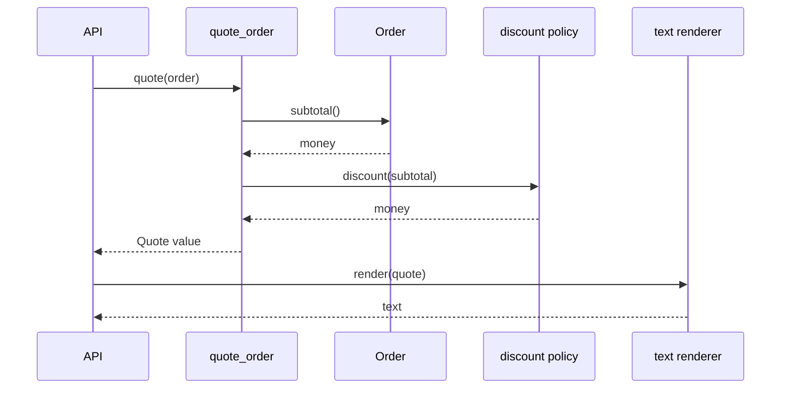

# SDP-FND-110 — Simplicity heuristics and collaboration laws

## Physical Notebook Core

Keep this section short enough to reconstruct by hand. It is not a duplicate of the full note.

### Problem or change pressure

A backend begins with a direct function. As requirements arrive, one engineer removes every
repeated line, another adds extension points for possible providers, and another moves every query
behind a command. The result follows several slogans but is harder to read, test, and change. The
missing skill is judgment: deciding which knowledge, concern, and collaboration is actually under
pressure now.

### One-sentence mental model

> Treat each heuristic as a question about current change cost, make the smallest evidence-backed
> move, and keep the rule subordinate to clear ownership and observable behaviour.

### One essential visual

```text
                         current requirement + evidence
                                      │
                                      ▼
                         What concrete pain exists?
                                      │
              ┌───────────────────────┼────────────────────────┐
              ▼                       ▼                        ▼
      duplicated knowledge     mixed change reasons     exposed collaboration
            DRY                  separation of          Tell Don't Ask /
                                  concerns               Law of Demeter
              │                       │                        │
              └───────────────────────┼────────────────────────┘
                                      ▼
                       smallest clear design that works
                             KISS + composition
                                      │
                                      ▼
                   future-only capability?  ──yes──> wait: YAGNI
                                      │ no
                                      ▼
                     test the next realistic change
                         keep, revise, or remove
```

### How to read this visual

Start at the evidence, not at a slogan. Follow only the branch that matches a concrete problem.
The branches reunite at the smallest design that preserves current behaviour. YAGNI then challenges
features or abstractions whose only client is an imagined future. The final arrow is feedback:
the next real change, not the number of applied principles, judges the decision.

### Key insight

These heuristics do not calculate a design. They direct attention to different costs: duplicated
knowledge, mixed responsibilities, excessive knowledge of collaborators, rigid reuse, speculative
complexity, and unnecessary cognitive load.

### Simplification or limitation

This is a conceptual decision loop, not a mandatory order or runtime call graph. One change may
activate several heuristics, and they may disagree. Security, compatibility, irreversible data
formats, regulation, and operational risk can justify work before a feature is immediately used.

### Governing rules or invariants

1. Name the present requirement, change pressure, or failure before proposing an abstraction.
2. Remove duplicated knowledge, not every pair of similar-looking lines.
3. Let a collaborator expose meaningful behaviour without banning useful queries or counting dots.
4. Prefer composition for independently varying behaviour, but keep inheritance when substitution
   is real and the base contract is stable.
5. When heuristics conflict, preserve correctness and clarity, then choose the more reversible
   design and verify it against the next realistic change.

### Minimal Python example

```python
from dataclasses import dataclass
from decimal import Decimal


@dataclass(frozen=True)
class Line:
    quantity: int
    unit_price: Decimal

    def subtotal(self) -> Decimal:
        return self.unit_price * self.quantity


@dataclass(frozen=True)
class Order:
    lines: tuple[Line, ...]

    def subtotal(self) -> Decimal:
        return sum((line.subtotal() for line in self.lines), start=Decimal("0"))


def summary(order: Order) -> str:
    return f"Subtotal: {order.subtotal():.2f}"
```

`Order` owns the subtotal because it owns the lines and the invariant. `summary` owns presentation.
There is no renderer hierarchy, plug-in registry, or generic pricing engine because the current
requirement does not need one.

### One common misconception

**Mistake:** “A design is better when it obeys more principles and contains less duplication,
fewer getters, fewer dots, and more composition.”

**Correction:** Those counts are weak proxies. A good decision explains the current force,
localizes the relevant knowledge, preserves behaviour, and avoids more coordination cost than the
problem warrants.

### Important trade-offs

- One direct function has low navigation cost; a boundary can reduce future change cost but adds
  a name, contract, dependency, and possible failure handoff.
- Waiting avoids speculative complexity; waiting can be expensive for irreversible schemas,
  public APIs, security controls, or known compliance deadlines.
- Co-locating data and behaviour protects invariants; separating policy may be clearer when the
  policy changes for a different reason than the data model.
- Composition makes collaborators explicit and replaceable; inheritance can be concise when a
  genuine subtype contract and framework lifecycle already exist.

### Interview-revision cues

- Translate each slogan into a diagnostic question and one overapplication guardrail.
- Resolve DRY versus YAGNI by asking whether repeated code represents the same changing knowledge.
- Explain why Tell Don't Ask is not “never query” and Law of Demeter is not “one dot only.”
- Choose direct code, a function, composition, or inheritance from actual variation and
  substitution—not from a universal preference.

## Unit metadata

| Field | Value |
|---|---|
| Domain | Design foundations |
| Curriculum | [SDP-FND-110](../../../CURRICULUM.md#sdp-fnd-110) |
| Progress | [PROGRESS.md](../../../PROGRESS.md) |
| Python references | [PYTHON_REFERENCES.md](../../../PYTHON_REFERENCES.md) — no direct prerequisite mapping |
| Learning outcome | Apply KISS, DRY, YAGNI, separation of concerns, Tell Don't Ask, Law of Demeter, and favour-composition guidance without turning them into rigid rules. |
| Hard prerequisites | `SDP-FND-020`, `SDP-FND-030`, `SDP-FND-050` |
| Soft prerequisites | None |
| Priority | Core |
| Interview frequency | High |
| Production frequency | High |
| Python/backend relevance | High |
| Depth | D2 |
| Scope | Design |
| Size | M |
| Evidence profile | E+D+T |
| Canonical Python | Python 3.14 |
| Interview compatibility | Python 3.11 |
| Artifact state | Approved |

The frequency fields are curriculum judgments, not measurements from a population survey.

## 1. Simple explanation

A heuristic is a useful shortcut for thinking. It is not a law of physics and it does not remove
the need to inspect the situation.

The heuristics in this unit answer different questions:

- **KISS:** What is the clearest design that satisfies the real constraints?
- **DRY:** Is one piece of changing knowledge represented in several places?
- **YAGNI:** Are we paying complexity now for a capability with no current need?
- **Separation of concerns:** Which aspects should be reasoned about and changed independently?
- **Tell Don't Ask:** Is a caller extracting another object's data to make the decision that object
  or a dedicated policy should own?
- **Law of Demeter:** Does this unit know more of its collaborators' internal object graph than its
  job requires?
- **Favour composition:** Is behaviour assembled from explicit collaborators more honest than
  claiming an inheritance relationship?

None of these says “create a class.” In Python, the smallest response may be a good name, a local
variable, a pure function, a dataclass method, an explicit callable argument, two small modules, or
no structural change at all.

**Simple** does not mean shortest, cleverest, least tested, or free of error handling. It means the
important behaviour and reasons for change are easy enough to see, while accidental machinery is
kept proportionate to the problem.

## 2. Prerequisite bridge

### From SDP-FND-020 — change pressure, responsibilities, and boundaries

Start with why the design must move. Assign knowing, deciding, coordinating, and performing
responsibilities deliberately. A heuristic without a named pressure easily becomes a slogan-driven
rewrite.

### From SDP-FND-030 — cohesion, coupling, and dependency direction

Simplicity is not an object count. Inspect which knowledge changes together, which source depends
on which meaning, and how far one change travels. DRY, separation of concerns, and Law of Demeter
are useful partly because they expose different forms of change coupling.

### From SDP-FND-050 — composition, delegation, and inheritance

Composition, delegation, and inheritance have different contracts. Composition supplies a
collaborator; delegation forwards responsibility; inheritance claims substitutability and shares a
base lifecycle. “Favour composition” is a default under uncertainty, not proof that inheritance is
wrong.

## 3. Source-checked context

Edsger W. Dijkstra described separation of concerns as temporarily studying one aspect in
isolation while remaining aware that other aspects still exist. His formulation is about ordering
thought, not automatically placing every concern in a different class
([Dijkstra, EWD447](https://www.cs.utexas.edu/~EWD/transcriptions/EWD04xx/EWD447.html)).

Andy Hunt and Dave Thomas formulate DRY around one authoritative representation of knowledge.
Their expanded explanation explicitly distinguishes duplicated intent from code that merely looks
the same, and it discusses deliberate localized duplication such as cached derived data
([*The Pragmatic Programmer*, “The Evils of Duplication”](https://media.pragprog.com/titles/tpp20/dry.pdf)).

Martin Fowler connects YAGNI to evolutionary design: do not build presumptive capability now, but
do keep the code malleable through refactoring, self-testing code, and delivery practices. YAGNI is
not permission to let the current design decay
([Fowler, “Yagni”](https://martinfowler.com/bliki/Yagni.html)).

Tell Don't Ask encourages co-locating behaviour with the data it legitimately uses. Fowler also
records the important counterweight: useful query methods exist, and eliminating all getters can
produce contorted collaboration
([Fowler, “Tell Dont Ask”](https://martinfowler.com/bliki/TellDontAsk.html)).

The Law of Demeter originated in the Demeter project as an object-oriented style rule. Its general
form asks a unit to have limited knowledge of closely related units; the Demeter material also
acknowledges that “closely related” is contextual
([Northeastern, general formulation](https://www2.ccs.neu.edu/research/demeter/demeter-method/LawOfDemeter/general-formulation.html);
[1988 paper bibliography](https://www2.ccs.neu.edu/research/demeter/biblio/LoD.html)).

This unit uses KISS as a modern working label for choosing the least accidental complexity that
still satisfies known constraints. It makes no disputed historical attribution for the slogan.

## 4. Seven tools, seven questions, seven guardrails

| Heuristic | Diagnostic question | Smallest common move | Overapplication guardrail |
|---|---|---|---|
| KISS | Which concept, hop, state, or option is not needed to explain current behaviour? | Inline, rename, delete, or use a direct function | Short code can still hide invariants, failures, or unsafe defaults |
| DRY | Would one fact or policy change require coordinated edits in several places? | Establish one authoritative calculation or representation | Similar syntax may encode independent knowledge that should evolve separately |
| YAGNI | Who needs this capability now, and what evidence makes delay expensive? | Defer the feature or extension point; keep the code easy to change | Do not defer tests, refactoring, security, compatibility, or known irreversible decisions |
| Separation of concerns | Which aspects can be reasoned about and changed independently? | Separate policy, representation, orchestration, or effects at one useful seam | Different concerns may remain in one cohesive function; atomic invariants still need coordination |
| Tell Don't Ask | Is the caller retrieving facts only to make another owner's decision? | Move behaviour toward its legitimate facts or into a focused policy | Queries, reports, transformations, and transparent value data are not inherently wrong |
| Law of Demeter | Does this unit navigate through collaborators to reach a stranger? | Ask the immediate collaborator for stable meaning or pass the needed value directly | Count knowledge and change coupling, not punctuation or fluent-call dots |
| Favour composition | Is reused behaviour an independent capability rather than an “is-a” contract? | Supply a function or object collaborator explicitly | A genuine stable subtype or framework hook can make inheritance the clearer choice |

The words “smallest common move” matter. The response to one deep navigation chain may be one
method on an existing owner, not three wrappers and a facade. The response to duplicated business
knowledge may be one named function, not a generic rules platform.

## 5. A disciplined decision loop

Use this loop when a code review comment invokes a heuristic:

1. **Preserve behaviour.** Add or identify tests for current outputs, errors, and effects.
2. **State the pressure.** Name the actual change, defect, comprehension cost, or failure risk.
3. **Locate the knowledge.** Identify who currently knows the facts and who makes the decision.
4. **Choose one leading heuristic.** Other heuristics are constraints, not a checklist to maximize.
5. **Make one reversible move.** Prefer a rename, function, value, or explicit argument before a
   framework, hierarchy, registry, or distributed boundary.
6. **Apply the next realistic change.** Count edit locations, leaked knowledge, new hops, and
   failure states qualitatively.
7. **Remove unused machinery.** If the abstraction did not localize change or clarify ownership,
   collapse it.

The loop converts “this violates DRY” into a falsifiable claim: “the free-shipping threshold is
business knowledge represented in two functions; changing it requires two coordinated edits.”

## 6. KISS: reduce accidental complexity, not essential behaviour

Essential complexity comes from the problem: money precision, permissions, partial failure,
compatibility, or a legally required audit trail. Accidental complexity comes from the chosen
solution: unnecessary layers, generic configuration, hidden global state, or a hierarchy with one
real variant.

A direct design is often best:

```python
from decimal import Decimal


def shipping_fee(*, subtotal: Decimal, domestic: bool) -> Decimal:
    if domestic and subtotal >= Decimal("50.00"):
        return Decimal("0")
    return Decimal("5.00") if domestic else Decimal("15.00")
```

This conditional names two current rules clearly. Replacing it with an abstract factory, registry,
configuration DSL, and three one-method classes does not remove the decision; it distributes it
across more concepts.

KISS can still justify a boundary when the direct code hides an essential distinction. Separating
money calculation from network delivery may add lines while making failure and testing much
simpler. Measure simplicity at the level of understanding and change, not line count.

Useful review questions:

- Can a reader follow the important path without opening many forwarding wrappers?
- Does each configuration option have a current caller and a meaningful failure policy?
- Does the abstraction hide volatile knowledge, or only rename a call?
- Are validation and recovery visible where correctness needs them?
- Can one concept be deleted without losing an actual requirement?

## 7. DRY: one source of truth for changing knowledge

DRY is strongest when one fact must remain consistent:

```python
FREE_SHIPPING_MINIMUM = Decimal("50.00")


def qualifies_for_free_shipping(subtotal: Decimal) -> bool:
    return subtotal >= FREE_SHIPPING_MINIMUM
```

If checkout and support tooling independently encode `50.00` as the same policy, the next threshold
change can produce contradictory answers. One authoritative rule removes that coordination risk.

### Similar code can represent different knowledge

```python
def validate_retry_count(value: int) -> None:
    if value < 0:
        raise ValueError("retry count must not be negative")


def validate_credit_balance(value: int) -> None:
    if value < 0:
        raise ValueError("credit balance must not be negative")
```

The bodies look alike today, but operations policy and accounting policy can change independently.
A generic `validate_non_negative` helper may save lines while coupling two unrelated meanings.
Wait until shared domain intent, not visual similarity, is clear.

### Different code can duplicate one fact

A Python constant, an OpenAPI schema, a database constraint, and user documentation may all
represent the same limit in different formats. Some representational duplication is unavoidable
across system boundaries. Choose an authority, generate or verify dependants where practical, and
make drift detectable.

### Derived data is controlled duplication

Persisting a subtotal, cache entry, or search index duplicates information for performance or
availability. That can be sound when ownership, invalidation, consistency expectations, and repair
are explicit. “Never duplicate data” would make many practical systems impossible.

## 8. YAGNI: delay presumptive capability, preserve malleability

YAGNI challenges work whose value exists only in a predicted future:

- a plug-in system with one implementation and no external extension contract;
- an abstract base class built for providers that are not selected or funded;
- fields for a feature that has no accepted behaviour;
- a generic rule language before two concrete rules are understood;
- a distributed service created only because team size might grow.

Waiting creates information. When the second real case arrives, the shared and varying parts are
visible. An abstraction built after that evidence is less likely to encode the wrong axis.

YAGNI does **not** mean:

- omit tests because requirements may change;
- leave duplication that already causes inconsistent edits;
- ignore a confirmed security, legal, or compatibility requirement;
- postpone an irreversible schema or public-API decision until deployment;
- refuse small refactoring that makes later change safe;
- optimize only for today's demo while transferring operational cost to tomorrow.

Use a short decision record when delay has real stakes:

| Question | Example answer |
|---|---|
| Current consumer | Text checkout summary only |
| Predicted capability | Arbitrary output plug-ins |
| Cost now | Registry, lifecycle, errors, documentation, tests |
| Cost if delayed | Extract one renderer after a second format is accepted |
| Reversibility | High; current result is already a value |
| Decision | Keep one function; revisit when a second format is real |

## 9. Separation of concerns: isolate aspects of reasoning

A concern is an aspect that matters to the system: pricing policy, representation, transport,
authorization, persistence, observability, or transaction control. Concerns can be separated in
thought, code, or deployment at different times. They do not automatically map one-to-one to
classes, files, packages, or services.

Consider a quote endpoint:

```text
transport concern        parse request / choose HTTP status
domain concern           validate order and compute subtotal
policy concern           apply discount and shipping rules
representation concern   render text or JSON
operational concern      correlate logs and measure outcomes
```

For a tiny program, these can remain in two functions. As independent change and testing pressure
grows, they can become explicit values, functions, and modules. A network service is a much later
decision with new latency, compatibility, security, and failure concerns.

Separation should improve one of these:

- independent reasoning;
- independent change;
- independent testing;
- information hiding;
- failure containment;
- ownership by a team or operational boundary.

If separation only creates forwarding calls, more file navigation, and a scattered invariant, it
has not earned its cost.

## 10. Tell Don't Ask: put decisions near legitimate knowledge

An “ask then decide elsewhere” design can leak an owner's internal facts:

```python
if order.customer.loyalty_points >= 1_000:
    discount = order.subtotal() * Decimal("0.10")
```

The caller now knows how loyalty points map to discount. Two possible improvements exist, depending
on the change pressure:

```python
# Co-locate a stable customer-owned rule.
discount = order.customer.discount_for(order.subtotal())

# Or keep fast-changing commercial policy separate.
discount = loyalty_policy.discount_for(
    points=order.customer.loyalty_points,
    subtotal=order.subtotal(),
)
```

The first is appropriate when the rule is part of the customer's stable behaviour. The second is
appropriate when campaigns, jurisdictions, or experiments change independently. Tell Don't Ask
does not decide between them; responsibility and change pressure do.

Queries remain legitimate when the caller's job is to transform, compare, report, authorize, or
coordinate information. A renderer must ask a quote for values. A repository must return an
object. A diagnostic endpoint may expose a read model. The smell is not “a getter exists”; it is
that decision-making knowledge has drifted to the wrong owner.

### Command and query vocabulary

A **command** requests an action and may change state. A **query** requests information. Tell Don't
Ask is related to this distinction but is not the same as Command-Query Separation: it is a
responsibility-placement prompt for collaboration.

## 11. Law of Demeter: limit knowledge of collaborator structure

Deep navigation often exposes a path the caller should not own:

```python
country = order.customer.account.billing_address.country_code
```

The caller depends on `Order → Customer → Account → Address` and on every intermediate accessor.
If its job only needs billing country, a stable query on the immediate collaborator may contain
that structural knowledge:

```python
country = order.billing_country_code()
```

Or the boundary can pass the value directly if the caller does not need the order:

```python
tax = tax_policy.for_country(billing_country_code)
```

A practical object-level reading is: inside a method, collaborate mainly with `self`, parameters,
objects created there, and directly held collaborators. Do not reach through one object merely to
operate on another object's internals. This is a design heuristic about limited knowledge, not a
Python syntax rule.

### Why dot counting fails

These expressions contain several dots but do not automatically violate the law:

```python
normalized = raw.strip().casefold()
path = Path(root).joinpath("reports").with_suffix(".json")
```

Each step returns or transforms a value through a public operation. Conversely, code with one dot
can still depend on a giant service locator that exposes the entire application. Review who knows
whose structure and which change would break the caller.

### Wrapper explosion is not a win

Adding `order.customer_email()` only to forward
`order.customer.contact.email` can localize navigation, but a system full of such forwarding
methods creates wide, noisy interfaces. Prefer methods that express stable meaning or behaviour.
Sometimes a transparent immutable data structure is the honest contract and direct field access is
clearer.

## 12. Favour composition over inheritance—when the relationship is capability

Inheritance says an instance can stand in for its base according to a behavioural contract.
Composition says an owner uses a collaborator to fulfil one responsibility.

Use composition when behaviour:

- varies independently of the owning object;
- is optional or recombinable;
- needs a separate lifetime or configuration;
- should be replaced in a focused test;
- is not an honest subtype relationship.

Python composition can be as small as a callable:

```python
from collections.abc import Callable
from dataclasses import dataclass
from decimal import Decimal


Discount = Callable[[Decimal], Decimal]


@dataclass(frozen=True)
class QuoteService:
    discount: Discount

    def total(self, subtotal: Decimal) -> Decimal:
        return subtotal - self.discount(subtotal)
```

Do not introduce `DiscountStrategy`, `DefaultDiscountStrategy`, and a factory merely to make this
look like a pattern. A function already supplies the independent behaviour.

Inheritance remains reasonable when:

- the subtype preserves the base contract;
- clients genuinely operate through the base meaning;
- the extension points and lifecycle are stable and documented;
- the framework requires a narrow subclass hook;
- shared implementation is secondary to substitutability.

See `SDP-FND-050` for the full composition, delegation, and inheritance comparison.

## 13. Collaboration and execution flow



### How to read this visual

Read top to bottom as one synchronous conceptual request. `Order` owns the subtotal knowledge, the
composed policy owns the discount decision, the quote function coordinates calculation, and the
renderer asks the completed value for presentation data. Arrows are calls or returned values, not
source-import requirements.

### Key insight

Tell Don't Ask co-locates the subtotal with its facts; separation of concerns keeps rendering out
of pricing; composition supplies one varying policy; KISS and YAGNI keep the collaboration to one
current renderer and one current policy.

### Simplification or limitation

The diagram omits validation, tax, persistence, network I/O, authentication, currency, and failure
policy. A direct function may be simpler if discount never varies. An immutable `Quote` value is a
legitimate query source for rendering; forcing it to render itself would mix concerns.

## 14. Before and after: knowledge surface

```text
Before
──────
summary function
  ├─ knows Order.lines structure
  ├─ knows Customer.account.plan structure
  ├─ knows discount threshold and formula
  ├─ knows shipping threshold and formula
  └─ knows text layout

After a justified refactoring
─────────────────────────────
Order ──subtotal()───────────────> owns line aggregation
Pricing policy ──price(order)────> owns commercial rules
Quote value ──stable facts───────> carries one calculated result
Text renderer ──render(quote)────> owns text layout

Composition root ──selects the current policy and renderer
```

### How to read this visual

The indented branches in “Before” are knowledge held by one function. In “After,” each arrow labels
a stable collaboration and the text to its right states the knowledge owner. The composition root
is allowed to know the concrete choices because selection is its responsibility.

### Key insight

The improvement is not a larger object count. It is a smaller change surface: a text-layout change
does not require understanding the discount formula, and a pricing change has one authority.

### Simplification or limitation

This is a conceptual ownership diagram. It does not require four classes or four files; the owners
may be a dataclass method and three functions in one module. If those concerns always change
together, the original direct function may remain clearer.

## 15. When heuristics pull in opposite directions

### DRY versus YAGNI

Two code blocks look similar. DRY suggests extraction; YAGNI warns against a premature shared
abstraction. Ask whether the blocks encode the same business fact and have already changed
together. If they only happen to look alike, duplication is cheaper than the wrong coupling.

### KISS versus separation of concerns

One function is easy to navigate, but it may mix a stable calculation with unreliable network I/O.
The extra boundary is justified when it makes failure, testing, or independent change clearer.
Avoid splitting purely to make functions shorter.

### Tell Don't Ask versus separation of concerns

Moving every rule onto a data object can create a domain object that owns campaigns, persistence,
email, and reporting. Co-locate stable invariants with their facts; keep independently changing
policies and effects separate.

### Law of Demeter versus interface size

Forwarding methods can hide navigation but widen the immediate collaborator's interface. Prefer a
small number of meaningful operations, pass values at a boundary, or accept transparent data when
it is the actual contract.

### Composition versus KISS

An injected collaborator is useful for real variation or a valuable test seam. With one stable
pure calculation, a direct function can be simpler. “Composable” does not mean “must be an object.”

### YAGNI versus known future constraints

A confirmed public API, data-retention rule, encryption requirement, or migration window is not
mere speculation. Separate “not used by today's UI” from “not a real requirement.”

## 16. A realistic backend example

Suppose one endpoint returns a text order summary and a batch job now needs a structured audit
record. Current pricing must remain identical.

The smallest responsible move is usually:

1. characterize current pricing and text output;
2. calculate one immutable quote value as the authoritative result;
3. let the current text renderer consume that value;
4. add one structured representation from the same value;
5. keep transport, pricing, and rendering decisions separate;
6. do not build dynamic plug-in discovery, a rules DSL, or a renderer inheritance tree;
7. add a registry only if runtime selection, third-party extension, or many independently deployed
   formats becomes a real requirement.

This uses DRY for the calculated knowledge, separation of concerns for pricing versus
representation, composition for supplying a renderer when selection is needed, and YAGNI/KISS to
reject machinery without a current consumer.

Production questions still matter:

- Which currency and rounding rule is authoritative?
- Is the quote a snapshot or recalculated on read?
- Does audit output need schema versioning?
- Can text and structured representations expose different security-sensitive fields?
- Which identifier correlates pricing and rendering failures?
- Does retrying an effect reuse the same quote or recompute under newer policy?

Simplicity includes explicit answers to essential production constraints.

## 17. Failure scenarios and recovery

### Wrong abstraction from coincidental duplication

Two validations are merged into one generic helper. One rule later permits zero while the other
does not. A change for one caller silently alters the other.

**Detect:** behaviour tests name the two domain rules independently.

**Contain:** restore separate policies or parameterize only if the shared concept is genuine.

**Recover:** compare historical outcomes if the incorrect shared rule reached stored decisions.

### Speculative extension point becomes a compatibility promise

An unused plug-in API is published. Consumers depend on names and lifecycle behaviour before the
team understands real extension needs.

**Detect:** inventory actual external clients and extension contracts.

**Contain:** keep experimental APIs private and version public contracts deliberately.

**Recover:** deprecate with migration guidance rather than silently breaking consumers.

### Tell Don't Ask hides an effect

A method named `update_total()` sends email or writes storage internally. The caller can no longer
see effect order or partial failure.

**Detect:** tests and traces show external calls behind a domain-looking command.

**Contain:** keep irreversible effects at an explicit orchestration boundary.

**Recover:** use idempotency and reconciliation appropriate to the effect; renaming alone is not
enough.

### Law of Demeter wrapper chain

Every object forwards dozens of getters to hide nested data. Navigation changes are localized, but
the public surface becomes noisy and meaning-free.

**Detect:** most methods only forward, and a simple report change touches several wrappers.

**Contain:** introduce a focused read model, pass the needed value, or expose honest immutable data.

**Recover:** collapse wrappers in behaviour-preserving steps.

## 18. Testing strategy

| Test type | What it proves | What not to overspecify |
|---|---|---|
| Characterization | Current outputs, errors, and effect order survive refactoring | Existing private helper structure |
| Domain behaviour | Each authoritative rule handles boundaries and money correctly | Whether the rule is a method or function |
| Representation | Text or structured output uses one completed result consistently | Pricing implementation |
| Collaboration | A meaningful supplied policy or effect receives the right value | Every internal call or forwarding hop |
| Architecture review | A concrete dependency or knowledge leak was removed | Universal limits on classes, dots, or file size |
| Transfer scenario | The design handles a new real requirement with localized edits | Hypothetical extension mechanisms not selected |

Avoid tests such as “there must be exactly four classes,” “no line may contain two dots,” or “all
dependencies must be protocols.” Those freeze a mechanism rather than prove design quality.

A refactoring is stronger when it can answer:

- Which behaviour remained unchanged?
- Which knowledge now has one authority?
- Which real change became local?
- Which dependency or navigation path disappeared?
- Which new abstraction has at least one actual client?
- Which machinery was deliberately rejected?

## 19. Observability and debugging

Simplicity heuristics affect runtime diagnosis even though they are design-level tools.

- Log at meaningful boundaries such as `quote_calculated` and `summary_rendered`, not at every
  forwarding wrapper.
- Record the selected policy or representation when choice matters, without logging sensitive
  customer data.
- Include stable request, order, and quote identifiers across collaborators.
- Distinguish calculation failure, unsupported input, rendering failure, and delivery failure.
- Keep one authoritative result so logs and responses do not recompute potentially different
  values.
- Remove telemetry for unused speculative branches when those branches are deleted.

More layers can generate more logs without improving explanation. The aim is a trace that mirrors
real responsibilities and failure boundaries.

## 20. Concurrency, performance, and stored duplication

These heuristics do not imply that every value must be recomputed. Caches, materialized views,
replicas, idempotency records, and denormalized read models deliberately duplicate knowledge for
latency, availability, or concurrency control.

Before duplicating a derived value, state:

1. the authoritative source;
2. who may update the duplicate;
3. whether consistency is immediate or eventual;
4. how invalidation or versioning works;
5. how drift is detected and repaired;
6. what stale reads are acceptable.

Do not claim a performance benefit without measurement. A direct function call is usually easier
to reason about than a deep collaborator graph, but external I/O, algorithms, data access, and
serialization commonly dominate. Benchmark the real workload before trading clarity for cached or
specialized representations.

Shared mutable strategy objects can also make composition unsafe. Prefer stateless callables or
explicit lifetimes; protect shared state when mutation is essential.

## 21. Refactoring path

1. Record the current output and failure behaviour with tests.
2. Write one sentence naming the concrete change pressure.
3. Mark duplicated business knowledge separately from merely similar syntax.
4. Mark decisions made far from the facts they use.
5. Draw the current collaborator path and identify knowledge of strangers.
6. Separate one concern only where independent change, testing, or failure justifies it.
7. Use an existing owner, function, value, or composed callable before a hierarchy or registry.
8. Apply the new real requirement.
9. Compare change surface, navigation, contracts, and failure states.
10. Delete an abstraction or forwarding method that did not earn its cost.

Refactor in small commits. A full rewrite makes it difficult to distinguish behaviour correction
from design movement.

## 22. Senior decision record

For a non-trivial design review, fill this compact record:

| Field | Question |
|---|---|
| Current requirement | What must work now? |
| Concrete pressure | What change, defect, or failure makes the current design costly? |
| Knowledge owner | Which fact, rule, or structure needs an authority? |
| Leading heuristic | Which heuristic exposes the cost most clearly? |
| Tension | Which other heuristic argues for restraint or a different owner? |
| Smallest move | What reversible change addresses the pressure? |
| Rejected machinery | Which layer, hierarchy, registry, or feature is not justified? |
| Verification | Which test and next scenario will judge the decision? |
| Revisit trigger | What evidence would justify a larger design later? |

This record is better than “cleaner” or “more SOLID” because another engineer can challenge each
claim.

## 23. Related units

| Related unit | Relationship | Key difference |
|---|---|---|
| `SDP-FND-020` | Prerequisite reasoning | Finds change pressure and assigns responsibilities before applying a heuristic |
| `SDP-FND-030` | Analytical foundation | Measures cohesion, coupling, and dependency direction behind several heuristics |
| `SDP-FND-050` | Mechanism choice | Compares composition, delegation, and inheritance in full |
| `SDP-FND-080` | Testing support | Designs explicit seams and chooses test doubles without overspecification |
| `SDP-FND-100` | Structural boundary | Applies dependency judgment to modules, packages, and cycles |
| `SDP-SOL-010` | Next unit | Identifies an axis of change without reducing responsibility to size |
| `SDP-SOL-020` | Later extension judgment | Creates extension points only where variation is real |
| `SDP-SOL-080` | Later critique | Examines SOLID overapplication and legacy refactoring |
| `SDP-REF-010` | Later diagnosis | Starts from smells and forces before selecting a refactoring |

## 24. When to use these heuristics

- A code review invokes “clean code” but cannot name the concrete improvement.
- A change requires synchronized edits in several places.
- A caller navigates through several collaborators to make a business decision.
- A data object exposes facts while behaviour accumulates in a distant service.
- A hierarchy exists mainly for code reuse rather than substitution.
- A registry, factory, generic option map, or plug-in system has one current variant.
- A large function mixes policy, representation, and irreversible effects.
- A refactoring adds more concepts but has no realistic change scenario.

## 25. When not to use a slogan as a veto

- Correctness, security, accessibility, auditability, or compatibility requires explicit work.
- The code is direct and stable, and the proposed abstraction has no concrete pressure.
- Similar code represents different domain rules.
- A query is the honest contract for reporting or transformation.
- A value chain is public, immutable, and intentionally transparent.
- Inheritance expresses a real stable subtype required by clients or a framework.
- Data duplication has explicit authority and consistency rules.
- A team needs temporary duplication to keep a migration reversible.

Say “not justified by this evidence” rather than “violates KISS.” That leaves room for new evidence.

## 26. Common misuse and overengineering

| Misuse | Why it happens | Better move |
|---|---|---|
| Every repeated line becomes a helper | DRY is reduced to textual sameness | Extract shared knowledge only after naming its common reason to change |
| YAGNI rejects tests and refactoring | Future capability is confused with present code health | Keep behaviour protected and code malleable; defer only presumptive capability |
| “Simple” means one giant function | Navigation is optimized while change and failure are ignored | Separate one proven concern at a meaningful boundary |
| One class per concern | Conceptual separation is mapped mechanically to objects | Keep cohesive concerns together until independent pressure exists |
| Getter eradication | Tell Don't Ask becomes a syntax ban | Move decisions toward legitimate knowledge; retain useful queries |
| Dot-count linting | Law of Demeter is reduced to punctuation | Inspect collaborator knowledge and object-graph exposure |
| Forwarding wrapper forest | Navigation is hidden without meaningful behaviour | Expose stable meaning, pass a value, or use transparent data |
| Composition everywhere | A preference becomes a prohibition | Keep honest inheritance for stable substitution; use functions for simple capabilities |
| Interface before second case | Extensibility is assumed to be free | Wait for variation, then extract the axis shown by real cases |
| Generic rule engine | Several conditionals look inelegant | Keep explicit domain rules until data-driven authoring is a real requirement |
| Microservice for separation | Logical concern is confused with deployment | Separate in process first; distribute only for operational reasons |
| Principle scorecard | Design quality is treated as compliance | Defend one change with evidence, trade-offs, and a rejected alternative |

## 27. Interview preparation

### Common formulations

1. Explain KISS, DRY, and YAGNI and how they can conflict.
2. Is duplicate code always a DRY violation?
3. What does Tell Don't Ask mean, and when is a query appropriate?
4. Explain the Law of Demeter without using “one dot.”
5. Why prefer composition over inheritance, and when would you still inherit?
6. How would you simplify an overengineered Python service?
7. How do you separate concerns without creating meaningless micro-classes?
8. A second provider may arrive next year. Would you introduce an interface now?

### Strong answer shape

1. Define the heuristic as a diagnostic question.
2. Name a concrete change pressure and knowledge owner.
3. Show the smallest Python response.
4. Identify a conflict with another heuristic.
5. Explain one overapplication failure.
6. Preserve behaviour with tests.
7. Apply one realistic changed requirement.
8. State when the direct design should remain.

### Weak-answer traps

- Reciting acronyms with no change scenario.
- Defining DRY as “never copy code.”
- Claiming YAGNI means “do no design.”
- Treating KISS as a line-count contest.
- Saying Tell Don't Ask bans getters.
- Explaining Law of Demeter by counting dots.
- Saying composition is always superior to inheritance.
- Adding `Protocol`, ABC, factory, and registry for one callable.
- Ignoring public APIs, data migration, security, or partial failure because they look complex.

### Likely follow-ups

1. Two validators have identical bodies but different business owners. Extract or duplicate?
2. A cache duplicates a derived total. How can that still respect DRY's intent?
3. A renderer queries an immutable quote. Is that Tell Don't Ask misuse?
4. A fluent builder has six dots. Is that a Law of Demeter violation?
5. A framework requires subclassing one stable hook. Why not composition?
6. When does a confirmed future requirement stop being YAGNI speculation?
7. What evidence would make you introduce a renderer registry?
8. How would you test that a refactoring improved design without testing class count?

### Code-review prompt

Given a function that calculates a quote, reads nested customer data, renders text, sends email, and
contains extension hooks for three hypothetical channels:

1. list current observable responsibilities and effects;
2. identify duplicated knowledge, not just repeated syntax;
3. mark the longest collaborator knowledge path;
4. select one concern to separate first and justify the order;
5. reject at least one attractive but speculative abstraction;
6. describe the tests that preserve behaviour;
7. explain how a second real representation changes the design.

## 28. Closed-book revision cues

1. Reconstruct the evidence → pressure → heuristic → smallest move → feedback visual.
2. Give one diagnostic question and one guardrail for all seven heuristics.
3. Distinguish duplicated knowledge from coincidental code similarity.
4. Explain why YAGNI depends on malleable, tested code.
5. Separate conceptual concerns without mapping every concern to a class.
6. Give one valid query under Tell Don't Ask.
7. Explain Law of Demeter through knowledge, not dots.
8. Compare a callable composition with a subclass.
9. Resolve DRY versus YAGNI for a real example.
10. Remove one abstraction after it fails the next-change test.

## 29. Vocabulary and professional English

### Heuristic

| Item | Content |
|---|---|
| Pronunciation | hyoo-RIS-tik |
| Simple English meaning | A practical thinking shortcut that often helps but does not guarantee the answer |
| Hindi cue | sochne ka upyogi niyam |
| Meaning in this design context | A question that highlights one design cost while leaving judgment to the engineer |

Natural examples:

1. We used a heuristic to narrow the search.
2. The estimate is a heuristic, not a promise.
3. DRY is useful as a heuristic for change coupling.
4. **Interview:** “I treat YAGNI as a heuristic, so confirmed compliance work is not dismissed.”
5. **Engineering discussion:** “Which evidence makes this heuristic relevant to the change?”

### Speculative

| Item | Content |
|---|---|
| Pronunciation | SPEK-yuh-luh-tiv |
| Simple English meaning | Based mainly on a guess about what may happen |
| Hindi cue | andaze par aadharit |
| Meaning in this design context | Capability or abstraction paid for before a concrete requirement or variation exists |

Natural examples:

1. The article made a speculative prediction.
2. The team rejected a speculative purchase.
3. The plug-in registry supports only speculative providers.
4. **Interview:** “I would delay that speculative abstraction and keep the direct function easy to change.”
5. **Engineering discussion:** “What current client turns this from speculative to required?”

### Authoritative

| Item | Content |
|---|---|
| Pronunciation | uh-THOR-uh-tay-tiv |
| Simple English meaning | Trusted as the official source |
| Hindi cue | adhikarik |
| Meaning in this design context | The representation that owns a fact when other copies or projections must remain consistent |

Natural examples:

1. The registry is the authoritative record.
2. We checked an authoritative source.
3. Pricing policy is the authoritative owner of the threshold.
4. **Interview:** “DRY asks which representation is authoritative, not merely which lines repeat.”
5. **Engineering discussion:** “How will this cache detect drift from the authoritative value?”

### Collaborator

| Item | Content |
|---|---|
| Pronunciation | kuh-LAB-uh-ray-tur |
| Simple English meaning | A person or thing that works with another |
| Hindi cue | sahyogi |
| Meaning in this design context | A function or object an owner uses through a defined operation |

Natural examples:

1. She invited a collaborator to review the study.
2. The designer and writer are close collaborators.
3. The pricing callable is the quote service's collaborator.
4. **Interview:** “Composition makes the collaborator and its lifetime explicit.”
5. **Engineering discussion:** “The caller should not navigate through this collaborator to reach a stranger.”

### Incidental

| Item | Content |
|---|---|
| Pronunciation | in-si-DEN-tuhl |
| Simple English meaning | Happening as a minor side effect rather than being essential |
| Hindi cue | sanyog se |
| Meaning in this design context | Similarity or complexity that comes from the implementation rather than shared domain meaning |

Natural examples:

1. The extra delay was incidental to the main issue.
2. Their meeting at the station was incidental.
3. The two validators have incidental syntax similarity.
4. **Interview:** “I would not couple independent policies because of incidental duplication.”
5. **Engineering discussion:** “This wrapper adds incidental navigation without hiding a volatile decision.”

## 30. Python Mastery references

`PYTHON_REFERENCES.md` has no direct cross-repository prerequisite mapping for `SDP-FND-110`.
The examples need only functions, dataclasses, `Decimal`, basic type annotations, methods, and
explicit argument passing. The design judgment is the subject; Python mechanisms are intentionally
ordinary and remain compatible with Python 3.11.

## 31. Practice

The unsolved [order summary refactoring lab](practice/README.md) provides:

- a correct but deliberately mixed starter design;
- stable behaviour and edge-case tests;
- a before-change prediction and heuristic decision record;
- a real second representation requirement;
- explicit DRY, YAGNI, Tell Don't Ask, Law of Demeter, and composition tensions;
- a production-transfer scenario;
- no hidden solution, prescribed class count, or speculative plug-in requirement.

No separate runtime experiment is included. The curriculum evidence profile is `E+D+T`, not `X`,
and no Python or CPython runtime mechanism is hidden here. The relevant evidence is
behaviour-preserving diagnosis, refactoring judgment, and transfer to a new requirement.

## 32. Authoritative sources

1. Edsger W. Dijkstra, “On the role of scientific thought,” EWD447, especially the explanation of
   studying concerns separately while remembering the whole:
   [University of Texas archive](https://www.cs.utexas.edu/~EWD/transcriptions/EWD04xx/EWD447.html).
2. David Thomas and Andrew Hunt, *The Pragmatic Programmer*, 20th Anniversary Edition,
   “The Evils of Duplication,” especially knowledge duplication, coincidental code similarity,
   external representation, and localized cached data:
   [publisher extract](https://media.pragprog.com/titles/tpp20/dry.pdf).
3. Martin Fowler, “Yagni,” especially presumptive features, cost of carry, malleability, and the
   distinction between future capability and refactoring:
   [martinfowler.com](https://martinfowler.com/bliki/Yagni.html).
4. Martin Fowler, “Tell Dont Ask,” especially co-locating behaviour with data and the warning
   against eliminating useful queries:
   [martinfowler.com](https://martinfowler.com/bliki/TellDontAsk.html).
5. Karl Lieberherr and the Demeter project, “Law of Demeter (General Formulation),” especially
   limited knowledge and contextual closeness:
   [Northeastern University](https://www2.ccs.neu.edu/research/demeter/demeter-method/LawOfDemeter/general-formulation.html).
6. Karl J. Lieberherr, Ian Holland, and Arthur J. Riel, “Object-oriented programming: An objective
   sense of style,” OOPSLA 1988 bibliographic record:
   [Northeastern University](https://www2.ccs.neu.edu/research/demeter/biblio/LoD.html).
