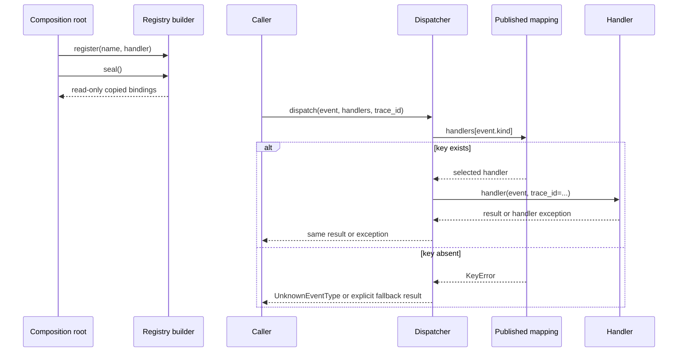

# SDP-PYT-020 — Dispatch tables, dictionaries of callables, and registries

## Physical Notebook Core

### Problem or change pressure

A stable workflow receives a name such as `record.created`, but new named behaviors keep adding
branches. Selection, execution, missing-name policy, and extension ownership become tangled.

### One-sentence mental model

> Map an explicit key to one compatible callable; add a registry only when the mapping needs an
> owner, validation rules, or a lifecycle.

### One essential visual

```text
request.kind ──► handlers[kind] ──► selected handler ──► result
                    │
                    └── missing-key policy

startup entries ──► registry builder ── seal ──► read-only name bindings
```

### How to read this visual

Read the top line left to right: choose a callable, then call it. The lower line shows an optional
startup boundary that controls how the mapping is assembled and published.

### Key insight

A dispatch table replaces repeated selection branches. A registry adds policy around the table;
neither one defines handler correctness, safe retries, or plugin trust.

### Simplification or limitation

This is a conceptual collaboration view, not CPython memory layout. It omits handler state,
exceptions after effects, concurrency, and process boundaries.

### Governing rules or invariants

1. Use one unambiguous, hashable key and one compatible calling contract.
2. Keep lookup failure translation narrower than handler execution failure.
3. Define duplicate, fallback, ordering, mutation, and publication policies explicitly.

### Minimal Python example

```python
from collections.abc import Callable, Mapping

Handler = Callable[[str], str]


class UnknownKind(LookupError):
    pass


def dispatch(kind: str, payload: str, handlers: Mapping[str, Handler]) -> str:
    try:
        handler = handlers[kind]
    except KeyError:
        raise UnknownKind(kind) from None
    return handler(payload)
```

### One common misconception

**Mistake:** A dictionary of functions is automatically an extensible plugin architecture.

**Correction:** It is a local selection mechanism. A plugin boundary additionally needs discovery,
trust, compatibility, failure isolation, ownership, and deployment policy.

### Important trade-offs

- A small mapping makes named selection visible; it can hide policy if mutation and fallback are
  left implicit.
- A controlled registry makes startup rules testable; it is needless ceremony for two stable
  local branches.

### Interview-revision cues

- Is the key exact, type-based, predicate-based, or ordered by priority?
- Who registers, when does registration close, and what happens on duplicates or misses?
- Would `if`, `match`, direct dependency passing, or receiver polymorphism be clearer?

## Unit metadata

| Field | Value |
|---|---|
| Domain | Pythonic design mechanisms |
| Curriculum | [SDP-PYT-020](../../../CURRICULUM.md#sdp-pyt-020) |
| Progress | [PROGRESS.md](../../../PROGRESS.md) |
| Python references | [PYTHON_REFERENCES.md](../../../PYTHON_REFERENCES.md) |
| Learning outcome | Replace brittle conditional dispatch with explicit callable maps or registries while controlling defaults, ordering, and extension boundaries. |
| Hard prerequisites | [SDP-FND-030](../../../CURRICULUM.md#sdp-fnd-030), [SDP-PYT-010](../../../CURRICULUM.md#sdp-pyt-010) |
| Soft prerequisites | [PY-BLT-050](https://github.com/rahulyadev/python-mastery/blob/main/CURRICULUM.md#py-blt-050), [PY-BLT-080](https://github.com/rahulyadev/python-mastery/blob/main/CURRICULUM.md#py-blt-080) |
| Priority | Core |
| Interview frequency | High |
| Production frequency | High |
| Python/backend relevance | High |
| Depth | D2 |
| Scope | Python, Idiom |
| Size | L |
| First understanding | 4–6 h |
| Hands-on practice | 5–9 h |
| Evidence profile | E+I+D+T |
| Canonical Python | Python 3.14 |
| Interview compatibility | Python 3.11 |
| Artifact state | Draft |

The frequency labels are curriculum judgments, not measured statistics. The two supplementary
experiments do not change the evidence profile. Material validation is recorded in
[VALIDATION.md](VALIDATION.md); it does not establish learner progress.

## 1. Simple explanation and prerequisite bridge

A shopkeeper can find a labeled drawer directly instead of asking a chain of questions:
“Is this A? Is this B? Is this C?” A dispatch table does the same for behavior. The label is a key;
the drawer contains a callable.

```python
handlers = {
    "created": handle_created,
    "deleted": handle_deleted,
}
handler = handlers[event.kind]  # selection
result = handler(event)  # execution
```

That code has two moments. Lookup can fail because the name is absent. The chosen handler can fail
for its own reasons. Treating those as one failure produces misleading diagnostics.

The minimum bridge from **SDP-FND-030** is dependency direction: the dispatcher should depend on a
small handler contract, not import every concrete behavior into its stable logic. From
**SDP-PYT-010**, retain a callable with `handler = fn`; use `handler(event)` only when execution is
intended. The tracker marks both prerequisite artifacts Approved but their learning states Not
started, so no retained knowledge is assumed.

The Python Mastery bridge is soft: dictionary keys must be hashable; equality and hashing decide
which keys denote the same entry; dictionaries preserve insertion order. String keys keep this
unit simple. [Python 3.14 dictionary contract](https://docs.python.org/3.14/library/stdtypes.html#mapping-types-dict)
and [hashable glossary entry](https://docs.python.org/3.14/glossary.html#term-hashable).

Study in this order: this note → [worked demo](examples/run_dispatch_demo.py) →
[interactive visual](visuals/README.md) →
[exception-boundary experiment](experiments/EXP-01-exception-boundary/README.md) →
[registry-lifecycle experiment](experiments/EXP-02-registry-lifecycle/README.md) →
[unsolved practice](practice/README.md). Predict before opening observed results.

## 2. Real problem and forces

The worked example routes synthetic backend events. It performs no network, database, queue, or
framework operation.

| Concern | Promise or change |
|---|---|
| Stable dispatcher | Route one event by its exact `kind`. |
| Current behaviors | Index created records; archive deleted records. |
| New deployment | Enable or omit trusted handlers during startup. |
| Duplicate safety | Reject an ambiguous repeated name. |
| Missing name | Reject by default; use a fallback only when the caller chooses one. |
| Handler failure | Preserve the selected handler's exception. |
| Ordering | Preserve registration order for diagnostics, not precedence. |
| Publication | Consumers cannot mutate accepted name bindings. |
| State | Publication does not freeze state inside a callable object. |

The change pressure is not “conditionals are always bad.” The pressure appears when one stable
selection point changes for every new named operation, different deployments enable different
sets, or accidental overwrites and global registration order become production risks.

## 4. Formal mechanics, after the intuition

### Dispatch table

A **dispatch table** is a mapping from a dispatch key to an operation. In this unit the operation is
a Python callable. Direct lookup chooses one value; calling that value performs the behavior.

This is a design-level term, not a claim about interpreter internals. Python itself uses many forms
of dispatch, but our table is ordinary application data.

### Dictionary of callables

A **dictionary of callables** is the smallest concrete Python form:

```python
handlers: dict[str, Handler] = {
    "record.created": index_created,
    "record.deleted": archive_deleted,
}
```

Dictionary subscription returns the value for a present key and raises `KeyError` for an absent
key. Keys are hashable values. Dictionaries preserve insertion order on both supported baselines;
the guarantee has applied since Python 3.7.
[Python 3.14 mapping documentation](https://docs.python.org/3.14/library/stdtypes.html#mapping-types-dict).

These facts do **not** establish:

- that the value accepts the intended arguments;
- that it returns the intended type at runtime;
- that two handlers have compatible effects or error behavior;
- that iteration order means business priority;
- that mutation is safe while requests are running; or
- that an external extension is trusted.

### Registry

A **registry** is a named collection plus policy. Useful registry questions are:

| Policy question | Example answer in this unit |
|---|---|
| Who may add entries? | The composition root through one builder. |
| When? | During startup, before publication. |
| Which names are valid? | Nonblank, no surrounding whitespace, exact case. |
| What about duplicates? | Reject both same-value and different-value duplicates. |
| What does a miss mean? | Raise `UnknownEventType` unless a fallback is explicitly supplied. |
| May consumers mutate it? | No; they receive read-only copied bindings. |
| Does order select a winner? | No; it is diagnostic order only. |
| Are handlers frozen? | No; callable-state ownership is separate. |

A registry need not be a global object, class decorator, metaclass, service locator, or plugin
manager. Those are additional choices with different costs.

### Calling contract

The worked `Handler` is a callback `Protocol` because `trace_id` is keyword-only:

```python
class Handler(Protocol):
    def __call__(self, event: Event, /, *, trace_id: str) -> str: ...
```

`Callable[[Event, str], str]` cannot express that keyword-only shape. Callback protocols cover
parameter kinds and names that the short `Callable` form cannot express.
[Typing specification: callback protocols](https://typing.python.org/en/latest/spec/callables.html#callback-protocols).

Static analysis can reject incompatible annotated code. It does not validate arbitrary objects
loaded from untrusted runtime configuration, prove behavioral compatibility, or replace contract
tests.

## 5. Participants and responsibilities

| Participant | Responsibility | What it must not own |
|---|---|---|
| Composition root | Choose trusted entries and own the registration window. | Per-event business work. |
| Registry builder | Validate names, reject duplicates, and publish bindings once. | Discovery, retries, or handler internals. |
| Published mapping | Answer exact name lookups without consumer mutation. | Handler-state immutability. |
| Resolver | Translate a missing mapping key under explicit fallback policy. | Exceptions raised by a selected handler. |
| Dispatcher | Resolve, then invoke the handler with the agreed call shape. | Concrete handler branches. |
| Handler | Process one event and honor result, effect, and error contracts. | Registry lifecycle. |
| Caller | Supply event, trace context, and optional fallback. | Hidden global selection. |

## 6. Collaboration and execution flow



### How to read this visual

First follow startup from the composition root to the published mapping. Then follow one request.
The `alt` block separates a lookup miss from selected-handler execution.

### Key insight

The dispatcher does not ask which concrete handler class exists. It asks the supplied mapping for
one callable under an explicit key, then invokes that callable outside the missing-key catch.

### Simplification or limitation

This is conceptual synchronous flow. It does not show stack frames, thread scheduling, async
cancellation, effects before failure, plugin loading, or cross-process delivery.

The companion [dispatch boundary explorer](visuals/dispatch-boundary.html) lets you compare a hit,
a miss, and a handler `KeyError` against fixed Python observations.

## 7. Before-pattern code and concrete pain

For two stable cases, this is reasonable:

```python
def handle(event: Event, *, trace_id: str) -> str:
    if event.kind == "record.created":
        return index_created(event, trace_id=trace_id)
    if event.kind == "record.deleted":
        return archive_deleted(event, trace_id=trace_id)
    raise UnknownEventType(event.kind)
```

Do not refactor merely because it contains `if`. The pain becomes concrete when each deployment
enables a different handler set, startup code must reject duplicates, or the same conditional is
copied into validation, diagnostics, and execution.

A weak refactoring moves the branches into a giant factory whose internals still change for every
handler. Another weak refactoring creates one subclass per function but leaves selection policy
hidden in global imports.

## 8. Minimal Pythonic implementation

The executable version is in [dispatch_tools.py](examples/dispatch_tools.py). Its core is small:

```python
def resolve_handler(
    name: str,
    handlers: Mapping[str, Handler],
    *,
    fallback: Handler | None = None,
) -> Handler:
    try:
        return handlers[name]
    except KeyError:
        if fallback is not None:
            return fallback
        raise UnknownEventType(f"unsupported event type: {name}") from None


def dispatch(
    event: Event,
    handlers: Mapping[str, Handler],
    *,
    trace_id: str,
    fallback: Handler | None = None,
) -> str:
    handler = resolve_handler(event.kind, handlers, fallback=fallback)
    return handler(event, trace_id=trace_id)
```

Every seam has one reason:

- `Mapping` lets the dispatcher read without demanding a mutable concrete `dict`.
- `Handler` states the full call shape.
- `resolve_handler` owns only name selection and miss translation.
- `dispatch` owns invocation.
- `fallback=None` means rejection; one explicitly supplied fallback is still a handler.

The code does not catch a handler exception, retry, log, normalize the key, deduplicate events, or
claim an effect was rolled back.

## 9. Typed production-oriented registration boundary

When startup assembly has policy, the [worked builder](examples/dispatch_tools.py) earns a small
object:

```python
class RegistryBuilder:
    def __init__(self) -> None:
        self._handlers: dict[str, Handler] = {}
        self._published: Mapping[str, Handler] | None = None

    def register(self, name: str, handler: Handler) -> None:
        if self._published is not None:
            raise RegistrySealed("registry is sealed")
        validate_name(name)
        if name in self._handlers:
            raise ValueError(f"duplicate handler: {name}")
        self._handlers[name] = handler

    def seal(self) -> Mapping[str, Handler]:
        if self._published is None:
            self._published = MappingProxyType(dict(self._handlers))
        return self._published
```

The actual helper name is private (`_validate_handler_name`); it is expanded here only to keep the
excerpt readable. `dict(...)` creates separate name bindings before `MappingProxyType` exposes a
read-only view. A proxy by itself is dynamic: if some code can mutate its backing mapping, the proxy
reflects the change. [Python 3.14 `MappingProxyType`](https://docs.python.org/3.14/library/types.html#types.MappingProxyType).

This boundary is appropriate for trusted in-process assembly. Python's underscore convention and
read-only proxy are not a security sandbox against hostile code.

## 10. Choose the smallest useful form

| Mechanism | Best fit | Main warning |
|---|---|---|
| Direct call | One behavior is fixed. | Do not invent selection. |
| `if` / `elif` | Few stable cases need different local setup or readable guards. | Branches may spread as names grow. |
| `match` | Destructuring data and guarded cases matter. | It remains closed conditional selection. |
| Local dictionary of callables | Exact stable keys choose compatible local behavior. | Duplicate and mutation policy may be implicit. |
| Explicit registry builder | Startup configuration needs validation, ownership, and publication. | Adds lifecycle concepts and tests. |
| Passed callable | Caller already knows the behavior. | A name lookup is unnecessary. |
| Receiver polymorphism | The operation naturally belongs to an object selected elsewhere. | Selection still exists somewhere. |
| Ordered predicate rules | Conditions overlap and first-match priority is real. | A key dictionary cannot express precedence. |
| `singledispatch` | Behavior varies by first argument's runtime type. | It does not dispatch by event name. |
| Plugin discovery | Independently installed packages must be found and governed. | Far beyond a local registry. |

The dictionary is an idiom and mechanism. It may implement Strategy-like selection or command
routing, but the collaboration—not the braces—determines the pattern name.

## 11. Refactoring path

1. Characterize existing outputs, exceptions, effect order, and input consumption.
2. Identify the one value that truly selects behavior.
3. Give candidate handlers one honest calling contract.
4. Extract selection from execution without changing externally visible behavior.
5. Start with a local literal or explicitly passed mapping.
6. Add one new handler without changing the stable dispatcher.
7. Introduce a registry owner only when duplicate, validation, or lifecycle policy is required.
8. Narrow exception translation to lookup.
9. Publish stable bindings before concurrent request handling, when that is the chosen lifecycle.
10. Remove old branches and speculative extension machinery after tests pass.

The [practice lab](practice/README.md) keeps the original `if/elif` version runnable so Rahul can
preserve an attempt before designing these boundaries.

## 12. Realistic backend use case

An ingestion service receives trusted event envelopes whose `kind` chooses an in-process handler.
At application startup, the composition root imports enabled local handlers, registers exact names,
seals the mapping, and passes it to the request or consumer loop. Request code dispatches through
that explicit dependency.

This design can make useful operational facts visible:

- the configured handler names at startup;
- the exact requested name and selected name;
- whether fallback policy was used;
- handler duration and outcome under a trace identifier; and
- duplicate or invalid configuration before traffic begins.

It does not make an event durable, idempotent, authorized, schema-compatible, transactional, or
safe to retry. Those require explicit boundaries beyond dispatch.

## 13. Failure scenarios

### Broad `KeyError` translation

```python
try:
    return handlers[event.kind](event, trace_id=trace_id)
except KeyError:
    raise UnknownEventType(event.kind)
```

If the selected handler reads a missing payload field, its `KeyError` is falsely reported as an
unknown event kind. The [exception experiment](experiments/EXP-01-exception-boundary/README.md)
demonstrates this with exception identity.

### Silent duplicate overwrite

Ordinary dictionary assignment replaces an existing equal key. That is useful general behavior,
but ambiguous registration usually deserves rejection. Build from ordered entries and check before
assignment when duplicate provenance matters.

### Live read-only view mistaken for snapshot

`MappingProxyType(source)` blocks writes through the proxy but observes later changes to `source`.
Copy first when the owner promises separate stable bindings. Copying is shallow; the handler
objects are still shared references.

### Helpful fallback that hides configuration errors

A catch-all handler can keep processing alive while silently quarantining misspelled keys. Make the
fallback an explicit caller decision, preserve the original kind, and observe fallback use.

### Global decorator registry

Import order now changes application configuration, tests share mutable state, duplicate ownership
is unclear, and importing a module performs registration. That can be justified in a deliberately
designed framework, but it is not the safe default for this local problem.

## 14. Testing strategy

| Test type | What it proves | What not to overspecify |
|---|---|---|
| Characterization | Old names, outputs, input order, failure timing. | The old branch layout. |
| Handler contract | Compatible arguments, return behavior, exceptions, and effects. | Function versus callable class. |
| Registry policy | Name validation, duplicates, publication, and independent owners. | Private dictionary field names. |
| Dispatch unit | Exact selection, explicit fallback, one call, and exception identity. | Concrete mapping implementation. |
| Integration | Composition root supplies intended enabled handlers. | Unrelated framework startup internals. |
| Concurrency/lifecycle | Reconfiguration policy under the real execution model. | Assumed safety from a read-only type hint. |

Important cases in [test_dispatch_tools.py](examples/test_dispatch_tools.py) include blank and
padded names, duplicate registration, exact case, one-pass entries, read-only publication,
independent builders, order and duplicates, explicit fallback, a failing source, and a handler's
caller-created exception object.

Behavioral tests should ask “which result, exception, effect, and consumption boundary?” A test
that asserts `type(registry) is MappingProxyType` would overspecify the implementation when another
read-only mapping could honor the same contract.

## 15. Observability and debugging

Log or measure at the boundary that owns the fact:

| Fact | Owning boundary |
|---|---|
| Accepted names and duplicate rejection | Composition root / registry builder |
| Requested dispatch key | Dispatcher |
| Missing key or fallback use | Resolver |
| Handler identity suitable for operations | Registration metadata, not `repr` guesses |
| Duration, success, and failure | Invocation wrapper around the selected handler |
| Effect result | Handler or effect boundary |

Do not log private payloads merely because they are available. Preserve causal exception context
when adding operational metadata; do not rewrite every handler failure as routing failure.

For diagnosis, first ask:

1. Was the expected name registered in this process?
2. Did the request provide the exact key?
3. Was a fallback selected?
4. Did lookup fail, or did the selected handler fail?
5. Did mutable handler state or runtime reconfiguration change behavior?

## 16. Concurrency and state safety

The worked builder is for sequential startup. Publishing after assembly avoids concurrent mutation
through the intended API. It does not prove that handlers are stateless or safe for overlapping
calls.

Python documents that iterating dictionary views while adding or deleting entries may raise
`RuntimeError` or fail to visit every entry. That is one reason not to treat uncontrolled live
mutation as a reconfiguration design.
[Python dictionary view behavior](https://docs.python.org/3.14/library/stdtypes.html#dictionary-view-objects).

If runtime updates are real, choose and test a policy such as:

- replace one immutable snapshot under synchronization;
- copy-on-write with request-scoped snapshot capture;
- versioned configuration and controlled drain; or
- one owner task that serializes updates.

Those designs need their actual thread, task, and process model. The GIL is not a registry lifecycle
contract, and multiple worker processes do not automatically share an in-memory table.

## 17. Performance and memory limits

The dispatch path adds one mapping lookup before one callable invocation. This unit makes no timing
or memory claim; no benchmark was run. For two stable cases, clarity can favor direct branches.
For many exact names, a mapping usually expresses intent and diagnostics more directly.

Real bottlenecks are often handler I/O, serialization, validation, or retry behavior. Measure the
actual workload before replacing clear dispatch code with generated functions, caches, or custom
hash structures. A registry retains references to its handlers for at least the registry's
lifetime; large captured objects and resource-owning callables therefore require an ownership
decision.

## 18. Defaults, ordering, and variants

### Missing-name policies

| Policy | Use when | Risk |
|---|---|---|
| Reject | Unknown means invalid configuration or unsupported input. | Caller must handle failure. |
| Explicit fallback | Unknown input has a deliberate quarantine or generic path. | Typos can be hidden without metrics. |
| No-op | Ignoring is an explicit domain promise. | Silent loss is easy to create. |
| Dead-letter / preserve | Later inspection or replay is required. | Storage and replay semantics are separate. |

Do not let `dict.get(name)` returning `None` accidentally decide policy. A legitimate callable
cannot be `None` under this contract, but an explicit branch still communicates the choice.

### Ordering

Insertion order affects iteration, diagnostics, and presentation. Exact dictionary lookup does not
scan candidates in that order. If several predicates can match and the first should win, model an
ordered rule sequence with explicit precedence and ambiguity tests.

### Construction variants

- **Literal:** best for a fixed local set.
- **Factory function:** validates an iterable and returns an owned mapping.
- **Builder then seal:** useful when several startup modules contribute entries under one owner.
- **Runtime mutable registry:** justified only with an explicit synchronization and consistency
  model.
- **Discovered plugins:** separate unit with package metadata, trust, versioning, and import
  boundaries.

## 19. Related units and scope boundaries

| Related unit | Relationship | Key difference |
|---|---|---|
| [SDP-FND-030](../../../CURRICULUM.md#sdp-fnd-030) | Prerequisite | Explains coupling and dependency direction generally. |
| [SDP-PYT-010](../../../CURRICULUM.md#sdp-pyt-010) | Prerequisite mechanism | Explains functions and callable objects before named selection. |
| [SDP-PYT-080](../../../CURRICULUM.md#sdp-pyt-080) | Alternative dispatch | `singledispatch` selects by first-argument type. |
| [SDP-PYT-090](../../../CURRICULUM.md#sdp-pyt-090) | Later extension mechanics | Adds discovery, imports, plugin contracts, and duplicate handling across packages. |
| [SDP-SOL-020](../../../CURRICULUM.md#sdp-sol-020) | Design principle | Evaluates whether this is an earned stable extension point. |
| [SDP-CRE-010](../../../CURRICULUM.md#sdp-cre-010) | Frequent combination | A registry may choose a factory that creates an object. |
| [SDP-BEH-010](../../../CURRICULUM.md#sdp-beh-010) | Strategy comparison | Strategy varies an algorithm; a key map is one selection mechanism. |
| [SDP-BEH-050](../../../CURRICULUM.md#sdp-beh-050) | Command comparison | A table may route command names; Command adds an operation role and often state. |
| [SDP-APP-030](../../../CURRICULUM.md#sdp-app-030) | Application use | Service-layer dispatch coordinates use cases and boundaries. |

## 20. When to use it

- One exact value chooses among several compatible operations.
- New named handlers should not change the stable dispatch function.
- Configuration or a composition root owns which trusted handlers are enabled.
- Duplicate names, missing names, and publication timing need testable rules.
- Diagnostics benefit from enumerating the accepted names.

## 21. When not to use it

- One direct function call already expresses the requirement.
- Two stable branches are clearer and carry different local data.
- Selection depends on overlapping predicates or priority, not exact keys.
- Behavior naturally belongs to an already-selected receiver.
- The variation is by Python type and `singledispatch` is the honest mechanism.
- The real requirement is external plugin discovery, durable messaging, or a workflow state
  machine; a local mapping is insufficient.

## 22. Common misuse and overengineering

| Misuse | Why it hurts | Better move |
|---|---|---|
| Replace every `if` with a dictionary | Hides readable local control flow. | Refactor only under real named variation. |
| Global mutable registry | Hidden dependency and cross-test leakage. | Build per application and pass explicitly. |
| Decorator import side effects by default | Import order becomes configuration. | Register visibly in the composition root. |
| Silent last-write-wins duplicates | Ambiguous ownership and hard-to-find overrides. | Reject or document an intentional override policy. |
| Broad `except KeyError` | Mislabels handler bugs as lookup misses. | End the catch before invocation. |
| Catch-all fallback for all errors | Hides handler failure and may duplicate effects. | Fallback only on a missing key. |
| Treat insertion order as priority | Exact lookup has no precedence scan. | Use an ordered rule model. |
| `Callable[..., object]` everywhere | Erases the useful call contract. | Use a narrow `Callable` or callback `Protocol`. |
| “Frozen” mapping with stateful handlers | Overclaims immutability and safety. | State the binding and handler-state policies separately. |
| Registry plus factory plus ABC for two functions | More navigation than change pressure. | Keep a local mapping or direct call. |

## 23. Interview preparation

Begin with one question: **“When is a dictionary of callables clearer than `if/elif`, and what
does a registry add?”** Wait for the answer.

A strong answer identifies exact-key selection, the callable contract, the separate invocation,
duplicate and fallback policy, lifecycle ownership, alternatives, and failure scope. It does not
claim that dictionary lookup makes behavior open for modification-free deployment or safe plugins.

### Common formulations

1. Refactor a growing event-type conditional without building a class hierarchy.
2. Design a registry that cannot silently overwrite handlers.
3. Explain why a selected handler's `KeyError` must not become “unknown event type.”
4. Compare a string dispatch table with `match`, Strategy, and `singledispatch`.
5. Diagnose tests that pass alone but fail because a global registry leaks state.

### Weak-answer traps

- “Dictionaries are always O(1), so this is automatically faster.”
- “A mapping proxy makes all handlers immutable.”
- “Insertion order is handler priority.”
- “A decorator registry is open/closed and therefore needs no ownership policy.”
- “Catching `KeyError` handles unknown names safely.”
- “A type annotation verifies plugins at runtime.”

### Likely follow-ups

Ask only the next missing reasoning step:

1. What if two modules register the same name?
2. What if a handler itself raises `KeyError`?
3. What if registrations change while requests are active?
4. What if the same callable object has mutable state?
5. What if packages are installed independently?
6. What if an unknown event must be preserved for later replay?

## 24. Closed-book revision cues

1. Reconstruct key → lookup → selected callable → invocation → result.
2. State the five registry policies: name, duplicate, miss, order, lifecycle.
3. Explain why lookup and invocation need different exception boundaries.
4. Choose among `if`, `match`, mapping, registry, predicate list, and `singledispatch`.
5. Refactor the independent lab without weakening old behavior.
6. Explain why read-only bindings do not freeze callable state.
7. Reject a global decorator registry for one concrete reason.
8. Name the extra concerns that turn a registry into a plugin system.

Publication of this artifact makes `SDP-PYT-030` ready for initialization. It does not prove any
of these retrieval cues or the practice exercise were completed.

## 25. Vocabulary and professional English

### Dispatch

| Item | Content |
|---|---|
| Pronunciation | dih-SPATCH |
| Simple English meaning | Send work to the place that should handle it. |
| Hindi cue | सही जगह काम भेजना |
| Design meaning | Select and invoke behavior according to an explicit rule. |

Natural examples:

1. The office dispatches parcels every afternoon.
2. The coordinator dispatched the issue to the database team.
3. This function dispatches events by exact kind.
4. **Interview:** Separate dispatch-key lookup from handler execution.

### Register

| Item | Content |
|---|---|
| Pronunciation | REJ-uh-ster |
| Simple English meaning | Add a named item to an official list. |
| Hindi cue | सूची में दर्ज करना |
| Design meaning | Bind a validated name to a handler under an owner's policy. |

Natural examples:

1. Please register before the workshop.
2. The clinic registered the new appointment.
3. Startup code registers the enabled handlers.
4. **Engineering discussion:** Reject duplicate registration before serving traffic.

### Fallback

| Item | Content |
|---|---|
| Pronunciation | FAWL-bak |
| Simple English meaning | A backup choice used when the main choice is unavailable. |
| Hindi cue | वैकल्पिक सहारा |
| Design meaning | Deliberate behavior for an unrecognized dispatch key. |

Natural examples:

1. The paper map is our fallback if the phone battery dies.
2. We need a fallback venue in case of rain.
3. The caller supplies a quarantine handler as the fallback.
4. **Interview:** A fallback can hide misspelled configuration unless its use is visible.

### Ambiguous

| Item | Content |
|---|---|
| Pronunciation | am-BIG-yoo-us |
| Simple English meaning | Open to more than one interpretation. |
| Hindi cue | अस्पष्ट |
| Design meaning | A registration or contract with no single defensible meaning. |

Natural examples:

1. The instruction was ambiguous.
2. Two owners gave ambiguous priorities.
3. A duplicate handler name makes ownership ambiguous.
4. **Engineering discussion:** Reject the configuration instead of choosing an ambiguous winner.

## 26. Python Mastery references

These exact links come from [PYTHON_REFERENCES.md](../../../PYTHON_REFERENCES.md). They are navigation
references; their external lesson contents were not reviewed for this artifact.

- Soft bridge: [PY-BLT-050 — Dictionaries and mapping behaviour](https://github.com/rahulyadev/python-mastery/blob/main/CURRICULUM.md#py-blt-050).
  Know subscription, missing keys, mutation, views, and insertion order.
- Soft bridge: [PY-BLT-080 — Equality, ordering, hashing, and hashability](https://github.com/rahulyadev/python-mastery/blob/main/CURRICULUM.md#py-blt-080).
  Know why equal keys share one mapping entry and why mutable containers are unsuitable keys.

These are soft prerequisites. The simple string-key bridge above is sufficient to begin.

## 27. Authoritative sources

Read on **2026-09-05**. Explanations, diagrams, code, scenarios, and exercises are original and
synthetic.

1. [Python 3.14 built-in mapping types](https://docs.python.org/3.14/library/stdtypes.html#mapping-types-dict) — hashable keys, subscription, missing-key behavior, insertion order, and dynamic views.
2. [Python 3.14 glossary: hashable](https://docs.python.org/3.14/glossary.html#term-hashable) — equality/hash requirements and dictionary-key suitability.
3. [Python 3.14 `MappingProxyType`](https://docs.python.org/3.14/library/types.html#types.MappingProxyType) — dynamic read-only mapping views.
4. [Python 3.14 `collections.abc.Mapping`](https://docs.python.org/3.14/library/collections.abc.html#collections.abc.Mapping) — read-facing mapping abstraction.
5. [Typing specification: callables and callback protocols](https://typing.python.org/en/latest/spec/callables.html) — callable assignability and keyword-aware callback contracts.

## 28. Maintainer experiments

| Experiment | Question | Boundary |
|---|---|---|
| [EXP-01](experiments/EXP-01-exception-boundary/README.md) | Can broad `KeyError` handling distinguish lookup failure from handler failure? | Exception scope and identity. |
| [EXP-02](experiments/EXP-02-registry-lifecycle/README.md) | What does read-only publication stabilize? | Binding ownership versus callable state. |

Both record hypothesis, environment, command, actual output, interpretation, and limitations. They
are maintainer evidence only.

## 29. Durable clarification log

| Date | Clarification | Why it belongs in canonical notes | Source or evidence |
|---|---|---|---|
| 2026-09-05 | Lookup and selected-handler execution need separate exception boundaries. | Prevents payload/configuration bugs from being mislabeled as unknown dispatch keys. | [Exception-boundary experiment](experiments/EXP-01-exception-boundary/README.md). |
| 2026-09-05 | Read-only name bindings do not freeze stored callable state. | Prevents overclaiming immutability and concurrency safety. | [Registry-lifecycle experiment](experiments/EXP-02-registry-lifecycle/README.md). |
| 2026-09-05 | Dictionary insertion order is diagnostic order, not dispatch priority. | Prevents exact-key lookup from being confused with first-match rule evaluation. | [Python mapping documentation](https://docs.python.org/3.14/library/stdtypes.html#mapping-types-dict) and worked tests. |
