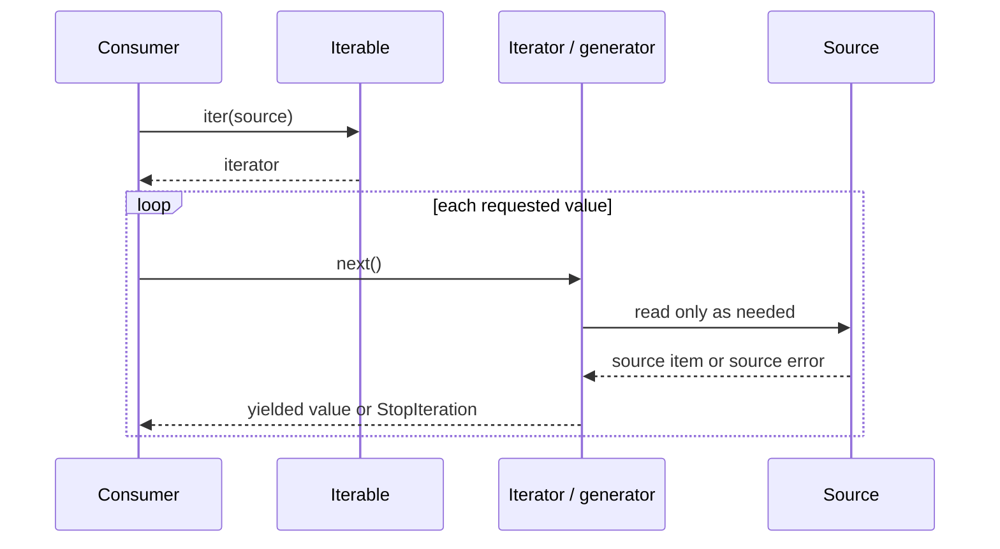

# SDP-PYT-040 — Iterators, generators, and context managers as language-supported patterns

## Physical Notebook Core

### Problem or change pressure

A producer may be large, infinite, expensive, or one-pass, while a resource must be released on
every exit path. Eager collections and repeated handwritten cleanup couple traversal, timing, and
lifetime.

### One-sentence mental model

> An iterator answers “give me the next value”; a context manager answers “what must happen around
> this block?”

### One essential visual

```text
consumer ── next() ──► iterator/generator ──► value or StopIteration
                           │
                           └── suspended traversal state

with manager as resource:
     __enter__() ──► body ──► __exit__(exception state) ──► propagate/suppress
```

### How to read this visual

Read the top line once per requested item; the producer advances only on demand. Read the lower
line once per block; successful entry establishes exactly one later exit call.

### Key insight

Python protocols already supply the stable collaboration. Most code needs a generator function or
`contextlib.contextmanager`, not textbook iterator or resource-guard class hierarchies.

### Simplification or limitation

This is conceptual synchronous control flow, not CPython frames or memory layout. It omits async
scheduling, cancellation, cleanup failure, threads, external transactions, and process boundaries.

### Governing rules or invariants

1. An iterator returns itself from `iter(...)`, yields one pass, and stays exhausted after
   `StopIteration`.
2. Calling a generator function creates a generator iterator; its body begins only when advanced.
3. If `__enter__()` returns successfully, `__exit__()` is called; a truthy exit result suppresses a
   body exception.
4. Laziness does not guarantee cleanup, bounded memory, replay, thread safety, or retry safety.

### Minimal Python example

```python
from collections.abc import Iterable, Iterator
from contextlib import contextmanager


def selected(rows: Iterable[str]) -> Iterator[str]:
    for row in rows:
        if row.startswith("important:"):
            yield row


@contextmanager
def managed(resource):
    try:
        yield resource
    finally:
        resource.close()
```

### One common misconception

**Mistake:** A generator is a reusable collection that also guarantees resource cleanup.

**Correction:** A generator object is normally a one-shot iterator. Cleanup needs an explicit
owner and lifetime; keep resource-dependent iteration inside a `with` block or close it
deterministically.

### Important trade-offs

- Laziness can reduce unnecessary work and peak retained data, but moves effects and failures to
  consumption time.
- A context manager centralizes exit policy, but can hide dangerous suppression or cleanup
  failures if its contract is unclear.

### Interview-revision cues

- Does the API promise a reusable iterable or return a one-shot iterator?
- When does source work begin, where can an exception appear, and who drives the iterator?
- Who owns cleanup, and should `__exit__()` propagate or deliberately suppress this exception?
- Would a list, ordinary loop, `try/finally`, or existing resource context be clearer?

## Unit metadata

| Field | Value |
|---|---|
| Domain | Pythonic design mechanisms |
| Curriculum | [SDP-PYT-040](../../../CURRICULUM.md#sdp-pyt-040) |
| Progress | [PROGRESS.md](../../../PROGRESS.md) |
| Python references | [PYTHON_REFERENCES.md](../../../PYTHON_REFERENCES.md) |
| Learning outcome | Recognize where Python’s protocols make explicit Iterator or resource-management pattern classes unnecessary. |
| Hard prerequisites | [SDP-FND-060](../../../CURRICULUM.md#sdp-fnd-060), [SDP-PYT-010](../../../CURRICULUM.md#sdp-pyt-010) |
| Python mechanism bridge | [PY-FIT-070](https://github.com/rahulyadev/python-mastery/blob/main/CURRICULUM.md#py-fit-070), [PY-FIT-080](https://github.com/rahulyadev/python-mastery/blob/main/CURRICULUM.md#py-fit-080), [PY-FIT-090](https://github.com/rahulyadev/python-mastery/blob/main/CURRICULUM.md#py-fit-090) (Hard); [PY-ERR-030](https://github.com/rahulyadev/python-mastery/blob/main/CURRICULUM.md#py-err-030) (Soft) |
| Priority | Core |
| Interview frequency | High |
| Production frequency | High |
| Python/backend relevance | High |
| Depth | D3 |
| Scope | Python, Protocols |
| Size | L |
| First understanding | 4–6 h |
| Hands-on practice | 5–9 h |
| Evidence profile | E+I+D+X+T |
| Canonical Python | Python 3.14 |
| Interview compatibility | Python 3.11 |
| Artifact state | Draft |

The frequency labels are curriculum judgments, not measured statistics. Artifact creation and
maintainer tests do not advance the learning state. Material verification is recorded in
[VALIDATION.md](VALIDATION.md).

## 1. Simple explanation and prerequisite bridge

Imagine a warehouse worker standing beside a long conveyor belt. The worker does not demand that
every parcel be unloaded into a room first. They ask for the next parcel, inspect it, and may stop.
That is the useful mental model for iteration: the consumer controls demand, while the iterator
remembers where traversal paused.

Now imagine a key-controlled storage cage. Entering the cage acquires access. Leaving must return
the key whether the work succeeded, raised an error, or returned early. That is the context-manager
mental model: block-shaped entry and exit policy.

The minimum bridge from **SDP-FND-060** is protocol-driven polymorphism: `for` and `with` invoke
behaviour promised by special methods instead of branching on each concrete producer or resource.
The minimum bridge from **SDP-PYT-010** is suspended callable execution: a generator function is
called to create an iterator, while repeated advancement resumes its body. The tracker does not
claim these prerequisites are learned, so this unit assumes no retained recall.

The Python Mastery hard bridge is small but essential:

- an **iterable** can supply an iterator with `iter(...)`;
- an **iterator** supplies successive values with `next(...)` and signals exhaustion with
  `StopIteration`;
- `yield` suspends a generator while preserving its local execution state; and
- a lazy pipeline performs work when driven, not merely when described.

The soft context-manager bridge is `with`, `__enter__`, `__exit__`, and the generator-based
`@contextmanager` helper. These mechanisms are reviewed below rather than copied from the separate
Python curriculum.

Study in this order: this note → [worked demo](examples/run_streaming_demo.py) →
[interactive visual](visuals/README.md) →
[laziness experiment](experiments/EXP-01-laziness-and-exhaustion/README.md) →
[exit-policy experiment](experiments/EXP-02-context-exit-policy/README.md) →
[unsolved lab](practice/README.md). Predict before reading observed experiment output.

## 2. Real problem and forces

The worked example processes synthetic backend alert lines. It has no real database, file,
network, queue, transaction, or web framework.

| Concern | Promise or change |
|---|---|
| Source | It may be large, one-pass, slow, or capable of failing between values. |
| Consumer | It may need all values, one value, a bounded batch, or an early stop. |
| Traversal state | The next position must live somewhere without leaking into business code. |
| Transformation | Parse and filter values without eagerly retaining the entire source. |
| Error timing | Parsing and source errors appear when the relevant value is requested. |
| Resource | A sink must close on normal completion and body failure. |
| Ownership | One boundary must say who acquires, drives, and releases the resource. |
| Compatibility | Code must run on Python 3.14 and the Python 3.11 interview baseline. |
| Testing | Demand, over-read, exhaustion, exit, suppression, and propagation must be observable. |

An eager list is often the best answer for small bounded data. The pressure appears when full
materialization wastes work or memory, hides a one-pass source, delays the first result, or makes
early stopping impossible. A plain `try/finally` is also correct when cleanup occurs once. The
context-manager pressure appears when the same acquisition/exit policy repeats or should become a
composable contract.

## 3. History and original context

The GoF Iterator pattern separated access to elements from a collection’s representation through
an explicit traversal object. Python places that collaboration in the language’s iteration
protocol, so normal client code uses `for`, `iter`, and `next` rather than a Java-style interface
family.

[PEP 255](https://peps.python.org/pep-0255/) introduced generators for Python 2.2. Its stated
pressure included producers that need local state between values, whole-result materialization that
can waste memory or work, and manual iterator state that is hard to maintain. Modern Python’s
language reference, rather than the historical PEP, owns current semantics.

[PEP 343](https://peps.python.org/pep-0343/) specified the `with` statement for Python 2.5 to
factor reusable `try/finally` patterns behind `__enter__()` and `__exit__()`. A context manager is
a Python protocol, not a claim that every resource problem is one named GoF pattern.

## 4. Formal mechanics after the intuition

### 4.1 Iterable, iterator, and generator are different words

| Term | Required idea | Typical repeatability |
|---|---|---|
| Iterable | Can provide an iterator to a consumer. | May provide a fresh iterator per pass. |
| Iterator | Holds one traversal state; `next()` returns a value or raises `StopIteration`. | One pass; `iter(iterator) is iterator`. |
| Generator function | A function whose body contains `yield`. | Each call normally creates a new generator object. |
| Generator object | The iterator returned by a generator function call. | One pass. |
| Generator expression | Compact syntax that creates a generator object. | One pass. |

The official glossary states that a container normally creates a fresh iterator for each pass,
whereas an iterator returns itself and remains exhausted after `StopIteration`.
[Python 3.14 iterable and iterator glossary](https://docs.python.org/3.14/glossary.html#term-iterator).

A simplified `for` loop looks like this:

```python
iterator = iter(source)
while True:
    try:
        item = next(iterator)
    except StopIteration:
        break
    use(item)
```

This explains the protocol boundary. It is not an exact translation of every interpreter detail.

### 4.2 Generator execution timing

```python
def produce(trace):
    trace.append("body started")
    yield "value"


trace = []
stream = produce(trace)  # trace is still empty
first = next(stream)  # body starts; first == "value"
```

Calling the generator function binds the call and returns a generator iterator; the body begins
when the generator is first advanced. At each `yield`, Python returns a value and retains the local
state needed to resume. Falling off the end or returning ends the stream with `StopIteration`.
[Python 3.14 yield-expression semantics](https://docs.python.org/3.14/reference/expressions.html#yield-expressions).

This means parameter checks placed inside a generator function are also deferred. If invalid
configuration must fail at API-call time, validate in a normal outer function and return an inner
generator or generator expression.

### 4.3 Laziness is a timing property, not a full architecture

```python
parsed = (parse(line) for line in lines)
important = (item for item in parsed if item.severity >= 4)
first = next(important)
```

Only enough source work to produce `first` is requested. Yet none of these conclusions follows
automatically:

- the source is memory-efficient;
- the consumer will not call `list(...)`;
- one step does not buffer internally;
- the pipeline supports replay;
- resources close on early stop;
- producer and consumer run concurrently;
- a slow consumer creates cross-process backpressure; or
- effects are atomic or safe to retry.

Each is a separate design promise.

### 4.4 Context-management protocol

For one context item, `with manager as value:` evaluates the manager, calls `__enter__()`, executes
the body after successful entry, and then calls `__exit__()` with either three `None` values or the
body exception’s type, value, and traceback. A false result propagates the exception; a true result
suppresses it. The language guarantees the exit call only after entry returned successfully.
[Python 3.14 `with` statement](https://docs.python.org/3.14/reference/compound_stmts.html#the-with-statement).

```python
class Managed:
    def __enter__(self):
        return self.resource

    def __exit__(self, exc_type, exc_value, traceback):
        self.resource.close()
        return False
```

Returning `False` explicitly is readable; falling off the method and returning `None` also means
“do not suppress.” An exit method should not re-raise the same received exception to request
propagation; returning false leaves propagation to the `with` machinery.
[Python data model: context managers](https://docs.python.org/3.14/reference/datamodel.html#with-statement-context-managers).

### 4.5 Generator-based context managers

`contextlib.contextmanager` turns a generator function into a context-manager factory. The
generator must yield exactly one value. Code before `yield` is entry, the yielded value is bound by
`as`, and code after resumption handles exit. A body exception is raised back at the `yield` point,
which permits narrow handling plus `finally` cleanup.
[Python 3.14 `contextlib.contextmanager`](https://docs.python.org/3.14/library/contextlib.html#contextlib.contextmanager).

```python
from contextlib import contextmanager


@contextmanager
def managed(factory):
    resource = factory()
    try:
        yield resource
    finally:
        resource.close()
```

Zero yields fail during entry. A second yield fails during exit. Catching an exception and not
re-raising it suppresses that exception, so accidental broad `except` blocks are dangerous.

## 5. Participants and responsibilities

| Participant | Responsibility | What it must not own |
|---|---|---|
| Iterable | Offer a route to traversal, often through a fresh iterator. | A promise of replay unless documented. |
| Iterator | Hold current traversal state and produce the next item or exhaustion. | Consumer policy or hidden retries. |
| Generator function | Describe suspended production with ordinary local variables and control flow. | Resource lifetime beyond its contract. |
| Consumer | Decide when to request, stop, materialize, or batch. | Assume unpromised repeatability. |
| Context manager | Establish entry state and implement explicit exit policy. | Pretend cleanup equals transaction rollback. |
| Resource owner | Choose acquisition scope and ensure consumption stays inside it. | Let a resource-dependent iterator escape accidentally. |
| Composition root | Supply source, sink factory, thresholds, and policies. | Per-item traversal mechanics. |

## 6. Collaboration and execution flow

### 6.1 Pull-based iteration



### How to read this visual

Follow one loop at a time. The consumer asks first; only then may the iterator touch its source.

### Key insight

The iterator owns traversal position, but the consumer owns demand and early stopping.

### Simplification or limitation

This is conceptual synchronous pull flow. Some iterator stages may buffer or cause effects, and
async or external streaming systems add scheduling and backpressure contracts.

### 6.2 Managed lifetime

```mermaid
sequenceDiagram
    participant C as Caller
    participant M as Context manager
    participant R as Resource
    C->>M: __enter__()
    M->>R: acquire / establish
    M-->>C: bound resource
    C->>R: drive pipeline and write
    alt normal body exit
        C->>M: __exit__(None, None, None)
    else body raises
        C->>M: __exit__(type, value, traceback)
    end
    M->>R: close / restore
    M-->>C: false → propagate; true → suppress
```

### How to read this visual

First verify that entry returned. Then choose the normal or exceptional body path. Both paths reach
exit; the exit result affects only a body exception.

### Key insight

Exit receives outcome context, so cleanup, commit/rollback choice, tracing, and narrow suppression
can be centralized—provided the contract states which of those it actually performs.

### Simplification or limitation

The diagram omits failures during entry and cleanup. It also does not imply database atomicity,
durability, idempotency, or successful compensation.

Use the [protocol lifecycle explorer](visuals/protocol-lifecycle.html) to compare tested states.

## 7. Before-mechanism code and concrete pain

For small bounded input, this is clear:

```python
def important(lines: list[str]) -> list[str]:
    parsed = [parse(line) for line in lines]
    return [format_row(item) for item in parsed if item.severity >= 4]
```

Do not replace it merely because generators exist. The pain becomes concrete when `lines` is a
database cursor, the first useful item occurs early, an upstream step can be infinite, or the
caller may stop after one result.

A resource version may repeat this structure:

```python
sink = make_sink()
try:
    for row in important(lines):
        sink.write(row)
finally:
    sink.close()
```

That `try/finally` is correct. A context manager earns its place when the acquire/exit policy is
reused, needs outcome information, or should compose with other block-shaped lifetimes.

The weak overreaction is a hierarchy containing `AbstractIterable`, `ConcreteIterator`,
`ResourceCommand`, and `LifecycleFactory` even though a generator and one context manager express
the real contracts directly.

## 8. Minimal Pythonic implementation

```python
from collections.abc import Iterable, Iterator


def parse_alerts(lines: Iterable[str]) -> Iterator[Alert]:
    for line in lines:
        alert_id, severity, message = line.split("|", 2)
        yield Alert(alert_id, int(severity), message)


def important_alerts(alerts: Iterable[Alert], *, minimum_severity: int) -> Iterator[Alert]:
    for alert in alerts:
        if alert.severity >= minimum_severity:
            yield alert
```

Each call creates a new generator object, but repeatability still depends on the supplied source.
If `lines` is itself an exhausted iterator, calling `parse_alerts(lines)` again cannot restore it.

## 9. Typed production-oriented worked example

The complete implementation is in [streaming_reports.py](examples/streaming_reports.py). The
operation makes four decisions visible:

```python
def export_important_alerts(
    lines: Iterable[str],
    *,
    minimum_severity: int,
    batch_size: int,
    sink_factory: Callable[[], AlertSink],
    trace: Trace = _ignore,
) -> int:
    written = 0
    alerts = important_alerts(
        parse_alerts(lines, trace=trace),
        minimum_severity=minimum_severity,
    )

    with managed_sink(sink_factory, trace=trace) as sink:
        for batch_number, batch in enumerate(batched(alerts, batch_size), start=1):
            trace(f"batch:{batch_number}:{len(batch)}")
            for alert in batch:
                row = f"{alert.alert_id}:{alert.severity}:{alert.message}"
                sink.write(row)
                written += 1
    return written
```

- `Iterable[str]` accepts containers and one-pass streams.
- Each transform returns an `Iterator`, making one-pass consumption explicit to static readers.
- Batches are bounded tuples, so the whole input is not retained by this code.
- A factory makes resource creation part of the managed entry boundary.
- The operation drives the full pipeline before leaving the sink context.
- Exceptions are traced and re-raised rather than converted into success.

The sink is a small `Protocol`; no ABC or iterator class is needed. The example does not claim
transactional rollback. If a write fails after earlier writes, those earlier effects remain in the
observable in-memory sink.

## 10. Choose the smallest useful form

| Mechanism | Best fit | Main warning |
|---|---|---|
| List or tuple | Small bounded data, replay, indexing, or stable snapshot is valuable. | Eager work and retained data. |
| Ordinary loop | One local traversal with no API boundary. | State may become tangled if exposed incrementally. |
| Generator expression | One short lazy transform. | Complex error or cleanup policy becomes unreadable. |
| Generator function | Suspended multi-step production using local control flow. | One-shot object; work and errors are delayed. |
| Custom iterator class | Multiple traversal operations, explicit cursor state, or independent cursors need an object API. | More protocol machinery and state bugs. |
| Existing resource context | A file, lock, transaction, or client already implements `with`. | Do not wrap it without adding policy. |
| `try/finally` | One local acquisition/release pair. | Repetition and composition may grow. |
| `@contextmanager` | One-yield entry/exit policy reads naturally as a function. | Accidental suppression and wrong yield count. |
| Context-manager class | Reusable state, methods, or precise nominal API justify an object. | Ceremony for simple cleanup. |
| `ExitStack` | Number or order of contexts is dynamic. | Overkill for fixed lexical contexts. |
| Async iterator/context | Waiting and cancellation are truly asynchronous. | Different protocol and cleanup semantics. |

## 11. Refactoring path

1. Characterize values, order, duplicates, effects, error identity, and cleanup timing.
2. Decide whether the public promise is a reusable iterable, one-shot iterator, or materialized
   snapshot.
3. Extract one producer step as a generator without changing its results.
4. Test creation, first request, early stop, full exhaustion, and a second pass.
5. Keep materialization at the caller boundary when the caller genuinely needs it.
6. Preserve a correct local `try/finally` before extracting repeated lifetime policy.
7. Introduce a context manager with explicit ownership and suppression rules.
8. Drive resource-dependent iteration entirely inside the context.
9. Test normal exit, body failure, failed entry, and cleanup failure separately.
10. Remove speculative classes, caches, and exception swallowing.

The [practice lab](practice/README.md) preserves the eager legacy observations before asking for
these changes.

## 12. Realistic backend use case

A request-independent worker reads alert records from a database cursor, parses and filters them,
groups selected records into bounded batches, and writes them to a managed export sink. The
composition root supplies the cursor boundary, sink factory, thresholds, and telemetry callback.

A production design must still decide:

- whether a cursor transaction stays open during slow downstream writes;
- how cancellation closes both producer and sink;
- whether earlier writes survive a later failure;
- which effects are idempotent and retryable;
- whether a failed batch can resume from a checkpoint;
- where timeouts and rate limits apply; and
- whether an external stream needs real backpressure.

FastAPI is unnecessary for these mechanics. A streaming HTTP response would add client
disconnect, async iteration, response-started, and middleware-lifetime concerns that deserve their
own bounded example rather than being hidden here.

## 13. Failure scenarios

### Accidental exhaustion

```python
rows = parse_alerts(source)
validate_all(rows)
export_all(rows)  # empty: validate_all consumed the iterator
```

Fix the contract, not merely the symptom. Combine the passes, create two fresh iterators from a
reusable source, or materialize intentionally when replay is required.

### Delayed validation and failure

Code in a generator body does not run at generator creation. Invalid parameters and bad source
data may surface on the first or later `next()`. Validate outside the generator body when callers
need fail-fast configuration.

### Resource-dependent iterator escapes its context

```python
with open(path) as handle:
    rows = (parse(line) for line in handle)
return rows  # later iteration uses a closed handle
```

Consume within the block, return materialized data, or return an object that owns an explicit
context rather than hiding the lifetime.

### Early stop without deterministic generator cleanup

Leaving a `for` loop does not define a general close protocol for arbitrary iterators. Generator
finalization exists, but Python’s data model warns against depending on immediate object
finalization for external resource release. Use explicit contexts or `close()` ownership where
deterministic cleanup matters.
[Python 3.14 object finalization guidance](https://docs.python.org/3.14/reference/datamodel.html#objects-values-and-types).

### Accidental exception suppression

```python
@contextmanager
def unsafe():
    try:
        yield resource
    except Exception:
        log("failed")  # no re-raise: body exception is suppressed
```

Catch only errors the manager is responsible for, and re-raise unless suppression is a documented
feature such as a narrowly scoped `contextlib.suppress(...)` use.

### Cleanup failure competes with body failure

If cleanup raises while a body exception is active, the cleanup exception becomes the propagated
failure and the body failure remains in exception context. Production cleanup should be reliable;
diagnostics should preserve both paths rather than silently losing the original cause.

## 14. Testing strategy

| Test type | What it proves | What not to overspecify |
|---|---|---|
| Unit: demand | Construction is lazy and first demand does not over-read. | Generator frame or bytecode details. |
| Unit: values | Order, duplicates, boundaries, exact text, and exceptions are preserved. | Internal helper count. |
| Unit: lifecycle | Exhaustion stays exhausted; reusable sources create independent passes. | Concrete generator type when only `Iterator` is promised. |
| Unit: context | Exit occurs after successful entry on normal and exceptional bodies. | Private fields of the manager. |
| Failure contract | Source, body, write, and cleanup failures keep intended identity and timing. | Broad exception snapshots. |
| Integration | Real cursor/client/resource ownership closes under cancellation and failure. | Unrelated framework internals. |

Useful test sources include a generator that records each pull, a one-pass iterator, an iterable
whose `__iter__()` returns fresh traced iterators, and a source that raises between values. Useful
resource doubles record `enter`, body calls, `exit` arguments, cleanup count, and injected failure.

## 15. Observability and debugging

For a lazy pipeline, log or measure boundaries rather than every internal syntax choice:

- pipeline created versus first item requested;
- source item read and stage that rejected it;
- batch number and size;
- consumer early stop, normal exhaustion, or failure stage;
- resource acquisition outcome;
- body outcome and exception type;
- cleanup start, outcome, and duration; and
- counts accepted, rejected, written, and left partial.

Do not log sensitive item payloads merely because a generator makes per-item tracing convenient.
Preserve correlation identifiers through callbacks or explicit record fields. A generator stack
trace points to consumption time; debugging should trace back to where the pipeline was created
and who drove it.

## 16. Concurrency and state safety

An iterator has mutable traversal state. Concurrent `next()` calls are not made safe by the
protocol. Give one consumer ownership, synchronize explicitly, or use a concurrency abstraction
whose contract covers multiple producers and consumers. The Python 3.14 glossary specifically
does not promise thread-safe iterator operations for free-threaded CPython.
[Python 3.14 iterator glossary](https://docs.python.org/3.14/glossary.html#term-iterator).

Similarly, a context manager scopes a lifetime; it does not make the resource thread-safe. Locks
are context managers because lock acquisition/release fits `with`, but using `with` around an
arbitrary object does not create mutual exclusion.

Async iteration (`__aiter__`, `__anext__`) and async contexts (`__aenter__`, `__aexit__`) address
awaitable operations and cancellation-sensitive cleanup. They are related protocols, not syntax
swaps for CPU-bound synchronous code.

## 17. Performance and memory

Generators can avoid constructing a whole output collection and can stop before consuming the
whole input. They still retain their suspended local state and referenced objects. A pipeline step
may buffer, sort, group, cache, or call `list`, so “uses a generator” is not evidence of bounded
memory.

Iteration also adds per-item control transfers. For small bounded data, a list can be simpler and
sometimes faster to reuse. Choose from workload and ownership, then measure the production shape;
this unit makes no benchmark or universal speed claim.

The worked `batched` helper retains at most one tuple of the requested batch size in that helper,
but the source, sink, tracing callback, and caller can retain more. That is a local design fact, not
a whole-process memory bound.

## 18. Useful variants

### Custom iterable with independent cursors

Use `__iter__()` returning a fresh iterator when an object naturally represents reusable data and
multiple independent traversals matter. Use an iterator class when the cursor needs named
operations, checkpoint state, or tests clearer than a suspended generator.

### Two-argument `iter`

`iter(callable, sentinel)` repeatedly calls a zero-argument callable until its result equals the
sentinel. It can express block reads without a custom iterator, but equality with the sentinel and
resource ownership must be deliberate.
[Python 3.14 built-in `iter`](https://docs.python.org/3.14/library/functions.html#iter).

### `yield from`

`yield from subiterator` delegates iteration and the generator protocol to another iterator. It is
useful for recursive traversal and generator composition; it is more than a spelling shortcut for
one `for` loop because it also delegates `send`, `throw`, `close`, and a subgenerator return value.
[PEP 380](https://peps.python.org/pep-0380/) specifies that delegation.

### `contextlib.closing` and `ExitStack`

Prefer an object’s native context protocol. `closing(obj)` is useful for a third-party closeable
that lacks it. `ExitStack` manages a dynamic number of exit callbacks and contexts in last-in,
first-out order. Neither should wrap a fixed simple `with` block without need.
[Python 3.14 `contextlib`](https://docs.python.org/3.14/library/contextlib.html).

## 19. Related patterns and combinations

| Related unit | Relationship | Key difference |
|---|---|---|
| [SDP-BEH-070](../../../CURRICULUM.md#sdp-beh-070) | Original GoF Iterator comparison | Owns the named pattern, custom traversal objects, and its Python mapping. |
| [SDP-APP-080](../../../CURRICULUM.md#sdp-app-080) | Pipeline composition | Owns ordered stages, data-shape boundaries, short-circuiting, failure policy, and observability. |
| [SDP-BEH-060](../../../CURRICULUM.md#sdp-beh-060) | Superficial control-flow similarity | Template Method varies steps in an algorithm; a context manager brackets caller-owned body code. |
| [SDP-APP-050](../../../CURRICULUM.md#sdp-app-050) | Frequent resource combination | Unit of Work owns a consistency boundary; `with` is only one way to expose its lifetime. |
| [SDP-RAR-030](../../../CURRICULUM.md#sdp-rar-030) | Related timing decision | Lazy Initialization defers construction of one value; a generator incrementally produces a stream. |

## 20. When to use these mechanisms

- Source data is one-pass, large, potentially infinite, expensive, or useful before completion.
- Consumers should control demand or stop early.
- Traversal state is easier to express as suspended local control flow than as a manual cursor.
- A block has a real acquisition/release, restore, lock, transaction, or tracing lifetime.
- Entry and exit policy repeats or benefits from explicit composition.
- The API can state one-shot versus reusable behavior honestly.

## 21. When not to use them

- A small list is clearer and callers need indexing, length, replay, or a stable snapshot.
- “Lazy” merely postpones a cheap deterministic calculation and complicates error timing.
- A local `try/finally` occurs once and extracting it would hide rather than clarify ownership.
- Cleanup cannot be tied to a lexical block or needs an external supervisor.
- A queue, async stream, database transaction, or distributed protocol owns stronger semantics.
- You are adding iterator classes only to resemble a textbook diagram.

## 22. Common misuse and overengineering

| Misuse | Why it happens | Better move |
|---|---|---|
| Return a generator where callers expect replay | “Iterable” and “iterator” are treated as synonyms. | Name and type the one-shot promise or return a reusable iterable/snapshot. |
| Put fail-fast validation inside generator body | All function code looks immediate. | Validate in a normal outer function. |
| Materialize between every lazy stage | Familiar debugging habit erases demand behavior. | Materialize only at an intentional boundary. |
| Let a resource-backed generator escape `with` | Production and ownership are designed separately. | Drive it inside the context or return an explicit owning context. |
| Depend on garbage collection to close | CPython often finalizes promptly in simple cases. | Use deterministic context or close ownership. |
| Suppress every `Exception` in `__exit__` | “Cleanup” is confused with “success.” | Return false by default; suppress only a documented narrow case. |
| Treat context exit as rollback | `with` looks transaction-shaped. | State the resource’s actual commit, rollback, and partial-effect contract. |
| Share one iterator across threads/tasks | One stream is mistaken for shared immutable data. | Give it one owner or use a suitable synchronized/async abstraction. |
| Build abstract factories for two generator functions | Pattern vocabulary drives design. | Use ordinary functions until real construction policy appears. |

## 23. Interview preparation

### Common formulations

1. What is the difference between an iterable, iterator, generator function, and generator object?
2. What exactly happens when a `for` loop consumes an object?
3. When does code inside a generator begin, and where do its errors appear?
4. How would you design a lazy pipeline without leaking a database cursor?
5. What arguments reach `__exit__()`, and how is exception suppression chosen?
6. When would you prefer a class-based iterator or context manager?
7. Why is `try/finally` sometimes the better design?
8. Does using a generator prove low memory use or backpressure?

### A concise strong answer

Python makes the Iterator collaboration a protocol: an iterable supplies an iterator; the iterator
returns itself, produces values with `next`, and remains exhausted after `StopIteration`. A
generator function is the simplest way to create a stateful one-pass iterator because `yield`
suspends local execution. A context manager is a separate protocol around a block: successful
entry leads to exit, and exit sees exception state and chooses propagation or suppression. I use
these mechanisms when demand timing or block lifetime is real, state one-shot and ownership
contracts explicitly, and prefer lists, loops, or local `try/finally` when they are clearer.

### Weak-answer traps

- “Generators are memory efficient” without workload, buffering, or consumer qualification.
- Calling every iterable an iterator.
- Claiming a generator function runs when called.
- Claiming `break` or garbage collection is deterministic resource management.
- Saying `__exit__` always swallows exceptions or always receives `None`.
- Treating `with` as proof of commit, rollback, locking, or thread safety.
- Reciting dunder methods without naming ownership and error timing.

### Likely follow-ups

1. Show how a second pass differs for a tuple and generator object.
2. Move parameter validation so it fails when the API is called.
3. Prove a pipeline does not read past its first selected value.
4. Preserve the identity of a body exception while closing a resource.
5. Explain what happens if cleanup also raises.
6. Compare `@contextmanager` with a class and `ExitStack`.
7. Adapt the design to async cancellation without claiming that syntax solves backpressure.

### Senior review exercise

Review code that opens a database cursor inside a generator, returns the generator to a web layer,
catches `Exception` around iteration, and closes in a `finally`. Identify creation versus
consumption time, response lifetime, early disconnect, transaction duration, partial output,
cancellation, cleanup failure, observability, and a simpler safe ownership boundary.

### Reasoning checkpoints

A strong answer identifies demand, traversal state, one-shot versus reusable behavior, execution
and failure timing, resource owner, entry/exit paths, suppression policy, simpler alternatives,
and the limits of local protocols at an external boundary.

## 24. Closed-book revision cues

1. Draw `iterable → iter() → iterator → next() → value/StopIteration`.
2. Explain why a generator function call does not execute its body.
3. Demonstrate an exhausted second pass and a reusable container’s two passes.
4. Draw normal, body-error, suppressed-error, and entry-error context paths.
5. Refactor one eager traversal without changing its public result boundary.
6. Explain a resource leak caused by a lazy iterator escaping `with`.
7. Reject generators or context managers for one scenario each.
8. Defend where materialization belongs in a backend flow.

## 25. Vocabulary and professional English

### Consume

| Item | Content |
|---|---|
| Pronunciation | kuhn-SOOM |
| Simple English meaning | Use or take something as it becomes available. |
| Hindi cue | उपयोग करना |
| Meaning here | Request values from an iterator, often changing its traversal state. |

Natural examples:

1. The report consumes rows from the cursor.
2. This loop consumes only one item.
3. The validation pass consumed the generator.
4. **Interview:** “The second loop is empty because the first loop consumed the iterator.”
5. **Engineering discussion:** “Which component is allowed to consume this one-pass source?”

### Exhaust

| Item | Content |
|---|---|
| Pronunciation | ig-ZAWST |
| Simple English meaning | Use everything so nothing remains. |
| Hindi cue | समाप्त कर देना |
| Meaning here | Advance an iterator until it signals `StopIteration`. |

Natural examples:

1. The first pass exhausted the source.
2. An exhausted iterator stays exhausted.
3. The caller stopped before exhausting the stream.
4. **Interview:** “A generator object is one-shot and remains exhausted after completion.”
5. **Engineering discussion:** “The test should distinguish early stop from normal exhaustion.”

### Deterministic

| Item | Content |
|---|---|
| Pronunciation | dih-TUR-muh-NIS-tik |
| Simple English meaning | Governed by a known rule or point in the flow. |
| Hindi cue | निश्चित नियम वाला |
| Meaning here | Cleanup is tied to leaving an explicit block, not hoped for at later collection. |

Natural examples:

1. The context gives cleanup a deterministic boundary.
2. The output is deterministic for this fixed source.
3. Object finalization time is not a portable cleanup boundary.
4. **Interview:** “Use `with` when the resource needs deterministic release.”
5. **Engineering discussion:** “Cancellation must still reach deterministic cleanup.”

### Suppress

| Item | Content |
|---|---|
| Pronunciation | suh-PRESS |
| Simple English meaning | Prevent something from continuing or being reported normally. |
| Hindi cue | रोक देना |
| Meaning here | Cause a body exception not to propagate beyond a context manager. |

Natural examples:

1. The narrow manager suppresses one expected lookup error.
2. Cleanup should not suppress unrelated failures.
3. Returning false does not suppress the exception.
4. **Interview:** “A truthy `__exit__` result suppresses the body exception.”
5. **Engineering discussion:** “Document exactly which exception the boundary may suppress.”

## 26. Python Mastery references

- [PY-FIT-070 — Iterable and iterator protocols](https://github.com/rahulyadev/python-mastery/blob/main/CURRICULUM.md#py-fit-070) — hard bridge for `iter`, `next`, and exhaustion.
- [PY-FIT-080 — Generators, yield, and delegation](https://github.com/rahulyadev/python-mastery/blob/main/CURRICULUM.md#py-fit-080) — hard bridge for suspension and generator composition.
- [PY-FIT-090 — Lazy pipelines and streaming transformations](https://github.com/rahulyadev/python-mastery/blob/main/CURRICULUM.md#py-fit-090) — hard bridge for demand, materialization, and streaming limits.
- [PY-ERR-030 — Context managers and resource safety](https://github.com/rahulyadev/python-mastery/blob/main/CURRICULUM.md#py-err-030) — soft bridge for `with`, `__enter__`, `__exit__`, and `contextlib`.

Minimum bridge if those units have not been studied: know that `iter(x)` obtains one traversal,
`next(it)` advances it, `StopIteration` ends it, `yield` suspends a generator, lazy work happens at
consumption, and `with` invokes entry then guaranteed exit only after successful entry.

## 27. Authoritative sources

1. [Python 3.14 glossary: iterable, iterator, generator](https://docs.python.org/3.14/glossary.html#term-iterator) — current protocol vocabulary, exhaustion, and repeatability distinction.
2. [Python 3.14 language reference: yield expressions](https://docs.python.org/3.14/reference/expressions.html#yield-expressions) — generator creation, suspension, resumption, and close semantics.
3. [Python 3.14 language reference: `with`](https://docs.python.org/3.14/reference/compound_stmts.html#the-with-statement) — normative entry, body, exit, and suppression flow.
4. [Python 3.14 data model: context managers](https://docs.python.org/3.14/reference/datamodel.html#with-statement-context-managers) — `__enter__` and `__exit__` contracts.
5. [Python 3.14 `contextlib`](https://docs.python.org/3.14/library/contextlib.html) — generator-based contexts, `closing`, and composition helpers.
6. [PEP 255 — Simple Generators](https://peps.python.org/pep-0255/) — original generator motivation and historical specification.
7. [PEP 343 — The `with` Statement](https://peps.python.org/pep-0343/) — original `with` motivation and protocol specification.
8. [PEP 380 — Syntax for Delegating to a Subgenerator](https://peps.python.org/pep-0380/) — `yield from` delegation semantics.
