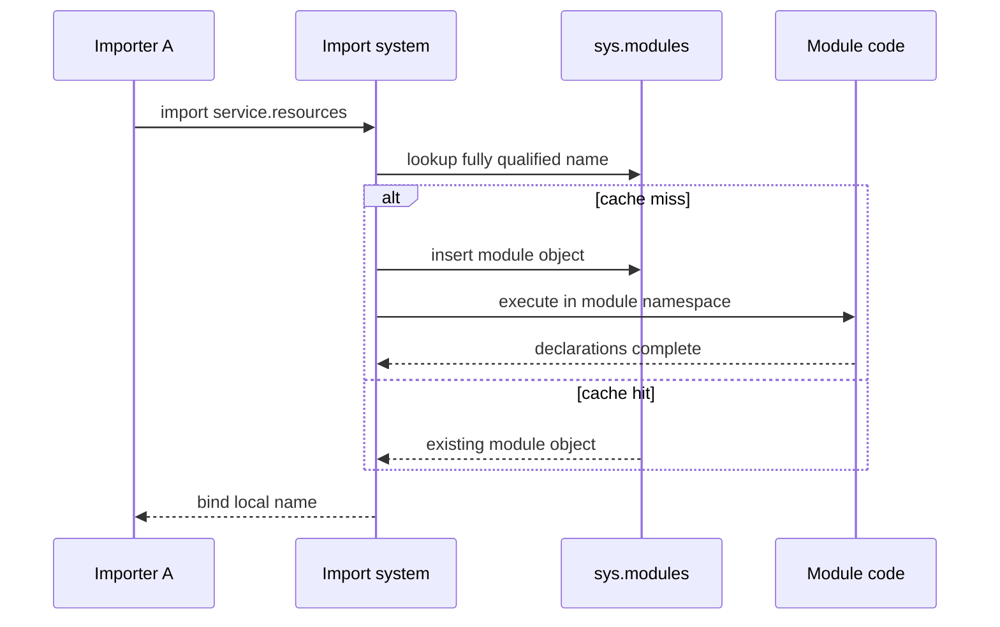
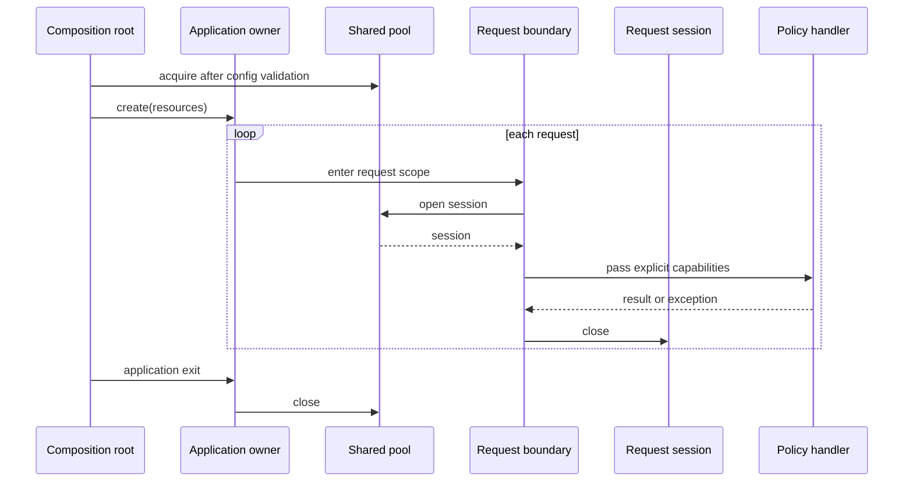

# SDP-PYT-050 — Modules, import caching, and dependency lifetimes

## Physical Notebook Core

### Problem or change pressure

A module-level client looks convenient because repeated imports usually reach the same object. The
design breaks when tests need isolation, two app instances need different configuration, workers
run in different processes, or a live resource needs reliable startup and shutdown.

### One-sentence mental model

> Import caching answers “which module object did this name find?”; a lifetime boundary answers
> “who creates, shares, and closes this dependency?”

### One essential visual

```text
one interpreter
┌─ sys.modules["service.resources"] ──> cached module object
│                                      (namespace, not an app owner)
│
├─ application A ──> app resource A ──┬─ request A1 ──> session A1
│                                     └─ request A2 ──> session A2
└─ application B ──> app resource B ──── request B1 ──> session B1

another worker process ──> another interpreter ──> another module cache
```

### How to read this visual

Read the cache arrow first: one fully qualified name maps to a module object in one interpreter.
Then read each application branch: its owner creates one app resource and each request creates its
own session. The last line crosses a process boundary, so no in-process uniqueness promise crosses
with it.

### Key insight

Sameness is not ownership. A cached module may hold state, but only an explicit application or
request boundary states when that state is valid and how it is released.

### Simplification or limitation

This is a conceptual ownership map, not CPython memory layout. It omits subinterpreters, import
hooks, async cancellation, cleanup failure, and framework-specific response scopes.

### Governing rules or invariants

1. Import search consults `sys.modules` by fully qualified name; the cache scope is not a machine,
   deployment, tenant, or business transaction.
2. Put constants, types, stateless functions, and factories in modules freely; acquire live
   resources only at an owner whose entry and exit are observable.
3. A wider-lived object may create a narrower-lived object, but the narrow object must not escape
   past cleanup unless its contract explicitly transfers ownership.
4. Tests should construct independent owners, not depend on global reset order.

### Minimal Python example

```python
from collections.abc import Iterator
from contextlib import contextmanager
from dataclasses import dataclass


@dataclass(frozen=True)
class AppResources:
    pool: object


@contextmanager
def lifespan(make_pool) -> Iterator[AppResources]:
    pool = make_pool()
    try:
        yield AppResources(pool)
    finally:
        pool.close()


def handle(resources: AppResources, account_id: str) -> str:
    return resources.pool.lookup(account_id)
```

The module declares the lifetime factory. Calling code chooses when the lifetime begins.

### One common misconception

**Mistake:** “A Python module is a Singleton, so a module-level database client is application
scoped.”

**Correction:** the import cache often makes one module object reachable per name in one
interpreter. Application scope is a separate ownership contract and may occur zero, one, or many
times inside that interpreter.

### Important trade-offs

- Module constants and stateless functions are simple; mutable live services hide sharing and
  cleanup.
- Explicit factories and contexts add visible wiring; they enable independent apps, deterministic
  release, failure tests, and configuration isolation.
- A cached factory can be a pragmatic lazy cache, but it still needs an invalidation, concurrency,
  error, and cleanup policy.

### Interview-revision cues

- Ask “unique within what boundary?” before discussing Singleton.
- Distinguish module cache, application scope, request scope, task-local context, and distributed
  coordination.
- Prefer a module namespace for stateless API and an explicit composition root for live resources.

## Unit metadata

| Field | Value |
|---|---|
| Domain | Pythonic design mechanisms |
| Curriculum | [SDP-PYT-050](../../../CURRICULUM.md#sdp-pyt-050) |
| Progress | [PROGRESS.md](../../../PROGRESS.md) |
| Python references | [PYTHON_REFERENCES.md](../../../PYTHON_REFERENCES.md) |
| Learning outcome | Compare module namespaces, import caching, application-scoped objects, and explicit lifetimes with a traditional Singleton. |
| Hard prerequisites | `SDP-FND-090`, `SDP-FND-100` |
| Soft prerequisites | None |
| Priority | Core |
| Interview frequency | High |
| Production frequency | High |
| Python/backend relevance | High |
| Depth | D3 |
| Scope | Python, Modules |
| Size | L |
| Evidence profile | `E+I+D+X+T` |
| Canonical Python | Python 3.14 |
| Interview compatibility | Python 3.11 |
| Artifact state | Approved |

## 1. Simple explanation

A Python file is usually a module. Importing it gives another module access to names in its
namespace. Python remembers loaded modules, so importing the same fully qualified name again
usually returns the already loaded module instead of starting that module from scratch.

This makes a module a good home for:

- constants;
- types;
- small stateless functions;
- explicit registries with a documented owner; and
- factories that callers choose when to invoke.

It also makes this tempting:

```python
# resources.py
client = ExpensiveClient(read_environment())
```

Now merely importing `resources` reads configuration and opens a client. Callers cannot see who
owns it, two app instances cannot easily choose different clients, tests must patch or reset shared
state, and shutdown is not part of the contract.

The smallest correction is often not a Singleton class or a dependency-injection framework. Keep
the module as a namespace, put construction in a function or context manager, call it once at the
composition root, and pass the resulting dependency to the code that needs it.

## 2. Real problem and forces

Consider a backend usage service.

The stable policy is:

```text
read account usage → compare with monthly limit → return remaining allowance
```

The changing infrastructure and lifetime decisions are:

- configuration differs between apps and tests;
- a pool should be shared across requests for one running application;
- a session should be new for each request and close on failure;
- multiple worker processes each have their own memory;
- startup can fail halfway through;
- shutdown must be observable and bounded; and
- policy tests should not import real infrastructure.

A module-global pool appears simple only while the deployment has one configuration, tests run in
one order, and cleanup is ignored. A traditional Singleton class changes the syntax but leaves the
central questions unanswered: unique where, ready when, closed by whom, and replaceable how?

## 3. Formal mechanics

### 3.1 A module object is a namespace object

Python creates a module object and executes module code in that object's global namespace. Names
such as functions, classes, constants, and constructed services become entries in the module
dictionary. A package is also a module, distinguished by import-related package attributes.
[Python 3.14 import system: packages](https://docs.python.org/3.14/reference/import.html#packages).

This is a Python language/import mechanism, not an application architecture. A module can expose a
cohesive API without owning live mutable state.

### 3.2 Import has search/loading and local name binding

The `import` statement performs two conceptually separate operations:

1. find and, when necessary, load the requested module; and
2. bind a name in the importing scope.

The language reference makes this distinction explicit.
[Python 3.14 import statement mechanics](https://docs.python.org/3.14/reference/import.html).

```python
import billing.rules as rules  # local name points at a module object
from billing.rules import LIMIT  # local name points at the current attribute value
```

The second form does not create a live link that follows every future rebinding of
`billing.rules.LIMIT`. It performs a binding in the importing namespace. This is why patching or
reloading “the defining module” may not update an already imported alias.

### 3.3 `sys.modules` is the import cache

The import search first checks `sys.modules`, a mapping from module names to loaded module objects.
If the key is present with a module value, that value normally satisfies the import. The import
machinery inserts a module into the cache before executing its code, which prevents unbounded
self-import recursion but also permits another module in a cycle to observe a partially initialized
namespace. If loading fails, the failing entry is removed according to the documented loading
rules. [Python 3.14 module cache](https://docs.python.org/3.14/reference/import.html#the-module-cache)
and [loading process](https://docs.python.org/3.14/reference/import.html#loading).

```text
import "billing.rules"
        │
        v
sys.modules contains key? ── yes ──> return cached module
        │ no
        v
find spec → create module → cache it → execute code → return module
```

The cache is keyed by name. It is not a guarantee of one object per source file, class, app,
process group, host, or cluster. Mutating `sys.modules` is possible, but the library documentation
warns that deleting essential entries can make Python fail; application code should not use cache
surgery as a lifecycle manager.
[Python 3.14 `sys.modules`](https://docs.python.org/3.14/library/sys.html#sys.modules).

### 3.4 Cache deletion and reload are different

Deleting a cache key does not destroy a module object while other references still reach it. A
later import can create another module object for the same name, leaving old and new objects alive.
`importlib.reload(module)` instead re-executes code while reusing the module and its dictionary;
external references to old objects are not rebound automatically. Existing instances of a class
also keep their old class definition. Reload is not thread-safe.
[Python 3.14 import cache invalidation](https://docs.python.org/3.14/reference/import.html#the-module-cache)
and [`importlib.reload`](https://docs.python.org/3.14/library/importlib.html#importlib.reload).

The [cache experiment](experiments/EXP-01-import-cache-and-reload/README.md) makes these differences
observable without modifying production modules.

### 3.5 Lifetime is an ownership contract

A useful lifetime definition answers five questions:

| Question | Example application answer |
|---|---|
| Who constructs it? | The composition root after configuration is validated. |
| When is it usable? | After successful startup. |
| Who may share it? | Requests belonging to this app instance. |
| Who ends it? | The same app owner during shutdown. |
| What happens on failure? | Partial acquisitions unwind; cleanup failures remain visible. |

Common scopes are relationships, not special Python object types:

| Scope | Typical owner | Typical example | Important boundary |
|---|---|---|---|
| Module/import-cache | Import machinery | Constants, functions, type definitions | Name in one interpreter cache |
| Application | Composition root or framework lifespan | Connection pool, shared model, HTTP client | One running app instance |
| Request | Request boundary | Database session, unit of work | One request execution contract |
| Task/context | Async task context | Correlation ID, trace context | Current context, not dependency ownership |
| Transient/operation | Immediate caller | Formatter, command value, pure service | One call or explicit owner |
| Distributed | External coordinator or data store | Leader lease, unique job claim | Multiple processes or hosts |

Use the [interactive lifetime map](visuals/lifetime-map.html) to compare these boundaries directly.

### 3.6 Traditional Singleton solves a narrower problem

A traditional Singleton attempts to control construction so callers reach one class instance
within some runtime boundary:

```python
class Client:
    _instance = None

    def __new__(cls):
        if cls._instance is None:
            cls._instance = super().__new__(cls)
        return cls._instance
```

This sketch is intentionally incomplete. It has concurrent first-access races, repeated
`__init__` questions, hidden configuration conflict, subclass semantics, no deterministic close,
and no cross-process coordination. Adding locks and reset hooks can make the mechanism longer
without making its ownership clear.

“Exactly one” is often not the real requirement. Backends usually need “one pool per app instance,
one session per request, and one externally coordinated record per business key.” Explicit owners
model that sentence directly.

## 4. Participants and responsibilities

| Participant | Responsibility | What it must not own |
|---|---|---|
| Module namespace | Group declarations and provide a stable import-facing API. | Hidden live-resource acquisition merely because import is cached. |
| Import system | Resolve a fully qualified name and manage the module cache. | Application startup, tenant selection, or resource shutdown. |
| Composition root | Read validated configuration and assemble one app instance. | Business decisions that belong in policy. |
| Application owner | Share app resources and close them after successful acquisition. | Request-local mutable state. |
| Request boundary | Acquire, expose, and release request resources. | Longer-lived work after the request contract ends. |
| Policy function | Use the smallest explicit capability it needs. | Discover infrastructure through global lookups. |
| External coordinator | Enforce cross-process or distributed uniqueness when required. | Pretend in-process identity is a distributed lock. |

## 5. Collaboration and execution flow

### 5.1 Import reuse



### How to read this visual

Follow the cache miss once, then the cache-hit branch. Local name binding happens after the import
operation chooses a module object.

### Key insight

Repeated import can reuse a module object without re-running successful module code.

### Simplification or limitation

This is conceptual import flow. It omits parent-package imports, finders, loaders, import locks,
failure cleanup, extension modules, namespace packages, and circular partial initialization.

### 5.2 Explicit application and request lifetimes



### How to read this visual

The outside owner starts first and ends last. Each inner request begins and ends while the app
resource remains alive. Arrows show calls or dependency passing, not inheritance.

### Key insight

Nesting makes lifetime compatibility visible: request objects cannot safely outlive the
application resource from which they were acquired.

### Simplification or limitation

This is synchronous conceptual flow. Production async cleanup, cancellation, streaming responses,
background work, and partial shutdown need explicit framework contracts and tests.

## 6. Before-design code and concrete pain

The smallest code can be correct for a short script:

```python
# warehouse.py
client = Client("warehouse://primary")


def allocate(order_id: str) -> str:
    return client.allocate(order_id)
```

Do not refactor it merely because globals are unfashionable. If the program starts once, has one
fixed configuration, performs no resource cleanup, and tests never need isolation, this can be an
honest local choice.

Concrete pain arrives when:

```python
test_app = create_app(endpoint="warehouse://test")
admin_app = create_app(endpoint="warehouse://admin")
```

Both app objects import the same cached `warehouse` module. They do not automatically receive two
clients. A test that rebinds `warehouse.client` changes shared state for any code that looks up that
name. Code that executed `from warehouse import client` earlier may still hold the old object.
Shutdown remains unclear. A worker deployment multiplies the “single” object across processes.

Wrapping the same state in `GlobalClient.instance()` adds indirection, not ownership.

## 7. Minimal Pythonic implementation

Separate declarations from activation:

```python
# resources.py: safe declarations
from contextlib import contextmanager


@contextmanager
def application_resources(settings, make_client):
    client = make_client(settings.endpoint)
    try:
        yield client
    finally:
        client.close()


# main.py: composition root
with application_resources(settings, Client) as client:
    app = create_app(client=client)
    serve(app)
```

The module is still the namespace. Import caching remains useful. The change is that importing the
module no longer starts the application. The root explicitly chooses configuration, construction,
sharing, and release.

An ordinary factory is enough when no cleanup is required:

```python
def create_policy(clock, limits):
    return UsagePolicy(clock=clock, limits=limits)
```

Do not add a context manager just to make construction look architectural.

## 8. Typed production-oriented worked example

The complete, standard-library-only example is in
[service_lifetimes.py](examples/service_lifetimes.py). It declares:

- `SessionPool` and `UsageSession` capabilities with `Protocol`;
- immutable validated `Settings`;
- one `ApplicationRuntime` owning a pool;
- one `request_scope()` owning a session;
- a policy function receiving `RequestServices` explicitly; and
- observable in-memory resources for tests and demonstration.

The central flow is:

```python
with application_lifespan(settings, pool_factory) as application:
    with application.request_scope() as services:
        result = build_usage_view("acct-1", services)
```

Why each abstraction exists:

| Element | Reason it exists | What could replace it |
|---|---|---|
| `SessionPool` protocol | Policy/runtime need a small capability, not a concrete vendor. | Duck typing if static checking adds little. |
| `Settings` value | Validate app configuration before acquisition and share immutable input. | Separate validated function arguments. |
| `ApplicationRuntime` | Own shared pool plus request factory and closed-state rule. | A closure or small dictionary for a tiny app. |
| Application context | Pair successful construction with deterministic close. | Framework lifespan with the same contract. |
| Request context | Ensure every opened session closes on body exit. | Framework yield dependency. |
| Explicit `RequestServices` | Make policy inputs visible and independently testable. | Direct `session` and `settings` parameters. |

Run [run_lifetime_demo.py](examples/run_lifetime_demo.py) to observe two distinct request sessions
inside one application pool. The example deliberately avoids FastAPI so the ownership mechanics
remain testable without a framework runtime.

## 9. Choose the smallest useful form

| Mechanism | Good fit | Main warning |
|---|---|---|
| Module constant | Immutable configuration default or vocabulary. | Do not confuse a default with validated runtime configuration. |
| Stateless module function | Cohesive behavior with no retained dependency. | Hidden imports inside the function may still couple infrastructure. |
| Module-level mutable object | Truly process-wide state with accepted implicit lifetime. | Test leakage, races, no app isolation, unclear close. |
| Ordinary factory | Explicit construction; caller owns the result. | Caller must still define release when needed. |
| Context manager / `ExitStack` | Acquisition and deterministic unwinding. | Cleanup failure and partial acquisition need tests. |
| Explicit app container | Several app resources shared by request factories. | Can become a service locator if policy pulls arbitrary entries. |
| `functools.cache` factory | Lazy reusable pure/immutable result with cache semantics. | Cache coherence is thread-safe, but concurrent misses may compute twice; live-resource cleanup remains yours. |
| `ContextVar` | Context-local metadata such as trace ID. | Hidden access is not general dependency injection or resource ownership. |
| Traditional Singleton | A library contract truly requires one instance in a defined runtime boundary. | Construction control does not solve lifecycle, process, or distributed uniqueness. |
| External store/lease | Cross-process coordination or business uniqueness. | Adds availability, expiry, consistency, and failure policies. |

The standard library documents that `functools.cache` keeps its internal mapping coherent across
threads, while the wrapped function may still execute more than once during concurrent initial
misses. That makes it unsafe as an assumed exactly-once resource initializer without more policy.
[Python 3.14 `functools.cache`](https://docs.python.org/3.14/library/functools.html#functools.cache).

## 10. Refactoring path

1. Characterize outputs, effects, identity assumptions, failure timing, and existing cleanup.
2. List each live dependency and state its actual desired sharing boundary.
3. Move import-time acquisition behind one factory without changing policy behavior.
4. Call the factory from a composition root with explicit validated configuration.
5. Pass the smallest capability into policy; keep framework and vendor types at edges.
6. Pair every successful acquisition with deterministic release.
7. Add a request factory/context only for genuinely narrower request state.
8. Prove two independent app instances can coexist without resetting shared globals.
9. Test process multiplicity instead of assuming the module cache crosses workers.
10. Remove reset hooks, service-locator lookups, speculative scopes, and unnecessary interfaces.

The [practice lab](practice/README.md) starts from a separate module-global warehouse gateway and
asks the learner to preserve behavior while applying this path. Its target solution is not present.

## 11. Realistic backend and FastAPI relevance

The framework-independent mapping is:

```text
application startup  -> acquire pool/client/model
request entry        -> acquire session/unit of work
route/policy call     -> receive explicit capability
request exit         -> close/commit/rollback request resource
application shutdown -> close shared resource
```

FastAPI's documented `lifespan` parameter accepts an async context manager: code before `yield`
runs before request serving, and code after `yield` runs during application shutdown. Its own guide
uses this boundary for resources shared among requests and warns that top-level module loading can
make independent tests perform unwanted acquisition.
[FastAPI lifespan events](https://fastapi.tiangolo.com/advanced/events/).

A bounded adaptation looks like:

```python
from contextlib import asynccontextmanager
from fastapi import FastAPI, Request


@asynccontextmanager
async def lifespan(app: FastAPI):
    pool = await make_pool()
    app.state.pool = pool
    try:
        yield
    finally:
        await pool.close()


app = FastAPI(lifespan=lifespan)


async def request_session(request: Request):
    async with request.app.state.pool.session() as session:
        yield session
```

FastAPI also supports dependencies with one `yield` so setup occurs before the dependent operation
and exit code can close a session. Cleanup timing and scope matter for streaming responses,
background tasks, nested dependencies, and framework versions; use the current documented
contract and integration tests rather than assuming “after handler” is precise enough.
[FastAPI dependencies with `yield`](https://fastapi.tiangolo.com/tutorial/dependencies/dependencies-with-yield/).

Keep domain policy independent:

```python
async def route(session=Depends(request_session)):
    return await handle_usage(session=session)
```

The framework manages entry/exit; it need not become the place where policy discovers every
dependency. A background task should receive durable identifiers or acquire its own scope rather
than retain a request session that will close.

## 12. Failure scenarios

### Import-time acquisition makes unrelated imports fail

```python
# bad_resources.py
pool = connect(read_environment())
```

Documentation generation, type discovery, CLI help, tests, migrations, and worker spawn may import
the module without intending to start the service. Configuration or network failure now prevents
even safe declarations from loading. Move acquisition behind explicit startup.

### Two import forms retain different bindings

```python
import settings
from settings import current

settings.current = "test"
assert current != settings.current
```

The local `current` name does not follow the later module rebinding. Patch where the consumer looks
up the name, or better, pass the dependency.

### Reload is used as a reset button

Reload re-executes a module in its retained dictionary; old names can remain when new code does not
replace them, external aliases stay bound, existing instances keep old class behavior, and reload
is not thread-safe. Prefer constructing a fresh app owner. Use reload only with a deliberately
designed development/plugin contract.

### Module global is mistaken for cross-worker uniqueness

Each worker process has its own interpreter state. Even process-start strategies differ across
platforms and Python versions; Python 3.14 changed POSIX defaults away from `fork`. Use an external
lease, unique database constraint, queue semantics, or another appropriate coordinator for a
cross-process invariant.
[Python 3.14 multiprocessing start methods](https://docs.python.org/3.14/library/multiprocessing.html#contexts-and-start-methods).

The [process experiment](experiments/EXP-02-process-scope/README.md) launches overlapping fresh
interpreters and observes one separate import cache in each.

### Cleanup masks the body failure

If the request body raises and `session.close()` also raises, the cleanup failure may become the
propagated exception with the body failure in context. Record both paths, make cleanup idempotent
where appropriate, and choose deliberate exception policy rather than catching `Exception` and
returning success.

### Request object escapes

Storing a session in a module global, app container, closure, response stream, or background task
can let code use it after its request owner closes. Pass durable data outward or acquire a new
owner in the later execution boundary.

### Cached factory hides conflicting configuration

```python
@cache
def client(endpoint: str):
    return Client(endpoint)
```

This creates one object per cached argument pattern, not “the application client.” References are
retained until cache invalidation, cleanup is not automatic, and equivalent-looking argument forms
may create different entries. A zero-argument cached factory hides configuration even more.

## 13. Testing strategy

| Test type | What it proves | What not to overspecify |
|---|---|---|
| Import probe | Repeated name lookup, reload, alias, and cache-deletion observations. | Private importer classes or bytecode-cache layout. |
| Unit policy | Policy works with an explicit fake capability and no live import side effect. | Composition-root call count unless contractual. |
| Lifetime unit | Successful acquisition has exactly one intended release on success/failure. | Context-manager implementation style. |
| Isolation | Two app owners coexist with independent configuration and state. | Reset order for a shared global. |
| Request contract | Each request gets a compatible session and cannot use it after exit. | Framework private dependency-cache objects. |
| Process integration | Worker-local resources multiply as documented. | Specific PIDs, process start order, or timing. |
| Failure integration | Partial startup, cancellation, cleanup, and shutdown preserve diagnostics. | Broad snapshots of unrelated logs. |

Important cases include:

- module already cached versus fresh subprocess;
- `import module` versus `from module import name`;
- normal application and request exits;
- acquisition failure before an owner is established;
- body failure with successful cleanup;
- cleanup failure with and without a body failure;
- double close or idempotent shutdown policy;
- two equal and two different configurations;
- concurrent first access when a lazy cache is proposed; and
- multiple worker processes.

Tests should not delete arbitrary entries from the shared test runner's `sys.modules`. Use a unique
synthetic target, restore the prior entry, or use a subprocess.

## 14. Observability and debugging

Log lifetime events, not object memory addresses as business evidence:

```text
application.start app_instance=usage-api worker=3
request.resource.open request_id=req-17 session=42
request.resource.close request_id=req-17 outcome=error
application.stop app_instance=usage-api worker=3 outcome=success
```

Useful diagnostics include:

- fully qualified module name and `module.__spec__.origin` for import confusion;
- app-instance and worker identifiers for sharing questions;
- resource generation and scope identifiers;
- acquisition, ready, close-start, and close-result events;
- active-resource gauges and shutdown duration; and
- exception chaining when body and cleanup both fail.

Do not log credentials, full DSNs, access tokens, customer records, or raw request data. `id(obj)`
may help one-process debugging but is reusable and meaningless across processes; it is not a
stable identity contract.

## 15. Concurrency and state safety

Import reuse does not make an object immutable or its operations thread-safe. A module-global list,
client, or cache is still shared mutable state among threads that reach it. Synchronize the actual
invariant or prefer immutable values and ownership partitioning.

A check-then-create Singleton is normally a race. `functools.cache` protects cache coherence but
may call the wrapped initializer more than once during concurrent misses. If duplicate acquisition
is unsafe, use eager single-owner startup or an explicit synchronization state machine and test its
failure recovery.

`ContextVar` is designed for context-local state and integrates with `asyncio`; it is useful for
trace IDs or request metadata that cross call layers. It is not a resource container: hidden reads
still obscure dependencies, retained values can prolong references, and tokens must restore prior
state. Python 3.14 allows a `Token` as a context manager; the Python 3.11-compatible form is
`token = var.set(value)` followed by `var.reset(token)` in `finally`.
[Python 3.14 `contextvars`](https://docs.python.org/3.14/library/contextvars.html).

Across processes, normal module memory is not shared. Across hosts, it certainly is not shared.
Move only the invariant that must be global to an external system; keep local clients and pools
locally owned.

## 16. Performance and memory

Import caching avoids repeated successful module execution for the same cached name, but it is not
a service-performance strategy. Heavy import-time work increases cold-start latency and performs
work in commands that only needed declarations.

Scope choices have costs:

- transient resource creation can repeat handshakes and allocation;
- application reuse amortizes setup but retains memory and needs concurrency capacity;
- request scope improves isolation but adds acquisition/cleanup overhead;
- unbounded caches retain arguments and return values;
- wider scopes increase the blast radius of corruption or stale configuration; and
- worker processes multiply in-memory pools and models.

Measure with the real deployment shape and workload. This unit makes no speedup, memory-saving, or
universal pool-size claim.

## 17. Variants and Pythonic alternatives

### Module as a stateless facade

Expose cohesive functions and types directly. This is often the most Pythonic “single access
point” because there is no instance state to make unique.

### Closure-owned application

For a small app, a factory can close over one dependency and return handlers. This gives independent
factory calls without a container class.

### Explicit immutable container

A frozen dataclass holding a few capabilities gives typed names and app isolation. Pass the
specific member to policy when passing the entire container would become service location.

### `ExitStack` or `AsyncExitStack`

Use when the number of startup resources is dynamic or partial acquisition must unwind in reverse
order. A fixed two-resource startup may read more clearly as nested contexts.

### Framework lifespan plus yield dependencies

Use the framework's owner when it accurately matches the application and request contracts. Keep
the underlying factories independently testable.

### Cached factory

Useful for immutable parsed schemas or idempotent construction whose retention and clearing are
acceptable. Avoid for mutable live clients solely to imitate Singleton.

### External coordination

Use a database constraint, lease, lock service, broker, or consensus mechanism when the invariant
must cross workers or hosts. That is a different problem from object identity.

## 18. Related units and comparisons

| Related unit | Relationship | Key difference |
|---|---|---|
| [`SDP-FND-090`](../../../CURRICULUM.md#sdp-fnd-090) | Prerequisite | Explains aliases, mutation, ownership, and lifetime generally; this unit applies them to imports and dependency scopes. |
| [`SDP-FND-100`](../../../CURRICULUM.md#sdp-fnd-100) | Prerequisite | Designs package dependency direction and circular-import boundaries; this unit focuses on cache semantics and runtime-owned objects. |
| [`SDP-SOL-050`](../../../CURRICULUM.md#sdp-sol-050) | Complement | Dependency inversion changes source-code direction; explicit lifetime decides construction, sharing, and release. |
| [`SDP-PYT-040`](../../../CURRICULUM.md#sdp-pyt-040) | Mechanism | Context managers express deterministic lexical lifetime; this unit assigns app/request ownership with them. |
| [`SDP-PYT-090`](../../../CURRICULUM.md#sdp-pyt-090) | Later extension | Plugin discovery intentionally imports modules; it must control registration side effects and duplicate identities. |
| [`SDP-CRE-050`](../../../CURRICULUM.md#sdp-cre-050) | Direct comparison | Singleton controls access to one instance; module and explicit scopes separate namespace, cache, ownership, and distributed boundaries. |
| [`SDP-APP-090`](../../../CURRICULUM.md#sdp-app-090) | Later application | Unit of Work commonly has request/transaction scope and deterministic completion. |

## 19. When to use each choice

Use a module namespace when:

- names form a cohesive stateless API;
- values are immutable constants or declarations; or
- factories should be importable without activation.

Use explicit application scope when:

- construction uses runtime configuration;
- acquisition or shutdown can fail;
- one app shares an expensive or stateful capability;
- two apps or tests must coexist independently; or
- worker multiplicity must be visible.

Use explicit request scope when:

- state must not leak between requests;
- commit, rollback, or close belongs to the request boundary; or
- a narrower capability should be derived from an app resource.

Use an external coordinator when uniqueness or mutual exclusion must cross interpreters, processes,
containers, or hosts.

## 20. When not to use extra machinery

- Keep a literal or pure function in a module; it needs no container.
- Keep a correct local object local when it has no sharing or cleanup requirement.
- Do not introduce app scope for a cheap immutable transient merely to standardize construction.
- Do not use `ContextVar` when an ordinary parameter is clearer.
- Do not add a DI framework for two explicit dependencies.
- Do not replace every module global: stable immutable constants are not the problem.
- Do not implement a Singleton when a factory call at one composition root already creates once.

## 21. Common misuse and overengineering

| Misuse | Why it happens | Better move |
|---|---|---|
| Database connection at import time | Cache reuse looks like free app scope. | Acquire a pool in application lifespan; create sessions per request. |
| Singleton class around every service | “One instance” is mistaken for architecture. | Let one explicit composition root construct ordinary objects. |
| Global reset fixture | Tests need isolation from shared state. | Construct independent app owners and fakes. |
| `reload()` for configuration changes | Re-execution looks like a fresh process. | Build a new owner or use an explicit atomic configuration-swap contract. |
| Delete arbitrary `sys.modules` keys | Cache manipulation appears to unload resources. | Call the real owner’s close method; use subprocesses for import experiments. |
| Cached zero-argument client factory | Laziness appears to solve startup. | Pass validated configuration at startup and own cleanup. |
| App container imported everywhere | Explicit object exists but becomes global service location. | Pass narrow capabilities into policy. |
| Request session stored in app state | Easy access hides narrower lifetime. | Yield/pass it inside the request boundary. |
| `ContextVar` for all dependencies | Avoids parameter wiring. | Reserve context-local access for cross-cutting metadata. |
| In-process Singleton as leader lock | Object identity is confused with distributed coordination. | Use an external lease/constraint with failure policy. |

## 22. Interview preparation

### Common formulations

1. Are Python modules Singletons?
2. What happens when a module is imported twice?
3. What is `sys.modules`, and why does circular import expose partial state?
4. How do `import module` and `from module import name` differ under rebinding or reload?
5. How would you manage a database pool and request session in FastAPI?
6. Why does a module-level object not guarantee one instance across workers?
7. When would `functools.cache` be an acceptable factory mechanism?
8. How would you test application and request lifetimes without global resets?

### Strong short answer

> Modules are cached by fully qualified name in `sys.modules`, so repeated imports in one
> interpreter usually reach the same module object. That can provide a convenient namespace, but
> it is not an application-lifetime or distributed Singleton guarantee. I keep imports
> side-effect-light, construct shared resources at an explicit app lifespan, derive request
> resources inside request scopes, pass narrow dependencies to policy, and use external
> coordination when uniqueness must cross processes.

### Weak-answer traps

- “Python imports each file exactly once.” The key is module name/cache state, and reload or cache
  invalidation changes the story.
- “Global means one per server.” A server may have many worker interpreters and app instances.
- “Singleton makes it thread-safe.” Identity and operation synchronization are different.
- “Dependency injection means FastAPI `Depends`.” Explicit parameters and a composition root are
  already injection; the framework is one wiring mechanism.
- “Reload resets everything.” External aliases, old instances, retained names, and concurrent
  access contradict that simplification.

### Likely follow-ups

1. A process hosts two tenants with different clients. What breaks in a module-global design?
2. Startup acquires a pool, then a second client fails. How do you unwind the first?
3. A background task needs database access after the response. What should it receive?
4. Four workers must run one scheduled job. Which boundary enforces uniqueness?
5. Two threads call a cached initializer simultaneously. What does the standard library promise?
6. Cleanup fails while a handler exception is active. Which diagnostics must survive?

### Code-review exercise

```python
from functools import cache


@cache
def get_client():
    return Client.from_environment()


def handler(account_id: str):
    return get_client().lookup(account_id)
```

Ask, in order:

1. Is construction pure and idempotent?
2. What exact cache boundary exists?
3. Can concurrent first calls create twice?
4. Who closes the client?
5. Can two app instances choose different configuration?
6. Can policy accept a fake without clearing global cache state?
7. Would one composition-root factory call be simpler?

### Senior reasoning checkpoints

A strong answer should identify the real sharing boundary, distinguish language guarantees from
deployment assumptions, make partial startup and cleanup explicit, preserve policy independence,
cover worker multiplicity, reject unnecessary ceremony, and choose distributed coordination only
for a genuinely distributed invariant.

## 23. Closed-book revision and transfer cues

1. Reconstruct the cache-versus-owner visual from memory.
2. Explain import search/loading separately from local name binding.
3. Predict repeated import, reload, alias, and cache-deletion identity behavior.
4. Design one pool-per-app and one session-per-request without a framework.
5. Translate that design to FastAPI lifespan and a yield dependency.
6. Explain why a module global is neither tenant scope nor cluster scope.
7. Reject Singleton for one scenario and justify it for one narrowly defined scenario.
8. Diagnose cleanup failure during an active request exception.
9. Show how two independent app instances make tests stronger than reset fixtures.
10. Choose an external uniqueness mechanism for a four-worker scheduled task.

Transfer prompts are evidence invitations, not completed learner evidence:

- CLI and web app share the same package but need different client lifetimes.
- One process mounts two ASGI apps with different settings.
- A plugin import registers a handler twice under two module names.
- A worker reload feature replaces configuration while requests are active.
- A GPU model is app-scoped but inference sessions are request-scoped.

## 24. Vocabulary and professional English

### Lifetime

| Item | Content |
|---|---|
| Pronunciation | `LIFE-time` |
| Simple English meaning | The period during which something exists or is usable. |
| Hindi cue | जीवन-अवधि |
| Meaning here | The interval from successful dependency acquisition until its owner releases it. |

Natural examples:

1. The token has a short lifetime.
2. This cache retains values for the process lifetime.
3. The session lifetime ends with the request.
4. **Interview:** “I would first define the resource lifetime and owner.”
5. **Engineering discussion:** “The app lifetime is wider than the transaction lifetime.”

### Scope

| Item | Content |
|---|---|
| Pronunciation | `skohp` |
| Simple English meaning | The boundary within which something is visible or shared. |
| Hindi cue | दायरा |
| Meaning here | The app, request, task, operation, process, or distributed boundary that may share state. |

Natural examples:

1. Keep that change within scope.
2. The name is local to the function scope.
3. A request-scoped session must not escape.
4. **Interview:** “A Singleton claim is incomplete until its scope is named.”
5. **Engineering discussion:** “Worker scope is narrower than deployment scope.”

### Invalidate

| Item | Content |
|---|---|
| Pronunciation | `in-VAL-ih-dayt` |
| Simple English meaning | Mark something as no longer usable or current. |
| Hindi cue | अमान्य करना |
| Meaning here | Remove or expire a cached association so later access must resolve or construct again. |

Natural examples:

1. The change invalidates the old assumption.
2. Expiry invalidates the cached record.
3. Deleting a module-cache key invalidates that name-to-module association.
4. **Interview:** “Invalidation does not destroy objects that other references retain.”
5. **Engineering discussion:** “We need an invalidation and cleanup policy, not only a cache.”

### Composition root

| Item | Content |
|---|---|
| Pronunciation | `kom-puh-ZISH-un root` |
| Simple English meaning | The outer place where an application is assembled. |
| Hindi cue | संयोजन का मुख्य बिंदु |
| Meaning here | The boundary that validates configuration, constructs resources, wires policy, and owns startup/shutdown. |

Natural examples:

1. The main function is the composition root.
2. Keep vendor construction near the composition root.
3. Tests can provide another composition root.
4. **Interview:** “I would create the pool once at the composition root.”
5. **Engineering discussion:** “The route receives a capability assembled by the composition root.”

## 25. Python Mastery references

The hard Python bridge is the mapping in [PYTHON_REFERENCES.md](../../../PYTHON_REFERENCES.md):

1. [PY-MOD-010 — Modules, packages, and executable modules](https://github.com/rahulyadev/python-mastery/blob/main/CURRICULUM.md#py-mod-010)
2. [PY-MOD-020 — Import resolution, sys.path, and module caching](https://github.com/rahulyadev/python-mastery/blob/main/CURRICULUM.md#py-mod-020)
3. [PY-MOD-030 — Circular imports and package boundaries](https://github.com/rahulyadev/python-mastery/blob/main/CURRICULUM.md#py-mod-030)
4. [PY-MOD-070 — Package layouts, resources, entry points, and plugin boundaries](https://github.com/rahulyadev/python-mastery/blob/main/CURRICULUM.md#py-mod-070)

Minimum bridge if they are not yet studied: know that module code executes into a namespace,
`sys.modules` maps fully qualified names to loaded module objects, imports bind names, circular
imports can expose partially initialized modules, and package/import direction affects design.

## 26. Authoritative sources

Sources below were opened and read for this unit on 2026-09-06. Examples, diagrams, experiments,
and teaching prose here are original and synthetic.

1. Python Software Foundation, [Python 3.14 — The import system](https://docs.python.org/3.14/reference/import.html), especially packages, module cache, loading, and submodule binding.
2. Python Software Foundation, [Python 3.14 — `sys.modules`](https://docs.python.org/3.14/library/sys.html#sys.modules).
3. Python Software Foundation, [Python 3.14 — `importlib.reload`](https://docs.python.org/3.14/library/importlib.html#importlib.reload).
4. Python Software Foundation, [Python 3.14 — `functools.cache`](https://docs.python.org/3.14/library/functools.html#functools.cache).
5. Python Software Foundation, [Python 3.14 — `contextvars`](https://docs.python.org/3.14/library/contextvars.html).
6. Python Software Foundation, [Python 3.14 — multiprocessing contexts and start methods](https://docs.python.org/3.14/library/multiprocessing.html#contexts-and-start-methods).
7. FastAPI documentation, [Lifespan events](https://fastapi.tiangolo.com/advanced/events/).
8. FastAPI documentation, [Dependencies with `yield`](https://fastapi.tiangolo.com/tutorial/dependencies/dependencies-with-yield/).
