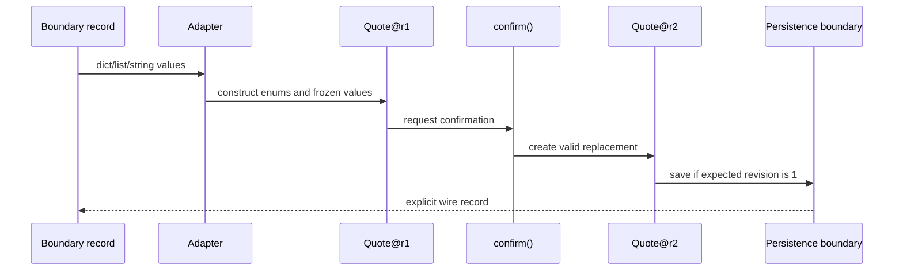

# SDP-PYT-060 — Dataclasses, immutable value objects, and enums

## Physical Notebook Core

### Problem or change pressure

A dictionary or mutable object can carry an impossible amount, a misspelled state, or a list that
changes through an alias. Every consumer must remember the same validation rules, and an in-place
update can leave observers unsure which revision they hold.

### One-sentence mental model

> A dataclass removes field boilerplate; a value object makes validity and equality explicit; an
> enum closes a vocabulary; immutability makes change return a new valid value.

### One essential visual

```text
untrusted record                 trusted value graph                 next snapshot
dict + strings + list ──parse──> Quote + Enum + Money + tuple ──replace──> Quote@revision+1
       may be invalid              valid at construction               old value unchanged
```

### How to read this visual

Read left to right. `parse` is an explicit application boundary that converts open-ended wire data
to domain types and checks their invariants. `replace` is an explicit state change that constructs a
new snapshot. Neither arrow happens merely because a class has `@dataclass`.

### Key insight

The decorator is a code generator, not the design. The design is deciding what counts as the same
value, which states are allowed, what must be valid at construction, and whether every reachable
field supports the promised mutation policy.

### Simplification or limitation

This is a conceptual value-flow diagram, not CPython memory layout. It omits persistence races,
schema evolution, object allocation, enum rollout between services, and mutable objects that could
still be nested inside a frozen dataclass.

### Governing rules or invariants

1. Parse untrusted strings and containers at a boundary; core code receives validated types.
2. Value equality and hashing use the same stable, semantically significant fields.
3. `frozen=True` blocks field rebinding; deep immutability requires immutable reachable values too.
4. A state change returns a new valid snapshot or raises before exposing a partial result.

### Minimal Python example

```python
from dataclasses import dataclass, replace
from enum import Enum


class Status(Enum):
    DRAFT = "draft"
    CONFIRMED = "confirmed"


@dataclass(frozen=True, slots=True, kw_only=True)
class Quote:
    quote_id: str
    status: Status = Status.DRAFT
    revision: int = 1

    def __post_init__(self) -> None:
        if not self.quote_id:
            raise ValueError("quote_id is required")

    def confirm(self) -> "Quote":
        if self.status is not Status.DRAFT:
            raise ValueError("only a draft can be confirmed")
        return replace(self, status=Status.CONFIRMED, revision=self.revision + 1)
```

### One common misconception

**Mistake:** “A frozen dataclass is automatically an immutable, validated value object.”

**Correction:** annotations are not runtime validators, frozen fields can still point to mutable
objects, and generated equality/hash behavior may not match the domain. `frozen=True` supplies one
mechanism inside a broader design decision.

### Important trade-offs

- Immutable snapshots make aliasing and rollback reasoning simpler, but every change constructs and
  routes a new value.
- Enums make states finite and typo-resistant, but wire-value changes require compatibility planning.
- Dataclasses remove routine methods, but generated equality, ordering, representation, pattern
  matching, and hashing become public semantics that must be chosen deliberately.

### Interview-revision cues

- Say what `@dataclass` generates before saying what the domain model guarantees.
- Distinguish frozen field bindings, deep immutability, value equality, and hashability.
- Prefer a small frozen dataclass plus enum only when a tuple, `TypedDict`, or plain function is not
  already enough.

## Unit metadata

| Field | Value |
|---|---|
| Domain | Pythonic design mechanisms |
| Curriculum | [SDP-PYT-060](../../../CURRICULUM.md#sdp-pyt-060) |
| Progress | [PROGRESS.md](../../../PROGRESS.md) |
| Python references | [PYTHON_REFERENCES.md](../../../PYTHON_REFERENCES.md) |
| Learning outcome | Model values and states with dataclasses, frozen data, enums, and explicit invariants instead of unnecessary behavioural objects. |
| Hard prerequisites | `SDP-FND-040`, `SDP-FND-090`; Python bridge `PY-LIB-060` |
| Soft prerequisites | None |
| Priority | Core |
| Interview frequency | Medium |
| Production frequency | High |
| Python/backend relevance | High |
| Depth | D2 |
| Scope | Python, Data model |
| Size | L |
| Evidence profile | `E+I+D+T` |
| Canonical Python | Python 3.14 |
| Interview compatibility | Python 3.11 |
| Artifact state | Draft |

## 1. Simple explanation

Suppose an API sends this record:

```python
incoming = {
    "quote_id": "quote-1",
    "state": "drfat",
    "amount": -100,
    "currency": "RUPPEES",
    "tags": [],
}
```

It is easy to create and serialize, but it does not protect meaning. The state is misspelled, the
amount is negative, the currency vocabulary is inconsistent, and any holder can mutate the list.
If every function accepts this shape, every function must either revalidate it or trust invalid data.

The smallest useful model separates two worlds:

- At the boundary, records contain ordinary strings, numbers, lists, and missing or extra data.
- Inside the core, an enum represents each finite vocabulary and a small dataclass represents each
  meaningful group of values.
- Construction rejects an impossible value once.
- A frozen snapshot uses immutable nested values and returns a replacement when it changes.
- At the next boundary, an adapter converts domain values back to an explicit wire record.

A dataclass is still a normal class. It can contain methods, use inheritance, or be mutable. The
decorator mainly generates repetitive methods. A value object is a design role: its significant
values explain equality, and it should not be observed in an invalid or half-mutated state. An enum
is a finite set of named members. These ideas often combine, but none implies the others.

## 2. Real problem and forces

The worked example is a synthetic pricing service. A quote has lines, a currency, a state, and a
revision. Its stable rules are:

- money is stored as non-negative integer minor units;
- every line has a positive quantity;
- all lines in one quote use one currency;
- only a draft can be confirmed; and
- confirmation increments the revision without modifying the draft.

The changing boundary concerns are:

- input and output use JSON-shaped dictionaries, lists, and strings;
- a new state may be added later;
- records can be cached and compared;
- callers may retain an old revision;
- persistence needs an optimistic-concurrency rule outside the object; and
- transport schemas may evolve independently of internal field names.

One giant behavioral object is unnecessary. Pricing values need a few local operations and
invariants, while persistence, retries, authorization, and API compatibility belong at other
boundaries.

## 3. Origins and Python mechanics

### 3.1 What `@dataclass` does

PEP 557 introduced data classes in Python 3.7 to use annotated class variables as fields and
generate methods for common data-holding classes. Its design deliberately keeps decorated classes
as normal Python classes and does not require a base class or metaclass.
[PEP 557 rationale and specification](https://peps.python.org/pep-0557/).

By default, `@dataclass` considers annotated fields in declaration order and can generate
`__init__`, `__repr__`, and `__eq__`. Ordering, freezing, keyword-only parameters, slots, and hashing
are separate choices. Except for special annotations such as `ClassVar` and `InitVar`, the
dataclass machinery does not interpret a field's annotated type. In particular, `count: int` does
not reject a string at runtime.
[Python 3.14 `dataclasses`](https://docs.python.org/3.14/library/dataclasses.html).

```python
from dataclasses import dataclass


@dataclass
class Reading:
    count: int


reading = Reading("not checked")  # runtime accepts this; a static checker should reject it
assert reading.count == "not checked"
```

The hard Python prerequisite `PY-LIB-060` supplies the generated-method mechanics. If they are not
familiar, reconstruct this matrix before continuing:

| Option | Default | Main effect | Design question |
|---|---:|---|---|
| `init` | `True` | Generate initialization parameters from fields. | Is every public field valid constructor input? |
| `repr` | `True` | Include selected fields in a generated representation. | Could a field be secret, huge, or misleading? |
| `eq` | `True` | Compare the ordered, participating fields for identical classes. | Do these fields define semantic sameness? |
| `order` | `False` | Generate tuple-like rich ordering for identical classes. | Does the domain truly have this total order? |
| `frozen` | `False` | Add setters/deleters that reject field rebinding. | Are reachable values also immutable? |
| `unsafe_hash` | `False` | Do not force a possibly unsafe generated hash. | Can any equality field change? |
| `kw_only` | `False` | Keep generated init parameters positional unless changed. | Would keywords make construction safer to evolve? |
| `slots` | `False` | Return a slotted version of the class. | Is measured instance overhead worth the constraints? |

`kw_only` and `slots` are available in Python 3.11, so this unit's examples require no interview
fallback. `StrEnum`, discussed below as a boundary trade-off, is also available from Python 3.11.
[Python 3.11 `dataclasses`](https://docs.python.org/3.11/library/dataclasses.html) and
[Python 3.11 `enum`](https://docs.python.org/3.11/library/enum.html).

### 3.2 Generated equality is a choice, not universal value semantics

With `eq=True`, generated equality compares participating fields in order as though they formed a
tuple, and the two instances must have the identical class. A subclass with the same-looking fields
does not automatically compare as the same value.
[Python 3.14 dataclass equality contract](https://docs.python.org/3.14/library/dataclasses.html#dataclasses.dataclass).

Fields marked `compare=False` are excluded. That can be correct for a diagnostic cache or trace
label, but excluding a business-significant field silently changes sameness. Prefer the default
until the domain meaning is clear.

### 3.3 Equality and hashing must agree

Hashable collections require equal keys to have equal hashes, and a key's hash must not change
while it is stored. Python therefore makes a normal mutable dataclass with generated equality
unhashable. With the usual defaults, `eq=True` plus `frozen=True` generates a hash; `eq=True` plus
`frozen=False` sets `__hash__` to `None`. `unsafe_hash=True` forces a hash but cannot make mutable
state safe.
[Python data model: `__hash__`](https://docs.python.org/3.14/reference/datamodel.html#object.__hash__)
and [dataclass hash rules](https://docs.python.org/3.14/library/dataclasses.html#dataclasses.dataclass).

```python
from dataclasses import dataclass


@dataclass
class MutablePoint:
    x: int
    y: int


try:
    hash(MutablePoint(1, 2))
except TypeError:
    pass
else:
    raise AssertionError("mutable equality values should be unhashable here")
```

Do not add hashability merely to satisfy a cache API. First ask whether the object is a stable value
and whether every equality-participating reachable value is hashable and semantically immutable.

### 3.4 Frozen is shallow

`frozen=True` adds generated `__setattr__` and `__delattr__` behavior that raises
`FrozenInstanceError` on ordinary field assignment. The documentation calls this an emulation of
immutability, not a way to create truly immutable Python objects.
[Python 3.14 frozen instances](https://docs.python.org/3.14/library/dataclasses.html#frozen-instances).

```python
from dataclasses import dataclass


@dataclass(frozen=True)
class MisleadingSnapshot:
    tags: list[str]


snapshot = MisleadingSnapshot(tags=[])
snapshot.tags.append("changed-through-the-list")
assert snapshot.tags == ["changed-through-the-list"]
```

The binding `snapshot.tags` did not change; the referenced list did. For a deeply immutable value
graph, choose immutable components such as strings, integers, enum members, frozen value objects,
tuples, and frozensets, and audit any custom referenced type.

### 3.5 Construction invariants and `__post_init__`

When a dataclass generates `__init__`, it calls `__post_init__` after assigning fields. This is a
convenient place for small, deterministic cross-field checks. It should not quietly perform network
I/O, database reads, global registration, or expensive work: those create hidden failure and
lifetime boundaries.
[Python 3.14 post-init processing](https://docs.python.org/3.14/library/dataclasses.html#post-init-processing).

Validation answers “is this value allowed?” Normalization answers “which equivalent representation
is canonical?” Be explicit about both. Rejecting surrounding whitespace preserves caller mistakes;
silently stripping it changes the supplied value.

For parsing that needs I/O, versions, locale, permissions, or multiple error categories, use a
named factory or boundary adapter. Let `__post_init__` protect local invariants that every constructor
path must obey.

### 3.6 Defaults and factories

Use `field(default_factory=...)` when each instance needs a fresh default object. The factory is
called with no arguments when a value is needed. In modern Python, dataclasses reject unhashable
defaults as an approximation for mutable defaults, but that check cannot prove deep immutability.
[Python 3.14 default factories and mutable defaults](https://docs.python.org/3.14/library/dataclasses.html#default-factory-functions).

```python
from dataclasses import dataclass, field


@dataclass
class Batch:
    items: list[str] = field(default_factory=list)


first = Batch()
second = Batch()
first.items.append("only-first")
assert second.items == []
```

For an immutable snapshot, a tuple default is usually simpler: `items: tuple[str, ...] = ()`.

### 3.7 Replacement revalidates

`dataclasses.replace(value, **changes)` creates a new instance of the same class by calling its
initializer, so `__post_init__` runs again. Fields with `init=False` have special replacement rules
and deserve caution.
[Python 3.14 `dataclasses.replace`](https://docs.python.org/3.14/library/dataclasses.html#dataclasses.replace).

Replacement is useful for a small snapshot, but a domain-named method such as `confirm()` better
communicates allowed transitions than letting every caller write arbitrary `replace(...)` calls.

### 3.8 Enums close a vocabulary

An `Enum` groups named members whose type is the enum itself. Lookup by value converts boundary
data to a known member or raises `ValueError`. Plain enum members support equality but not arbitrary
ordering. By default, a repeated value creates an alias; `@unique` rejects aliases when each wire
value must identify exactly one canonical member.
[Python 3.14 Enum HOWTO](https://docs.python.org/3.14/howto/enum.html).

```python
from enum import Enum, unique


@unique
class State(Enum):
    CREATED = "created"
    DELIVERED = "delivered"


assert State("created") is State.CREATED
try:
    State("waiting")
except ValueError:
    pass
else:
    raise AssertionError("unknown wire value must fail")
```

Aliases can be a deliberate compatibility device, but they affect iteration, names, serialization,
and deprecation. Do not get them accidentally. `StrEnum` members are also strings and work in most
places that accept strings, so they can compare and substitute like their string values; the result
of a string operation is no longer an enum member. That helps replace legacy string constants but
weakens strict runtime separation. Some standard-library code also checks for exact `str`, requiring
explicit conversion. [Python 3.11 `StrEnum` contract](https://docs.python.org/3.11/library/enum.html#enum.StrEnum).

The worked core therefore uses plain `Enum` with string values and converts `.value` explicitly at
the transport boundary.

## 4. Formal definitions and distinctions

This unit uses these working definitions:

- **Data class:** a normal Python class processed by `@dataclass` to generate selected data-model
  methods from declared fields.
- **Value object:** a design role whose equality is explained by significant values rather than a
  lifecycle identity; construction protects its invariants.
- **Entity:** a design role with continuity across changing attributes, usually identified by a
  stable identity. A dataclass can implement an entity, so syntax alone does not decide the role.
- **Immutable snapshot:** a valid value graph whose observable state does not change after
  construction; a new revision is a new object.
- **Enum:** a distinct type containing a finite set of named members, each bound to a value.
- **Transport record:** data shaped for an external contract. It may use strings and lists even when
  the domain uses enums and tuples.

An immutable value object can have behavior. `Money.times(quantity)` is behavior close to its
invariant and returns another value. The warning is against inventing stateful manager objects,
factories, service locators, and inheritance trees when a value plus a small function expresses the
policy.

## 5. Participants and responsibilities

| Participant | Responsibility | What it must not own |
|---|---|---|
| Boundary adapter | Parse wire primitives into validated types; serialize explicitly. | Core policy, database transactions, hidden defaults. |
| Enum | Name one finite vocabulary and map canonical wire values. | Arbitrary workflow, persistence, unrelated fields. |
| Value object | Protect local construction invariants and value semantics. | Infrastructure access or broad orchestration. |
| Immutable snapshot | Group a valid point-in-time value graph and revision. | Cross-process write coordination. |
| Transition operation | Check allowed change and return a new snapshot. | Partial mutation of the old value. |
| Persistence boundary | Compare expected revision, store the next snapshot, resolve conflicts. | Redefining domain equality through ORM identity. |

## 6. Collaboration and execution flow



### How to read this visual

Read top to bottom. The adapter converts untrusted representation before the core acts. The
transition sends no mutation arrow back to `Quote@r1`; it constructs `Quote@r2`. Persistence then
checks a revision because immutability inside one process cannot prevent another writer.

### Key insight

Validation, state transition, and cross-process coordination are different responsibilities. A
frozen object strengthens the middle one but cannot replace either boundary.

### Simplification or limitation

This is conceptual collaboration, not a literal call stack or database protocol. It omits retries,
authorization, serialization errors, event publication, and failure responses. The interactive
[value-boundary visual](visuals/value-object-boundary.html) focuses on the three representations.

## 7. Before-design code and concrete pain

```python
def confirm_quote(quote: dict[str, object]) -> dict[str, object]:
    if quote["state"] != "draft":
        raise ValueError("only a draft can be confirmed")
    quote["state"] = "confirmed"
    quote["revision"] = int(quote["revision"]) + 1
    return quote
```

This is short, but one new requirement exposes several decisions:

> A caller retains the draft for audit, another caller caches it, and an older worker may attempt to
> confirm the same revision.

The function mutates the same dictionary, so every alias sees the new state. The cast from
`object` can hide malformed data. A misspelled state travels until this branch. The function cannot
express which fields define equality or hashability. Even if we copy the dictionary, a nested list
can still be shared. And no in-memory copy policy decides which worker wins a database race.

The first improvement could simply be boundary validation plus a new dictionary. A dataclass earns
its place when named fields, generated methods, typing, value equality, and invariant-owning behavior
make the core easier to understand.

## 8. Minimal Pythonic implementation

```python
from dataclasses import dataclass, replace
from enum import Enum


class State(Enum):
    DRAFT = "draft"
    CONFIRMED = "confirmed"


@dataclass(frozen=True, kw_only=True)
class Snapshot:
    quote_id: str
    state: State = State.DRAFT
    revision: int = 1

    def __post_init__(self) -> None:
        if not self.quote_id:
            raise ValueError("quote_id is required")
        if self.revision <= 0:
            raise ValueError("revision must be positive")


def confirm(draft: Snapshot) -> Snapshot:
    if draft.state is not State.DRAFT:
        raise ValueError("only a draft can be confirmed")
    return replace(draft, state=State.CONFIRMED, revision=draft.revision + 1)
```

There are three abstractions because there are three decisions:

- `State` closes a vocabulary.
- `Snapshot` groups values, validates construction, and supplies value semantics.
- `confirm` is one small transition policy.

There is no base interface, repository, builder, command object, or state-pattern hierarchy. Add
those only when their separate change pressure arrives.

## 9. Typed production-oriented implementation

The runnable [value_models.py](examples/value_models.py) expands the design with:

- `Money`, which stores integer minor units and a `Currency` member;
- `QuoteLine`, which owns positive quantity and SKU invariants;
- `Quote`, which uses a tuple of lines and rejects mixed currencies;
- `QuoteState`, which defines the finite state vocabulary;
- a domain-named `confirm()` replacement operation;
- typed inbound and outbound records; and
- explicit enum/list/tuple conversion at the transport boundary.

```python
from dataclasses import dataclass, replace
from enum import Enum, unique


@unique
class QuoteState(Enum):
    DRAFT = "draft"
    CONFIRMED = "confirmed"


@dataclass(frozen=True, slots=True, kw_only=True)
class Quote:
    quote_id: str
    line_ids: tuple[str, ...]
    state: QuoteState = QuoteState.DRAFT
    revision: int = 1

    def __post_init__(self) -> None:
        if not self.quote_id or not self.line_ids:
            raise ValueError("quote_id and line_ids are required")

    def confirm(self) -> "Quote":
        if self.state is not QuoteState.DRAFT:
            raise ValueError("only a draft can be confirmed")
        return replace(self, state=QuoteState.CONFIRMED, revision=self.revision + 1)
```

The production judgment is in the boundaries:

- The model does not fetch exchange rates, read configuration, or save itself.
- Integer minor units avoid binary floating-point rounding in this bounded example, but real money
  policy still needs currency exponent, rounding, tax, overflow, and regulatory decisions.
- Runtime checks reject `bool` where `int` was intended because `bool` is a subclass of `int`.
- A tuple prevents the obvious nested-list mutation path.
- The serializer uses enum `.value` explicitly rather than assuming a framework's encoding policy.
- The persistence layer must compare revisions atomically; the value object cannot do that alone.

Run the example:

```bash
uv run --locked python units/pythonic/SDP-PYT-060-dataclasses-immutable-value-objects-enums/examples/run_value_model_demo.py
```

## 10. Simpler Python alternatives

| Need | Smallest likely choice | What changes the decision |
|---|---|---|
| Return two local values | Tuple | Callers need durable field names or invariants. |
| Type a JSON-shaped dictionary | `TypedDict` | Core needs runtime validation, methods, or value semantics. |
| Immutable tuple-compatible public API | `NamedTuple` | Tuple behavior is unwanted or fields need richer construction. |
| Group mutable form state | Plain dataclass | Snapshot equality/hashability and alias safety become important. |
| Close a few internal choices | `Literal` for static checking | Runtime lookup, iteration, identity, or behavior is needed. |
| Close a runtime vocabulary | `Enum` or `StrEnum` | Values are user-created or open-ended rather than finite. |
| Validate external schemas deeply | Boundary parser or schema library | Only a few local invariants exist; a library would dominate. |
| Transform one record | Plain function returning a new record | Named value behavior repeats across the core. |

PEP 557 explicitly notes that dataclasses are not replacements for every record type or validation
library and are not the right tool when tuple/dict API compatibility or more extensive conversion
and validation is the primary requirement.
[PEP 557 discussion of scope](https://peps.python.org/pep-0557/).

## 11. Refactoring path

1. Characterize current wire output, errors, aliases, and mutation behavior.
2. Identify one finite vocabulary and introduce its enum at the boundary.
3. Identify one cohesive group of significant values and write its invariants.
4. Convert mutable nested defaults to deliberate factories or immutable containers.
5. Make equality and hash decisions explicit; keep mutable equality objects unhashable.
6. Replace in-place change with a named operation that constructs a new valid snapshot.
7. Add explicit inbound and outbound adapters; do not leak internal field layout.
8. Add optimistic concurrency at persistence if multiple writers exist.
9. Re-run tests after each change and delete speculative base classes or factories.

The independent [shipment practice](practice/README.md) begins before step 2 and remains unsolved.

## 12. Realistic backend use case

Imagine an HTTP `POST /quotes/{id}/confirm` handler:

1. The transport framework parses JSON syntax and route parameters.
2. An adapter converts strings and lists into `QuoteState`, `Money`, `QuoteLine`, and `Quote`.
3. Authorization checks whether this caller may confirm the quote.
4. `quote.confirm()` returns a candidate next snapshot.
5. The repository executes an atomic update conditioned on the old revision.
6. If zero rows change, the service reports a concurrency conflict instead of overwriting newer data.
7. An outbound adapter produces the versioned response schema.

The immutable value graph helps request-local reasoning and event snapshots. It does not turn the
dataclass into an Active Record, transaction manager, lock, or API schema. Keeping those boundaries
explicit lets the same core work in a worker, CLI, or test.

## 13. Failure scenarios

### 13.1 Hidden nested mutation

A frozen dataclass contains a list. A cache uses the object as a conceptual snapshot, and another
caller appends to the list. The field binding stayed frozen while the observed value changed.

- **Detect:** test mutation through every public alias and inspect reachable field types.
- **Contain:** use immutable nested values or make defensive copies at boundaries.
- **Recover:** invalidate compromised caches and reconstruct from a trusted record.

### 13.2 Accidental enum alias

Two members receive the same wire value. By default the later name aliases the first, affecting
lookup and iteration. Use `@unique` when aliases are not part of the compatibility plan.
[Python 3.14 enum aliases](https://docs.python.org/3.14/howto/enum.html#duplicating-enum-members-and-values).

### 13.3 Hash corruption

`unsafe_hash=True` is added to an object whose equality fields can change. A dictionary stores it,
then mutation changes the hash components and lookup reaches the wrong bucket.

- **Detect:** a test that inserts, mutates, and looks up exposes the broken assumption.
- **Contain:** remove hashability or make the complete equality graph stable.
- **Recover:** rebuild the hashed collection; do not rely on rehashing a single key in place.

### 13.4 Schema and enum rollout mismatch

A producer sends a new enum value before every consumer understands it. Strict parsing correctly
fails, but the distributed rollout becomes unavailable.

- **Detect:** consumer contract tests and unknown-value metrics at the parser boundary.
- **Contain:** deploy readers first, version the schema, or define an explicit unknown-value policy.
- **Recover:** retry only after compatibility is restored; do not silently map an unknown business
  state to a misleading known member.

### 13.5 Lost update despite immutability

Two workers read revision 4 and each construct a valid revision 5. Last-write-wins storage loses one
change. The objects were immutable; the storage operation was not coordinated.

- **Detect:** compare an expected revision in an atomic update.
- **Contain:** reject the losing write as a conflict.
- **Recover:** reload and deliberately retry or ask for conflict resolution.

## 14. Testing strategy

| Test type | What it proves | What not to overspecify |
|---|---|---|
| Construction unit | Invalid primitive and cross-field combinations fail immediately. | Exact internal helper layout. |
| Equality/hash unit | Independently built equal values compare and hash consistently. | Process-specific numeric hash values. |
| Mutation unit | Rebinding and nested alias paths cannot alter promised snapshots. | CPython memory addresses. |
| Transition unit | Old snapshot stays unchanged; next state and revision are valid. | Use of `dataclasses.replace` internally. |
| Enum contract | Every supported wire value parses and serializes; unknown values fail. | Declaration order unless it is a contract. |
| Adapter contract | Lists/strings outside become tuples/enums inside and round-trip deliberately. | Generic `asdict()` output. |
| Persistence integration | Expected-revision update prevents lost writes. | Dataclass implementation details. |

The worked tests use behavior, including invalid construction, hash/equality, replacement,
serialization, Unicode, unknown states, and tuple enforcement. Tests do not assert that a particular
dunder method was generated.

## 15. Observability and debugging

Generated `repr` is helpful in failing tests and logs, but it is not a security boundary. A field
with `repr=False` stays on the object and may be exposed elsewhere. Do not store credentials or
personal data merely because the repr omits them.

Useful structured diagnostics at boundaries include:

- model or event type;
- public record identifier;
- old and proposed revision;
- old and proposed enum state;
- validation error category and field path; and
- persistence conflict outcome.

Avoid logging the entire inbound record by default. Keep validation messages stable enough for
operators but do not couple public APIs to Python exception reprs. When debugging aliases, log
object identity only as temporary process-local evidence; business identity and value equality are
different concepts.

## 16. Concurrency and state safety

Immutable values are safe from their own in-place field changes, and readers can share a deeply
immutable snapshot without observing a partial mutation. That reduces one class of synchronization
problem.

It does not guarantee:

- that a referenced custom object is immutable;
- that a variable pointing at the current snapshot is swapped atomically across every runtime;
- that two threads choose the same next value;
- that async tasks process revisions in order;
- that multiple processes coordinate; or
- that a database prevents lost updates.

Treat the object as a message or candidate state. Use locks, queues, atomic compare-and-swap,
transactions, or version checks at the owner that coordinates competing writers.

## 17. Performance and memory

This unit makes no universal benchmark claim.

- Generated dataclass methods reduce handwritten code; they do not make an object inherently faster.
- `slots=True` removes the usual per-instance attribute dictionary for declared fields and can reduce
  overhead in some workloads, but inheritance, weak references, tooling, and dynamic attributes
  affect the trade-off. Measure the real object population.
- `frozen=True` has a small construction cost because generated initialization cannot use ordinary
  assignment, as the standard-library documentation notes.
  [Python 3.14 frozen instances](https://docs.python.org/3.14/library/dataclasses.html#frozen-instances).
- Replacement allocates a new outer object. Immutable nested values can be safely reused, as the
  quote lines are in the worked example.
- `dataclasses.asdict()` recursively converts dataclasses and containers and deep-copies other
  objects. It may do more work than a deliberate shallow transport adapter and still does not define
  an API schema.
  [Python 3.14 `asdict`](https://docs.python.org/3.14/library/dataclasses.html#dataclasses.asdict).

Profile construction rate, live instance count, allocation pressure, serialization cost, and cache
hit behavior before adding slots, interning, or custom serializers.

## 18. Useful variants

- **Mutable dataclass:** appropriate for local builders, forms, accumulators, ORM state, and test
  fixtures when mutation is the honest contract.
- **Frozen value dataclass:** appropriate for small validated values and snapshots with immutable
  reachable fields.
- **`NamedTuple`:** useful when tuple compatibility and immutability are part of the public API.
- **`TypedDict`:** static description of dictionary shapes; it does not create runtime value objects.
- **Plain `Enum`:** values are distinct from primitives and ideal when string substitution is not
  required.
- **`StrEnum`:** integrates with string-oriented boundaries by also being a string; this relaxes
  runtime separation, and explicit conversion still makes public serialization clear.
- **`Flag`/`IntFlag`:** represents combinable bit sets, not mutually exclusive workflow states.
- **Dataclass plus factory:** a named parser can accumulate errors, perform normalization, or use
  external context before constructing the valid value.

## 19. Related units and distinctions

| Related unit | Relationship | Key difference |
|---|---|---|
| [`SDP-FND-040`](../../foundations/SDP-FND-040-abstraction-encapsulation-information-hiding-contracts/README.md) | Prerequisite | Teaches invariants and encapsulation generally; this unit supplies Python data-model tools. |
| [`SDP-FND-090`](../../foundations/SDP-FND-090-mutability-shared-state-ownership-object-lifetime/README.md) | Prerequisite | Explains aliases and object graphs; frozen dataclasses are one shallow mechanism within that model. |
| [`SDP-PYT-070`](../../../CURRICULUM.md#sdp-pyt-070) | Complement | Protocols describe replaceable behavior; value objects describe validated data semantics. |
| [`SDP-CRE-030`](../../../CURRICULUM.md#sdp-cre-030) | Alternative later unit | Builder helps staged or complex construction; keyword-only dataclasses and factories are often enough. |
| [`SDP-CRE-040`](../../../CURRICULUM.md#sdp-cre-040) | Comparison later unit | Prototype copies an existing object graph; immutable replacement expresses a deliberate value change. |
| [`SDP-BEH-020`](../../../CURRICULUM.md#sdp-beh-020) | Escalation later unit | State objects earn their cost when state-specific behavior varies substantially; an enum is enough for a small vocabulary. |
| [`SDP-BEH-090`](../../../CURRICULUM.md#sdp-beh-090) | Combination later unit | Memento governs capturing/restoring state; an immutable dataclass can be the snapshot representation. |

## 20. When to use these tools

- Several functions exchange the same meaningful group of fields.
- Invalid combinations should be rejected at construction.
- Equality should follow values rather than lifecycle identity.
- A finite set of states or categories must be validated at runtime.
- Callers retain, compare, cache, or publish point-in-time snapshots.
- Replacement makes revisions, rollback, tests, or event payloads easier to reason about.
- Generated initialization and representation reduce real repetitive code.

## 21. When not to use them

- A tuple or local dictionary is clearer and never crosses a meaningful boundary.
- The object is an entity whose mutable lifecycle and identity are the central model.
- External validation, coercion, aliases, error locations, and schema generation dominate; use a
  dedicated boundary solution and map inward.
- The vocabulary is open to user or plugin extension; an enum would close it incorrectly.
- State-specific behavior and transitions have grown enough to justify the State pattern.
- Staged construction must represent incomplete intermediate steps; use a builder or factory and
  expose only the complete value.
- Performance claims for slots or replacement have not been measured in the real workload.

## 22. Common misuse and overengineering

| Misuse | Why it happens | Better move |
|---|---|---|
| Treat annotations as validators | The class looks typed. | Validate untrusted data explicitly and run static checking separately. |
| Freeze a dataclass containing lists/dicts | Frozen sounds deep. | Use immutable reachable fields or defensive copies. |
| Add `unsafe_hash=True` to satisfy a cache | Hashability is mistaken for immutability. | Stabilize equality fields or keep the type unhashable. |
| Put repositories and HTTP clients in `__post_init__` | “Valid construction” expands into orchestration. | Use a boundary factory/service; keep local invariants deterministic. |
| Serialize with `asdict()` as the public API | Field layout resembles the wire schema today. | Write a versioned adapter with explicit enum and collection conversion. |
| Use `order=True` without a domain order | Generated features feel free. | Define one named sort key at the call site. |
| Use `IntEnum` for every status | Database integers exist. | Prefer opaque enum values unless numeric substitution is required. |
| Put every string in an enum | Typos are feared. | Use enums only for genuinely finite vocabularies. |
| Create a universal `ValueObject` base class | Shared syntax is mistaken for shared behavior. | Start with independent concrete values; extract only proven policy. |
| Replace a three-field function with many factories/builders | Pattern count is mistaken for design quality. | Keep one dataclass and one named transition. |

## 23. Interview preparation

### Common formulations

1. What does `@dataclass` generate by default?
2. Does `frozen=True` make an object deeply immutable?
3. How do `eq`, `frozen`, and `unsafe_hash` interact?
4. When would you choose `NamedTuple`, `TypedDict`, a dataclass, or a validation library?
5. Why use an enum instead of a string or `Literal`?
6. How would you model an immutable state transition?
7. What concurrency problems remain after making a snapshot immutable?
8. Why might `dataclasses.asdict()` be a poor public serialization contract?

### Strong short answer

“A dataclass is a normal class with selected generated methods. For a value object I choose fields
that define semantic equality, validate local invariants at construction, and use immutable nested
values if I promise a snapshot. A frozen dataclass blocks rebinding but is shallow. I use an enum for
a truly finite runtime vocabulary and convert wire values at an adapter. State changes return a new
value; storage still needs concurrency control. I keep a tuple, `TypedDict`, plain class, or function
when those are simpler.”

### Weak-answer traps

- “Dataclasses validate type hints.”
- “Frozen means thread-safe and deeply immutable.”
- “Hashable and immutable are synonyms.”
- “`unsafe_hash` is the normal solution.”
- “All state should be a string enum.”
- “`asdict()` is a serializer and schema versioning strategy.”
- “An immutable object prevents database lost updates.”
- Listing decorator flags without explaining value semantics or boundaries.

### Likely follow-ups

1. Show a frozen object that can still change observably.
2. What happens when two enum members have one value?
3. Which fields should have `compare=False`, and why is that risky?
4. How do you add a new wire state without breaking older consumers?
5. How would you preserve the old snapshot while updating the database?
6. Where should parsing that needs a database lookup live?
7. When does `slots=True` help, and what evidence would you gather?

### Code-review prompt

```python
from dataclasses import dataclass, field


@dataclass(frozen=True, unsafe_hash=True, order=True)
class Order:
    order_id: str
    state: str
    tags: list[str] = field(default_factory=list, hash=False)
```

Identify at least six decisions hidden in this short declaration. A strong review discusses whether
the class is an entity or value, open string state, shallow freezing, list aliasing, equality versus
hash fields, unjustified total ordering, positional construction, public repr, and transport leakage.

### Refactoring prompt

A queue consumer receives `{"job_id": "j-1", "state": "ready", "attempt": 0}`. Refactor the
boundary and core so unknown states fail once and retry creates a new snapshot. Then explain why two
workers can still create competing attempt 1 snapshots.

### Senior design prompt

Your service has 50 million short-lived coordinate values. A teammate proposes frozen slotted
dataclasses and interning. Explain the semantic model first, then design measurements for memory,
construction rate, cache cardinality, hit rate, contention, and garbage collection. Reject any
optimization whose lifecycle cost exceeds its measured benefit.

### Reasoning checkpoints

A strong answer identifies the change pressure, generated mechanics, equality/hash contract, shallow
freeze boundary, enum compatibility, explicit parsing and serialization, simpler alternatives,
failure handling, persistence coordination, and one situation where no dataclass is needed.

## 24. Closed-book revision cues

1. Reconstruct `record → validated graph → replacement snapshot`.
2. Write the `eq`/`frozen` default hash matrix from memory.
3. Demonstrate the nested-list frozen trap.
4. Parse one string into an enum and handle an unknown value.
5. Explain why a static annotation is not runtime validation.
6. Compare dataclass, `NamedTuple`, `TypedDict`, plain class, and tuple for one scenario.
7. Show how an old revision remains unchanged after a transition.
8. Add a database race and name the missing coordination mechanism.
9. Reject one overengineered base class or builder.

## 25. Practice and transfer

The [shipment lab](practice/README.md) follows:

```text
predict → run → observe → explain → refactor → vary
```

It starts with a mutable dataclass, string state, public list, and in-place transition. Starter tests
only characterize current behavior. The target is intentionally absent and must not be inferred from
the worked pricing implementation line for line.

Transfer prompts:

- **API DTO:** Which validation and versioning stay at the transport boundary?
- **Domain event:** Which reachable values must be immutable before safe publication?
- **ORM model:** Why might mutable persistence state map into a separate frozen domain snapshot?
- **Cache key:** Which equality fields are stable for the entire cache residence?
- **Workflow state:** When does an enum plus function become too conditional and justify State?
- **Distributed update:** Which expected revision must storage compare atomically?

## 26. Sources actually read

- [Python 3.14 `dataclasses` documentation](https://docs.python.org/3.14/library/dataclasses.html) —
  generated methods, field options, equality/hash behavior, post-init, frozen instances, factories,
  replacement, and conversion helpers.
- [Python 3.14 Enum HOWTO](https://docs.python.org/3.14/howto/enum.html) — member lookup, identity,
  aliases, uniqueness, iteration, comparison, and finite-vocabulary use.
- [Python 3.11 `dataclasses` documentation](https://docs.python.org/3.11/library/dataclasses.html) and
  [Python 3.11 `enum` documentation](https://docs.python.org/3.11/library/enum.html) — compatibility
  confirmation for the unit's options and `StrEnum`.
- [Python 3.14 data model](https://docs.python.org/3.14/reference/datamodel.html#object.__hash__) —
  equality and stable-hash requirements for hashed collections.
- [PEP 557 — Data Classes](https://peps.python.org/pep-0557/) — original rationale, scope, generated
  mechanics, and distinction from tuple, dictionary, and richer validation use cases.

All explanations, synthetic domains, code, exercises, and diagrams in this unit are original. No
external code, proprietary model, private data, production record, copied diagram, or unlicensed
exercise is included.
