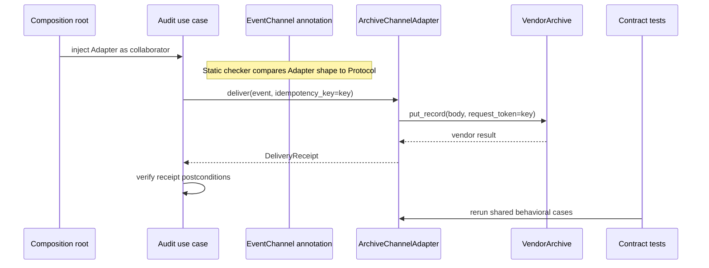

# SDP-PYT-070 — Practical interface design with Protocols, ABCs, and duck typing

## Physical Notebook Core

### Problem or change pressure

A client needs a small capability from several Python collaborators. Some are local, some belong to
another package, and some form an owned extension family. We need useful feedback without pretending
that a matching method name proves correct results, failures, effects, or lifecycle behavior.

### One-sentence mental model

> Write the client's smallest behavioral promise first; use the call directly at runtime, add a
> `Protocol` for structural static feedback, and reserve an ABC for an intentional nominal family
> that earns construction enforcement or shared implementation.

### One essential visual

```text
                                CLIENT PROMISE
              inputs • results • failures • effects • history
                                      │
               ┌──────────────────────┼───────────────────────┐
               ▼                      ▼                       ▼
        RUNTIME EXECUTION       STATIC FEEDBACK        FAMILY MEMBERSHIP
        call the operation       Protocol shape          ABC inheritance
        handle its failures      full signatures         abstract members
               │                      │                       │
               └──────────────────────┼───────────────────────┘
                                      ▼
                           BEHAVIOR / CONTRACT TESTS
                      run every implementation through one suite

 foreign API ──adapter──> client shape       ABC.register ──> recognition only
```

### How to read this visual

Start at the promise, not at a class keyword. The three middle lanes answer different questions:
what executes, what a checker accepts, and what joins an owned family. Then read the shared tests as
the evidence for substitutability. The bottom line contrasts translating a foreign API with merely
changing its runtime recognition.

### Key insight

Interface syntax describes only part of a contract. Static structural compatibility is not runtime
validation, and runtime recognition is not behavioral proof. Production substitution needs explicit
promises plus evidence for each implementation.

### Simplification or limitation

This is a conceptual dependency and evidence diagram, not CPython memory layout or complete type-
checker logic. Real designs may combine an adapter, `Protocol`, and an internal ABC. It omits async
cancellation, generic variance details, framework plugin discovery, and process boundaries.

### Governing rules or invariants

1. Define the client-visible operation and behavior before choosing an interface mechanism.
2. Keep runtime callability, static assignability, nominal recognition, and substitutability as
   separate claims with separate evidence.
3. Use the least commitment that addresses the pressure; add inheritance only when ownership,
   enforcement, or shared behavior justifies it.
4. Test results, errors, effects, repeat calls, and state transitions across implementations.

### Minimal Python example

```python
from dataclasses import dataclass
from typing import Protocol


@dataclass(frozen=True)
class Event:
    event_id: str


class Channel(Protocol):
    def deliver(self, event: Event, *, request_id: str) -> str: ...


class MemoryChannel:  # no Channel base class
    def deliver(self, event: Event, *, request_id: str) -> str:
        return f"memory:{event.event_id}:{request_id}"


def dispatch(channel: Channel, event: Event) -> str:
    return channel.deliver(event, request_id=event.event_id)


assert dispatch(MemoryChannel(), Event("evt-1")) == "memory:evt-1:evt-1"
```

At runtime, `dispatch()` performs an ordinary attribute lookup and call. The annotation does not
register `MemoryChannel`, add a base class, or insert a runtime check.

### One common misconception

**Mistake:** “If `isinstance(value, RuntimeProtocol)` is true, the method has the annotated
signature and preserves the contract.”

**Correction:** a runtime-checkable protocol checks member presence, not signatures or attribute
types. The real call can still fail, and only behavioral evidence supports the semantic contract
([Python 3.14 `runtime_checkable`](https://docs.python.org/3.14/library/typing.html#typing.runtime_checkable)).

### Important trade-offs

- Duck typing keeps runtime coupling low, but missed paths may reveal incompatible calls late.
- A client-owned `Protocol` improves static feedback and supports unrelated implementations, but it
  can match accidentally and cannot express every behavioral promise.
- Direct ABC inheritance makes an owned family and incomplete-subclass failure visible, but adds
  inheritance, MRO, and source coupling.
- Virtual registration changes `isinstance()` and `issubclass()` recognition without supplying ABC
  methods or enforcing abstract members.
- A plain function or `Callable` is often clearer for one stateless operation.

### Interview-revision cues

- Ask: “Do we need a call, static shape, runtime family, shared implementation, or translation?”
- Say exactly what `Protocol`, ABC inheritance, and registration establish—and what each omits.
- Define substitutability through inputs, results, failures, effects, and history, not method names.
- Prefer an adapter when a foreign API's vocabulary or semantics differ.
- Reject an interface class when one function or concrete type is already sufficient.

## Unit metadata

| Field | Value |
|---|---|
| Domain | Pythonic design mechanisms |
| Curriculum | [SDP-PYT-070](../../../CURRICULUM.md#sdp-pyt-070) |
| Progress | [PROGRESS.md](../../../PROGRESS.md) |
| Python references | [PYTHON_REFERENCES.md](../../../PYTHON_REFERENCES.md) |
| Learning outcome | Build and test Python-facing interfaces that balance runtime simplicity, static checking, discoverability, and substitutability. |
| Hard prerequisites | [SDP-FND-070](../../../CURRICULUM.md#sdp-fnd-070), [SDP-SOL-070](../../../CURRICULUM.md#sdp-sol-070); Python bridge `PY-TYP-050` |
| Soft prerequisites | Python bridge `PY-TYP-030`, `PY-TYP-040` |
| Optional deep dive | Python bridge `PY-TYP-060` |
| Priority | Core |
| Interview frequency | High |
| Production frequency | High |
| Python/backend relevance | High |
| Depth | D3 |
| Scope | Python, Typing |
| Size | L |
| First understanding | 4–6 h |
| Hands-on practice | 5–9 h |
| Evidence profile | `E+I+D+T` |
| Canonical Python | Python 3.14 |
| Interview compatibility | Python 3.11 |
| Artifact state | Draft |

The frequency labels are curriculum judgments, not measured survey results. Maintainer-generated
examples and checks approve an artifact; they do not establish Rahul's learning evidence.

## 1. Simple explanation

An interface is the promise seen by a client. In Python, that promise does not have to start as a
base class.

Suppose application code needs to deliver one audit event. It can simply call
`channel.deliver(event, idempotency_key=...)`. If the object supports the operation correctly, the
call works. That is runtime duck typing.

When several packages implement the capability, a small `Protocol` can tell a static checker the
expected property and method signatures. An unrelated class can match without inheriting from the
protocol. Runtime execution is still the same call.

If one team owns a family of channels, requires a primitive operation, and supplies a shared batch
algorithm, an ABC may be useful. Direct subclasses declare membership and cannot be instantiated
while abstract members remain. That is a stronger ownership commitment, not stronger proof of
correct business behavior.

The prerequisites exist as approved artifacts, but the progress tracker does not show that Rahul has
studied them. This smallest bridge is enough to begin:

- **SDP-FND-070:** runtime duck typing, static structural typing, and nominal typing answer different
  compatibility questions.
- **SDP-SOL-070:** SOLID concerns collaboration promises; it does not require Java-style interface
  hierarchies in Python.
- **PY-TYP-050:** know that `Protocol` models structural subtyping, while ABC inheritance and
  registration model nominal or customized runtime recognition.
- **PY-TYP-030 / PY-TYP-040:** parameter and return variance affect safe substitution; deeper generic
  design is a soft prerequisite, not required for the starter.
- **PY-TYP-060:** a callable protocol can precisely describe a complex `__call__` signature later.

## 2. Real problem and forces

The worked example is a synthetic audit-delivery boundary. The application owns `AuditEvent`,
`DeliveryReceipt`, and the meaning of one delivery request. It has these pressures:

- an in-memory implementation supports local use and focused tests;
- a foreign archive has `put_record(...)`, not the client's `deliver(...)` vocabulary;
- a strict checker should reject a wrong signature before a rarely executed path reaches production;
- callers need a stable receipt and idempotency rule;
- the system may later own a family with a shared batch algorithm; and
- runtime admission must not be confused with behavioral certification.

The smallest behavioral contract is:

| Dimension | Client-visible promise |
|---|---|
| Inputs | A valid event and non-empty, trimmed idempotency key. |
| Result | A receipt for the same event and request, with a stable channel label. |
| Failure | Local validation fails before delivery; provider failures remain visible or are translated explicitly. |
| Effects | One accepted request produces at most one logical delivery under the implementation's stated idempotency scope. |
| History | Reusing a key for another event is rejected; retry semantics are not guessed from a method name. |
| Operations | Concurrency, cancellation, timeout, and durability must be documented separately. |

Neither `Protocol` nor `ABC` can encode this entire table. Code annotations describe useful pieces;
tests and production telemetry address the rest.

## 3. Origins and formal Python mechanics

### 3.1 Runtime duck typing is the call

Duck typing means the client uses supported behavior instead of first demanding a declared family.
No decorator or `isinstance()` gate is required:

```python
def close_resource(resource: object) -> None:
    resource.close()  # type: ignore[attr-defined]
```

This deliberately minimal example is dynamic but gives a strict checker too little information.
Annotating with a small `Protocol` improves static feedback; it does not change the runtime lookup.

Avoid broad “look before you leap” checks that duplicate the call. A `hasattr(channel, "deliver")`
test cannot validate the signature or semantics. Catching every `AttributeError` around the call is
also unsafe because the implementation may raise `AttributeError` inside a valid method. Validate
untrusted configuration at a boundary, then make the operation and handle documented failures.

### 3.2 Annotations are not runtime enforcement

Python's typing documentation states that the runtime does not enforce function and variable type
annotations. Static checkers, IDEs, and linters consume them
([Python 3.14 `typing`](https://docs.python.org/3.14/library/typing.html)).

```python
def length(text: str) -> int:
    return len(text)


assert length([10, 20]) == 2  # type: ignore[arg-type]
```

The interpreter accepts the list because `len` supports it. A strict checker rejects the call from
the annotation. This is a useful early warning, not a runtime validator.

### 3.3 `Protocol` is structural static subtyping

PEP 544 standardized protocol classes for structural subtyping: a class is compatible when its
members have assignable types, even without explicit inheritance. The Python documentation calls
this static duck typing
([PEP 544](https://peps.python.org/pep-0544/) and
[Python 3.14 `Protocol`](https://docs.python.org/3.14/library/typing.html#typing.Protocol)).

```python
from typing import Protocol


class Renderer(Protocol):
    def render(self, text: str, *, width: int) -> bytes: ...


class Utf8Renderer:
    def render(self, text: str, *, width: int) -> bytes:
        return text[:width].encode()


renderer: Renderer = Utf8Renderer()  # explicit conformance witness
```

The witness makes the intended relationship discoverable near the implementation without coupling
the implementation to the protocol. A checker compares the complete callable shape, including
parameter kinds, keyword names where relevant, accepted inputs, and returned value.

Keep the protocol client-owned and narrow. A provider-wide interface containing configuration,
health, metrics, retries, and lifecycle methods forces every client and fake to depend on operations
they do not use.

### 3.4 Read-only properties avoid overstating mutability

A protocol attribute such as `name: str` is readable and writable from the protocol-typed client's
view. A concrete read-only property therefore may not satisfy that contract. Describe observation
with `@property` when clients must read but not assign. The current typing specification makes this
distinction explicit
([typing specification: protocol members](https://typing.python.org/en/latest/spec/protocol.html#protocol-members)).

```python
from typing import Protocol


class Named(Protocol):
    @property
    def name(self) -> str: ...
```

This is also a substitutability issue: accepting writes in the interface and rejecting them in an
implementation violates the client's allowed operation.

### 3.5 Explicit protocol inheritance is optional

A class may explicitly inherit from a protocol. That can advertise intent, obtain default protocol
implementations, and let a checker report omissions at the class definition. It is not required for
structural compatibility. PEP 544 preserves normal inheritance and MRO behavior
([typing specification: explicit implementation](https://typing.python.org/en/latest/spec/protocol.html#explicitly-declaring-implementation)).

Prefer implicit conformance when implementations should stay independent. Prefer an explicit
assignment witness when you want local static evidence without runtime coupling. Use explicit
inheritance only when its declaration or defaults genuinely help.

### 3.6 Callable interfaces

For one stateless operation, `Callable[[Input], Output]` or a plain function is usually smaller than
a named object interface. `Callable` cannot express every complex signature. A protocol with
`__call__` can express keyword-only names, overloads, or richer callable members
([Python 3.14 callable protocols](https://docs.python.org/3.14/library/typing.html#annotating-callable-objects)).

```python
from typing import Protocol


class Encoder(Protocol):
    def __call__(self, text: str, *, errors: str = "strict") -> bytes: ...
```

Do not create `EncoderFactory`, `AbstractEncoder`, and `DefaultEncoderStrategy` when passing
`str.encode` or one small function solves the actual change.

### 3.7 `@runtime_checkable` is deliberately shallow

A protocol cannot normally be passed to `isinstance()` or `issubclass()`. Decorating it with
`@runtime_checkable` enables shallow structural recognition. It checks only member presence, not
annotated signatures or types. Python also warns that this check can be slower than an ordinary
class check
([Python 3.14 `runtime_checkable`](https://docs.python.org/3.14/library/typing.html#typing.runtime_checkable)).

The runnable [runtime probe](examples/runtime_probe.py) proves that an object with
`deliver(self) -> str` is recognized as a runtime protocol requiring
`deliver(event, *, idempotency_key) -> DeliveryReceipt`, then fails on the real call.

Python 3.12 changed these checks to use `inspect.getattr_static()` and froze the protocol's runtime
member set at class creation. Python 3.11 used the earlier lookup behavior. Code whose correctness
depends on dynamic attributes or monkey-patching the protocol can therefore differ across the two
supported runtimes
([Python 3.14 version notes](https://docs.python.org/3.14/library/typing.html#typing.runtime_checkable)
and [Python 3.11 behavior](https://docs.python.org/3.11/library/typing.html#typing.runtime_checkable)).

Use runtime protocols only when shallow admission is the honest requirement. For untrusted plugins,
validate metadata, configuration, supported versions, and a real capability handshake. For an
ordinary collaborator, call it and test it.

### 3.8 ABC inheritance is nominal ownership plus enforcement

An ABC is created through `ABC` or `ABCMeta`. Direct subclasses cannot be instantiated while an
abstract method or property remains unimplemented. An ABC may also provide concrete methods and
cooperative implementations
([Python 3.14 `abc`](https://docs.python.org/3.14/library/abc.html)).

```python
from abc import ABC, abstractmethod


class OwnedExporter(ABC):
    @abstractmethod
    def export_one(self, payload: bytes) -> str:
        """Export one payload."""

    def export_all(self, payloads: list[bytes]) -> list[str]:
        return [self.export_one(payload) for payload in payloads]
```

This is appropriate when the application owns the extension family and the shared algorithm has a
stable reason to exist. Abstract-member enforcement only proves that direct subclasses override
members. It does not prove correct return values, idempotency, ordering, or thread safety.

### 3.9 ABC registration and subclass hooks change recognition

`SomeABC.register(ForeignClass)` makes the foreign class and its descendants virtual subclasses for
`isinstance()` and `issubclass()`. The ABC is not added to the foreign class's MRO, and its concrete
methods cannot be called through that class. Abstract-member instantiation checks do not apply to
registered virtual subclasses
([Python 3.14 ABC registration](https://docs.python.org/3.14/library/abc.html#abc.ABCMeta.register)).

`__subclasshook__()` can customize recognition without registering each class. It should return
`True`, `False`, or `NotImplemented`. Treat both hooks and registration as intentional runtime trust,
not duck-typing validation. They affect global recognition and can make unrelated code's
`isinstance()` branches change after import.

Prefer an adapter when a foreign API needs naming, data, error, lifecycle, or semantic translation.
Use registration only when the foreign class already honors the complete runtime family contract
and recognition itself is required.

### 3.10 Compatibility matrix

| Mechanism | Runtime execution | Static claim | Runtime recognition | Main value | Main blind spot |
|---|---|---|---|---|---|
| Plain function / concrete type | Direct call | Exact declared type or callable shape | Normal class identity if checked | Simplicity and discoverability | Tight concrete coupling if variation arrives |
| Unannotated duck typing | Direct call | Little or inferred local information | None required | Lowest ceremony and open participation | Incompatible rare paths can fail late |
| `Protocol` | Direct call; annotation adds no gate | Structural member signatures | Disabled by default | Client-owned static boundary | Accidental shape match; behavior unproved |
| Runtime `Protocol` | Direct call after optional shallow query | Same structural static claim | Member presence only | Opt-in feature recognition | Signatures, types, semantics unproved |
| Direct ABC inheritance | Normal virtual dispatch and MRO | Nominal relationship | Nominal `isinstance()` | Owned family, abstract members, shared code | Coupling, hierarchy and MRO cost |
| ABC virtual registration | Foreign class's own behavior | Not a general structural checker contract | Registered relationship | Intentional family recognition | No MRO, methods, or abstract enforcement |
| Adapter + `Protocol` | Adapter translates then calls foreign API | Adapter structurally matches | Usually unnecessary | Explicit boundary translation | One more maintained object |

## 4. Formal definition

A Python-facing interface is the smallest client-owned set of syntactic and behavioral obligations
required for collaboration.

- **Runtime duck typing** uses an operation based on present behavior rather than declared ancestry.
- **Structural subtyping** accepts a type because its members are assignable to a `Protocol`.
- **Nominal subtyping** accepts a type because a declared inheritance or registration relationship
  places it in a named family.
- **Behavioral subtyping** requires every accepted implementation to preserve the client's allowed
  inputs, promised results, error meanings, effects, state history, and relevant operational rules.

These relationships can overlap. An ABC subclass may also satisfy a `Protocol` structurally. A
third-party adapter may use duck typing internally and expose a typed protocol boundary externally.

## 5. Participants and responsibilities

| Participant | Responsibility | Must not assume |
|---|---|---|
| Client | Own the narrow need and behavioral contract. | Provider-wide APIs are automatically the right boundary. |
| `EventChannel` Protocol | Describe readable name and delivery signature for static tools. | Annotations execute validation or delivery. |
| Structural implementation | Supply compatible members without forced ancestry. | Passing mypy proves behavioral correctness. |
| Adapter | Translate client vocabulary, data, results, and failures to a foreign API. | Inheritance can erase a semantic mismatch. |
| Owned ABC | Define an intentional subclass family, abstract primitive, and earned shared behavior. | Registration supplies the shared behavior. |
| Composition root | Select and construct a concrete collaborator. | Business code should branch on every concrete type. |
| Contract tests | Exercise client-visible behavior across implementations. | One happy-path example proves substitution. |
| Static checker | Compare declared types before runtime. | Dynamic configuration or business semantics are fully known. |

## 6. Collaboration and execution flow



### How to read this visual

Read top to bottom. The `EventChannel` annotation participates in the pre-runtime static check; it is
not called at runtime. The concrete adapter receives the real call, translates it to the vendor, and
returns the client-owned receipt. The contract suite separately repeats observable cases.

### Key insight

The interface and adapter belong to different concerns. The protocol describes what the client
needs; the adapter reconciles a foreign API; behavior tests check semantic substitution.

### Simplification or limitation

This is a conceptual call flow. Static checking normally occurs in a separate tool invocation, not
inside the composition root. The diagram omits network retries, timeouts, concurrency, persistence,
telemetry, authentication, and vendor response validation.

For a pressure-driven exploration, open the self-contained
[interactive mechanism chooser](visuals/interface-mechanism-chooser.html) and its
[reading guide](visuals/README.md).

## 7. Before-interface code and concrete pain

```python
class VendorClient:
    def put_record(self, body: str, token: str) -> dict[str, str]:
        return {"provider_id": token, "status": "stored"}


def archive(client: VendorClient, body: str, token: str) -> str:
    response = client.put_record(body, token)
    return response["provider_id"]
```

This is correct while the use case truly has one vendor. The change pressure arrives when a local
store and another provider need to participate, tests must construct the broad SDK, and provider
field names leak through application code.

The pain is not “there is a concrete class.” It is the mismatch between the client-owned need and
the provider-owned API. Extracting an interface before that pressure would have created ceremony
without evidence.

## 8. Minimal Pythonic implementation

The complete runnable version is in [interface_design.py](examples/interface_design.py). Its
`EventChannel` has one property and one method. `InMemoryChannel` satisfies it structurally, with no
base-class declaration. `deliver_audit_event(...)` depends on the small shape and enforces receipt
postconditions.

Run it from the repository root:

```bash
uv run --locked python units/pythonic/SDP-PYT-070-practical-interface-design-protocols-abcs-duck-typing/examples/run_interface_demo.py
```

The examples use ordinary Python 3.11-compatible protocol syntax. Python 3.12 introduced type-
parameter syntax, but this unit does not require it. The Python 3.14 documentation retains the
`TypeVar`-based generic protocol form for 3.11 compatibility
([Python 3.14 generic Protocol compatibility](https://docs.python.org/3.14/library/typing.html#typing.Protocol)).

## 9. Typed production-oriented implementation

The worked boundary uses five deliberate choices:

1. `AuditEvent` and `DeliveryReceipt` make client-owned values explicit.
2. A read-only `channel_name` property avoids claiming that clients may assign it.
3. The delivery signature includes a keyword-only idempotency key, so a checker catches parameter
   shape mismatches.
4. `ArchiveChannelAdapter` translates names and values from a foreign API.
5. `deliver_audit_event(...)` validates client-owned postconditions instead of trusting a return
   annotation at runtime.

[typing_contracts.py](examples/typing_contracts.py) contains positive assignments checked by strict
mypy. It also contains a commented incompatible witness. During validation, a temporary negative
case should establish that the wrong signature is rejected without leaving normal repository checks
failing.

Type checking is most useful at stable package or team boundaries. Keep annotations close to the
client and require them in CI. At a fully dynamic plugin boundary, static checking of local source
cannot validate code that has not been loaded; runtime admission and behavioral probes remain
separate responsibilities.

## 10. Simpler Python alternatives

### A plain function

Use a function when selection can happen at the composition root:

```python
from collections.abc import Callable


Sender = Callable[[bytes], str]


def archive(payload: bytes, send: Sender) -> str:
    return send(payload)
```

### A concrete type

If one implementation is stable and no test or extension pressure exists, accept it directly. A
concrete dependency is easier to navigate and refactor than a speculative interface.

### A module

PEP 544's typing specification permits a module object to satisfy a protocol when its public members
are compatible. A module can therefore be a simple namespace implementation without a wrapper
instance
([typing specification: modules as implementations](https://typing.python.org/en/latest/spec/protocol.html#modules-as-implementations-of-protocols)).

### An adapter without a Protocol

If translation is the only pressure and there is one client, an adapter plus ordinary duck typing
may be enough. The adapter remains valuable even if the annotation disappears.

## 11. Refactoring path

1. Characterize current success, validation, failure, and side-effect behavior.
2. Name the actual client and list only the members it uses.
3. Define result and error meanings before defining a type.
4. Add a test fake with just the needed capability; notice concrete-coupling friction.
5. Choose a callable, duck typing, `Protocol`, or ABC from the real pressure.
6. Put a `Protocol` with the client when static structural checking helps.
7. Add an explicit positive conformance witness and one negative checker experiment.
8. Add an adapter when provider names or semantics differ.
9. Run shared behavior cases against every supported implementation.
10. Add an ABC only if an owned family needs abstract-member enforcement or stable shared code.
11. Delete unused interface members and `isinstance()` branches.

At every step keep the application runnable. Do not combine interface extraction, async conversion,
provider migration, error redesign, and retry changes into one unreviewable edit.

## 12. Realistic backend use case

An audit service may deliver records to local memory in tests, a vendor archive in production, and a
durable queue during migration. A client-owned interface stabilizes the application vocabulary while
adapters isolate provider changes.

The interface should not promise “exactly once” merely because it accepts an idempotency key.
Exactly-once effects require cooperation among the client, provider, retries, persistence, and
failure recovery. A safer contract says what duplicate key the implementation recognizes, for how
long, and what happens when two different events reuse it.

The composition root chooses the implementation. Business code should not inspect concrete types to
decide normal behavior; such branching defeats substitution and spreads provider knowledge.

## 13. Failure scenarios

### Shape matches, meaning does not

A class returns a receipt for another event. Static checking can accept the return type while the
client's postcondition fails. The worked use case raises before exposing the invalid receipt.

### Runtime recognition succeeds, call fails

A same-name method has the wrong parameters. `@runtime_checkable` recognizes it; the real call raises
`TypeError`. Run [runtime_probe.py](examples/runtime_probe.py) to observe this boundary.

### ABC registration overclaims a family

A registered class passes `isinstance(value, OwnedBatchChannel)`, but its MRO lacks the ABC and it
does not gain `deliver_batch(...)`. Branching on the recognition and then calling the shared method
fails.

### An interface hides provider failures

Catching every exception and returning `False` destroys retry and diagnosis information. Document a
small application error vocabulary and preserve original exceptions as causes when translating.

### A broad protocol becomes a service locator

One `Platform` protocol exposes logging, configuration, persistence, queueing, clocks, and HTTP.
Every client and fake depends on a grab bag. Split around client needs, not provider convenience.

## 14. Testing strategy

Test the four claims separately:

| Claim | Evidence |
|---|---|
| Runtime callability | Execute the real call on supported implementations and boundary cases. |
| Static compatibility | Run strict mypy on positive witnesses and a controlled negative case. |
| Nominal/virtual recognition | Inspect `isinstance()`, `issubclass()`, MRO, abstract instantiation, and available methods. |
| Behavioral substitutability | Run the same client-visible contract tests against every implementation factory. |

A compact behavior-test helper can look like this:

```python
from collections.abc import Callable


def assert_store_contract(make_store: Callable[[], object]) -> None:
    store = make_store()
    result = store.save("item-1")  # type: ignore[attr-defined]
    assert result == "item-1"
```

In production test code, type the factory and store with the client protocol. The deliberately broad
`object` here emphasizes that running behavior is distinct from static proof.

Prefer small handwritten fakes that expose only the client-required behavior. Use mocks to verify an
outgoing boundary call when call shape itself matters, but do not assert every internal call. A fake
that subclasses a broad provider type can hide that the client contract is too large.

Cover:

- ordinary, empty, invalid, Unicode, colon, and literal-pipe values;
- success and each documented failure category;
- no side effect after local validation failure;
- repeated keys, collisions, and partial-provider failure;
- independent implementations and a deliberately incompatible candidate;
- cancellation, timeout, retry, and concurrent use when promised; and
- result postconditions rather than only call counts.

## 15. Observability and debugging

Log or trace the application operation, implementation name, request identifier, duration, outcome,
and normalized error category. Keep payloads and secrets out of logs. Make provider request IDs
available in structured diagnostics without leaking the provider's entire response into the domain.

When a failure appears, ask in order:

1. Did dependency selection choose the intended implementation?
2. Did the boundary receive valid client-owned input?
3. Did an adapter translate the request correctly?
4. Did the provider accept, reject, time out, or return a malformed result?
5. Did the adapter and client validate the result contract?

Do not infer “the interface worked” from an `isinstance()` log line.

## 16. Concurrency and state safety

An interface declaration says nothing about thread safety, task safety, reentrancy, ordering, or
transaction boundaries. The worked `InMemoryChannel` mutates a dictionary and is intended for
single-process teaching and tests. It does not promise cross-thread atomicity or durable idempotency.

For an async interface, include cancellation and deadline behavior in the contract. Do not offer
both synchronous and asynchronous methods in one broad interface merely for convenience; adapt at a
clear boundary or define client-specific ports.

For a stateful implementation, document whether callers may share one instance, how it is closed,
and whether retry can overlap the original call. Test interleavings only when the implementation
makes a concurrency promise.

## 17. Performance and memory

Ordinary method calls and Protocol annotations do not create per-call runtime structural checks.
`@runtime_checkable` `isinstance()` checks do perform attribute inspection and the Python docs warn
they can be surprisingly slow relative to nominal class checks. Do not put them in a hot loop without
measurement
([Python 3.14 runtime protocol performance note](https://docs.python.org/3.14/library/typing.html#typing.runtime_checkable)).

The larger cost is usually architectural: wrapper allocations, duplicated DTO conversion, blocking
I/O, or broad fakes—not the existence of an annotation. Measure the real path before removing type
clarity for speculative speed.

ABC registration uses internal caches for subclass checks. Treat that as library behavior, not a
reason to build custom recognition logic. Do not claim CPython memory or dispatch internals without a
measured need and source.

## 18. Variants

- **Generic Protocol:** relate input and output types with `TypeVar` when substitution stays safe.
- **Callback Protocol:** model keyword-only or overloaded callables more precisely than `Callable`.
- **Explicit Protocol subclass:** advertise conformance or reuse protocol defaults.
- **ABC with template method:** share a stable algorithm over a small abstract primitive.
- **Virtual ABC subclass:** opt a foreign type into runtime recognition without MRO change.
- **`__subclasshook__`:** centralize narrow structural recognition; use sparingly.
- **Adapter:** translate a semantically different foreign interface.
- **Concrete dependency:** keep the simplest design until a real boundary appears.

Generic variance is not decoration. An implementation that consumes a wider input type may safely
stand in for a narrower consumer; a producer may return a more specific result. Mutable protocol
attributes can force invariance. Use the soft Python prerequisites before designing reusable generic
ports.

## 19. Related patterns and combinations

- **Adapter:** converts a provider's interface or semantics to the client-owned shape.
- **Dependency Injection:** supplies the chosen callable or object without requiring a container.
- **Dependency Inversion:** source dependencies point from policy and implementations toward the
  client-owned abstraction.
- **Strategy:** several implementations may provide interchangeable algorithms; a callable may be
  enough.
- **Template Method:** an owned ABC can share an algorithm while subclasses implement primitives.
- **Repository:** often expressed as a client-owned Protocol, but should stay collection-like and
  domain-specific.
- **Plugin:** runtime discovery and admission add security, version, isolation, and lifecycle concerns
  beyond structural typing.

Do not name every object a pattern. The interface mechanism supports collaboration; it does not by
itself establish a Strategy, Adapter, Repository, or plugin architecture.

## 20. When to use each mechanism

Use ordinary duck typing when:

- the collaboration is local, small, and naturally exercised;
- dynamic objects are intentional; and
- a named static boundary would add little feedback.

Use a `Protocol` when:

- the client owns a small stable capability;
- unrelated implementations should remain independent;
- signatures cross package or team boundaries; and
- strict checking is part of the development workflow.

Use direct ABC inheritance when:

- one owner defines an intentional extension family;
- incomplete subclasses should fail at construction;
- useful shared behavior or cooperative inheritance exists; and
- MRO and source coupling are accepted design constraints.

Use registration or a subclass hook only when runtime recognition is itself required and the
recognized class already honors the full contract.

## 21. When not to add an abstraction

Keep a function or concrete type when:

- there is one stable implementation and no meaningful test seam problem;
- the abstraction would repeat the concrete API unchanged;
- every fake would still need provider-specific setup;
- the client only needs one stateless call; or
- the likely change is data validation, not implementation substitution.

Do not add `@runtime_checkable` merely to “be safer.” Do not add an ABC merely to make a method
“required.” Static conformance witnesses, tests, and focused review may provide the actual evidence
with less coupling.

## 22. Common misuse and overengineering

### Java-shaped interface hierarchy

`IChannel` → `AbstractChannel` → `BaseChannel` → `DefaultChannel` around one method adds navigation
without expressing more behavior. Start with the function or client-shaped protocol.

### Provider-owned mega-protocol

Copying every SDK method into a protocol preserves provider coupling under another name. Specify the
application's need and translate with an adapter.

### Runtime Protocol as validator

A presence check admits a wrong signature and wrong semantics. Use a real parse/handshake and
behavior tests for untrusted boundaries.

### ABC as mixin dump

Shared mutable fields, retries, logging, metrics, and configuration in a base class create hidden
coupling and fragile override order. Prefer composed helpers and explicit dependencies.

### Registration to obtain methods

Virtual subclasses do not receive the ABC in their MRO or inherit its concrete methods. Use an
adapter or real inheritance when behavior must be supplied.

### Mock proves the mock

A mock configured to return the expected value says little about a provider adapter. Keep shared
contract cases and at least one adapter-level test against a realistic synthetic response shape.

## 23. Interview preparation

### Common formulations

- “Protocol versus ABC versus duck typing?”
- “How would you type a third-party implementation you cannot modify?”
- “What does `@runtime_checkable` verify?”
- “When is an ABC more appropriate than a Protocol?”
- “How do you prove two implementations are substitutable?”
- “Would you use inheritance, composition, delegation, or an adapter here?”

### Strong answer shape

1. Identify the client and change pressure.
2. State the smallest behavioral contract.
3. Separate runtime call, static shape, nominal recognition, and behavior.
4. Choose the least-coupled mechanism that answers the requirement.
5. Describe adapter and composition-root placement.
6. Name tests for inputs, results, failures, effects, repetition, and concurrency.
7. Reject one plausible but heavier alternative.

### Weak-answer traps

- “Duck typing means no types.”
- “Protocol is runtime-checked automatically.”
- “ABC guarantees correct implementation.”
- “Registering a class gives it the ABC methods.”
- “If mypy passes, Liskov substitution is proven.”
- “Every dependency should have an interface.”

### Likely follow-ups

- What if the method is keyword-only or overloaded?
- What if provider method names differ?
- What if plugins arrive after static checking?
- What if the interface contains mutable attributes?
- What if the implementation is async?
- What happens to registered subclasses' MRO?
- How would you migrate a concrete dependency incrementally?

### One-question-at-a-time mock interview

Start with this question and wait before revealing any model answer:

> A report exporter has one vendor today, two unrelated providers next quarter, and no shared
> implementation. Which Python interface mechanism would you start with, and what exact evidence
> would you require before calling the providers substitutable?

The missing reasoning step to inspect first is whether the answer distinguishes static structural
compatibility from the behavioral contract.

### Code-review exercise

Review this claim: “We decorated the Protocol with `@runtime_checkable`, so plugin loading is safe.”
Ask what admission, version, signature, error, security, isolation, and behavior checks are still
missing. Then decide whether runtime protocol recognition provides any useful signal in that loader.

### Changed requirement

The delivery call becomes async and cancellable. Do not merely change `def` to `async def`. State
deadline ownership, cancellation propagation, partial side effects, idempotent retry, and whether a
synchronous adapter is safe or blocks the event loop.

## 24. Closed-book revision cues

1. Reconstruct the four claims: runtime callability, static assignability, nominal recognition,
   behavioral substitutability.
2. Draw the mechanism matrix from memory.
3. Explain what Protocol inheritance adds and what implicit conformance preserves.
4. Explain why a runtime-checkable Protocol can accept a wrong signature.
5. Explain direct ABC inheritance versus `register()` using MRO and abstract enforcement.
6. Give one case for a callable, one for a Protocol, one for an ABC, and one for an adapter.
7. List the six behavioral contract dimensions used in this unit.
8. Refactor the practice boundary without seeing the worked audit example.

## 25. Vocabulary and professional English

### Assignable

- **Meaning:** safe for a value of one declared type to be used where another is expected.
- **Natural phrase:** “The adapter is assignable to the client Protocol.”
- **Common error:** “The adapter is inherited by the Protocol.”
- **Interview sentence:** “Static assignability checks the full member types; it does not execute the
  behavior.”

### Conformance

- **Meaning:** meeting a stated interface or contract.
- **Natural phrase:** “This assignment is a positive conformance witness.”
- **Common error:** using conformance to imply every semantic property has been proven.
- **Interview sentence:** “Structural conformance is necessary here, while shared contract tests
  provide behavioral evidence.”

### Nominal

- **Meaning:** based on a declared named relationship such as inheritance or registration.
- **Natural phrase:** “Direct ABC inheritance creates a nominal family.”
- **Common error:** “Nominal means runtime-only.”
- **Interview sentence:** “I would choose nominal coupling only because this owned family shares a
  stable algorithm.”

### Structural

- **Meaning:** based on compatible members rather than declared ancestry.
- **Natural phrase:** “The foreign adapter satisfies the Protocol structurally.”
- **Common error:** “Structural means member names only.” Static structural checking includes member
  types and signatures.
- **Interview sentence:** “The Protocol gives structural static feedback without forcing the SDK to
  inherit our class.”

### Virtual subclass

- **Meaning:** a class recognized by an ABC through registration or a subclass hook without the ABC
  appearing in its MRO.
- **Natural phrase:** “Registration makes the legacy class a virtual subclass.”
- **Common error:** assuming it inherits concrete methods.
- **Interview sentence:** “The virtual subclass passes recognition, but it receives neither the base
  implementation nor abstract-member enforcement.”

## 26. Python Mastery references

- **Hard:** [PY-TYP-050 — Protocols, ABCs, and structural versus nominal typing](https://github.com/rahulyadev/python-mastery/blob/main/CURRICULUM.md#py-typ-050). Know runtime duck typing, structural `Protocol`, and ABC registration/inheritance.
- **Soft:** [PY-TYP-030 — Generics and type variables](https://github.com/rahulyadev/python-mastery/blob/main/CURRICULUM.md#py-typ-030) and [PY-TYP-040 — Variance and safe generic API design](https://github.com/rahulyadev/python-mastery/blob/main/CURRICULUM.md#py-typ-040). Use them for generic mutable or producer/consumer interfaces.
- **Optional deep dive:** [PY-TYP-060 — Callable typing, overloads, ParamSpec, and Self](https://github.com/rahulyadev/python-mastery/blob/main/CURRICULUM.md#py-typ-060). Use it when a callable boundary needs more than basic `Callable` can express.

## 27. Authoritative sources

- [Python 3.14 `typing` documentation](https://docs.python.org/3.14/library/typing.html) — runtime status of annotations, `Protocol`, callable protocols, `@runtime_checkable`, performance caution, and version behavior.
- [Python 3.11 `typing` documentation](https://docs.python.org/3.11/library/typing.html) — interview-platform compatibility and pre-3.12 runtime protocol behavior.
- [Python 3.14 `abc` documentation](https://docs.python.org/3.14/library/abc.html) — direct abstract subclasses, registration, MRO limits, abstract-member enforcement, and subclass hooks.
- [PEP 544 — Protocols: Structural subtyping](https://peps.python.org/pep-0544/) — rationale, terminology, implicit and explicit implementation, modules, and runtime-checkable constraints.
- [Current Python typing specification: Protocols](https://typing.python.org/en/latest/spec/protocol.html) — checker-facing protocol members, read-only properties, explicit implementation, modules, and runtime narrowing rules.

All external sources above were read for this unit. The examples, diagrams, visual, tests, business
names, and explanations are original and synthetic.

## 28. Open uncertainties

- Static checkers can differ in diagnostics and in edge cases beyond the standardized typing rules.
  This unit validates with the repository's locked mypy version and does not claim identical output
  from every checker.
- Real provider idempotency, cancellation, retry, and durability semantics depend on the provider and
  deployment. The synthetic channel documents only its local behavior.
- Runtime-checkable Protocol lookup differs between Python 3.11 and 3.12+. The unit avoids depending
  on dynamic-attribute edge behavior and records the version boundary instead.

## 29. Durable clarification log

- A `Protocol` annotation does not cause a runtime conformance check.
- Structural static conformance compares annotated members; ordinary runtime duck typing is the call.
- `@runtime_checkable` checks presence rather than method signatures or business meaning.
- Direct ABC subclasses receive normal MRO behavior and abstract-member enforcement; registered
  virtual subclasses receive recognition only.
- An adapter solves vocabulary and semantic mismatch; registration does not.
- Passing a type checker is evidence about declared shapes, not proof of substitutability.
- An approved artifact does not advance Rahul's learning state without learner evidence.

## Practice and validation

- [Independent predict/run/observe/explain/refactor/vary lab](practice/README.md)
- [Worked example and tests](examples/)
- [Interactive visual and reading guide](visuals/README.md)
- Validation record: added only after final checks pass
