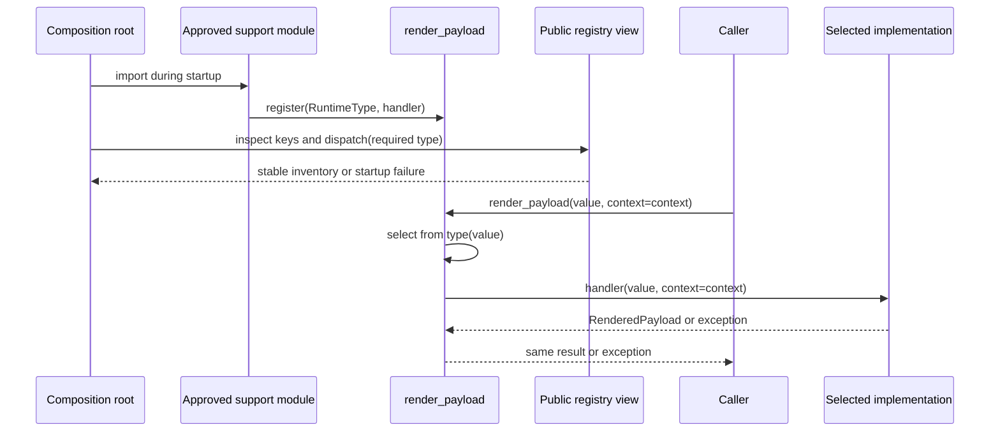

# SDP-PYT-080 — singledispatch and open function extension

## Physical Notebook Core

### Problem or change pressure

One operation must handle values from several type families. New types may arrive in modules that
do not own the operation, but repeatedly editing one growing `isinstance` chain would couple every
extension to the core function.

### One-sentence mental model

> `singledispatch` lets one generic function choose an implementation from the runtime type of its
> first argument; keep registration controlled because the function object owns mutable startup
> configuration.

### One essential visual

```text
startup configuration                              request execution

owner defines generic ─┬─ registers AuditEvent ─┐
                       ├─ registers Mapping ─────┼─> generic(value, context)
approved support import └─ registers NewType ────┘          │
                                                             ▼
                                                type(value), first arg only
                                                             │
                                      exact type -> MRO/ABC -> object default
                                                             │
                                                             ▼
                                                    selected implementation
```

### How to read this visual

Read the left half before the right. Registration configures one generic function. At call time,
the first value's runtime type drives selection from a more specific applicable registration toward
the `object` fallback. Arrows mean configuration or calls, not memory references.

### Key insight

Open function extension separates an operation from the classes it handles, but it does not remove
ownership: somebody must control registrations, duplicates, import order, and the default behavior.

### Simplification or limitation

This is a conceptual lifecycle and call-flow diagram, not CPython memory layout, cache structure, or
a complete ABC linearization. Real plugin discovery, trust, compatibility, and isolation are outside
this unit and belong to `SDP-PYT-090`.

### Governing rules or invariants

1. Only the first argument's runtime type selects the implementation; later arguments are ordinary
   handler inputs.
2. The decorated base function is the `object` registration and therefore the final fallback.
3. Register runtime classes or supported unions of classes, not parameterized container aliases.
4. Configure and inspect registrations at a deliberate startup boundary; keep request-time use
   read-only.
5. Test each handler directly, the selection rules through the generic function, and the default
   and ambiguity paths.

### Minimal Python example

```python
from functools import singledispatch


@singledispatch
def describe(value: object) -> str:
    raise TypeError(f"unsupported: {type(value).__name__}")


@describe.register
def describe_int(value: int) -> str:
    return f"integer:{value}"


@describe.register(str)
def describe_text(value: str) -> str:
    return f"text:{value}"


assert describe(7) == "integer:7"
assert describe("ready") == "text:ready"
assert describe.dispatch(bool) is describe_int  # bool subclasses int
```

### One common misconception

**Mistake:** “`singledispatch` overloads a function using all annotations and can distinguish
`list[int]` from `list[str]`.”

**Correction:** selection uses only the runtime type of the first argument. Both lists have runtime
type `list`; item annotations are for static tools and do not add a dispatch dimension. Register
`list` explicitly when annotating the handler as `list[SomeType]`.
[Python 3.14 `singledispatch`](https://docs.python.org/3.14/library/functools.html#functools.singledispatch).

### Important trade-offs

- New type-specific behavior can be added beside the operation or the new type, but navigation and
  startup configuration become less local.
- MRO and ABC matching reuse Python's type relationships, but broad or overlapping ABCs can make
  selection surprising or ambiguous.
- A global generic is convenient and introspectable, but tests and live systems must control
  mutation and import order.
- A fail-closed default surfaces unsupported values; a permissive fallback may be convenient but can
  hide missing support.
- A short conditional, callable dictionary, method, or `match` statement is often clearer when the
  type axis is not genuinely open.

### Interview-revision cues

- Say “runtime type of the first argument,” then explain the `object` default and MRO/ABC fallback.
- Compare runtime dispatch with static `typing.overload`; neither replaces the other automatically.
- Name the registry owner, installation time, duplicate policy, and observable startup inventory.
- Reject `singledispatch` when selection is a string, two independent dimensions, caller policy, or
  a naturally owned method.
- Distinguish controlled registration from discovery of independently installed plugins.

## Unit metadata

| Field | Value |
|---|---|
| Domain | Pythonic design mechanisms |
| Curriculum | [SDP-PYT-080](../../../CURRICULUM.md#sdp-pyt-080) |
| Progress | [PROGRESS.md](../../../PROGRESS.md) |
| Python references | [PYTHON_REFERENCES.md](../../../PYTHON_REFERENCES.md) |
| Learning outcome | Use `functools.singledispatch` as a controlled extension mechanism and compare it with Visitor, Strategy, and manual dispatch. |
| Hard prerequisites | [SDP-PYT-010](../../../CURRICULUM.md#sdp-pyt-010), [SDP-PYT-070](../../../CURRICULUM.md#sdp-pyt-070), [SDP-SOL-020](../../../CURRICULUM.md#sdp-sol-020); Python bridge `PY-LIB-040` |
| Soft prerequisites | None specified by the curriculum |
| Priority | Professional |
| Interview frequency | Medium |
| Production frequency | Medium |
| Python/backend relevance | Medium |
| Depth | D3 |
| Scope | Python, Standard library |
| Size | L |
| First understanding | 4–6 h |
| Hands-on practice | 5–9 h |
| Evidence profile | `E+I+D+X+T` |
| Canonical Python | Python 3.14 |
| Interview compatibility | Python 3.11 |
| Artifact state | Approved |

The frequency labels are curriculum judgments, not measured survey results. Maintainer-authored
notes, examples, experiments, tests, and publication can approve the artifact; they do not prove
Rahul has predicted, practiced, explained, recalled, transferred, or defended the design. The
learning state therefore remains Not started.

## 1. Simple explanation and prerequisite bridge

Imagine a help desk with one request: “present this value for an audit log.” A normal conditional is
fine for two known value types. The pressure changes when other teams introduce new classes and need
the operation to understand them without editing a central branch chain every time.

`@singledispatch` turns the operation into a generic function. We keep one call—
`render_payload(value, context=...)`—and register separate implementations for types such as
`AuditEvent`, `Mapping`, or `bytes`. When called, the generic function looks only at `type(value)`,
chooses an applicable implementation, and passes the complete original argument list to it.

The prerequisites exist as approved artifacts, but their tracker rows contain no learner evidence.
This minimum bridge is enough to begin:

- **SDP-PYT-010:** functions are first-class callables; registration associates more callables with
  one operation.
- **SDP-PYT-070:** runtime inheritance, ABC recognition, and static annotations answer different
  questions; behavioral correctness still needs tests.
- **SDP-SOL-020:** an extension point is useful only against a named, recurring change; “open” does
  not mean unlimited mutation from anywhere.
- **PY-LIB-040:** know how a decorator transforms a callable and that this mechanism dispatches on
  the first argument's type.

Study in this order: this note → [worked demo](examples/run_dispatch_demo.py) →
[interactive visual](visuals/README.md) →
[resolution experiment](experiments/EXP-01-resolution-and-ambiguity/README.md) →
[registration lifecycle experiment](experiments/EXP-02-registration-import-order/README.md) →
[unsolved practice](practice/README.md). Predict before reading recorded observations.

## 2. Real problem and forces

The worked example is a synthetic audit-rendering boundary. It accepts a value plus request context
and returns a validated text payload. These forces matter:

| Concern | Requirement |
|---|---|
| Stable operation | Call one `render_payload(value, context=...)` boundary. |
| Real variation | Representation varies by the value's runtime type. |
| Open type set | Application modules may add owned event types over time. |
| Shared inputs | Request ID and audience affect output but do not choose the handler. |
| Unsupported input | Fail closed with the concrete runtime type in the error. |
| Broad container type | A `list` handler must validate items because item annotations have no runtime dispatch effect. |
| Ownership | Core registrations are deterministic; optional support is explicitly installed at startup. |
| Diagnosis | Operators can inspect the chosen handler and registry without reading private internals. |
| Testing | Handlers can be tested directly; generic calls verify selection separately. |

The value's type is an honest dispatch key here. If the operation instead varied by media-type name,
tenant configuration, feature flag, or a pair of independent values, `singledispatch` would encode
the wrong decision.

## 3. History and original context

PEP 443 proposed single-dispatch generic functions for `functools`; its status is Final and it names
Python 3.4 as the target version. The rationale was to standardize a limited way to add type-specific
implementations to an existing generic operation and avoid brittle type-inspection chains.
[PEP 443, Abstract and Rationale](https://peps.python.org/pep-0443/).

The PEP defines a generic function as multiple functions implementing one operation for different
types, with a dispatch algorithm selecting the implementation. “Single dispatch” means one
argument's type determines that choice. The current Python glossary keeps the same distinction.
[Python 3.14 glossary: generic function and single dispatch](https://docs.python.org/3.14/glossary.html#term-generic-function).

The API evolved after the original PEP: annotation-inferred registration arrived in Python 3.7, and
union annotations became supported in Python 3.11. This unit uses the union form because Python 3.11
is the repository's interview-compatibility floor.
[Python 3.14 version notes](https://docs.python.org/3.14/library/functools.html#functools.singledispatch).

“Open function extension” is this unit's design interpretation: type-specific behavior is associated
with an operation that can live outside the handled class. It is not a claim that arbitrary mutation,
monkey-patching, or automatic plugin loading is safe.

## 4. Formal Python mechanics

### 4.1 Generic function, base implementation, and first argument

Decorating a function with `@singledispatch` returns a generic function. Dispatch uses the runtime
type of the first argument. The original decorated function is registered for `object`, so it is the
fallback when no better implementation exists.
[Python 3.14 `singledispatch`](https://docs.python.org/3.14/library/functools.html#functools.singledispatch).

```python
from functools import singledispatch


@singledispatch
def encode(value: object, *, request_id: str) -> bytes:
    raise TypeError(f"unsupported: {type(value).__name__}")
```

The first parameter should therefore be the semantic dispatch subject. Putting `context` first and
the value second would dispatch on `RenderContext`, regardless of later annotations.

The base behavior is a domain decision:

- raise a domain-specific exception when unsupported input is unsafe;
- return a conservative generic representation when that is explicitly acceptable; or
- delegate to a well-defined universal implementation.

Do not leave the base as an accidental `pass` or silently stringify sensitive values.

### 4.2 Decorator registration with annotation inference

`generic.register` can be used as a decorator. With an eligible first-parameter annotation, it
infers the registered runtime type:

```python
@encode.register
def encode_integer(value: int, *, request_id: str) -> bytes:
    return f"{request_id}:{value}".encode()
```

The registered function keeps its own name and can be called directly. The registration decorator
returns the undecorated handler, which supports independent tests, decorator stacking, and pickling
use cases described by the documentation.
[Python 3.14 registration forms](https://docs.python.org/3.14/library/functools.html#functools.singledispatch).

### 4.3 Explicit decorator registration

Pass the runtime class explicitly when the handler is unannotated or its useful static annotation is
more specific than the runtime dispatch key:

```python
@render_payload.register(list)
def render_event_batch(value: list[AuditEvent], *, context: RenderContext) -> RenderedPayload: ...
```

At runtime, every list selects this handler, including `list[str]`. The handler must validate item
semantics if untrusted or dynamically typed callers can reach it. `list[int]` is a parameterized
generic alias, not the class key to register for this purpose. Python's documentation explicitly
separates the runtime `list` dispatch key from the static item annotation.
[Python 3.14 parameterized collection example](https://docs.python.org/3.14/library/functools.html#functools.singledispatch).

### 4.4 Functional registration

The two-argument form registers a pre-existing function without decorating its definition:

```python
def render_health_snapshot(value: HealthSnapshot, *, context: RenderContext) -> RenderedPayload: ...


render_payload.register(HealthSnapshot, render_health_snapshot)
```

This form is useful when the owner performs registrations together at a composition boundary, or
when registering a lambda or imported function. The operation still owns the resulting registry.

### 4.5 Union registration in Python 3.11+

An inferred `str | bytes` or `typing.Union[str, bytes]` annotation registers the implementation for
both runtime classes:

```python
@render_payload.register
def render_text(value: str | bytes, *, context: RenderContext) -> RenderedPayload:
    text = value.decode("utf-8") if isinstance(value, bytes) else value
    return RenderedPayload(context.request_id, "text/plain", text)
```

This is convenience for multiple first-argument types, not multiple dispatch. The context's type and
value still do not select the implementation. Union registration is documented as a Python 3.11
addition, so this exact form is compatible with both repository runtimes.
[Python 3.11 `singledispatch`](https://docs.python.org/3.11/library/functools.html#functools.singledispatch).

### 4.6 Inheritance and MRO

When the exact runtime class is not registered, the generic function uses method resolution order to
find a more general implementation. In the worked example:

```text
PrivilegedUserRegistered
    -> UserRegistered       selected: registered
    -> AuditEvent           also registered, but less specific
    -> object               base/default
```

This means a subclass can inherit operation behavior without editing the subclass. It also means a
new subclass-only field is ignored unless the inherited handler deliberately knows about it. Treat
that as a behavioral design choice, not automatic correctness.

Built-in type relationships also count. `bool` subclasses `int`, so an `int` registration handles
`True` until a more specific `bool` registration exists. The
[resolution experiment](experiments/EXP-01-resolution-and-ambiguity/README.md) makes this observable
through public calls and `dispatch(bool)`.

### 4.7 ABC and virtual-subclass registration

Registering an abstract base class can cover concrete or virtual subclasses. The documentation uses
`Mapping` to demonstrate dictionary dispatch.
[Python 3.14 ABC dispatch](https://docs.python.org/3.14/library/functools.html#functools.singledispatch).

```python
from collections.abc import Mapping


@render_payload.register(Mapping)
def render_mapping(value: Mapping[str, object], *, context: RenderContext) -> RenderedPayload: ...
```

`dict` is not added as an exact registry key; `render_payload.dispatch(dict)` resolves to the
`Mapping` handler. This is useful only when the ABC's semantics are honest for the operation.
Registering broad ABCs because they happen to match a special method can capture types you did not
mean to support.

PEP 443 specifies an extended ordering for relevant ABCs and documents a deliberate failure when a
virtual subclass matches two unrelated registered ABCs with no unambiguous precedence:
`RuntimeError: Ambiguous dispatch`. The mechanism refuses to guess.
[PEP 443, Abstract Base Classes](https://peps.python.org/pep-0443/#abstract-base-classes).

### 4.8 Public introspection: `dispatch()` and `registry`

Use the public attributes supplied by the generic function:

```python
implementation = render_payload.dispatch(PrivilegedUserRegistered)
assert implementation is render_user_registered

assert render_payload.registry[object] is render_payload.__wrapped__
registered_types = tuple(render_payload.registry)
```

- `dispatch(SomeType)` reports which implementation would be selected for that class without
  calling it.
- `registry` exposes all exact registration keys through a read-only mapping.
- the `object` entry exposes the original default implementation.

These are appropriate for startup validation, focused tests, diagnostics, and safe handler-name
telemetry. Do not inspect private closure cells or caches; they are not the API contract.
[Python 3.14 introspection API](https://docs.python.org/3.14/library/functools.html#functools.singledispatch).

### 4.9 Runtime dispatch is not static overload resolution

`singledispatch` chooses an implementation while the program runs. `typing.overload` gives a static
checker multiple call signatures but is followed by one runtime implementation. A registry is not
an automatically derived static allow-list.

The generic base often accepts `object` so unsupported values can reach a deliberate runtime
fallback. If public callers should receive a static allow-list too, add a narrow typed facade, as in
[typing_contracts.py](examples/typing_contracts.py):

```python
SupportedPayload = AuditEvent | HealthSnapshot | str | bytes | list[AuditEvent]


def render_known(value: SupportedPayload, *, context: RenderContext) -> RenderedPayload:
    return render_payload(value, context=context)
```

That union is a typing policy. It must be maintained consistently with the runtime registry, and it
may intentionally be narrower. Handler annotations help static tools and can drive registration;
they do not validate runtime arguments or results.

### 4.10 Registration time and import effects

A function definition is executable, and decorator expressions are evaluated when that definition
executes. Import loading executes module code; later ordinary imports usually reuse the cached module.
Therefore an extension module containing `@generic.register(...)` configures the imported generic
function when that extension module executes.
[Python function definitions](https://docs.python.org/3.14/reference/compound_stmts.html#function-definitions)
and [the Python import system](https://docs.python.org/3.14/reference/import.html).

This creates an operational contract:

1. a named module owns the generic function;
2. a composition root imports a deterministic set of approved support modules;
3. startup rejects missing or duplicate required support under application policy;
4. startup records a stable registry inventory; and
5. request handlers call but do not mutate the registry.

The [import-order experiment](experiments/EXP-02-registration-import-order/README.md) deliberately
shows two modules competing for one exact type. The module imported last is observable as the final
handler on the supported runtimes. Treat that as a failure to govern configuration, not as a useful
precedence feature.

### 4.11 Controlled extension is not plugin discovery

`singledispatch.register` associates a callable with a runtime type. It does **not** search installed
packages, read entry-point metadata, authenticate code, check plugin versions, order dependencies,
isolate failures, or unload extensions.

Explicitly importing a small allow-list is controlled extension. Discovering independently installed
providers requires another mechanism such as entry-point metadata plus application policy. Python's
`importlib.metadata.entry_points()` can describe installed entry points, while `EntryPoint.load()`
resolves one; those mechanics and their governance belong to `SDP-PYT-090`.
[Python 3.14 entry points](https://docs.python.org/3.14/library/importlib.metadata.html#entry-points).

### 4.12 `singledispatchmethod` as a related variant

`functools.singledispatchmethod` applies the idea to methods and dispatches on the first non-`self`
or non-`cls` argument. When combined with decorators such as `@classmethod`, it must be outermost so
the `.register` attribute remains available. Use it only when the generic operation naturally
belongs to the receiver; otherwise a module-level generic is simpler.
[Python 3.14 `singledispatchmethod`](https://docs.python.org/3.14/library/functools.html#functools.singledispatchmethod).

## 5. Participants and responsibilities

| Participant | Responsibility | What it must not own |
|---|---|---|
| Generic function owner | Define the operation, base behavior, contract, and core registry lifecycle. | Automatic discovery or arbitrary import order. |
| Base/default implementation | Handle or reject every value not matched more specifically. | Pretending all unknown data is safe to stringify. |
| Registered implementation | Honor the complete call shape and behavior for one runtime type family. | Selection of unrelated types or startup policy. |
| Registration module | Associate an approved type and handler during controlled setup. | Silent duplicate precedence or request-time mutation. |
| Composition root | Choose and import support modules, validate the final inventory, then publish readiness. | Business rendering logic. |
| Caller | Supply the dispatch subject first and ordinary context later. | Knowing the concrete handler. |
| Observability boundary | Record runtime type, selected public handler identity, outcome, and request correlation. | Private cache or sensitive payload contents. |

## 6. Collaboration and execution flow



### How to read this visual

The first three interactions happen during startup; the remaining interactions happen for a request.
The self-call means selection conceptually belongs to the generic function. The chosen handler
receives the original arguments.

### Key insight

Extension and execution are separate phases. A predictable startup registry makes request-time
dispatch simple and diagnosable.

### Simplification or limitation

This conceptual sequence does not expose private implementation calls or caches. It omits framework
lifecycle, processes, async cancellation, plugin trust, and deployment rollback.

For executable selection paths, use the
[interactive dispatch resolution explorer](visuals/dispatch-resolution-explorer.html).

## 7. Before-mechanism code and concrete pain

The smallest design is often a conditional:

```python
def render(value: object, *, context: RenderContext) -> RenderedPayload:
    if isinstance(value, UserRegistered):
        return render_user_registered(value, context=context)
    if isinstance(value, AuditEvent):
        return render_audit_event(value, context=context)
    if isinstance(value, str):
        return RenderedPayload(context.request_id, "text/plain", value)
    raise UnsupportedPayloadError(type(value).__name__)
```

This is readable when the type set is small, stable, and owned together. Do not refactor merely to
remove the word `if`.

Concrete pain begins when independent modules repeatedly edit this function, branch ordering encodes
inheritance precedence, direct handler tests are awkward, and merge/review traffic gathers around a
stable operation. `singledispatch` makes that **one named type dimension** explicit. It does not fix
unrelated duplication inside handlers or make their behavior compatible.

## 8. Minimal Pythonic implementation

```python
from functools import singledispatch


@singledispatch
def label(value: object) -> str:
    raise TypeError(f"unsupported: {type(value).__name__}")


@label.register
def label_event(value: AuditEvent) -> str:
    return f"event:{value.event_id}"


@label.register
def label_text(value: str | bytes) -> str:
    return value.decode() if isinstance(value, bytes) else value
```

Every abstraction earns a role:

- `label` names one operation and owns the default;
- the first argument is the only dispatch subject;
- handlers are ordinary named functions and remain directly testable; and
- the union is just a compact way to register the same semantics for two runtime classes.

No Protocol, ABC hierarchy, factory, service locator, or metaclass is needed.

## 9. Typed production-oriented implementation

The complete [open_rendering.py](examples/open_rendering.py) adds only production concerns justified
by the example:

- frozen data records with input invariants;
- a domain-specific fail-closed default;
- exact, inherited, union, explicit collection, ABC, and functional registration forms;
- runtime item validation where a `list[AuditEvent]` annotation cannot enforce contents;
- a public `dispatch()`-based selected-handler name;
- a wrapper that correlates success or failure observations with runtime type and handler; and
- a typed facade when callers need a static supported-value boundary.

Run it from the repository root:

```bash
uv run --locked python units/pythonic/SDP-PYT-080-singledispatch-open-function-extension/examples/run_dispatch_demo.py
```

The operation and wrapper stay separate. `render_payload` owns selection. `render_observed` owns
telemetry and a result postcondition. Handlers do not choose themselves or know the registry.

## 10. Simpler and semantically different alternatives

| Mechanism | Prefer it when | Why `singledispatch` is not automatically better |
|---|---|---|
| Direct call | One implementation exists. | A registry adds indirection without variation. |
| `if` / `elif` | Two or three stable type branches are local and readable. | Open extension pressure has not appeared. |
| Dictionary of callables | A string, enum, command name, or explicit key selects behavior. | `singledispatch` only understands runtime types. |
| `match` | A closed set of data shapes or values should be visible and exhaustively reviewed together. | External registration hides the closed decision. |
| Instance method | The operation belongs naturally to the data type and its owner can change the class. | A method is easier to discover beside the data. |
| Passed callable / Strategy | The caller or configuration chooses a policy independent of input type. | Type-based selection encodes the wrong axis. |
| Visitor | Many external operations cross a stable object structure and explicit double dispatch is justified. | Visitor has different ownership and more ceremony; `singledispatch` is one external operation axis. |
| Manual predicate list | Overlapping conditions, priorities, or values determine selection. | MRO cannot express arbitrary business precedence. |
| Static `overload` | Call-site signatures and result narrowing are the problem. | `overload` does not provide runtime registration or selection. |
| Plugin discovery | Independently installed packages must be found and governed. | Registration alone cannot discover, trust, version, or isolate plugins. |

### Ordinary conditionals

A conditional keeps all supported cases visible and may be the most maintainable expression of a
closed decision. Its cost is repeated central edits under open extension pressure, not its syntax.

### Dictionary of callables

Use a dictionary when callers already supply a key such as `"json"` or `EventKind.CREATED`. It makes
duplicate names and missing keys easier to govern explicitly. See
[SDP-PYT-020](../../../CURRICULUM.md#sdp-pyt-020).

### Pattern matching

Pattern matching is good for destructuring and closed algebraic-style decisions. It remains central
source code, which is a benefit when reviewers should see every case together.

### Methods

Put behavior on the class when it belongs to that abstraction and class ownership is available.
Prefer an external generic when the operation should evolve independently of third-party or stable
data classes.

### Strategy

Strategy answers “which interchangeable policy did the caller choose?” `singledispatch` answers
“which implementation corresponds to this first argument's runtime type?” A callable can implement
Strategy without a registry.

### Visitor

Classic Visitor uses an `accept(visitor)` collaboration and a second dispatch to a type-specific
visitor method. It can make a family of operations explicit across a stable element structure.
`singledispatch` can add one external operation without modifying element classes, but a growing
matrix of operations and types may need stronger organization. Full Visitor mechanics belong to
`SDP-BEH-100`.

## 11. Refactoring path

1. Preserve conditional behavior with focused tests, including failure and subclass ordering.
2. Prove that runtime type of the first argument is the real and single selection axis.
3. Name the base/default policy explicitly.
4. Decorate the stable operation and migrate one branch into a named registered implementation.
5. Re-run tests after each moved branch.
6. Test handlers directly and selection through `dispatch(Type)` plus real generic calls.
7. Put core registrations beside the operation; use explicit startup imports only for justified
   cross-module support.
8. Define duplicate and required-registration policy before accepting external registration.
9. Record the final public registry inventory at startup without sensitive payload data.
10. Remove the old conditional and speculative discovery machinery.

The [practice lab](practice/README.md) keeps a working conditional unsolved so Rahul can perform this
reasoning rather than copy the worked domain.

## 12. Realistic backend use case

Consider a service that produces safe operational summaries for several internal event classes.
The application owns the operation but not every event type. A module-level generic renderer lets a
new owned event package install one renderer during startup.

The HTTP or message-consumer boundary should not accept arbitrary Python objects from untrusted
input. It first parses and validates data into approved application types. Then:

1. startup imports configured support modules;
2. startup verifies required types with `dispatch(Type)` and exact keys with `registry`;
3. request handling passes the validated event first and request context second;
4. the selected handler creates a result or raises its documented error;
5. a wrapper records type, selected handler, outcome, and correlation ID; and
6. an unsupported value becomes a controlled application error, not accidental serialization.

This is not remote-code loading, schema negotiation, or a security sandbox. Registration code has the
same process privileges as the application importing it.

## 13. Failure scenarios

### Permissive default leaks or hides data

A default `return repr(value)` can expose secrets or make unsupported types appear successful.
Fail closed when no safe universal representation exists. Test the actual exception and error
translation boundary.

### Broad ABC captures more types than intended

Registering `Iterable` may catch strings, generators, and third-party containers with different
lifecycle or cost. Prefer a semantically narrow application base type or explicit registrations.
Probe representative concrete classes with `dispatch()` during review.

### Unregistered subclass silently inherits a base handler

Inheritance fallback may be correct, or it may omit a new security-sensitive field. Add a subclass
contract test and decide whether inherited behavior is acceptable or an exact registration is
required.

### Registration module was never imported

The extension is absent and the default runs. Fail startup when support is required; do not wait for
a rare request. Log a deterministic inventory from the public registry.

### Duplicate exact registration depends on import order

Two modules claim the same type, and the later registration becomes observable. The built-in API is
not a domain duplicate-policy engine. Let one owner reject conflicts before readiness, or keep all
registrations in one reviewable module.

### Selected handler has an incompatible call shape

Registration communicates a type association; it does not prove the handler accepts every later
argument or preserves results, errors, and effects. Direct tests and strict typing catch many such
mistakes. A real generic call remains necessary.

### Handler failure is mislabeled as missing registration

Do not wrap selection and handler execution in one broad `except TypeError`. A selected handler may
raise `TypeError` internally. Use the explicit base exception for unsupported types, and let handler
failures retain their own identity.

## 14. Testing strategy

| Test layer | What it proves | What not to overspecify |
|---|---|---|
| Direct handler unit | One implementation's validation, result, failures, and effects. | Generic wrapper internals or private caches. |
| Generic behavior | Real values select expected behavior and preserve the call contract. | Exact internal lookup steps. |
| Resolution | `dispatch(Type)` chooses exact, inherited, ABC, union, or default handlers as intended. | Function memory addresses. |
| Registry inventory | Required exact registration keys and base `object` entry exist at startup. | Dictionary insertion order unless it is explicit application policy. |
| Default path | Unsupported types fail or fall back deliberately. | Incidental built-in exception wording beyond the owned message. |
| Ambiguity probe | Overlapping unrelated ABCs fail visibly. | A guessed private linearization. |
| Import integration | Explicit support imports produce the expected final inventory in a fresh process. | Cross-test mutation of the production generic. |
| Static check | Handler signatures and the typed public facade satisfy the supported targets. | Runtime support inferred automatically from a static union. |
| Observability | Runtime type, selected handler, outcome, and correlation are recorded. | Full payload values or secrets. |

The runnable tests use fresh local generic functions for mutation-sensitive experiments. They do not
unregister production handlers because no public unregister operation is documented.

## 15. Observability and debugging

At startup, record a sorted inventory such as registered type module and qualified name → handler
module and qualified name. Treat it as configuration evidence, not a health guarantee. Avoid memory
addresses because they are unstable and useless operationally.

For a failed request, useful fields are:

- correlation or request ID;
- first argument's safe runtime type name;
- selected public handler identity from `dispatch(type(value))`;
- outcome category and duration at the application boundary; and
- extension package/version metadata if an explicit support module owns the handler.

Do not log the entire payload by default. Do not scrape the private dispatch cache. A selected
handler name does not prove it completed or produced valid effects.

Debug in this order:

1. confirm the dispatch subject is actually the first argument;
2. inspect `dispatch(RuntimeType)`;
3. inspect exact `registry` keys;
4. confirm the expected support module executed in this process;
5. check MRO and relevant `issubclass` relationships;
6. reproduce with a direct handler test; and
7. separate missing support from an exception inside the chosen handler.

## 16. Concurrency and state safety

The registry is process-local configuration attached to a generic function object. Each worker
process has its own imports and registry state. Configure every process deterministically before it
reports readiness.

The current public `singledispatch` documentation does not promise a safe protocol for concurrent
live registration while other threads dispatch. PEP 443's original implementation notes explicitly
described the registry as not thread-safe. That historical note is not a claim about every private
detail of current CPython; it is a reason not to build correctness on undocumented concurrent
mutation.
[PEP 443 implementation notes](https://peps.python.org/pep-0443/#implementation-notes).

Production rule: install support during a single-threaded or otherwise synchronized startup phase,
validate it, then treat the generic as read-only. If runtime reconfiguration is essential, build an
application-owned immutable snapshot or explicitly synchronized registry with versioning and rollback
instead of assuming `singledispatch` provides those policies.

Handlers own their own state safety. A thread-safe selection mechanism would not make a selected
database client, counter, cache, or mutable closure thread-safe.

## 17. Performance and memory

PEP 443 discusses caching dispatch decisions, including invalidation when registrations or ABC
relationships change. This is an implementation-level performance note, not permission to predict
latency for an application without measurement.
[PEP 443 ABC implementation discussion](https://peps.python.org/pep-0443/#abstract-base-classes).

Use the mechanism for design clarity, not an assumed speedup over a small `if`. Important costs may
include handler work, imports, logging, ABC matching, cold calls, and invalidation after configuration
changes. Benchmark the actual workload and supported interpreter if performance is material. Never
publish invented nanosecond claims.

Registry entries retain references to registered type and function objects for the lifetime of the
generic. That is normally tiny for a controlled static set; unbounded runtime registration is both a
lifecycle smell and a potential retention problem.

## 18. Variants

### Strict default versus universal default

Strict default raises on unsupported input. Universal default performs behavior safe for every
object. Choose based on the operation's contract, not tutorial convention.

### Core-local versus type-adjacent registration

Core-local registration keeps the operation easy to audit. Type-adjacent registration lets a new
type package add external behavior. The latter requires explicit import and dependency-direction
care.

### Fresh generic factories for isolation

If tests or tenants need different registries, a factory can create separate generic functions.
Prefer this over clearing private state. Question whether a simple explicit mapping would be easier
to type and govern.

### `singledispatchmethod`

Use the method variant when a receiver genuinely owns the operation. Remember that dispatch begins
at the first argument after `self` or `cls`.

### ABC grouping versus explicit type union

An ABC registration automatically covers its relevant subclass family. A union names a fixed group
of runtime classes. Choose semantic substitutability versus explicit enumeration deliberately.

## 19. Related patterns and combinations

| Related unit | Relationship | Key difference |
|---|---|---|
| [SDP-PYT-010](../../../CURRICULUM.md#sdp-pyt-010) | Prerequisite mechanism | First-class callables exist without type-based registration. |
| [SDP-PYT-020](../../../CURRICULUM.md#sdp-pyt-020) | Alternative dispatch | Dictionaries select by explicit keys; `singledispatch` selects by first-argument runtime type. |
| [SDP-PYT-050](../../../CURRICULUM.md#sdp-pyt-050) | Lifecycle foundation | Import execution and caching determine when registration modules configure a process. |
| [SDP-PYT-070](../../../CURRICULUM.md#sdp-pyt-070) | Prerequisite type mechanics | MRO and ABC relationships guide runtime selection; annotations remain separate evidence. |
| [SDP-PYT-090](../../../CURRICULUM.md#sdp-pyt-090) | Later extension mechanics | Adds discovery, entry points, duplicates, contracts, and loading policy across packages. |
| [SDP-SOL-020](../../../CURRICULUM.md#sdp-sol-020) | Design principle | Judges whether the type-specific extension seam is earned. |
| [SDP-BEH-010](../../../CURRICULUM.md#sdp-beh-010) | Strategy comparison | Strategy represents caller-selected policy; single dispatch derives selection from input type. |
| [SDP-BEH-100](../../../CURRICULUM.md#sdp-beh-100) | Visitor comparison | Visitor organizes external operations through explicit double dispatch across an element structure. |

## 20. When to use it

- One conceptual operation has genuinely different implementations by first-argument runtime type.
- You cannot or should not add the operation as methods on every handled class.
- New owned types or support modules should extend the operation without reopening a central branch
  chain.
- Inheritance or ABC relationships provide an honest semantic fallback.
- One owner can control registration time, duplicate policy, startup verification, and observability.
- A deliberate `object` default exists.

## 21. When not to use it

- One direct function or a small stable conditional is already clear.
- Selection is a string, enum, value, predicate, tenant, feature flag, or multiple arguments.
- The caller should explicitly choose a Strategy callable.
- The operation naturally belongs as a method on types you own.
- A closed `match` makes all cases easier to audit and change together.
- Static call-signature narrowing is the only need; use typing tools.
- Independently installed plugins must be discovered and governed; registration is insufficient.
- Live per-request or per-tenant mutation would make one process-global generic unsafe to reason
  about.

## 22. Common misuse and overengineering

| Misuse | Why it happens | Better move |
|---|---|---|
| Dispatching on a dummy first argument | The real key sits later in the signature. | Reorder around the semantic subject or choose an explicit mapping. |
| Expecting two-argument dispatch | Annotations resemble overload signatures. | Use an explicit decision object, predicate rules, or another justified mechanism. |
| Registering `list[int]` | Static generic syntax is mistaken for a runtime class. | Register `list`; validate items or narrow the boundary separately. |
| Broad `Iterable` registration | One handler seems reusable. | Use a semantic application ABC or explicit types. |
| Permissive `object` fallback | Demos often print any object. | Fail closed when unknown data is unsafe. |
| Anonymous `_` handlers everywhere | Tutorial brevity is copied into production. | Use names that support direct tests, traces, and code search. |
| Import-for-side-effect from arbitrary modules | Registration feels like discovery. | Use explicit startup wiring and a stable owner. |
| Silent duplicate overwrite | Built-in registration is treated as policy. | Reject conflicts in application-owned setup. |
| Mutating the shared registry in tests | There is no public unregister API. | Create a fresh generic per isolated experiment or process. |
| Adding a Protocol, ABC, factory, Visitor, and registry | Pattern count is mistaken for flexibility. | Keep only the generic function and contracts the pressure earns. |

## 23. Interview preparation

### Common formulations

1. Explain exactly how `functools.singledispatch` selects an implementation.
2. Show annotation-inferred, explicit decorator, and functional registration forms.
3. What happens for subclasses, ABC virtual subclasses, and unsupported types?
4. Why can it not distinguish `list[int]` from `list[str]`?
5. Compare `singledispatch` with `typing.overload`, `match`, a callable dictionary, methods,
   Strategy, and Visitor.
6. Design registration ownership and diagnostics for a multi-process backend.
7. Diagnose an extension that works in one test order but not another.
8. Review a broad `Iterable` registration and a permissive default.

### Weak-answer traps

- “It overloads based on annotations.” Missing step: annotations may infer registration, but runtime
  selection uses the first argument's actual type.
- “It checks every parameter and chooses the best signature.” Missing step: it is single dispatch.
- “Unknown types cause an error.” Missing step: only if the base implementation deliberately raises.
- “The registry is immutable.” Missing step: the exposed view is read-only, while `.register()`
  mutates the generic function's configuration.
- “Registration makes a plugin system.” Missing step: discovery, trust, versions, duplicates,
  ordering, isolation, and lifecycle remain unsolved.
- “It satisfies OCP, so new handlers are always safe.” Missing step: extensions must preserve the
  operation's behavioral contract and governance.

### Likely follow-ups

1. What would `bool` select when only `int` is registered?
2. Can two unrelated ABC matches become ambiguous?
3. Why does `register()` returning the undecorated handler matter for testing?
4. How would you statically restrict callers while keeping a runtime default?
5. Where would you log registry inventory and selected handler names?
6. How would you prevent one extension module from silently replacing another?
7. When would a method be more discoverable than an external generic?
8. What change would force you toward `SDP-PYT-090`?

### Code-review prompt

Review code that registers `Iterable`, returns `repr(value)` from the default, imports every module in
a directory during the first request, and catches all `TypeError` as “unsupported type.” Identify the
first behavioral risk, then propose the smallest safe sequence of changes.

### Senior design prompt

A service owns one serialization operation, three core types, and five optional internal support
modules. Workers start independently. Explain the registry owner, explicit import list, duplicate and
required-type policy, readiness check, process consistency evidence, request telemetry, rollback, and
the point at which a manual registry or plugin system becomes more honest.

### Reasoning checkpoints

A strong answer names the change pressure, first-argument rule, base fallback, MRO/ABC behavior,
registration forms, typing boundary, startup owner, duplicate policy, tests, observability, simpler
alternatives, and a concrete reason not to use the mechanism.

During a live interview, answer one question at a time. Do not dump every pattern comparison before
the interviewer asks.

## 24. Closed-book revision cues

1. Reconstruct registration phase → first runtime type → exact/MRO/ABC → `object` fallback.
2. Write all three registration forms without looking.
3. Explain union registration and the `list[int]` limitation.
4. Predict `dispatch(bool)` with and without an exact `bool` handler.
5. Explain one ABC ambiguity and why guessing would be unsafe.
6. Design a fail-closed default and distinguish it from a handler failure.
7. State what `dispatch()` and `registry` reveal and what they do not prove.
8. Refactor the independent lab while preserving its tests.
9. Compare with a key dictionary, `match`, method, Strategy, and Visitor.
10. Explain why explicit registration is not discovery.

## 25. Vocabulary and professional English

### Dispatch

| Item | Content |
|---|---|
| Pronunciation | dis-PATCH |
| Simple English meaning | Choose where a request should go. |
| Hindi cue | bhejna / chunna |
| Meaning in this design context | Select one registered implementation from the first argument's runtime type. |

Natural examples:

1. The coordinator dispatches work to the next available team.
2. The router dispatches each message by its key.
3. The method call dispatches to an implementation on the receiver's class.
4. **Interview:** “`singledispatch` dispatches only on the first argument's runtime type.”
5. **Engineering discussion:** “The trace shows which handler the generic dispatched to.”

### Applicable

| Item | Content |
|---|---|
| Pronunciation | AP-li-kuh-bul |
| Simple English meaning | Suitable or relevant in this case. |
| Hindi cue | lagu / upyukt |
| Meaning in this design context | A registered type relationship that can handle the runtime class. |

Natural examples:

1. This rule is applicable only to internal requests.
2. No discount is applicable to that item.
3. The closest applicable registration is selected.
4. **Interview:** “MRO finds a more general applicable implementation.”
5. **Engineering discussion:** “Two unrelated ABC registrations are both applicable, so selection is ambiguous.”

### Govern

| Item | Content |
|---|---|
| Pronunciation | GUV-ern |
| Simple English meaning | Control through clear rules and ownership. |
| Hindi cue | niyantrit karna |
| Meaning in this design context | Define who may register, when, with what duplicate and failure policy. |

Natural examples:

1. The contract governs how both teams exchange data.
2. A policy governs access to the archive.
3. Startup code governs the registry lifecycle.
4. **Interview:** “I would govern duplicate registration at the composition root.”
5. **Engineering discussion:** “The mechanism stores handlers; our application must govern them.”

### Ambiguous

| Item | Content |
|---|---|
| Pronunciation | am-BIG-yoo-us |
| Simple English meaning | Having more than one reasonable meaning or choice. |
| Hindi cue | aspasht |
| Meaning in this design context | Multiple applicable registrations have no safe precedence. |

Natural examples:

1. The requirement is ambiguous about retries.
2. Two labels make the instruction ambiguous.
3. Unrelated ABC matches can make dispatch ambiguous.
4. **Interview:** “A strong design fails rather than guessing between ambiguous handlers.”
5. **Engineering discussion:** “We replaced ambiguous precedence with an explicit rule.”

## 26. Python Mastery reference

The exact hard bridge from [PYTHON_REFERENCES.md](../../../PYTHON_REFERENCES.md) is:

- [PY-LIB-040 — Callable transformation with functools and operator](https://github.com/rahulyadev/python-mastery/blob/main/CURRICULUM.md#py-lib-040): know function registration and dispatch on the first argument type.

If that unit has not been studied, the minimum bridge is already in the Physical Notebook Core:
decorating creates one generic callable, `.register` associates implementations with runtime types,
and a call selects from the first argument's actual class. This bridge permits study; it does not
record mastery of `PY-LIB-040`.

## 27. Authoritative sources

Only sources actually read for this unit are listed:

1. [Python 3.14 `functools.singledispatch` and `singledispatchmethod`](https://docs.python.org/3.14/library/functools.html#functools.singledispatch) — current public API, first-argument rule, registration forms, container typing distinction, default, MRO, ABC behavior, introspection, and version notes.
2. [Python 3.11 `functools.singledispatch`](https://docs.python.org/3.11/library/functools.html#functools.singledispatch) — compatibility-floor API and union registration.
3. [PEP 443 — Single-dispatch generic functions](https://peps.python.org/pep-0443/) — accepted rationale, user API, ABC ordering and ambiguity, implementation notes, usage patterns, and alternative scope.
4. [Python 3.14 glossary](https://docs.python.org/3.14/glossary.html#term-generic-function) — generic-function and single-dispatch terminology.
5. [Python 3.14 function definitions](https://docs.python.org/3.14/reference/compound_stmts.html#function-definitions) — executable definitions and decorator evaluation timing.
6. [Python 3.14 import system](https://docs.python.org/3.14/reference/import.html) — module execution and module-cache behavior relevant to registration imports.
7. [Python 3.14 `importlib.metadata` entry points](https://docs.python.org/3.14/library/importlib.metadata.html#entry-points) — the discovery mechanism explicitly distinguished from registration.

The examples, visual, and lab use synthetic names and data. No external diagram, book example,
private system, provider response, credential, production log, or proprietary code was copied.
