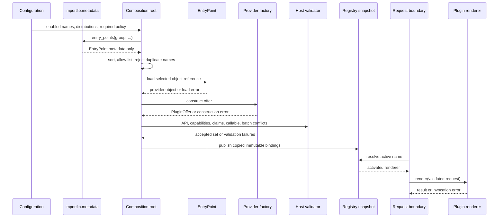

# SDP-PYT-090 — Dynamic registration and plugin discovery mechanics

## Physical Notebook Core

### Problem or change pressure

An application can call code it imports directly. A plugin boundary becomes useful only when
independently installed providers must advertise implementations and the host must decide—before
traffic—which named, compatible, non-conflicting providers may run.

### One-sentence mental model

> Treat a plugin as a governed lifecycle: inspect metadata first, cross the code-execution boundary
> deliberately, validate a client-owned offer, publish one immutable registry snapshot, and invoke
> only through that snapshot.

### One essential visual

```text
provider publication             host startup                                      request time

register metadata ──> discover ──> allow-list ──> load ──> construct ──> validate ──> activate
 pyproject/dist-info    metadata      policy        code       offer       batch       snapshot
                           │            │             │          │           │             │
                           │            │             │          │           │             └──> invoke
                           │            │             │          │           │                  handler
                           │            │             │          │           └─ API/capability/
                           │            │             │          │              duplicate claims
                           │            │             │          └─ factory failure
                           │            │             └─ import code executes here
                           │            └─ disabled/unknown distribution: do not load
                           └─ EntryPoint(name, group, value, distribution/version)
```

### How to read this visual

Read left to right. Each arrow crosses a different responsibility and failure boundary. The long
line separates provider publication, host startup, and request-time invocation. “Load” means the
entry-point object reference is resolved; for a normal Python target this imports and executes its
module. “Activate” publishes the already validated set; it does not execute a request.

### Key insight

Discovery answers “what is advertised?” It does not answer “what is allowed, safe, compatible,
unique, healthy, or active?” Those are host-owned decisions supported by separate evidence.

### Simplification or limitation

This is a conceptual lifecycle, not the literal internals of `importlib.metadata`, CPython memory,
an installer, or a sandbox. Custom metadata providers and import hooks may add behavior. Process
isolation, signatures, deployment orchestration, and plugin-internal dependencies are omitted.

### Governing rules or invariants

1. Prefer direct imports, explicit configuration, or a static registry until independently
   installed providers create real discovery pressure.
2. Filter names and distributions from metadata before `EntryPoint.load()`; loading can execute
   arbitrary module code with the host process's authority.
3. Keep discovery, load, construction, validation, activation, and invocation errors distinct.
4. Let the client own the smallest request, result, manifest, and callable/factory contract.
5. Reject all duplicate name or semantic-claim contenders; deterministic order must not silently
   select a winner.
6. Build a fresh registry, validate the whole set, then publish an immutable snapshot exactly once
   per startup attempt.
7. Every worker process performs the same governed startup; read-only bindings do not make plugin
   state thread-safe or cross-process shared.
8. Record provider, distribution, version, stage, and outcome without payloads, credentials, or
   unsanitized secrets.

### Minimal Python example

```python
from collections.abc import Callable
from dataclasses import dataclass
from importlib.metadata import entry_points
from types import MappingProxyType
from typing import Mapping


@dataclass(frozen=True)
class Request:
    record_id: str


@dataclass(frozen=True)
class Offer:
    name: str
    api_major: int
    claims: frozenset[str]
    render: Callable[[Request], str]


def start(enabled: frozenset[str]) -> Mapping[str, Offer]:
    candidates = sorted(entry_points(group="example.reporters"), key=lambda ep: ep.name)
    selected = [candidate for candidate in candidates if candidate.name in enabled]

    offers: dict[str, Offer] = {}
    for candidate in selected:
        provider = candidate.load()  # normal Python target imports/executes module code
        offer = provider()
        if not isinstance(offer, Offer) or offer.api_major != 1:
            raise TypeError(f"invalid offer: {candidate.name}")
        if offer.name in offers:
            raise ValueError(f"duplicate plugin: {offer.name}")
        offers[offer.name] = offer
    return MappingProxyType(dict(offers))
```

This is intentionally incomplete: production policy also needs distribution allow-listing,
capability and semantic-claim validation, precise failure stages, required-plugin readiness, safe
telemetry, and batch duplicate checks. The worked implementation supplies those concerns without
becoming a reusable framework.

### One common misconception

**Mistake:** “An entry point is a safe plugin object that Python already validated.”

**Correction:** an entry point is installed-distribution metadata containing a group, name, and
object reference. `load()` resolves that reference. The consumer defines the expected interface and
conflict policy; loading normal Python code is not authentication, compatibility proof, or sandboxing
([PyPA entry-point data model](https://packaging.python.org/en/latest/specifications/entry-points/)).

### Important trade-offs

- Entry points decouple distribution and host release cycles, but widen the startup, supply-chain,
  compatibility, observability, and failure surface.
- Fail-fast protects required correctness; quarantine can preserve optional capability but risks a
  silently degraded service unless readiness and telemetry make that state explicit.
- Immutable snapshots simplify concurrent reads and repeatable diagnosis, but hot reconfiguration
  then requires a new snapshot plus an application-owned publication protocol.
- A narrow client-owned dataclass and callable are easy to understand; a speculative universal
  plugin framework creates more lifecycle than most applications need.

### Interview-revision cues

- Say the stages separately: register/advertise, discover, filter, load, construct, validate,
  activate, invoke.
- State exactly where third-party code can first execute and why an allow-list should be applied
  earlier.
- Distinguish entry-point name, semantic claim, distribution name, import module, distribution
  version, and plugin API version.
- Reject “first one wins”; sort for reproducibility, then reject every duplicate claimant.
- Explain required fail-fast versus optional quarantine, process-local state, immutable publication,
  safe telemetry, and rollback.
- Prefer a direct import or dictionary when installed-package discovery is not a real requirement.

## Unit metadata

| Field | Value |
|---|---|
| Domain | Pythonic design mechanisms |
| Curriculum | [SDP-PYT-090](../../../CURRICULUM.md#sdp-pyt-090) |
| Progress | [PROGRESS.md](../../../PROGRESS.md) |
| Python references | [PYTHON_REFERENCES.md](../../../PYTHON_REFERENCES.md) |
| Learning outcome | Implement registration, entry-point-style discovery, import boundaries, duplicate detection, and safe plugin contracts. |
| Hard prerequisites | [SDP-FND-100](../../../CURRICULUM.md#sdp-fnd-100), [SDP-PYT-020](../../../CURRICULUM.md#sdp-pyt-020), [SDP-PYT-070](../../../CURRICULUM.md#sdp-pyt-070); Python bridge `PY-MOD-010`, `PY-MOD-020`, `PY-MOD-030`, `PY-MOD-070` |
| Soft prerequisites | None specified by the curriculum |
| Priority | Professional |
| Interview frequency | Medium |
| Production frequency | High |
| Python/backend relevance | High |
| Depth | D3 |
| Scope | Python, Plugins |
| Size | XL |
| First understanding | 6–9 h |
| Hands-on practice | 8–14 h |
| Evidence profile | `E+I+D+X+T` |
| Canonical Python | Python 3.14 |
| Interview compatibility | Python 3.11 |
| Artifact state | Approved |

The frequency labels are curriculum judgments, not measured survey results. Maintainer-authored
notes, examples, experiments, tests, and publication can approve this artifact. They do not prove
that Rahul predicted, practiced, explained, recalled, transferred, or defended the design. The
learning state therefore remains Not started.

## 1. Simple explanation and prerequisite bridge

Imagine an application that turns business reports into different formats. At first, it supports
text and JSON. Both implementations live in the application, so importing two functions and putting
them in a dictionary is enough.

Later, another team ships a separately installed distribution that offers a PDF renderer. The host
now has two new problems:

1. **mechanism:** how does it find an implementation whose import name it did not know when the host
   was released?
2. **governance:** which discovered code is allowed to execute, compatible with the host, unique,
   required, observable, and safe to expose to requests?

Entry-point metadata helps with the first problem. It does almost none of the second. A reliable
plugin boundary therefore resembles a careful startup pipeline, not a clever decorator.

The hard-prerequisite artifacts exist and are approved, but their tracker rows contain no learner
evidence. This minimum bridge is enough to begin:

- **SDP-FND-100:** import executes module code, reuses `sys.modules` inside a process, exposes
  partially initialized modules during cycles, and should be wired from an outer composition root.
- **SDP-PYT-020:** a registry has an owner, duplicate policy, lifecycle, and publication boundary;
  `MappingProxyType(source)` is a live view unless the source is copied first.
- **SDP-PYT-070:** a `Protocol` or annotation describes shape for static tools, not runtime behavior;
  behavioral compatibility still needs validation and contract tests.
- **PY-MOD-010/020/030/070:** know modules, package execution, `sys.path`, caching, circular imports,
  package layouts, installed metadata, and entry points.

Study in this order: this note → [worked demo](examples/run_plugin_demo.py) →
[interactive lifecycle visual](visuals/README.md) →
[entry-point boundary experiment](experiments/EXP-01-entry-point-load-boundary/README.md) →
[process/import experiment](experiments/EXP-02-import-cache-process-cycle/README.md) →
[unsolved practice](practice/README.md). Record predictions before running the experiments.

## 2. Real problem and forces

The worked example is a synthetic in-process report-renderer host. These are the actual forces:

| Concern | Requirement |
|---|---|
| Stable client | Send a `ReportRequest`; receive a `RenderedReport`. |
| Independent providers | Some implementations may arrive in separately installed distributions. |
| Conservative selection | Explicit configured imports remain the default; dynamic discovery is an opt-in addition. |
| Pre-load policy | Disabled names and non-allow-listed distributions must not execute. |
| Compatibility | A plugin API major and required capabilities must match host policy. |
| Unique ownership | Entry-point names and semantic report claims must have no ambiguous owner. |
| Reproducibility | Input order and metadata enumeration order must not change the result. |
| Readiness | Required providers must activate before the process reports ready. |
| Optional degradation | An optional bad provider may be quarantined only under explicit policy. |
| Publication | Request code sees one complete immutable snapshot, never a half-built dictionary. |
| Diagnosis | Operators can identify provider, distribution, version, stage, and outcome. |
| Confidentiality | Telemetry omits report bodies, credentials, configuration secrets, and unsafe error data. |
| Isolation truth | Plugins run in the application process; entry points provide no sandbox. |

If all formatters are released and deployed with the application, “independent providers” is false.
Delete dynamic discovery and keep a direct import or explicit dictionary.

## 3. History, vocabulary, and evidence labels

### 3.1 Entry-point history and current standard

The entry-point file format originated in the setuptools ecosystem and is now a PyPA
interoperability specification so build tools can publish and runtime tools can read compatible
metadata. Installed distributions commonly store it as `entry_points.txt` inside `.dist-info`.
The spec defines groups, names, object references, optional extras, and consumer-owned conflict
handling ([PyPA entry-point specification](https://packaging.python.org/en/latest/specifications/entry-points/)).

The standard library added `importlib.metadata` in Python 3.8 and made it non-provisional in 3.10.
It reads metadata for installed distributions and supplies selectable entry points
([Python 3.14 `importlib.metadata`](https://docs.python.org/3.14/library/importlib.metadata.html)).

### 3.2 Terms that must not collapse

| Term | Exact role |
|---|---|
| Distribution package | Installable, versioned project metadata and files, e.g. `Acme-Report-Plugin`. |
| Import package/module | Name used by Python import, e.g. `acme_report_runtime`. |
| Entry-point group | Consumer-defined integration namespace, e.g. `example.reporters`. |
| Entry-point name | Provider identifier within that group, interpreted by the consumer. |
| Object reference/value | Import module plus optional attribute, e.g. `acme_report_runtime:provide`. |
| Plugin API version | Host-owned contract compatibility signal returned by the provider. |
| Distribution version | Installed-project release string used for provenance and deployment policy. |
| Capability | Feature the plugin says it supports, e.g. `format.text`. |
| Semantic claim | Exclusive business ownership in this host, e.g. `report.invoice`. |
| Candidate | Metadata plus a still-unresolved loader. |
| Offer | Constructed client-owned manifest plus callable. |
| Active plugin | Validated offer published in the current process's snapshot. |

Distribution and import names are only conventionally related. One distribution may expose several
imports; several distributions may contribute one namespace; names may differ completely. Do not
derive an install command from an unknown import name
([PyPA distribution package versus import package](https://packaging.python.org/en/latest/discussions/distribution-package-vs-import-package/)).

### 3.3 Evidence labels used in this unit

- **Documented Python behavior:** public semantics stated in Python documentation.
- **Packaging behavior:** PyPA specification or packaging-guide semantics.
- **Typing behavior:** what static annotations/checkers can establish; no automatic runtime proof.
- **Design inference:** an application policy derived from change pressure, not a Python guarantee.
- **Security judgment:** a conservative operational decision based on the code-execution boundary.
- **Implementation-specific observation:** a result recorded on the tested CPython runtimes, not a
  portable language promise.

Keeping these labels honest prevents a local experiment from becoming folklore.

## 4. Formal lifecycle mechanics

### 4.1 Registration or publication

“Registration” is overloaded, so name the owner and time:

1. **Provider publication time:** a distribution declares a group/name/object reference in project
   metadata. For modern project metadata a table such as
   `[project.entry-points."example.reporters"]` encodes it
   ([`pyproject.toml` entry points](https://packaging.python.org/en/latest/specifications/pyproject-toml/#entry-points)).
2. **Host configuration time:** operators list approved local modules, provider names, or
   distributions.
3. **Host runtime registration:** startup gathers configured and discovered candidates before
   activation.
4. **Framework registry mutation:** a decorator or hook may mutate framework-owned state during
   import. That is a different mechanism and must not be smuggled in under the same word.

Publishing metadata does not call the provider. Adding a candidate does not make it active.

### 4.2 Discovery

Use the selection interface:

```python
from importlib.metadata import entry_points


candidates = tuple(entry_points(group="example.reporters"))
```

Each `EntryPoint` describes `.name`, `.group`, and `.value`, and current Python also exposes parsed
`.module`, `.attr`, `.extras`, `.dist`, plus `.load()`. `entry_points(**select_params)` applies the
same property selection as `.select()`
([Python 3.14 entry-point API](https://docs.python.org/3.14/library/importlib.metadata.html#entry-points)).

Discovery should produce inert application candidate records. Copy the useful safe metadata into
those records, sort them with an owned key, then filter policy. Do not call `load()` inside a
comprehension merely to learn what exists.

Discovery itself can fail because metadata is malformed, inaccessible, or supplied by an unusual
provider. Custom metadata finders are supported, so “enumeration can never execute code” is too
broad a claim. The maintained experiment makes the narrower observation that its ordinary local
`.dist-info` fixture is not imported during enumeration.

### 4.3 Pre-load selection and allow-listing

Apply controls available from metadata before executing the target:

- exact entry-point group;
- normalized, configured provider names;
- approved distribution identities;
- deployment enablement and required/optional classification; and
- duplicate entry-point name detection.

An allow-list reduces accidental or unauthorized activation. It does not make permitted code safe
or isolated. Treat metadata strings as untrusted input: bound length, normalize only under a stated
rule, and do not interpolate them unsafely into logs, shell commands, imports outside the declared
object reference, or package-install commands.

Distribution-name comparisons should follow PyPA normalization: lowercase and replace each run of
period, underscore, or hyphen with one hyphen. Entry-point names are a separate, case-sensitive
consumer namespace; this host deliberately requires a narrower lowercase form
([PyPA names and normalization](https://packaging.python.org/en/latest/specifications/name-normalization/)).

### 4.4 Loading

`EntryPoint.load()` resolves the object reference. The PyPA spec describes that reference as an
importable module optionally followed by `:object.attr`; conceptually resolution imports the module
then follows its attributes
([object reference data model](https://packaging.python.org/en/latest/specifications/entry-points/#data-model)).

For ordinary Python modules, import executes top-level code. The import system places the module in
`sys.modules` before execution and propagates loader exceptions
([Python import loading](https://docs.python.org/3.14/reference/import.html#loading)).

**Security judgment:** this is the first deliberate point in this pipeline where discovered target
code may execute. It has the application's file, network, memory, credential, and process authority
unless a separate isolation boundary restricts those capabilities. An entry point is not a sandbox.

Keep the load exception's identity and stage. A missing module, missing transitive dependency,
syntax error, attribute-resolution error, or provider import side effect is not a discovery failure.

### 4.5 Construction

The worked contract asks a loaded object to be a zero-argument provider factory:

```python
provider = candidate.loader()  # load boundary
constructed = provider()  # construction boundary
```

Why a factory instead of an already-created global object?

- it makes construction timing explicit;
- startup can classify construction failure separately;
- repeated startup can request a fresh offer rather than accumulate registrations;
- later, the host may deliberately pass a small context object if real dependencies justify it.

Do not introduce a container merely to call one factory. A plugin needing a database client should
receive a client-owned narrow dependency or factory context; it should not read every host service
from a locator.

### 4.6 Validation

Construction yields an `object` at the trust boundary. Static annotations inside another
distribution cannot validate that runtime value. The host narrows it explicitly and checks only the
contract it owns:

```python
if not isinstance(value, PluginOffer):
    raise TypeError("provider must return PluginOffer")
if value.manifest.name != candidate.entry_name:
    raise ValueError("manifest and entry-point names differ")
if value.manifest.api_major != host_api_major:
    raise ValueError("incompatible plugin API")
if not required_capabilities <= value.manifest.capabilities:
    raise ValueError("required capability missing")
if not callable(value.render):
    raise TypeError("renderer is not callable")
```

The exact client-owned dataclass is useful here because it makes field ownership and runtime
narrowing explicit. The render operation is one callable; no Java-shaped interface hierarchy is
needed. A `Protocol` may improve static checking for independently authored implementations, but
even `@runtime_checkable` only performs limited member checks. It does not prove signatures or
behavior. Contract tests remain necessary (see [SDP-PYT-070](../../../CURRICULUM.md#sdp-pyt-070)).

Validation has two levels:

- **individual:** name, API, capabilities, claim syntax, callable presence;
- **batch:** duplicate semantic claims, required set, dependency/order constraints if genuinely
  needed.

Do not invoke production work merely to validate shape. A health check may still have side effects
and does not prove all future inputs.

### 4.7 Activation

Activation publishes a complete validated set to request code. The worked implementation sorts
accepted plugins, copies bindings into new dictionaries, and wraps those copies:

```python
def publish(by_name: dict[str, ActivatedPlugin], claim_owner: dict[str, str]) -> RegistrySnapshot:
    return RegistrySnapshot(
        MappingProxyType(dict(by_name)),
        MappingProxyType(dict(claim_owner)),
    )
```

Copying matters. `MappingProxyType(existing_dict)` blocks writes through the proxy but still sees
later changes made through the original dictionary. A new unshared copy supports the stronger
snapshot promise established in [SDP-PYT-020](../../../CURRICULUM.md#sdp-pyt-020).

Required-plugin checks occur before publication. Under quarantine policy, an optional broken
provider can be excluded; a missing required provider still prevents readiness.

### 4.8 Invocation

Only after activation does request code resolve an active name and call its renderer. Preserve
three different outcomes:

- unknown active name: resolution failure;
- selected renderer raises: invocation failure with original exception identity;
- renderer returns wrong result: invocation contract failure.

Do not catch a broad `Exception` around lookup and handler execution and translate everything into
“plugin not found.” Do not catch `BaseException`; process control, cancellation, and interrupts need
their own application policy.

## 5. Python 3.11 and 3.14 API compatibility

The unit uses this form on both supported runtimes:

```python
selected = tuple(entry_points(group="example.reporters"))
for entry_point in selected:
    print(entry_point.name, entry_point.value)
```

The important documented differences are:

| API point | Python 3.11 | Python 3.14 | Unit rule |
|---|---|---|---|
| `entry_points(group=...)` | Selectable entry points supported. | Selectable entry points supported. | Use this form. |
| `entry_points()` with no filters | Compatibility `SelectableGroups` dictionary-like result may be returned. | Always returns `EntryPoints` since 3.12. | Do not depend on no-argument shape. |
| `EntryPoints.select(...)` | Supported. | Supported. | Fine when an already obtained collection is needed. |
| `EntryPoint` tuple-like indexing | Present as older compatibility behavior. | Removed in 3.13. | Use named attributes, never `ep[0]`. |
| `EntryPoint.dist` | Present in the tested standard-library object; older/interoperable lookalikes may omit it. | Documented current attribute. | Read defensively for provenance; do not select by object equality. |

The 3.11 documentation explicitly tells users to rely on the selection interface; the 3.14 docs
record the 3.12 return-shape change and 3.13 removal of the individual entry point's tuple-like
interface ([Python 3.11 compatibility note](https://docs.python.org/3.11/library/importlib.metadata.html#entry-points),
[Python 3.14 version notes](https://docs.python.org/3.14/library/importlib.metadata.html#entry-points)).

Current documentation also notes that selecting by `.dist` is not supported because different
`Distribution` instances do not necessarily compare equal. Select by group/name, copy provenance,
then apply application policy using normalized string identities.

## 6. Import boundaries, caching, cycles, and process-local state

### 6.1 `sys.modules` is a cache, not a plugin manager

Python checks `sys.modules` before searching. A cached module object normally satisfies another
import. Deleting an entry can cause a different module object to be created later while old
references remain; `reload()` reuses the object and reruns code
([Python module cache](https://docs.python.org/3.14/reference/import.html#the-module-cache)).

Consequences:

- loading two entry points targeting one module may execute that module once in an ordinary process;
- calling a provider factory twice can still construct twice;
- a decorator registry populated at import is process-local mutable state;
- deleting `sys.modules` does not safely undo file handles, threads, registrations, native state, or
  references held elsewhere; and
- plugin hot-unload is not supplied by import caching.

### 6.2 Circular imports remain a design risk

The import machinery inserts a module into `sys.modules` before executing its body. That prevents
unbounded recursion but exposes the partially populated object to a cycle. A plugin implementation
that imports a client contract is healthy; a contract module that imports every plugin back can
create this timing:

```text
host_contract starts
  └─ imports plugin_alpha
       └─ imports host_contract.PluginOffer before that definition executed
```

Preferred source direction:

```text
plugin implementation ──imports──> small host contract
composition root ──imports/configures──> host and selected plugins
host contract ──does not import──> plugin implementations
```

A local import may defer the symptom but does not prove responsibility is fixed.

### 6.3 Every process owns startup state

`sys.modules`, ordinary dictionaries, locks, and the published snapshot are process-local. A
multi-worker service must run or inherit a verified startup according to its actual process model,
then report comparable inventories. A forked memory image is still not coordinated mutable state;
a spawned worker normally imports afresh.

The [process experiment](experiments/EXP-02-import-cache-process-cycle/README.md) observes same-
process reuse, fresh child execution, and a circular import failure without claiming every process
manager behaves identically.

## 7. Participants and responsibilities

| Participant | Responsibility | What it must not own |
|---|---|---|
| Provider distribution | Publish accurate group/name/object-reference metadata. | Host enablement, conflict winners, or readiness. |
| Client contract module | Own minimal request, result, manifest, callable/factory types, and semantics. | Import every implementation or framework internals. |
| Configured candidate source | Name explicitly approved modules/providers. | Hidden scanning or request-time imports. |
| Discovery adapter | Select entry-point metadata and copy safe provenance. | Loading, trusting, or invoking candidates. |
| Startup policy | Decide enablement, distribution allow-list, compatibility, capabilities, required names, and failure mode. | Plugin business behavior. |
| Loader boundary | Resolve exactly one candidate object reference. | Calling the provider or erasing the import error. |
| Provider factory | Construct one offer under the documented lifecycle. | Publishing itself globally or reading all host internals. |
| Validator | Narrow the offer and check individual plus batch invariants. | Treating version metadata as proof. |
| Activator | Publish one complete immutable snapshot and readiness result. | Mutating bindings during requests. |
| Invocation boundary | Resolve an active plugin, call once, enforce result, and record safe outcome. | Relabeling handler errors as discovery errors. |
| Plugin renderer | Honor request/result/error/effect/concurrency behavior. | Choosing global activation policy. |

## 8. Collaboration and execution flow



### How to read this visual

Read startup through snapshot publication before reading the final request interactions. A return
arrow may contain a typed success or a stage-owned failure. The `EntryPoint` load call is separated
from the provider factory call on purpose.

### Key insight

The host, not the packaging API, turns advertisements into active capabilities. Request code needs
only the final snapshot and never participates in discovery or mutation.

### Simplification or limitation

This conceptual sequence omits installer verification, custom finders/loaders, plugin-internal
calls, async cancellation, process creation, native code, retry, shutdown, and deployment rollback.
It does not claim that a successful validation call makes hostile code safe.

Use the [interactive lifecycle explorer](visuals/plugin-lifecycle-explorer.html) to switch between
success, duplicate, compatibility, quarantine, and invocation-failure traces.

## 9. Start with the simplest design

### 9.1 Direct import

```python
from report_formats import render_json, render_text


def render(format_name: str, request: ReportRequest) -> RenderedReport:
    if format_name == "json":
        return render_json(request)
    if format_name == "text":
        return render_text(request)
    raise LookupError(format_name)
```

For two application-owned formats this is excellent: local, searchable, testable, and obvious.
Nothing about an `if` demands a plugin system.

### 9.2 Static dictionary

```python
RENDERERS = {
    "json": render_json,
    "text": render_text,
}
```

This makes a named dispatch key explicit. Add duplicate-aware construction and immutable publication
only if multiple modules contribute entries. This is the registry boundary from `SDP-PYT-020`.

### 9.3 Explicit configured imports

```python
CONFIGURED = (
    "application_plugins.invoice",
    "application_plugins.status",
)
```

An outer startup module can import this reviewed allow-list and call each provider. This supports
deployment configuration without scanning every installed distribution. Prefer it when operations
already knows the finite modules.

### 9.4 The change that earns discovery

Entry points become useful when all of these are true:

- providers are distributed independently;
- the host cannot reasonably hard-code every import name;
- installation metadata is the agreed advertisement channel;
- the host owns a stable narrow contract and compatibility policy; and
- operations can govern which installed advertisements may execute.

Adding discovery before those forces exist spends complexity without buying decoupling.

## 10. Minimal Pythonic and production-oriented implementations

### 10.1 Small mechanism

The notebook example is the smallest recognizable entry-point pipeline. It uses a frozen dataclass
for the manifest and one callable for behavior. That is enough to teach the boundary, but it validates
duplicates incrementally and omits important operational policy.

### 10.2 Worked implementation

[plugin_runtime.py](examples/plugin_runtime.py) adds only concerns justified by this unit:

- `PluginCandidate` copies entry metadata and preserves a deferred loader;
- `configured_import_candidate()` and `static_candidate()` keep explicit paths first-class;
- `discover_entry_point_candidates()` uses the cross-version selection API without loading;
- `HostPolicy` owns enablement, distribution allow-listing, API/capability requirements, required
  names, and fail-fast/quarantine behavior;
- `PluginManifest` and `PluginOffer` are client-owned frozen records;
- the provider is a simple zero-argument factory and the renderer is one callable;
- stage-specific failures distinguish registration, load, construction, validation, activation,
  and invocation;
- duplicate entry names are rejected before load;
- duplicate semantic claims are found across the validated batch and every claimant is rejected;
- activation copies sorted bindings into a `RegistrySnapshot`;
- repeated startup builds fresh state rather than mutating a module-global registry; and
- lifecycle events contain safe provider provenance, stage, and outcome.

Run the explicit configured path:

```bash
uv run --locked python units/pythonic/SDP-PYT-090-dynamic-registration-plugin-discovery-mechanics/examples/run_plugin_demo.py
```

The demo intentionally does **not** scan installed packages. One configured module and one already
imported provider prove that explicit mechanisms remain available even after a discovery adapter
exists.

### 10.3 Why the code is not a framework

It has no service locator, dependency graph, plugin subclass hierarchy, hook specification language,
remote installer, signature system, hot reload, ordering DSL, lifecycle event bus, async wrapper,
or framework adapter. Add one only after a concrete application requirement and tests demand it.

## 11. Compatibility and capability negotiation

### Distribution version is not plugin API version

`Acme-Report-Plugin==2.4.0` identifies an installed distribution release. It may help reproduce a
deployment or apply an operator constraint. It does not by itself state which host contract the
provider honors, whether the metadata is truthful, or whether behavior is correct.

The worked offer therefore declares:

```python
PluginManifest(
    name="invoice-json",
    api_major=1,
    capabilities=frozenset({"format.json"}),
    claims=frozenset({"report.invoice"}),
)
```

The host separately requires API major `1` and any capability needed for that integration. A major
match is a coarse compatibility assertion, not proof. Validate data, run contract suites against
supported providers, test known-good release sets, and monitor real invocation outcomes.

### Capabilities and claims answer different questions

- A **capability** may be shared: several plugins can support `format.text`.
- A **semantic claim** is exclusive under this host's policy: only one active plugin may own
  `report.invoice`.

If shared claims are a real requirement, model selection explicitly—priority, tenant, route, or
composition—rather than weakening uniqueness accidentally. Do not call a preference number a
solution before ownership is clear.

### Negotiation should be finite and diagnosable

Prefer a small version/capability matrix over runtime signature archaeology. Python annotations are
not retained behavioral contracts, and `inspect.signature()` cannot prove results, side effects,
thread safety, cancellation, or compatibility with wrapped/native callables.

## 12. Duplicate policies and deterministic ordering

The PyPA specification requires names to be unique within one distribution, but if different
distributions provide the same name, the consumer decides what to do. This host rejects ambiguity
([entry-point name rules](https://packaging.python.org/en/latest/specifications/entry-points/#data-model)).

### Duplicate name

Detect from metadata before load:

```text
Visual-A==1.0 : invoice
Visual-B==9.0 : invoice
                      -> reject both; execute neither
```

Do not choose the highest version unless product policy explicitly defines both distributions as
versions of one trusted provider. Lexical distribution order, environment iteration order, and
“last registered wins” are not business rules.

### Duplicate semantic claim

Distinct names may still collide after construction:

```text
alpha -> report.invoice
beta  -> report.invoice
                      -> reject both from the published claim index
```

Validate the complete batch before activation so the first plugin is not published and then silently
replaced. In quarantine mode, all collision participants are excluded. In fail-fast mode, startup
stops with every deterministic claimant identified.

### Determinism

Sort by an owned stable tuple such as normalized entry name, distribution name, version text,
object reference, and source. Determinism provides reproducible diagnostics and snapshot order. It
must not be used as hidden conflict resolution.

## 13. Fail-fast, quarantine, and readiness

| Situation | Default judgment | Reason |
|---|---|---|
| Required plugin missing, incompatible, or failed | Fail startup/readiness. | Serving without required behavior violates the deployment contract. |
| Duplicate exclusive claim | Fail or quarantine every claimant. | Choosing one silently hides an ambiguous configuration. |
| Optional reporting format fails to load | Quarantine may be valid. | Core service may remain correct with explicit degradation. |
| Security-sensitive authorization plugin fails | Fail closed. | Optional degradation would remove a control. |
| Invocation of one optional plugin fails | Preserve error; apply request-level fallback only if specified. | Startup health cannot guarantee each input succeeds. |

Quarantine needs a durable inventory, alert, metric, readiness distinction, and operator-visible
reason. “Continue on every exception” is not resilience. Catch `Exception` at the owned plugin
boundary, preserve type/cause internally, sanitize external messages, and let system-control
exceptions follow platform policy.

The worked implementation refuses activation when any `required_names` entry is absent even under
quarantine mode.

## 14. Precise failure boundaries

| Stage | Input → output | Example failures | Containment or response |
|---|---|---|---|
| Provider registration/publication | Project config → installed metadata | Invalid build metadata, wrong group/value | Build/install rejection; not a host invocation error. |
| Discovery | Group → entry-point records | Metadata provider/read/parse failure | Fail discovery or use explicitly documented fallback; no candidate load assumed. |
| Runtime registration/filter | Candidate records → permitted unique candidates | Duplicate name, disabled name, distribution not allowed | Reject before load; no winner by order. |
| Load | Permitted candidate → resolved object | Missing module/dependency/attribute, syntax/import side effect | Fail fast or quarantine optional candidate; retain load stage. |
| Construction | Resolved object → returned value | Non-callable target, factory exception, invalid environment dependency | Retain construction stage; do not call it validation unless no construction occurred. |
| Individual validation | Returned value → valid offer | Wrong dataclass, name mismatch, API/capability/claim/callable error | Reject candidate; no activation. |
| Batch validation | Valid offers → conflict-free set | Duplicate semantic claim or unmet dependency | Reject all conflict participants or fail startup. |
| Activation | Valid set → immutable snapshot/readiness | Required provider absent, publication invariant failure | Do not expose partial state; process not ready. |
| Resolution | Active name → activated plugin | Unknown/inactive name | Owned lookup error; no handler ran. |
| Invocation | Plugin + request → result | Handler error, timeout/cancellation policy, wrong result | Preserve handler identity/cause and record safe outcome. |

An error type alone may not identify the stage. A provider can raise `ImportError` during its factory
or a renderer can raise `TypeError`. Stage comes from the boundary currently executing, not from a
guess based on exception class.

## 15. Testing strategy

| Test layer | What it proves | What not to overspecify |
|---|---|---|
| Static/direct behavior | Built-in callable results, errors, and invariants. | Discovery machinery when none is used. |
| Discovery adapter | Group selection, metadata copying, no deliberate `load()` call, stable sort. | Environment enumeration order. |
| Synthetic distribution integration | Real `.dist-info` is found and `EntryPoint.load()` resolves its target. | Any actual third-party distribution. |
| Load boundary | Import/attribute failures retain stage and provenance. | Private importlib classes or cache layout. |
| Construction boundary | Factory call count and exception identity. | Plugin-internal object graph. |
| Contract validation | Wrong offer, name, API, capability, claim, and callable are rejected. | Static annotations as runtime proof. |
| Duplicate policy | Reverse input order gives the same all-claimants rejection. | First/last winner behavior. |
| Activation | Required names gate readiness; public bindings reject writes. | Concrete proxy type if another implementation preserves contract. |
| Idempotency | Two startup attempts produce equivalent fresh inventories without accumulation. | Object identity of newly constructed handlers. |
| Invocation | Lookup, one call, result postcondition, error identity, safe observation. | Handler implementation details. |
| Process integration | Every worker reaches the intended inventory independently. | Shared global state that does not exist. |
| Static typing | Client-owned factory/offer/call signatures compose under both targets. | Runtime compatibility or behavior. |

[test_plugin_runtime.py](examples/test_plugin_runtime.py) covers the pipeline policy and boundaries.
[test_runtime_probes.py](examples/test_runtime_probes.py) checks a temporary distribution, load-time
module execution, cache reuse, child processes, and a cycle. The fixture group and module names are
unique, and no real plugin is loaded.

Do not patch `importlib.metadata.entry_points` in every integration test and then claim packaging
works. Use fast fakes for policy plus at least one isolated real metadata fixture.

## 16. Observability and debugging

### Safe lifecycle event

The worked event contains only:

```text
provider | distribution | version | stage | outcome
```

Examples:

```text
invoice-json | Acme-Report-Plugin | 2.4.0 | validation | ok
invoice-json | Acme-Report-Plugin | 2.4.0 | invocation | error:TimeoutError
```

Useful additions may include deployment ID, process/worker ID, startup-attempt ID, duration bucket,
and a bounded error code. Avoid plugin arguments/results, report body, environment variables,
credentials, tokens, raw configuration, arbitrary `repr()`, full tracebacks in user-visible output,
or unbounded metadata strings. Internal exception telemetry still needs access control and redaction.

### Startup inventory

Publish or log a deterministic digest containing:

- host plugin API version;
- enabled and required names;
- active name → distribution/version/object reference;
- semantic claim → owner;
- quarantined candidate → stage/reason code; and
- configuration/deployment identity.

Treat this as configuration evidence, not health proof. Compare inventories across workers and
during rollout. A provider can pass startup then fail on a later input.

### Debugging order

1. Confirm the exact interpreter/environment and entry-point group.
2. Enumerate metadata without loading; inspect bounded name/value/distribution/version fields.
3. Confirm allow-list and required/optional policy.
4. Detect duplicate names before asking why one “won.”
5. Run one selected `load()` in an isolated synthetic/reproduction environment.
6. Separate provider construction from offer validation.
7. Inspect batch semantic-claim conflicts.
8. Compare the published registry inventory across processes.
9. Resolve the active name, then reproduce the renderer directly.
10. Preserve the stage and causal exception instead of applying one broad translation.

## 17. Security and operational judgment

### Entry points are advertisement, not trust

The packaging spec lets an installed distribution advertise an object reference. It does not claim
that the publisher is approved, the wheel was verified by this application, the object is benign,
or the code is isolated. An attacker or accidental dependency with installation access may add
metadata to the environment.

**Security judgment:** control the environment and installation path, pin and review deployments,
apply an explicit pre-load allow-list, use least-privilege process credentials, and minimize what the
host passes to a plugin. These reduce risk; they do not turn in-process untrusted code into trusted
code.

If the requirement says “run code we do not trust,” an in-process entry-point plugin system is the
wrong security boundary. Evaluate a separate process, container, restricted service account,
validated message protocol, resource limits, timeouts, audit controls, and platform-specific
sandboxing. Even then, isolation is a system design to test—not a label supplied by Python metadata.

### Loading has application authority

Normal module execution can read globals, import more modules, start threads, open files/sockets,
mutate registries, and access credentials already available to the process. Filtering **after**
`load()` is too late to prevent those import-time effects. Filter with metadata first, then cross the
boundary deliberately.

### Metadata and versions are inputs

Names, object references, distribution metadata, versions, manifests, and capabilities may be
wrong or malicious. Validate syntax and policy, but do not call validation “proof.” Provenance
systems, signed artifacts, SBOMs, vulnerability scanning, and supply-chain controls are separate
layers outside this unit.

### Rollback

A practical rollback usually deploys a previous known-good environment/configuration and restarts
workers. Deleting a registry entry or `sys.modules` key cannot reverse arbitrary imported code.
Record the active inventory so rollback targets are identifiable.

## 18. Concurrency, idempotency, and lifecycle

### Idempotent startup

An idempotent startup attempt should not accumulate registrations merely because it is called twice.
The worked pipeline:

1. receives explicit candidate iterables;
2. creates new validation lists and maps;
3. calls repeatable provider factories;
4. publishes a new snapshot; and
5. leaves no module-global active registry behind.

Equivalent inventories may contain newly constructed handler objects; idempotency concerns the
observable configuration and effects, not object identity. A provider factory that sends email,
migrates a database, or appends global hooks is not automatically repeatable. Put irreversible work
behind an explicit separate lifecycle and test its retry semantics.

### Immutable publication and threads

A copied read-only mapping prevents structural mutation through the public snapshot. This makes
concurrent resolution easier to reason about once a reference is safely published. It does **not**
make a renderer, captured client, cache, counter, file, or database transaction thread-safe.

The public Python documentation does not turn a mapping proxy into an atomic hot-swap protocol.
If live reconfiguration is required, build and validate a complete new snapshot, synchronize one
reference replacement under the application's actual memory/concurrency model, drain or version
in-flight work, and keep rollback. Often a rolling process restart is simpler.

### Async and cancellation

This unit's renderer is synchronous. For async plugins, define whether the contract returns an
awaitable, how deadlines and cancellation propagate, what cleanup is guaranteed, and whether a
timeout means underlying work stopped. Do not hide cancellation under quarantine or generic error
translation.

## 19. Performance and memory

Do not choose plugins for assumed speed. Measure the actual environment when startup or invocation
cost matters.

Potential costs include:

- scanning installed distribution metadata;
- importing target modules and transitive dependencies;
- provider construction, validation, or health checks;
- one-time cold caches in every worker;
- telemetry and contract checks around calls; and
- memory retained by modules, closures, clients, native libraries, and registry references.

Discovery belongs at a controlled startup boundary, not per request. Store the published snapshot,
not repeated entry-point enumeration. Avoid eager loading disabled candidates. Parallel loading is
not automatically better: import locks, side effects, duplicate reporting, deterministic diagnostics,
resource spikes, and provider thread safety complicate it. Establish a measured startup problem
before adding concurrency.

The unit publishes no latency or memory numbers because no representative production workload was
benchmarked.

## 20. Alternatives and variants

| Mechanism | Prefer it when | Main boundary/cost |
|---|---|---|
| Direct import and call | One known implementation or a tiny closed set exists. | Lowest indirection; central edits are appropriate. |
| Static dictionary/registry | Explicit string/enum keys select application-owned callables. | Owner must handle duplicates and publication. |
| Configured module imports | Deployment chooses a finite reviewed set whose module names are known. | Import executes code; no installed-metadata scan. |
| Decorator registration | One framework deliberately owns import-time registration and module loading order. | Global mutable process state, duplicate/import-order/test isolation risks. |
| Entry points | Independently installed distributions need a standard advertisement channel. | Metadata, load, trust, compatibility, and operations surface. |
| Namespace-package scanning | Providers deliberately share an import namespace and module discovery is meaningful. | Namespace/package complexity and importing discovered modules still executes code. |
| Naming-convention scan | Distribution or module prefix is the agreed ecosystem convention. | Broad naming can collide; index querying/installation is a separate security decision. |
| Framework registry | A framework already defines contracts, lifecycle, checks, ordering, and tooling. | Coupling to framework semantics; do not wrap it without missing requirements. |
| Remote service | Isolation, independent scaling, or non-Python providers dominate. | Network protocol, availability, auth, latency, and operations. |
| No plugin system | Providers are not truly independent or extension is speculative. | Simpler deployment and navigation usually win. |

PyPA documents naming conventions, namespace packages, and package metadata as three automatic
discovery approaches. It warns that namespace packages are complex and recommends a dedicated
plugin namespace rather than making an application's main top-level package a plugin namespace
([creating and discovering plugins](https://packaging.python.org/en/latest/guides/creating-and-discovering-plugins/)).

### Decorator registration is not discovery

```python
REGISTRY: dict[str, Renderer] = {}


def register(name: str):
    def decorator(renderer: Renderer) -> Renderer:
        REGISTRY[name] = renderer
        return renderer

    return decorator
```

The decorator runs only if the defining module executes. Something else must import or discover that
module. Ordinary dictionary assignment also silently replaces duplicates. A deliberate framework
can add lifecycle and policy; the eight-line decorator has not done so.

### Namespace package discovery

A shared namespace can let multiple distributions contribute modules found with
`pkgutil.iter_modules(namespace.__path__, namespace.__name__ + ".")`. This discovers import names,
not entry-point manifests or client compatibility. It couples providers to namespace layout and
still needs allow-list, loading, validation, activation, and telemetry.

### Framework registries

Django, pytest, and other frameworks have their own extension contracts and lifecycle. Use the
framework's documented mechanism when it owns the application boundary. Do not build a second
generic registry merely to rename framework concepts, and do not assume one framework's ordering,
isolation, or reload behavior applies elsewhere.

## 21. Relationship to `SDP-PYT-080` and other units

`functools.singledispatch` associates implementations with runtime classes and selects from the
first argument's runtime type. It does **not** enumerate installed distributions, inspect entry-point
metadata, approve providers, negotiate capabilities, construct plugins, resolve semantic duplicates,
publish readiness, or isolate code. An entry-point-loaded module may happen to call `.register`, but
that composition does not merge the two responsibilities.

| Related unit | Relationship | Key difference |
|---|---|---|
| [SDP-FND-100](../../../CURRICULUM.md#sdp-fnd-100) | Prerequisite | Explains import/package boundaries; this unit governs independently installed extensions. |
| [SDP-PYT-020](../../../CURRICULUM.md#sdp-pyt-020) | Prerequisite/composition | Owns callable dictionaries and registries after candidates are known. |
| [SDP-PYT-070](../../../CURRICULUM.md#sdp-pyt-070) | Prerequisite | Chooses client-facing interface mechanisms; it does not discover providers. |
| [SDP-PYT-080](../../../CURRICULUM.md#sdp-pyt-080) | Comparison | Runtime type registration/dispatch is not installed-plugin discovery. |
| [SDP-SOL-020](../../../CURRICULUM.md#sdp-sol-020) | Principle | Plugin seams can support extension, but “open” does not mean ungoverned execution. |
| [SDP-SOL-050](../../../CURRICULUM.md#sdp-sol-050) | Dependency direction | Plugins depend on a client-owned contract; the outer composition root selects concretes. |
| [SDP-CRE-010](../../../CURRICULUM.md#sdp-cre-010) | Later construction lens | A loaded provider factory constructs an offer, but this unit does not require a class-pattern hierarchy. |

## 22. Refactoring path

1. Preserve the direct/static behavior with characterization and handler contract tests.
2. Prove independent installation is the real change pressure.
3. Write the smallest client request, result, manifest, and callable/factory contract.
4. Keep built-ins and known providers as explicit imports or static candidates.
5. Add a discovery adapter returning inert metadata records; do not load yet.
6. Add enablement and distribution allow-list filters plus duplicate-name rejection before load.
7. Separate load, construction, and validation calls with stage-owned errors.
8. Validate plugin API, capabilities, callable result, and semantic claims.
9. Validate the whole batch and reject all duplicate claimants.
10. Publish a copied immutable snapshot and gate readiness on required names.
11. Put safe observations around stage boundaries and invocation.
12. Prove repeat startup, reverse input order, multiple processes, and failure containment.
13. Remove the original conditional only when the new registry fully owns selection.
14. Delete dynamic discovery again if independent distribution pressure disappears.

The [practice lab](practice/README.md) leaves the closed alert exporter working and unsolved so this
reasoning cannot be replaced by copying the report example.

## 23. Realistic backend use case

Consider an internal compliance service. Business units release report renderers on separate
schedules. The service deployment pins a known environment and enables a small allow-list.

Startup:

1. imports required built-in renderers explicitly;
2. enumerates one owned entry-point group only when dynamic plugins are enabled;
3. copies metadata and rejects duplicate names without loading;
4. filters allowed names and distribution identities;
5. loads and constructs each selected provider;
6. validates API major, required capabilities, result callable, and exclusive report claims;
7. quarantines only explicitly optional failures;
8. refuses readiness if a required report claim has no active provider;
9. publishes a process-local immutable snapshot; and
10. emits a redacted inventory for rollout comparison.

Request handling parses and authorizes external input before creating a client-owned
`ReportRequest`. It resolves an active provider, invokes once, enforces `RenderedReport`, records a
safe outcome, and lets the application error policy decide retry or response. The plugin never
receives the web framework request, environment mapping, credential store, or service locator.

This design does not provide job durability, transaction atomicity, authorization, remote isolation,
or exactly-once effects. Those remain separate application/architecture concerns.

## 24. When to use it

- Independently installed Python distributions must advertise implementations to a stable host.
- A narrow client-owned in-process contract can remain compatible across releases.
- Startup is an acceptable time to discover, validate, and publish capabilities.
- Operators can pin environments, govern an allow-list, observe inventories, and roll back.
- Plugin code is trusted enough to run with the constrained application's process authority.
- Duplicate, required/optional, and compatibility policies are explicit.

## 25. When not to use it

- A direct import, conditional, callable argument, or static dictionary handles a small owned set.
- “Maybe someday” is the only extension pressure.
- Untrusted code must be isolated from memory, files, network, or credentials.
- Providers need independent scaling or are written in other languages; use a service/protocol.
- Compatibility cannot be stated and tested as a narrow client contract.
- Request-time hot installation/uninstallation is expected without a safe lifecycle design.
- The framework already owns a sufficient registry and discovery contract.

## 26. Common misuse and overengineering

| Misuse | Why it fails | Better move |
|---|---|---|
| Load every discovered entry point, then filter. | Disabled code has already executed. | Filter group/name/distribution metadata first. |
| Treat entry points as trusted/sandboxed. | Metadata is advertisement; load runs in process. | Control installation and privileges; isolate truly untrusted code. |
| First/last/highest version wins duplicates. | Ordering or version becomes an accidental business rule. | Reject all claimants unless an explicit ownership policy exists. |
| Use distribution version as API proof. | Release labels do not prove host-contract behavior. | Separate plugin API/capabilities and contract evidence. |
| Decorator global called “discovery.” | The module still must be imported and mutation is hidden. | Name import wiring and registry lifecycle separately. |
| Catch every exception as “plugin unavailable.” | Stage and handler cause disappear. | Catch at precise boundaries and preserve cause. |
| Publish a dictionary while building it. | Requests may observe partial configuration. | Build privately, validate batch, publish snapshot. |
| Assume a mapping proxy freezes handlers. | Bindings are read-only; referenced objects may mutate. | Specify and test plugin state/concurrency behavior. |
| Delete `sys.modules` to unload. | Existing references and side effects remain. | Restart/roll back a known environment or design true isolation. |
| Build a universal hook/dependency/order DSL. | Speculation multiplies contracts and failure modes. | Add only the one extension point demanded now. |
| Query/install from a package index at request time. | Supply-chain and availability decisions invade serving. | Build a reviewed immutable deployment environment. |

## 27. Interview preparation

### Common formulations

1. Design a Python plugin system using entry points.
2. What exactly happens when `EntryPoint.load()` is called?
3. How would you avoid importing disabled plugins?
4. How do you handle two distributions publishing the same plugin name?
5. How do plugin API versions differ from package versions?
6. When should startup fail versus quarantine a plugin?
7. How do you make a registry deterministic and safe for concurrent readers?
8. Why is `singledispatch` not plugin discovery?
9. What changes in a multi-process deployment?
10. How would you run untrusted plugins safely?

### Strong short answer

> I would start with explicit imports and a static callable registry. If providers are independently
> installed, I would select one namespaced entry-point group, copy and sort metadata, apply name and
> distribution allow-lists, and reject duplicate names before `load()`. Loading can execute module
> code, so it is a trust boundary, not validation. I would load a small client-owned provider
> factory, construct an offer, validate API/capabilities and batch semantic claims, then publish a
> copied immutable process-local snapshot. Required failures stop readiness; only explicitly optional
> failures may be quarantined. Invocation preserves handler failures and logs redacted provider,
> distribution, version, stage, and outcome. Entry points do not sandbox code; truly untrusted code
> needs process or stronger platform isolation.

### Weak-answer traps

- beginning with a metaclass, framework, or package scan before naming the extension pressure;
- saying discovery imports nothing under every custom metadata provider;
- saying `load()` “returns a class” rather than resolving whatever object reference was published;
- forgetting construction and batch validation between load and activation;
- using “highest version wins” without a product rule linking competing distributions;
- treating a `Protocol`, version, or `isinstance` result as behavioral proof;
- describing a module global as shared across workers;
- claiming immutability makes handler state thread-safe;
- logging inputs or raw errors for convenience; and
- proposing in-process entry points for hostile code.

### Likely follow-ups

1. What if the entry point resolves to an integer?
2. What if the factory imports correctly but raises while reading configuration?
3. What if two names claim the same business format?
4. What if optional quarantine removes a provider later marked required?
5. How do you prove discovery did not deliberately call `load()`?
6. How do Python 3.11 and 3.14 entry-point return shapes differ?
7. What does `sys.modules` cache, and why is deletion not unloading?
8. How would you inject a host-owned HTTP/database client?
9. How would you hot-swap a registry without partial reads?
10. Which part would you delete if all providers became application-owned?

### Code-review exercise

```python
plugins = {}
for ep in entry_points()["my.plugins"]:
    plugin = ep.load()()
    plugins[ep.name] = plugin


def run(name, value):
    try:
        return plugins[name](value)
    except Exception:
        return None
```

A senior review should identify at least:

- obsolete/no-argument return-shape dependence across supported runtimes;
- loading every candidate before any allow-list;
- import and construction collapsed;
- no client contract or compatibility/capability validation;
- silent duplicate overwrite;
- no semantic-claim conflict policy;
- mutable global published incrementally;
- no required/quarantine/readiness policy;
- all resolution and invocation failures erased;
- no safe provenance telemetry;
- unclear process/concurrency lifecycle; and
- no justification that a plugin system is needed.

### Reasoning checkpoints

A strong answer identifies the real independent-distribution force, begins with simpler alternatives,
names every stage and code-execution boundary, defines the client-owned contract and compatibility
policy, rejects duplicates deterministically, publishes immutable process-local state, distinguishes
fail-fast from quarantine, preserves invocation failures, treats telemetry and secrets carefully,
and rejects in-process discovery for untrusted code.

## 28. Closed-book revision cues

1. Draw the lifecycle from provider publication through invocation.
2. State what discovery proves and five things it does not prove.
3. Identify the first normal code-execution boundary.
4. Explain distribution name, import name, entry name, object reference, API version, capability,
   and semantic claim.
5. Reconstruct the Python 3.11/3.14 compatibility rule.
6. Explain why sorting does not resolve duplicates.
7. Design fail-fast/quarantine rules for required and optional plugins.
8. Explain immutable bindings versus mutable handler state.
9. Describe same-process import caching and multi-process startup.
10. Compare direct import, dictionary, configured import, decorator, entry points, namespace scan,
    framework registry, and remote service.
11. Explain why `singledispatch` is registration/selection by runtime type, not discovery.
12. Name the first abstraction to delete when installed-plugin pressure vanishes.

## 29. Vocabulary and professional English

### Advertise

| Item | Content |
|---|---|
| Pronunciation | `AD-ver-tize` |
| Simple English meaning | Make the existence or availability of something known. |
| Hindi cue | उपलब्धता बताना |
| Meaning here | Installed metadata says that a distribution offers a named component; it does not prove approval. |

Natural examples:

1. The sign advertises the opening time.
2. The service advertises a health endpoint.
3. The distribution advertises a provider under one entry-point group.
4. **Interview:** “Discovery reads what packages advertise; host policy decides what activates.”
5. **Engineering:** “Do not confuse an advertised capability with verified behavior.”

### Quarantine

| Item | Content |
|---|---|
| Pronunciation | `KWOR-an-teen` |
| Simple English meaning | Keep something separate because it may be unsafe or faulty. |
| Hindi cue | अलग रोककर रखना |
| Meaning here | Exclude an optional failed candidate from the active snapshot while retaining visible failure evidence. |

Natural examples:

1. The damaged shipment was quarantined.
2. The mail filter quarantined a suspicious attachment.
3. Startup quarantined one optional renderer after a load failure.
4. **Interview:** “Quarantine is safe only when the missing capability is genuinely optional.”
5. **Engineering:** “A quarantined required plugin must still fail readiness.”

### Provenance

| Item | Content |
|---|---|
| Pronunciation | `PROV-uh-nuhns` |
| Simple English meaning | Where something came from and its recorded history. |
| Hindi cue | स्रोत और इतिहास |
| Meaning here | Distribution, version, object reference, and deployment identity used to trace a provider. |

Natural examples:

1. The gallery recorded the painting's provenance.
2. The dataset includes source provenance.
3. Plugin telemetry records distribution provenance without logging request data.
4. **Interview:** “Version metadata helps provenance, not behavioral proof.”
5. **Engineering:** “The active inventory gives us enough provenance to roll back the deployment.”

### Idempotent

| Item | Content |
|---|---|
| Pronunciation | `eye-dem-POH-tent` |
| Simple English meaning | Repeating an operation has no additional externally relevant effect after the first successful application. |
| Hindi cue | दोहराने पर अतिरिक्त असर नहीं |
| Meaning here | Repeating startup builds an equivalent fresh registry without accumulating global registrations or effects. |

Natural examples:

1. Setting a flag to true is idempotent.
2. A retry-safe update uses the same idempotency key.
3. The registry builder starts from empty private state on every attempt.
4. **Interview:** “Import caching alone does not make a provider factory idempotent.”
5. **Engineering:** “The factory still writes a file, so our startup is not idempotent.”

### Negotiate

| Item | Content |
|---|---|
| Pronunciation | `nih-GOH-shee-ate` |
| Simple English meaning | Reach an acceptable choice under stated requirements. |
| Hindi cue | शर्तों पर सहमति तय करना |
| Meaning here | Compare host API/capability needs with a provider offer before activation. |

Natural examples:

1. The teams negotiated a delivery date.
2. A protocol negotiates an encoding.
3. The host negotiates only documented plugin capabilities.
4. **Interview:** “A matching package version is not capability negotiation.”
5. **Engineering:** “Keep negotiation finite so failed compatibility is diagnosable.”

## 30. Python Mastery references

The exact hard bridge from [PYTHON_REFERENCES.md](../../../PYTHON_REFERENCES.md) is:

- [`PY-MOD-010 — Modules, packages, and executable modules`](https://github.com/rahulyadev/python-mastery/blob/main/CURRICULUM.md#py-mod-010)
- [`PY-MOD-020 — Import resolution, sys.path, and module caching`](https://github.com/rahulyadev/python-mastery/blob/main/CURRICULUM.md#py-mod-020)
- [`PY-MOD-030 — Circular imports and package boundaries`](https://github.com/rahulyadev/python-mastery/blob/main/CURRICULUM.md#py-mod-030)
- [`PY-MOD-070 — Package layouts, resources, entry points, and plugin boundaries`](https://github.com/rahulyadev/python-mastery/blob/main/CURRICULUM.md#py-mod-070)

Minimum bridge if those units are not yet learned: know that import resolves a module name, caches a
module object before completing execution, runs top-level code, and can expose partial state in a
cycle; know that installed distribution metadata and import package names are different layers; and
know that entry points advertise object references which consumers choose whether to resolve.

## 31. Practice, experiments, and visual

- [Worked explicit startup demo](examples/run_plugin_demo.py)
- [Production-oriented teaching implementation](examples/plugin_runtime.py)
- [Lifecycle and policy tests](examples/test_plugin_runtime.py)
- [Static boundary examples](examples/typing_contracts.py)
- [EXP-01 — entry-point discovery versus load](experiments/EXP-01-entry-point-load-boundary/README.md)
- [EXP-02 — import cache, process scope, and circular failure](experiments/EXP-02-import-cache-process-cycle/README.md)
- [Interactive plugin lifecycle explorer](visuals/README.md)
- [Unsolved governed alert-export lab](practice/README.md)

## 32. Authoritative sources

Only sources actually read for this unit are listed:

1. [Python 3.14 `importlib.metadata`](https://docs.python.org/3.14/library/importlib.metadata.html) —
   installed-distribution metadata scope, distribution/import distinction, entry-point selection and
   attributes, `load()`, return-shape/version notes, distribution mapping, and custom providers.
2. [Python 3.11 `importlib.metadata`](https://docs.python.org/3.11/library/importlib.metadata.html) —
   compatibility-floor selectable entry points and no-argument compatibility behavior.
3. [Python 3.14 import system](https://docs.python.org/3.14/reference/import.html) — module cache,
   search/load distinction, insertion before execution, exception behavior, module execution, and
   implementation-specific boundaries.
4. [PyPA entry-points specification](https://packaging.python.org/en/latest/specifications/entry-points/) —
   interoperability purpose, group/name/object-reference data model, conflicts, extras, file format,
   and history.
5. [PyPA `pyproject.toml` entry-point metadata](https://packaging.python.org/en/latest/specifications/pyproject-toml/#entry-points) —
   modern project metadata tables and group mapping.
6. [PyPA creating and discovering plugins](https://packaging.python.org/en/latest/guides/creating-and-discovering-plugins/) —
   naming convention, namespace package, and package-metadata discovery approaches and namespace
   cautions.
7. [PyPA distribution package versus import package](https://packaging.python.org/en/latest/discussions/distribution-package-vs-import-package/) —
   distinct naming, cardinality, normalization, and security consequence of guessing install names.
8. [PyPA recording installed projects](https://packaging.python.org/en/latest/specifications/recording-installed-packages/) —
   `.dist-info`, `METADATA`, and optional `entry_points.txt` roles.
9. [PyPA names and normalization](https://packaging.python.org/en/latest/specifications/name-normalization/) —
   distribution-project name syntax and comparison normalization.

## 33. Durable clarification log

| Date | Clarification | Why it belongs in canonical notes | Source or evidence |
|---|---|---|---|
| 2026-09-06 | `singledispatch` performs first-argument runtime type registration and dispatch; it does not discover installed plugins. | Prevents a recurring mechanism-versus-lifecycle category error across adjacent units. | [SDP-PYT-080 boundary](../SDP-PYT-080-singledispatch-open-function-extension/README.md#411-controlled-extension-is-not-plugin-discovery) and Python entry-point docs. |
| 2026-09-06 | Entry-point discovery, load, provider construction, validation, activation, and invocation have separate failure identities. | Precise stages improve design, containment, tests, telemetry, and interview reasoning. | Python/PyPA documentation plus maintained synthetic experiments. |
| 2026-09-06 | Deterministic ordering makes results reproducible but must not select a duplicate winner. | Avoids hiding semantic ambiguity behind environment enumeration order. | PyPA consumer-owned conflict rule and application policy tests. |
| 2026-09-06 | Artifact approval never advances learning state without Rahul's evidence. | Preserves the repository's evidence model. | `PROGRESS.md` and `docs/WORKFLOW.md`. |
