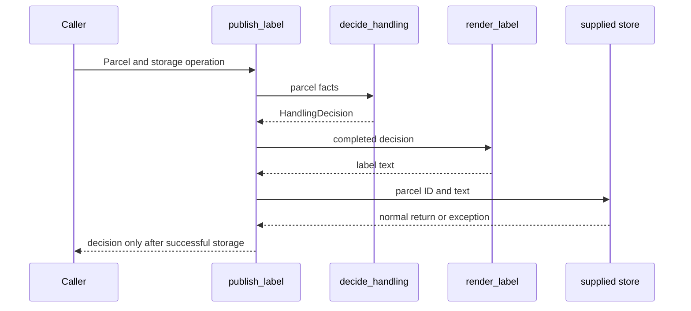

# SDP-SOL-010 — Single Responsibility Principle

## Physical Notebook Core

### Problem or change pressure

A warehouse changes which parcels require manual handling. Customer communications changes the
label wording. Platform engineers change how labels are stored. If all three decisions live in
one operation, each request makes us inspect code belonging to the other two concerns.

### One-sentence mental model

> Put decisions that change for the same reason together; give independently changing policies
> a small, explicit boundary.

### One essential visual

```text
Warehouse policy ──changes──> handling decision
Communications   ──changes──> label wording
Platform         ──changes──> storage encoding

publish: decide ──value──> render ──text──> store
         no I/O           no policy      no handling rule
```

### How to read this visual

The top arrows map a source of requirements to its policy. The bottom arrows show data passing
through one publication. A caller may coordinate these steps without owning their detailed rules.

### Key insight

Count independent reasons for changing the implementation, not methods, verbs, or lines.

### Simplification or limitation

This is a conceptual ownership map with a simplified call flow, not a file layout or Python memory
diagram. A changed handling result can change label output without changing the label code.

### Governing rules or invariants

1. Name a real change and the authority behind it before extracting anything.
2. Keep one coherent policy and its invariants together, even when they need several operations.
3. Pass results across a boundary instead of making every consumer repeat the decision.
4. Preserve observable behaviour while refactoring; change requirements in a separate step.
5. Stop splitting when the next object or module adds navigation without hiding useful knowledge.

### Minimal Python example

```python
def handling_code(grams: int, fragile: bool) -> str:
    return "manual" if fragile or grams > 2000 else "standard"


def label(parcel_id: str, code: str) -> str:
    return f"{parcel_id} | handling={code}"
```

Here the renderer accepts a decision, not the facts needed to remake it. This small illustration
assumes valid inputs; the runnable example adds a validated value and a typed result.

### One common misconception

**Mistake:** “Single responsibility means one method per class.”

**Correction:** Several methods can protect one coherent policy. A single large method can mix
unrelated policies. Moving each method into another class does not establish good boundaries.

### Important trade-offs

- A useful boundary reduces the knowledge needed for a change but adds a contract and navigation.
- A shared value avoids repeated decisions but can itself become a widely coupled contract.
- Separating policies does not provide atomic writes, safe retries, or independent deployments.

### Interview-revision cues

- Name the requirement owner and the actual axis of change.
- Distinguish changed implementation from consumers receiving changed results.
- Defend both the extraction you make and one extraction you decline.

## Unit metadata

| Field | Value |
|---|---|
| Domain | SOLID principles |
| Curriculum | [SDP-SOL-010](../../../CURRICULUM.md#sdp-sol-010) |
| Progress | [PROGRESS.md](../../../PROGRESS.md) |
| Python references | [PYTHON_REFERENCES.md](../../../PYTHON_REFERENCES.md) — no direct mapping for this unit |
| Learning outcome | Find the actual axis of change behind a class, function, or module and refactor responsibilities without creating meaningless micro-objects. |
| Hard prerequisites | `SDP-FND-020`, `SDP-FND-030`, `SDP-FND-110` |
| Soft prerequisites | None |
| Priority | Core |
| Interview frequency | High |
| Production frequency | High |
| Python/backend relevance | High |
| Depth | D2 |
| Scope | SOLID, Python |
| Size | L |
| First understanding | 4–6 h |
| Hands-on practice | 5–9 h |
| Evidence profile | E+I+D+T |
| Canonical Python | Python 3.14 |
| Interview compatibility | Python 3.11 |
| Artifact state | Approved |

Frequency labels and estimates are curriculum judgments, not measured population statistics.
Generated artifacts and passing starter tests do not establish learner mastery.

Study the note, explore the [visuals](visuals/README.md), then attempt the
[practice lab](practice/README.md). The [failure experiment](experiments/EXP-01-effects-survive-errors/README.md)
is supplementary: it does not change the canonical evidence profile. Artifact checks are recorded
in [VALIDATION.md](VALIDATION.md), separately from learner evidence.

### Minimum prerequisite bridge

The prerequisite notes exist, but their tracker states do not yet show learner practice.

- [SDP-FND-020](../../foundations/SDP-FND-020-change-pressure-responsibilities-boundaries/README.md):
  a responsibility is knowledge or a decision that some part of the system owns. A boundary
  controls which other parts need to know its details.
- [SDP-FND-030](../../foundations/SDP-FND-030-cohesion-coupling-dependency-direction/README.md):
  cohesion asks why things belong together; coupling asks what one part must know about another.
- [SDP-FND-110](../../foundations/SDP-FND-110-simplicity-heuristics-collaboration-laws/README.md):
  keep the simplest design that handles real change. Similar code is not always the same policy.

For Python, understand a function call, a returned value, and passing a function as an argument.
A dataclass packages named values; a callback lets the example record an effect without a real
database. Those mechanisms are enough to begin.

## 1. Simple explanation

Imagine a small team maintaining parcel labels. One person decides handling rules. Another decides
what the label says. A third maintains the storage integration. Their decisions can change on
different days for different reasons.

SRP helps us avoid making a wording change require knowledge of warehouse rules. It also helps us
avoid scattering one warehouse rule across several tiny objects that must be understood together.

The useful question is: **Which knowledge should I need to understand to make this particular
change safely?** It is not “How can I make every class smaller?”

## 2. Real problem and forces

A short script that calculates and prints one label may be perfectly adequate. There is no duty
to design an extension framework before another requirement appears.

Our teaching scenario now has concrete change requests:

| Requirement authority | Confirmed request | Stable behaviour |
|---|---|---|
| Warehouse | Raise the heavy-parcel threshold while preserving the fragile-parcel rule | Labels continue to report the selected handling code |
| Communications | Replace the label wording | The handling decision must not change |
| Platform | Change storage encoding or destination | Meaning of the decision and customer wording stay the same |
| Publication workflow owner | Define what counts as a successful publication | Individual policy implementations need not move into the coordinator |

These names describe policy authority, not a mandated organization chart. A small company can have
one person making all four decisions. A large team can share one policy. Diagnose the decisions
and evidence of independent change rather than copying team boxes into classes.

## 3. Formal definition and original context

Robert C. Martin's 2014 clarification describes SRP in terms of a module's reason for changing and
connects that reason to the people whose requirements it serves. In that framing, repairing a bug
or rearranging code does not automatically identify a new business responsibility.
[Source: Martin, “The Single Responsibility Principle.”](https://blog.cleancoder.com/uncle-bob/2014/05/08/SingleReponsibilityPrinciple.html)

For this unit, an **axis of change** is a coherent policy dimension that can evolve independently
of another. An **actor** is the role or group accountable for that policy, not a Python instance
or a distributed Actor-pattern object. Applying this reasoning to functions and Python modules,
and choosing the smallest useful boundary, are design judgments rather than language rules.

A bug can expose mixed responsibilities—for example, a wording fix unexpectedly changes handling.
The evidence is the leaked policy dependency, not the mere fact that a bug was fixed.

## 4. Participants and responsibilities

| Participant | Responsibility | What it must not decide |
|---|---|---|
| `Parcel` | Carry valid parcel facts | Label wording, storage location |
| `decide_handling` | Apply the warehouse rule | Customer phrasing or persistence |
| `HandlingDecision` | Carry the completed handling result | How or where it will be displayed |
| `render_label` | Produce the current label text | Whether a parcel needs manual handling |
| Supplied `store` callable | Fulfil the agreed storage operation | Recalculate the handling policy |
| `publish_label` | Order the work for one publication | Absorb every collaborator's detailed rules |

These are roles, not a prescription for six classes or files. In the runnable example, small
functions and two values share one teaching module for easy reading.

## 5. Collaboration and execution flow



### How to read this visual

Read downward in call order. Solid arrows are calls; dashed arrows carry results or the named
failure outcome. The coordinator passes one decision into the renderer.

### Key insight

The renderer sees the outcome of the warehouse decision, so changing its wording does not require
copying or editing the warehouse formula.

### Simplification or limitation

This is a synchronous call model. It omits stack unwinding detail and does not claim that storage
is durable or transactional. On a storage exception, the normal return of the decision is skipped.

## 6. Before-principle code and concrete pain

This correct baseline appears as `mixed_label` in [parcel_labels.py](examples/parcel_labels.py):

```python
def mixed_label(parcel: Parcel, store: StoreLabel) -> HandlingDecision:
    code: HandlingCode = "manual" if parcel.fragile or parcel.weight_grams > 2000 else "standard"
    text = f"{parcel.parcel_id} | handling={code}"
    store(parcel.parcel_id, text)
    return HandlingDecision(parcel.parcel_id, code)
```

For a small stable use case, leaving this together can be reasonable. In our changed scenario,
the warehouse rule and label wording have independent authorities and review needs. Both policies
are embedded in an effectful operation, so exercising either through the public operation also
invokes storage.

Merely adding methods named `step_one`, `step_two`, and `step_three` would describe execution order,
not establish ownership. Likewise, a giant `ParcelService` containing all the same policies can
still have several reasons to change even if each method is short.

## 7. Minimal Pythonic implementation

```python
def decide_handling(parcel: Parcel) -> HandlingDecision:
    code: HandlingCode = "manual" if parcel.fragile or parcel.weight_grams > 2000 else "standard"
    return HandlingDecision(parcel.parcel_id, code)


def render_label(decision: HandlingDecision) -> str:
    return f"{decision.parcel_id} | handling={decision.code}"


def publish_label(parcel: Parcel, store: StoreLabel) -> HandlingDecision:
    decision = decide_handling(parcel)
    store(decision.parcel_id, render_label(decision))
    return decision
```

Each boundary earns its place: the decision function owns warehouse policy, the renderer owns
wording, and the supplied operation owns the storage effect. `publish_label` owns sequencing.
There is no factory, interface hierarchy, service locator, or registration mechanism.

The before and after implementations intentionally coexist for comparison. They are not a
recommendation to keep duplicate policy implementations in a production system.

## 8. Typed, production-oriented mechanics

The complete [runnable example](examples/parcel_labels.py) uses these contracts:

```python
from collections.abc import Callable
from dataclasses import dataclass
from typing import Literal

HandlingCode = Literal["standard", "manual"]
StoreLabel = Callable[[str, str], None]


@dataclass(frozen=True)
class HandlingDecision:
    parcel_id: str
    code: HandlingCode
```

`Parcel` validates a nonblank identifier and positive weight. The decision value makes the
meaning of the handoff visible. The callback is sufficient for one operation; a `Protocol` becomes
worth considering only when a meaningful multi-operation contract or lifecycle appears.

**Standard-library contract:** `frozen=True` blocks ordinary field assignment; it does not
recursively freeze objects referenced by fields. These examples use immutable field values and
do not rely on freezing an embedded mutable collection.
[Source: dataclasses, Frozen instances.](https://docs.python.org/3.14/library/dataclasses.html#frozen-instances)

**Typing behaviour:** annotations describe the expected interface for static tools; Python does
not enforce those annotations as input validation. The range checks are explicit code. Inputs
with arbitrary untyped shapes require a separate parsing boundary in a real application.
[Source: typing documentation.](https://docs.python.org/3.14/library/typing.html)

**Design-level mechanics:** the useful separation comes from who owns the policy and what crosses
the boundary. A dataclass, `Callable`, or type checker cannot infer that from business context.

All supplied code uses Python 3.11-compatible syntax and standard-library APIs. No CPython
internals, performance advantage, concurrency guarantee, or production-ready storage is implied.

## 9. Simpler alternatives and the right scale

| Scale | Reasonable cohesive example | Evidence for a boundary | Overapplication to avoid |
|---|---|---|---|
| Function | Validate and normalize one identifier under one contract | Independent policies repeatedly change together by accident | A function for each arithmetic operator |
| Class | A bounded counter with `reserve`, `release`, and `remaining` protecting one invariant | Unrelated storage or display policy enters the class | One class per method |
| Module | A policy plus its constants and validation helpers | Unrelated public concerns acquire different consumers and review paths | A file per line or helper |
| Application workflow | Coordinate decision, presentation, and storage for one use case | Detailed rules or multiple unrelated use cases accumulate | An orchestrator that forwards blindly through many layers |
| Process or service | A separately operated capability when operational requirements justify it | Deployment, ownership, scale, or failure isolation must be independent | Turning every SRP extraction into a network service |

A value can contain several fields. A class can have many methods. A module can contain several
functions. The question is whether they protect coherent knowledge, not whether their count is one.

Keep functions in one module while they remain easy to understand together. If warehouse policy,
label contracts, and a storage adapter develop independent dependencies, split modules around
those concerns. Moving files alone does not remove a policy leak.

## 10. Refactoring path

1. Characterize existing outputs, validation, and effect order.
2. Name two real change requests and who approves each policy.
3. Mark the statements that encode each decision; distinguish true policy duplication from
   coincidentally equal constants.
4. Extract the smallest independently understandable decision or effect.
5. Pass an explicit result across the boundary; keep invariants with their governing policy.
6. Re-run the same behaviour tests before changing requirements.
7. Apply one real change and record which implementations and contracts changed.
8. Remove forwarding objects or speculative interfaces that hide no meaningful decision.

A useful before/after record names edited functions, changed contracts, required review knowledge,
and tests. Do not invent an SRP percentage or equate fewer edited files with a better design.

## 11. A change map, not a universal score

Use the [interactive change map](visuals/change-map.html) to switch between the same requests and
three structures. Its companion [reading guide](visuals/README.md) explains the assumptions.

For a threshold-only change, a stable result contract can leave renderer code untouched while
renderer output changes. For a new handling category, the result contract and renderer may both
need legitimate edits. SRP does not promise that every future requirement touches one file.

Organizational ownership, change history, and tests are evidence, not proofs. Two concerns can
appear in the same commit because a team batches work. One developer can implement unrelated
policies. Revisit boundaries when the actual forces change.

## 12. Backend failures, state, and observability

The practice workflow records a completion result and then sends a bulletin. A failure after
recording leaves a partial outcome. Splitting the implementation into smaller functions does not
erase completed work. In Python, an exception transfers control to a matching handler; remaining
statements on that failed path are skipped.
[Source: Python tutorial, Handling Exceptions.](https://docs.python.org/3.14/tutorial/errors.html#handling-exceptions)

The [controlled experiment](experiments/EXP-01-effects-survive-errors/README.md) uses lists to make
that distinction visible. A simulated error before delivery leaves one saved item; an error after
delivery can leave both effects completed. A blind retry can repeat both effects.

This motivates explicit workflow success criteria and failure ownership. A real system may need
a transaction boundary, durable delivery intent, stable retry identifiers, and recovery rules.
Those are separate reliability decisions. Neither a class split nor this in-memory experiment
establishes them.

For debugging, record a safe operation identifier, the stage reached, and the failure category.
Distinguish “attempted,” “recorded,” and “delivery confirmed.” Avoid logging complete private
payloads. A renderer should not decide retry policy; a storage adapter should not change academic
or warehouse rules to make a failed operation appear successful.

Shared mutable state can cross otherwise tidy boundaries. Prefer passing a completed value when
the consumer needs a snapshot. Decide explicitly who owns mutation and synchronization; SRP does
not make a callback thread-safe. No concurrency or throughput claim is measured in this unit.

## 13. Testing strategy

| Test type | What it establishes | What not to prescribe |
|---|---|---|
| Characterization | Existing outputs and externally visible failure behaviour survive refactoring | Private helper names or exact class count |
| Policy boundary | Correct outcomes below, at, and above a threshold | Whether a class or function implements it |
| Representation | Text agrees with the supplied completed decision | Reimplementing business rules in expected-value helpers |
| Effect contract | Record-before-send order and visible callback errors | Every internal call or local variable |
| Changed requirement | The intended policy changes while independent behaviour stays stable | A universal rule that only one file may change |
| Real integration, later | Actual adapter serialization and failure behaviour | Claiming an in-memory recorder proves database durability |

The starter's tests already pass. They protect correctness; they do not certify SRP. Learner
evidence also needs a defended boundary, a rejected alternative, and a changed-requirement check.

## 14. Related principles

| Related unit | Relationship | Distinction |
|---|---|---|
| [SDP-FND-030](../../../CURRICULUM.md#sdp-fnd-030) | Cohesion and coupling help evaluate a boundary | SRP focuses attention on reasons for change |
| [SDP-FND-110](../../../CURRICULUM.md#sdp-fnd-110) | Separation of concerns, DRY, KISS, and YAGNI constrain the refactoring | Similar syntax does not establish common policy ownership |
| [SDP-SOL-020](../../../CURRICULUM.md#sdp-sol-020) | Open/Closed Principle examines stable extension points | SRP asks what should change together; OCP asks where variation should be accommodated |
| [SDP-SOL-040](../../../CURRICULUM.md#sdp-sol-040) | Client-shaped capabilities can expose a focused responsibility | A small interface alone does not establish a cohesive implementation |
| [SDP-SOL-050](../../../CURRICULUM.md#sdp-sol-050) | Dependency inversion can protect policy from infrastructure | Separating functions or injecting a callback is not, by itself, a complete DIP analysis |

Only curriculum anchors are linked for units that have not been initialized. `SDP-SOL-020` is the
next requested unit; it is not initialized or advanced by publishing this one.

## 15. When to use it and when to stop

Use SRP reasoning when independent requests repeatedly touch the same tangled implementation,
tests require unrelated infrastructure, a rule is copied into representations, or no one can name
who owns a decision.

Keep the simpler design when there is one small stable use case, the proposed split protects no
independent knowledge, or the separation would scatter one invariant. A private helper for clarity
can be useful without claiming it is a distinct responsibility.

## 16. Common misuse and overengineering

| Misuse | Why it fails | Better move |
|---|---|---|
| Call everything “managing parcels” | A broad label hides unrelated policies | Name specific change requests and authorities |
| Give each verb a class | Execution steps are mistaken for policy boundaries | Keep steps belonging to one decision together |
| Share every equal threshold | Today's numbers are mistaken for shared knowledge | Check whether their authorities can change independently |
| Move code but keep consumers recalculating rules | The knowledge leak remains | Pass the completed decision where appropriate |
| Hide a large rule set inside “orchestration” | Coordination becomes an excuse for a new god object | Keep workflow policy explicit and delegate detailed rules |
| Make a DTO for every local variable | Names and conversions outgrow the useful boundary | Use ordinary arguments until a coherent handoff value earns its cost |
| Split into services immediately | Deployment and failure complexity are added without evidence | Begin with in-process boundaries |
| Call a passing test suite proof of SRP | Correct behaviour and good boundaries are different claims | Add the change explanation and trade-off evidence |

An overengineered parcel design might introduce `WeightReader`, `ThresholdProvider`,
`GreaterThanComparator`, `FragileFlagReader`, and `HandlingAssembler` although one warehouse policy
owns all their decisions. Moving between those objects buys little isolation in this scenario.
If a later requirement gives one of them a real independent role, reevaluate it then.

## 17. Practice and experiments

The [unsolved workshop lab](practice/README.md) follows predict → run → observe → explain → refactor
→ vary. It deliberately uses a different domain from the working parcel example. Preserve the
original attempt; ask for one progressive hint only when needed.

The [failure experiment](experiments/EXP-01-effects-survive-errors/README.md) supplies an observed
runtime record and an unfilled learner prediction prompt. Reading the recorded result is not
evidence that Rahul predicted or explained it independently.

## 18. Interview preparation

### First question

“A module calculates parcel handling, renders labels, and stores them. Which evidence would make
you split it, and what would you deliberately keep together?”

In a live session, answer this first. Follow-up questions should be selected one at a time from
the missing reasoning, not delivered as a memorization script.

### Weak-answer traps

- Defining a responsibility as one method, one verb, or a fixed line limit.
- Naming departments without showing independent change.
- Extracting objects before protecting the public behaviour.
- Claiming that all consumers stay unchanged even when a shared contract changes.
- Claiming rollback, faster code, or mastery because the refactoring has more boundaries.

### Reasoning checkpoints

A strong answer identifies the force, policy authority, collaboration, stable handoff, tests,
failure ownership, and cost of the new boundary. It also explains why a plain function or the
original small script might still be appropriate.

## 19. Closed-book revision cues

Reconstruct the notebook visual, trace one publication, explain a threshold change versus a new
result category, and defend one extraction you would reject. Then apply the reasoning to a new
scenario without copying the parcel participants. A later review must record the actual answer
and first missing step before changing the learning state.

## 20. Vocabulary and professional English

### Axis

| Item | Content |
|---|---|
| Pronunciation | AK-sis |
| Simple English meaning | A direction along which something varies |
| Hindi cue | बदलाव की दिशा |
| Meaning here | One coherent dimension of policy change |

Natural examples:

1. The chart has a time axis.
2. Compare the options along the cost axis.
3. Wording and eligibility vary along different axes.
4. **Interview:** “I would first identify the actual axis of change.”
5. **Engineering discussion:** “Storage encoding changes along a different axis from handling.”

### Localize

| Item | Content |
|---|---|
| Pronunciation | LOH-kuh-lize |
| Simple English meaning | Keep something within a limited area |
| Hindi cue | एक सीमित जगह में रखना |
| Meaning here | Keep the knowledge needed for a change in a small coherent boundary |

Natural examples:

1. We localized the fault to one cable.
2. The repair localized the disruption to one room.
3. This function localizes the rounding rule.
4. **Interview:** “The boundary localizes the policy, but adds a contract.”
5. **Engineering discussion:** “Let's localize label wording without scattering the handling rule.”

## 21. Python Mastery references

[PYTHON_REFERENCES.md](../../../PYTHON_REFERENCES.md) declares no direct cross-repository mapping
for `SDP-SOL-010`. Do not invent an extra hard prerequisite. The minimum bridge above covers the
mechanisms used here; exact Python links for a prerequisite remain owned by its mapped unit.

## 22. Authoritative sources

Read on 2026-08-30; explanations, domains, diagrams, and code are original.

1. Robert C. Martin, [The Single Responsibility Principle](https://blog.cleancoder.com/uncle-bob/2014/05/08/SingleReponsibilityPrinciple.html),
   8 May 2014: responsibility and sources of change. No Java example is reproduced.
2. Python 3.14, [dataclasses — Frozen instances](https://docs.python.org/3.14/library/dataclasses.html#frozen-instances):
   the limits of frozen values.
3. Python 3.14, [typing](https://docs.python.org/3.14/library/typing.html):
   type hints versus runtime enforcement.
4. Python 3.14, [Handling Exceptions](https://docs.python.org/3.14/tutorial/errors.html#handling-exceptions):
   control flow after an exception.
