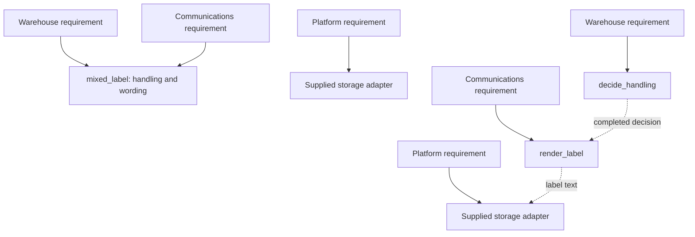

# Visuals — SDP-SOL-010 Single Responsibility Principle

[Unit note](../README.md) · [Interactive change map](change-map.html)

## Explore a change

Open `change-map.html` locally in a browser. It is a self-contained learning artifact with no
network requests, external libraries, telemetry, or build step. GitHub's file view shows its source;
download or open the checked-out file to use its controls.

Select a requirement and compare **Mixed operation**, **Cohesive boundaries**, and **Objects for
every step**. The first two refer to the parcel teaching example. The third is a deliberately
speculative alternative, not another runnable implementation.

### How to read this visual

Each box is an implementation or shared value. “Edit” means that its source needs a direct change
under the selected assumptions. “Receives changed result” means its input/output may differ even
though its implementation need not change. The requirement label identifies the policy authority.

### Key insight

Keeping a consumer's code stable does not mean keeping its output identical. Also, a single policy
can need several operations without needing a separate object for each operation.

### Simplification or limitation

The map encodes original, synthetic scenarios by hand; it is not an automated code analyzer or
measured change-cost benchmark. Highlighted edits are predictions under the stated contract.
The code keeps its functions in one file for teaching. The map depicts conceptual boundaries,
not deployed services, exact file isolation, or a runtime stack.

The mixed baseline already accepts a storage callback. Platform changes can therefore be isolated
even before separating handling policy from label wording. SRP improvements are often incremental.

## Before and after: knowledge ownership

### How to read this visual

The first three requirement boxes describe the baseline; the next three describe the separated
version. Solid arrows mean “can require an implementation change.” Dashed arrows represent data
handoffs, not imports or organizational authority. A coordinator performs the actual calls.

### Key insight

Handling and wording no longer share one implementation boundary. Storage was already supplied
externally, so the refactoring does not claim to create that existing seam.

### Simplification or limitation

This is a conceptual ownership diagram. It omits validation, the coordinator, and failures to keep
attention on the changed boundary. Adding a required field to the shared result can legitimately
require changes on both sides of its handoff.

## Notebook reconstruction

Close the diagram and redraw the three requirement authorities, the completed value, and the
publication call order. Mark one direct source edit and one consumer whose output changes without
an implementation edit. Explain one extraction you would reject. This is a study prompt; no learner
reconstruction has yet been recorded.
