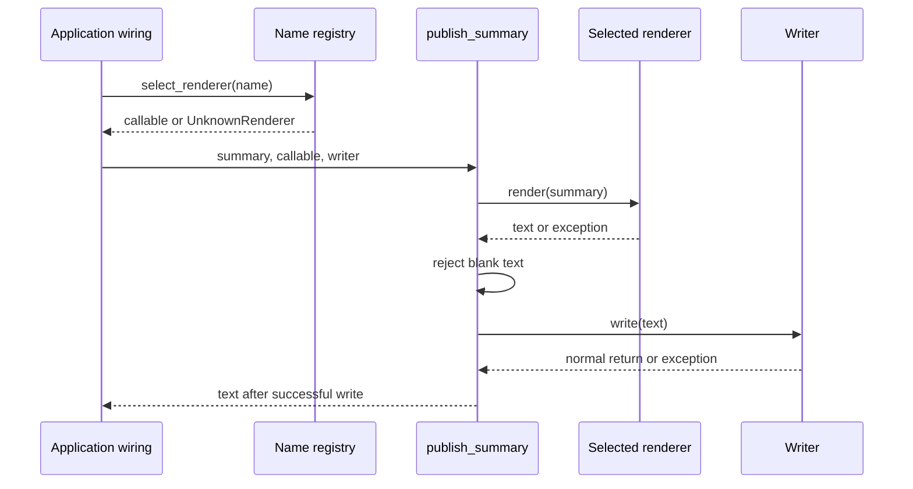

# SDP-SOL-020 — Open/Closed Principle

## Physical Notebook Core

### Problem or change pressure

Each new report format makes us edit a publication workflow that already works. Formatting
changes repeatedly put unrelated publication behavior at risk.

### One-sentence mental model

> Protect a stable operation from a real kind of change by giving that change a small, explicit home.

### One essential visual

```text
wiring chooses renderer ── supplies it ──► publish_summary
                                              │
                                      calls the renderer
                                              │
                                         gets text
                                              │
                                         calls writer
```

### How to read this visual

Read top to bottom. Wiring supplies a callable; the workflow calls it before writing its result.
These are conceptual collaboration arrows, not import arrows.

### Key insight

A new renderer and a wiring edit can leave `publish_summary` unchanged.

### Simplification or limitation

The diagram omits errors and the input contract. A different shared contract can require a core edit.

### Governing rules or invariants

1. Name the variation being supported; no design is closed against every possible change.
2. Extensions must preserve the caller's input, output, error, and side-effect expectations.
3. Wiring may change. Fix defects and revise obsolete contracts instead of preserving them blindly.

### Minimal Python example

```python
def publish(summary, render, write):
    body = render(summary)
    write(body)
    return body


outbox = []
publish((4, 1), lambda counts: f"done={counts[0]}; failed={counts[1]}", outbox.append)
assert outbox == ["done=4; failed=1"]
```

### One common misconception

**Mistake:** OCP means never editing existing code, or replacing every `if` with a subclass.

**Correction:** Choose a useful boundary for observed variation. Small fixed conditionals are often fine.

### Important trade-offs

- A seam limits repeated edits but adds a contract, configuration, and navigation cost.
- Data is often enough for new values; genuinely different algorithms may need callables or objects.

### Interview-revision cues

- Name what changes, what stays stable, and where selection happens.
- Compare a conditional, data table, callable, and justified object.
- Explain which new requirement would force the boundary to change.

## Unit metadata

| Field | Value |
|---|---|
| Domain | SOLID principles |
| Curriculum | [SDP-SOL-020](../../../CURRICULUM.md#sdp-sol-020) |
| Progress | [PROGRESS.md](../../../PROGRESS.md) |
| Python references | [PYTHON_REFERENCES.md](../../../PYTHON_REFERENCES.md) |
| Learning outcome | Create stable extension points only where variation is real, and compare polymorphism, callables, registration, and data-driven alternatives. |
| Hard prerequisites | [SDP-FND-030](../../../CURRICULUM.md#sdp-fnd-030), [SDP-FND-040](../../../CURRICULUM.md#sdp-fnd-040), [SDP-FND-050](../../../CURRICULUM.md#sdp-fnd-050) |
| Soft prerequisites | None declared in the curriculum |
| Priority | Core |
| Interview frequency | High |
| Production frequency | High |
| Python/backend relevance | High |
| Depth | D2 |
| Scope | SOLID, Python |
| Size | L |
| First understanding | 4–6 h |
| Hands-on practice | 5–9 h |
| Evidence profile | E+I+D+T |
| Canonical Python | Python 3.14 |
| Interview compatibility | Python 3.11 |
| Artifact state | Draft |

Frequency labels are curriculum judgments, not measured percentages. Generated material and a
successful publication do not establish learning evidence.

Study the explanation, run the [worked example](examples/run_summary_demo.py), explore the
[visuals](visuals/README.md), then attempt the [separate lab](practice/README.md). The
[registry experiment](experiments/EXP-01-registry-views/README.md) is supplementary; it does not
change the canonical evidence profile.

## 1. Simple explanation

Imagine a batch system that reports how many jobs completed and failed. Publishing always means
“make the report, then give it to the writer.” Teams repeatedly request different representations.
The workflow should not need to learn every representation's details.

Pass it something that knows how to render. A normal function can do that job. The caller may
choose a function directly, or a small setup function may select one by name.

**Prerequisite bridge:** cohesion groups decisions that belong together; coupling describes what
one part must know about another; a contract describes what a caller can rely on; composition
supplies a collaborator, and delegation calls it. Here the workflow knows the renderer's contract
without knowing its formatting rules. Prerequisite notes exist, but the tracker records no learner
evidence yet. This bridge permits study without claiming those prerequisites were mastered.

## 2. Real problem and forces

The initial requirement is two stable formats used by one application. A short conditional is
easy to read, test, and change. There is no automatic need for an extension framework.

The pressure changes when different teams add formats independently. Each addition reopens the
same function that also publishes the result. That creates repeated review and regression work
around a stable operation. This is an original design judgment about the example, not a benchmark.

| Concern | Intended stability | Owner in the example |
|---|---|---|
| Counts mean completed and failed jobs | Shared input contract | `RunSummary` |
| Render once, then write once | Stable publication behavior | `publish_summary` |
| Text, JSON, or another representation | Real variation | A renderer |
| Which implementations are enabled | Deployment/application choice | Wiring |
| How a body is stored or delivered | Existing supplied dependency | Writer |

## 3. History and original context

Robert C. Martin's 2014 account attributes OCP to Bertrand Meyer's 1988 *Object-Oriented Software
Construction*. It describes Meyer's early emphasis on extension alongside a stable module
description, then discusses plugin architectures. We read Martin's account, not the original
book, so the attribution here is explicitly mediated by that source.
[Martin, “The Open Closed Principle”](https://blog.cleancoder.com/uncle-bob/2014/05/12/TheOpenClosedPrinciple.html).

This unit applies the idea at a small Python source boundary. It makes no claim that supplying a
callable gives independent deployment, hot loading, or a full plugin architecture.

## 4. Formal definition

OCP asks us to arrange a software boundary so that supported new behavior can be added through
extensions while its stable implementation need not be rewritten. Martin's formulation motivates
this separation. [Source](https://blog.cleancoder.com/uncle-bob/2014/05/12/TheOpenClosedPrinciple.html).

Our operational interpretation is deliberately specific: **`publish_summary` is closed against
adding compatible report renderers.** The whole repository is not closed against all edits.
Adding a name at the composition point is still an edit, and is expected. Fixing validation,
correcting an existing renderer, or changing the shared result contract can also require edits.

OCP is a design principle. Strategy is one possible arrangement of replaceable behavior; a
callable, dictionary, or `Protocol` is a Python mechanism used to implement such an arrangement.

## 5. Participants and responsibilities

| Participant | Responsibility | What it must not own |
|---|---|---|
| `RunSummary` | Two nonnegative counts | Renderer selection or publication |
| `Renderer` | Describe a synchronous callable producing nonblank text containing both counts | Loading implementations or runtime policing of all behavior |
| Concrete renderer | Represent those counts without publishing or mutating the input | The writer's lifecycle |
| `publish_summary` | Render, reject blank text, write, return | Concrete format branches |
| `build_renderers` / `select_renderer` | Validate names and resolve a configured implementation | Running it inside the lookup error handler |
| Application wiring | Construct collaborators and supply the chosen one | Becoming a second formatting engine |

## 6. Collaboration and execution flow



### How to read this visual

Time moves down. Solid arrows are calls; dashed arrows are returns. The lower calls happen only
when earlier steps succeed. For example, a renderer exception prevents the writer call.

### Key insight

Selection and execution are separate. The workflow can run a renderer that was supplied directly,
without a registry at all.

### Simplification or limitation

This is the example's synchronous call flow, not a transaction diagram. A writer may perform an
effect before raising; the core neither retries nor rolls back that effect.

The [source-dependency diagram](visuals/README.md#source-dependencies) uses a different arrow
meaning. A runtime call to a supplied renderer does not require importing its concrete module.

## 7. Before-pattern code and concrete pain

[The baseline](examples/run_summary_demo.py) keeps format branches and publication together:

```python
from run_summary_demo import publish_by_name
from summary_core import RunSummary

writes = []
publish_by_name(RunSummary(4, 1), "text", writes.append)
assert writes == ["completed=4; failed=1"]
```

Inside that function, `text` builds one string, `json` builds another, and an unknown name raises
before writing. A new compact representation requires another branch in the same function.
The problem is the repeated format change in that particular boundary, not the mere existence
of `if`, or the fact that there are two cases.

## 8. Minimal Pythonic implementation

The notebook function shows the complete mechanism: accept behavior, call it, use the result.
For a single known representation, even that seam may be unnecessary: call `text_summary`
directly and then write its result.

For independently varying representations, use the typed version:

```python
from summary_core import RunSummary, publish_summary
from summary_formats import text_summary

writes = []
result = publish_summary(RunSummary(4, 1), text_summary, writes.append)
assert result == writes[0]
```

The function is passed without parentheses; `text_summary(...)` would execute it immediately.
There is no base-class requirement. Python also allows a callable object through `__call__`,
and a bound method can be passed as behavior.
[Python data model: callable objects](https://docs.python.org/3.14/reference/datamodel.html#object.__call__).

## 9. Typed production-oriented implementation

Read [summary_core.py](examples/summary_core.py), [summary_formats.py](examples/summary_formats.py),
and [summary_registry.py](examples/summary_registry.py). The core depends on a tiny named contract:

```python
from typing import Protocol

from summary_core import RunSummary


class Renderer(Protocol):
    def __call__(self, summary: RunSummary, /) -> str: ...
```

The positional-only parameter permits collaborators with different parameter names. Here a
`Callable[[RunSummary], str]` annotation is also sufficient. We use a named protocol to give the
semantic promise a clear documentation home, not because the runtime needs an interface object.
Protocols describe structural compatibility to type checkers; type annotations do not enforce
runtime behavior. [Python typing documentation](https://docs.python.org/3.14/library/typing.html#typing.Protocol).

The actual promise includes both counts, no input mutation, no publication from the renderer,
nonblank output, and synchronous completion. Static checking does not prove those properties.
The core enforces only the nonblank check; contract tests and review must cover the rest.

The demo compares two APIs rather than silently replacing the old one. `publish_by_name` accepts
a name and raises `ValueError` for an unsupported format; registry selection exposes
`UnknownRenderer`. A production migration must preserve the old facade and translate errors there
if existing callers depend on that contract. Matching successful output alone is not full API compatibility.

The example assumes typed callers. Nonnegative validation is not a general parser for untrusted
JSON values. Likewise, a callback in this process is trusted code, not a security sandbox.

`RunSummary` is a frozen dataclass containing integer fields. The language supplies ordinary
objects; `frozen=True` blocks normal field assignment rather than making arbitrary object graphs
deeply immutable. [Dataclasses: frozen instances](https://docs.python.org/3.14/library/dataclasses.html#frozen-instances).

## 10. Simpler Python alternative

| Option | Good fit | Main cost or limit |
|---|---|---|
| Direct function or small conditional | Few stable cases, one owner | New cases can reopen that function |
| Data record or table | Same calculation or layout, different values | A new algorithm may not fit the data schema |
| Supplied callable | One variable operation | Caller must supply compatible behavior |
| Configured callable object | One operation with explicit per-instance configuration | Extra object and lifecycle to understand |
| Object with several methods / ABC | A cohesive multi-operation contract or justified shared implementation | Inheritance and broader contracts can couple extensions |
| Explicit name registry | Runtime configuration names an enabled behavior | Duplicate, missing-name, ownership, and loading policies |

`LabeledText("finished", "errors")` changes two display labels while retaining one layout.
Creating one subclass per label pair would add structure without a new algorithm. JSON is a
different representation; forcing it into ever more label flags would make the data schema a
hidden programming language.

Registration is optional selection, not the OCP itself. `build_renderers` consumes pairs so it can
reject duplicate names before a dictionary overwrites them. Dictionary assignment replaces an
existing key's value; insertion order does not resolve business priority.
[Dictionary operations](https://docs.python.org/3.14/library/stdtypes.html#mapping-types-dict).

## 11. Refactoring path

1. Characterize existing outputs, invalid inputs, and effect ordering.
2. Name the repeatedly changing decision: representation of the same summary.
3. Write its smallest useful contract, including errors and side effects.
4. Move one representation behind a callable and preserve the existing behavior.
5. Route another representation through the same seam; rerun characterization tests.
6. Add a new renderer without changing `summary_core.py`.
7. Introduce name selection only if the application actually needs names.
8. Inspect the diff and remove speculative hooks, inheritance, or configuration.

OCP does not demand doing all these steps in advance. If the second real requirement changes
your understanding of the boundary, revising it is sensible design work.

## 12. Realistic backend use case

A background job produces one `RunSummary`. An operator wants text; an integration wants JSON.
At startup, the application builds an explicit registry of trusted renderers. Request or job
configuration selects a name; the workflow receives the selected callable and its writer.

Adding a compact format changes the extension and its wiring. It does not require the core to
branch on its name. Adding an elapsed-time field, however, changes the shared information being
represented and may affect producers and renderers. That is a legitimate contract evolution.

The example stores output in lists. It does not include a web framework, real queue, plugin loader,
database, retry mechanism, or independently deployed services.

## 13. Failure scenario

A selected renderer looks up a missing internal option and raises `KeyError`. If a large `try`
block wraps both selection and execution, the application may report “unknown renderer” even
though the name was valid. The real defect becomes difficult to diagnose.

`select_renderer` catches only the name lookup. Rendering happens later. Tests verify that a
renderer failure propagates unchanged and prevents writing. Unknown names fail explicitly;
there is no silent default representation.

If writing fails after accepting the body, the core propagates that error without retrying. An
adapter's delivery, idempotency, or transactional guarantees must be specified separately.

## 14. Testing strategy

| Test type | What it proves | What not to overspecify |
|---|---|---|
| Characterization | Existing text/JSON outputs survive refactoring | Private helper names or number of classes |
| Extension contract | Each renderer preserves counts, input, and publication ownership | Shared superclass membership |
| Workflow | Exactly one renderer call before one writer call; no write after rendering failure | Harmless implementation rearrangements |
| Registry | Duplicates rejected, missing names explicit, caller rebinding isolated | Dictionary storage as the only valid design |
| Transfer review | New behavior fits without reopening the chosen stable boundary | “Green tests” as proof of good boundaries |

Zero counts and large counts are valid. A callable returning whitespace satisfies the return type
but violates the semantic contract. A nonblank lie about the counts would pass the core's guard;
per-renderer tests must catch that. This distinction is central to the next SOLID unit.

## 15. Observability and debugging

At a real application boundary, record the selected renderer's identifier/version, operation stage,
and exception context. Distinguish lookup failure, rendering failure, and writing failure. Avoid
logging arbitrary report contents by default. These are design recommendations; the sample does
not claim to implement a logging or telemetry system.

When debugging, first establish which callable was actually selected. Then verify its input
contract and whether the writer ran. A stable core can still produce different output when its
collaborator or configuration changes.

## 16. Concurrency and state safety

A read-only view does not freeze the mapping behind it. `MappingProxyType(source)` reflects
subsequent source changes. Copying entries first separates the bindings, but shares the callable
objects. [MappingProxyType contract](https://docs.python.org/3.14/library/types.html#types.MappingProxyType).

The [experiment](experiments/EXP-01-registry-views/README.md) demonstrates both cases. The registry
builder owns a fresh dictionary and does not expose a mutable alias to it. This helps keep
configuration predictable; it does not make mutable collaborators thread-safe. For this small
design, build once and supply stateless or explicitly owned collaborators. Hot replacement and
concurrent mutation require a separate lifecycle design, not an assumption about OCP or the GIL.

## 17. Performance and memory

The registry builder traverses its entries and stores one binding per accepted name. Passing a
callable adds indirection; it is not an optimization claim. No timings or memory benchmarks are
part of this unit. Choose the seam for change isolation, and measure a real workload before making
performance-driven changes.

## 18. Variants

- Direct injection: the caller already knows the function; omit name lookup.
- Data-driven variation: provide labels or constant thresholds to an unchanged algorithm.
- Explicit registration: build known names at setup, reject duplicates, then select.
- Richer objects: use them when configuration, resources, or related operations justify ownership.
- Type-based dispatch: a separate topic when the variation follows an argument's type, rather
  than a deployment name. See [SDP-PYT-080](../../../CURRICULUM.md#sdp-pyt-080).

## 19. Related patterns and combinations

| Related unit | Relationship | Key difference |
|---|---|---|
| [SDP-SOL-010](../../../CURRICULUM.md#sdp-sol-010) | Finds independent reasons for change | OCP asks how a chosen variation extends a stable boundary |
| [SDP-SOL-030](../../../CURRICULUM.md#sdp-sol-030) | Tests whether extensions preserve behavioral promises | A matching callable shape is insufficient |
| [SDP-SOL-050](../../../CURRICULUM.md#sdp-sol-050) | Helps arrange dependencies around stable contracts | Supplying an argument alone does not prove dependency inversion |
| [SDP-BEH-010](../../../CURRICULUM.md#sdp-beh-010) | Strategy supplies replaceable algorithms | OCP is the goal/principle; Strategy is one arrangement |
| [SDP-PYT-020](../../../CURRICULUM.md#sdp-pyt-020) | Explores dispatch tables and registries | Registration introduces selection and lifecycle policy |
| [SDP-BEH-060](../../../CURRICULUM.md#sdp-beh-060) | Template Method varies steps in an algorithm skeleton | Inheritance trades different coupling for reuse |

## 20. When to use it

- Repeated additions of the same kind disturb an otherwise stable, well-tested operation.
- Different owners need implementations behind a contract that is stable enough to describe.
- Explicit variation would simplify both testing and later changes more than its cost.

## 21. When not to use it

- One behavior or a small stable set is already clear as a direct call or conditional.
- Only values vary and a data record captures the difference cleanly.
- You cannot yet say what extensions must preserve.
- The requested change repairs a bug or changes the shared contract itself.

## 22. Common misuse and overengineering

| Misuse | Why it hurts | Better move |
|---|---|---|
| A subclass for every label pair | Repeats one algorithm across names | One renderer configured by data |
| Universal plugin framework for two formats | Adds discovery and lifecycle rules without evidence | Direct calls or a supplied callable |
| Type/name checks inside the supposedly generic core | Every addition still edits the protected code | Put selection at an explicit boundary |
| Global registration triggered by imports | Enabled behavior becomes harder to trace | Explicit startup construction where sufficient |
| Silently replacing a duplicate name | Load order chooses behavior accidentally | Reject duplicates or document deliberate replacement |
| Refusing to fix old code because it is “closed” | Preserves defects and obsolete assumptions | Change it deliberately and test the revised contract |
| Treating matching methods as correctness | Shape says little about effects or meaning | Check behavioral promises and counterexamples |

## 23. Interview preparation

### Common formulation

Start with this single prompt and wait for the learner's answer:

> A job-report service has two stable formats. A team proposes an auto-discovered plugin framework
> for a possible third format. What would you change now, and what evidence would change your decision?

### Weak-answer traps

- Reciting “open for extension” without identifying the protected operation.
- Rejecting every conditional or requiring inheritance.
- Pretending that registry edits, contract changes, or deployments disappear.
- Adding abstractions without a concrete change pressure.

### Likely follow-ups

After the first answer, explore one topic at a time: independent format ownership, a missing name,
a renderer error, a shared-schema change, or a new constant-only variation. Do not reveal a model
answer before the learner attempts the current question.

### Reasoning checkpoints

Identify the force, stable contract, extension, selection point, error boundary, simpler option,
and one requirement the design intentionally does not accommodate without modification.

## 24. Closed-book revision cues

Reconstruct the small call flow, mark where selection occurs, and state the invariants. Then
compare data with behavior variation and give one valid core edit. Use the separate practice for
implementation and transfer rather than memorizing the report example.

**Next-unit bridge:** a renderer can have the right signature and still return incorrect counts,
perform unexpected writes, or reject valid input. OCP gives an extension point; the behavioral
reasoning in [SDP-SOL-030](../../../CURRICULUM.md#sdp-sol-030) examines safe substitution.
That unit is linked through the curriculum and is not initialized here.

## 25. Vocabulary and professional English

### Variation

| Item | Content |
|---|---|
| Pronunciation | vair-ee-AY-shun |
| Simple English meaning | A difference between versions or cases |
| Hindi cue | बदलाव / अलग रूप |
| Design meaning | The particular kind of change a boundary is meant to support |

Natural examples: “There is some variation in the results.” “This version has a small variation.”
“We allow regional variation.” **Interview:** “The observed variation is the report format.”
**Engineering discussion:** “This seam supports format variation, but not a new input schema.”

### Invariant

| Item | Content |
|---|---|
| Pronunciation | in-VAIR-ee-unt |
| Simple English meaning | Something that must stay true |
| Hindi cue | जो शर्त हमेशा सही रहे |
| Design meaning | A promise that every supported collaborator must preserve |

Natural examples: “The rule remains invariant.” “We checked the invariant after each step.”
“A changed result can still preserve the invariant.” **Interview:** “One invariant is that a
renderer does not publish.” **Engineering discussion:** “The new implementation violates that
invariant even though its type signature matches.”

## 26. Python Mastery references

`PYTHON_REFERENCES.md` has no direct `SDP-SOL-020` row. These exact links are inherited support
through its prerequisites or mapped follow-up units; they are not new canonical prerequisites.

| Supporting path | Exact reference | Minimum bridge |
|---|---|---|
| Via SDP-FND-050 | [PY-OBJ-010 — Classes, instances, methods, and construction](https://github.com/rahulyadev/python-mastery/blob/main/CURRICULUM.md#py-obj-010) | A bound method carries its receiver when passed as a callable |
| Via SDP-FND-050 | [PY-OBJ-020 — Properties, encapsulation, and composition](https://github.com/rahulyadev/python-mastery/blob/main/CURRICULUM.md#py-obj-020) | Supply a collaborator instead of inheriting only for reuse |
| Via SDP-FND-050 | [PY-OBJ-030 — Inheritance, MRO, and super](https://github.com/rahulyadev/python-mastery/blob/main/CURRICULUM.md#py-obj-030) | Inheritance is available but not required by this example |
| Optional support via SDP-PYT-010 | [PY-FIT-030 — Higher-order functions, callable objects, and side effects](https://github.com/rahulyadev/python-mastery/blob/main/CURRICULUM.md#py-fit-030) | Pass a function without calling it; invoke it inside the consumer |
| Optional support via SDP-FND-070 | [PY-TYP-050 — Protocols, ABCs, and structural versus nominal typing](https://github.com/rahulyadev/python-mastery/blob/main/CURRICULUM.md#py-typ-050) | Structural typing checks shape, not complete behavior |
| Optional support via SDP-PYT-020 | [PY-BLT-050 — Dictionaries and mapping behaviour](https://github.com/rahulyadev/python-mastery/blob/main/CURRICULUM.md#py-blt-050) | Separate missing-key policy from errors raised by a selected callable |

These are navigation links taken from the local reference map, not claims that the remote lessons
or any learner work in them were reviewed.

## 27. Authoritative sources

Opened and read for this unit on 2026-08-30; explanations, diagrams, and synthetic examples are original.

1. [Robert C. Martin — The Open Closed Principle](https://blog.cleancoder.com/uncle-bob/2014/05/12/TheOpenClosedPrinciple.html): attribution, stable modules, and extension boundaries.
2. [Python 3.14 — typing, Protocol](https://docs.python.org/3.14/library/typing.html#typing.Protocol): structural typing and runtime limitations.
3. [Python 3.14 — callable objects](https://docs.python.org/3.14/reference/datamodel.html#object.__call__): callable-object mechanism.
4. [Python 3.14 — MappingProxyType](https://docs.python.org/3.14/library/types.html#types.MappingProxyType): dynamic read-only mapping view.
5. [Python 3.14 — dictionary operations](https://docs.python.org/3.14/library/stdtypes.html#mapping-types-dict): key replacement and insertion order.
6. [Python 3.14 — frozen dataclasses](https://docs.python.org/3.14/library/dataclasses.html#frozen-instances): assignment restrictions and immutability limits.

All runnable unit code uses Python 3.11-compatible syntax and APIs. Actual runtime, test, and
artifact checks are recorded separately in [VALIDATION.md](VALIDATION.md); no CPython internals
or performance claims are needed to explain this design.
