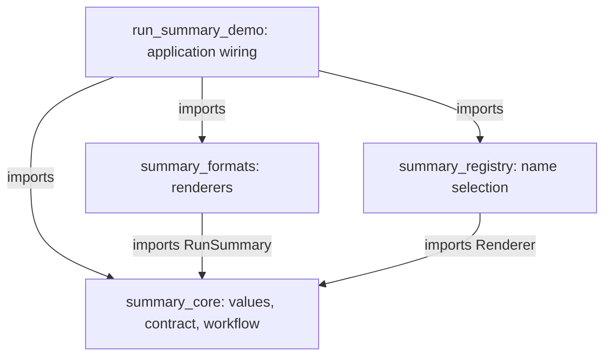

# Visuals — SDP-SOL-020 Open/Closed Principle

[Unit note](../README.md) · [Interactive extension map](extension-map.html)

## Explore a requirement

Open `extension-map.html` locally in a browser. It is self-contained and makes no network requests.
GitHub's file view displays source; open the checked-out or downloaded file to use its control.

Choose a new layout, renamed labels, a bytes contract, or an audit step. The map compares a
conditional workflow, a supplied renderer, and one fixed layout configured with labels. The last
two contract/workflow changes are hypothetical; they are not implemented in the example.

### How to read this visual

Read each design row left to right. The three boxes describe workflow, representation, and
wiring/data roles. “Same core edit” means the baseline representation code is embedded in the
workflow; it is not a second counted file change. Text labels carry the meaning as well as color.

### Key insight

An extension point protects a particular kind of variation. Wiring may still change; data-only
variation may be cheaper; a different shared contract can require coordinated edits.

### Simplification or limitation

This is a hand-authored conceptual comparison, not static analysis, a performance benchmark, or
a prediction of exact engineering effort. Roles may share files. “Stable” describes implementation,
not identical output or automatic behavioral safety. The labels-only limit applies to the stated
two-label schema, not to every possible data language.

## Source dependencies

### How to read this visual

An arrow means the module at its tail imports from the module at its head. The diagram maps
imports among the four example modules; standard-library imports are omitted. The compact
extension lives in the demo module and is supplied during wiring.

### Key insight

`summary_core.py` imports no concrete renderer or registry. Runtime delegation can call a
collaborator without adding that concrete source dependency to the workflow.

### Simplification or limitation

This diagram shows source dependencies, not runtime call order, memory ownership, or deployment
boundaries. The value, protocol, and workflow share one small core module for teaching; they are
not three services. Compare the [call sequence](../README.md#6-collaboration-and-execution-flow)
to keep the two arrow meanings separate.

## Notebook reconstruction

Close the visuals and redraw the source dependencies and runtime flow separately. Mark the
smallest change for a new compatible renderer, a new label pair, and a new shared output type.
Explain one abstraction you would reject. No learner reconstruction has been recorded yet.
