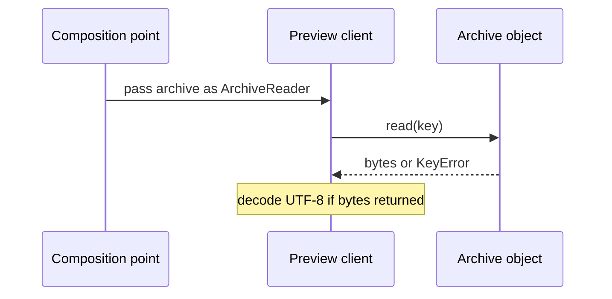

# SDP-SOL-040 — Interface Segregation Principle

## Physical Notebook Core

### Problem or change pressure

A preview needs to read a document. Its parameter demands an entire archive manager, so a
perfectly useful reader is rejected for lacking write and remove operations.

### One-sentence mental model

> Give each client a coherent contract for its own job, without unrelated obligations.

### One essential visual

```text
preview ──needs──> read ─────┐
                           ├── one archive object may serve both roles
uploader ─needs──> write ───┘
```

### How to read this visual

Read left to right. Each arrow means “requires this capability,” not “creates a new object.”

### Key insight

Separate what clients depend on; splitting the implementation is a separate decision.

### Simplification or limitation

Conceptual dependency sketch. It omits errors, signatures, storage, and authorization.

### Governing rules or invariants

1. Start with actual clients and their reasons to change, not a method-count target.
2. Keep operations together when a real client needs their shared contract.
3. A narrower type does not make an object immutable, isolated, or authorized.

### Minimal Python example

```python
from collections.abc import Callable


def preview(read: Callable[[str], bytes], key: str) -> str:
    return read(key).decode("utf-8")


documents = {"welcome": b"hello"}
assert preview(documents.__getitem__, "welcome") == "hello"
```

### One common misconception

**Mistake:** “ISP means one method per interface and one class per interface.”

**Correction:** The boundary follows a client's coherent needs; a provider may support many roles.

### Important trade-offs

- Small boundaries admit simpler providers and test doubles, but each named boundary costs maintenance.
- A local function or already-loaded value may remove the need for an interface entirely.

### Interview-revision cues

- Name the client, its used operations, and the unrelated dependency creating pain.
- Explain why two operations should stay together in one workflow.
- Distinguish interface segregation from implementation decomposition and access control.

## Unit metadata

| Field | Value |
|---|---|
| Domain | SOLID principles |
| Curriculum | [SDP-SOL-040](../../../CURRICULUM.md#sdp-sol-040) |
| Progress | [PROGRESS.md](../../../PROGRESS.md) |
| Python references | [PYTHON_REFERENCES.md](../../../PYTHON_REFERENCES.md) |
| Learning outcome | Design small client-shaped capabilities in Python without multiplying nominal interfaces that add no value. |
| Hard prerequisites | [SDP-FND-030](../../../CURRICULUM.md#sdp-fnd-030), [SDP-FND-070](../../../CURRICULUM.md#sdp-fnd-070) |
| Soft prerequisites | None added to the canonical curriculum |
| Priority | Core |
| Interview frequency | High |
| Production frequency | High |
| Python/backend relevance | High |
| Depth | D2 |
| Scope | SOLID, Python |
| Size | L |
| First understanding | 4–6 h |
| Hands-on practice | 5–9 h |
| Evidence profile | E+I+D+T |
| Canonical Python | Python 3.14 |
| Interview compatibility | Python 3.11; the supplied code uses the same syntax |
| Artifact state | Approved |

Frequency labels are curriculum judgments, not measured usage statistics. Generated material
is not learner evidence. Start with the [practice prediction](practice/README.md#prediction-before-running)
before running the lab. The [visual guide](visuals/README.md) and
[dependency experiment](experiments/EXP-01-client-dependency/README.md) support the explanation.

## 1. Simple explanation and prerequisite bridge

A person collecting a parcel needs the collection counter, not the warehouse's entire control
panel. The warehouse can still be one building. In code, the “person” is a calling function or
module, and the “counter” is the contract that caller needs.

Both prerequisite notes exist; their existence does not establish understanding:

- **Cohesion:** operations belong together because they serve a related job.
- **Coupling:** asking for a broad collaborator ties your client to more promises than it uses.
- **Duck typing:** an ordinary Python call tries the operation on the supplied object.
- **Structural typing:** a checker compares the required members and their types.
- **Nominal typing:** a declared inheritance relationship establishes the type relationship.

The minimum Python bridge is the distinction between a call working at runtime, a `Protocol`
matching statically, and an ABC defining an explicit inheritance contract. Revisit the exact
[PY-TYP-050 reference](#26-python-mastery-reference) if these are unfamiliar.

## 2. Real problem and forces

One in-memory archive initially serves every caller. The preview reads; an uploader writes;
a cleanup job removes. Passing the concrete archive everywhere works while it is the only
provider and all clients live together.

Now a publishing partner supplies an immutable snapshot with reading only. A broad type
annotation rejects it. A mock author adds meaningless write/remove stubs to satisfy that type.
Meanwhile, an administrative requirement expands the shared contract again.

The stable concern is each workflow's real behaviour. The variation is which capabilities a
provider can honestly offer. We want the preview's contract to stay independent of cleanup
changes, without inventing a separate service, wrapper, or class for every method.

## 3. History and original context

Robert C. Martin's 1996 article discusses interfaces whose unrelated client groups become
coupled through a shared class. It also separates an object's implementation from the views
its clients use. The original discussion includes C++ compilation dependencies; the Python
examples here are an original adaptation, not a claim that Python has the same rebuild costs.
[Original article, introduction and “Class Interfaces vs Object Interfaces”](https://d3s.mff.cuni.cz/f/teaching/nprg043/extras/martin96-interface_segregation_principle.pdf).

## 4. Formal definition and design test

ISP asks us to avoid making a client depend on interface obligations outside its needs.
When one client forces a change to a shared interface, unrelated clients should not have to
absorb that change merely because their contracts were bundled together.
[Martin, “The Interface Segregation Principle”](https://d3s.mff.cuni.cz/f/teaching/nprg043/extras/martin96-interface_segregation_principle.pdf).

Apply this practical test: **which concrete caller needs which operations, and what independent
change would this dependency make it absorb?** That is a design judgment, not a numerical rule.
A ten-operation interface can be cohesive; a two-operation interface can join unrelated roles.

## 5. Participants and responsibilities

| Participant | Required capability | What it should not require |
|---|---|---|
| Preview client | Read document bytes | Writing or removal |
| Report uploader | Write document bytes | Reading or removal |
| Cleanup job | Remove keys | Reading or writing |
| Duplicate job | Read and write the same archive | Removal |
| Provider | Honour the roles it actually supports | Fake methods for unsupported roles |
| Composition point | Supply a compatible provider | Hide capabilities behind runtime guessing |

The two-method duplicate boundary is deliberate. Both operations refer to the same archive.
That relationship is a behavioural promise; method signatures alone cannot establish it.

## 6. Collaboration and execution flow



### How to read this visual

Read top to bottom. Setup supplies an object; the preview calls that object's method.
The annotation describes the accepted collaborator. There is no protocol object between them.

### Key insight

The dependency becomes narrower without adding a runtime delegation layer.

### Simplification or limitation

Conceptual call flow for the supplied synchronous example, not a memory diagram. Network
transport, authorization, and retries are absent. A decoding error can still occur after reading.

## 7. Before-pattern code and concrete pain

For a local dictionary, start with the obvious solution:

```python
documents = {"welcome": b"hello"}
assert documents["welcome"].decode("utf-8") == "hello"
```

If several providers must be accepted, a broad protocol can accidentally carry the entire
manager API into a read-only client:

```python
from typing import Protocol


class Everything(Protocol):
    def read(self, key: str, /) -> bytes: ...
    def write(self, key: str, payload: bytes, /) -> None: ...
    def remove(self, key: str, /) -> bool: ...


def preview(archive: Everything, key: str) -> str:
    return archive.read(key).decode("utf-8")
```

The body uses one method, but the parameter contract requires three. A reader-only provider
cannot satisfy that declared contract. Removing the annotation hides the static symptom;
it does not document the intended role. Adding unused stubs makes a false capability claim.

Run the [controlled experiment](experiments/EXP-01-client-dependency/README.md) to compare
the checker result with the actual runtime call, rather than guessing that Python will reject both.

## 8. Minimal Pythonic implementation

The notebook's callable example is enough for a single reading operation. A named protocol
is useful when several clients share a meaningful role and static checking improves clarity:

```python
from typing import Protocol


class Reader(Protocol):
    def read(self, key: str, /) -> bytes: ...


class Bundle:
    def read(self, key: str, /) -> bytes:
        return {"welcome": b"hello"}[key]


def preview(source: Reader, key: str) -> str:
    return source.read(key).decode("utf-8")


assert preview(Bundle(), "welcome") == "hello"
```

`Bundle` need not inherit or import `Reader`. Structural assignability requires compatible
members and types; extra members are allowed. These are typing rules, not a new object layout.
[Typing specification: assignability](https://typing.python.org/en/latest/spec/protocol.html#assignability-relationships-with-other-types).

## 9. Typed production-oriented implementation

The runnable example separates [client contracts and workflows](examples/archive_roles.py)
from [providers](examples/archive_storage.py) and [composition](examples/run_archive_demo.py).

- `ArchiveReader`, `ArchiveWriter`, and `ArchiveRemover` name actual roles.
- `ReadWriteArchive` combines reading and writing for the duplicate client.
- `MemoryArchive` serves all roles without inheriting any protocol.
- `PublishedBundle` offers reading only; `UploadInbox` offers writing and receipt inspection.
- `ArchiveManager` is the broad comparison contract, not a requirement imposed on every client.

Protocol multiple inheritance expresses “both capabilities.” Including `Protocol` explicitly
keeps the combined class a protocol. A union such as `ArchiveReader | ArchiveWriter` means
“either”; it cannot justify unconditionally calling both operations.
[Typing specification: merging](https://typing.python.org/en/latest/spec/protocol.html#merging-and-extending-protocols),
[unions and intersections](https://typing.python.org/en/latest/spec/protocol.html#unions-and-intersections-of-protocols).

The example uses opaque string keys and immutable bytes. Missing reads raise `KeyError`;
empty bytes are a valid document. Writes replace values. Removing an absent key returns
`False`. Copying reads before writing, retains the source, and overwrites the destination.
These are this example's chosen contracts, not universal archive rules.

It is production-oriented in its explicit boundaries and failure semantics, but is not a
production storage service. Persistence, access control, transaction support, and resource
limits would require additional requirements and integration tests.

## 10. Simpler Python alternatives

| Situation | Smallest useful choice | Cost of adding a protocol |
|---|---|---|
| Caller already has the bytes | Pass bytes to a formatting function | Adds a dependency that could be removed |
| Local dictionary is the only provider | Direct lookup | More names without demonstrated variation |
| One varying operation | Pass a callable | A named object role may be unnecessary |
| Existing mapping semantics fit | Accept a suitable standard collection interface | Duplicates an established vocabulary |
| Several providers serve a stable client role | Small structural protocol | Contract ownership and maintenance |
| Shared implementation and explicit lifecycle really matter | Consider an ABC | Inheritance coupling and subclass obligations |

Do not make every local parameter a new nominal interface. Duck typing with focused behaviour
tests can be sufficient in a small module; type checking is a tool, not the definition of ISP.

## 11. Refactoring path

1. Preserve observable behaviour before changing dependencies.
2. List actual clients and the operations each uses, including failure paths.
3. Identify an independent change that creates avoidable coupling.
4. Narrow one client parameter or pass one callable; keep the provider intact initially.
5. Admit a provider or test double that supports only the needed role.
6. Check both type compatibility and behavioural promises.
7. Keep a combined contract where a workflow needs a relationship between operations.
8. Remove unused interfaces and wrappers instead of keeping speculative extension points.

## 12. Realistic backend use case and import boundary

A report API reads published documents, a batch worker uploads reports, and retention tooling
removes old objects. They can use one storage adapter through different contracts. A client
contract module should not import a vendor SDK merely to name these operations.

Narrowing a type does not automatically narrow imports. If the preview still imports a module
that eagerly loads administrative dependencies, it retains that module-level coupling. Keep
provider construction in a composition point and inspect the actual import path.
This is a design recommendation for this layout, not a measured build or startup improvement.

## 13. Failure scenario

A preview stub quietly implements `remove` as a no-op. It satisfies a broad method signature,
and previews work. Later a cleanup client receives it and reports successful processing while
documents remain. Do not solve this by catching every error and returning success.

Give the cleanup workflow a provider that can honour removal. Report a storage failure with
operation and request context; distinguish absence from an unknown outcome. If the real
provider cannot perform removal, the composition is invalid, regardless of interface shape.

## 14. Testing strategy

| Check | What it establishes | What it does not establish |
|---|---|---|
| Reader-only example and double | Preview needs no write/remove method | All possible provider behaviour |
| Writer-only and remover-only doubles | Each workflow can use its intended role | Authorization or persistence |
| Shared value/error tests | Empty content, absence, Unicode, replacement, repeated removal | Untested remote failure semantics |
| Copy failure tests | No write after failed read; no automatic retry | Atomicity or rollback |
| Strict mypy | Member/signature compatibility at checked call sites | Business meaning or security |
| Partner integration tests | Real adapter's contract and error translation | Unspecified guarantees |

`@runtime_checkable` checks attribute presence rather than method signatures or semantic
correctness. It is not a substitute for contract tests, and these examples do not need it.
[Python typing documentation](https://docs.python.org/3.14/library/typing.html#typing.runtime_checkable).

The [practice suite](practice/test_station_console_lab.py) characterizes the starter only.
Passing it does not prove that the unimplemented partner requirement is complete.

## 15. Observability and debugging

When a composition fails, inspect the selected client, the provider, the required operation,
and the actual error before adding another abstraction. For a remote adapter, distinguish
the business request ID, operation, target key, and outcome. Avoid logging document contents
or credentials. A static diagnostic about an unused member is a dependency clue, not evidence
that the runtime called that member.

## 16. Shared state and lifecycle

The demo binds one `MemoryArchive` to both a reader and writer variable. It prints that they
are the same object, then shows the reader observing a later write. A narrower annotation
does not strip methods, copy data, create a snapshot, or enforce authorization.
Python does not enforce ordinary type annotations at runtime.
[Python typing introduction](https://docs.python.org/3.14/library/typing.html).

Treat “can read” and “owns/should close this resource” as separate decisions. Borrowing a
reader does not automatically grant lifecycle ownership. If a workflow needs a consistent
snapshot or atomic copy, specify and implement that guarantee separately. No concurrency
or performance claim is inferred from these single-threaded in-memory examples.

## 18. Variants and combinations

- A callable is useful for one operation; a protocol names a coherent collaborator role.
- A combined protocol can require several capabilities from the same object.
- Separate reader and writer parameters can model copying between different stores; that
  changes the collaboration and needs its own failure semantics.
- An adapter can translate a vendor API to an honest local capability. It cannot manufacture
  a capability the vendor does not have.
- A wrapper can deliberately restrict an ordinary public API, but security still needs
  a threat model and enforcement. An annotation alone supplies neither.

## 19. Related principles

| Related unit | Question it asks | Difference from this unit |
|---|---|---|
| [SDP-SOL-010](../../../CURRICULUM.md#sdp-sol-010) | Why would this implementation change? | SRP concerns responsibility; ISP concerns client dependencies |
| [SDP-SOL-020](../../../CURRICULUM.md#sdp-sol-020) | Where should real variation be accepted? | OCP concerns extension; ISP shapes the accepted contract |
| [SDP-SOL-030](../../../CURRICULUM.md#sdp-sol-030) | Can this provider honour every shared promise? | LSP concerns behaviour after a boundary is chosen |
| [SDP-SOL-050](../../../CURRICULUM.md#sdp-sol-050) | Which way should source dependencies point? | DIP concerns policy and details; a small protocol alone does not prove inversion |
| [SDP-FND-070](../../../CURRICULUM.md#sdp-fnd-070) | Which Python interface mechanism fits? | Supplies mechanisms used to express the design |

## 20. When to use it

Use segregation when clients use distinct capabilities, a useful provider is rejected for
unneeded operations, tests require irrelevant stubs, or independent requirements repeatedly
change one shared contract. Point to the concrete client and change before refactoring.

## 21. When not to use it

Keep a cohesive existing API when its operations belong to the same client workflow and
change together. Do not split solely to reach a method count, mirror every concrete method,
or satisfy a SOLID checklist. For a one-off transformation, passing data may be clearer.

## 22. Common misuse and overengineering

| Misuse | Consequence | Better move |
|---|---|---|
| One protocol per method everywhere | Vocabulary grows without a useful boundary | Group by client purpose and guarantees |
| Split interfaces and also duplicate provider state | Roles disagree about the same archive | Keep one implementation when shared state belongs together |
| Unsupported methods return fake success | Clients trust a promise the provider cannot keep | Admit the provider only to honest roles |
| Use `Any`, casts, or `hasattr` branches to silence the design issue | Checked contract no longer explains the workflow | Choose a suitable contract and provider |
| Use a reader/writer union for a workflow needing both | One required method may be absent | State the actual joint requirement |
| Put every protocol in a vendor-heavy module | Narrow names still import broad dependencies | Inspect and separate the import boundary |

## 23. Interview preparation

Begin with one question and wait for an answer:

> A preview reads a document successfully, but mypy rejects its provider for missing
> `remove`. What would you inspect before changing the design?

Weak-answer traps: defining ISP as “small classes,” assuming protocols enforce access,
using stubs to fake capabilities, or splitting a coherent workflow mechanically.

For later turns, the interviewer can vary one requirement at a time: a duplicate operation,
an unavailable removal capability, an imported heavy SDK, or a transaction requirement.
A strong answer names the client, explains the required promises, proposes the smallest
boundary, rejects an alternative, and identifies what still needs behavioural verification.

## 24. Closed-book revision cues

1. Reconstruct the two-clients/one-provider diagram.
2. Explain how interface size differs from implementation size.
3. Give a valid two-operation capability and justify keeping it together.
4. Explain static rejection with a successful runtime call.
5. Explain why a reader view can observe someone else's write.
6. Choose a callable, protocol, or plain value for a fresh scenario.

## 25. Vocabulary and professional English

### Cohesive

| Item | Content |
|---|---|
| Pronunciation | koh-HEE-siv |
| Simple meaning | Parts fit together around one purpose |
| Hindi cue | एक उद्देश्य से जुड़ा हुआ |
| Design meaning | Operations support a related client responsibility |

Natural examples: “The team made a cohesive plan.” “The chapter has a cohesive argument.”
“These exercises form a cohesive lesson.”
**Interview:** “Read and write form a cohesive boundary for this copy workflow.”
**Engineering:** “Let's justify the grouping before splitting the interface.”

### Obligation

| Item | Content |
|---|---|
| Pronunciation | ob-li-GAY-shun |
| Simple meaning | Something that must be fulfilled |
| Hindi cue | ज़िम्मेदारी या वचन |
| Design meaning | A capability or guarantee a provider must honour |

Natural examples: “I have an obligation to return the book.” “The agreement creates an
obligation.” “We discussed our obligations.”
**Interview:** “The preview should not impose a removal obligation.”
**Engineering:** “Can every admitted adapter fulfil this obligation?”

## 26. Python Mastery reference

[PY-TYP-050 — Protocols, ABCs, and structural versus nominal typing](https://github.com/rahulyadev/python-mastery/blob/main/CURRICULUM.md#py-typ-050)
is the hard Python prerequisite recorded in [PYTHON_REFERENCES.md](../../../PYTHON_REFERENCES.md).
This is a navigation reference, not a claim that the external unit was read as a source.
The minimum bridge is in section 1; no deep generic variance or metaclass study is needed here.

## 27. Authoritative sources

Opened and read for this unit on 2026-08-30:

1. [Robert C. Martin, The Interface Segregation Principle (1996), original article hosted by Charles University](https://d3s.mff.cuni.cz/f/teaching/nprg043/extras/martin96-interface_segregation_principle.pdf):
   introduction, client forces, formal principle, and class versus object interfaces.
2. [Python typing specification: protocols](https://typing.python.org/en/latest/spec/protocol.html):
   structural assignability, merging protocols, unions, and intersections.
3. [Python 3.14 typing documentation](https://docs.python.org/3.14/library/typing.html):
   ordinary annotations, Protocol, and runtime-checkable limitations.

The examples, diagrams, labs, and practical grouping judgments are original teaching material.
The optional experiment deepens the mechanism; it does not change the canonical E+I+D+T profile.
The approved note can be used under the [NotebookLM policy](../../../docs/NOTEBOOKLM.md);
practice attempts, progress, and maintainer validation records are not an upload bundle.
