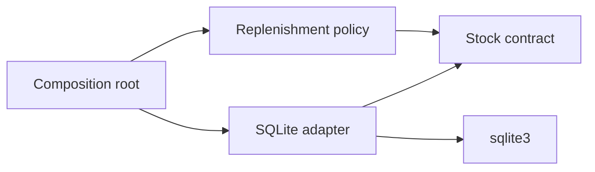
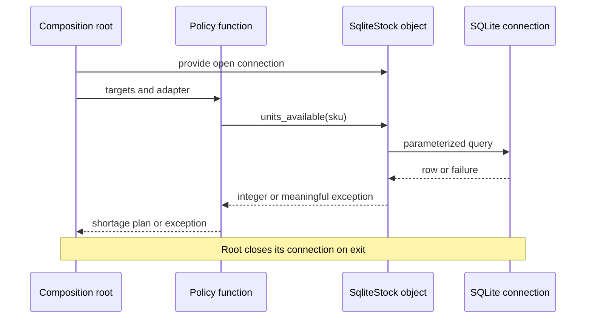

# SDP-SOL-050 — Dependency Inversion Principle

## Physical Notebook Core

### Problem or change pressure

The rule for deciding how much stock to replenish should survive a change from a database
to a supplier feed. Today, importing that rule also imports the database implementation.

### One-sentence mental model

> Let the policy name what it needs, and make changeable details fit that need.

### One essential visual

```text
Source dependencies:  policy ──> policy's contract <── adapter
Runtime calls:        policy ───────────────────────> adapter
```

### How to read this visual

The top arrows mean “source code refers to.” The bottom arrow means “calls the supplied object.”

### Key insight

The source dependency changes direction; the policy can still call the detail at runtime.

### Simplification or limitation

Conceptual sketch, not memory layout. It omits setup, errors, and the driver. Structural
conformance need not create an explicit adapter import of the Protocol itself.

### Governing rules or invariants

1. Describe the policy's need without vendor types, database rows, or framework requests.
2. Keep concrete selection and resource ownership at the application boundary.
3. A compatible signature is not proof of correct behaviour, isolation, or reliability.

### Minimal Python example

```python
from collections.abc import Callable


def shortage(read_units: Callable[[str], int], sku: str, target: int) -> int:
    return max(0, target - read_units(sku))


stock = {"BOLT": 3}
assert shortage(stock.__getitem__, "BOLT", 8) == 5
```

### One common misconception

**Mistake:** “I passed a database client into the constructor, so I applied DIP.”

**Correction:** That is injection. Inspect what the policy imports, names, returns, and catches
before deciding whether its dependency on the implementation has been removed.

### Important trade-offs

- A small boundary isolates a real variation, but adds a contract and translation to maintain.
- Already-loaded data may be simpler than a collaborator. Do not abstract every ordinary value.

### Interview-revision cues

- Draw source arrows and call arrows separately.
- Identify who owns the contract and where objects are assembled.
- Explain injection without inversion, and why inversion does not repair an outage.

## Unit metadata

| Field | Value |
|---|---|
| Domain | SOLID principles |
| Curriculum | [SDP-SOL-050](../../../CURRICULUM.md#sdp-sol-050) |
| Progress | [PROGRESS.md](../../../PROGRESS.md) |
| Python references | [PYTHON_REFERENCES.md](../../../PYTHON_REFERENCES.md) |
| Learning outcome | Reverse source-code dependency direction around policy, and distinguish dependency inversion from injection, inversion of control, service location, and framework-managed dependencies. |
| Hard prerequisites | [SDP-FND-030](../../../CURRICULUM.md#sdp-fnd-030), [SDP-FND-070](../../../CURRICULUM.md#sdp-fnd-070), [SDP-FND-080](../../../CURRICULUM.md#sdp-fnd-080), [SDP-FND-100](../../../CURRICULUM.md#sdp-fnd-100) |
| Soft prerequisites | None added to the canonical curriculum |
| Priority | Core |
| Interview frequency | High |
| Production frequency | High |
| Python/backend relevance | High |
| Depth | D3 |
| Scope | SOLID, Architecture |
| Size | XL |
| First understanding | 6–9 h |
| Hands-on practice | 8–14 h |
| Evidence profile | E+I+D+T |
| Canonical Python | Python 3.14 |
| Interview compatibility | Python 3.11; supplied code uses the same syntax |
| Artifact state | Approved |

Frequency labels are curriculum judgments, not measured usage statistics. Generated material
does not prove learning. Begin with the [practice prediction](practice/README.md#prediction-before-running).
The [visual guide](visuals/README.md), [runnable example](examples/run_replenishment_demo.py), and
[import experiment](experiments/EXP-01-import-isolation/README.md) support the note.
The [maintainer validation record](VALIDATION.md) distinguishes artifact checks from learner evidence.

## 1. Simple explanation and prerequisite bridge

A workshop supervisor says, “Tell me how many bolts are available.” The supervisor should
not need to know a database table name or a supplier's response format. Someone must know
those details, but that knowledge can live in a small translator outside the replenishment rule.

The hard-prerequisite notes exist; their tracker rows do not establish learner understanding.
Use this minimum bridge before proceeding:

- **Coupling:** naming a concrete implementation ties your code to that implementation.
- **Contract:** the operations, inputs, outputs, errors, and behaviour a caller relies on.
- **Protocol:** a way to describe a structural contract to a type checker; matching providers
  need not inherit from it. [Typing specification](https://typing.python.org/en/latest/spec/protocol.html#explicitly-declaring-implementation).
- **Test seam:** an explicit place where a controlled collaborator can be supplied.
- **Import direction:** a module may import another module even if it never calls it in a test.
  Imported packages can also bring transitive dependencies and initialization work.

If you can trace “policy needs stock → caller supplies a reader → reader returns an integer,”
you have enough to start. The exact Python prerequisite is linked in section 26.

## 2. Real problem and forces

A small stock script queries SQLite, compares each quantity with a target, and prints shortages.
That is a reasonable starting point when the script is tied to one local database.

Now the same rule must work in an offline simulation and against a supplier's different store.
The **stable policy** is the shortage calculation and its treatment of invalid targets.
The **changing detail** is how stock is obtained. Copying the rule into each integration
would duplicate decisions; dragging the database driver into every policy test would make
the dependency boundary harder to see.

There is also a semantic constraint: “SKU unknown” and “source unavailable” must not become
“zero units.” That shortcut would invent an order quantity from missing information.

## 3. History and original context

Robert C. Martin's 1996 article frames DIP around the difficulty of changing and reusing
policy when it depends on implementation details. It discusses C++ structure and also
recognizes abstraction without classes. Our Python modules and examples are original
adaptations; C++ header and recompilation costs are not Python import behaviour.
[Original article, “The Dependency Inversion Principle” and “Layering”](https://www.cs.utexas.edu/~downing/papers/DIP-1996.pdf).

## 4. Formal definition and the five different questions

DIP asks policy and implementation to meet through abstractions, with implementation
details conforming to those abstractions instead of defining what policy must depend on.
The protected direction is a **source-code dependency**, not the direction of every call.
[Martin, original formulation](https://www.cs.utexas.edu/~downing/papers/DIP-1996.pdf).

| Concept | Question it answers | Small example |
|---|---|---|
| Dependency inversion | What may policy depend on? | Policy names a stock-reading contract |
| Dependency injection | Who supplies a collaborator? | The caller passes a reader argument |
| Inversion of control | Who controls an aspect of execution or assembly? | An event loop invokes your handler |
| Service location | Who looks up a collaborator? | The consumer asks a registry for a reader |
| Framework-managed dependencies | Which tool performs wiring and lifecycle work? | Framework setup selects and supplies an adapter |

Fowler distinguishes injection from consumer lookup and explains why “IoC” needs a more
specific meaning in context. [Injection, IoC, and Service Locator](https://martinfowler.com/articles/injection.html).
The framework row is an architectural interpretation, not a promise about any named framework.

These are independent design questions. A locator can return a policy-shaped abstraction,
yet introduce a lookup dependency. A container can inject a concrete SDK client while the
policy remains tied to that SDK. Plain function calls can assemble a well-inverted boundary.

## 5. Participants and responsibilities

| Participant | Responsibility | Must not own |
|---|---|---|
| Replenishment policy | Validate targets and calculate shortages | SQL, driver setup, vendor response parsing |
| Stock contract | State the caller's operations and failure meanings | Database connections, cursors, SDK models |
| Memory adapter | Supply a stable snapshot of typed quantities | Replenishment targets |
| SQLite adapter | Query and translate one storage schema | The business shortage rule or connection lifetime |
| Composition root | Select implementations, open/close resources, call policy | A second copy of the policy |

“High level” means closer to the application's decisions; it does not mean the function
highest on today's call stack. A web entry point can be outer setup while the policy sits below it.

## 6. Source dependencies and execution flow



### How to read this visual

Each arrow means a source-level reference/import. The contract belongs with the policy's
needs. In the actual example, the adapter imports the contract's errors; its method matches
the Protocol structurally. The root connects both sides.

### Key insight

The policy and its contract have no path of imports to the SQLite adapter or driver.

### Simplification or limitation

Conceptual module map, omitting standard-library imports and the memory adapter. It is not
a claim that all dependencies in an application disappear or that every adapter subclasses a port.



### How to read this visual

Read top to bottom. These arrows are calls and returns. Policy calls the actual adapter
object directly; there is no Protocol instance forwarding the call.

### Key insight

An inward source dependency can coexist with a call from policy out to infrastructure.

### Simplification or limitation

The synchronous example reads stock only. It does not place orders, reserve stock, guarantee
one snapshot across queries, or model remote retries. An exception stops the current plan.

## 7. Before-pattern code and concrete pain

For already-loaded values, begin with the obvious calculation:

```python
current = {"BOLT": 3, "NUT": 8}
targets = {"BOLT": 8, "NUT": 5}
plan = {sku: target - current[sku] for sku, target in targets.items() if target > current[sku]}
assert plan == {"BOLT": 5}
```

The [concrete counterexample](examples/coupled_replenishment.py) moves object creation out
of the rule, but its parameter still names `SqliteStock` and its module imports `sqlite_stock`.
It is real dependency injection. It is also a concrete source dependency.

The calculation does not need SQL, yet importing the counterexample reaches `sqlite3`.
The [experiment](experiments/EXP-01-import-isolation/README.md) makes that consequence visible.
Merely changing an annotation while leaving concrete creation, vendor exceptions, or SDK
result types inside the policy would leave other dependencies behind.

## 8. Minimal Pythonic implementation

The notebook's callable is often sufficient: the policy states the operation it needs,
and the caller supplies a function or bound method. No factory hierarchy or container is needed.

Another simple option is to move all reads outside the calculation:

```python
def missing_units(current: int, target: int) -> int:
    if current < 0 or target < 0:
        raise ValueError("quantities must be nonnegative")
    return max(0, target - current)


assert missing_units(3, 8) == 5
assert missing_units(8, 5) == 0
```

This function has no infrastructure collaborator to invert. Choose it when the caller can
obtain the required data without changing the intended timing or memory cost of the operation.

## 9. Typed implementation and contract ownership

The full example separates the policy's named contract from storage modules:

- [stock_contract.py](examples/stock_contract.py): `StockLevels`, `UnknownSku`, `StockUnavailable`.
- [replenishment_policy.py](examples/replenishment_policy.py): calculations and target validation.
- [memory_stock.py](examples/memory_stock.py): a copied in-memory snapshot.
- [sqlite_stock.py](examples/sqlite_stock.py): parameterized SQL, row validation, and error translation.
- [run_replenishment_demo.py](examples/run_replenishment_demo.py): concrete setup and cleanup.

The contract promises a nonnegative integer for a known SKU. Unknown stock and an
untrustworthy read are distinct failures. Input targets and quantities use typed integer
APIs; this is not a general untrusted-input parser. The SQLite adapter validates storage
values because storage data can violate the expected schema.

The adapters need not inherit from `StockLevels`; their shape is checked when passed or
assigned to that boundary. [Typing specification, explicit and implicit implementation](https://typing.python.org/en/latest/spec/protocol.html#explicitly-declaring-implementation).
An annotation does not create a wrapper or runtime validator. Even `runtime_checkable`
would not verify signatures or these behavioural promises.
[Python 3.14 typing documentation](https://docs.python.org/3.14/library/typing.html#typing.runtime_checkable).

**Contract ownership is more than a folder name.** If `ports.py` returns a vendor SDK object,
inherits a vendor interface, exposes `execute_sql`, or imports its definitions through a
package initializer that loads the SDK, policy may still depend on the detail. Ask whose
requirements drive the contract. A separate contracts package can be reasonable when it has
no outward dependencies and its vocabulary remains policy-shaped.

## 10. Simpler alternatives and genuine costs

| Choice | Useful when | Cost or limit |
|---|---|---|
| Pass values | Calculation needs a small data snapshot | Caller owns when/how values are collected |
| Pass a callable | One operation describes the need | Behaviour and errors still need documentation |
| Use a small Protocol | A named role helps static checking and discovery | Another contract to maintain |
| Use an ABC | Explicit inheritance or shared behaviour is useful | Nominal coupling; not required for DIP |
| Use a composition framework | Wiring/lifetimes have demonstrated complexity | Configuration and debugging become additional work |

None of these choices automatically enforces dependency direction. A function can hardcode
a vendor; an ABC can import an SDK; a container can inject the wrong abstraction.

## 11. Refactoring path

1. Protect the existing observable rule with examples and failure tests.
2. Name the actual source of variation; do not start by extracting every class interface.
3. Describe the smallest operation, values, and failure meanings the policy needs.
4. Translate the current provider at the boundary, preserving its behaviour.
5. Move concrete construction and resource ownership to one explicit setup point.
6. Check imports and transitive dependencies as well as runtime calls.
7. Add the real second implementation and rerun policy and adapter-contract tests.
8. Remove abstractions that serve no remaining change pressure.

Moving imports into a function only delays when they execute; it does not remove the source
dependency. A type-check-only concrete import can avoid eager loading while leaving static
coupling. Import isolation is useful evidence, but it is not a complete definition of DIP.

## 12. Realistic backend use case

A scheduled replenishment job and an HTTP endpoint can call the same policy with different
adapters. The entry points own configuration and resource lifetime; the policy receives a
stock reader and returns plain domain values. A vendor schema change should normally affect
the adapter and its integration tests, not the shortage rule.

If the business rule changes from “available quantity” to “available quantity as of a required
snapshot,” that is a real contract change. DIP cannot make new semantics free. Revisit the
contract, consistency model, and both adapters rather than hiding the requirement in SQL.

Framework-managed wiring can live at the entry point without importing framework request
objects or dependency lookup APIs into the policy. This is a design recommendation; no
framework integration is installed or claimed to have been tested here.

## 13. Failure scenario and recovery judgment

Suppose a stock query fails and an adapter returns zero as a convenient fallback. The policy
now reports a shortage based on a fact nobody observed. A structurally compatible method has
violated the meaning of the contract.

The supplied SQLite adapter translates `OperationalError` into `StockUnavailable`, preserving
the original cause. A missing table demonstrates that this category is **not automatically
retryable**. A closed connection raises `ProgrammingError` rather than being disguised as an
ordinary outage. The policy does not return a partial plan when any read fails.

At an application boundary, record the failure, distinguish bad configuration from transient
conditions, and decide whether to stop, retry within a budget, or expose unavailability.
Never claim that dependency inversion creates rollback, idempotency, or guaranteed delivery.
This example places no external order, so it does not demonstrate those properties.

## 14. Testing strategy

| Test layer | What it establishes here | What it does not establish |
|---|---|---|
| Policy tests | Shortages, target validation, no empty-input reads, failure propagation | Real storage behaviour |
| Shared adapter tests | Known/zero/unknown quantities, Unicode, repeated non-destructive reads | Network or concurrency behaviour |
| SQLite integration tests | Actual query, malformed rows, error translation, resource misuse | Production schema migrations or availability |
| Import isolation experiment | Policy can run without the concrete driver in fresh processes | All possible dynamic or type-only dependencies |
| Strict static checking | Supplied adapters fit the declared Python types | Full semantics, latency, permissions, or reliability |

Use the [practice commands](practice/README.md#commands). Behavioural tests and source-boundary
checks complement one another: equal output alone cannot show that an import dependency moved.

## 15. Observability and debugging

When tracing a failure, follow request → policy → adapter → driver. Record a synthetic or
safe operation identifier, adapter kind, duration, and failure category at the appropriate
boundary. Do not record credentials, whole vendor payloads, or private inventories.

Inspect the exception cause for diagnosis without teaching the policy to catch driver-specific
errors. During a dependency review, inspect imports, constructor calls, parameter/return types,
exceptions, globals, and registry lookups. A clean-looking class diagram can omit all of these.

## 16. Lifetime, concurrency, and performance limits

The SQLite adapter borrows its connection. The composition root uses `contextlib.closing`
because a SQLite connection's own context manager handles transaction exit but does not close
the connection. This works with the supplied Python 3.11-compatible code.
[SQLite connection context manager](https://docs.python.org/3.14/library/sqlite3.html#how-to-use-the-connection-context-manager).

The memory adapter copies its input mapping; the SQLite adapter reads live storage. They share
the per-read contract, not snapshot timing. Multiple reads can disagree with a later write.
Injecting a single shared object does not give it thread safety or the right request lifetime.
Choose those guarantees explicitly when the application needs them.

The example issues one stock read per target, including zero targets so unknown SKUs are still
detected. For a large workload, measure whether batching is needed and define its partial-error
and consistency semantics. No performance improvement, benchmark, or memory saving is claimed.

## 19. Related patterns and the next unit

| Related unit | Relationship | Distinction |
|---|---|---|
| [SDP-SOL-040](../../../CURRICULUM.md#sdp-sol-040) | Shape a contract around a client's needs | ISP concerns irrelevant obligations; DIP concerns dependency direction |
| [SDP-SOL-030](../../../CURRICULUM.md#sdp-sol-030) | Require honest adapter behaviour | LSP checks substitution promises, not just imports |
| [SDP-SOL-020](../../../CURRICULUM.md#sdp-sol-020) | Add implementations at stable boundaries | OCP concerns extension under a selected change |
| [SDP-STR-010](../../../CURRICULUM.md#sdp-str-010) | Translate an incompatible provider | Adapter is a mechanism; DIP is a design principle |
| [SDP-APP-010](../../../CURRICULUM.md#sdp-app-010) | Assemble object graphs and own lifetimes | That later unit goes deeper into injection and composition roots |
| [SDP-RAR-050](../../../CURRICULUM.md#sdp-rar-050) | Compare explicit passing with lookup | A locator adds a retrieval dependency |
| [SDP-ARC-020](../../../CURRICULUM.md#sdp-arc-020) | Extend these boundaries across an application | Hexagonal architecture has a wider scope than this unit |
| [SDP-SOL-060](../../../CURRICULUM.md#sdp-sol-060) | Judge interacting principles and tensions | Next unit; it is not initialized by this material |

For the next unit, carry one tension: adding a narrow stock port may improve DIP and ISP,
while an excessively fragmented design makes a simple calculation harder to follow.

## 20. When to use it, and when to stop

Use this boundary when provider variation, independent policy tests, optional infrastructure,
or a stable business vocabulary creates a concrete need. Stop when the remaining coupling
is acceptable and another abstraction would not protect a demonstrated concern.

Do not create an interface for `int`, every dataclass, or every standard-library call. A small,
single-purpose database script can reasonably stay database-specific. Dependencies are not
bad by definition; decide which decisions need protection from which changes.

## 22. Common misuse and overengineering

| Misuse | Remaining problem | Better move |
|---|---|---|
| Inject a concrete SDK client and declare DIP complete | Policy still names vendor types or operations | Inspect the consumer's actual need |
| Copy an entire SDK into a Protocol | Vendor vocabulary becomes the “abstraction” | Express the small business operation |
| Put the port beside policy but import ORM models into it | Folder location disguises a source dependency | Return domain values and translate outside |
| Hide dependencies in a global container | Readers must inspect lookup calls and setup order | Pass the actual collaborator where feasible |
| Build a factory registry and base class for one local calculation | Maintenance cost without a change pressure | Keep a function, values, or a direct dependency |
| Return empty data after an outage | Failure becomes invented business information | Preserve a meaningful error outcome |
| Equate passing tests with correct architecture | Runtime checks can miss source coupling | Review the dependency graph too |

## 23. Interview preparation

Use one question at a time in an interactive interview. Begin with:

**“A service receives `SqliteStock` through its constructor. What would you inspect before
calling that dependency inversion?”**

After an answer, identify the first missing reasoning step before offering the next question.
Follow-ups can examine contract ownership, a vendor-shaped return value, a service locator,
framework wiring, a source outage, or a change that makes the existing abstraction insufficient.

Weak-answer traps include memorizing “depend on abstractions,” claiming constructors guarantee
DIP, saying Protocol creates runtime indirection, declaring all locators untestable, and
promising every future provider will fit without changing the contract.

A strong answer connects the change pressure to imports, contract semantics, concrete setup,
a simpler alternative, and evidence that the proposed boundary helps.

## 24. Closed-book revision cues

1. Draw source and runtime arrows with different meanings.
2. State a client-shaped contract, including unknown data and unavailable data.
3. Explain why injection and inversion are different questions.
4. Locate a hidden vendor dependency in a type, exception, or package initializer.
5. Choose values, a callable, or a Protocol for a new scenario and reject one alternative.
6. Explain why independent policy tests do not prove adapter reliability.

These are retrieval prompts, not recorded answers or evidence of recall.

## 25. Vocabulary and professional English

### Policy

| Item | Content |
|---|---|
| Pronunciation | POL-uh-see |
| Simple English meaning | A rule that guides a decision |
| Hindi cue | निर्णय का नियम |
| Design meaning | The application decision protected from implementation details |

Natural examples: “The library has a lending policy.” “Our policy requires a receipt.”
“The policy changed after review.” **Interview:** “The shortage rule is the policy.”
**Engineering:** “Keep the provider's response format outside this policy.”

### Inversion

| Item | Content |
|---|---|
| Pronunciation | in-VER-zhun |
| Simple English meaning | Reversing a usual direction or arrangement |
| Hindi cue | दिशा उलटना |
| Design meaning | Making implementation details conform to the policy boundary |

Natural examples: “The diagram shows an inversion.” “Check what changed direction.”
“An inversion needs a stated reference point.” **Interview:** “The source dependency is
inverted; the method call still goes to the adapter.” **Engineering:** “Show the imports
before and after the inversion.”

## 26. Python Mastery reference

The exact hard Python reference from [PYTHON_REFERENCES.md](../../../PYTHON_REFERENCES.md) is
[PY-TYP-050 — Protocols, ABCs, and structural versus nominal typing](https://github.com/rahulyadev/python-mastery/blob/main/CURRICULUM.md#py-typ-050).
Know the difference between runtime duck typing, a static Protocol, and explicit ABC
inheritance/registration. This is a navigation reference, not a source claimed to have been
read for the unit. No cross-repository completion is assumed.

## 27. Authoritative sources

Sources opened and read for this material; prose, examples, and visuals are original.

1. [Robert C. Martin, The Dependency Inversion Principle](https://www.cs.utexas.edu/~downing/papers/DIP-1996.pdf): original formulation, layering, and original language context.
2. [Martin Fowler, Inversion of Control Containers and the Dependency Injection pattern](https://martinfowler.com/articles/injection.html): IoC, injection, service location, and configuration versus use.
3. [Python typing specification: Protocols](https://typing.python.org/en/latest/spec/protocol.html#explicitly-declaring-implementation): implicit conformance and explicit inheritance.
4. [Python 3.14: Protocol and runtime_checkable](https://docs.python.org/3.14/library/typing.html#typing.Protocol): static roles and limits of runtime checks.
5. [Python import reference: module cache](https://docs.python.org/3.14/reference/import.html#the-module-cache): the isolated experiment's import control.
6. [Python sqlite3: connection context manager](https://docs.python.org/3.14/library/sqlite3.html#how-to-use-the-connection-context-manager): cleanup versus transaction behaviour.

No CPython memory-layout explanation is needed for DIP. Runtime observations, design
judgments, and typing guarantees are identified separately throughout the unit.
