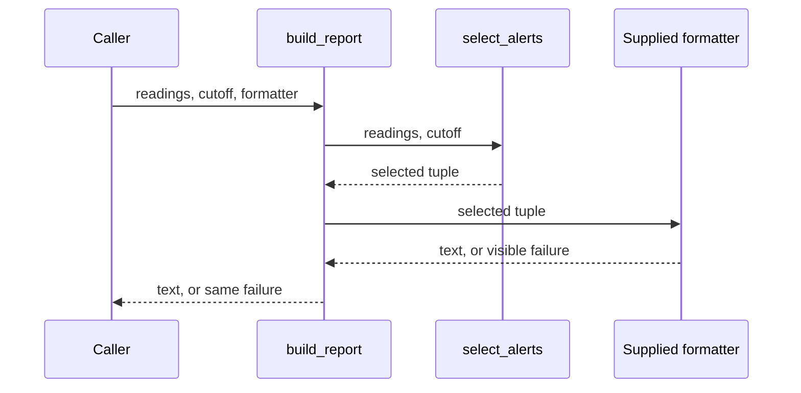

# SDP-SOL-060 — SOLID interactions, tensions, and trade-offs

## Physical Notebook Core

### Problem or change pressure

A report needs another output format. One engineer proposes five interfaces; another edits
the existing function. Decide which change needs protection and which behaviour must survive.

### One-sentence mental model

> Use SOLID to ask five questions about one change, then make the smallest safe move.

### One essential visual

```text
real change → affected client → promises to preserve → smallest boundary → evidence
                SRP / ISP             LSP                 OCP / DIP
```

### How to read this visual

Read left to right. Arrows mean reasoning order; the principle labels suggest questions,
not mandatory implementation steps.

### Key insight

A new extension point is useful only when its replacements preserve the caller's promises.

### Simplification or limitation

Conceptual decision sketch, not runtime flow. Each principle can matter at several steps.

### Governing rules or invariants

1. Name the actual change and the affected client before naming a principle.
2. Preserve promised results, errors, ordering, state effects, and lifecycle behaviour.
3. Count contracts and coordination added, not just lines or classes removed.

### Minimal Python example

```python
def alerts(readings: tuple[int, ...], cutoff: int) -> tuple[int, ...]:
    return tuple(value for value in readings if value >= cutoff)


assert alerts((29, 35, 30), 30) == (35, 30)
```

Keep the selection rule here. Let the caller format the returned data until a reusable
formatting boundary has a concrete purpose.

### One common misconception

**Mistake:** “More interfaces means a more SOLID design.”

**Correction:** A small interface can still expose the wrong dependency or an unsafe promise.

### Important trade-offs

- An extension point localizes a known variation but creates a contract to maintain.
- Separate client capabilities without scattering the state that must change together.

### Interview-revision cues

- Which principle is under pressure, and what observable fact supports that diagnosis?
- What would fail after the proposed replacement?
- What can stay as a direct function call?

## Unit metadata

| Field | Value |
|---|---|
| Domain | SOLID principles |
| Curriculum | [SDP-SOL-060](../../../CURRICULUM.md#sdp-sol-060) |
| Progress | [PROGRESS.md](../../../PROGRESS.md) |
| Python references | [PYTHON_REFERENCES.md](../../../PYTHON_REFERENCES.md) |
| Learning outcome | Diagnose which principle is truly under pressure, explain tensions among principles, and choose the smallest coherent refactoring. |
| Hard prerequisites | [SDP-SOL-010](../../../CURRICULUM.md#sdp-sol-010), [SDP-SOL-020](../../../CURRICULUM.md#sdp-sol-020), [SDP-SOL-030](../../../CURRICULUM.md#sdp-sol-030), [SDP-SOL-040](../../../CURRICULUM.md#sdp-sol-040), [SDP-SOL-050](../../../CURRICULUM.md#sdp-sol-050) |
| Soft prerequisites | None added to the canonical curriculum |
| Priority | Core |
| Interview frequency | High |
| Production frequency | High |
| Python/backend relevance | High |
| Depth | D3 |
| Scope | SOLID, Design |
| Size | L |
| First understanding | 4–6 h |
| Hands-on practice | 5–9 h |
| Evidence profile | E+D+T |
| Canonical Python | Python 3.14 |
| Interview compatibility | Python 3.11; supplied code uses the same syntax |
| Artifact state | Draft |

The frequency labels are curriculum judgments, not measured statistics. The optional
experiments support the canonical E+D+T profile without changing it. Generated files and
maintainer test runs do not establish learner progress.

Use the [visual guide](visuals/README.md), [worked example](examples/run_alert_demo.py),
[practice brief](practice/README.md), [shape experiment](experiments/EXP-01-compatible-shape/README.md),
and [split-operation experiment](experiments/EXP-02-split-operation/README.md).

## 1. Simple explanation and prerequisite bridge

Imagine changing a restaurant menu. The cook's recipe, the printed menu, and the payment
system have different reasons to change. Separating them can help. Splitting every cooking
step into a separate department can make a simple meal harder to coordinate.

Software has the same problem: useful separation needs a reason and a sensible stopping point.
SOLID supplies questions about boundaries; it does not award points for creating classes.

All five prerequisite notes exist. Their progress rows do not establish that Rahul has
studied them. This minimum bridge is enough to begin:

- **SRP:** which business responsibility causes these pieces to change together?
- **OCP:** which known variation should fit without rewriting the stable rule?
- **LSP:** can a replacement keep the promises that existing callers rely on?
- **ISP:** what capability does this particular client need?
- **DIP:** does the policy name its need, or depend on the chosen implementation's details?

These are shorthand questions, not complete definitions. For Python, know that functions
can be passed as values, two names can refer to the same mutable list, and a Protocol checks
structural type compatibility rather than business correctness. No metaclass knowledge is needed.

## 2. Real problem and forces

Our worked example reports temperature readings at or above a cutoff. Initially one script
produces one human-readable format. Combining filtering and formatting is reasonable.

Now a dashboard needs JSON, an operator wants shorter text, and an existing consumer still
expects the old wording. The selection rule must remain stable while presentation varies.
The report also promises acquisition order, duplicate preservation, and no input mutation.

These are different forces:

- Independent changes to selection and presentation suggest an SRP boundary.
- Recurring format additions suggest an OCP extension point.
- Replacements must preserve the agreed semantic contract: an LSP question.
- Report generation needs one formatting operation: an ISP question about the client.
- The policy should not import each concrete formatter: a DIP question about source direction.

One small callable boundary can answer several questions. It does not require five artifacts.

## 3. Original context and modern interpretation

Martin's DIP article explicitly connects substitution failures with the need for client
type checks, and connects that pressure with OCP. It also discusses abstraction without
classes. The original setting includes C++ dependencies; Python does not inherit C++ header
or recompilation mechanics. [DIP, introduction and device independence](https://www.cs.utexas.edu/~downing/papers/DIP-1996.pdf).

This unit's decision procedure and scenarios are original engineering guidance, not a formal
theorem that maximizes five independent quantities. Most apparent conflicts disappear when
the client, change axis, and contract are made explicit; remaining costs still require judgment.

## 4. Formal definitions and diagnostic questions

| Principle | Precise concern | Evidence to look for | What does not prove a violation |
|---|---|---|---|
| SRP | Group a module around a coherent reason for change; separate independently driven responsibilities. | Presentation changes repeatedly disturb a selection rule. | A class has several methods. |
| OCP | Protect selected stable behaviour from a chosen family of extensions. | Adding another format repeatedly edits the selection algorithm. | An ordinary conditional exists. |
| LSP | A claimed behavioural subtype preserves properties that clients can rely on through the supertype contract. | Same call now mutates input, rejects a formerly valid case, or returns an acknowledgement instead of a finished result. | Two implementations use different algorithms. |
| ISP | Avoid forcing a client to depend on capabilities it does not use. | Read-only clients inherit administrative lifecycle obligations. | One implementation serves more than one client role. |
| DIP | Policy and details depend on suitable abstractions; those abstractions do not encode the details they should isolate. | A policy import, annotation, result, or exception names a vendor implementation. | A function calls an injected concrete object at runtime. |

SRP is about coherent change responsibility, not method count.
[Martin's SRP explanation](https://blog.cleancoder.com/uncle-bob/2014/05/08/SingleReponsibilityPrinciple.html).
OCP concerns stable boundaries and extension; choosing the particular axis is our contextual
design decision. [Martin's OCP discussion](https://blog.cleancoder.com/uncle-bob/2014/05/12/TheOpenClosedPrinciple.html).

Liskov and Wing define subtyping through preserved behavioural properties; compatible
signatures alone are insufficient. Our callable examples apply that substitution reasoning
to Python collaborators without requiring inheritance.
[Liskov and Wing, introduction](https://www.cs.cmu.edu/~wing/publications/LiskovWing94.pdf).
ISP concerns client-facing interfaces; it can coexist with shared implementation state.
[ISP, client forces and class versus object interfaces](https://d3s.mff.cuni.cz/f/teaching/nprg043/extras/martin96-interface_segregation_principle.pdf).
The DIP definition covers source dependencies, not just argument passing.
[DIP, general form](https://www.cs.utexas.edu/~downing/papers/DIP-1996.pdf).

### Important interactions and tensions

| Interaction | Useful combination | Overapplication or tension | Coherent response |
|---|---|---|---|
| SRP + OCP | Separate an independently changing format from selection. | Invent extension points for unrequested features. | Start with direct calls; add the seam when the variation is real. |
| OCP + LSP | Add interchangeable implementations behind a stable promise. | An extension changes what success, failure, or completion means. | Reject the substitution or explicitly change/version the contract and its callers. |
| ISP + SRP | Expose different capabilities to different clients. | Split every method into a new state-owning object. | Keep a coherent implementation; expose only the operations each client needs. |
| ISP + invariants | Hide irrelevant operations while preserving a meaningful operation. | Expose “check” and “consume” separately even though their combination must be protected. | Put invariant enforcement at the state owner, with real synchronization if required. |
| DIP + ISP | Make the contract small and expressed in the client's vocabulary. | Copy the vendor SDK into a large supposedly neutral Protocol. | Keep only client needs; translate vendor data and errors outside policy. |
| DIP + OCP | Let a new detail fit without importing it into the stable policy. | Freeze a poorly understood abstraction because changing it feels forbidden. | Correct the abstraction deliberately; update callers and compatibility tests. |
| SRP + shared state | Keep related invariants together. | Decompose a local operation into services that must coordinate every update. | Separate responsibilities without assuming separate processes or databases. |

A broken promise is not a harmless “trade-off” while continuing to claim substitutability.
Changing the promise can be valid, but it is a contract migration. There is no universal
priority ranking of the five principles and no numerical SOLID score in this unit.

## 5. Participants and responsibilities

| Participant | Responsibility | What it must not own |
|---|---|---|
| Caller/composition point | Choose cutoff, data, formatter, and output destination. | Duplicate selection decisions in each format. |
| `select_alerts` | Select readings using the agreed inclusive cutoff. | JSON keys, text layout, or persistence. |
| `build_report` | Pass the selected snapshot to one supplied formatter. | Discover plugins or identify formatter classes. |
| Formatter | Represent every selected reading using its chosen syntax. | Re-select, silently drop duplicates, or change source data. |
| Contract tests and reviewer | Check promises and justify the boundary. | Treat type checking or class counts as design proof. |

The data contract permits empty input, negative temperatures, and duplicate readings. It
preserves encounter order. Formatting syntax differs intentionally; interchangeable does
not mean byte-identical output across text and JSON. Legacy text has its own exact contract.

## 6. Collaboration and execution flow



### How to read this visual

Read downward. Solid arrows are conceptual calls; return arrows show results or propagated
failure. The caller selects the implementation before the report runs.

### Key insight

The selection policy never needs to ask which formatter it received.

### Simplification or limitation

This models the supplied synchronous functions. It omits Python stack details, external I/O,
and scheduling. The formatter can fail; the diagram is not a retry or delivery guarantee.

Source references are a different view: `alert_formats.py` imports `Reading` from
`alert_policy.py`; policy imports no formatter module. The entry point imports both.
Runtime calls still travel from report generation to the selected formatting function.

## 7. Before-pattern code and concrete pain

The runnable [baseline](examples/coupled_alerts.py) keeps selection and one format together:

```python
def text_report(readings: Sequence[Reading], cutoff: int) -> str:
    return "\n".join(
        f"reading={row.station}, temperature={row.celsius} C"
        for row in readings
        if row.celsius >= cutoff
    )
```

The imports and `Reading` definition are in the linked files. This is not wrong merely
because there is no interface. The pain begins when the same selection rule is copied into
JSON and short-text implementations, or each presentation change edits this policy function.

First preserve the original string contract. Changing the wording while extracting a
formatter mixes a behaviour change with a refactoring. The runnable `legacy_format` keeps
the old output while the new formats are selected explicitly.

## 8. Minimal Pythonic implementation

```python
def build_report(
    readings: Sequence[Reading],
    cutoff: int,
    formatter: Callable[[tuple[Reading, ...]], str],
) -> str:
    return formatter(select_alerts(readings, cutoff))
```

See [alert_policy.py](examples/alert_policy.py) for the complete implementation and
[alert_formats.py](examples/alert_formats.py) for the concrete functions. This is the
collaboration often described as Strategy, expressed as an ordinary Python callable.
No strategy superclass, factory, registry, or dependency-injection container is necessary.

The separate [dispatch practice](practice/README.md) concerns completion semantics and
capabilities. It is deliberately not a renamed copy of this solved formatting example.

## 9. Typed implementation and contract limits

The runnable implementation already uses explicit types. `Reading` has named `station` and
`celsius` fields, and validates that a station is not blank. Integers are the typed input
contract; this is not a parser for arbitrary JSON values, floats, or booleans. Validate those
at an actual input boundary rather than pretending annotations perform runtime validation.

Passing a tuple prevents a formatter from reordering the supplied collection in place.
The frozen dataclass blocks normal field reassignment; it is not a security boundary or a
general deep-freezing facility. Here its fields are strings and integers.
[Dataclasses: frozen instances](https://docs.python.org/3.14/library/dataclasses.html#frozen-instances).

A callable type is enough for this single operation. A named Protocol may become useful
when a genuine client role needs a richer signature or several related operations. Structural
implementations need not inherit from that Protocol.
[Typing specification: defining and implementing protocols](https://typing.python.org/en/latest/spec/protocol.html#explicitly-declaring-implementation).

Types do not express all the relevant promises. A formatter could drop half the readings,
leak data, or return a misleading result while retaining the right type. Tests and review
must cover semantics; caller-owned mutable state also needs explicit ownership reasoning.

## 10. Simpler alternatives and stopping points

| Design | Good fit | Cost or stopping rule |
|---|---|---|
| One direct function | One stable format, one caller, no independent change pressure. | Keep it until change evidence says otherwise. |
| Return selected data; format at caller | Callers already own presentation. | May eliminate the need for `build_report` entirely. |
| Pass one function | The report pipeline is reused with different formatters. | Maintain the callable's semantic contract. |
| Named Protocol | A meaningful role needs an explicit structural type. | Do not wrap every function just for a name. |
| Stateful object | A formatter genuinely owns configuration or resources. | Define lifetime, cleanup, and concurrency obligations. |
| Plugin framework | Independently distributed extensions require discovery and lifecycle management. | Much larger operational scope; unsupported by this example's requirements. |

Changing a small, well-tested conditional can be cheaper than maintaining an extension
framework. Prefer an abstraction that removes observed coupling, not hypothetical discomfort.

## 11. Refactoring path and decision record

1. Write the change request without pattern names: “Add JSON without changing legacy text.”
2. Identify the affected client and observable promises, including empty/error cases.
3. Characterize those promises before editing structure.
4. Separate selection from representation; preserve legacy output exactly.
5. Decide whether a direct call, returned data, or injected callable is enough.
6. Add the new implementation and test the shared semantic contract plus its own format.
7. Review source dependencies, state ownership, and how many contracts now need coordination.
8. Stop when the current requirement is supported clearly; remove speculative machinery.

A compact decision record should name **force → evidence → selected boundary → rejected
alternative → cost → trigger to reconsider**. Example: recurring formats → duplicated
filtering → callable after selection → reject a plugin registry → maintain format contracts
→ reconsider when extensions must be discovered outside the application release.

This is professional judgment. It is not a measured complexity formula.

## 12. Backend transfer

Consider a report endpoint that reads data, applies rules, writes an audit record, and sends
a response. Separate the request parser, business rule, and representation when their change
pressures justify it. Keep explicit orchestration; splitting each line into an object merely
hides the sequence.

Ask what “completed” means. Generated text, accepted delivery, durable storage, and confirmed
delivery are different events. A callback returning a string does not make external work
reliable. A new background workflow may require a changed response contract instead of a
drop-in implementation. No framework or network service is needed to learn that distinction.

## 13. Failure scenarios

**Same type, different state effects.** A maximum-reading implementation sorts its input
list. The maximum is correct, but another consumer's “last acquired reading” changes. LSP
reasoning catches the broken non-mutation promise; adding more OCP extension points does not.
Run [EXP-01](experiments/EXP-01-compatible-shape/README.md). Python's `list.sort()` changes
the existing list; `sorted()` creates a new list.
[Sorting basics](https://docs.python.org/3.14/howto/sorting.html#sorting-basics).

**Tiny operations, broken collaboration.** Two consumers each check one available token,
then both consume it. Individual methods look small while their collaboration violates
capacity. Run [EXP-02](experiments/EXP-02-split-operation/README.md). Client segregation is
not permission to move an invariant into every caller.

**Invisible failure.** Catching a formatter exception and returning empty text would confuse
“no alerts” with “could not produce the report.” The worked example propagates the failure.
Production adapters can translate known errors, but must preserve their meaning.

## 14. Testing strategy

| Evidence | What it establishes | Important limit |
|---|---|---|
| Legacy-output tests | The old representation survives the structural change. | They do not validate the new format. |
| Selection tests | Inclusive cutoff, order, duplicates, empty input, and negative temperatures. | They do not establish input parsing or sensor accuracy. |
| Formatter tests | Chosen syntax and the meaning of represented fields. | Different formats need not return equal bytes. |
| Replacement/contract tests | Relevant shared semantics across supported collaborators. | Passing a finite suite is not a proof for every implementation. |
| Failure tests | Failure remains visible instead of turning into valid-looking empty data. | No network, retries, or outage recovery is tested here. |
| Static checking | The supplied functions satisfy annotated type relationships. | It cannot prove non-mutation or business completion. |
| Source review | Stable policy does not name concrete formatters. | Tests alone do not prove a coherent design boundary. |

The experiment tests deliberately assert that bad examples exhibit bad behaviour. Their
green result validates the demonstration; it does not approve those implementations.
The practice tests characterize the old contract; the new exercise remains unsolved.

## 15. Observability and debugging

Start from a violated promise rather than an acronym. Record the selected operation, inputs
needed to reproduce it, output/error meaning, and state before/after. Use synthetic examples;
do not log private report contents or labels by default.

Ask: did the input meaning change, did an adapter translate incorrectly, did the implementation
break the contract, or did the caller assume a guarantee nobody promised? These are different
repairs. Tracing every helper call is not automatically useful observability.

## 16. Concurrency and state safety

ISP can narrow who sees an operation; it does not make that operation atomic. Keeping
`try_consume` on one object gives an invariant a clear owner, but production concurrency
still needs an implementation mechanism such as a suitable lock or atomic storage operation.

EXP-02 uses a deterministic schedule that interleaves whole calls only. No claim about
thread safety, distributed locking, or CPython bytecode atomicity follows from it.
Likewise, a tuple built from a changing external collection is not automatically a transactionally
consistent snapshot. The worked report assumes stable input during its synchronous call.

## 19. Related units and combinations

| Related unit | Relationship | Boundary of this unit |
|---|---|---|
| [SDP-SOL-010](../../../CURRICULUM.md#sdp-sol-010) | Responsibility and change ownership. | Use its diagnosis alongside the other principles. |
| [SDP-SOL-020](../../../CURRICULUM.md#sdp-sol-020) | Extension boundaries. | Decide which variation deserves protection. |
| [SDP-SOL-030](../../../CURRICULUM.md#sdp-sol-030) | Behavioural substitution. | Keep correctness promises when adding extensions. |
| [SDP-SOL-040](../../../CURRICULUM.md#sdp-sol-040) | Client-shaped capabilities. | Preserve state cohesion while narrowing dependencies. |
| [SDP-SOL-050](../../../CURRICULUM.md#sdp-sol-050) | Policy-owned dependencies. | Judge whether inversion is useful and semantically honest. |
| [SDP-SOL-070](../../../CURRICULUM.md#sdp-sol-070) | Next: functions, modules, Protocols, and ABCs. | Mechanism selection receives deeper treatment there. |
| [SDP-SOL-080](../../../CURRICULUM.md#sdp-sol-080) | Critique and legacy refactoring. | Broader incremental-repair work follows there. |

## 20. When to use this reasoning

- Several principles appear relevant and the team disagrees on the primary problem.
- A new implementation fits the type but changes behaviour that callers need.
- A refactoring increases the number of contracts without reducing concrete change pressure.
- A senior interview asks you to defend a boundary and reject a plausible alternative.

## 21. When not to introduce another abstraction

Keep the current direct design when the rule is small, the variation is speculative, and
existing tests make change safe. A stable boundary can still have multiple methods. A
localized bug fix can be the right response even when a larger redesign looks attractive.

## 22. Common misuse and overengineering

| Misuse | Why it fails | Better move |
|---|---|---|
| One class or Protocol for every verb. | Names and wiring grow while ownership becomes less clear. | Group around a real client and invariant. |
| An adapter turns “pending” into “ready.” | Translation fabricates a guarantee. | Expose or negotiate the actual completion semantics. |
| Inject a vendor client and declare DIP complete. | Policy may still name vendor schemas and exceptions. | Inspect source vocabulary as well as construction. |
| Replace every conditional with polymorphism. | The rule may be stable data selection rather than an extension axis. | Keep simple decisions where they belong. |
| Assert that Protocol conformance proves LSP. | Type compatibility omits many behavioural properties. | State and test the relevant promises. |
| Split a state transition across tiny services. | Coordination now carries the invariant and partial-failure cost. | Preserve ownership and choose a real consistency mechanism. |
| Freeze an incorrect interface under OCP. | Requirements changed the promise itself. | Make a deliberate, tested migration. |

## 23. Interview preparation

Ask one question at a time and wait for an answer. Begin with:

**“A second formatter was added without touching policy, but now the dashboard shows a
different latest reading. What evidence would you collect before proposing a refactor?”**

Then, only after reviewing the response, ask about input ownership, substitution promises,
whether an interface is needed, or how a new completion model changes the boundary.

Weak answers list all five principles without naming a failed promise, equate SRP with one
method, equate dependency injection with DIP, or claim a design is better because it has more
classes. A strong answer locates the first broken reasoning step, proposes a small observable
counterexample, chooses a repair, and explains one rejected alternative and its cost.

Use the independent [practice scenario](practice/README.md) for code review and transfer.
No model answer or progressive hint is provided before an attempt.

## 24. Closed-book revision cues

1. Reconstruct the notebook visual and explain what every arrow means.
2. Diagnose one symptom with a primary principle and one supporting principle.
3. Explain when OCP requires a contract migration rather than another implementation.
4. Show how ISP can preserve one shared state owner.
5. Separate source references, runtime calls, type compatibility, and behavioural promises.
6. Reject an abstraction and state the evidence that would make you reconsider.

These are study prompts, not recorded answers or a completed quiz.

## 25. Vocabulary and professional English

### Cohesive

| Item | Content |
|---|---|
| Pronunciation | koh-HEE-siv |
| Simple meaning | Parts belong together and support one purpose. |
| Hindi cue | एक उद्देश्य से जुड़ा हुआ |
| Design meaning | Operations share a responsibility or invariant worth keeping together. |

Examples: “The chapter feels cohesive.” “The group made a cohesive plan.” “These steps form
a cohesive routine.” **Interview:** “I kept the state transition cohesive.” **Engineering:**
“We can narrow the public capability without splitting its state owner.”

### Trade-off

| Item | Content |
|---|---|
| Pronunciation | TRAYD-off |
| Simple meaning | A benefit comes with a cost. |
| Hindi cue | लाभ के साथ आने वाली कीमत |
| Design meaning | Compare reduced change impact with added contracts, wiring, and operations. |

Examples: “The shorter route has a toll trade-off.” “The smaller bag trades capacity for
comfort.” “We discussed the trade-off before deciding.” **Interview:** “The seam reduces
format coupling but adds a contract.” **Engineering:** “This trade-off does not excuse
calling an acknowledgement a completed result.”

## 26. Python Mastery references

`PYTHON_REFERENCES.md` has no direct row for `SDP-SOL-060`. Do not invent one. The existing
prerequisite mappings provide these supporting references:

- Via `SDP-SOL-040` and `SDP-SOL-050`:
  [PY-TYP-050 — Protocols, ABCs, and structural versus nominal typing](https://github.com/rahulyadev/python-mastery/blob/main/CURRICULUM.md#py-typ-050).
  Minimum bridge: a matching structure can satisfy a Protocol without inheritance; behaviour
  still needs a contract.
- Via `SDP-SOL-030`:
  [PY-OBJ-010 — Classes, instances, methods, and construction](https://github.com/rahulyadev/python-mastery/blob/main/CURRICULUM.md#py-obj-010),
  [PY-OBJ-020 — Properties, encapsulation, and composition](https://github.com/rahulyadev/python-mastery/blob/main/CURRICULUM.md#py-obj-020),
  [PY-OBJ-030 — Inheritance, MRO, and super](https://github.com/rahulyadev/python-mastery/blob/main/CURRICULUM.md#py-obj-030).
  Minimum bridge: distinguish delegation from subclassing, and shared state from copied data.

These links are navigation references, not claims that the external lessons were read here
or studied by Rahul. No extra canonical prerequisites or progress entries are created.

## 27. Authoritative sources

Opened and read for this material on 2026-08-30:

1. [Martin, The Single Responsibility Principle](https://blog.cleancoder.com/uncle-bob/2014/05/08/SingleReponsibilityPrinciple.html): business change responsibility and cohesion.
2. [Martin, The Open Closed Principle](https://blog.cleancoder.com/uncle-bob/2014/05/12/TheOpenClosedPrinciple.html): extension and stable boundaries.
3. [Liskov and Wing, A Behavioral Notion of Subtyping](https://www.cs.cmu.edu/~wing/publications/LiskovWing94.pdf): introduction and limits of signature compatibility.
4. [Martin, The Interface Segregation Principle](https://d3s.mff.cuni.cz/f/teaching/nprg043/extras/martin96-interface_segregation_principle.pdf): client forces and shared implementations.
5. [Martin, The Dependency Inversion Principle](https://www.cs.utexas.edu/~downing/papers/DIP-1996.pdf): introduction, general form, and abstraction without classes.
6. [Python typing specification: protocols](https://typing.python.org/en/latest/spec/protocol.html): structural compatibility and explicit versus implicit implementation.
7. [Python 3.14 Sorting HOWTO](https://docs.python.org/3.14/howto/sorting.html#sorting-basics): in-place sorting versus a new sorted list.
8. [Python 3.14 dataclasses](https://docs.python.org/3.14/library/dataclasses.html#frozen-instances): frozen-instance limits.

Explanations, examples, diagrams, exercises, and design judgments are original. There are no
copied book diagrams, invented benchmarks, or CPython-internals claims. Approved notes may
be used under the [NotebookLM policy](../../../docs/NOTEBOOKLM.md); progress, raw attempts,
solutions, and maintainer run records are not an upload bundle.
